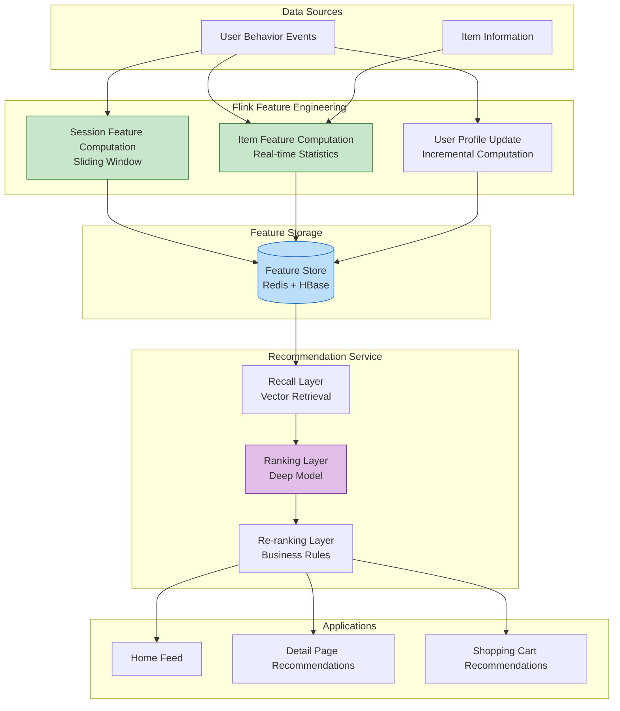
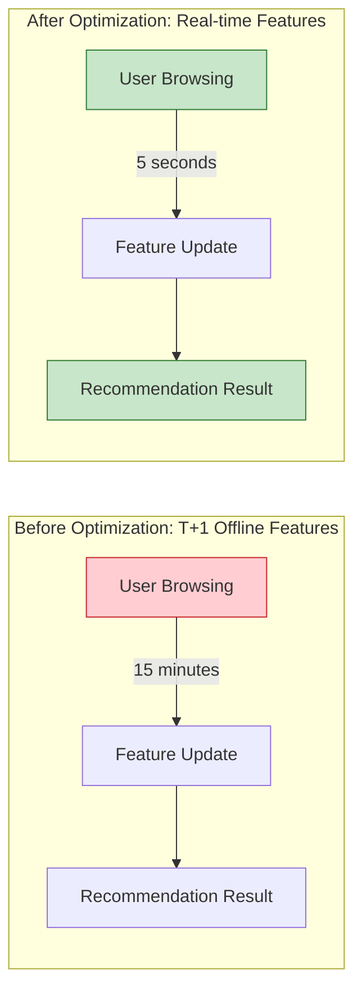

# E-commerce Case Study: Real-time Recommendation System

> **Stage**: Knowledge/10-case-studies/ecommerce | **Prerequisites**: [../../02-design-patterns/pattern-realtime-feature-engineering.md](../../02-design-patterns/pattern-realtime-feature-engineering.md) | **Formalization Level**: L4

---

## Table of Contents

- [E-commerce Case Study: Real-time Recommendation System](#e-commerce-case-study-real-time-recommendation-system)
  - [Table of Contents](#table-of-contents)
  - [1. Definitions](#1-definitions)
    - [1.1 Real-time Recommendation System Definition](#11-real-time-recommendation-system-definition)
    - [1.2 Recommendation Quality Metrics](#12-recommendation-quality-metrics)
    - [1.3 Feature Timeliness](#13-feature-timeliness)
  - [2. Properties](#2-properties)
    - [2.1 Feature Real-time Guarantee](#21-feature-real-time-guarantee)
    - [2.2 Recall-Ranking Latency Trade-off](#22-recall-ranking-latency-trade-off)
  - [3. Relations](#3-relations)
    - [3.1 Relationship with Feature Store](#31-relationship-with-feature-store)
    - [3.2 Recommendation System Component Relations](#32-recommendation-system-component-relations)
  - [4. Argumentation](#4-argumentation)
    - [4.1 Real-time vs. Offline Recommendations](#41-real-time-vs-offline-recommendations)
    - [4.2 Feature Engineering Strategy](#42-feature-engineering-strategy)
  - [5. Proof / Engineering Argument](#5-proof--engineering-argument)
    - [5.1 Feature Engineering Architecture](#51-feature-engineering-architecture)
    - [5.2 A/B Test Metrics Calculation](#52-ab-test-metrics-calculation)
  - [6. Examples](#6-examples)
    - [6.1 Case Background](#61-case-background)
    - [6.2 Implementation Results](#62-implementation-results)
    - [6.3 Technical Architecture](#63-technical-architecture)
  - [7. Visualizations](#7-visualizations)
    - [7.1 Real-time Recommendation System Architecture](#71-real-time-recommendation-system-architecture)
    - [7.2 Feature Timeliness Comparison](#72-feature-timeliness-comparison)
  - [8. References](#8-references)

---

## 1. Definitions

### 1.1 Real-time Recommendation System Definition

**Def-K-10-04-01** (Real-time Recommendation System): A real-time recommendation system is a quintuple $\mathcal{R} = (U, I, C, F, \mathcal{M})$:

- $U$: Set of users, $|U| = N_u$
- $I$: Set of items, $|I| = N_i$
- $C$: Context set (time, location, device, etc.)
- $F$: Feature engineering function, $F: U \times I \times C \rightarrow \mathbb{R}^d$
- $\mathcal{M}$: Recommendation model, $\mathcal{M}: \mathbb{R}^d \rightarrow \mathbb{R}^{N_i}$

### 1.2 Recommendation Quality Metrics

**Def-K-10-04-02** (Recommendation Effectiveness Metrics): Recommendation system effectiveness is measured by the following metrics:

| Metric | Definition | Formula |
|--------|------------|---------|
| **CTR** | Click-Through Rate | $\frac{\text{clicks}}{\text{impressions}}$ |
| **CVR** | Conversion Rate | $\frac{\text{conversions}}{\text{clicks}}$ |
| **GMV** | Gross Merchandise Value | $\sum \text{price} \times \text{quantity}$ |
| **Diversity** | Recommendation Diversity | $1 - \frac{\sum_{i,j} sim(i,j)}{N(N-1)/2}$ |

### 1.3 Feature Timeliness

**Def-K-10-04-03** (Feature Freshness): The freshness of feature vector $f(t)$ is defined as:

$$
Freshness(f) = e^{-\lambda \cdot (t_{current} - t_{update})}
$$

Where $\lambda$ is the decay coefficient; real-time features require $Freshness(f) > 0.9$.

---

## 2. Properties

### 2.1 Feature Real-time Guarantee

**Lemma-K-10-04-01**: Feature update latency $L_{feature}$ is positively correlated with recommendation effectiveness:

$$
CTR \propto \frac{1}{1 + \alpha \cdot L_{feature}}
$$

Where $\alpha$ is the scenario sensitivity coefficient.

### 2.2 Recall-Ranking Latency Trade-off

**Lemma-K-10-04-02**: Let recall latency be $L_{recall}$ and ranking latency be $L_{rank}$; total latency $L_{total}$:

$$
L_{total} = L_{recall} + L_{rank} \leq L_{SLA}
$$

**Thm-K-10-04-01**: When $L_{SLA} = 200$ms, the optimal resource allocation for recommendation effectiveness satisfies:

$$
\frac{\partial CTR}{\partial L_{recall}} = \frac{\partial CTR}{\partial L_{rank}}
$$

---

## 3. Relations

### 3.1 Relationship with Feature Store

```
Real-time Event Stream ──► Flink Feature Computation ──► Feature Store
                                     │                       │
                                     ▼                       ▼
                                Online Features         Offline Features
                                     │                       │
                                     └─────────┬─────────────┘
                                               ▼
                                         Recommendation Model Inference
```

### 3.2 Recommendation System Component Relations

| Component | Responsibility | Latency Requirement |
|-----------|----------------|---------------------|
| Recall Layer | Filter candidates from millions of items | < 50ms |
| Coarse Ranking Layer | Fast ranking of candidates (1000→100) | < 30ms |
| Fine Ranking Layer | Deep model ranking (100→10) | < 100ms |
| Re-ranking Layer | Diversity, business rule adjustments | < 20ms |

---

## 4. Argumentation

### 4.1 Real-time vs. Offline Recommendations

| Dimension | Real-time Recommendation | Offline Recommendation |
|-----------|--------------------------|------------------------|
| Feature Timeliness | Second-level | Hour/Day-level |
| CTR | High (+30%) | Baseline |
| Computation Cost | High | Low |
| Cold Start | Real-time response | Cannot respond |

### 4.2 Feature Engineering Strategy

**Real-time Features**:

- Current session behavior
- Real-time hot items
- Real-time inventory status

**Near Real-time Features** (Flink windows):

- Last 1 hour browsing statistics
- Real-time trend features

**Offline Features**:

- Long-term user profiles
- Item base attributes

---

## 5. Proof / Engineering Argument

### 5.1 Feature Engineering Architecture

```java
/**
 * Real-time feature engineering pipeline
 */

import org.apache.flink.streaming.api.environment.StreamExecutionEnvironment;
import org.apache.flink.streaming.api.datastream.DataStream;
import org.apache.flink.api.common.functions.AggregateFunction;
import org.apache.flink.streaming.api.windowing.time.Time;

public class RealtimeFeatureEngineering {

    public static void main(String[] args) throws Exception {
        StreamExecutionEnvironment env = StreamExecutionEnvironment.getExecutionEnvironment();
        env.enableCheckpointing(60000);
        env.setParallelism(128);

        // 1. User behavior events
        DataStream<UserEvent> events = env
            .fromSource(createKafkaSource(), WatermarkStrategy.noWatermarks(), "Events")
            .setParallelism(64);

        // 2. Real-time session features (sliding window)
        DataStream<SessionFeature> sessionFeatures = events
            .keyBy(UserEvent::getUserId)
            .window(SlidingProcessingTimeWindows.of(Time.minutes(10), Time.minutes(1)))
            .aggregate(new SessionFeatureAggregate())
            .name("Session Features")
            .setParallelism(128);

        // 3. Real-time item features
        DataStream<ItemFeature> itemFeatures = events
            .keyBy(UserEvent::getItemId)
            .window(SlidingProcessingTimeWindows.of(Time.minutes(5), Time.minutes(1)))
            .aggregate(new ItemFeatureAggregate())
            .name("Item Features")
            .setParallelism(256);

        // 4. User profile update
        DataStream<UserProfile> userProfiles = events
            .keyBy(UserEvent::getUserId)
            .process(new UserProfileUpdateFunction())
            .name("User Profile Update")
            .setParallelism(128);

        // 5. Write to Feature Store
        sessionFeatures.addSink(new FeatureStoreSink<>("session_features"));
        itemFeatures.addSink(new FeatureStoreSink<>("item_features"));
        userProfiles.addSink(new FeatureStoreSink<>("user_profiles"));

        env.execute("Realtime Feature Engineering");
    }
}

/**
 * Session feature aggregation
 */
class SessionFeatureAggregate implements AggregateFunction<UserEvent, SessionAccumulator, SessionFeature> {

    @Override
    public SessionAccumulator createAccumulator() {
        return new SessionAccumulator();
    }

    @Override
    public SessionAccumulator add(UserEvent event, SessionAccumulator acc) {
        acc.eventCount++;
        acc.uniqueItems.add(event.getItemId());

        switch (event.getEventType()) {
            case CLICK -> acc.clickCount++;
            case CART -> acc.cartCount++;
            case PURCHASE -> {
                acc.purchaseCount++;
                acc.totalAmount += event.getAmount();
            }
        }

        if (event.getAmount() > 0) {
            acc.totalAmount += event.getAmount();
        }

        return acc;
    }

    @Override
    public SessionFeature getResult(SessionAccumulator acc) {
        return SessionFeature.builder()
            .eventCount(acc.eventCount)
            .uniqueItemCount(acc.uniqueItems.size())
            .clickCount(acc.clickCount)
            .cartCount(acc.cartCount)
            .purchaseCount(acc.purchaseCount)
            .conversionRate(acc.clickCount > 0 ? (double) acc.purchaseCount / acc.clickCount : 0)
            .avgOrderValue(acc.purchaseCount > 0 ? acc.totalAmount / acc.purchaseCount : 0)
            .build();
    }

    @Override
    public SessionAccumulator merge(SessionAccumulator a, SessionAccumulator b) {
        a.eventCount += b.eventCount;
        a.clickCount += b.clickCount;
        a.cartCount += b.cartCount;
        a.purchaseCount += b.purchaseCount;
        a.totalAmount += b.totalAmount;
        a.uniqueItems.addAll(b.uniqueItems);
        return a;
    }
}
```

### 5.2 A/B Test Metrics Calculation

```sql
-- Flink SQL: Real-time CTR calculation
CREATE TABLE impression (
    user_id STRING,
    item_id STRING,
    experiment_id STRING,
    impression_time TIMESTAMP(3),
    WATERMARK FOR impression_time AS impression_time - INTERVAL '1' SECOND
) WITH (
    'connector' = 'kafka',
    'topic' = 'recommendation.impressions',
    'format' = 'json'
);

CREATE TABLE click (
    user_id STRING,
    item_id STRING,
    click_time TIMESTAMP(3)
) WITH (
    'connector' = 'kafka',
    'topic' = 'recommendation.clicks',
    'format' = 'json'
);

-- Real-time experiment metrics
CREATE TABLE experiment_metrics AS
SELECT
    experiment_id,
    TUMBLE_START(impression_time, INTERVAL '1' MINUTE) as window_start,
    COUNT(DISTINCT impression.user_id) as uv,
    COUNT(*) as impression_cnt,
    COUNT(DISTINCT click.user_id) as click_uv,
    COUNT(*) FILTER (WHERE click.user_id IS NOT NULL) as click_cnt,
    CAST(COUNT(*) FILTER (WHERE click.user_id IS NOT NULL) AS DOUBLE) / COUNT(*) as ctr,
    SUM(CASE WHEN click.user_id IS NOT NULL THEN 1 ELSE 0 END * item_price) as gmv
FROM impression
LEFT JOIN click ON impression.user_id = click.user_id
    AND impression.item_id = click.item_id
    AND click.click_time BETWEEN impression_time
        AND impression_time + INTERVAL '1' HOUR
GROUP BY experiment_id, TUMBLE(impression_time, INTERVAL '1' MINUTE);
```

---

## 6. Examples

### 6.1 Case Background

**Platform**: A leading e-commerce platform

| Metric | Value |
|--------|-------|
| DAU | 150 million |
| Item Count | 50 million+ |
| Daily PV | 10 billion+ |
| Recommendation Scenarios | Home Feed, Detail Page, Shopping Cart |

**Challenges**:

1. Poor feature timeliness; recommendation results lag behind user interest changes
2. Low conversion rate for cold-start users
3. Long A/B test feedback cycle
4. Delayed real-time trend capture

### 6.2 Implementation Results

| Metric | Before Optimization | After Optimization | Improvement |
|--------|---------------------|--------------------|-------------|
| Feature Latency | 15 minutes | < 5 seconds | 99.4%↓ |
| Home Page CTR | 3.2% | 4.8% | 50%↑ |
| Detail Page CVR | 8.5% | 11.2% | 32%↑ |
| Per-Capita GMV | ¥128 | ¥168 | 31%↑ |
| Cold Start CTR | 0.8% | 2.1% | 162%↑ |

### 6.3 Technical Architecture

```java
/**
 * Recommendation feature service
 */
@Component
public class RecommendationFeatureService {

    @Autowired
    private FeatureStoreClient featureStore;

    /**
     * Get user real-time features
     */
    public UserRealtimeFeatures getUserRealtimeFeatures(String userId) {
        // Query from Flink-computed real-time feature tables
        SessionFeature session = featureStore.get("session_features", userId);
        UserProfile profile = featureStore.get("user_profiles", userId);

        return UserRealtimeFeatures.builder()
            .recentCategories(session.getBrowsedCategories())
            .recentBrands(session.getBrowsedBrands())
            .pricePreference(profile.getPricePreference())
            .categoryAffinity(profile.getCategoryAffinity())
            .realtimeIntent(session.getCurrentIntent())
            .build();
    }

    /**
     * Get item real-time features
     */
    public ItemRealtimeFeatures getItemRealtimeFeatures(String itemId) {
        ItemFeature item = featureStore.get("item_features", itemId);

        return ItemRealtimeFeatures.builder()
            .realtimeCtr(item.getCtrLastHour())
            .realtimeCvr(item.getCvrLastHour())
            .stockStatus(item.getStockStatus())
            .trendScore(item.getTrendScore())
            .build();
    }
}
```

---

## 7. Visualizations

### 7.1 Real-time Recommendation System Architecture



### 7.2 Feature Timeliness Comparison



---

## 8. References


---

*Document Version: v1.0 | Last Updated: 2026-04-04*
