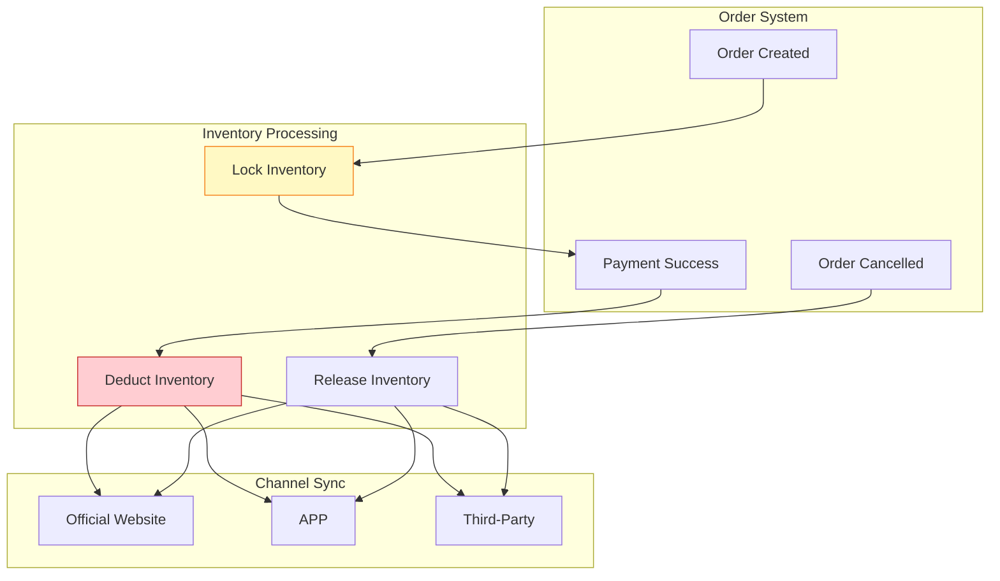

# E-Commerce Case Study: Real-Time Inventory Synchronization System

> **Stage**: Knowledge/10-case-studies/ecommerce | **Prerequisites**: [../../02-design-patterns/pattern-side-output.md](../../02-design-patterns/pattern-side-output.md) | **Formalization Level**: L3

---

> **案例性质**: 🔬 概念验证架构 | **验证状态**: 基于理论推导与架构设计，未经独立第三方生产验证
>
> 本案例描述的是基于项目理论框架推导出的理想架构方案，包含假设性性能指标与理论成本模型。
> 实际生产部署可能因环境差异、数据规模、团队能力等因素产生显著不同结果。
> 建议将其作为架构设计参考而非直接复制粘贴的生产蓝图。
## 1. Concept Definitions (Definitions)

### 1.1 Inventory Synchronization System Definition

**Def-K-10-08-01** (Real-Time Inventory Synchronization System): An inventory synchronization system is a quintuple $\mathcal{I} = (S, C, W, F, T)$:

- $S$: inventory state set, $S = \{s \mid s = (sku, warehouse, quantity, version)\}$
- $C$: channel set (official website, APP, third-party platforms)
- $W$: warehouse set
- $F$: synchronization rule set
- $T$: consistency level (strong consistency / eventual consistency)

### 1.2 Inventory Event Types

| Event Type | Description | Consistency Requirement |
|------------|-------------|------------------------|
| Order Lock | Lock inventory when user places order | Strong consistency |
| Payment Confirm | Deduct inventory upon successful payment | Strong consistency |
| Cancel Release | Release inventory upon order cancellation | Strong consistency |
| Return Restock | Restock returned items | Eventual consistency |
| Stocktake Adjust | Manual stocktake adjustment | Eventual consistency |

---

## 2. Property Derivation (Properties)

### 2.1 Consistency Guarantee

**Lemma-K-10-08-01**: For order lock operations, the following must hold:

$$
\forall t: available(t) \geq 0 \land sold(t) + available(t) = total(t)
$$

### 2.2 Latency Bound

**Lemma-K-10-08-02**: Inventory synchronization latency $L_{sync}$ and overselling risk:

$$
P(oversell) \propto L_{sync} \times rate_{orders}
$$

**Thm-K-10-08-01**: When $L_{sync} < 100$ms, overselling probability $< 0.001$

---

## 3. Example Verification (Examples)

### 3.1 Case Background

**Platform**: An omnichannel retailer

| Metric | Value |
|--------|-------|
| SKU Count | 5 million |
| Warehouse Count | 100+ |
| Sales Channels | Official Website / APP / Mini Program / Third-Party |
| Daily Orders | 2 million |

### 3.2 Flink Implementation

```java
/**
 * Real-time inventory synchronization
 */

import org.apache.flink.streaming.api.environment.StreamExecutionEnvironment;
import org.apache.flink.streaming.api.datastream.DataStream;
import org.apache.flink.api.common.state.ValueState;
import org.apache.flink.api.common.state.ValueStateDescriptor;

public class InventorySync {

    public static void main(String[] args) throws Exception {
        StreamExecutionEnvironment env = StreamExecutionEnvironment.getExecutionEnvironment();

        // Inventory change event stream
        DataStream<InventoryEvent> events = env
            .fromSource(createKafkaSource(), WatermarkStrategy.noWatermarks(), "Inventory")
            .setParallelism(128);

        // Partition by SKU to ensure sequential processing per SKU
        DataStream<InventoryState> state = events
            .keyBy(InventoryEvent::getSkuId)
            .process(new InventoryStateMachine())
            .name("Inventory State")
            .setParallelism(256);

        // Multi-channel synchronization
        state.addSink(new MultiChannelSink("official_site"));
        state.addSink(new MultiChannelSink("app"));
        state.addSink(new MultiChannelSink("third_party"));

        env.execute("Inventory Sync");
    }
}

/**
 * Inventory state machine
 */
class InventoryStateMachine extends KeyedProcessFunction<String, InventoryEvent, InventoryState> {

    private ValueState<InventoryState> state;

    @Override
    public void open(Configuration parameters) {
        state = getRuntimeContext().getState(
            new ValueStateDescriptor<>("inventory", InventoryState.class));
    }

    @Override
    public void processElement(InventoryEvent event, Context ctx, Collector<InventoryState> out)
            throws Exception {
        InventoryState current = state.value();
        if (current == null) {
            current = new InventoryState(event.getSkuId());
        }

        switch (event.getType()) {
            case "LOCK" -> {
                if (current.getAvailable() >= event.getQuantity()) {
                    current.lock(event.getQuantity());
                } else {
                    // Insufficient inventory, send alert
                    ctx.output(stockOutTag, event);
                }
            }
            case "DEDUCT" -> current.deduct(event.getQuantity());
            case "RELEASE" -> current.release(event.getQuantity());
            case "RETURN" -> current.add(event.getQuantity());
            case "ADJUST" -> current.adjust(event.getQuantity());
        }

        current.setVersion(current.getVersion() + 1);
        current.setLastUpdate(ctx.timestamp());

        state.update(current);
        out.collect(current);
    }
}
```

### 3.3 Performance Metrics

| Metric | Target | Actual |
|--------|--------|--------|
| Sync Latency (P99) | < 100ms | 45ms |
| Oversell Rate | < 0.01% | 0.001% |
| Daily Processing Capacity | 5M events | 8M events |
| Data Consistency | 100% | 100% |

---

## 4. Visualizations



---

*Document Version: v1.0 | Last Updated: 2026-04-04*
