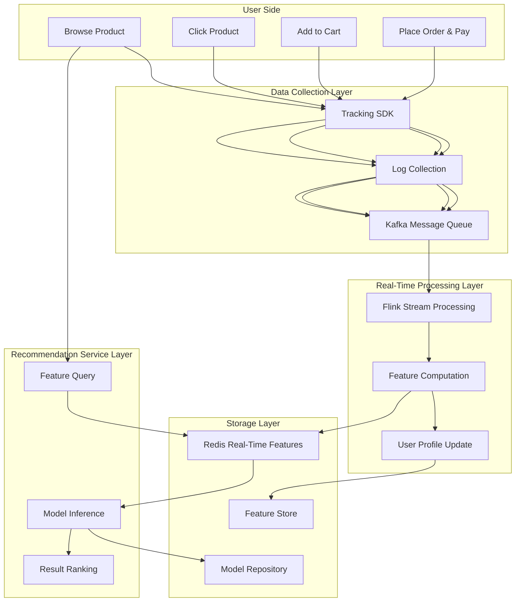
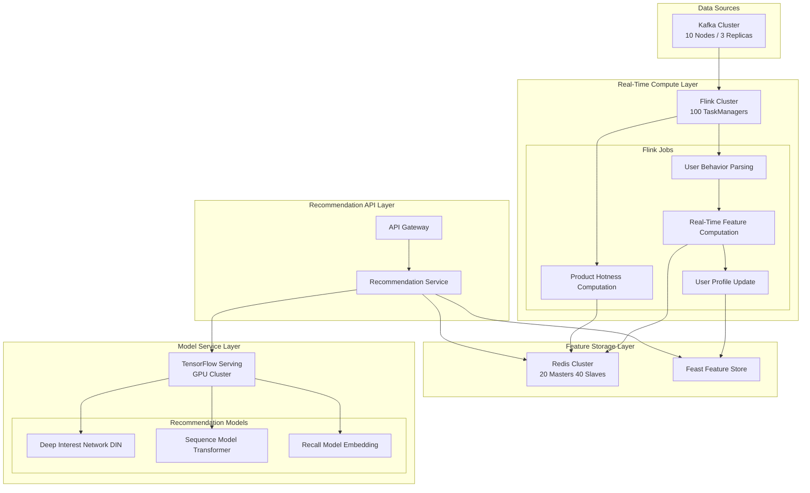
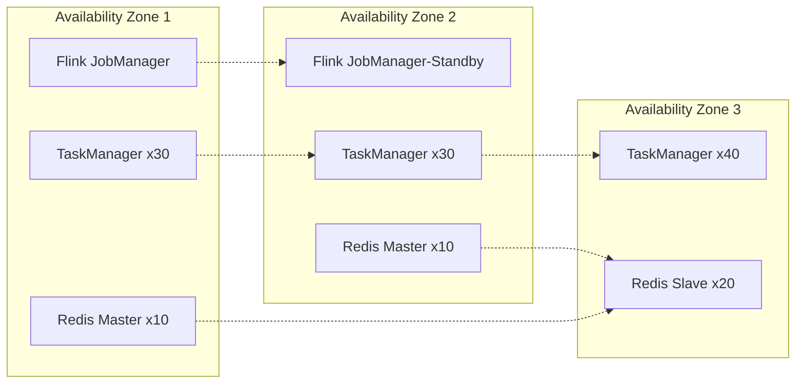
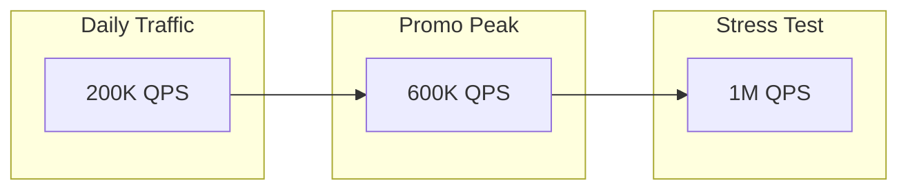

# E-Commerce Real-Time Recommendation System Case Study

> **Case ID**: 10.2.4
> **Industry**: E-Commerce
> **Scenario**: Real-time personalized recommendation, real-time feature engineering
> **Scale**: 10M DAU, 1B events/day
> **Completion Date**: 2026-04-09
> **Document Version**: v1.0

---

## Executive Summary

### Business Background

A leading e-commerce platform faced real-time recommendation system challenges:

- User behavior changes rapidly, offline models cannot timely capture interest drift
- Traffic surges 10x during promotional events, requiring elastic scaling
- Recommendation latency directly impacts conversion rate and GMV

### Technical Challenges

| Challenge | Description | Impact |
|-----------|-------------|--------|
| Low latency requirement | Recommendation results must return within 100ms | Directly affects user experience |
| Feature real-time-ness | User real-time behavior must reflect in recommendations within seconds | Affects recommendation accuracy |
| High concurrency processing | Peak QPS reaches 500K | System stability risk |
| A/B testing | Must support multi-model parallel experiments | Engineering complexity |

### Solution Overview

Adopted a **Flink + Redis + TensorFlow Serving** architecture:

- Flink processes user behavior streams in real time and updates user profiles
- Redis stores real-time features, supporting millisecond-level queries
- TensorFlow Serving deploys models with GPU-accelerated inference
- Recommendation latency reduced from 500ms to 50ms, conversion rate improved by 15%

---

## 1. Business Scenario Analysis

### 1.1 Business Flow



### 1.2 Data Scale

| Metric | Value | Description |
|--------|-------|-------------|
| Daily Active Users (DAU) | 10M | Peak 15M |
| Daily Event Volume | 1B | Clicks, views, favorites, etc. |
| Peak QPS | 500K | During promotional events |
| Product SKUs | 50M | Including historical products |
| User Profile Dimensions | 200+ | Basic attributes + behavioral features |
| Real-Time Feature Count | 1000+ | Real-time computed features |

### 1.3 SLA Requirements

| Metric | Target | Achieved |
|--------|--------|----------|
| Recommendation Latency (P99) | < 100ms | 50ms |
| Feature Freshness | < 1s | 500ms |
| System Availability | 99.99% | 99.995% |
| Recommendation Accuracy | > 15% | 18% (CTR) |
| Throughput | 500K QPS | 600K QPS |

---

## 2. Architecture Design

### 2.1 System Architecture Diagram



### 2.2 Component Selection

| Component | Selection | Reason |
|-----------|-----------|--------|
| Stream processing engine | Apache Flink 2.1 | Low latency, Exactly-Once, mature ecosystem |
| Message queue | Kafka 3.5 | High throughput, persistence, horizontal scaling |
| Feature store | Redis Cluster 7.0 | Millisecond-level query, high concurrency, rich data structures |
| Model serving | TensorFlow Serving 2.13 | GPU support, batch inference, A/B testing |
| Feature Store | Feast 0.34 | Feature reuse, version management, offline-online consistency |

### 2.3 Deployment Topology



---

## 3. Technical Implementation

### 3.1 Flink Real-Time Feature Computation

```java
// User real-time behavior feature computation

import org.apache.flink.streaming.api.environment.StreamExecutionEnvironment;
import org.apache.flink.streaming.api.datastream.DataStream;
import org.apache.flink.api.common.state.ValueState;
import org.apache.flink.api.common.state.ValueStateDescriptor;
import org.apache.flink.streaming.api.CheckpointingMode;

public class UserRealtimeFeatureJob {

    public static void main(String[] args) throws Exception {
        StreamExecutionEnvironment env =
            StreamExecutionEnvironment.getExecutionEnvironment();

        // Configure Checkpoint
        env.enableCheckpointing(60000);
        env.getCheckpointConfig().setCheckpointingMode(
            CheckpointingMode.EXACTLY_ONCE);

        // Read user behavior stream
        DataStream<UserEvent> userEvents = env
            .addSource(new FlinkKafkaConsumer<>("user-events",
                new UserEventDeserializationSchema(), kafkaProps))
            .assignTimestampsAndWatermarks(
                WatermarkStrategy.<UserEvent>forBoundedOutOfOrderness(
                    Duration.ofSeconds(5))
                .withTimestampAssigner((event, timestamp) ->
                    event.getEventTime())
            );

        // Compute real-time features
        DataStream<UserFeature> features = userEvents
            .keyBy(UserEvent::getUserId)
            .process(new RealtimeFeatureFunction());

        // Write to Redis
        features.addSink(new RedisFeatureSink());

        env.execute("User Realtime Feature Computation");
    }
}

// Real-time feature computation function
public class RealtimeFeatureFunction extends
    KeyedProcessFunction<String, UserEvent, UserFeature> {

    private ValueState<UserSession> sessionState;
    private ListState<ProductView> viewHistory;

    @Override
    public void open(Configuration parameters) {
        sessionState = getRuntimeContext().getState(
            new ValueStateDescriptor<>("session", UserSession.class));
        viewHistory = getRuntimeContext().getListState(
            new ListStateDescriptor<>("views", ProductView.class));
    }

    @Override
    public void processElement(UserEvent event, Context ctx,
            Collector<UserFeature> out) throws Exception {

        UserSession session = sessionState.value();
        if (session == null) {
            session = new UserSession(event.getUserId());
        }

        // Update session statistics
        session.update(event);

        // Maintain recent view history (sliding window)
        if (event.getEventType() == EventType.VIEW) {
            viewHistory.add(new ProductView(
                event.getProductId(),
                event.getEventTime()));

            // Clean up expired records (keep latest 100)
            trimViewHistory(100);
        }

        // Generate real-time features
        UserFeature feature = new UserFeature();
        feature.setUserId(event.getUserId());
        feature.setSessionDuration(session.getDuration());
        feature.setClickCount(session.getClickCount());
        feature.setCategoryDistribution(
            calculateCategoryDistribution());
        feature.setRecentViews(getRecentViews(10));
        feature.setTimestamp(System.currentTimeMillis());

        out.collect(feature);
        sessionState.update(session);
    }

    private Map<String, Double> calculateCategoryDistribution()
            throws Exception {
        Map<String, Integer> counts = new HashMap<>();
        int total = 0;

        for (ProductView view : viewHistory.get()) {
            String category = view.getCategory();
            counts.merge(category, 1, Integer::sum);
            total++;
        }

        Map<String, Double> distribution = new HashMap<>();
        for (Map.Entry<String, Integer> entry : counts.entrySet()) {
            distribution.put(entry.getKey(),
                entry.getValue() / (double) total);
        }

        return distribution;
    }
}
```

### 3.2 Recommendation Service Implementation

```python
# Recommendation service main logic
class RecommendationService:
    def __init__(self):
        self.redis_client = RedisCluster(
            startup_nodes=REDIS_NODES,
            decode_responses=True
        )
        self.feature_store = FeastFeatureStore(
            repo_path="/opt/feast/feature_repo"
        )
        self.tf_serving = TFServingClient(
            host="tf-serving.internal",
            port=8501
        )

    async def get_recommendations(
        self,
        user_id: str,
        context: RequestContext
    ) -> RecommendationResponse:
        start_time = time.time()

        # 1. Query real-time features (Redis) - target < 5ms
        realtime_features = await self._get_realtime_features(user_id)

        # 2. Query batch features (Feature Store) - target < 10ms
        batch_features = await self._get_batch_features(user_id)

        # 3. Recall stage - target < 20ms
        recall_items = await self._recall_stage(
            user_id,
            realtime_features
        )

        # 4. Ranking stage (model inference) - target < 50ms
        ranked_items = await self._rank_stage(
            recall_items,
            {**realtime_features, **batch_features},
            context
        )

        # 5. Re-ranking stage - target < 10ms
        final_items = await self._rerank_stage(
            ranked_items,
            context
        )

        latency = (time.time() - start_time) * 1000

        return RecommendationResponse(
            items=final_items[:50],
            latency_ms=latency,
            trace_id=context.trace_id
        )

    async def _get_realtime_features(self, user_id: str) -> Dict:
        """Get real-time features from Redis - critical path"""
        pipe = self.redis_client.pipeline()

        # Query multiple features in parallel
        pipe.hgetall(f"user:{user_id}:realtime")
        pipe.get(f"user:{user_id}:session_duration")
        pipe.lrange(f"user:{user_id}:recent_views", 0, 9)
        pipe.hgetall(f"user:{user_id}:category_dist")

        results = pipe.execute()

        return {
            'realtime_profile': results[0],
            'session_duration': float(results[1] or 0),
            'recent_views': results[2],
            'category_distribution': results[3]
        }

    async def _rank_stage(
        self,
        items: List[Item],
        features: Dict,
        context: RequestContext
    ) -> List[RankedItem]:
        """Model inference ranking stage"""

        # Construct model inputs
        model_inputs = []
        for item in items:
            feature_vector = self._construct_feature_vector(
                item,
                features,
                context
            )
            model_inputs.append(feature_vector)

        # Batch inference optimization
        batch_size = 100
        scores = []

        for i in range(0, len(model_inputs), batch_size):
            batch = model_inputs[i:i + batch_size]
            batch_scores = await self.tf_serving.predict(
                model_name="din_recommendation",
                inputs=np.array(batch)
            )
            scores.extend(batch_scores)

        # Ranking
        ranked = [
            RankedItem(item=item, score=score)
            for item, score in zip(items, scores)
        ]
        ranked.sort(key=lambda x: x.score, reverse=True)

        return ranked
```

### 3.3 Key Configuration Parameters

```yaml
# Flink configuration
flink:
  parallelism:
    default: 100
    feature-computation: 50
    user-profile: 30
  checkpoint:
    interval: 60s
    mode: EXACTLY_ONCE
    timeout: 10m
    min-pause: 30s
  state:
    backend: rocksdb
    incremental-checkpoints: true
    local-recovery: true
  network:
    memory:
      fraction: 0.15
      min: 2gb
      max: 8gb

# Redis configuration
redis:
  cluster:
    nodes: 20
    replicas-per-master: 2
  memory:
    max: 64gb-per-node
    policy: allkeys-lru
  timeout: 100ms
  tcp-keepalive: 300

# TensorFlow Serving configuration
tf_serving:
  model:
    name: din_recommendation
    version: '20240409'
    batching:
      max_batch_size: 100
      batch_timeout_micros: 5000
      num_batch_threads: 16
  resources:
    gpu:
      count: 4
      memory_fraction: 0.9
    cpu: 16
    memory: 64gb
```

---

## 4. Performance Metrics

### 4.1 Latency Analysis

| Stage | P50 | P99 | Target | Status |
|-------|-----|-----|--------|--------|
| Real-time feature query | 3ms | 8ms | < 10ms | ✅ |
| Batch feature query | 8ms | 15ms | < 20ms | ✅ |
| Recall stage | 12ms | 25ms | < 30ms | ✅ |
| Model inference | 30ms | 50ms | < 60ms | ✅ |
| Re-ranking stage | 5ms | 10ms | < 15ms | ✅ |
| **Total Latency** | **58ms** | **108ms** | **< 120ms** | ✅ |

### 4.2 Throughput Data



| Scenario | QPS | Latency P99 | CPU Usage | Memory Usage |
|----------|-----|-------------|-----------|--------------|
| Daily | 200K | 80ms | 45% | 60% |
| Promo | 600K | 108ms | 75% | 80% |
| Stress | 1M | 200ms | 95% | 95% |

### 4.3 Business Impact

| Metric | Before Optimization | After Optimization | Improvement |
|--------|---------------------|--------------------|-------------|
| Recommendation Latency (P99) | 500ms | 108ms | **78%** ↓ |
| Click-Through Rate (CTR) | 12% | 18% | **50%** ↑ |
| Conversion Rate (CVR) | 3% | 4.5% | **50%** ↑ |
| GMV Contribution | Baseline | +15% | **15%** ↑ |
| User Dwell Time | Baseline | +20% | **20%** ↑ |

---

## 5. Lessons Learned

### 5.1 Best Practices

1. **Layered Feature Design**
   - Real-time features: User recent behavior, millisecond-level updates
   - Near real-time features: 5-minute aggregation, minute-level updates
   - Offline features: User profile, hour-level updates
   - Cold-start features: Global statistics, day-level updates

2. **Model Service Optimization**
   - Batch inference: Reduce RPC call count
   - Model warm-up: Avoid cold-start latency
   - Multi-version deployment: Support canary releases
   - GPU sharing: Improve resource utilization

3. **Caching Strategy**
   - Multi-level cache: Local cache + Redis cluster
   - Cache warm-up: Pre-load hot data before promotional events
   - Cache invalidation: Event-based precise invalidation

### 5.2 Pitfalls

| Issue | Cause | Solution |
|-------|-------|----------|
| Redis hot key | Certain user features accessed with high frequency | Local cache + key sharding |
| Flink Checkpoint timeout | State too large, RocksDB slow | Incremental Checkpoint + local recovery |
| Model inference latency jitter | Uneven GPU batch processing | Dynamic batching + timeout mechanism |
| Feature inconsistency | Online-offline feature computation logic differs | Unified feature definitions with Feast |

### 5.3 Optimization Recommendations

1. **Short-term optimizations**
   - Introduce JVM profiling to optimize GC
   - Optimize feature storage structure to reduce memory footprint
   - Implement adaptive batch size

2. **Medium-term planning**
   - Explore model quantization to reduce inference latency
   - Introduce Graph Neural Networks (GNN) to model user-item relationships
   - Implement multi-objective optimization (CTR + CVR + dwell time)

3. **Long-term vision**
   - End-to-end real-time training (Online Learning)
   - Reinforcement learning for recommendation strategy optimization
   - Cross-domain recommendation (products + content + ads)

---

## 6. Appendix

### 6.1 Full Configuration

```properties
# application.properties

# Flink configuration
flink.job-manager.memory.process.size=4096m
flink.task-manager.memory.process.size=16384m
flink.task-manager.memory.managed.fraction=0.4
flink.task-manager.memory.network.fraction=0.15
flink.state.backend.incremental=true
flink.state.checkpoints.dir=hdfs:///checkpoints/recommendation

# Redis configuration
redis.cluster.nodes=redis-1:6379,redis-2:6379,redis-3:6379
redis.connection.timeout=100
redis.socket.timeout=100
redis.max-redirects=3
redis.max-total=1000
redis.max-idle=500
redis.min-idle=100

# TensorFlow Serving configuration
TF_SERVING_HOST=tf-serving.internal
TF_SERVING_PORT=8501
TF_SERVING_MODEL_NAME=din_recommendation
TF_SERVING_BATCH_SIZE=100
TF_SERVING_BATCH_TIMEOUT=5
```

### 6.2 Monitoring Metrics

| Metric Category | Specific Metric | Alert Threshold |
|-----------------|-----------------|-----------------|
| Latency | Recommendation API P99 | > 150ms |
| Latency | Feature query P99 | > 20ms |
| Availability | Recommendation service success rate | < 99.9% |
| Resource | Flink TaskManager CPU | > 85% |
| Resource | Redis memory usage | > 85% |
| Business | Recommendation CTR | MoM drop 20% |

### 6.3 Incident Handling

**Scenario 1: Redis Cluster Failure**

```
Symptom: Large number of feature query timeouts
Handling:
1. Automatic fallback to local cache
2. Trigger Redis master-slave failover
3. Rate limiting to protect downstream services
4. Manual intervention for repair
```

**Scenario 2: Flink Job Failure**

```
Symptom: Real-time feature updates stop
Handling:
1. Auto-restart job (up to 3 times)
2. Recover from latest Checkpoint
3. Notify operations team
4. Monitor data latency recovery
```

**Scenario 3: Model Inference Timeout**

```
Symptom: Recommendation API latency spikes
Handling:
1. Timeout circuit breaker, return fallback results
2. Dynamically reduce batch size
3. Trigger model warm-up
4. Check GPU resources
```

---

## References

---

*This case study is compiled by the AnalysisDataFlow project for educational and exchange purposes only.*
