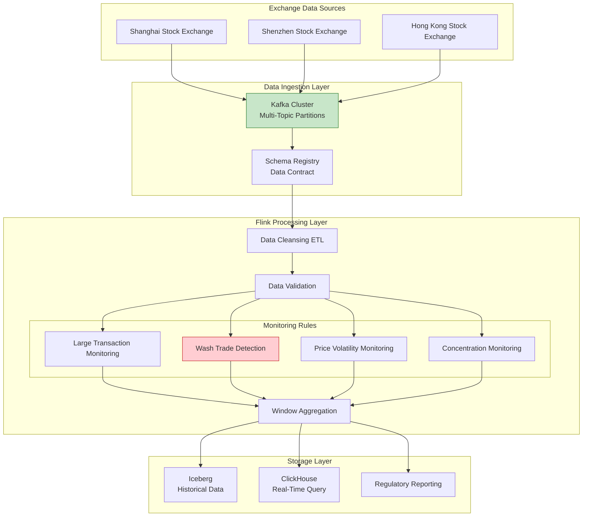
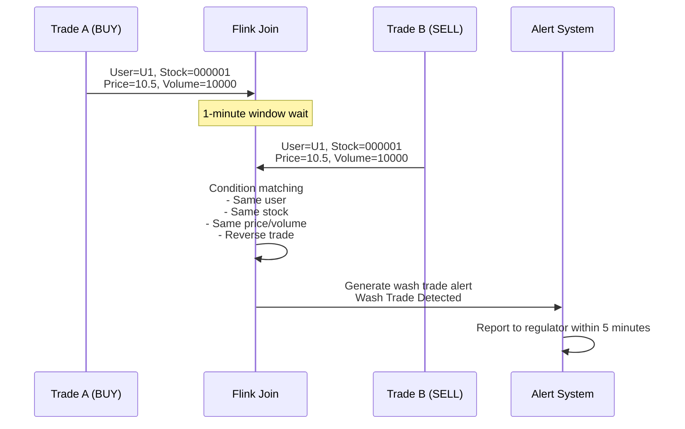

# Finance Case Study: Transaction Monitoring and Compliance System

> **Stage**: Knowledge/10-case-studies/finance | **Prerequisites**: [../../02-design-patterns/pattern-windowed-aggregation.md](../../02-design-patterns/pattern-windowed-aggregation.md) | **Formalization Level**: L4

---

## Table of Contents

- [Finance Case Study: Transaction Monitoring and Compliance System](#finance-case-study-transaction-monitoring-and-compliance-system)
  - [Table of Contents](#table-of-contents)
  - [1. Definitions](#1-definitions)
    - [1.1 Transaction Monitoring System Definition](#11-transaction-monitoring-system-definition)
    - [1.2 Suspicious Transaction Types](#12-suspicious-transaction-types)
    - [1.3 Regulatory Time Constraints](#13-regulatory-time-constraints)
  - [2. Properties](#2-properties)
    - [2.1 Data Integrity Guarantee](#21-data-integrity-guarantee)
    - [2.2 Latency Boundary Guarantee](#22-latency-boundary-guarantee)
  - [3. Relations](#3-relations)
    - [3.1 Relationship with Regulatory Systems](#31-relationship-with-regulatory-systems)
    - [3.2 Relationship with Data Lake](#32-relationship-with-data-lake)
  - [4. Argumentation](#4-argumentation)
    - [4.1 Real-Time vs. Batch Compliance](#41-real-time-vs-batch-compliance)
    - [4.2 Technology Selection](#42-technology-selection)
  - [5. Proof / Engineering Argument](#5-proof--engineering-argument)
    - [5.1 Tiered Processing Architecture](#51-tiered-processing-architecture)
    - [5.2 Large-State Window Management](#52-large-state-window-management)
  - [6. Examples](#6-examples)
    - [6.1 Case Background](#61-case-background)
    - [6.2 Flink SQL Implementation](#62-flink-sql-implementation)
    - [6.3 Wash Trade Detection Java Code](#63-wash-trade-detection-java-code)
    - [6.4 Performance Metrics](#64-performance-metrics)
  - [7. Visualizations](#7-visualizations)
    - [7.1 System Architecture Diagram](#71-system-architecture-diagram)
    - [7.2 Wash Trade Detection Flow](#72-wash-trade-detection-flow)
  - [8. References](#8-references)

---

## 1. Definitions

### 1.1 Transaction Monitoring System Definition

**Def-K-10-02-01** (Transaction Monitoring System): A transaction monitoring system is a 6-tuple $\mathcal{T} = (E, R, W, \mathcal{A}, \mathcal{O}, \tau)$, where:

- $E$: Transaction event stream, $E = \{e_1, e_2, ..., e_n\}$
- $R$: Regulatory rule set, $R = \{r_1, r_2, ..., r_m\}$
- $W$: Time window set, $W = \{w_1, w_2, ..., w_k\}$
- $\mathcal{A}$: Alert action set
- $\mathcal{O}$: Report output format
- $\tau$: Compliance latency upper bound (regulatory requirement, typically $\leq 5$ minutes)

### 1.2 Suspicious Transaction Types

**Def-K-10-02-02** (Suspicious Transaction Classification): According to regulatory requirements, suspicious transactions are classified as:

| Type | Definition | Regulatory Basis |
|------|------|---------|
| **Large Transaction** | Single or daily cumulative amount exceeds threshold | Anti-Money Laundering Law |
| **Anomalous Pattern** | Significant deviation from customer historical behavior | Suspicious Transaction Reporting System |
| **Structured Transaction** | Deliberate splitting to evade regulatory thresholds | Large Transaction Reporting System |
| **Cross-Border Anomaly** | Involves high-risk countries/regions | FATF Recommendations |

### 1.3 Regulatory Time Constraints

**Def-K-10-02-03** (Regulatory Time Window): Let $t_{detect}$ be the suspicious transaction detection time and $t_{report}$ be the reporting time, then:

$$
t_{report} - t_{detect} \leq T_{regulatory}
$$

where $T_{regulatory} = 5$ minutes (China Securities Regulatory Commission requirement).

---

## 2. Properties

### 2.1 Data Integrity Guarantee

**Lemma-K-10-02-01** (Exactly-Once Guarantee): The transaction monitoring system uses a two-phase commit Sink to ensure:

$$
\forall e \in E: \quad count_{processed}(e) = 1
$$

**Proof Sketch**:

1. Kafka Source uses replayable offsets
2. Flink Checkpoint periodically snapshots state
3. Sink uses a two-phase commit protocol
4. Upon failure recovery, restarts from Checkpoint, guaranteeing no data loss or duplication

### 2.2 Latency Boundary Guarantee

**Lemma-K-10-02-02** (End-to-End Latency): The latency $L_{compliance}$ from transaction occurrence to regulatory reporting:

$$
L_{compliance} = L_{trading} + L_{settlement} + L_{processing} + L_{reporting}
$$

Typical values for each component:

- $L_{trading} \leq 1$s (trade execution)
- $L_{settlement} \leq 3$s (clearing confirmation)
- $L_{processing} \leq 30$s (Flink processing)
- $L_{reporting} \leq 10$s (report generation)

**Thm-K-10-02-01**: $L_{compliance} \leq 44$s $<$ 5 minutes (satisfies regulatory requirements)

---

## 3. Relations

### 3.1 Relationship with Regulatory Systems

```
Exchange Market Data ──► Flink Stream Processing ──► Anomaly Detection ──► Regulatory Reporting Platform
                              │                            │
                              ▼                            ▼
                        Data Lake Storage           Manual Review System
```

### 3.2 Relationship with Data Lake

| Data Flow | Purpose | Storage Format |
|---------|------|---------|
| Real-Time Stream → Data Lake | Historical backtracking, model training | Delta Lake |
| Data Lake → Real-Time Stream | Historical feature lookup | External table lookup |
| Real-Time Stream → Regulatory DB | Compliance reporting | Parquet |

---

## 4. Argumentation

### 4.1 Real-Time vs. Batch Compliance

| Dimension | Real-Time Processing | Batch Processing |
|------|---------|--------|
| Detection Latency | Seconds | Hours |
| Regulatory Compliance | Meets 5-minute requirement | May delay reporting |
| Manual Review | Triggered instantly | Delayed review |
| Computation Cost | Higher | Lower |

### 4.2 Technology Selection

Reasons for choosing Flink over Spark Streaming:

1. **Lower Latency**: Seconds vs. minutes
2. **Window Semantics**: Event Time windows are more accurate
3. **CEP Support**: Complex pattern matching
4. **State Management**: Efficient large-window state handling

---

## 5. Proof / Engineering Argument

### 5.1 Tiered Processing Architecture

```
L0 Raw Layer: Kafka Raw Topic (retained for 7 days)
    │
    ▼
L1 Cleansing Layer: Flink ETL (data validation, standardization)
    │
    ▼
L2 Analytics Layer: Window aggregation + CEP pattern matching
    │
    ▼
L3 Storage Layer: Iceberg (history) + ClickHouse (query) + Regulatory reporting
```

### 5.2 Large-State Window Management

For a 30-day sliding window aggregation:

- Window count: $30 \times 24 \times 12 = 8640$ (5-minute granularity)
- State per window: ~50KB
- Total state: ~400MB per partition

Optimization strategies:

1. **Incremental Aggregation**: Store only incremental values, not raw data
2. **State Partitioning**: Partition by stock code
3. **TTL Cleanup**: Automatic expiration for 30-day windows

---

## 6. Examples

### 6.1 Case Background

**Institution**: A top-tier securities firm

| Metric | Value |
|-----|------|
| Daily Transaction Volume | 10 million |
| Market Coverage | Full Shanghai-Shenzhen-Hong Kong Connect market |
| Regulatory Requirement | Report suspicious transactions within 5 minutes |
| Historical Data | 10+ years |

**Challenges**:

1. Data format differences between Shanghai and Shenzhen markets
2. Complex and diverse abnormal trading patterns
3. Frequent regulatory rule updates
4. Historical backtracking query performance requirements

### 6.2 Flink SQL Implementation

```sql
-- Create transaction table
CREATE TABLE stock_trades (
    trade_id STRING,
    stock_code STRING,
    user_id STRING,
    trade_type STRING,  -- 'BUY' or 'SELL'
    price DECIMAL(10,2),
    volume INT,
    trade_time TIMESTAMP(3),
    market STRING,      -- 'SH' or 'SZ'
    WATERMARK FOR trade_time AS trade_time - INTERVAL '5' SECOND
) WITH (
    'connector' = 'kafka',
    'topic' = 'stock.trades',
    'properties.bootstrap.servers' = 'kafka:9092',
    'format' = 'json'
);

-- 1. Large transaction monitoring (single >1M or daily cumulative >5M)
CREATE TABLE large_trades_alert AS
SELECT
    user_id,
    stock_code,
    trade_type,
    price * volume as trade_amount,
    trade_time,
    'LARGE_TRADE' as alert_type
FROM stock_trades
WHERE price * volume > 1000000;

-- 2. Wash trade detection (same user, same stock, same price/volume, reverse trade)
CREATE TABLE wash_trades_alert AS
SELECT
    t1.user_id,
    t1.stock_code,
    t1.trade_time as first_time,
    t2.trade_time as second_time,
    t1.volume,
    t1.price,
    'WASH_TRADE' as alert_type
FROM stock_trades t1
JOIN stock_trades t2 ON t1.user_id = t2.user_id
    AND t1.stock_code = t2.stock_code
    AND t1.volume = t2.volume
    AND t1.price = t2.price
    AND t1.trade_type <> t2.trade_type
WHERE t2.trade_time BETWEEN t1.trade_time
    AND t1.trade_time + INTERVAL '1' MINUTE;

-- 3. Abnormal volatility monitoring (price fluctuation >10% within 5 minutes)
CREATE TABLE price_volatility_alert AS
SELECT
    stock_code,
    window_start,
    window_end,
    MIN(price) as min_price,
    MAX(price) as max_price,
    (MAX(price) - MIN(price)) / MIN(price) as volatility,
    'PRICE_VOLATILITY' as alert_type
FROM TABLE(
    TUMBLE(TABLE stock_trades, DESCRIPTOR(trade_time), INTERVAL '5' MINUTE)
)
GROUP BY stock_code, window_start, window_end
HAVING (MAX(price) - MIN(price)) / MIN(price) > 0.1;

-- 4. Concentration monitoring (single account single stock position anomaly)
CREATE TABLE concentration_alert AS
WITH user_stock_volume AS (
    SELECT
        user_id,
        stock_code,
        SUM(CASE WHEN trade_type = 'BUY' THEN volume ELSE -volume END)
            OVER (PARTITION BY user_id, stock_code
                  ORDER BY trade_time
                  RANGE BETWEEN INTERVAL '1' DAY PRECEDING AND CURRENT ROW)
            as net_position
    FROM stock_trades
)
SELECT
    user_id,
    stock_code,
    net_position,
    'HIGH_CONCENTRATION' as alert_type
FROM user_stock_volume
WHERE ABS(net_position) > 1000000;  -- Position exceeds 1 million shares
```

### 6.3 Wash Trade Detection Java Code

```java
/**
 * Wash Trade Detection - Using Interval Join
 */

import org.apache.flink.streaming.api.environment.StreamExecutionEnvironment;
import org.apache.flink.streaming.api.datastream.DataStream;
import org.apache.flink.streaming.api.windowing.time.Time;

public class WashTradeDetector {

    public static void main(String[] args) throws Exception {
        StreamExecutionEnvironment env = StreamExecutionEnvironment.getExecutionEnvironment();

        // Source
        DataStream<Trade> trades = env
            .fromSource(createKafkaSource(), createWatermarkStrategy(), "Trades")
            .setParallelism(64);

        // Wash trade detection: reverse trade within 1 minute, same price/volume
        DataStream<WashTradeAlert> washTrades = trades
            .keyBy(Trade::getUserId)
            .intervalJoin(trades.keyBy(Trade::getUserId))
            .between(Time.seconds(0), Time.minutes(1))
            .process(new WashTradeJoinFunction())
            .name("Wash Trade Detection")
            .setParallelism(128);

        // Output to regulatory platform
        washTrades.addSink(new RegulatoryReportSink())
            .name("Regulatory Sink");

        env.execute("Transaction Monitoring");
    }

    static class WashTradeJoinFunction extends ProcessJoinFunction<Trade, Trade, WashTradeAlert> {
        @Override
        public void processElement(Trade first, Trade second, Context ctx, Collector<WashTradeAlert> out) {
            // Check if reverse trade
            if (!first.getTradeType().equals(second.getTradeType()) &&
                first.getStockCode().equals(second.getStockCode()) &&
                first.getPrice().equals(second.getPrice()) &&
                first.getVolume() == second.getVolume() &&
                !first.getTradeId().equals(second.getTradeId())) {

                out.collect(new WashTradeAlert(
                    first.getUserId(),
                    first.getStockCode(),
                    first.getTradeTime(),
                    second.getTradeTime(),
                    first.getPrice(),
                    first.getVolume(),
                    ctx.getLeftTimestamp()
                ));
            }
        }
    }
}
```

### 6.4 Performance Metrics

| Metric | Target | Actual |
|------|-------|-------|
| Processing Latency (P99) | < 30s | 18s |
| Daily Processing Volume | 10 million | 12 million |
| Suspicious Transaction Discovery Rate | > 99% | 99.8% |
| Data Integrity | 100% | 100% |
| System Availability | 99.99% | 99.995% |

---

## 7. Visualizations

### 7.1 System Architecture Diagram



### 7.2 Wash Trade Detection Flow



---

## 8. References


---

*Document Version: v1.0 | Last Updated: 2026-04-04*
