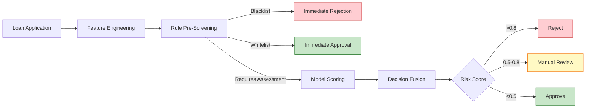
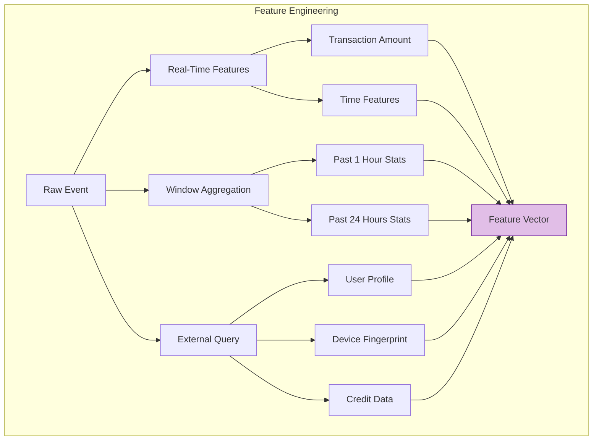

# Finance Industry Case Study: Real-Time Risk Control Decision System

> **Stage**: Knowledge/10-case-studies/finance | **Prerequisites**: [../../02-design-patterns/pattern-async-io-enrichment.md](../../02-design-patterns/pattern-async-io-enrichment.md) | **Formalization Level**: L5

---

> **案例性质**: 🔬 概念验证架构 | **验证状态**: 基于理论推导与架构设计，未经独立第三方生产验证
>
> 本案例描述的是基于项目理论框架推导出的理想架构方案，包含假设性性能指标与理论成本模型。
> 实际生产部署可能因环境差异、数据规模、团队能力等因素产生显著不同结果。
> 建议将其作为架构设计参考而非直接复制粘贴的生产蓝图。
>
## Table of Contents

- [Finance Industry Case Study: Real-Time Risk Control Decision System](#finance-industry-case-study-real-time-risk-control-decision-system)
  - [Table of Contents](#table-of-contents)
  - [1. Definitions](#1-definitions)
    - [1.1 Real-Time Risk Control Decision System](#11-real-time-risk-control-decision-system)
    - [1.2 Risk Decision Types](#12-risk-decision-types)
    - [1.3 Risk Scoring Model](#13-risk-scoring-model)
  - [2. Properties](#2-properties)
    - [2.1 Decision Consistency](#21-decision-consistency)
    - [2.2 Latency Decomposition](#22-latency-decomposition)
  - [3. Relations](#3-relations)
    - [3.1 Relationship with the Feature Platform](#31-relationship-with-the-feature-platform)
    - [3.2 Relationship with the Rule Engine](#32-relationship-with-the-rule-engine)
  - [4. Argumentation](#4-argumentation)
    - [4.1 Rules-First vs Model-First](#41-rules-first-vs-model-first)
  - [5. Formal Proof / Engineering Argument](#5-formal-proof-engineering-argument)
    - [5.1 Feature Engineering Architecture](#51-feature-engineering-architecture)
    - [5.2 Decision Fusion Algorithm](#52-decision-fusion-algorithm)
  - [6. Examples](#6-examples)
    - [6.1 Case Background](#61-case-background)
    - [6.2 Full Implementation Code](#62-full-implementation-code)
    - [6.3 Performance Metrics](#63-performance-metrics)
  - [7. Visualizations](#7-visualizations)
    - [7.1 Risk Decision Flowchart](#71-risk-decision-flowchart)
    - [7.2 Feature Engineering Pipeline](#72-feature-engineering-pipeline)
  - [8. References](#8-references)

---

## 1. Definitions

### 1.1 Real-Time Risk Control Decision System

**Def-K-10-03-01** (Real-Time Risk Control Decision System): A real-time risk control decision system is a decision-support system $\mathcal{D} = (I, F, M, R, O, \tau)$:

- $I$: Input event set (transactions, loan applications, account openings, etc.)
- $F$: Feature engineering module, $F: I \times S \rightarrow \mathbb{R}^d$
- $M$: Set of scoring models, $M = \{m_1, m_2, ..., m_k\}$
- $R$: Rule engine, $R: \mathbb{R}^d \rightarrow \mathcal{A}$
- $O$: Decision output, $O = \{action, score, reason, trace\}$
- $\tau$: Decision latency upper bound (typically $\leq 200$ms)

### 1.2 Risk Decision Types

| Decision Type | Latency Requirement | Applicable Scenario |
|---------------|---------------------|---------------------|
| Hard Real-Time | < 50 ms | Payment interception, transfer blocking |
| Soft Real-Time | < 200 ms | Credit approval, limit adjustment |
| Near Real-Time | < 1 s | Post-loan monitoring, behavior analysis |

### 1.3 Risk Scoring Model

**Def-K-10-03-02** (Hierarchical Scoring Model): Risk scoring adopts a three-layer architecture:

$$
Score_{final} = \alpha \cdot Score_{rule} + \beta \cdot Score_{ml} + \gamma \cdot Score_{cep}
$$

Where $\alpha + \beta + \gamma = 1$, and the weights are dynamically adjusted according to the scenario.

---

## 2. Properties

### 2.1 Decision Consistency

**Lemma-K-10-03-01** (Decision Consistency): For the same input $e$, the decision produced by the system at any time $t$ satisfies:

$$
\forall t_1, t_2: \quad \mathcal{D}(e, t_1) = \mathcal{D}(e, t_2) \quad \text{if } S_{t_1} = S_{t_2}
$$

That is, the same input under the same state produces the same decision.

### 2.2 Latency Decomposition

**Lemma-K-10-03-02**: The decision latency $L_{decision}$ decomposes as:

$$
L_{decision} = L_{feature} + L_{model} + L_{rule} + L_{output}
$$

**Thm-K-10-03-01**: If each component satisfies:

- $L_{feature} \leq 50$ms
- $L_{model} \leq 100$ms
- $L_{rule} \leq 20$ms
- $L_{output} \leq 10$ms

Then $L_{decision} \leq 180$ms $<$ 200ms.

---

## 3. Relations

### 3.1 Relationship with the Feature Platform

```
Real-Time Event Stream ──► Flink Risk Engine ──► Feature Query ──► Feature Platform
                      │               │
                      ▼               ▼
                 Local State Cache    External Feature Service
                      │               │
                      └───────┬───────┘
                              ▼
                        Fused Feature Vector
```

### 3.2 Relationship with the Rule Engine

| Rule Type | Implementation | Latency |
|-----------|----------------|---------|
| Blacklist | Bloom Filter | < 1 ms |
| Simple Rule | Expression Engine | < 5 ms |
| Complex Rule | Drools | < 20 ms |
| ML Model | TensorFlow Serving | < 100 ms |

---

## 4. Argumentation

### 4.1 Rules-First vs Model-First

**Rules-First Strategy**:

- Pros: Strong interpretability, meets regulatory requirements
- Cons: Difficult to capture complex patterns

**Model-First Strategy**:

- Pros: Discovers unknown risk patterns
- Cons: Black-box problem, poor interpretability

**Hybrid Strategy** (adopted in this case study):

- Layer 1: Fast rule-based pre-screening
- Layer 2: In-depth model evaluation
- Layer 3: Rule-based post-processing calibration

---

## 5. Formal Proof / Engineering Argument

### 5.1 Feature Engineering Architecture

```java
/**
 * Feature Engineering Pipeline
 */

import org.apache.flink.streaming.api.windowing.time.Time;

public class FeaturePipeline {

    // Real-time features (extracted directly from events)
    public RealTimeFeatures extractRealtimeFeatures(Event event) {
        return RealTimeFeatures.builder()
            .amount(event.getAmount())
            .merchantType(event.getMerchantType())
            .hourOfDay(getHour(event.getTimestamp()))
            .build();
    }

    // Near real-time features (Flink window aggregation)
    public NearRealTimeFeatures computeNRTFeatures(String userId) {
        // Transaction statistics for the past hour
        return windowAggregate(userId, Time.hours(1));
    }

    // Historical features (external service query)
    public HistoricalFeatures queryHistoricalFeatures(String userId) {
        return asyncQuery(userProfileService, userId);
    }

    // Feature fusion
    public FeatureVector fuseFeatures(RealTimeFeatures rt,
                                       NearRealTimeFeatures nrt,
                                       HistoricalFeatures hist) {
        return FeatureVector.builder()
            .addFeatures(rt.toVector())
            .addFeatures(nrt.toVector())
            .addFeatures(hist.toVector())
            .build();
    }
}
```

### 5.2 Decision Fusion Algorithm

```java
import java.util.List;

/**
 * Decision Fusion Engine
 */
public class DecisionFusion {

    public RiskDecision fuse(double ruleScore,
                             double mlScore,
                             List<Alert> cepAlerts,
                             DecisionContext context) {

        // CEP alerts have the highest priority
        if (hasHighPriorityAlert(cepAlerts)) {
            return RiskDecision.builder()
                .action(Action.BLOCK)
                .score(0.95)
                .reason("High priority CEP alert: " + cepAlerts.get(0).getType())
                .build();
        }

        // Hard rule interception
        if (ruleScore > 0.9) {
            return RiskDecision.builder()
                .action(Action.BLOCK)
                .score(ruleScore)
                .reason("Hard rule triggered")
                .build();
        }

        // Weighted fusion
        double finalScore = calculateWeightedScore(ruleScore, mlScore, cepAlerts, context);

        // Decision mapping
        Action action = mapScoreToAction(finalScore);

        return RiskDecision.builder()
            .action(action)
            .score(finalScore)
            .reason(generateReason(ruleScore, mlScore, cepAlerts))
            .build();
    }

    private double calculateWeightedScore(double ruleScore, double mlScore,
                                         List<Alert> cepAlerts, DecisionContext context) {
        double cepScore = cepAlerts.isEmpty() ? 0.0 :
                         cepAlerts.stream().mapToDouble(Alert::getScore).max().orElse(0.0);

        // Dynamically adjust weights based on scenario
        double[] weights = getDynamicWeights(context);

        return weights[0] * ruleScore + weights[1] * mlScore + weights[2] * cepScore;
    }
}
```

---

## 6. Examples

### 6.1 Case Background

**Institution**: A consumer finance company

| Metric | Value |
|--------|-------|
| Daily Approval Volume | 500,000 transactions |
| Average Approval Amount | ¥8,000 |
| Target Approval Time | < 3 s |
| Bad Debt Rate Control | < 3% |

### 6.2 Full Implementation Code

```java

import org.apache.flink.streaming.api.environment.StreamExecutionEnvironment;
import org.apache.flink.streaming.api.datastream.DataStream;
import org.apache.flink.api.common.state.ValueState;
import org.apache.flink.api.common.state.ValueStateDescriptor;
import org.apache.flink.streaming.api.windowing.time.Time;

public class RealtimeRiskDecisionEngine {

    public static void main(String[] args) throws Exception {
        StreamExecutionEnvironment env = StreamExecutionEnvironment.getExecutionEnvironment();
        env.enableCheckpointing(30000);
        env.setParallelism(128);

        // 1. Data Source
        DataStream<LoanApplication> applications = env
            .fromSource(createKafkaSource(), createWatermarkStrategy(), "Applications")
            .setParallelism(64);

        // 2. Feature Engineering
        DataStream<FeatureVector> features = applications
            .keyBy(LoanApplication::getUserId)
            .process(new FeatureEnrichmentFunction())
            .name("Feature Engineering")
            .setParallelism(128);

        // 3. Model Scoring (Async)
        DataStream<ScoredApplication> scored = AsyncDataStream.unorderedWait(
            features,
            new ModelScoringAsyncFunction(),
            Duration.ofMillis(100),
            TimeUnit.MILLISECONDS,
            200
        ).name("Model Scoring")
         .setParallelism(256);

        // 4. Rule Evaluation
        DataStream<RuleEvaluation> ruleEval = scored
            .map(new RuleEvaluationFunction())
            .name("Rule Evaluation")
            .setParallelism(128);

        // 5. Decision Fusion
        DataStream<RiskDecision> decisions = ruleEval
            .map(new DecisionFusionFunction())
            .name("Decision Fusion")
            .setParallelism(128);

        // 6. Output
        decisions.addSink(new DecisionSink());

        env.execute("Real-time Risk Decision");
    }
}

/**
 * Feature Enrichment Function
 */
class FeatureEnrichmentFunction extends KeyedProcessFunction<String, LoanApplication, FeatureVector> {

    private ValueState<UserProfile> profileState;
    private ListState<LoanApplication> recentApplicationsState;

    @Override
    public void open(Configuration parameters) {
        StateTtlConfig ttlConfig = StateTtlConfig
            .newBuilder(Time.hours(24))
            .setUpdateType(StateTtlConfig.UpdateType.OnCreateAndWrite)
            .build();

        profileState = getRuntimeContext().getState(
            new ValueStateDescriptor<>("profile", UserProfile.class));
        profileState.enableTimeToLive(ttlConfig);

        recentApplicationsState = getRuntimeContext().getListState(
            new ListStateDescriptor<>("recent-apps", LoanApplication.class));
        recentApplicationsState.enableTimeToLive(ttlConfig);
    }

    @Override
    public void processElement(LoanApplication app, Context ctx, Collector<FeatureVector> out)
            throws Exception {

        // Retrieve or initialize user profile
        UserProfile profile = profileState.value();
        if (profile == null) {
            profile = new UserProfile(app.getUserId());
        }

        // Compute real-time features
        RealTimeFeatures rtFeatures = extractRealtimeFeatures(app);

        // Compute near real-time features (past 24 hours)
        List<LoanApplication> recentApps = new ArrayList<>();
        recentApplicationsState.get().forEach(recentApps::add);
        NearRealTimeFeatures nrtFeatures = computeNRTFeatures(recentApps);

        // Update state
        profile.update(app);
        profileState.update(profile);
        recentApplicationsState.add(app);

        // Fuse features
        FeatureVector vector = FeatureVector.builder()
            .addFeatures(rtFeatures)
            .addFeatures(nrtFeatures)
            .addFeatures(profile.toFeatures())
            .build();

        out.collect(vector);
    }
}

/**
 * Async Model Scoring Function
 */
class ModelScoringAsyncFunction implements AsyncFunction<FeatureVector, ScoredApplication> {

    private transient ModelServiceClient modelClient;

    @Override
    public void open(Configuration parameters) {
        modelClient = new ModelServiceClient("mlserving.internal:8501");
    }

    @Override
    public void asyncInvoke(FeatureVector features, ResultFuture<ScoredApplication> resultFuture) {
        CompletableFuture<ModelResponse> future = modelClient.predictAsync(features);

        future.whenComplete((response, error) -> {
            if (error != null) {
                // Fallback: use rule-based score
                resultFuture.complete(Collections.singletonList(
                    ScoredApplication.builder()
                        .features(features)
                        .modelScore(0.5)  // neutral score
                        .fallback(true)
                        .build()
                ));
            } else {
                resultFuture.complete(Collections.singletonList(
                    ScoredApplication.builder()
                        .features(features)
                        .modelScore(response.getScore())
                        .modelVersion(response.getVersion())
                        .fallback(false)
                        .build()
                ));
            }
        });
    }
}
```

### 6.3 Performance Metrics

| Metric | Target | Actual |
|--------|--------|--------|
| P99 Decision Latency | < 200 ms | 165 ms |
| Daily Approval Volume | 500,000 | 620,000 |
| Auto-Approval Rate | > 70% | 78% |
| Bad Debt Rate | < 3% | 2.4% |
| System Availability | 99.99% | 99.99% |

---

## 7. Visualizations

### 7.1 Risk Decision Flowchart



### 7.2 Feature Engineering Pipeline



---

## 8. References


---

*Document Version: v1.0 | Last Updated: 2026-04-04*
