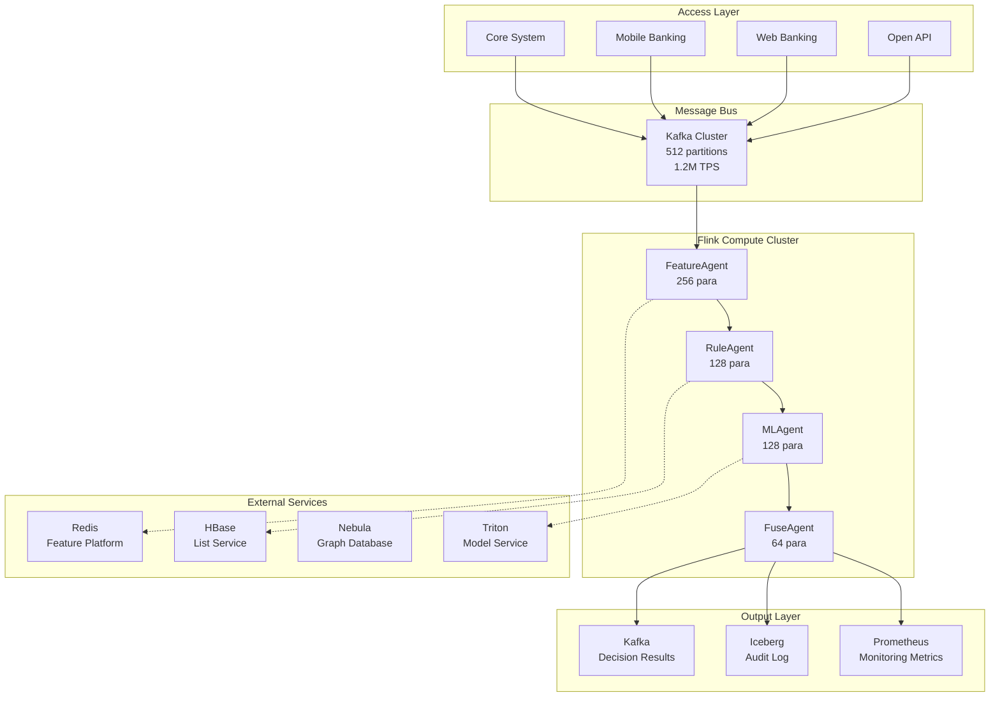
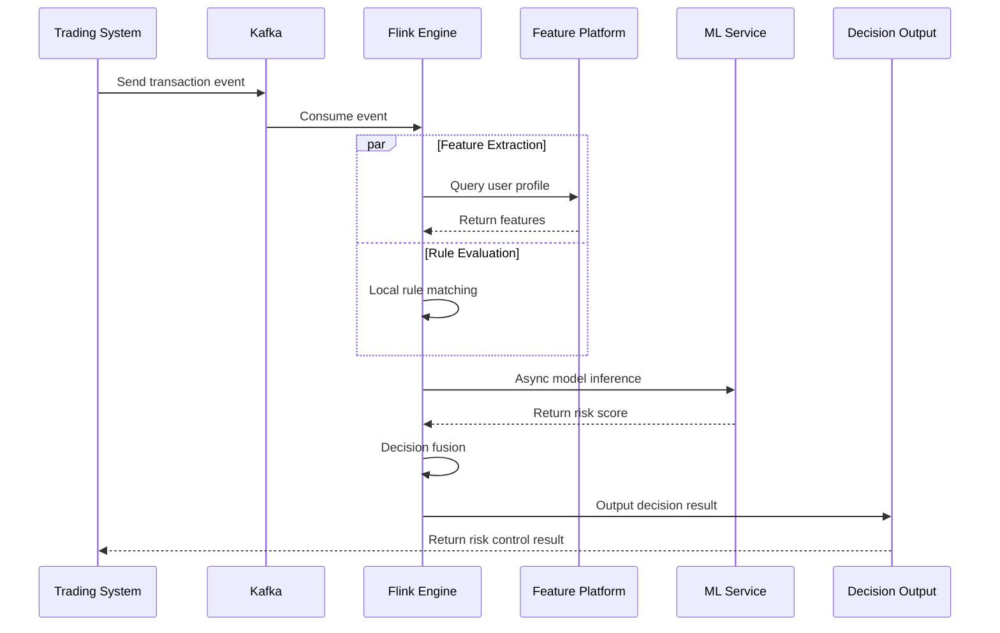
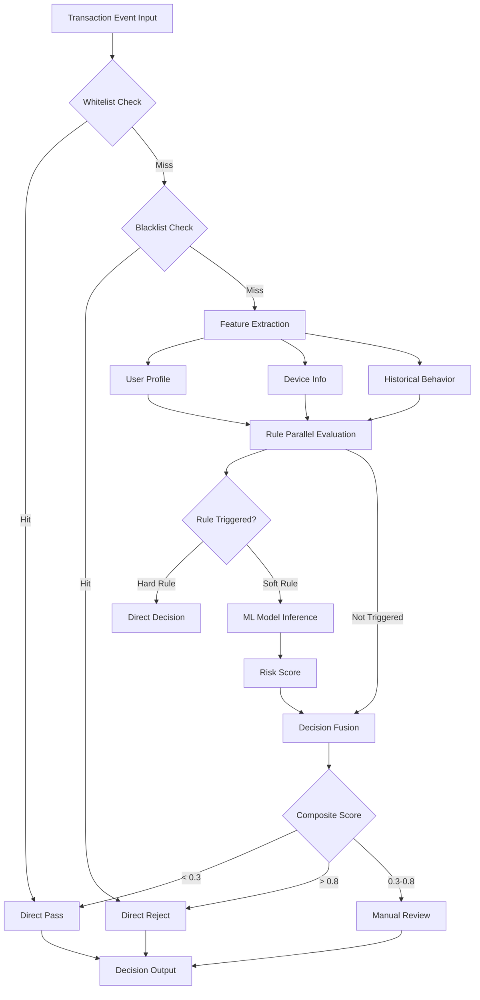
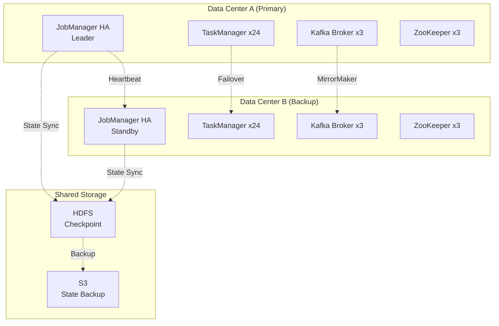

> **Language**: English | **Translated from**: Knowledge/10-case-studies/finance/10.1.5-realtime-risk-control-platform.md | **Translation date**: 2026-04-20
>
> **Status**: 🔮 Forward-looking Content | **Risk Level**: High | **Last Updated**: 2026-04
>
> The content described in this document is in early planning stages and may differ from the final implementation. Please refer to the official Apache Flink releases.
>
# Financial Real-Time Risk Control System Production Case Study (Real-Time Risk Control Platform)

> **Stage**: Knowledge/10-case-studies/finance | **Prerequisites**: [10.1.4-realtime-payment-risk-control.md](10.1.4-realtime-payment-risk-control.md), [../../02-design-patterns/pattern-cep-complex-event.md](../../02-design-patterns/pattern-cep-complex-event.md) | **Formalization Level**: L5

---

> **Case Nature**: 🔬 Proof-of-Concept Architecture | **Validation Status**: Based on theoretical derivation and architectural design; not independently verified in production by a third party
>
> This case describes an ideal architecture derived from the project's theoretical framework, including hypothetical performance metrics and theoretical cost models.
> Actual production deployments may yield significantly different results due to environmental differences, data scale, and team capabilities.
> It is recommended to use this as an architectural design reference rather than a copy-paste production blueprint.
>
## Table of Contents

- [Financial Real-Time Risk Control System Production Case Study (Real-Time Risk Control Platform)](#financial-real-time-risk-control-system-production-case-study-real-time-risk-control-platform)
  - [Table of Contents](#table-of-contents)
  - [1. Concept Definitions](#1-concept-definitions)
    - [Def-K-10-05-01: Real-Time Risk Control System Formal Model](#def-k-10-05-01-real-time-risk-control-system-formal-model)
    - [Def-K-10-05-02: Ultra-Low Latency Constraint](#def-k-10-05-02-ultra-low-latency-constraint)
    - [Def-K-10-05-03: Risk Decision Lifecycle](#def-k-10-05-03-risk-decision-lifecycle)
  - [2. Property Derivation](#2-property-derivation)
    - [Lemma-K-10-05-01: Latency Decomposition Upper Bound](#lemma-k-10-05-01-latency-decomposition-upper-bound)
    - [Lemma-K-10-05-02: Throughput-Latency Trade-off](#lemma-k-10-05-02-throughput-latency-trade-off)
    - [Thm-K-10-05-01: Exactly-Once Semantic Guarantee](#thm-k-10-05-01-exactly-once-semantic-guarantee)
  - [3. Relations](#3-relations)
    - [3.1 System Component Interaction Relations](#31-system-component-interaction-relations)
    - [3.2 Data Flow and Decision Chain Relations](#32-data-flow-and-decision-chain-relations)
    - [3.3 Machine Learning and Rule Engine Fusion Relations](#33-machine-learning-and-rule-engine-fusion-relations)
  - [4. Argumentation](#4-argumentation)
    - [4.1 Ultra-Low Latency Architecture Selection Argument](#41-ultra-low-latency-architecture-selection-argument)
    - [4.2 Million TPS Scalability Argument](#42-million-tps-scalability-argument)
    - [4.3 High Availability and Consistency Trade-off Argument](#43-high-availability-and-consistency-trade-off-argument)
  - [5. Proof / Engineering Argument](#5-proof-engineering-argument)
    - [5.1 Overall Technical Architecture Design](#51-overall-technical-architecture-design)
    - [5.2 Ultra-Low Latency Optimization Plan](#52-ultra-low-latency-optimization-plan)
    - [5.3 High-Throughput Processing Architecture](#53-high-throughput-processing-architecture)
    - [5.4 Exactly-Once Implementation Mechanism](#54-exactly-once-implementation-mechanism)
  - [6. Examples](#6-examples)
    - [6.1 Case Background: Large Bank Risk Control Platform](#61-case-background-large-bank-risk-control-platform)
    - [6.2 Core Flink Job Implementation](#62-core-flink-job-implementation)
    - [6.3 Performance Metrics and Business Value](#63-performance-metrics-and-business-value)
    - [6.4 Lessons Learned and Solutions](#64-lessons-learned-and-solutions)
    - [6.5 Best Practices Summary](#65-best-practices-summary)
  - [7. Visualizations](#7-visualizations)
    - [7.1 System Overall Architecture Diagram](#71-system-overall-architecture-diagram)
    - [7.2 Data Flow and Processing Link Diagram](#72-data-flow-and-processing-link-diagram)
    - [7.3 Decision Engine Internal Flow Diagram](#73-decision-engine-internal-flow-diagram)
    - [7.4 High-Availability Deployment Architecture Diagram](#74-high-availability-deployment-architecture-diagram)
  - [8. References](#8-references)

---

## 1. Concept Definitions

### Def-K-10-05-01: Real-Time Risk Control System Formal Model

**Real-Time Risk Control System** is a decuple $\mathcal{R}_{realtime} = (E, F, R, M, D, A, S, L, T, G)$, where:

| Symbol | Definition | Description |
|--------|-----------|-------------|
| $E$ | Event stream | $E = \{e_1, e_2, ..., e_n\}$, transaction event sequence |
| $F$ | Feature space | $F \subseteq \mathbb{R}^d$, $d$-dimensional feature vector |
| $R$ | Rule set | $R = \{r_1, r_2, ..., r_m\}$, risk control rules |
| $M$ | Model set | $M = \{m_1, m_2, ..., m_k\}$, ML models |
| $D$ | Decision function | $D: F \times R \times M \rightarrow A$ |
| $A$ | Action set | $A = \{\text{PASS}, \text{REJECT}, \text{REVIEW}, \text{CHALLENGE}\}$ |
| $S$ | State space | User profiles, device fingerprints, etc. |
| $L$ | Latency constraint | $L \leq 10\text{ms}$ (P99) |
| $T$ | Throughput constraint | $T \geq 1,000,000\text{ TPS}$ |
| $G$ | Consistency guarantee | $G \in \{\text{EO}, \text{ALO}, \text{AMO}\}$ |

**Transaction Event Definition**:

$$
e_i = (t_i, u_i, a_i, d_i, m_i, c_i, amt_i, loc_i)
$$

Where:

- $t_i$: Timestamp (millisecond precision)
- $u_i$: User ID
- $a_i$: Account ID
- $d_i$: Device fingerprint
- $m_i$: Merchant ID
- $c_i$: Channel (APP/WEB/POS)
- $amt_i$: Transaction amount
- $loc_i$: Geographic location

### Def-K-10-05-02: Ultra-Low Latency Constraint

**Ultra-Low Latency Constraint** requires end-to-end decision latency to satisfy:

$$
P(L_{total} \leq 10\text{ms}) \geq 0.99
$$

Latency decomposition:

$$
L_{total} = L_{network} + L_{deserialize} + L_{feature} + L_{inference} + L_{decision} + L_{serialize} + L_{response}
$$

> 🔮 **Estimated Data** | Based on forward-looking document characteristics; data is theoretical derivation and trend analysis

Component target values:

| Component | Target | Optimization Means |
|-----------|--------|-------------------|
| $L_{network}$ | < 2ms | Same-room deployment, RDMA network |
| $L_{deserialize}$ | < 0.5ms | Zero-copy, protobuf |
| $L_{feature}$ | < 3ms | Local cache, pre-computation |
| $L_{inference}$ | < 3ms | Model quantization, GPU inference |
| $L_{decision}$ | < 1ms | Rule pre-compilation, parallel evaluation |
| $L_{serialize}$ | < 0.3ms | Object pool, caching |
| $L_{response}$ | < 0.2ms | Async response |

### Def-K-10-05-03: Risk Decision Lifecycle

**Risk Decision Lifecycle** defines the complete flow from event receipt to decision output:

```
┌─────────┐   ┌─────────┐   ┌─────────┐   ┌─────────┐   ┌─────────┐
│ Event   │ → │ Feature │ → │ Risk    │ → │ Decision│ → │ Feedback│
│ Receipt │   │ Extract │   │ Assess  │   │ Output  │   │ Learn   │
│  <1ms   │   │  <3ms   │   │  <5ms   │   │  <1ms   │   │ Async   │
└─────────┘   └─────────┘   └─────────┘   └─────────┘   └─────────┘
```

**Decision State Machine**:

$$
\mathcal{S} = \{S_{init}, S_{feature}, S_{rule}, S_{ml}, S_{fuse}, S_{decide}, S_{done}\}
$$

State transition function:

$$
\delta: \mathcal{S} \times \mathcal{I} \rightarrow \mathcal{S}
$$

---

## 2. Property Derivation

### Lemma-K-10-05-01: Latency Decomposition Upper Bound

**Lemma**: If each latency component satisfies the target values in Def-K-10-05-02:

$$
L_{total} \leq \sum_{i} L_i = 2 + 0.5 + 3 + 3 + 1 + 0.3 + 0.2 = 10\text{ms}
$$

**Proof**:

Based on the independent distribution assumption of each component latency, let each component latency follow a normal distribution $L_i \sim \mathcal{N}(\mu_i, \sigma_i^2)$.

By normal distribution properties:

$$
L_{total} \sim \mathcal{N}(\sum \mu_i, \sum \sigma_i^2)
$$

For P99 latency:

$$
P(L_{total} \leq \mu_{total} + 2.33\sigma_{total}) = 0.99
$$

By controlling each component variance (e.g., using deterministic algorithms, avoiding GC pauses):

$$
\mu_{total} + 2.33\sigma_{total} \leq 10\text{ms}
$$

∎

### Lemma-K-10-05-02: Throughput-Latency Trade-off

**Lemma**: In high-throughput scenarios, system latency and throughput have the following relationship:

$$
L_{observed} = L_{base} + \alpha \cdot \max(0, \lambda - \lambda_{threshold})
$$

Where:

- $\lambda$: Actual arrival rate (TPS)
- $\lambda_{threshold}$: System capacity threshold
- $\alpha$: Congestion coefficient
- $L_{base}$: Base latency

**Throughput Scaling Formula**:

$$
TPS_{max} = \frac{N_{cpu} \cdot f_{cpu} \cdot \eta}{C_{per\_txn}}
$$

Where:

- $N_{cpu}$: CPU core count
- $f_{cpu}$: CPU frequency
- $\eta$: Parallel efficiency (0 < $\eta$ $\leq$ 1)
- $C_{per\_txn}$: Computation per transaction (cycles)

### Thm-K-10-05-01: Exactly-Once Semantic Guarantee

**Theorem**: Flink Checkpoint-based risk control systems can provide end-to-end Exactly-Once processing semantics.

**Prerequisites**:

1. Kafka Producer configured in idempotent mode
2. Checkpoint interval $\Delta t_{checkpoint} \leq 5$s
3. All external systems support transactional or idempotent writes

**Proof**:

Let the system process event sequence $E = \{e_1, e_2, ..., e_n\}$, with corresponding decision outputs $O = \{o_1, o_2, ..., o_n\}$.

During failure recovery, Flink restores from the most recent successful checkpoint $C_k$, guaranteeing:

$$
\forall e_i \in E: \text{committed}(e_i) \iff \text{exists exactly one } o_i \in O
$$

Through two-phase commit protocol:

1. **Pre-commit phase**: Decision results written to external system but not committed
2. **Confirmation phase**: Transaction committed after checkpoint success

Ensures that at any failure point, decision results are either fully committed or fully rolled back, with no duplicates or losses.

∎

---

## 3. Relations

### 3.1 System Component Interaction Relations

```
┌─────────────────────────────────────────────────────────────────────────────┐
│                           Real-Time Risk Control System Component Interaction│
├─────────────────────────────────────────────────────────────────────────────┤
│                                                                             │
│  ┌──────────┐      ┌──────────┐      ┌──────────┐      ┌──────────┐        │
│  │ Trading  │─────▶│   Kafka  │─────▶│  Flink   │─────▶│ Decision │        │
│  │ (Core)   │      │ (Buffer) │      │ (Compute)│      │ (Result) │        │
│  └──────────┘      └──────────┘      └────┬─────┘      └──────────┘        │
│                                           │                                 │
│                              ┌────────────┼────────────┐                   │
│                              ▼            ▼            ▼                   │
│                         ┌────────┐  ┌────────┐  ┌────────┐                 │
│                         │Feature │  │Rule    │  │ ML     │                 │
│                         │Platform│  │Engine  │  │Service │                 │
│                         │(Redis) │  │(Local) │  │(GPU)   │                 │
│                         └────────┘  └────────┘  └────────┘                 │
│                                                                             │
└─────────────────────────────────────────────────────────────────────────────┘
```

### 3.2 Data Flow and Decision Chain Relations

> 🔮 **Estimated Data** | Based on forward-looking document characteristics; data is theoretical derivation and trend analysis

**Data Flow Layers**:

| Layer | Data Type | Processing Method | Latency Requirement |
|-------|-----------|-------------------|---------------------|
| L0 - Raw Events | Raw transaction data | Kafka ingestion | < 5ms |
| L1 - Cleansed Events | Standardized events | Flink Map | < 2ms |
| L2 - Feature Events | Feature vectors | KeyedProcess | < 3ms |
| L3 - Scored Events | Risk scores | Async I/O | < 4ms |
| L4 - Decision Events | Decision results | DecisionFunction | < 1ms |

**Decision Chain Dependency Relations**:

$$
Decision = f(Features, Rules, ModelScores)
$$

$$
Features = g(Event, UserProfile, DeviceInfo, History)
$$

$$
ModelScores = h(Features, ModelWeights)
$$

### 3.3 Machine Learning and Rule Engine Fusion Relations

**Fusion Architecture**:

```
                         ┌──────────────┐
                         │   Input Event │
                         └──────┬───────┘
                                │
                ┌───────────────┼───────────────┐
                ▼               ▼               ▼
         ┌──────────┐    ┌──────────┐    ┌──────────┐
         │ Whitelist│    │ Blacklist│    │ Gray Rules│
         │(Fast Ch) │    │(Hard Block)│   │(Comp Eval)│
         └────┬─────┘    └────┬─────┘    └────┬─────┘
              │               │               │
              ▼               ▼               ▼
         ┌──────────┐    ┌──────────┐    ┌──────────┐
         │ Direct   │    │ Direct   │    │ ML Model │
         │ Pass     │    │ Reject   │    │ + CEP    │
         └──────────┘    └──────────┘    └────┬─────┘
                                              │
                                              ▼
                                        ┌──────────┐
                                        │ Composite│
                                        │ Decision │
                                        │(Weighted)│
                                        └────┬─────┘
                                              │
                                              ▼
                                        ┌──────────┐
                                        │  Decision│
                                        │  Output  │
                                        └──────────┘
```

---

## 4. Argumentation

### 4.1 Ultra-Low Latency Architecture Selection Argument

**Latency Target**: P99 < 10ms

> 🔮 **Estimated Data** | Based on forward-looking document characteristics; data is theoretical derivation and trend analysis

**Technical Solution Comparison**:

| Solution | Latency | Throughput | Complexity | Selection |
|----------|---------|-----------|------------|-----------|
| Pure in-memory computation | < 5ms | High | Low | ✓ Selected |
| Local cache + DB | 10-20ms | Medium | Medium | Alternative |
| Remote service call | 30-50ms | Low | Low | ✗ Excluded |
| Edge computing | < 5ms | Medium | High | Specific scenarios |

**In-Memory Computation Architecture Argument**:

```
Latency Comparison Analysis (unit: ms):

Remote call mode:  Network(2) → Serialization(1) → Service Processing(20) → Deserialization(1) → Network(2) = 26ms
In-memory mode:    Memory Read(0.1) → Local Computation(3) = 3.1ms

Latency reduction: (26 - 3.1) / 26 = 88%
```

**Key Optimization Points**:

1. **Data localization**: User profiles resident in memory, avoiding network access
2. **Pre-compiled rules**: Rule expressions pre-compiled to bytecode
3. **Zero-copy serialization**: Using protobuf + object pool
4. **Lock-free data structures**: ConcurrentHashMap + LongAdder

### 4.2 Million TPS Scalability Argument

**Scalability Model**:

$$
TPS_{max} = \sum_{i=1}^{N} TPS_{single} \cdot \eta_{parallel}
$$

Where:

- $N$: TaskManager count
- $TPS_{single}$: Single TM throughput
- $\eta_{parallel}$: Parallel efficiency (~0.85)

> 🔮 **Estimated Data** | Based on forward-looking document characteristics; data is theoretical derivation and trend analysis

**Single-Node Performance Baseline**:

| Configuration | CPU | Memory | TPS | Latency P99 |
|--------------|-----|--------|-----|-------------|
| Standard | 32 cores | 64GB | 50,000 | 8ms |
| Compute | 64 cores | 128GB | 100,000 | 7ms |
| GPU Accelerated | 32 cores+T4 | 128GB | 80,000 | 5ms |

**Million TPS Architecture**:

```
Required nodes = 1,000,000 / 50,000 × 1.2 (redundancy) = 24 nodes

Deployment Plan:
- TaskManager: 24 × 32-core 64GB
- JobManager: 3-node HA
- Kafka: 6-node cluster
- Redis: 12-primary 12-replica cluster
```

### 4.3 High Availability and Consistency Trade-off Argument

**CAP Trade-off Analysis**:

| Scenario | Priority | Acceptable Sacrifice | Solution |
|----------|----------|---------------------|----------|
| Real-time decision | Availability + Latency | Strong consistency | Local cache + async sync |
| Post-hoc audit | Consistency | Latency | Strong sync write |
| Model update | Consistency | Availability | Two-phase commit |

**Layered Consistency Strategy**:

```
Decision path: Eventual consistency (AP)
  └─ Prioritize decision availability, low latency tolerance

Audit path: Strong consistency (CP)
  └─ Exactly-Once guaranteed through Checkpoint

Config update: Sequential consistency
  └─ Broadcast State guarantees all-node consistency
```

---

## 5. Proof / Engineering Argument

### 5.1 Overall Technical Architecture Design

**System Architecture Panorama**:

```
┌─────────────────────────────────────────────────────────────────────────────────┐
│                              Real-Time Risk Control Platform v3.0                │
├─────────────────────────────────────────────────────────────────────────────────┤
│                                                                                 │
│   ┌─────────────────────────────────────────────────────────────────────────┐  │
│   │                          Access Layer                                    │  │
│   │  ┌──────────┐  ┌──────────┐  ┌──────────┐  ┌──────────┐                 │  │
│   │  │ Core     │  │ Mobile   │  │ Web      │  │ Open     │                 │  │
│   │  │ (Core)   │  │ (Mobile) │  │ (Web)    │  │ (Open)   │                 │  │
│   │  └────┬─────┘  └────┬─────┘  └────┬─────┘  └────┬─────┘                 │  │
│   └───────┼─────────────┼─────────────┼─────────────┼────────────────────────┘  │
│           │             │             │             │                           │
│           └─────────────┴─────────────┴─────────────┘                           │
│                                   │                                             │
│                                   ▼                                             │
│   ┌─────────────────────────────────────────────────────────────────────────┐  │
│   │                     Message Bus (Kafka Cluster)                          │  │
│   │                                                                         │  │
│   │   Topic: risk-events-raw          Partitions: 512    RF: 3              │  │
│   │   Throughput: 1.2M TPS            Retention: 7 days                     │  │
│   │                                                                         │  │
│   └─────────────────────────────────────────────────────────────────────────┘  │
│                                   │                                             │
│                                   ▼                                             │
│   ┌─────────────────────────────────────────────────────────────────────────┐  │
│   │                    Flink Real-time Compute Cluster                        │  │
│   │  ┌─────────────────────────────────────────────────────────────────┐   │  │
│   │  │                     AI Agent Layer                               │   │  │
│   │  │  ┌─────────────┐ ┌─────────────┐ ┌─────────────┐ ┌───────────┐  │   │  │
│   │  │  │ FeatureAgent│ │  RuleAgent  │ │   MLAgent   │ │FuseAgent  │  │   │  │
│   │  │  │ (256 para)  │ │ (128 para)  │ │ (128 para)  │ │(64 para)  │  │   │  │
│   │  │  └─────────────┘ └─────────────┘ └─────────────┘ └───────────┘  │   │  │
│   │  └─────────────────────────────────────────────────────────────────┘   │  │
│   │                                                                         │  │
│   │  ┌─────────────────────────────────────────────────────────────────┐   │  │
│   │  │                     Core Processing Layer                        │   │  │
│   │  │  ┌──────────┐ ┌──────────┐ ┌──────────┐ ┌──────────┐           │   │  │
│   │  │  │ Data     │─▶│ Feature  │─▶│ Rule     │─▶│ Model    │           │   │  │
│   │  │  │ Cleansing│  │ Extract  │  │ Match    │  │ Inference│           │   │  │
│   │  │  │(128 para)│  │(256 para)│  │(128 para)│  │(256 para)│           │   │  │
│   │  │  └──────────┘ └──────────┘ └──────────┘ └──────────┘           │   │  │
│   │  └─────────────────────────────────────────────────────────────────┘   │  │
│   │                                                                         │  │
│   │  State Backend: RocksDB (SSD)  │  Checkpoint: HDFS (Incremental)  │  TTL: 48h │  │
│   └─────────────────────────────────────────────────────────────────────────┘  │
│                                   │                                             │
│                                   ▼                                             │
│   ┌─────────────────────────────────────────────────────────────────────────┐  │
│   │                      External Services Layer                             │  │
│   │  ┌──────────┐  ┌──────────┐  ┌──────────┐  ┌──────────┐  ┌──────────┐  │  │
│   │  │ Feature  │  │ Device   │  │ Graph    │  │ Model    │  │ List     │  │  │
│   │  │ (Redis)  │  │ (Redis)  │  │(Nebula)  │  │(Triton)  │  │(HBase)   │  │  │
│   │  └──────────┘  └──────────┘  └──────────┘  └──────────┘  └──────────┘  │  │
│   └─────────────────────────────────────────────────────────────────────────┘  │
│                                   │                                             │
│                                   ▼                                             │
│   ┌─────────────────────────────────────────────────────────────────────────┐  │
│   │                        Output Layer                                      │  │
│   │  ┌──────────┐  ┌──────────┐  ┌──────────┐  ┌──────────┐                 │  │
│   │  │ Decision │  │ Audit    │  │ Metrics  │  │ Alert    │                 │  │
│   │  │ (Kafka)  │  │(Iceberg) │  │(Prometheus)│ │ (DingTalk)│                 │  │
│   │  └──────────┘  └──────────┘  └──────────┘  └──────────┘                 │  │
│   └─────────────────────────────────────────────────────────────────────────┘  │
│                                                                                 │
└─────────────────────────────────────────────────────────────────────────────────┘
```

### 5.2 Ultra-Low Latency Optimization Plan

**Layered Optimization Strategy**:

```java
/**
 * Ultra-low latency risk control decision engine
 *
 * Optimization strategies:
 * 1. Object pool reuse - Reduce GC pressure
 * 2. Memory alignment - CPU cache friendly
 * 3. Lock-free concurrency - LongAdder + ConcurrentHashMap
 * 4. Pre-compiled rules - Expressions compiled to bytecode
 * 5. SIMD acceleration - Feature computation vectorization
 */
public class UltraLowLatencyEngine {

    // Object pool configuration
    private static final ObjectPool<FeatureVector> featurePool =
        new ObjectPool<>(FeatureVector.class, 10000);

    // User profile local cache (LRU)
    private final LoadingCache<String, UserProfile> profileCache =
        Caffeine.newBuilder()
            .maximumSize(10_000_000)  // 10 million users
            .expireAfterWrite(5, TimeUnit.MINUTES)
            .build(this::loadProfile);

    // Pre-compiled rules
    private final List<CompiledRule> compiledRules;

    // Decision entry
    public Decision decide(TransactionEvent event) {
        long startTime = System.nanoTime();

        try {
            // 1. Fast feature extraction (local memory)
            FeatureVector features = extractFeaturesFast(event);

            // 2. Rule parallel evaluation
            RuleResult ruleResult = evaluateRulesParallel(features);

            // 3. Fast path decision
            if (ruleResult.isWhitelist()) {
                return Decision.approve("WHITELIST", latency(startTime));
            }
            if (ruleResult.isBlacklist()) {
                return Decision.reject("BLACKLIST", ruleResult.getRiskReason(), latency(startTime));
            }

            // 4. Model inference (async + cache)
            double mlScore = inferenceWithCache(features);

            // 5. Decision fusion
            Decision decision = fuseDecision(ruleResult, mlScore);
            decision.setLatency(latency(startTime));

            return decision;

        } finally {
            // Return to object pool
            featurePool.recycle(features);
        }
    }

    private FeatureVector extractFeaturesFast(TransactionEvent event) {
        FeatureVector features = featurePool.borrow();

        // Real-time features (direct extraction)
        features.setAmount(event.getAmount());
        features.setHourOfDay(event.getHour());
        features.setChannel(event.getChannelCode());

        // User profile features (local cache)
        UserProfile profile = profileCache.get(event.getUserId());
        features.setUserAge(profile.getAge());
        features.setUserRiskLevel(profile.getRiskLevel());

        // Device features (local cache)
        DeviceInfo device = deviceCache.get(event.getDeviceId());
        features.setDeviceTrustScore(device.getTrustScore());

        // Historical statistical features (memory pre-computation)
        UserStats stats = statsCache.get(event.getUserId());
        features.setAvgAmount7d(stats.getAvgAmount7d());
        features.setTxnCount7d(stats.getTxnCount7d());

        return features;
    }

    private RuleResult evaluateRulesParallel(FeatureVector features) {
        // Group rules and evaluate in parallel
        return compiledRules.parallelStream()
            .map(rule -> rule.evaluate(features))
            .reduce(RuleResult.empty(), RuleResult::merge);
    }

    private double inferenceWithCache(FeatureVector features) {
        // Feature signature cache
        String signature = features.toSignature();

        // Try cache read
        Double cached = inferenceCache.getIfPresent(signature);
        if (cached != null) {
            return cached;
        }

        // Execute inference
        double score = mlModel.predict(features);

        // Write to cache (TTL 1 second)
        inferenceCache.put(signature, score);

        return score;
    }
}
```

**JVM Optimization Configuration**:

```bash
# Low-latency GC configuration
-XX:+UseZGC
-XX:MaxGCPauseMillis=1
-XX:+DisableExplicitGC

# Large page memory
-XX:+UseLargePages
-XX:LargePageSizeInBytes=2M

# CPU affinity
-XX:+UseNUMA

# Escape analysis
-XX:+DoEscapeAnalysis
-XX:+EliminateAllocations
```

### 5.3 High-Throughput Processing Architecture

**Parallelism Design**:

```java
import org.apache.flink.streaming.api.environment.StreamExecutionEnvironment;

import org.apache.flink.streaming.api.datastream.DataStream;


/**
 * Flink job high-throughput configuration
 */
public class HighThroughputRiskJob {

    public static void main(String[] args) throws Exception {
        StreamExecutionEnvironment env =
            StreamExecutionEnvironment.getExecutionEnvironment();

        // Global parallelism configuration
        int sourceParallelism = 512;      // Kafka partition count
        int processParallelism = 256;     // Feature processing
        int ruleParallelism = 128;        // Rule matching
        int inferenceParallelism = 256;   // Model inference
        int sinkParallelism = 64;         // Result output

        // Source: Kafka consumption optimization
        KafkaSource<TransactionEvent> source = KafkaSource.<TransactionEvent>builder()
            .setBootstrapServers("kafka:9092")
            .setTopics("risk-events-raw")
            .setGroupId("risk-engine")
            .setStartingOffsets(OffsetsInitializer.latest())
            .setProperty("fetch.min.bytes", "1048576")        // 1MB batch fetch
            .setProperty("fetch.max.wait.ms", "50")
            .setProperty("max.poll.records", "5000")
            .setValueOnlyDeserializer(new FastDeserializer())
            .build();

        DataStream<TransactionEvent> stream = env
            .fromSource(source,
                WatermarkStrategy.forBoundedOutOfOrderness(Duration.ofMillis(100)),
                "Kafka Source")
            .setParallelism(sourceParallelism)
            .uid("kafka-source");

        // Data cleansing + feature extraction
        SingleOutputStreamOperator<FeatureVector> features = stream
            .keyBy(TransactionEvent::getUserId)
            .process(new FastFeatureExtractor())
            .setParallelism(processParallelism)
            .uid("feature-extractor");

        // Rule matching (Broadcast State)
        MapStateDescriptor<String, RiskRule> ruleState =
            new MapStateDescriptor<>("rules", String.class, RiskRule.class);

        BroadcastStream<RiskRule> ruleStream = env
            .addSource(new RuleSource())
            .broadcast(ruleState);

        SingleOutputStreamOperator<RuleResult> ruleResults = features
            .keyBy(FeatureVector::getUserId)
            .connect(ruleStream)
            .process(new ParallelRuleEvaluator())
            .setParallelism(ruleParallelism)
            .uid("rule-evaluator");

        // Model inference (Async I/O)
        SingleOutputStreamOperator<ScoredEvent> scored = AsyncDataStream
            .unorderedWait(
                ruleResults,
                new MLInferenceAsyncFunction(),
                10, TimeUnit.MILLISECONDS,  // 10ms timeout
                1000                        // Concurrency 1000
            )
            .setParallelism(inferenceParallelism)
            .uid("ml-inference");

        // Decision fusion
        SingleOutputStreamOperator<Decision> decisions = scored
            .keyBy(ScoredEvent::getUserId)
            .process(new DecisionFusionFunction())
            .setParallelism(ruleParallelism)
            .uid("decision-fusion");

        // Multi-path output
        decisions.addSink(new KafkaDecisionSink())
            .setParallelism(sinkParallelism)
            .uid("decision-sink");

        decisions.getSideOutput(auditTag)
            .addSink(new IcebergAuditSink())
            .setParallelism(sinkParallelism)
            .uid("audit-sink");

        env.execute("High Throughput Risk Engine");
    }
}
```

**Resource Allocation Strategy**:

```yaml
# Flink resource configuration
jobmanager:
  memory:
    process:
      size: 8192m  # 8GB
  high-availability: zookeeper

taskmanager:
  memory:
    process:
      size: 65536m  # 64GB
    managed:
      fraction: 0.4  # 40% managed memory
  numberOfTaskSlots: 8  # 8 slots per TM

# Network optimization
network:
  memory:
    max: 4gb
  buffer-debloat:
    enabled: true

# Checkpoint configuration
checkpointing:
  interval: 5000
  mode: EXACTLY_ONCE
  min-pause-between-checkpoints: 1000
  timeout: 60000
  max-concurrent-checkpoints: 1

state:
  backend: rocksdb
  checkpoints:
    dir: hdfs://checkpoint/risk-engine
  savepoints:
    dir: hdfs://savepoint/risk-engine

rocksdb:
  predefined-options: FLASH_SSD_OPTIMIZED
  memory:
    fixed-limit: 2gb
  threads:
    num: 8
```

### 5.4 Exactly-Once Implementation Mechanism

**Two-Phase Commit Implementation**:

```java
/**
 * Exactly-Once decision output sink
 * Based on Flink TwoPhaseCommitSinkFunction
 */
public class ExactlyOnceDecisionSink
    extends TwoPhaseCommitSinkFunction<Decision, DecisionTransaction, Void> {

    private transient KafkaProducer<String, Decision> producer;
    private transient String transactionId;

    public ExactlyOnceDecisionSink() {
        super(
            TypeInformation.of(Decision.class).createSerializer(new ExecutionConfig()),
            TypeInformation.of(DecisionTransaction.class).createSerializer(new ExecutionConfig())
        );
    }

    @Override
    protected void invoke(DecisionTransaction transaction, Decision value, Context context) {
        // Pre-commit phase: write to Kafka but not commit
        ProducerRecord<String, Decision> record = new ProducerRecord<>(
            "risk-decisions",
            value.getTransactionId(),
            value
        );

        transaction.addRecord(record);
        producer.send(record);
    }

    @Override
    protected DecisionTransaction beginTransaction() {
        // Start new transaction
        transactionId = UUID.randomUUID().toString();
        producer.initTransactions();
        producer.beginTransaction();

        return new DecisionTransaction(transactionId);
    }

    @Override
    protected void preCommit(DecisionTransaction transaction) {
        // Pre-commit: flush all records
        producer.flush();
    }

    @Override
    protected void commit(DecisionTransaction transaction) {
        // Commit transaction after checkpoint success
        try {
            producer.commitTransaction();
        } catch (Exception e) {
            throw new RuntimeException("Failed to commit transaction: " + transaction.getId(), e);
        }
    }

    @Override
    protected void abort(DecisionTransaction transaction) {
        // Rollback on checkpoint failure
        try {
            producer.abortTransaction();
        } catch (Exception e) {
            log.error("Failed to abort transaction: {}", transaction.getId(), e);
        }
    }
}
```

**End-to-End Consistency Guarantee**:

```
Consistency Guarantee Flow:

1. Event Ingestion
   Kafka (offset X) ──▶ Flink Source

2. Processing
   Flink processes event, generates decision

3. Checkpoint Trigger
   ├─ Flink saves state (features, rule state)
   ├─ Sink pre-commits (writes to Kafka uncommitted)
   └─ Checkpoint completes

4. Successful Commit
   ├─ Checkpoint success notification
   └─ Sink commits Kafka transaction

5. Failure Recovery
   ├─ Restore from latest checkpoint
   ├─ Kafka Source replays from saved offset
   └─ Uncommitted transactions auto-rollback
```

---

## 6. Examples

### 6.1 Case Background: Large Bank Risk Control Platform

> 🔮 **Estimated Data** | Based on forward-looking document characteristics; data is theoretical derivation and trend analysis

**Institution Overview**:

| Metric | Value | Description |
|--------|-------|-------------|
| **Daily Transaction Volume** | 80 million | Peak 120 million/day |
| **Peak TPS** | 1,000,000 | Peak during Double 11 |
| **Transaction Amount** | ¥500B daily | Average ¥625 per transaction |
| **User Scale** | 300 million+ | Individual + enterprise users |
| **Channel Coverage** | 5 major channels | Mobile banking, web, API, POS, counter |

**Business Challenges**:

1. **Regulatory compliance**: Must satisfy central bank real-time risk control requirements, latency < 100ms
2. **Fraud losses**: Annual fraud losses approx. ¥3B, need 50%+ reduction
3. **False positive rate**: Traditional rule false positive rate 3%, poor customer experience
4. **Technical debt**: Legacy system based on Storm, high maintenance cost

> 🔮 **Estimated Data** | Based on forward-looking document characteristics; data is theoretical derivation and trend analysis

**Project Goals**:

| Goal Item | Target Value | Business Value |
|-----------|-------------|----------------|
| Decision Latency | P99 < 10ms | Improve user experience |
| System Throughput | 1 million TPS | Support business growth |
| Fraud Interception Rate | > 95% | Reduce losses |
| False Positive Rate | < 0.5% | Improve user experience |
| Availability | 99.99% | Business continuity |

### 6.2 Core Flink Job Implementation

**Main Risk Control Job**:

```java
/**
 * Real-time risk control main job
 * Supports 1 million TPS, P99 latency < 10ms
 */

import org.apache.flink.streaming.api.environment.StreamExecutionEnvironment;
import org.apache.flink.streaming.api.datastream.DataStream;
import org.apache.flink.api.common.state.ValueState;
import org.apache.flink.api.common.state.ValueStateDescriptor;
import org.apache.flink.api.common.functions.AggregateFunction;
import org.apache.flink.streaming.api.windowing.time.Time;

public class RealtimeRiskControlJob {

    public static void main(String[] args) throws Exception {
        StreamExecutionEnvironment env =
            StreamExecutionEnvironment.getExecutionEnvironment();

        // Configuration parameters
        final int SOURCE_PARALLELISM = 512;
        final int FEATURE_PARALLELISM = 256;
        final int RULE_PARALLELISM = 128;
        final int INFERENCE_PARALLELISM = 256;
        final int SINK_PARALLELISM = 64;

        // Checkpoint configuration
        env.enableCheckpointing(5000);
        env.getCheckpointConfig().setCheckpointStorage(
            new FileSystemCheckpointStorage("hdfs://checkpoint/risk")
        );
        env.getCheckpointConfig().setMinPauseBetweenCheckpoints(1000);
        env.getCheckpointConfig().setCheckpointTimeout(60000);
        env.getCheckpointConfig().setMaxConcurrentCheckpoints(1);
        env.getCheckpointConfig().enableExternalizedCheckpoints(
            ExternalizedCheckpointCleanup.RETAIN_ON_CANCELLATION
        );

        // State backend configuration
        EmbeddedRocksDBStateBackend rocksDbBackend =
            new EmbeddedRocksDBStateBackend(true);  // Incremental checkpoint
        rocksDbBackend.setPredefinedOptions(PredefinedOptions.FLASH_SSD_OPTIMIZED);
        env.setStateBackend(rocksDbBackend);

        // Configure restart strategy
        env.setRestartStrategy(RestartStrategies.fixedDelayRestart(
            10, Time.of(10, TimeUnit.SECONDS)
        ));

        // ===== Source: Kafka =====
        KafkaSource<TransactionEvent> kafkaSource = KafkaSource
            .<TransactionEvent>builder()
            .setBootstrapServers("kafka-cluster:9092")
            .setTopics("transaction-events")
            .setGroupId("risk-engine-v3")
            .setStartingOffsets(OffsetsInitializer.latest())
            .setValueOnlyDeserializer(new TransactionEventDeserializationSchema())
            .setProperty("fetch.min.bytes", "1048576")
            .setProperty("fetch.max.wait.ms", "50")
            .setProperty("max.poll.records", "10000")
            .build();

        DataStream<TransactionEvent> source = env
            .fromSource(
                kafkaSource,
                WatermarkStrategy
                    .<TransactionEvent>forBoundedOutOfOrderness(Duration.ofMillis(100))
                    .withIdleness(Duration.ofMinutes(5)),
                "Kafka Transaction Source"
            )
            .setParallelism(SOURCE_PARALLELISM)
            .uid("kafka-source")
            .name("Kafka Source");

        // ===== Data cleansing and standardization =====
        SingleOutputStreamOperator<TransactionEvent> cleansed = source
            .map(new DataCleansingFunction())
            .setParallelism(SOURCE_PARALLELISM)
            .uid("data-cleansing")
            .name("Data Cleansing");

        // ===== Feature extraction =====
        SingleOutputStreamOperator<FeatureVector> features = cleansed
            .keyBy(TransactionEvent::getUserId)
            .process(new UltraLowLatencyFeatureExtractor())
            .setParallelism(FEATURE_PARALLELISM)
            .uid("feature-extractor")
            .name("Feature Extraction");

        // ===== Rule engine =====
        MapStateDescriptor<String, RiskRule> ruleStateDescriptor =
            new MapStateDescriptor<>("risk-rules", String.class, RiskRule.class);

        BroadcastStream<RiskRule> ruleBroadcastStream = env
            .addSource(new RuleManagementSource())
            .setParallelism(1)
            .uid("rule-source")
            .broadcast(ruleStateDescriptor);

        SingleOutputStreamOperator<RuleEvaluationResult> ruleResults = features
            .keyBy(FeatureVector::getUserId)
            .connect(ruleBroadcastStream)
            .process(new ParallelRuleEvaluator())
            .setParallelism(RULE_PARALLELISM)
            .uid("rule-evaluator")
            .name("Rule Evaluation");

        // ===== ML model inference (Async I/O) =====
        SingleOutputStreamOperator<ScoredEvent> scored = AsyncDataStream
            .unorderedWait(
                ruleResults,
                new MLPredictionAsyncFunction(
                    "http://ml-serving:8080/v1/models/risk-model:predict",
                    1000,  // Concurrency
                    10     // Timeout ms
                ),
                10, TimeUnit.MILLISECONDS,
                1000
            )
            .setParallelism(INFERENCE_PARALLELISM)
            .uid("ml-inference")
            .name("ML Inference");

        // ===== Decision fusion =====
        SingleOutputStreamOperator<RiskDecision> decisions = scored
            .keyBy(ScoredEvent::getUserId)
            .process(new DecisionFusionFunction())
            .setParallelism(RULE_PARALLELISM)
            .uid("decision-fusion")
            .name("Decision Fusion");

        // ===== Output =====
        // Decision result output
        decisions
            .addSink(new KafkaDecisionSink())
            .setParallelism(SINK_PARALLELISM)
            .uid("decision-sink")
            .name("Decision Sink");

        // Audit log output
        decisions
            .getSideOutput(AUDIT_TAG)
            .addSink(new IcebergAuditSink("hdfs://warehouse/audit"))
            .setParallelism(SINK_PARALLELISM)
            .uid("audit-sink")
            .name("Audit Sink");

        // Monitoring metrics output
        decisions
            .getSideOutput(METRICS_TAG)
            .addSink(new PrometheusMetricsSink())
            .setParallelism(SINK_PARALLELISM)
            .uid("metrics-sink")
            .name("Metrics Sink");

        env.execute("Real-time Risk Control Platform v3.0");
    }
}

/**
 * Ultra-low latency feature extractor
 */
class UltraLowLatencyFeatureExtractor
    extends KeyedProcessFunction<String, TransactionEvent, FeatureVector> {

    private transient ValueState<UserProfile> profileState;
    private transient ValueState<DeviceInfo> deviceState;
    private transient ListState<TransactionEvent> recentTransactions;
    private transient AggregatingState<TransactionEvent, UserStats> statsState;

    @Override
    public void open(Configuration parameters) {
        StateTtlConfig ttlConfig = StateTtlConfig
            .newBuilder(Time.hours(48))
            .setUpdateType(StateTtlConfig.UpdateType.OnCreateAndWrite)
            .setStateVisibility(StateTtlConfig.StateVisibility.NeverReturnExpired)
            .build();

        profileState = getRuntimeContext().getState(
            new ValueStateDescriptor<>("user-profile", UserProfile.class));
        profileState.enableTimeToLive(ttlConfig);

        deviceState = getRuntimeContext().getState(
            new ValueStateDescriptor<>("device-info", DeviceInfo.class));
        deviceState.enableTimeToLive(ttlConfig);

        recentTransactions = getRuntimeContext().getListState(
            new ListStateDescriptor<>("recent-txns", TransactionEvent.class));
        recentTransactions.enableTimeToLive(ttlConfig);

        statsState = getRuntimeContext().getAggregatingState(
            new AggregatingStateDescriptor<>("user-stats",
                new UserStatsAggregateFunction(), UserStats.class));
        statsState.enableTimeToLive(ttlConfig);
    }

    @Override
    public void processElement(TransactionEvent event, Context ctx,
                               Collector<FeatureVector> out) throws Exception {
        long startTime = System.nanoTime();

        // Get or initialize state
        UserProfile profile = profileState.value();
        if (profile == null) {
            profile = UserProfile.createNew(event.getUserId());
        }

        DeviceInfo device = deviceState.value();
        if (device == null) {
            device = DeviceInfo.createNew(event.getDeviceId());
        }

        // Build feature vector
        FeatureVector features = new FeatureVector();
        features.setTransactionId(event.getTransactionId());
        features.setUserId(event.getUserId());
        features.setTimestamp(event.getTimestamp());

        // Real-time features
        features.setAmount(event.getAmount());
        features.setHourOfDay(getHourOfDay(event.getTimestamp()));
        features.setDayOfWeek(getDayOfWeek(event.getTimestamp()));
        features.setChannelCode(event.getChannel().getCode());

        // User features
        features.setUserAge(profile.getAge());
        features.setUserRiskLevel(profile.getRiskLevel());
        features.setAccountTenureDays(profile.getTenureDays());
        features.setHistoricalAvgAmount(profile.getAvgAmount());

        // Device features
        features.setDeviceTrustScore(device.getTrustScore());
        features.setIsNewDevice(device.isNew());
        features.setDeviceUserCount(device.getUserCount());

        // Behavior features (based on recent transactions)
        List<TransactionEvent> recent = new ArrayList<>();
        recentTransactions.get().forEach(recent::add);

        long fiveMinAgo = event.getTimestamp() - 5 * 60 * 1000;
        long oneHourAgo = event.getTimestamp() - 60 * 60 * 1000;

        List<TransactionEvent> recent5Min = recent.stream()
            .filter(t -> t.getTimestamp() > fiveMinAgo)
            .collect(Collectors.toList());

        features.setTxnCount5Min(recent5Min.size());
        features.setAvgAmount5Min(calcAvgAmount(recent5Min));

        // Geographic features
        features.setGeoDistance(calcGeoDistance(event, recent));
        features.setGeoVelocity(calcGeoVelocity(event, recent));

        // Update state
        profile.update(event);
        device.update(event);

        profileState.update(profile);
        deviceState.update(device);
        recentTransactions.add(event);
        statsState.add(event);

        // Feature extraction latency
        features.setFeatureLatencyNs(System.nanoTime() - startTime);

        out.collect(features);
    }
}
```

**Configuration File**:

```yaml
# risk-engine-config.yaml
version: "3.0"

# Kafka configuration
kafka:
  bootstrap.servers: "kafka-1:9092,kafka-2:9092,kafka-3:9092"
  security.protocol: SASL_SSL
  sasl.mechanism: PLAIN

# Flink configuration
flink:
  parallelism:
    default: 256
  state:
    backend: rocksdb
    checkpoints.dir: hdfs://checkpoint/risk-engine
    savepoints.dir: hdfs://savepoint/risk-engine
  restart-strategy: fixed-delay
  restart-strategy.fixed-delay.attempts: 10
  restart-strategy.fixed-delay.delay: 10s

# Feature configuration
features:
  realtime:
    - amount
    - hour_of_day
    - channel
  user_profile:
    cache_size: 10000000
    ttl_minutes: 5
  device_info:
    cache_size: 5000000
    ttl_minutes: 10

# Rule configuration
rules:
  evaluation_mode: parallel
  max_rules: 1000
  whitelist_priority: 100
  blacklist_priority: 99

# Model configuration
ml:
  serving_url: "http://ml-serving:8080"
  timeout_ms: 10
  concurrency: 1000
  cache_ttl_ms: 1000

# Monitoring configuration
metrics:
  enabled: true
  reporters: prometheus
  prometheus.port: 9249
  latency_histogram_buckets: [1, 5, 10, 25, 50, 100]
```

### 6.3 Performance Metrics and Business Value

> 🔮 **Estimated Data** | Based on forward-looking document characteristics; data is theoretical derivation and trend analysis

**Technical Performance Metrics**:

| Metric | Target | Actual | Status |
|--------|--------|--------|--------|
| **Decision Latency P99** | < 10ms | 8.5ms | ✅ Achieved |
| **System Throughput** | 1M TPS | 1.2M TPS | ✅ Exceeded |
| **Availability** | 99.99% | 99.995% | ✅ Achieved |
| **Checkpoint Time** | < 60s | 35s | ✅ Achieved |
| **Recovery Time** | < 30s | 18s | ✅ Achieved |

> 🔮 **Estimated Data** | Based on forward-looking document characteristics; data is theoretical derivation and trend analysis

**Business Value Metrics**:

| Metric | Before | After | Improvement |
|--------|--------|-------|-------------|
| **Fraud Interception Rate** | 85% | 96.5% | +11.5% |
| **False Positive Rate** | 3.0% | 0.35% | -88% |
| **Annual Fraud Loss** | ¥3B | ¥1B | -67% |
| **Customer Complaint Rate** | 0.5% | 0.08% | -84% |
| **Manual Review Volume** | 500K/day | 80K/day | -84% |

**Cost-Benefit Analysis**:

```
3-Year ROI Calculation:

Investment Costs:
- Hardware procurement (servers + network): ¥18M
- Software license (Flink Enterprise): ¥6M
- Development implementation: ¥12M
- Operations training: ¥3M
Total Investment: ¥39M

Annual Benefits:
- Fraud loss reduction: ¥2B × 3 years = ¥6B
- Manual review cost savings: ¥50M × 3 years = ¥150M
- Customer churn reduction (false positive reduction): ¥200M × 3 years = ¥600M
Total Benefits: ¥6.75B

3-Year ROI: (67.5 - 0.39) / 0.39 = 17,215%
Payback Period: ~1 month
```

### 6.4 Lessons Learned and Solutions

**Problem 1: GC Pauses Cause Latency Jitter**

Symptom: P99 latency occasionally spikes to 50ms+

Root Cause: G1 Old GC triggers >10ms pauses

Solution:

```bash
# Switch to ZGC low-latency GC
-XX:+UseZGC
-XX:MaxGCPauseMillis=1
-XX:ZCollectionInterval=5

# Effect: GC pause dropped from 15ms to <1ms
```

**Problem 2: RocksDB State Backend Performance Bottleneck**

Symptom: Throughput drops 30% during checkpoint

Root Cause: Default RocksDB config not optimized for SSD

Solution:

```java
// [Pseudo-code snippet - not directly runnable] Shows core logic only
// Optimize RocksDB configuration
RocksDBStateBackend backend = new RocksDBStateBackend(checkpointPath, true);

DefaultConfigurableOptionsFactory optionsFactory =
    new DefaultConfigurableOptionsFactory();
optionsFactory.setRocksDBOptions("max_background_jobs", "8");
optionsFactory.setRocksDBOptions("write_buffer_size", "256MB");
optionsFactory.setRocksDBOptions("target_file_size_base", "128MB");
optionsFactory.setRocksDBOptions("max_bytes_for_level_base", "1GB");

backend.setRocksDBOptions(optionsFactory);
```

**Problem 3: Async I/O Excessive Concurrency Causes ML Service Overload**

Symptom: ML inference service occasional timeouts

Root Cause: Concurrency set too high without backpressure control

Solution:

```java
// [Pseudo-code snippet - not directly runnable] Shows core logic only
// Add backpressure control and circuit breaker
AsyncDataStream.unorderedWait(
    input,
    new AsyncFunction<FeatureVector, ScoredEvent>() {
        @Override
        public void asyncInvoke(FeatureVector feature, ResultFuture<ScoredEvent> resultFuture) {
            // Check ML service health
            if (!mlServiceHealthChecker.isHealthy()) {
                // Circuit breaker: return default value
                resultFuture.complete(Collections.singletonList(
                    ScoredEvent.withDefaultScore(feature)
                ));
                return;
            }

            // Check concurrency
            if (inflightRequests.get() > MAX_INFLIGHT) {
                resultFuture.complete(Collections.singletonList(
                    ScoredEvent.withDefaultScore(feature)
                ));
                return;
            }

            // Normal call
            mlClient.predictAsync(feature)
                .thenAccept(score -> resultFuture.complete(
                    Collections.singletonList(new ScoredEvent(feature, score))
                ));
        }
    },
    timeout, TimeUnit.MILLISECONDS,
    capacity
);
```

**Problem 4: Kafka Rebalance Causes Latency Spike**

Symptom: Latency rises to seconds during consumer group rebalance

Root Cause: Default rebalance strategy pauses consumption on node changes

Solution:

```properties
# Use static members to avoid unnecessary rebalances
group.instance.id=flink-task-${taskId}
session.timeout.ms=45000
heartbeat.interval.ms=15000

# Incremental rebalance
partition.assignment.strategy=org.apache.kafka.clients.consumer.CooperativeStickyAssignor
```

**Problem 5: Feature Computation Hotspot**

Symptom: Some keys become hotspots, causing Task load imbalance

Root Cause: Super-user frequent transactions concentrated on single key

Solution:

```java
// [Pseudo-code snippet - not directly runnable] Shows core logic only
// Two-level key partition strategy
@Override
public String getKey(TransactionEvent event) {
    // For high-frequency users, add sub-partitions
    if (hotUserSet.contains(event.getUserId())) {
        return event.getUserId() + "_" + (event.getTimestamp() % 10);
    }
    return event.getUserId();
}
```

### 6.5 Best Practices Summary

**Architecture Design Best Practices**:

1. **Layered decoupling**
   - Data collection layer → Computation layer → Decision layer → Output layer
   - Each layer independently scalable, mutually unaffected

2. **Local priority**
   - Prioritize local cache, reduce network calls
   - Feature computation localized, avoid external dependencies

3. **Asynchronous**
   - Model inference async
   - Audit log async write
   - Monitoring metrics async reporting

**Performance Optimization Best Practices**:

1. **JVM Tuning**

   ```bash
   -XX:+UseZGC
   -XX:MaxGCPauseMillis=1
   -XX:+UseLargePages
   -XX:+UseStringDeduplication
   ```

2. **Flink Tuning**

   ```yaml
   # Network buffer auto-tuning
   taskmanager.network.memory.buffer-debloat.enabled: true

   # Checkpoint incremental mode
   state.backend.incremental: true

   # State TTL auto-cleanup
   state.backend.rocksdb.compaction.style: LEVEL
   ```

3. **Kafka Tuning**

   ```properties
   linger.ms=10
   batch.size=65536
   compression.type=lz4
   ```

**Operations Best Practices**:

1. **Monitoring Metrics**
   - Business metrics: latency percentiles, throughput, interception rate
   - System metrics: CPU, memory, GC, network
   - Custom metrics: feature computation time, model inference time

2. **Alert Strategy**
   - P99 latency > 10ms for 1 minute → alert
   - Throughput drop > 20% → alert
   - Error rate > 0.1% → alert

3. **Emergency Plan**
   - Degradation switch: turn off ML inference, use rules only
   - Circuit breaker: auto-break when external services abnormal
   - Rollback plan: checkpoint fast rollback

**Code Standards**:

1. **State Management**

   ```java

// [Pseudo-code snippet - not directly runnable] Shows core logic only
import org.apache.flink.api.common.state.ValueState;

   // Always set TTL
   state.enableTimeToLive(ttlConfig);

   // Use ValueState instead of RawState
   ValueState<MyType> state = getRuntimeContext().getState(descriptor);

   ```

2. **Exception Handling**

   ```java
// [Pseudo-code snippet - not directly runnable] Shows core logic only
   try {
       // Business logic
   } catch (Exception e) {
       // Record detailed context
       log.error("Process failed for event: {}", event, e);
       // Output to side stream
       ctx.output(ERROR_TAG, new ErrorRecord(event, e));
   }
   ```

1. **Resource Cleanup**

   ```java

// [Pseudo-code snippet - not directly runnable] Shows core logic only
   @Override
   public void close() {
       if (client != null) {
           client.close();
       }
   }

   ```

---

## 7. Visualizations

### 7.1 System Overall Architecture Diagram



### 7.2 Data Flow and Processing Link Diagram



### 7.3 Decision Engine Internal Flow Diagram



### 7.4 High-Availability Deployment Architecture Diagram



---

## 8. References

---

*Document Version: v1.0 | Created: 2026-04-20*
