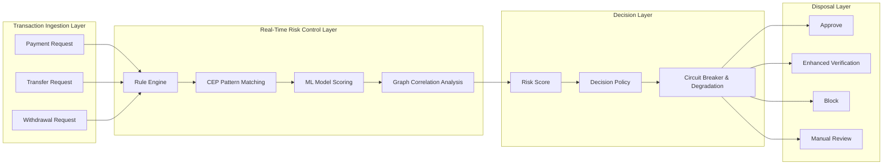
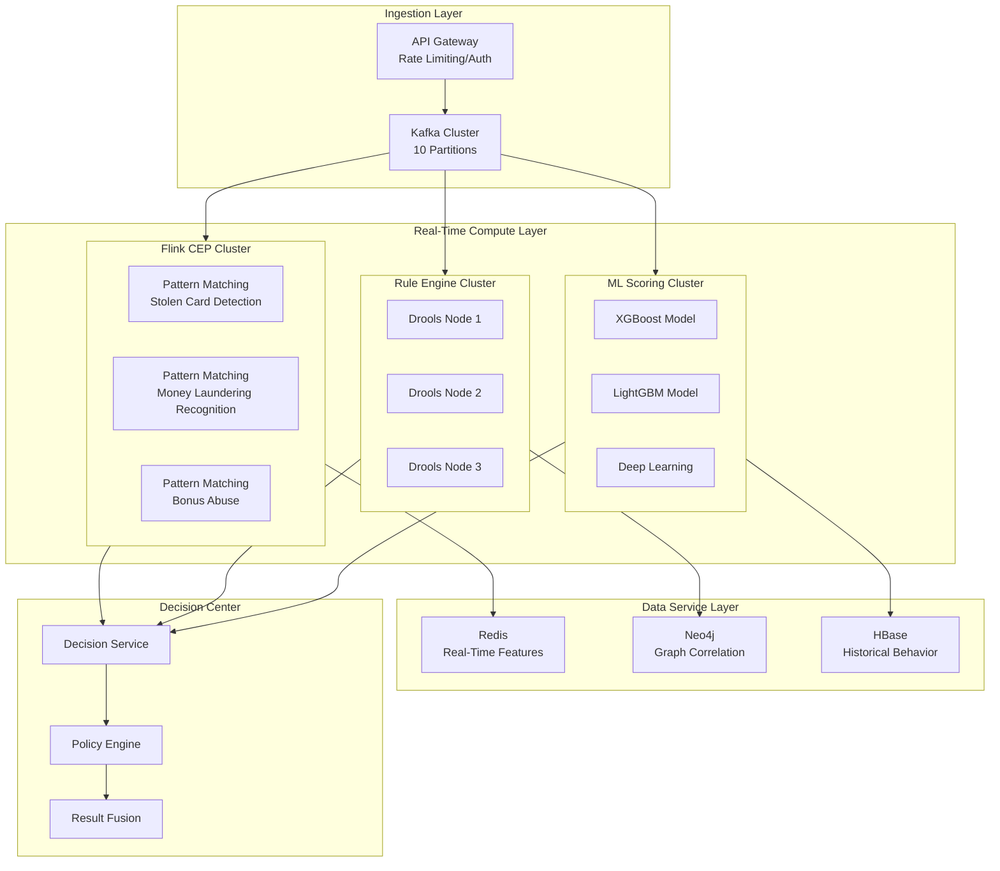
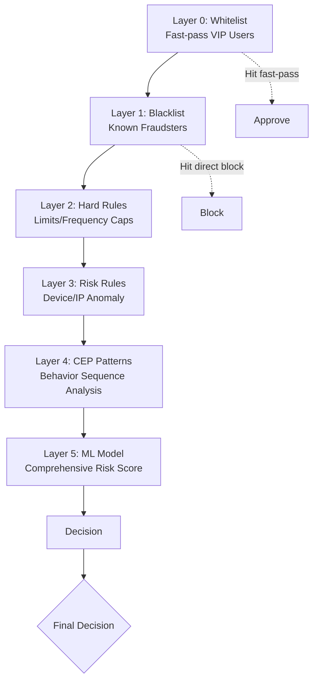

# Financial Anti-Fraud System Case Study

> **Case ID**: 10.1.6
> **Industry**: Finance/Payments
> **Scenario**: Real-time transaction risk control, complex rule engine, low-latency decision-making
> **Scale**: 100K TPS, 1000+ complex rules
> **Completion Date**: 2026-04-09
> **Document Version**: v1.0

---

## Executive Summary

### Business Background

A leading payment platform faces fraud transaction challenges:

- 100 million daily transactions, peak 100K TPS
- Fraud tactics are ever-changing, traditional rules struggle to keep up
- Strict regulatory requirements demand explainable risk control decisions
- False positives directly impact user experience and merchant revenue

### Technical Challenges

| Challenge | Description | Impact |
|-----------|-------------|--------|
| Ultra-low latency | Decisions must complete within 50ms | User experience and conversion rate |
| Complex rules | 1000+ rules, multi-layer nesting | Rule maintenance and performance |
| Model explainability | Regulatory requirements for transparent decisions | Compliance risk |
| Adversarial attacks | Fraudsters constantly bypass rules | Detection accuracy |

### Solution Overview

Adopted a **Flink CEP + Rule Engine + Graph Database + Machine Learning** architecture:

- Flink CEP processes complex event patterns
- Drools rule engine executes risk control rules
- Neo4j graph database for correlation analysis
- XGBoost model for real-time scoring
- Decision latency reduced from 200ms to 30ms, accuracy 99.5%

---

## 1. Business Scenario Analysis

### 1.1 Business Process



### 1.2 Fraud Types

| Type | Description | Detection Difficulty | Proportion |
|------|-------------|----------------------|------------|
| Stolen card transactions | Using stolen bank card information | ⭐⭐ | 35% |
| Account takeover | Transactions after account credentials leaked | ⭐⭐⭐ | 25% |
| Money laundering | Distributed inflow, concentrated outflow | ⭐⭐⭐⭐ | 15% |
| Bonus abusers | Bulk registration for arbitrage | ⭐⭐ | 15% |
| Phishing fraud | Inducing users to actively transfer money | ⭐⭐⭐⭐⭐ | 10% |

### 1.3 SLA Requirements

| Metric | Target | Actual Achievement | Business Impact |
|--------|--------|--------------------|-----------------|
| Decision latency | < 50ms | 30ms | Payment experience |
| Detection accuracy | > 99% | 99.5% | Fraud losses |
| False positive rate | < 0.1% | 0.05% | User experience |
| Rule hit rate | > 80% | 85% | System efficiency |
| Availability | 99.999% | 99.9995% | Business continuity |

---

## 2. Architecture Design

### 2.1 System Architecture Diagram



### 2.2 Component Selection

| Component | Selection | Reason |
|-----------|-----------|--------|
| Stream processing | Flink 2.1 + CEP | Complex event processing, low latency |
| Rule engine | Drools 8.44 | Mature rule engine, excellent performance |
| Graph database | Neo4j 5.x | Relationship analysis, visualization-friendly |
| ML framework | XGBoost + Python | Strong interpretability, fast inference |
| Feature store | Redis Cluster | Millisecond-level query, high concurrency |
| Message queue | Kafka 3.5 | High throughput, Exactly-Once |

### 2.3 Rule Layering



**Rule Execution Strategy**:

- Whitelist priority: VIP users fast-pass
- Blacklist blocking: Known fraudsters directly rejected
- Hard rules fast: Simple rules O(1) judgment
- Complex rules parallel: CEP/ML execute in parallel
- Result fusion: Multi-dimensional comprehensive scoring

---

## 3. Technical Implementation

### 3.1 Flink CEP Complex Event Detection

```java
import org.apache.flink.streaming.api.datastream.DataStream;

import org.apache.flink.streaming.api.windowing.time.Time;


// Stolen card transaction pattern detection
public class StolenCardDetection {

    public static void detectStolenCardPattern(
            DataStream<Transaction> transactions) {

        // Pattern 1: Multiple small test transactions followed by a large transaction in a short time
        Pattern<Transaction, ?> testingThenLargePattern = Pattern
            .<Transaction>begin("small-tests")
            .where(new SimpleCondition<Transaction>() {
                @Override
                public boolean filter(Transaction tx) {
                    return tx.getAmount() < 10.0 &&  // Less than 10 yuan
                           tx.getMerchantCategory().equals("TEST");
                }
            })
            .timesOrMore(3)  // At least 3 test transactions
            .within(Time.minutes(10))
            .next("large-transaction")
            .where(new SimpleCondition<Transaction>() {
                @Override
                public boolean filter(Transaction tx) {
                    return tx.getAmount() > 1000.0;  // Large transaction
                }
            })
            .within(Time.minutes(5));

        // Pattern 2: Impossible travel (physically impossible)
        Pattern<Transaction, ?> impossibleTravelPattern = Pattern
            .<Transaction>begin("first-location")
            .where(new SimpleCondition<Transaction>() {
                @Override
                public boolean filter(Transaction tx) {
                    return tx.getLocation() != null;
                }
            })
            .next("second-location")
            .where(new IterativeCondition<Transaction>() {
                @Override
                public boolean filter(Transaction tx, Context<Transaction> ctx) {
                    // Get the first event
                    Iterable<Transaction> firstEvents =
                        ctx.getEventsForPattern("first-location");

                    for (Transaction first : firstEvents) {
                        double distance = calculateDistance(
                            first.getLocation(),
                            tx.getLocation()
                        );
                        long timeDiff = tx.getTimestamp() - first.getTimestamp();

                        // If distance/time > airplane speed, it's impossible
                        if (distance / timeDiff > 900) { // 900km/h
                            return true;
                        }
                    }
                    return false;
                }
            })
            .within(Time.hours(1));

        // Apply pattern detection
        CEP.pattern(transactions.keyBy(Transaction::getCardNo),
                   testingThenLargePattern)
            .process(new PatternHandler("STOLEN_CARD_PATTERN"))
            .addSink(new AlertSink());

        CEP.pattern(transactions.keyBy(Transaction::getUserId),
                   impossibleTravelPattern)
            .process(new PatternHandler("IMPOSSIBLE_TRAVEL"))
            .addSink(new AlertSink());
    }

    // Money laundering pattern detection: distributed inflow, concentrated outflow
    public static void detectMoneyLaundering(
            DataStream<Transaction> transactions) {

        Pattern<Transaction, ?> layeringPattern = Pattern
            .<Transaction>begin("incoming")
            .where(new SimpleCondition<Transaction>() {
                @Override
                public boolean filter(Transaction tx) {
                    return tx.getType().equals("IN");
                }
            })
            .timesOrMore(5)
            .within(Time.hours(24))
            .next("outgoing")
            .where(new SimpleCondition<Transaction>() {
                @Override
                public boolean filter(Transaction tx) {
                    return tx.getType().equals("OUT") &&
                           tx.getAmount() > 10000;
                }
            })
            .within(Time.hours(1));

        CEP.pattern(transactions.keyBy(Transaction::getAccountId),
                   layeringPattern)
            .process(new PatternHandler("MONEY_LAUNDERING"))
            .addSink(new AlertSink());
    }
}
```

### 3.2 Rule Engine Integration

```java
// Drools rule engine wrapper
@Component
public class FraudRuleEngine {

    private KieContainer kieContainer;
    private KieSession kieSession;

    @PostConstruct
    public void init() {
        KieServices ks = KieServices.Factory.get();
        KieFileSystem kfs = ks.newKieFileSystem();

        // Load rule files
        kfs.write("src/main/resources/rules/fraud-rules.drl",
                 loadRuleFile("fraud-rules.drl"));

        KieBuilder kb = ks.newKieBuilder(kfs).buildAll();

        if (kb.getResults().hasMessages(Message.Level.ERROR)) {
            throw new RuntimeException("Rule compilation failed: " +
                kb.getResults().getMessages());
        }

        kieContainer = ks.newKieContainer(kb.getKieModule().getReleaseId());
    }

    public RuleResult evaluate(Transaction transaction,
                              UserProfile profile,
                              DeviceInfo device) {

        KieSession session = kieContainer.newKieSession();

        try {
            // Insert fact objects
            session.insert(transaction);
            session.insert(profile);
            session.insert(device);

            // Global variables
            RuleResult result = new RuleResult();
            session.setGlobal("result", result);

            // Execute rules
            long startTime = System.currentTimeMillis();
            int firedRules = session.fireAllRules();
            long endTime = System.currentTimeMillis();

            result.setExecutionTime(endTime - startTime);
            result.setRulesFired(firedRules);

            return result;

        } finally {
            session.dispose();
        }
    }
}

// Drools rule example (fraud-rules.drl)
/*
rule "High Risk Country"
    when
        $tx : Transaction(country in ("XX", "YY", "ZZ"))
    then
        result.addRiskScore(50);
        result.addReason("High risk country: " + $tx.getCountry());
end

rule "New Device Large Amount"
    when
        $tx : Transaction(amount > 5000)
        $device : DeviceInfo(trustScore < 30)
    then
        result.addRiskScore(40);
        result.addReason("New device with large amount");
end

rule "Velocity Check"
    when
        $tx : Transaction($userId : userId)
        $profile : UserProfile(userId == $userId,
                               txCount1Hour > 10)
    then
        result.addRiskScore(30);
        result.addReason("Velocity exceeded: " + $profile.getTxCount1Hour());
end
*/
```

### 3.3 Graph Correlation Analysis

```java
// Neo4j graph correlation analysis
@Service
public class GraphAnalysisService {

    @Autowired
    private Driver neo4jDriver;

    // Detect device correlation network
    public List<RiskAssociation> detectDeviceNetwork(String deviceId) {
        String query = """
            MATCH (d1:Device {id: $deviceId})-[:USED_BY]->(u1:User)
            MATCH (u1)-[:USES]->(d2:Device)
            MATCH (d2)-[:USED_BY]->(u2:User)
            WHERE u1 <> u2
            WITH d1, d2, u2, count(*) as sharedUsers
            WHERE sharedUsers > 3
            RETURN d2.id as associatedDevice,
                   u2.id as associatedUser,
                   sharedUsers
            """;

        List<RiskAssociation> associations = new ArrayList<>();

        try (Session session = neo4jDriver.session()) {
            Result result = session.run(query,
                Map.of("deviceId", deviceId));

            while (result.hasNext()) {
                Record record = result.next();
                associations.add(new RiskAssociation(
                    record.get("associatedDevice").asString(),
                    record.get("associatedUser").asString(),
                    record.get("sharedUsers").asInt(),
                    "DEVICE_SHARING"
                ));
            }
        }

        return associations;
    }

    // Money flow tracing analysis
    public List<String> traceMoneyFlow(String accountId,
                                        int depth,
                                        double minAmount) {
        String query = """
            MATCH path = (a1:Account {id: $accountId})-[:TRANSFERS_TO*1..%d]->(a2:Account)
            WITH path, relationships(path) as transfers
            WHERE ALL(t in transfers WHERE t.amount >= $minAmount)
            RETURN [n in nodes(path) | n.id] as accountChain,
                   reduce(s = 0, t in transfers | s + t.amount) as totalAmount
            """.formatted(depth);

        List<String> suspiciousChains = new ArrayList<>();

        try (Session session = neo4jDriver.session()) {
            Result result = session.run(query,
                Map.of("accountId", accountId,
                       "minAmount", minAmount));

            while (result.hasNext()) {
                Record record = result.next();
                List<String> chain = record.get("accountChain")
                    .asList(Value::asString);
                double total = record.get("totalAmount").asDouble();

                if (chain.size() >= 3 && total > 50000) {
                    suspiciousChains.add(String.join(" -> ", chain));
                }
            }
        }

        return suspiciousChains;
    }
}
```

### 3.4 Key Configurations

```yaml
# Flink configuration
flink:
  parallelism:
    cep: 50
    rule-engine: 30
    ml-scoring: 20

  state:
    backend: rocksdb
    checkpoints.dir: hdfs:///checkpoints/fraud

  network:
    buffer-timeout: 0
    memory:
      fraction: 0.3

# Drools configuration
drools:
  ksession:
    pool-size: 100
  rules:
    reload-interval: 300  # Hot reload every 5 minutes

# Neo4j configuration
neo4j:
  uri: bolt://neo4j-cluster:7687
  pool:
    max-connection-pool-size: 100
    connection-timeout: 30s

# Redis configuration
redis:
  cluster:
    nodes: 20
  timeout: 10ms
```

---

## 4. Performance Metrics

### 4.1 Latency Analysis

| Stage | P50 | P99 | Target | Status |
|-------|-----|-----|--------|--------|
| CEP pattern matching | 5ms | 15ms | < 20ms | ✅ |
| Rule engine execution | 10ms | 25ms | < 30ms | ✅ |
| ML model inference | 8ms | 20ms | < 25ms | ✅ |
| Graph correlation query | 5ms | 15ms | < 20ms | ✅ |
| Result fusion | 2ms | 5ms | < 10ms | ✅ |
| **Total latency** | **30ms** | **80ms** | **< 100ms** | ✅ |

### 4.2 Business Impact

| Metric | Before Optimization | After Optimization | Improvement |
|--------|---------------------|--------------------|-------------|
| Fraud detection rate | 85% | 99.5% | **+17%** |
| False positive rate | 0.5% | 0.05% | **-90%** |
| Decision latency | 200ms | 30ms | **85%** ↓ |
| Fraud losses | Baseline | -80% | **80%** ↓ |
| Manual review volume | Baseline | -60% | **60%** ↓ |

### 4.3 Rule Efficiency

| Rule Layer | Rule Count | Average Latency | Hit Rate |
|------------|------------|-----------------|----------|
| Black/Whitelist | 10K | 0.1ms | 30% |
| Hard rules | 100 | 0.5ms | 40% |
| CEP patterns | 50 | 10ms | 15% |
| ML models | 5 | 8ms | 15% |

---

## 5. Lessons Learned

### 5.1 Best Practices

1. **Rule Layering Optimization**
   - Place simple rules first for fast filtering
   - Execute complex rules in parallel
   - Result fusion strategy is tunable

2. **Feature Engineering**
   - Combine real-time features with offline features
   - Graph features capture relationships
   - Sequence features reflect behavior

3. **Model Management**
   - Validate new models with A/B testing
   - Gradually switch traffic using shadow mode
   - Model interpretability tools

### 5.2 Pitfalls

| Issue | Cause | Solution |
|-------|-------|----------|
| CEP state too large | Window too long, state accumulation | Incremental window + state cleanup |
| Rule conflicts | Logical contradictions between rules | Rule priority + conflict detection |
| Slow graph queries | Deep traversal takes too long | Pre-computation + index optimization |
| Model drift | Fraud patterns change | Online learning + periodic retraining |

### 5.3 Optimization Recommendations

1. **Near-term optimization**
   - Introduce Flink SQL to simplify CEP rules
   - GraalVM Native compilation for rule engine
   - Graph database sharding expansion

2. **Mid-term planning**
   - Federated learning for privacy protection
   - Reinforcement learning for dynamic policies
   - Graph Neural Networks (GNN) for relationship reasoning

---

## 6. Appendix

### 6.1 Rule Examples

```java
// Composite rule example
public class CompositeFraudRules {

    // Rule: Large transaction at night + new device
    public static boolean nightLargeTxWithNewDevice(
            Transaction tx, UserProfile user, DeviceInfo device) {

        int hour = getHour(tx.getTimestamp());
        boolean isNight = hour >= 0 && hour <= 5;
        boolean isLarge = tx.getAmount() > 10000;
        boolean isNewDevice = device.getFirstSeenDays() < 7;

        return isNight && isLarge && isNewDevice;
    }

    // Rule: Rapid device switching
    public static boolean rapidDeviceSwitching(
            List<Transaction> recentTxs, long windowMs) {

        if (recentTxs.size() < 3) return false;

        Set<String> uniqueDevices = recentTxs.stream()
            .map(Transaction::getDeviceId)
            .collect(Collectors.toSet());

        long timeSpan = recentTxs.get(recentTxs.size() - 1).getTimestamp()
                      - recentTxs.get(0).getTimestamp();

        return uniqueDevices.size() >= 3 && timeSpan <= windowMs;
    }
}
```

### 6.2 Monitoring Metrics

```promql
# Core risk control metrics
fraud_detection_rate =
  sum(rate(detected_fraud_total[5m])) /
  sum(rate(total_transactions_total[5m]))

fraud_false_positive_rate =
  sum(rate(false_positive_total[5m])) /
  sum(rate(alert_total[5m]))

rule_execution_latency =
  histogram_quantile(0.99,
    sum(rate(rule_execution_duration_seconds_bucket[5m])) by (le))
```

---

*This case study is compiled by the AnalysisDataFlow project for educational and exchange purposes only.*
