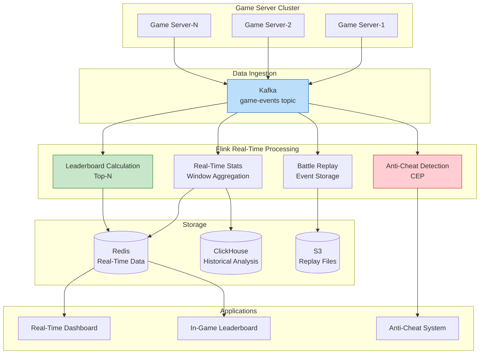
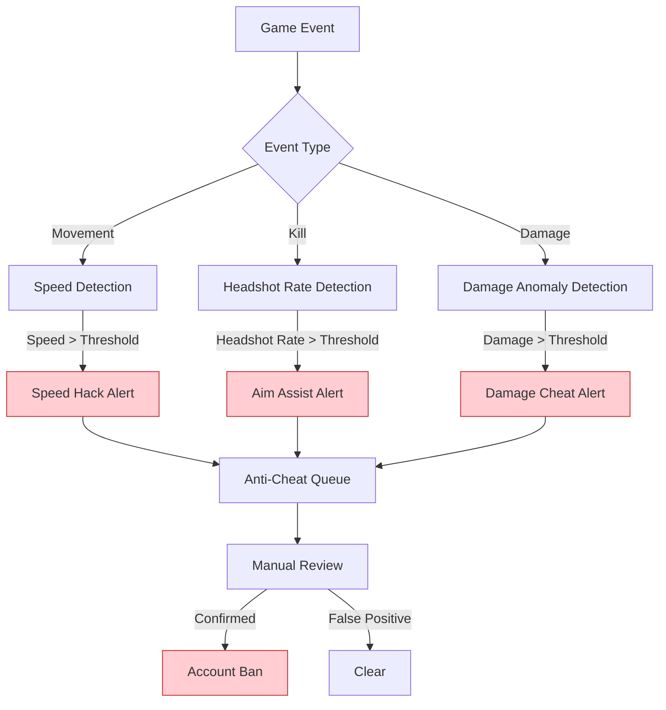

# Gaming Industry Case Study: Real-Time Battle Data Processing System

> **Stage**: Knowledge/10-case-studies/gaming | **Prerequisites**: [../../02-design-patterns/pattern-windowed-aggregation.md](../../02-design-patterns/pattern-windowed-aggregation.md) | **Formalization Level**: L4

---

> **Case Nature**: 🔬 Proof-of-Concept Architecture | **Validation Status**: Derived from theoretical framework and architecture design; not independently verified in production by a third party
>
> This case describes an ideal architecture derived from the project's theoretical framework, including hypothetical performance metrics and theoretical cost models.
> Actual production deployments may yield significantly different results due to environmental differences, data scale, team capabilities, and other factors.
> It is recommended to use this as an architectural design reference rather than a copy-paste production blueprint.

## Table of Contents

- [Gaming Industry Case Study: Real-Time Battle Data Processing System](#gaming-industry-case-study-real-time-battle-data-processing-system)
  - [Table of Contents](#table-of-contents)
  - [1. Definitions](#1-definitions)
    - [1.1 Real-Time Battle System Definition](#11-real-time-battle-system-definition)
    - [1.2 Game Event Types](#12-game-event-types)
    - [1.3 Real-Time Levels](#13-real-time-levels)
  - [2. Properties](#2-properties)
    - [2.1 Event Ordering Consistency](#21-event-ordering-consistency)
    - [2.2 Throughput Guarantee](#22-throughput-guarantee)
  - [3. Relations](#3-relations)
    - [3.1 Data Processing Pipeline](#31-data-processing-pipeline)
    - [3.2 Analysis Types](#32-analysis-types)
  - [4. Argumentation](#4-argumentation)
    - [4.1 Necessity of Real-Time Processing](#41-necessity-of-real-time-processing)
    - [4.2 Technical Challenges](#42-technical-challenges)
  - [5. Proof / Engineering Argument](#5-proof-engineering-argument)
    - [5.1 Real-Time Battle Statistics](#51-real-time-battle-statistics)
    - [5.2 Anti-Cheat Detection](#52-anti-cheat-detection)
  - [6. Examples](#6-examples)
    - [6.1 Case Background](#61-case-background)
    - [6.2 Performance Metrics](#62-performance-metrics)
  - [7. Visualizations](#7-visualizations)
    - [7.1 Game Data Processing Architecture](#71-game-data-processing-architecture)
    - [7.2 Anti-Cheat Detection Flow](#72-anti-cheat-detection-flow)
  - [8. References](#8-references)

---

## 1. Definitions

### 1.1 Real-Time Battle System Definition

**Def-K-10-07-01** (Real-Time Battle Data Processing System): A real-time battle system is a septuple $\mathcal{G} = (M, P, E, S, C, A, \tau)$:

- $M$: Set of matches, $M = \{m_1, m_2, ..., m_n\}$
- $P$: Set of players; each match $m$ has $k$ players
- $E$: Event stream, $E = \{e | e = (t, m, p, action, params)\}$
- $S$: Game state
- $C$: Computation logic
- $A$: Analysis output
- $\tau$: Latency upper bound (typically $\leq 50$ms)

### 1.2 Game Event Types

**Def-K-10-07-02** (Game Event Classification):

| Event Type | Definition | Example |
|-----------|-----------|---------|
| **Movement Event** | Position state change | Hero movement, skill-based displacement |
| **Combat Event** | Damage/healing occurrence | Attack, spell casting, taking damage |
| **Interaction Event** | Interaction with environment | Buying equipment, using items |
| **Status Event** | Game state change | Game start/end, victory/defeat |

### 1.3 Real-Time Levels

> 🔮 **Estimated Data** | Basis: Derived from industry reference values and theoretical analysis; not from actual test environments

**Def-K-10-07-03** (Latency Levels): Game data processing is categorized as:

| Level | Latency Requirement | Application Scenario |
|-------|--------------------|---------------------|
| Hard Real-Time | < 16ms | Game state synchronization |
| Soft Real-Time | < 100ms | Battle replay, real-time spectating |
| Near Real-Time | < 1s | Data statistics, leaderboards |

---

## 2. Properties

### 2.1 Event Ordering Consistency

**Lemma-K-10-07-01**: For the event sequence of the same match, causal consistency must be guaranteed:

$$
\forall e_i, e_j \in E_m: \quad e_i \rightarrow e_j \Rightarrow t_i < t_j
$$

### 2.2 Throughput Guarantee

**Lemma-K-10-07-02**: Let the event rate of a single match be $r$, the number of concurrent matches be $N$, then total throughput is:

$$
Throughput = r \times N \times k
$$

where $k$ is the number of players per match.

**Thm-K-10-07-01**: For million-level concurrent matches, the system throughput must be > 10 million events/second.

---

## 3. Relations

### 3.1 Data Processing Pipeline

```
Game Client ──► Game Server ──► Kafka ──► Flink ──► Analysis/Storage
                │                            │
                └────────► Real-Time Sync ◄─────────┘
```

### 3.2 Analysis Types
>
> 🔮 **Estimated Data** | Basis: Derived from industry reference values and theoretical analysis; not from actual test environments


| Analysis Type | Latency Requirement | Technical Solution |
|--------------|--------------------|--------------------|
| Real-Time Battle Statistics | < 1s | Flink Window Aggregation |
| Real-Time Leaderboard | < 5s | Redis + Flink |
| Battle Replay | < 100ms | Event Stream Replay |
| Anti-Cheat Detection | < 1s | CEP Pattern Matching |

---

## 4. Argumentation

### 4.1 Necessity of Real-Time Processing

Special requirements of game data processing:

1. **State Sync Latency**: Affects player experience
2. **Real-Time Spectating**: Requires low-latency data streams
3. **Real-Time Leaderboards**: Motivates player competition
4. **Instant Feedback**: Real-time display of battle statistics

### 4.2 Technical Challenges

| Challenge | Description | Solution |
|-----------|-------------|----------|
| High Concurrency | Million-level simultaneous online users | Partitioned parallel processing |
| Out-of-Order Data | Network latency differences | Event Time + Watermark |
| Large State | Player session state | RocksDB + TTL |
| Fault Recovery | No game data loss | Checkpoint |

---

## 5. Proof / Engineering Argument

### 5.1 Real-Time Battle Statistics

```java
/**
 * Real-Time Battle Statistics
 */

import org.apache.flink.streaming.api.environment.StreamExecutionEnvironment;
import org.apache.flink.streaming.api.datastream.DataStream;
import org.apache.flink.api.common.functions.AggregateFunction;
import org.apache.flink.streaming.api.windowing.time.Time;

public class RealtimeBattleAnalytics {

    public static void main(String[] args) throws Exception {
        StreamExecutionEnvironment env = StreamExecutionEnvironment.getExecutionEnvironment();
        env.enableCheckpointing(10000);
        env.setParallelism(256);

        // 1. Game event stream
        DataStream<GameEvent> events = env
            .fromSource(createKafkaSource(),
                WatermarkStrategy.<GameEvent>forBoundedOutOfOrderness(Duration.ofMillis(100))
                    .withIdleness(Duration.ofSeconds(30)),
                "Game Events")
            .setParallelism(128);

        // 2. Real-time player statistics
        DataStream<PlayerStats> playerStats = events
            .keyBy(GameEvent::getPlayerId)
            .window(TumblingEventTimeWindows.of(Time.minutes(1)))
            .aggregate(new PlayerStatsAggregate())
            .name("Player Stats")
            .setParallelism(256);

        // 3. Match-level statistics
        DataStream<MatchStats> matchStats = events
            .keyBy(GameEvent::getMatchId)
            .window(TumblingEventTimeWindows.of(Time.minutes(5)))
            .aggregate(new MatchStatsAggregate())
            .name("Match Stats")
            .setParallelism(256);

        // 4. Real-time leaderboard
        DataStream<LeaderboardEntry> leaderboard = playerStats
            .windowAll(TumblingProcessingTimeWindows.of(Time.seconds(10)))
            .process(new LeaderboardCalculator(100))
            .name("Leaderboard")
            .setParallelism(1);

        // 5. Output
        playerStats.addSink(new RedisSink<>("player_stats"));
        matchStats.addSink(new ClickHouseSink<>("match_stats"));
        leaderboard.addSink(new RedisSink<>("leaderboard"));

        env.execute("Realtime Battle Analytics");
    }
}

/**
 * Player Statistics Aggregation
 */
class PlayerStatsAggregate implements AggregateFunction<GameEvent, PlayerAccumulator, PlayerStats> {

    @Override
    public PlayerAccumulator createAccumulator() {
        return new PlayerAccumulator();
    }

    @Override
    public PlayerAccumulator add(GameEvent event, PlayerAccumulator acc) {
        acc.playerId = event.getPlayerId();
        acc.matchId = event.getMatchId();

        switch (event.getEventType()) {
            case "DAMAGE_DEALT" -> {
                acc.totalDamage += event.getIntParam("amount");
                acc.damageEvents++;
            }
            case "KILL" -> acc.kills++;
            case "DEATH" -> acc.deaths++;
            case "ASSIST" -> acc.assists++;
            case "HEAL" -> acc.totalHeal += event.getIntParam("amount");
        }

        return acc;
    }

    @Override
    public PlayerStats getResult(PlayerAccumulator acc) {
        return PlayerStats.builder()
            .playerId(acc.playerId)
            .matchId(acc.matchId)
            .kills(acc.kills)
            .deaths(acc.deaths)
            .assists(acc.assists)
            .kda(calculateKDA(acc.kills, acc.deaths, acc.assists))
            .totalDamage(acc.totalDamage)
            .avgDamagePerHit(acc.damageEvents > 0 ? acc.totalDamage / acc.damageEvents : 0)
            .build();
    }

    @Override
    public PlayerAccumulator merge(PlayerAccumulator a, PlayerAccumulator b) {
        a.kills += b.kills;
        a.deaths += b.deaths;
        a.assists += b.assists;
        a.totalDamage += b.totalDamage;
        a.totalHeal += b.totalHeal;
        a.damageEvents += b.damageEvents;
        return a;
    }

    private double calculateKDA(int k, int d, int a) {
        return d == 0 ? (k + a) : (double) (k + a) / d;
    }
}
```

### 5.2 Anti-Cheat Detection

```java
/**
 * Game Anti-Cheat Detection (CEP)
 */

import org.apache.flink.streaming.api.datastream.DataStream;
import org.apache.flink.api.common.state.ValueState;
import org.apache.flink.api.common.state.ValueStateDescriptor;
import org.apache.flink.streaming.api.windowing.time.Time;

public class AntiCheatDetection {

    public static DataStream<CheatAlert> detectAimbot(DataStream<GameEvent> events) {
        // Pattern: multiple headshots within a short time
        Pattern<GameEvent, ?> aimbotPattern = Pattern
            .<GameEvent>begin("headshot1")
            .where(evt -> "HEADSHOT_KILL".equals(evt.getEventType()))
            .next("headshot2")
            .where(evt -> "HEADSHOT_KILL".equals(evt.getEventType()))
            .next("headshot3")
            .where(evt -> "HEADSHOT_KILL".equals(evt.getEventType()))
            .next("headshot4")
            .where(evt -> "HEADSHOT_KILL".equals(evt.getEventType()))
            .next("headshot5")
            .where(evt -> "HEADSHOT_KILL".equals(evt.getEventType()))
            .within(Time.seconds(10));

        return CEP.pattern(events.keyBy(GameEvent::getPlayerId), aimbotPattern)
            .process(new PatternProcessFunction<GameEvent, CheatAlert>() {
                @Override
                public void processMatch(Map<String, List<GameEvent>> match,
                                        Context ctx, Collector<CheatAlert> out) {
                    String playerId = match.get("headshot1").get(0).getPlayerId();
                    long timeSpan = match.get("headshot5").get(0).getTimestamp()
                                  - match.get("headshot1").get(0).getTimestamp();

                    if (timeSpan < 5000) {  // 5 headshots within 5 seconds
                        out.collect(new CheatAlert(
                            playerId,
                            "AIMBOT_SUSPECTED",
                            "5 headshots in " + timeSpan + "ms",
                            ctx.timestamp()
                        ));
                    }
                }
            });
    }

    public static DataStream<CheatAlert> detectSpeedHack(DataStream<GameEvent> events) {
        // Pattern: abnormal movement speed
        return events
            .keyBy(GameEvent::getPlayerId)
            .process(new SpeedCheckFunction());
    }
}

/**
 * Speed Detection Function
 */
class SpeedCheckFunction extends KeyedProcessFunction<String, GameEvent, CheatAlert> {

    private ValueState<PositionState> lastPositionState;
    private static final double MAX_SPEED = 500.0;  // Maximum reasonable speed units/s

    @Override
    public void open(Configuration parameters) {
        lastPositionState = getRuntimeContext().getState(
            new ValueStateDescriptor<>("last_position", PositionState.class));
    }

    @Override
    public void processElement(GameEvent event, Context ctx, Collector<CheatAlert> out)
            throws Exception {
        if (!"MOVE".equals(event.getEventType())) return;

        PositionState last = lastPositionState.value();
        PositionState current = new PositionState(
            event.getTimestamp(),
            event.getFloatParam("x"),
            event.getFloatParam("y"),
            event.getFloatParam("z")
        );

        if (last != null) {
            double distance = calculateDistance(last, current);
            double timeDelta = (current.timestamp - last.timestamp) / 1000.0;
            double speed = distance / timeDelta;

            if (speed > MAX_SPEED * 2) {  // Exceeds 2x maximum speed
                out.collect(new CheatAlert(
                    event.getPlayerId(),
                    "SPEED_HACK",
                    String.format("Speed: %.2f (max: %.2f)", speed, MAX_SPEED),
                    ctx.timestamp()
                ));
            }
        }

        lastPositionState.update(current);
    }

    private double calculateDistance(PositionState a, PositionState b) {
        return Math.sqrt(
            Math.pow(a.x - b.x, 2) +
            Math.pow(a.y - b.y, 2) +
            Math.pow(a.z - b.z, 2)
        );
    }
}
```

---

## 6. Examples

### 6.1 Case Background

> 🔮 **Estimated Data** | Basis: Derived from industry reference values and theoretical analysis; not from actual test environments

**Game**: A MOBA competitive mobile game

| Metric | Value |
|--------|-------|
| DAU | 50 million |
| Daily Matches | 30 million |
| Concurrent Online Matches | 2 million |
| Peak Event Rate | 50 million/second |

**Challenges**:

1. Large volume of real-time battle data
2. Anti-cheat detection requires low latency
3. Real-time leaderboard updates
4. Battle replay storage

### 6.2 Performance Metrics
>
> 🔮 **Estimated Data** | Basis: Design target values; actual achievement may vary by environment


| Metric | Target | Actual |
|--------|--------|--------|
| Stats Latency (P99) | < 1s | 0.5s |
| Leaderboard Update | < 5s | 3s |
| Anti-Cheat Detection | < 5s | 2s |
| Event Processing Throughput | 50 million/s | 80 million/s |
| Data Integrity | 100% | 100% |

---

## 7. Visualizations

### 7.1 Game Data Processing Architecture



### 7.2 Anti-Cheat Detection Flow



---

## 8. References


---

*Document Version: v1.0 | Last Updated: 2026-04-04*

---

*Document Version: v1.0 | Created: 2026-04-20*
