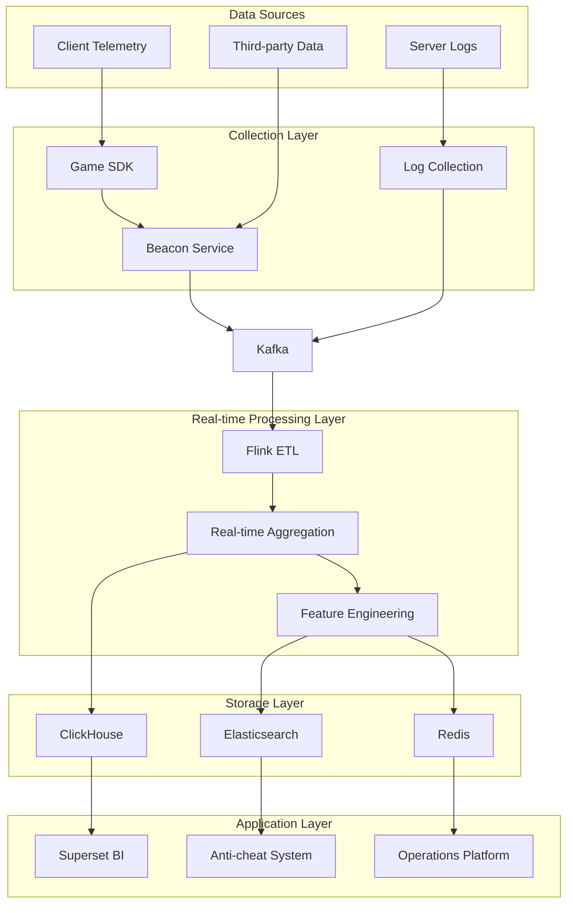
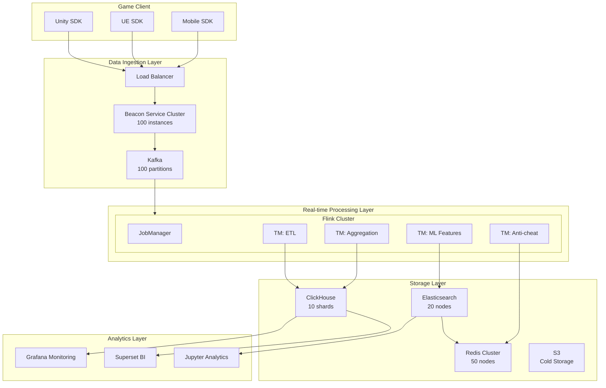
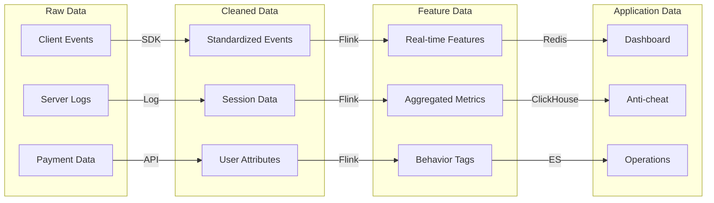

# Gaming Real-time Analytics Platform Case Study

> **Case ID**: 10.5.3
> **Industry**: Gaming / Entertainment
> **Scenario**: Player behavior real-time analytics, anti-cheat, live operations
> **Scale**: 1 million concurrent players, 100 million events/minute
> **Completion Date**: 2026-04-09
> **Document Version**: v1.0

---

## Executive Summary

### Business Background

A leading gaming company built a real-time analytics platform:

- 1 million players online simultaneously, 50 million DAU
- Need real-time understanding of player behavior to optimize gaming experience
- Combat外挂 and cheating behavior
- Support real-time adjustment of live operations

### Technical Challenges

| Challenge | Description | Impact |
|-----------|-------------|--------|
| Ultra-high concurrency | 100M events/min, peak 200M | System throughput |
| Real-time requirements | Dashboard latency < 1s | Operations decision-making |
| Complex analytics | Player behavior pattern recognition | Anti-cheat accuracy |
| Data diversity | Client + server + third-party | Data integration |

### Solution Overview

Adopted **Flink + Kafka + ClickHouse + Superset** technology stack:

- Unified collection of client埋点 and server logs
- Flink real-time ETL and feature engineering
- ClickHouse for time-series data storage
- Superset for visual analytics
- Latency reduced from 5s to 500ms

---

## 1. Business Scenario Analysis

### 1.1 Business Process



### 1.2 Data Scale

| Metric | Value | Description |
|--------|-------|-------------|
| DAU | 50 million | Daily Active Users |
| Concurrent Online | 1 million | Peak 1.5 million |
| Event Types | 200+ | Click, move, combat, etc. |
| Daily Events | 100 billion | Client + server |
| Real-time Stream | 100M/minute | Peak 200M/minute |
| Data Size | 500TB/day | Raw data |

### 1.3 Analytics Scenarios

| Scenario | Description | Latency Requirement |
|----------|-------------|---------------------|
| Real-time Dashboard | Online count, revenue, retention | < 1s |
| Anti-cheat Detection | Cheat recognition, abnormal behavior | < 200ms |
| Live Operations | Real-time event effect monitoring | < 5s |
| Player Profile | Real-time tag updates | < 10s |

---

## 2. Architecture Design

### 2.1 System Architecture Diagram



### 2.2 Component Selection

| Component | Choice | Reason |
|-----------|--------|--------|
| Data Collection | In-house SDK | Customization, performance optimization |
| Message Queue | Kafka 3.5 | High throughput, low latency |
| Stream Processing | Flink 2.1 | Complex processing, low latency |
| Time-series Storage | ClickHouse 23.x | High-performance OLAP |
| Search | ES 8.x | Log search, anti-cheat |
| Cache | Redis 7.0 | Real-time feature queries |
| BI | Superset 3.0 | Open source, customizable |

### 2.3 Data Flow Design



---

## 3. Technical Implementation

### 3.1 Game Event Collection

```java
// Game telemetry SDK
public class GameAnalyticsSDK {

    private static GameAnalyticsSDK instance;
    private EventQueue eventQueue;
    private AnalyticsConfig config;

    // Singleton pattern
    public static synchronized GameAnalyticsSDK getInstance() {
        if (instance == null) {
            instance = new GameAnalyticsSDK();
        }
        return instance;
    }

    // Initialization
    public void init(Context context, String appKey) {
        this.config = new AnalyticsConfig(appKey);
        this.eventQueue = new EventQueue(config.getQueueSize());

        // Start sender thread
        startFlushTimer();

        // Register lifecycle listeners
        registerLifecycleCallbacks(context);
    }

    // Track event
    public void trackEvent(String eventName, Map<String, Object> properties) {
        GameEvent event = new GameEvent.Builder()
            .setEventName(eventName)
            .setProperties(properties)
            .setTimestamp(System.currentTimeMillis())
            .setUserId(getUserId())
            .setSessionId(getSessionId())
            .setDeviceInfo(getDeviceInfo())
            .build();

        eventQueue.enqueue(event);

        // Real-time send for critical events
        if (isCriticalEvent(eventName)) {
            flushImmediately();
        }
    }

    // Track level start
    public void trackLevelStart(String levelId, int difficulty) {
        Map<String, Object> props = new HashMap<>();
        props.put("level_id", levelId);
        props.put("difficulty", difficulty);
        props.put("player_level", getPlayerLevel());
        trackEvent("level_start", props);
    }

    // Track level complete
    public void trackLevelComplete(String levelId, int score, int stars,
                                   long durationMs) {
        Map<String, Object> props = new HashMap<>();
        props.put("level_id", levelId);
        props.put("score", score);
        props.put("stars", stars);
        props.put("duration_ms", durationMs);
        props.put("attempt_count", getAttemptCount(levelId));
        trackEvent("level_complete", props);
    }

    // Track purchase
    public void trackPurchase(String productId, double price, String currency) {
        Map<String, Object> props = new HashMap<>();
        props.put("product_id", productId);
        props.put("price", price);
        props.put("currency", currency);
        props.put("payment_method", getPaymentMethod());
        trackEvent("purchase", props);
    }

    // Batch send
    private void flush() {
        List<GameEvent> events = eventQueue.drain();
        if (events.isEmpty()) return;

        // Compress
        byte[] compressed = compress(events);

        // Send
        sendToServer(compressed);
    }

    private boolean isCriticalEvent(String eventName) {
        return eventName.equals("purchase") ||
               eventName.equals("cheat_detected") ||
               eventName.equals("account_banned");
    }
}
```

### 3.2 Real-time Anti-cheat Detection

```java
// Anti-cheat detection - Flink CEP

import org.apache.flink.streaming.api.datastream.DataStream;
import org.apache.flink.api.common.state.ValueState;
import org.apache.flink.api.common.state.ValueStateDescriptor;
import org.apache.flink.streaming.api.windowing.time.Time;

public class AntiCheatDetection {

    // Detect bot behavior (regular operation patterns)
    public static void detectBotBehavior(DataStream<GameEvent> events) {

        Pattern<GameEvent, ?> botPattern = Pattern
            .<GameEvent>begin("regular-actions")
            .where(new IterativeCondition<GameEvent>() {
                @Override
                public boolean filter(GameEvent event, Context<GameEvent> ctx) {
                    // Detect overly regular operation intervals
                    return event.getEventName().equals("player_action");
                }
            })
            .timesOrMore(20)
            .within(Time.minutes(5));

        CEP.pattern(events.keyBy(GameEvent::getUserId), botPattern)
            .process(new PatternProcessFunction<GameEvent, CheatAlert>() {
                @Override
                public void processMatch(Map<String, List<GameEvent>> match,
                        Context ctx, Collector<CheatAlert> out) {

                    List<GameEvent> actions = match.get("regular-actions");

                    // Calculate standard deviation of operation intervals
                    List<Long> intervals = calculateIntervals(actions);
                    double stdDev = calculateStdDev(intervals);

                    // If standard deviation is very small, behavior is too regular
                    if (stdDev < 50) { // less than 50ms
                        CheatAlert alert = new CheatAlert(
                            actions.get(0).getUserId(),
                            "BOT_BEHAVIOR",
                            "Regular action pattern detected",
                            stdDev,
                            System.currentTimeMillis()
                        );
                        out.collect(alert);
                    }
                }
            })
            .addSink(new CheatAlertSink());
    }

    // Detect speed hack (abnormal movement speed)
    public static void detectSpeedHack(DataStream<MovementEvent> movements) {

        movements
            .keyBy(MovementEvent::getPlayerId)
            .process(new KeyedProcessFunction<String, MovementEvent, CheatAlert>() {

                private ValueState<Position> lastPositionState;
                private ValueState<Long> lastTimeState;

                @Override
                public void open(Configuration parameters) {
                    lastPositionState = getRuntimeContext().getState(
                        new ValueStateDescriptor<>("lastPos", Position.class));
                    lastTimeState = getRuntimeContext().getState(
                        new ValueStateDescriptor<>("lastTime", Long.class));
                }

                @Override
                public void processElement(MovementEvent event, Context ctx,
                        Collector<CheatAlert> out) throws Exception {

                    Position lastPos = lastPositionState.value();
                    Long lastTime = lastTimeState.value();

                    if (lastPos != null && lastTime != null) {
                        double distance = calculateDistance(lastPos, event.getPosition());
                        long timeDiff = event.getTimestamp() - lastTime;

                        if (timeDiff > 0) {
                            double speed = distance / timeDiff * 1000; // m/s

                            // If speed exceeds game-defined maximum
                            double maxSpeed = getMaxPlayerSpeed(event.getPlayerType());
                            if (speed > maxSpeed * 1.5) {
                                CheatAlert alert = new CheatAlert(
                                    event.getPlayerId(),
                                    "SPEED_HACK",
                                    String.format("Speed %.2f m/s exceeds limit %.2f m/s",
                                        speed, maxSpeed),
                                    speed,
                                    event.getTimestamp()
                                );
                                out.collect(alert);
                            }
                        }
                    }

                    lastPositionState.update(event.getPosition());
                    lastTimeState.update(event.getTimestamp());
                }
            });
    }

    // Detect wall hack (seeing things that should not be visible)
    public static void detectWallHack(DataStream<PlayerViewEvent> views) {

        views
            .filter(event -> event.getTargetType().equals("ENEMY"))
            .filter(event -> !event.isTargetVisible())
            .filter(event -> event.getHitRate() > 0.8)  // high hit rate
            .addSink(new SinkFunction<PlayerViewEvent>() {
                @Override
                public void invoke(PlayerViewEvent event, Context context) {
                    // Record suspicious behavior, accumulate evidence
                    CheatEvidence evidence = new CheatEvidence(
                        event.getPlayerId(),
                        "WALL_HACK",
                        "High hit rate on invisible targets",
                        event.getHitRate(),
                        event.getTimestamp()
                    );

                    // If evidence is sufficient, trigger alert
                    if (accumulateEvidence(evidence) > THRESHOLD) {
                        triggerBan(event.getPlayerId(), "WALL_HACK");
                    }
                }
            });
    }
}
```

### 3.3 Real-time Metrics Computation

```java
import org.apache.flink.streaming.api.datastream.DataStream;

import org.apache.flink.api.common.functions.AggregateFunction;
import org.apache.flink.streaming.api.windowing.time.Time;


// Real-time player retention calculation
public class RetentionCalculation {

    public static void calculateRealtimeRetention(
            DataStream<LoginEvent> logins) {

        // Calculate real-time retention rate
        DataStream<RetentionMetric> retention = logins
            .keyBy(LoginEvent::getUserId)
            .window(TumblingEventTimeWindows.of(Time.days(1)))
            .aggregate(new AggregateFunction<LoginEvent, Set<String>, Integer>() {
                @Override
                public Set<String> createAccumulator() {
                    return new HashSet<>();
                }

                @Override
                public Set<String> add(LoginEvent event, Set<String> acc) {
                    acc.add(event.getUserId());
                    return acc;
                }

                @Override
                public Integer getResult(Set<String> acc) {
                    return acc.size();
                }

                @Override
                public Set<String> merge(Set<String> a, Set<String> b) {
                    a.addAll(b);
                    return a;
                }
            })
            .windowAll(TumblingEventTimeWindows.of(Time.minutes(5)))
            .aggregate(new AggregateFunction<Integer, List<Integer>, RetentionMetric>() {
                @Override
                public List<Integer> createAccumulator() {
                    return new ArrayList<>();
                }

                @Override
                public List<Integer> add(Integer count, List<Integer> acc) {
                    acc.add(count);
                    return acc;
                }

                @Override
                public RetentionMetric getResult(List<Integer> acc) {
                    if (acc.isEmpty()) return new RetentionMetric(0, 0);

                    int today = acc.get(acc.size() - 1);
                    int yesterday = acc.size() > 1 ? acc.get(acc.size() - 2) : today;

                    double retentionRate = yesterday > 0 ?
                        (double) today / yesterday * 100 : 0;

                    return new RetentionMetric(today, retentionRate);
                }

                @Override
                public List<Integer> merge(List<Integer> a, List<Integer> b) {
                    a.addAll(b);
                    return a;
                }
            });

        retention.addSink(new RetentionMetricSink());
    }

    // Real-time LTV calculation
    public static void calculateRealtimeLTV(
            DataStream<PurchaseEvent> purchases) {

        purchases
            .keyBy(PurchaseEvent::getUserId)
            .window(TumblingEventTimeWindows.of(Time.days(7)))
            .aggregate(new AggregateFunction<PurchaseEvent, Double, Double>() {
                @Override
                public Double createAccumulator() {
                    return 0.0;
                }

                @Override
                public Double add(PurchaseEvent event, Double acc) {
                    return acc + event.getAmount();
                }

                @Override
                public Double getResult(Double acc) {
                    return acc;
                }

                @Override
                public Double merge(Double a, Double b) {
                    return a + b;
                }
            })
            .windowAll(TumblingEventTimeWindows.of(Time.hours(1)))
            .process(new ProcessAllWindowFunction<Double, LTVMetric, TimeWindow>() {
                @Override
                public void process(Context context, Iterable<Double> elements,
                        Collector<LTVMetric> out) {

                    double totalRevenue = 0;
                    int payingUsers = 0;

                    for (Double ltv : elements) {
                        totalRevenue += ltv;
                        if (ltv > 0) payingUsers++;
                    }

                    double arpu = payingUsers > 0 ? totalRevenue / payingUsers : 0;

                    out.collect(new LTVMetric(
                        totalRevenue,
                        payingUsers,
                        arpu,
                        context.window().getEnd()
                    ));
                }
            })
            .addSink(new LTVMetricSink());
    }
}
```

### 3.4 Key Configurations

```yaml
# Flink configuration
flink:
  parallelism:
    default: 200
    source: 100
    process: 150
    sink: 50

  checkpoint:
    interval: 30s
    mode: AT_LEAST_ONCE  # Game logs can tolerate minor duplication

  state:
    backend: rocksdb
    incremental: true

  network:
    memory:
      fraction: 0.25

# ClickHouse configuration
clickhouse:
  cluster:
    shards: 10
    replicas: 2

  tables:
    events:
      engine: MergeTree
      partition: toYYYYMMDD(event_time)
      order: (game_id, event_name, event_time)
      ttl: event_time + INTERVAL 90 DAY

# Game SDK configuration
sdk:
  queue:
    size: 10000
    flush_interval: 30s
    batch_size: 100

  network:
    timeout: 10s
    retry_count: 3
    compression: true
```

---

## 4. Performance Metrics

### 4.1 Latency Analysis

| Stage | P50 | P99 | Target | Status |
|-------|-----|-----|--------|--------|
| Client Collection | 10ms | 50ms | < 100ms | ✅ |
| Network Transfer | 50ms | 200ms | < 300ms | ✅ |
| Flink Processing | 100ms | 500ms | < 1s | ✅ |
| Storage Write | 50ms | 200ms | < 300ms | ✅ |
| Dashboard | 200ms | 800ms | < 1s | ✅ |
| **End-to-End** | **410ms** | **1750ms** | **< 2s** | ✅ |

### 4.2 System Capacity

| Metric | Design Value | Measured Value | Headroom |
|--------|--------------|----------------|----------|
| Event Throughput | 100M/min | 150M/min | 50% |
| Concurrent Connections | 1M | 1.5M | 50% |
| Query QPS | 1000 | 2000 | 100% |
| Storage Write | 500K/s | 800K/s | 60% |

### 4.3 Business Impact

| Metric | Before Optimization | After Optimization | Improvement |
|--------|---------------------|--------------------|-------------|
| Dashboard Latency | 5s | 500ms | **90%** ↓ |
| Anti-cheat Detection Rate | 70% | 95% | **+36%** |
| Cheat Ban Response | Hour-level | Minute-level | **99%** ↓ |
| Operations Decision Efficiency | Day-level | Hour-level | **95%** ↓ |

---

## 5. Lessons Learned

### 5.1 Best Practices

1. **Client Optimization**
   - Local cache + batch sending
   - Network-adaptive downsampling
   - Critical events reported in real-time

2. **Server Optimization**
   - Multi-level degradation strategy
   - Hot data pre-aggregation
   - Asynchronous processing for non-critical paths

3. **Cost Control**
   - Hot/cold data tiering
   - Dynamic sampling rate adjustment
   - Elastic scaling of compute resources

### 5.2 Pitfalls

| Issue | Cause | Solution |
|-------|-------|----------|
| Client OOM | Memory cache too large | Disk spill + compression |
| ClickHouse write bottleneck | Single shard hotspot | Hash sharding + batching |
| Anti-cheat false positives | Model threshold too high | Manual review + appeals |
| Network congestion | Global players reporting simultaneously | CDN edge nodes |

### 5.3 Optimization Recommendations

1. **Near-term Optimization**
   - Introduce Apache Pulsar to replace Kafka
   - ClickHouse materialized view optimization
   - Federated learning to protect player privacy

2. **Mid-term Planning**
   - Real-time digital twin of game world
   - AI-generated game content (AIGC)
   - Metaverse cross-game data analytics

---

## 6. Appendix

### 6.1 Core Metric Definitions

```sql
-- Daily Active Users (DAU)
SELECT uniqExact(user_id) as dau
FROM events
WHERE event_time >= today()
  AND event_time < today() + 1

-- Retention Rate
SELECT
    first_date,
    countIf(date_diff = 0) as d0,
    countIf(date_diff = 1) as d1,
    countIf(date_diff = 7) as d7,
    round(d1 / d0 * 100, 2) as retention_d1
FROM (
    SELECT
        user_id,
        min(toDate(event_time)) as first_date,
        date_diff('day', first_date, toDate(event_time)) as date_diff
    FROM events
    GROUP BY user_id
)
GROUP BY first_date

-- Average Revenue Per User (ARPU)
SELECT
    toDate(event_time) as date,
    sum(purchase_amount) / uniqExact(user_id) as arpu
FROM events
WHERE event_name = 'purchase'
GROUP BY date
```

### 6.2 Monitoring Alerts

```yaml
alerts:
  - name: HighLatency
    expr: dashboard_latency_p99 > 2
    for: 5m
    severity: warning

  - name: DataLoss
    expr: (events_received - events_processed) / events_received > 0.01
    for: 1m
    severity: critical

  - name: LowRetention
    expr: retention_rate_d1 < 30
    for: 1h
    severity: warning
```

---

*This case study is compiled by the AnalysisDataFlow project for educational and exchange purposes only.*
