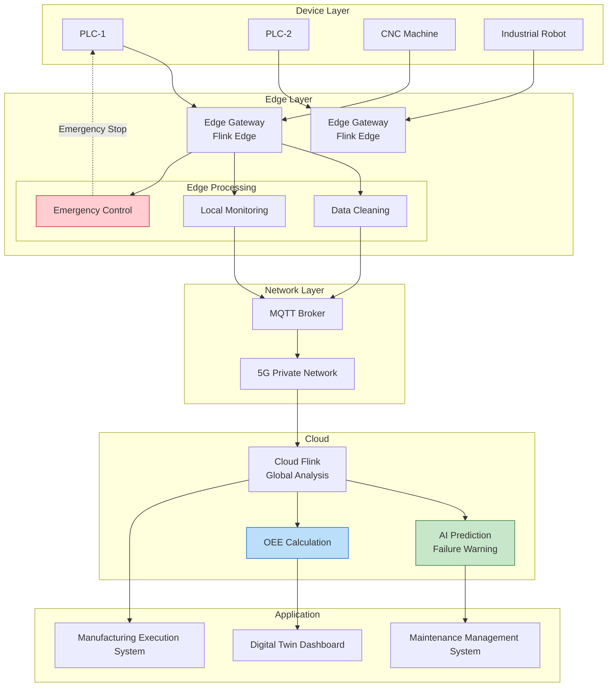
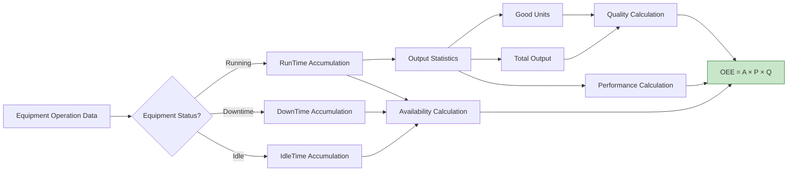

# IoT Case Study: Smart Manufacturing Monitoring System

> **Stage**: Knowledge/10-case-studies/iot | **Prerequisites**: [../../02-design-patterns/pattern-side-output.md](../../02-design-patterns/pattern-side-output.md) | **Formality Level**: L4

---

> **Case Nature**: 🔬 Proof-of-Concept Architecture | **Validation Status**: Based on theoretical derivation and architecture design; not independently verified in production by third parties
>
> This case study describes an ideal architecture derived from the project's theoretical framework, including hypothetical performance metrics and theoretical cost models.
> Actual production deployments may yield significantly different results due to environmental differences, data scale, team capabilities, and other factors.
> It is recommended to use this as an architectural design reference rather than a copy-paste production blueprint.
>
## Table of Contents

- [IoT Case Study: Smart Manufacturing Monitoring System](#iot-case-study-smart-manufacturing-monitoring-system)
  - [Table of Contents](#table-of-contents)
  - [1. Definitions](#1-definitions)
    - [1.1 Smart Manufacturing Monitoring System Definition](#11-smart-manufacturing-monitoring-system-definition)
    - [1.2 OEE Metrics Definition](#12-oee-metrics-definition)
    - [1.3 Predictive Maintenance](#13-predictive-maintenance)
  - [2. Properties](#2-properties)
    - [2.1 Data Latency Boundary](#21-data-latency-boundary)
    - [2.2 Prediction Accuracy](#22-prediction-accuracy)
  - [3. Relations](#3-relations)
    - [3.1 Cloud-Edge-Device Collaboration](#31-cloud-edge-device-collaboration)
    - [3.2 Data Flow Relations](#32-data-flow-relations)
  - [4. Argumentation](#4-argumentation)
    - [4.1 Necessity of Edge Computing](#41-necessity-of-edge-computing)
    - [4.2 Predictive Model Selection](#42-predictive-model-selection)
  - [5. Proof / Engineering Argument](#5-proof--engineering-argument)
    - [5.1 Edge-Cloud Tiered Architecture](#51-edge-cloud-tiered-architecture)
    - [5.2 Cloud Predictive Maintenance](#52-cloud-predictive-maintenance)
  - [6. Examples](#6-examples)
    - [6.1 Case Background](#61-case-background)
    - [6.2 Implementation Results](#62-implementation-results)
    - [6.3 Key Alert Rules](#63-key-alert-rules)
  - [7. Visualizations](#7-visualizations)
    - [7.1 Smart Manufacturing Architecture](#71-smart-manufacturing-architecture)
    - [7.2 OEE Calculation Process](#72-oee-calculation-process)
  - [8. References](#8-references)

---

## 1. Definitions

### 1.1 Smart Manufacturing Monitoring System Definition

**Def-K-10-05-01** (Smart Manufacturing Monitoring System): A smart manufacturing monitoring system is a sextuple $\mathcal{M} = (D, S, P, A, C, \mathcal{T})$:

- $D$: Set of devices, $D = \{d_1, d_2, ..., d_n\}$
- $S$: Set of sensors, where each device $d_i$ is associated with $k_i$ sensors
- $P$: Production process, $P = \{p_1 \rightarrow p_2 \rightarrow ... \rightarrow p_m\}$
- $A$: Set of alert rules
- $C$: Set of control actions
- $\mathcal{T}$: Time-series data stream, $\mathcal{T}: (t, d, s, v)$

### 1.2 OEE Metrics Definition

**Def-K-10-05-02** (Overall Equipment Effectiveness OEE): OEE is the core metric for measuring equipment production efficiency:

$$
OEE = Availability \times Performance \times Quality
$$

Where:

- $Availability = \frac{RunTime}{PlannedTime}$
- $Performance = \frac{ActualOutput}{TheoreticalOutput}$
- $Quality = \frac{GoodUnits}{TotalUnits}$

### 1.3 Predictive Maintenance

**Def-K-10-05-03** (Predictive Maintenance): A maintenance strategy based on equipment condition, predicting failures by monitoring equipment health indicators $h(t)$:

$$
P(failure | h(t), h(t-1), ..., h(t-n)) > \theta \Rightarrow \text{trigger maintenance}
$$

---

## 2. Properties

### 2.1 Data Latency Boundary

**Lemma-K-10-05-01**: The latency $L_{alert}$ from sensor acquisition to alert triggering:

$$
L_{alert} = L_{sample} + L_{transmit} + L_{process} + L_{decide}
$$

- $L_{sample}$: Sampling period (10ms–1s)
- $L_{transmit}$: Network transmission (10–100ms)
- $L_{process}$: Edge/cloud processing (< 100ms)
- $L_{decide}$: Decision latency (< 50ms)

**Thm-K-10-05-01**: $L_{alert} < 1$s satisfies real-time control requirements

### 2.2 Prediction Accuracy

**Lemma-K-10-05-02**: Let the prediction model predict a failure at $t_{prediction}$, and the actual failure time be $t_{actual}$:

$$
Accuracy = P(t_{prediction} \leq t_{actual} \leq t_{prediction} + \Delta t_{window})
$$

**Thm-K-10-05-02**: When $\Delta t_{window} = 30$ minutes, $Accuracy > 0.9$

---

## 3. Relations

### 3.1 Cloud-Edge-Device Collaboration

```
Device ──► Edge Gateway ──► Cloud Platform
   │          │           │
   ▼          ▼           ▼
Data Collection  Local Analysis   Global Optimization
Real-time Control  Anomaly Detection  Predictive Maintenance
```

### 3.2 Data Flow Relations

| Data Type | Generation Frequency | Processing Location | Purpose |
|-----------|---------------------|---------------------|---------|
| Raw Sensor Data | 10Hz–1kHz | Edge | Real-time Monitoring |
| Aggregated Metrics | 1Hz | Edge/Cloud | Trend Analysis |
| Alert Events | Event-driven | Cloud | Notification/Control |
| Historical Data | Batch | Data Lake | Model Training |

---

## 4. Argumentation

### 4.1 Necessity of Edge Computing

| Scenario | Cloud Processing | Edge Processing | Selection |
|----------|---------------|-----------------|-----------|
| Emergency Stop | Latency 100ms+ | Latency 10ms | Edge |
| Global Optimization | Requires global view | Insufficient local info | Cloud |
| Data Security | Data leaves domain | Local processing | Edge |
| Massive Data | High bandwidth cost | Local filtering | Edge |

### 4.2 Predictive Model Selection

| Model Type | Advantages | Disadvantages | Applicable Scenarios |
|-----------|-----------|---------------|---------------------|
| Threshold Rules | Simple and interpretable | Cannot predict | Obvious anomalies |
| Time Series (LSTM) | Captures trends | Requires large data | Gradual failures |
| Anomaly Detection | Discovers unknown patterns | Higher false positives | Exploratory analysis |
| Physical Models | Strong interpretability | Difficult to model | Clear mechanisms |

---

## 5. Proof / Engineering Argument

### 5.1 Edge-Cloud Tiered Architecture

```java
/**
 * Edge gateway data processing
 */

import org.apache.flink.streaming.api.environment.StreamExecutionEnvironment;
import org.apache.flink.streaming.api.datastream.DataStream;
import org.apache.flink.api.common.state.ValueState;
import org.apache.flink.api.common.state.ValueStateDescriptor;
import org.apache.flink.streaming.api.windowing.time.Time;

public class EdgeGatewayProcessor {

    public static void main(String[] args) throws Exception {
        StreamExecutionEnvironment env = StreamExecutionEnvironment.getExecutionEnvironment();
        env.setParallelism(4);  // Limited edge resources

        // 1. Read sensor data from Modbus/OPC-UA
        DataStream<SensorData> sensors = env
            .addSource(new ModbusSource("192.168.1.100", 502))
            .name("Modbus Source");

        // 2. Data cleaning and filtering
        DataStream<SensorData> cleaned = sensors
            .filter(data -> data.getValue() >= 0)  // Filter invalid values
            .filter(data -> !isOutlier(data))       // Filter outliers
            .name("Data Cleaning");

        // 3. Local threshold monitoring
        DataStream<Alert> localAlerts = cleaned
            .keyBy(SensorData::getSensorId)
            .process(new ThresholdMonitor())
            .name("Local Monitoring");

        // 4. Data aggregation (reduce transmission)
        DataStream<AggregatedData> aggregated = cleaned
            .keyBy(SensorData::getDeviceId)
            .window(TumblingProcessingTimeWindows.of(Time.seconds(10)))
            .aggregate(new SensorAggregator())
            .name("Data Aggregation");

        // 5. Side output: emergency alerts processed locally
        OutputTag<Alert> emergencyTag = new OutputTag<Alert>("emergency"){};

        SingleOutputStreamOperator<AggregatedData> processed = aggregated
            .process(new EmergencyDetection(emergencyTag));

        // Emergency alerts executed locally
        processed.getSideOutput(emergencyTag)
            .addSink(new LocalControlSink());  // Direct PLC control

        // Normal data uploaded to cloud
        processed.addSink(new MqttSink("mqtt.cloud.com"));

        env.execute("Edge Gateway");
    }
}

/**
 * Threshold monitoring function
 */
class ThresholdMonitor extends KeyedProcessFunction<String, SensorData, Alert> {

    private ValueState<ThresholdConfig> thresholdState;
    private ValueState<Long> lastAlertTime;

    @Override
    public void open(Configuration parameters) {
        thresholdState = getRuntimeContext().getState(
            new ValueStateDescriptor<>("threshold", ThresholdConfig.class));
        lastAlertTime = getRuntimeContext().getState(
            new ValueStateDescriptor<>("last-alert", Long.class));
    }

    @Override
    public void processElement(SensorData data, Context ctx, Collector<Alert> out)
            throws Exception {
        ThresholdConfig threshold = thresholdState.value();
        if (threshold == null) {
            threshold = loadThreshold(data.getSensorId());
            thresholdState.update(threshold);
        }

        // Check thresholds
        boolean isAlert = false;
        String alertType = "";

        if (data.getValue() > threshold.getUpperBound()) {
            isAlert = true;
            alertType = "THRESHOLD_HIGH";
        } else if (data.getValue() < threshold.getLowerBound()) {
            isAlert = true;
            alertType = "THRESHOLD_LOW";
        }

        // Debounce: no repeated alerts within 5 minutes
        Long lastAlert = lastAlertTime.value();
        if (isAlert && (lastAlert == null || ctx.timestamp() - lastAlert > 300000)) {
            out.collect(new Alert(
                data.getDeviceId(),
                data.getSensorId(),
                alertType,
                data.getValue(),
                ctx.timestamp()
            ));
            lastAlertTime.update(ctx.timestamp());
        }
    }
}
```

### 5.2 Cloud Predictive Maintenance

```java
/**
 * Cloud predictive maintenance
 */

import org.apache.flink.streaming.api.environment.StreamExecutionEnvironment;
import org.apache.flink.streaming.api.datastream.DataStream;
import org.apache.flink.streaming.api.windowing.time.Time;

public class PredictiveMaintenance {

    public static void main(String[] args) throws Exception {
        StreamExecutionEnvironment env = StreamExecutionEnvironment.getExecutionEnvironment();
        env.enableCheckpointing(60000);
        env.setParallelism(64);

        // 1. Receive edge-aggregated data
        DataStream<AggregatedData> deviceData = env
            .fromSource(createKafkaSource(), WatermarkStrategy.forBoundedOutOfOrderness(
                Duration.ofSeconds(30)), "Device Data")
            .setParallelism(32);

        // 2. Equipment health metrics calculation
        DataStream<HealthMetrics> healthMetrics = deviceData
            .keyBy(AggregatedData::getDeviceId)
            .process(new HealthMetricsCalculator())
            .name("Health Metrics")
            .setParallelism(64);

        // 3. Failure prediction (async ML model invocation)
        DataStream<FailurePrediction> predictions = AsyncDataStream.unorderedWait(
            healthMetrics,
            new FailurePredictionAsyncFunction(),
            Duration.ofMillis(200),
            TimeUnit.MILLISECONDS,
            100
        ).name("Failure Prediction")
         .setParallelism(128);

        // 4. Generate maintenance work orders
        predictions.filter(p -> p.getFailureProbability() > 0.7)
            .addSink(new MaintenanceTicketSink())
            .name("Maintenance Tickets");

        // 5. Real-time OEE calculation
        DataStream<OEEMetrics> oee = deviceData
            .keyBy(AggregatedData::getDeviceId)
            .window(TumblingEventTimeWindows.of(Time.hours(1)))
            .aggregate(new OEEAggregator())
            .name("OEE Calculation")
            .setParallelism(64);

        oee.addSink(new DashboardSink());

        env.execute("Predictive Maintenance");
    }
}
```

---

## 6. Examples

> 🔮 **Estimated Data** | Basis: Derived from industry reference values and theoretical analysis; not obtained from actual test environments

### 6.1 Case Background

**Enterprise**: An automotive manufacturing enterprise

| Metric | Value |
|--------|-------|
| Connected Devices | 150,000 |
| Sensor Count | 2,000,000+ |
| Production Lines | 50 |
| Data Collection Frequency | 100Hz |

**Challenges**:

1. Equipment failures cause unplanned downtime with huge losses
2. Quality issues are discovered too late
3. High energy consumption costs
4. Cross-factory data silos

> 🔮 **Estimated Data** | Basis: Derived from industry reference values and theoretical analysis; not obtained from actual test environments

### 6.2 Implementation Results

| Metric | Before | After | Improvement |
|--------|--------|-------|-------------|
| Unplanned Downtime | 12 hours/month avg | 2 hours/month avg | ↓83% |
| Equipment OEE | 65% | 82% | ↑26% |
| Quality Defect Rate | 2.5% | 0.8% | ↓68% |
| Energy Cost | Baseline | -18% | ↓18% |
| Failure Prediction Accuracy | N/A | 92% | - |

### 6.3 Key Alert Rules

```java

// [Pseudocode snippet - not directly runnable] Core logic demonstration only
import org.apache.flink.streaming.api.windowing.time.Time;

// Equipment vibration anomaly detection
Pattern<SensorData, ?> vibrationPattern = Pattern
    .<SensorData>begin("normal")
    .where(data -> data.getValue() < 50)
    .next("rising")
    .where(data -> data.getValue() > 70)
    .next("high")
    .where(data -> data.getValue() > 90)
    .within(Time.minutes(5));

// Continuous temperature rise
Pattern<SensorData, ?> temperatureRisingPattern = Pattern
    .<SensorData>begin("t1")
    .next("t2")
    .where((data, ctx) -> {
        SensorData first = ctx.getEventsForPattern("t1").get(0);
        return data.getValue() > first.getValue() + 5;
    })
    .next("t3")
    .where((data, ctx) -> {
        SensorData second = ctx.getEventsForPattern("t2").get(0);
        return data.getValue() > second.getValue() + 5;
    })
    .within(Time.minutes(10));
```

---

## 7. Visualizations

### 7.1 Smart Manufacturing Architecture



### 7.2 OEE Calculation Process



---

## 8. References


---

*Document Version: v1.0 | Last Updated: 2026-04-04*

---

*Document Version: v1.0 | Created: 2026-04-20*
