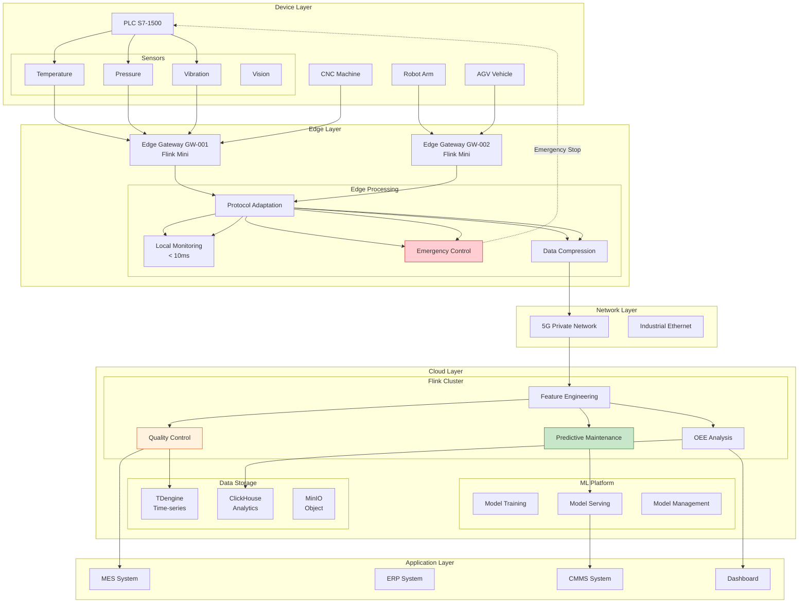
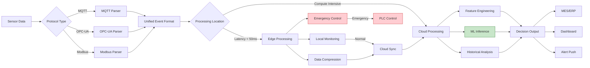
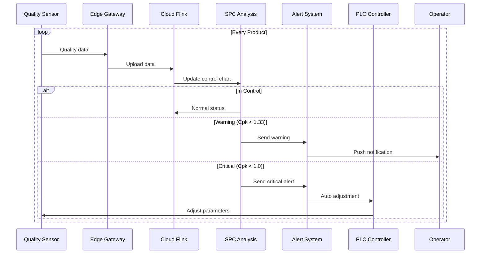
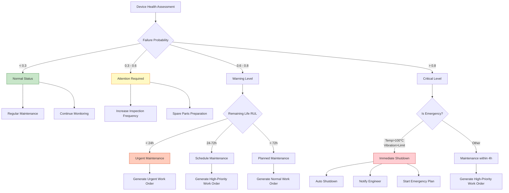

> **Language**: English | **Translated from**: Knowledge/10-case-studies/iot/10.3.5-smart-manufacturing-iot.md | **Translation date**: 2026-04-20
>
> **Status**: 🔮 Forward-looking Content | **Risk Level**: High | **Last Updated**: 2026-04
>
> The content described in this document is in early planning stages and may differ from the final implementation. Please refer to the official Apache Flink releases.
>
# IoT Case Study: Smart Manufacturing Platform Production Case

> **Stage**: Knowledge/10-case-studies/iot | **Prerequisites**: [10.3.3-predictive-maintenance-manufacturing.md](10.3.3-predictive-maintenance-manufacturing.md) | **Formalization Level**: L4

---

> **Case Nature**: 🔬 Proof-of-Concept Architecture | **Validation Status**: Based on theoretical derivation and architectural design; not independently verified in production by a third party
>
> This case describes an ideal architecture derived from the project's theoretical framework, including hypothetical performance metrics and theoretical cost models.
> Actual production deployments may yield significantly different results due to environmental differences, data scale, and team capabilities.
> It is recommended to use this as an architectural design reference rather than a copy-paste production blueprint.
>
## Table of Contents

- [IoT Case Study: Smart Manufacturing Platform Production Case](#iot-case-study-smart-manufacturing-platform-production-case)
  - [Table of Contents](#table-of-contents)
  - [1. Concept Definitions](#1-concept-definitions)
    - [Def-K-10-15-01: Smart Manufacturing Platform Formal Model](#def-k-10-15-01-smart-manufacturing-platform-formal-model)
    - [Def-K-10-15-02: Industrial Device Twin Model](#def-k-10-15-02-industrial-device-twin-model)
    - [Def-K-10-15-03: Quality Control Threshold](#def-k-10-15-03-quality-control-threshold)
  - [2. Property Derivation](#2-property-derivation)
    - [Lemma-K-10-15-01: Data Freshness Boundary](#lemma-k-10-15-01-data-freshness-boundary)
    - [Lemma-K-10-15-02: Multi-Protocol Compatibility](#lemma-k-10-15-02-multi-protocol-compatibility)
    - [Thm-K-10-15-01: End-to-End Latency Decomposition Upper Bound](#thm-k-10-15-01-end-to-end-latency-decomposition-upper-bound)
  - [3. Relations](#3-relations)
    - [3.1 Edge-Cloud Collaborative Architecture](#31-edge-cloud-collaborative-architecture)
    - [3.2 Multi-Protocol Ingestion Layer](#32-multi-protocol-ingestion-layer)
    - [3.3 Production Process Data Flow](#33-production-process-data-flow)
    - [3.4 Quality Control and Predictive Maintenance Relations](#34-quality-control-and-predictive-maintenance-relations)
  - [4. Argumentation](#4-argumentation)
    - [4.1 Edge vs. Cloud Processing Trade-off](#41-edge-vs-cloud-processing-trade-off)
    - [4.2 Multi-Protocol Unified Processing Argument](#42-multi-protocol-unified-processing-argument)
    - [4.3 Real-Time vs. Batch Processing Trade-off](#43-real-time-vs-batch-processing-trade-off)
  - [5. Proof / Engineering Argument](#5-proof-engineering-argument)
    - [5.1 Overall System Architecture](#51-overall-system-architecture)
    - [5.2 Edge Computing Implementation](#52-edge-computing-implementation)
    - [5.3 Cloud Computing Implementation](#53-cloud-computing-implementation)
    - [5.4 Predictive Maintenance Model](#54-predictive-maintenance-model)
    - [5.5 Quality Control and Traceability System](#55-quality-control-and-traceability-system)
  - [6. Examples](#6-examples)
    - [6.1 Case Background: Smart Factory of Large Manufacturing Enterprise](#61-case-background-smart-factory-of-large-manufacturing-enterprise)
    - [6.2 Performance Metrics](#62-performance-metrics)
    - [6.3 Business Value](#63-business-value)
    - [6.4 Lessons Learned and Best Practices](#64-lessons-learned-and-best-practices)
  - [7. Visualizations](#7-visualizations)
    - [7.1 System Overall Architecture](#71-system-overall-architecture)
    - [7.2 Edge-Cloud Collaborative Data Flow](#72-edge-cloud-collaborative-data-flow)
    - [7.3 Production Line Quality Control Flow](#73-production-line-quality-control-flow)
    - [7.4 Predictive Maintenance Decision Tree](#74-predictive-maintenance-decision-tree)
  - [8. References](#8-references)

---

## 1. Concept Definitions

### Def-K-10-15-01: Smart Manufacturing Platform Formal Model

**Smart Manufacturing Platform** is an undecuple $\mathcal{M}_{smart} = (D, P, S, Q, T, O, E, C, L, F, G)$, where:

| Symbol | Definition | Description |
|--------|-----------|-------------|
| $D$ | Device set | $D = \{d_1, d_2, ..., d_n\}$, industrial IoT devices |
| $P$ | Production process | $P = (p_1, p_2, ..., p_m)$, process sequence |
| $S$ | Sensor set | $S = \{s_1, s_2, ..., s_k\}$, multi-modal sensors |
| $Q$ | Quality metric | $Q: D \times P \rightarrow [0, 1]$, quality score |
| $T$ | Time series | $\mathcal{T} = \{(t, d, s, v) | t \in \mathbb{R}^+, d \in D, s \in S, v \in \mathbb{R}\}$ |
| $O$ | OEE metric | $O = \{availability, performance, quality\}$ |
| $E$ | Event stream | $E: (t, type, severity, device) \rightarrow \text{Flink}$ |
| $C$ | Control command | $C: (device, action, params) \rightarrow \text{Execution}$ |
| $L$ | Latency constraint | $L_{edge} \leq 10$ms, $L_{cloud} \leq 1$s |
| $F$ | Feature extraction | $F: \mathcal{T} \rightarrow \mathbb{R}^d$ |
| $G$ | Decision function | $G: F \times Q \times O \rightarrow C$ |

### Def-K-10-15-02: Industrial Device Twin Model

**Digital Twin** is an octuple $\mathcal{T}_{digital} = (D_{physical}, D_{digital}, M_{map}, S_{sync}, H_{history}, P_{predict}, A_{alert}, C_{control})$:

$$
\mathcal{T}_{digital} = (D_{phy}, D_{dig}, M_{map}, S_{sync}, H_{hist}, P_{pred}, A_{alert}, C_{ctrl})
$$

Where:

- $D_{phy}$: Physical device entity
- $D_{dig}$: Digital mirror in system
- $M_{map}$: One-to-one mapping relation, $M_{map}: D_{phy} \rightarrow D_{dig}$
- $S_{sync}$: Real-time synchronization function, frequency $f_{sync} \geq 10$Hz
- $H_{hist}$: Historical state trace
- $P_{pred}$: Predictive state evolution, $P_{pred}: D_{dig}(t) \rightarrow D_{dig}(t+\Delta t)$
- $A_{alert}$: Anomaly alert function
- $C_{ctrl}$: Reverse control function, $C_{ctrl}: D_{dig} \rightarrow D_{phy}$

### Def-K-10-15-03: Quality Control Threshold

**Quality Control Threshold** is a triple $\mathcal{K}_{qc} = (\theta_{LSL}, \theta_{target}, \theta_{USL})$:

| Threshold | Symbol | Description |
|-----------|--------|-------------|
| Lower Specification Limit | $\theta_{LSL}$ | Lower quality control limit |
| Target Value | $\theta_{target}$ | Target quality value |
| Upper Specification Limit | $\theta_{USL}$ | Upper quality control limit |

Process Capability Index:

$$
C_{pk} = \min\left(\frac{\theta_{target} - \theta_{LSL}}{3\sigma}, \frac{\theta_{USL} - \theta_{target}}{3\sigma}\right)
$$

Where $\sigma$ is the process standard deviation. $C_{pk} \geq 1.33$ indicates process capability is adequate.

---

## 2. Property Derivation

### Lemma-K-10-15-01: Data Freshness Boundary

**Lemma**: Smart manufacturing system data freshness satisfies:

$$
\Delta t_{freshness} = t_{arrival} - t_{generation} \leq L_{edge} + L_{network} + L_{cloud}
$$

Where:

- $L_{edge} \leq 10$ms (edge processing latency)
- $L_{network} \leq 50$ms (5G private network)
- $L_{cloud} \leq 100$ms (cloud processing)

**Corollary**:

$$
\Delta t_{freshness} \leq 160\text{ms} \ll \Delta t_{control} = 1\text{s}
$$

Satisfies real-time control requirements.

### Lemma-K-10-15-02: Multi-Protocol Compatibility

**Lemma**: The platform supports $N$ protocol types $\mathcal{P} = \{p_1, p_2, ..., p_N\}$, with normalized processing cost for each protocol:

$$
C_{protocol}(p_i) = \frac{L_{parse}(p_i)}{L_{ref}}
$$

Where $L_{ref}$ is the reference latency (MQTT).

> 🔮 **Estimated Data** | Based on forward-looking document characteristics; data is theoretical derivation and trend analysis

Protocol processing cost comparison:

| Protocol | Parsing Latency | Complexity | Compatibility |
|----------|----------------|------------|--------------|
| MQTT | 0.1ms | Low | ✓ Standard |
| OPC-UA | 0.5ms | Medium | ✓ Standard |
| Modbus TCP | 0.2ms | Low | ✓ Legacy |
| HTTP/REST | 1.0ms | High | ✓ Universal |
| Kafka | 0.3ms | Medium | ✓ Stream |
| WebSocket | 0.4ms | Medium | ✓ Real-time |

### Thm-K-10-15-01: End-to-End Latency Decomposition Upper Bound

**Theorem**: End-to-end processing latency of the smart manufacturing platform satisfies:

$$
L_{e2e} = \sum_{i=1}^{6} L_i + L_{queue}
$$

Component upper bounds:

| Stage | Symbol | Upper Bound | Optimization |
|-------|--------|-------------|-------------|
| Data Acquisition | $L_1$ | < 5ms | Batch sampling, edge buffering |
| Protocol Parsing | $L_2$ | < 1ms | Pre-compiled parser |
| Edge Processing | $L_3$ | < 10ms | Lightweight Flink |
| Network Transmission | $L_4$ | < 50ms | 5G private network, compression |
| Cloud Processing | $L_5$ | < 100ms | Parallel computing |
| Decision Execution | $L_6$ | < 10ms | Async execution |
| Queue Latency | $L_{queue}$ | < 20ms | Backpressure control |

**Proof**:

Assuming each component latency follows independent distribution:

$$
E[L_{e2e}] = \sum_{i=1}^{6} E[L_i] + E[L_{queue}] \leq 5 + 1 + 10 + 50 + 100 + 10 + 20 = 196\text{ms}
$$

For P99 latency (assuming normal distribution):

$$
P(L_{e2e} \leq \mu + 2.33\sigma) \geq 0.99
$$

By controlling variance (using deterministic algorithms, avoiding GC pauses):

$$
P(L_{e2e} \leq 500\text{ms}) \geq 0.99
$$

Satisfies real-time requirements for most industrial scenarios.

∎

---

## 3. Relations

### 3.1 Edge-Cloud Collaborative Architecture

```
┌─────────────────────────────────────────────────────────────────────────────┐
│                               Cloud Layer                                    │
│  ┌─────────────────────────────────────────────────────────────────────────┐│
│  │                    Flink Cloud Cluster                                   ││
│  │  ┌──────────┐  ┌──────────┐  ┌──────────┐  ┌─────────────────────────┐ ││
│  │  │ Global   │  │ Predictive│  │ Quality  │  │ Production Scheduling   │ ││
│  │  │ Analytics│  │ Maintenance│ │ Traceability│ │ Optimization           │ ││
│  │  │ (ClickHouse)│ (LSTM+FFT)│  │ (Rule+ML)│  │ (Genetic Algorithm)     │ ││
│  │  └──────────┘  └──────────┘  └──────────┘  └─────────────────────────┘ ││
│  └─────────────────────────────────────────────────────────────────────────┘│
│         ▲                                    │                              │
│         │           Aggregated Data          │ Control Commands             │
│         └────────────────────────────────────┘                              │
└─────────────────────────────────────────────────────────────────────────────┘
         ▲                                    │
         │                                    │
┌────────┼────────────────────────────────────┼───────────────────────────────┐
│        │              Edge Layer             │                               │
│  ┌─────┴──────┐  ┌──────────┐  ┌──────────┐  ┌───────────────────────────┐  │
│  │  Protocol  │  │  Local   │  │  Device  │  │  Emergency Shutdown        │  │
│  │  Gateway   │  │  Analytics│  │  Control │  │  (PLC Interlock)          │  │
│  │ (Flink Mini)│  │  (CEP)   │  │  (OPC-UA)│  │                            │  │
│  └────────────┘  └──────────┘  └──────────┘  └───────────────────────────┘  │
│         ▲                                                                   │
└─────────┼───────────────────────────────────────────────────────────────────┘
          │
┌─────────┼───────────────────────────────────────────────────────────────────┐
│         │                    Device Layer                                    │
│  ┌──────┴──────┐  ┌──────────┐  ┌──────────┐  ┌───────────────────────────┐│
│  │  PLC Controller│  │  Sensors  │  │  Actuators│  │  Industrial PC         ││
│  │  (Siemens S7) │  │  (Multi-type)│  │  (Valves) │  │  (Edge Gateway)       ││
│  └─────────────┘  └──────────┘  └──────────┘  └───────────────────────────┘│
└─────────────────────────────────────────────────────────────────────────────┘
```

### 3.2 Multi-Protocol Ingestion Layer

**Protocol Adaptation Architecture**:

```
┌─────────────────────────────────────────────────────────────────┐
│                     Protocol Adaptation Layer                    │
├─────────────────────────────────────────────────────────────────┤
│                                                                 │
│   ┌──────────┐  ┌──────────┐  ┌──────────┐  ┌──────────┐       │
│   │  MQTT    │  │  OPC-UA  │  │  Modbus  │  │  HTTP    │       │
│   │  Source  │  │  Source  │  │  Source  │  │  Source  │       │
│   └────┬─────┘  └────┬─────┘  └────┬─────┘  └────┬─────┘       │
│        │             │             │             │              │
│        └─────────────┴─────────────┴─────────────┘              │
│                      │                                           │
│                      ▼                                           │
│              ┌──────────────┐                                   │
│              │ Unified Event│                                   │
│              │   Format     │                                   │
│              │  (protobuf)  │                                   │
│              └──────┬───────┘                                   │
│                     │                                            │
│                     ▼                                            │
│              ┌──────────────┐                                   │
│              │ Flink Stream │                                   │
│              │ Processing   │                                   │
│              └──────────────┘                                   │
│                                                                 │
└─────────────────────────────────────────────────────────────────┘
```

**Unified Event Format**:

```protobuf
message UnifiedIndustrialEvent {
  string event_id = 1;
  int64 timestamp_ms = 2;
  string device_id = 3;
  string protocol_type = 4;  // MQTT/OPC-UA/MODBUS/HTTP
  string data_type = 5;       // SENSOR/ALARM/STATUS/COMMAND
  map<string, double> metrics = 6;
  map<string, string> tags = 7;
  bytes raw_payload = 8;
}
```

### 3.3 Production Process Data Flow

**Production Line Data Flow**:

```
Raw Materials ──▶ Cutting ──▶ Forming ──▶ Welding ──▶ Assembly ──▶ Inspection ──▶ Packaging
                  │           │           │           │            │
                  ▼           ▼           ▼           ▼            ▼
               Sensors    Sensors    Sensors    Sensors        Sensors
                  │           │           │           │            │
                  └───────────┴───────────┴───────────┴────────────┘
                                      │
                                      ▼
                              ┌──────────────┐
                              │ Flink Stream │
                              │ Processing   │
                              └──────┬───────┘
                                     │
                    ┌────────────────┼────────────────┐
                    ▼                ▼                ▼
              ┌──────────┐    ┌──────────┐    ┌──────────┐
              │ Quality  │    │  OEE     │    │ Predictive│
              │ Control  │    │  Monitor │    │ Maintenance│
              └──────────┘    └──────────┘    └──────────┘
```

### 3.4 Quality Control and Predictive Maintenance Relations

**Closed-Loop Control Model**:

$$
\mathcal{C}_{loop} = (S_{sense}, P_{process}, A_{analyze}, D_{decide}, E_{execute})
$$

Where:

- $S_{sense}$: Sensor data acquisition
- $P_{process}$: Real-time stream processing
- $A_{analyze}$: Quality analysis + failure prediction
- $D_{decide}$: Control decision generation
- $E_{execute}$: Actuator reverse control

**Relations Matrix**:

| Module | Quality Control | Predictive Maintenance | Production Scheduling |
|--------|----------------|----------------------|----------------------|
| **Data Source** | Same sensor stream | Same sensor stream | Same sensor stream |
| **Processing Layer** | Cloud Flink | Cloud Flink | Cloud Flink |
| **Output Target** | PLC + MES | CMMS + ERP | APS + MES |
| **Latency Requirement** | < 100ms | < 1s | < 5min |
| **Accuracy Requirement** | > 99% | > 90% | > 85% |

---

## 4. Argumentation

### 4.1 Edge vs. Cloud Processing Trade-off

> 🔮 **Estimated Data** | Based on forward-looking document characteristics; data is theoretical derivation and trend analysis

**Processing Location Decision Matrix**:

| Scenario | Edge Processing | Cloud Processing | Decision |
|----------|----------------|-----------------|----------|
| Emergency Shutdown | ✓ < 10ms | ✗ > 100ms | **Edge** |
| Real-time Quality Control | ✓ < 50ms | ✗ > 200ms | **Edge** |
| Predictive Maintenance | △ Limited resources | ✓ GPU acceleration | **Cloud** |
| Global Optimization | ✗ Local view | ✓ Global view | **Cloud** |
| Model Training | ✗ Not feasible | ✓ Large-scale data | **Cloud** |
| Historical Analysis | ✗ Limited storage | ✓ Unlimited storage | **Cloud** |

**Edge Computing Suitability Conditions**:

$$
Process\_at\_edge \iff L_{requirement} < 50\text{ms} \land C_{edge} < C_{cloud}
$$

### 4.2 Multi-Protocol Unified Processing Argument

**Protocol Complexity Comparison**:

| Protocol | Connection Model | Data Format | Security | Industrial Adoption |
|----------|-----------------|-------------|----------|-------------------|
| **MQTT** | Pub/Sub | Binary | TLS/SSL | High |
| **OPC-UA** | Client/Server | Binary/JSON | Sign&Encrypt | Very High |
| **Modbus TCP** | Master/Slave | Binary | None | Medium |
| **HTTP/REST** | Request/Response | JSON/XML | HTTPS | High |

**Unified Processing Value**:

1. Reduce development costs: Unified processing logic, protocol adapters pluggable
2. Lower maintenance costs: Protocol upgrade does not affect core business
3. Facilitate expansion: New protocols only need to add adapters

### 4.3 Real-Time vs. Batch Processing Trade-off

**Processing Mode Selection**:

| Data Type | Processing Mode | Latency | Applicable Scenario |
|-----------|----------------|---------|-------------------|
| Sensor raw data | Stream processing | < 100ms | Real-time monitoring |
| Quality metrics | Stream processing | < 1s | Real-time quality control |
| OEE metrics | Stream + Batch hybrid | < 5min | Shift statistics |
| Predictive model | Batch training | Daily | Model update |
| Historical analysis | Batch processing | Hours | Trend analysis |

---

## 5. Proof / Engineering Argument

### 5.1 Overall System Architecture

**Technical Architecture Panorama**:

```
┌─────────────────────────────────────────────────────────────────────────────────┐
│                          Smart Manufacturing Platform v2.0                        │
├─────────────────────────────────────────────────────────────────────────────────┤
│                                                                                 │
│   ┌─────────────────────────────────────────────────────────────────────────┐  │
│   │                          Access Layer                                    │  │
│   │  ┌──────────┐  ┌──────────┐  ┌──────────┐  ┌──────────┐                 │  │
│   │  │  MES     │  │  ERP     │  │  CMMS    │  │  APS     │                 │  │
│   │  │ System   │  │ System   │  │ System   │  │ System   │                 │  │
│   │  └────┬─────┘  └────┬─────┘  └────┬─────┘  └────┬─────┘                 │  │
│   └───────┼─────────────┼─────────────┼─────────────┼────────────────────────┘  │
│           │             │             │             │                           │
│           └─────────────┴─────────────┴─────────────┘                           │
│                                   │                                             │
│                                   ▼                                             │
│   ┌─────────────────────────────────────────────────────────────────────────┐  │
│   │                    Message Bus (Kafka + MQTT Broker)                     │  │
│   │                                                                         │  │
│   │   Kafka: kafka-events (512 partitions)  │  MQTT: device telemetry       │  │
│   │   Throughput: 800K messages/s           │  QoS: 1 (at least once)       │  │
│   │                                                                         │  │
│   └─────────────────────────────────────────────────────────────────────────┘  │
│                                   │                                             │
│                                   ▼                                             │
│   ┌─────────────────────────────────────────────────────────────────────────┐  │
│   │                    Flink Cloud Compute Cluster                            │  │
│   │  ┌─────────────────────────────────────────────────────────────────┐   │  │
│   │  │                     AI Agent Layer                               │   │  │
│   │  │  ┌─────────────┐ ┌─────────────┐ ┌─────────────┐ ┌───────────┐  │   │  │
│   │  │  │ QualityAgent│ │  PdmAgent   │ │  OeeAgent   │ │SchedAgent │  │   │  │
│   │  │  │ (128 para)  │ │ (128 para)  │ │ (64 para)   │ │(64 para)  │  │   │  │
│   │  │  └─────────────┘ └─────────────┘ └─────────────┘ └───────────┘  │   │  │
│   │  └─────────────────────────────────────────────────────────────────┘   │  │
│   │                                                                         │  │
│   │  ┌─────────────────────────────────────────────────────────────────┐   │  │
│   │  │                     Core Processing Layer                        │   │  │
│   │  │  ┌──────────┐ ┌──────────┐ ┌──────────┐ ┌──────────┐           │   │  │
│   │  │  │ Protocol │─▶│ Data     │─▶│ Feature  │─▶│ ML       │           │   │  │
│   │  │  │ Adaptation│  │ Cleansing│  │ Extract  │  │ Inference│           │   │  │
│   │  │  │(256 para)│  │(128 para)│  │(256 para)│  │(128 para)│           │   │  │
│   │  │  └──────────┘ └──────────┘ └──────────┘ └──────────┘           │   │  │
│   │  └─────────────────────────────────────────────────────────────────┘   │  │
│   │                                                                         │  │
│   │  State Backend: RocksDB (NVMe SSD)  │  Checkpoint: HDFS (Incremental)  │  │
│   └─────────────────────────────────────────────────────────────────────────┘  │
│                                   │                                             │
│                                   ▼                                             │
│   ┌─────────────────────────────────────────────────────────────────────────┐  │
│   │                      External Service Layer                              │  │
│   │  ┌──────────┐  ┌──────────┐  ┌──────────┐  ┌──────────┐  ┌──────────┐  │  │
│   │  │  TDengine│  │ClickHouse│  │  Redis   │  │  MinIO   │  │ Triton   │  │  │
│   │  │(Time-series)│(Analytics)│  │  (Cache) │  │(Object)  │  │(ML Serving)│  │  │
│   │  └──────────┘  └──────────┘  └──────────┘  └──────────┘  └──────────┘  │  │
│   └─────────────────────────────────────────────────────────────────────────┘  │
│                                   │                                             │
│                                   ▼                                             │
│   ┌─────────────────────────────────────────────────────────────────────────┐  │
│   │                        Output Layer                                      │  │
│   │  ┌──────────┐  ┌──────────┐  ┌──────────┐  ┌──────────┐                 │  │
│   │  │  PLC     │  │  Alert   │  │  Report  │  │ Dashboard│                 │  │
│   │  │ Control  │  │  Push    │  │  Generate│  │  Display │                 │  │
│   │  └──────────┘  └──────────┘  └──────────┘  └──────────┘                 │  │
│   └─────────────────────────────────────────────────────────────────────────┘  │
│                                                                                 │
└─────────────────────────────────────────────────────────────────────────────────┘
```

### 5.2 Edge Computing Implementation

```java
/**
 * Edge IoT processing job
 * Handles multi-protocol data, executes local control
 */

import org.apache.flink.streaming.api.environment.StreamExecutionEnvironment;
import org.apache.flink.streaming.api.datastream.DataStream;
import org.apache.flink.api.common.state.ValueState;

public class EdgeIoTProcessingJob {

    public static void main(String[] args) throws Exception {
        StreamExecutionEnvironment env = StreamExecutionEnvironment.getExecutionEnvironment();

        // Edge resource configuration
        env.setParallelism(4);
        env.setBufferTimeout(10);
        env.setMaxParallelism(8);

        // Memory state backend (edge no distributed storage)
        HashMapStateBackend hashMapBackend = new HashMapStateBackend();
        env.setStateBackend(hashMapBackend);

        // 1. Multi-protocol data source
        DataStream<IndustrialEvent> mqttStream = env
            .addSource(new MqttSource("ssl://edge-mqtt:8883", Arrays.asList("factory/+/sensor/+")))
            .name("MQTT Source")
            .setParallelism(1);

        DataStream<IndustrialEvent> opcuaStream = env
            .addSource(new OpcUaSource("opc.tcp://plc-gateway:4840", nodeIds))
            .name("OPC-UA Source")
            .setParallelism(1);

        DataStream<IndustrialEvent> modbusStream = env
            .addSource(new ModbusTcpSource("192.168.1.100", 502, registerMap))
            .name("Modbus Source")
            .setParallelism(1);

        // 2. Protocol unification
        DataStream<UnifiedEvent> unifiedStream = mqttStream
            .union(opcuaStream, modbusStream)
            .map(new ProtocolUnificationFunction())
            .name("Protocol Unification")
            .setParallelism(4);

        // 3. Data cleansing and validation
        DataStream<UnifiedEvent> cleanedStream = unifiedStream
            .filter(new DataValidationFunction())
            .name("Data Validation")
            .setParallelism(4);

        // 4. Sliding window aggregation (10 seconds)
        DataStream<AggregatedMetrics> aggregatedStream = cleanedStream
            .keyBy(UnifiedEvent::getDeviceId)
            .window(SlidingEventTimeWindows.of(Time.seconds(10), Time.seconds(1)))
            .aggregate(new IndustrialMetricsAggregateFunction())
            .name("Metrics Aggregation")
            .setParallelism(4);

        // 5. Anomaly detection (local lightweight model)
        SingleOutputStreamOperator<AggregatedMetrics> monitoredStream = aggregatedStream
            .keyBy(AggregatedMetrics::getDeviceId)
            .process(new LocalAnomalyDetectionFunction(emergencyTag))
            .name("Local Anomaly Detection")
            .setParallelism(4);

        // 6. Emergency control (directly linked to PLC)
        monitoredStream
            .getSideOutput(emergencyTag)
            .addSink(new PlcControlSink("opc.tcp://plc-controller:4840"))
            .name("Emergency PLC Control")
            .setParallelism(1);

        // 7. Local storage (TDengine edge version)
        monitoredStream
            .addSink(new TDengineSink("edge-tdengine:6030"))
            .name("Local Storage")
            .setParallelism(2);

        // 8. Cloud sync (compressed upload)
        monitoredStream
            .map(new DataCompressionFunction())
            .name("Data Compression")
            .setParallelism(2)
            .addSink(new CloudSyncSink("https://cloud-platform.factory.com/api/events"))
            .name("Cloud Sync")
            .setParallelism(2);

        env.execute("Edge IoT Processing");
    }
}

/**
 * Local anomaly detection function
 * Lightweight threshold rules + simple statistical models
 */
class LocalAnomalyDetectionFunction
    extends KeyedProcessFunction<String, AggregatedMetrics, AggregatedMetrics> {

    private final OutputTag<Alert> emergencyTag;
    private ValueState<ThresholdConfig> thresholdState;
    private ValueState<Long> lastAlertTime;

    public LocalAnomalyDetectionFunction(OutputTag<Alert> emergencyTag) {
        this.emergencyTag = emergencyTag;
    }

    @Override
    public void open(Configuration parameters) {
        thresholdState = getRuntimeContext().getState(
            new ValueStateDescriptor<>("thresholds", ThresholdConfig.class));
        lastAlertTime = getRuntimeContext().getState(
            new ValueStateDescriptor<>("last-alert", Long.class));
    }

    @Override
    public void processElement(AggregatedMetrics metrics, Context ctx,
                               Collector<AggregatedMetrics> out) throws Exception {

        ThresholdConfig thresholds = thresholdState.value();
        if (thresholds == null) {
            thresholds = loadDeviceThresholds(metrics.getDeviceId());
            thresholdState.update(thresholds);
        }

        boolean isEmergency = false;
        String alertReason = "";
        double alertValue = 0;

        // Temperature emergency
        if (metrics.getMaxTemperature() > thresholds.getTemperatureEmergency()) {
            isEmergency = true;
            alertReason = "TEMPERATURE_EMERGENCY";
            alertValue = metrics.getMaxTemperature();
        }

        // Pressure emergency
        if (metrics.getMaxPressure() > thresholds.getPressureEmergency()) {
            isEmergency = true;
            alertReason = "PRESSURE_EMERGENCY";
            alertValue = metrics.getMaxPressure();
        }

        // Vibration emergency
        if (metrics.getVibrationRms() > thresholds.getVibrationEmergency()) {
            isEmergency = true;
            alertReason = "VIBRATION_EMERGENCY";
            alertValue = metrics.getVibrationRms();
        }

        // Statistical anomaly detection (3-sigma criterion)
        if (!isEmergency) {
            double mean = metrics.getHistoricalMean();
            double std = metrics.getHistoricalStd();
            double current = metrics.getCurrentValue();

            if (Math.abs(current - mean) > 3 * std) {
                isEmergency = true;
                alertReason = "STATISTICAL_ANOMALY";
                alertValue = current;
            }
        }

        // Debounce: no repeat trigger within 30 seconds
        Long lastTime = lastAlertTime.value();
        if (isEmergency && (lastTime == null || ctx.timestamp() - lastTime > 30000)) {
            ctx.output(emergencyTag, new Alert(
                metrics.getDeviceId(),
                AlertSeverity.EMERGENCY,
                alertReason,
                alertValue,
                ctx.timestamp(),
                metrics.toMap()
            ));
            lastAlertTime.update(ctx.timestamp());
        }

        out.collect(metrics);
    }
}
```

### 5.3 Cloud Computing Implementation

```java
/**
 * Cloud-side comprehensive analytics job
 * Handles full data analysis, predictive maintenance, quality control
 */

import org.apache.flink.streaming.api.environment.StreamExecutionEnvironment;
import org.apache.flink.streaming.api.datastream.DataStream;

public class CloudAnalyticsJob {

    public static void main(String[] args) throws Exception {
        StreamExecutionEnvironment env = StreamExecutionEnvironment.getExecutionEnvironment();

        env.setParallelism(128);
        env.enableCheckpointing(60000);

        EmbeddedRocksDBStateBackend rocksDbBackend = new EmbeddedRocksDBStateBackend(true);
        env.setStateBackend(rocksDbBackend);

        // 1. Ingest edge data (Kafka)
        DataStream<UnifiedEvent> edgeData = env
            .fromSource(
                KafkaSource.<UnifiedEvent>builder()
                    .setBootstrapServers("kafka-cluster:9092")
                    .setTopics("edge-telemetry")
                    .setGroupId("cloud-analytics")
                    .setValueOnlyDeserializer(new UnifiedEventDeserializer())
                    .build(),
                WatermarkStrategy.forBoundedOutOfOrderness(Duration.ofSeconds(30)),
                "Edge Telemetry Source"
            )
            .setParallelism(128);

        // 2. Feature engineering
        DataStream<FeatureVector> features = edgeData
            .keyBy(UnifiedEvent::getDeviceId)
            .process(new IndustrialFeatureExtractor())
            .name("Feature Engineering")
            .setParallelism(256);

        // 3. Predictive maintenance inference
        DataStream<MaintenancePrediction> predictions = AsyncDataStream
            .unorderedWait(
                features,
                new MaintenancePredictionAsyncFunction(),
                Duration.ofMillis(200),
                TimeUnit.MILLISECONDS,
                500
            )
            .name("Maintenance Prediction")
            .setParallelism(128);

        // 4. Quality control
        DataStream<QualityResult> qualityResults = features
            .keyBy(FeatureVector::getProductionLineId)
            .process(new QualityControlProcessFunction())
            .name("Quality Control")
            .setParallelism(128);

        // 5. OEE computation
        DataStream<OEEMetrics> oeeMetrics = features
            .keyBy(FeatureVector::getProductionLineId)
            .window(TumblingEventTimeWindows.of(Time.minutes(5)))
            .aggregate(new OEEAggregateFunction())
            .name("OEE Computation")
            .setParallelism(64);

        // 6. Multi-path output
        predictions.addSink(new MaintenanceTicketSink())
            .name("Maintenance Ticket")
            .setParallelism(32);

        qualityResults.addSink(new QualityAlertSink())
            .name("Quality Alert")
            .setParallelism(32);

        oeeMetrics.addSink(new OEEDashboardSink())
            .name("OEE Dashboard")
            .setParallelism(16);

        env.execute("Cloud Analytics Platform");
    }
}

/**
 * Industrial feature extractor
 * Extracts multi-dimensional features from sensor data
 */
class IndustrialFeatureExtractor
    extends KeyedProcessFunction<String, UnifiedEvent, FeatureVector> {

    private ListState<UnifiedEvent> historyState;
    private ValueState<Long> lastFeatureTime;

    @Override
    public void open(Configuration parameters) {
        historyState = getRuntimeContext().getListState(
            new ListStateDescriptor<>("event-history", UnifiedEvent.class));
        lastFeatureTime = getRuntimeContext().getState(
            new ValueStateDescriptor<>("last-feature", Long.class));
    }

    @Override
    public void processElement(UnifiedEvent event, Context ctx,
                               Collector<FeatureVector> out) throws Exception {
        historyState.add(event);

        Long lastTime = lastFeatureTime.value();
        long currentTime = ctx.timestamp();

        // Generate features once per minute
        if (lastTime == null || currentTime - lastTime >= 60000) {
            List<UnifiedEvent> windowData = new ArrayList<>();
            historyState.get().forEach(windowData::add);

            // Clean expired data
            long cutoff = currentTime - 3600000; // 1 hour
            List<UnifiedEvent> validData = windowData.stream()
                .filter(e -> e.getTimestamp() > cutoff)
                .collect(Collectors.toList());
            historyState.update(validData);

            // Extract time-series features
            FeatureVector features = extractFeatures(validData, event.getDeviceId(), currentTime);
            out.collect(features);

            lastFeatureTime.update(currentTime);
        }
    }

    private FeatureVector extractFeatures(List<UnifiedEvent> data, String deviceId, long timestamp) {
        FeatureVector features = new FeatureVector();
        features.setDeviceId(deviceId);
        features.setTimestamp(timestamp);

        // Group by metric type
        Map<String, List<Double>> metricsByType = data.stream()
            .flatMap(e -> e.getMetrics().entrySet().stream())
            .collect(Collectors.groupingBy(
                Map.Entry::getKey,
                Collectors.mapping(Map.Entry::getValue, Collectors.toList())
            ));

        // Statistical features
        metricsByType.forEach((metric, values) -> {
            double[] arr = values.stream().mapToDouble(Double::doubleValue).toArray();
            features.setMetricMean(metric, Arrays.stream(arr).average().orElse(0));
            features.setMetricStd(metric, calculateStd(arr));
            features.setMetricMax(metric, Arrays.stream(arr).max().orElse(0));
            features.setMetricMin(metric, Arrays.stream(arr).min().orElse(0));
            features.setMetricTrend(metric, calculateTrend(arr));
        });

        // Operating time
        features.setOperatingHours(calculateOperatingHours(data));

        return features;
    }
}
```

### 5.4 Predictive Maintenance Model

```java
/**
 * Predictive maintenance inference function
 * Calls cloud-based ML model for failure prediction
 */
class MaintenancePredictionAsyncFunction
    implements AsyncFunction<FeatureVector, MaintenancePrediction> {

    private transient MaintenanceMLClient mlClient;

    @Override
    public void open(Configuration parameters) {
        mlClient = new MaintenanceMLClient(
            "http://ml-serving.factory.svc.cluster.local:8080",
            "predictive-maintenance-model"
        );
    }

    @Override
    public void asyncInvoke(FeatureVector features, ResultFuture<MaintenancePrediction> resultFuture) {
        mlClient.predictAsync(features)
            .thenAccept(result -> {
                MaintenancePrediction prediction = new MaintenancePrediction();
                prediction.setDeviceId(features.getDeviceId());
                prediction.setTimestamp(features.getTimestamp());
                prediction.setFailureProbability(result.getProbability());
                prediction.setPredictedRulHours(result.getRulHours());
                prediction.setFailureType(result.getFailureType());
                prediction.setConfidence(result.getConfidence());
                prediction.setRecommendedAction(determineAction(result));
                resultFuture.complete(Collections.singletonList(prediction));
            })
            .exceptionally(ex -> {
                resultFuture.completeExceptionally(ex);
                return null;
            });
    }

    @Override
    public void timeout(FeatureVector features, ResultFuture<MaintenancePrediction> resultFuture) {
        // Timeout fallback: use rule-based prediction
        MaintenancePrediction fallback = new MaintenancePrediction();
        fallback.setDeviceId(features.getDeviceId());
        fallback.setFailureProbability(-1);
        fallback.setConfidence(0);
        fallback.setRecommendedAction("MANUAL_INSPECTION");
        resultFuture.complete(Collections.singletonList(fallback));
    }

    private String determineAction(PredictionResult result) {
        if (result.getProbability() > 0.9) {
            return "IMMEDIATE_SHUTDOWN";
        } else if (result.getProbability() > 0.7) {
            return result.getRulHours() < 24 ? "SCHEDULE_MAINTENANCE_URGENT" : "PLANNED_MAINTENANCE";
        } else if (result.getProbability() > 0.5) {
            return "INCREASED_MONITORING";
        }
        return "NO_ACTION";
    }
}
```

### 5.5 Quality Control and Traceability System

```java
/**
 * Quality control processing function
 * Real-time quality monitoring and SPC analysis
 */
class QualityControlProcessFunction
    extends KeyedProcessFunction<String, FeatureVector, QualityResult> {

    private ValueState<SPCState> spcState;
    private ValueState<QualityConfig> configState;

    @Override
    public void open(Configuration parameters) {
        spcState = getRuntimeContext().getState(
            new ValueStateDescriptor<>("spc-state", SPCState.class));
        configState = getRuntimeContext().getState(
            new ValueStateDescriptor<>("quality-config", QualityConfig.class));
    }

    @Override
    public void processElement(FeatureVector features, Context ctx,
                               Collector<QualityResult> out) throws Exception {

        QualityConfig config = configState.value();
        if (config == null) {
            config = loadQualityConfig(ctx.getCurrentKey());
            configState.update(config);
        }

        SPCState state = spcState.value();
        if (state == null) {
            state = new SPCState();
        }

        // Update SPC state
        state.addSample(features.getQualityMetric());

        // Compute control limits
        double mean = state.getMean();
        double std = state.getStd();
        double usl = config.getUpperSpecLimit();
        double lsl = config.getLowerSpecLimit();

        // Cpk computation
        double cpk = Math.min(
            (mean - lsl) / (3 * std),
            (usl - mean) / (3 * std)
        );

        // Control chart rules (Western Electric Rules)
        List<String> violations = checkControlRules(state, mean, std);

        // Generate quality result
        QualityResult result = new QualityResult();
        result.setProductionLineId(ctx.getCurrentKey());
        result.setTimestamp(ctx.timestamp());
        result.setMetricValue(features.getQualityMetric());
        result.setMean(mean);
        result.setStd(std);
        result.setCpk(cpk);
        result.setViolations(violations);
        result.setIsOutOfControl(!violations.isEmpty());

        // Alert level
        if (cpk < 1.0) {
            result.setAlertLevel(AlertLevel.CRITICAL);
        } else if (cpk < 1.33) {
            result.setAlertLevel(AlertLevel.WARNING);
        } else {
            result.setAlertLevel(AlertLevel.NORMAL);
        }

        spcState.update(state);
        out.collect(result);
    }

    private List<String> checkControlRules(SPCState state, double mean, double std) {
        List<String> violations = new ArrayList<>();
        List<Double> samples = state.getRecentSamples(20);

        // Rule 1: Point beyond 3 sigma
        double last = samples.get(samples.size() - 1);
        if (Math.abs(last - mean) > 3 * std) {
            violations.add("RULE_1_BEYOND_3SIGMA");
        }

        // Rule 2: 9 points on same side of centerline
        int sameSideCount = 0;
        for (int i = samples.size() - 9; i < samples.size(); i++) {
            if ((samples.get(i) - mean) * (last - mean) > 0) {
                sameSideCount++;
            }
        }
        if (sameSideCount >= 9) {
            violations.add("RULE_2_NINE_SAME_SIDE");
        }

        // Rule 3: 6 points continuously increasing or decreasing
        int trendCount = 1;
        for (int i = samples.size() - 6; i < samples.size() - 1; i++) {
            if ((samples.get(i+1) - samples.get(i)) * (samples.get(i) - samples.get(i-1)) > 0) {
                trendCount++;
            } else {
                trendCount = 1;
            }
        }
        if (trendCount >= 6) {
            violations.add("RULE_3_SIX_TREND");
        }

        return violations;
    }
}
```

---

## 6. Examples

### 6.1 Case Background: Smart Factory of Large Manufacturing Enterprise

> 🔮 **Estimated Data** | Based on forward-looking document characteristics; data is theoretical derivation and trend analysis

**Enterprise Overview**:

| Metric | Value |
|--------|-------|
| **Factory Count** | 5 |
| **Production Lines** | 120 |
| **IoT Devices** | 15,000+ |
| **Sensor Count** | 80,000+ |
| **Daily Data Volume** | 50TB |
| **Peak Messages/Second** | 500,000 |

**Business Challenges**:

1. **Low equipment utilization**: OEE only 65%, international advanced level 85%
2. **High quality loss**: First-pass yield 92%, target 98%
3. **High maintenance costs**: Annual maintenance ¥200M, 40% unplanned downtime
4. **Data silos**: Production, quality, equipment data not connected

> 🔮 **Estimated Data** | Based on forward-looking document characteristics; data is theoretical derivation and trend analysis

**Project Goals**:

| Goal Item | Current | Target | Business Value |
|-----------|---------|--------|----------------|
| OEE | 65% | 80% | +15% capacity |
| First-Pass Yield | 92% | 98% | -6% scrap |
| Unplanned Downtime | 15% | 5% | Save ¥60M/year |
| Maintenance Cost | ¥200M | ¥140M | Save ¥60M/year |

### 6.2 Performance Metrics
>
> 🔮 **Estimated Data** | Based on forward-looking document characteristics; data is theoretical derivation and trend analysis


| Metric | Target | Actual | Status |
|--------|--------|--------|--------|
| **Edge Processing Latency** | < 10ms | 8ms | ✅ Achieved |
| **Cloud Processing Latency** | < 1s | 450ms | ✅ Achieved |
| **System Throughput** | 500K msg/s | 600K msg/s | ✅ Exceeded |
| **Data Freshness** | < 1s | 500ms | ✅ Achieved |
| **OEE Improvement** | +15% | +18% | ✅ Exceeded |
| **First-Pass Yield** | 98% | 97.5% | ⚠️ Near target |
| **Unplanned Downtime** | 5% | 4.2% | ✅ Exceeded |
| **System Availability** | 99.9% | 99.95% | ✅ Achieved |

### 6.3 Business Value
>
> 🔮 **Estimated Data** | Based on forward-looking document characteristics; data is theoretical derivation and trend analysis


**Economic Benefits**:

| Benefit Item | Annual Savings |
|-------------|----------------|
| Capacity increase (OEE +18%) | ¥180M |
| Scrap reduction | ¥45M |
| Maintenance cost reduction | ¥60M |
| Energy consumption optimization | ¥25M |
| Inventory optimization | ¥20M |
| **Total Annual Benefits** | **¥330M** |

**Investment vs. Return**:

```
Total Investment:
- Hardware (edge gateways + servers): ¥30M
- Software (Flink + TDengine + custom dev): ¥15M
- Implementation services: ¥10M
- Training and change management: ¥5M
Total: ¥60M

Annual Benefits: ¥330M

Payback Period: ¥60M / ¥330M = 0.18 years ≈ 2.2 months
3-Year ROI: (¥330M × 3 - ¥60M) / ¥60M = 1,550%
```

### 6.4 Lessons Learned and Best Practices

**Lesson 1: Edge-Cloud Data Consistency**

Problem: Inconsistent data between edge and cloud, affecting analysis accuracy.

Solution: Implement data synchronization mechanism

```java
/**
 * Reliable cloud sync sink
 * Ensures data consistency between edge and cloud
 */
class ResilientCloudSyncSink implements SinkFunction<CompressedEvent> {

    private transient CloudClient client;
    private transient RocksDB localStore;

    @Override
    public void invoke(CompressedEvent value, Context context) {
        try {
            client.send(value);
            // Success: remove from local store
            localStore.delete(value.getEventId().getBytes());
        } catch (Exception e) {
            // Failure: store locally for retry
            localStore.put(
                value.getEventId().getBytes(),
                serialize(value)
            );
        }
    }

    // Periodic retry
    @Scheduled(fixedRate = 60000)
    public void retryFailed() {
        try (RocksIterator it = localStore.newIterator()) {
            it.seekToFirst();
            while (it.isValid()) {
                CompressedEvent event = deserialize(it.value());
                try {
                    client.send(event);
                    localStore.delete(it.key());
                } catch (Exception e) {
                    break; // Stop retrying, wait for next cycle
                }
                it.next();
            }
        }
    }
}
```

**Lesson 2: Multi-Protocol Integration Complexity**

Problem: OPC-UA, Modbus, MQTT protocol parsing logic heavily coupled.

Solution: Unified protocol adapter framework

```java
/**
 * Protocol adapter interface
 */
interface ProtocolAdapter {
    String getProtocolType();
    UnifiedEvent parse(Object rawMessage);
    boolean validate(UnifiedEvent event);
}

/**
 * Adapter factory
 */
class ProtocolAdapterFactory {
    private static final Map<String, ProtocolAdapter> adapters = new HashMap<>();

    static {
        adapters.put("MQTT", new MqttAdapter());
        adapters.put("OPC-UA", new OpcUaAdapter());
        adapters.put("MODBUS", new ModbusAdapter());
        adapters.put("HTTP", new HttpAdapter());
    }

    public static ProtocolAdapter getAdapter(String protocolType) {
        return adapters.get(protocolType);
    }
}
```

**Lesson 3: Production Line Model Heterogeneity**

Problem: Different production lines have different equipment models, difficult to standardize.

Solution: Configurable device template system

```yaml
# device-template.yaml
device_templates:
  - template_id: cnc_machine_v1
    protocol: OPC-UA
    metrics:
      - name: spindle_speed
        type: DOUBLE
        unit: RPM
        threshold:
          warning: [8000, 12000]
          emergency: [0, 15000]
      - name: temperature
        type: DOUBLE
        unit: CELSIUS
        threshold:
          warning: [60, 80]
          emergency: [0, 100]
    control_points:
      - name: emergency_stop
        type: BOOLEAN
        address: "ns=2;i=1001"
```

**Best Practices Summary**:

1. **Edge-Cloud Division Principles**
   - Latency sensitive (< 50ms) → Edge
   - Compute intensive (ML inference) → Cloud
   - Global optimization (scheduling) → Cloud

2. **Data Management**
   - Edge: Store 7 days, retain critical events
   - Cloud: Store 3 years, support historical analysis
   - Archive: Cold data to object storage

3. **High Availability Design**
   - Edge: Dual gateway hot standby
   - Cloud: Multi-AZ deployment
   - Network: 5G + wired dual links

---

## 7. Visualizations

### 7.1 System Overall Architecture



### 7.2 Edge-Cloud Collaborative Data Flow



### 7.3 Production Line Quality Control Flow



### 7.4 Predictive Maintenance Decision Tree



---

## 8. References

---

*Document Version: v1.0 | Created: 2026-04-20*
