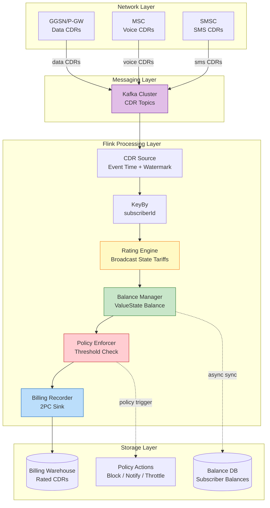
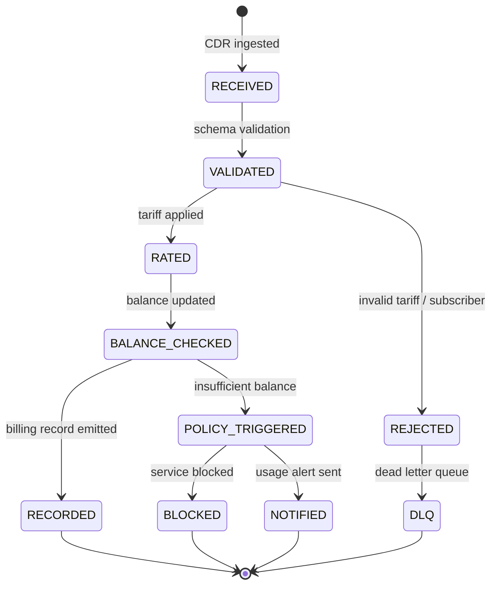
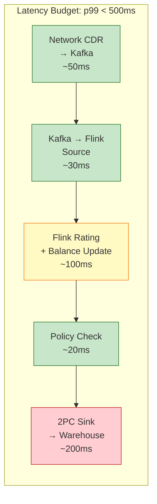

# Telecom Real-Time Billing System

> **Stage**: Knowledge/10-case-studies/telecom | **Prerequisites**: [Flink/02-core/flink-state-management-complete-guide](../../../Flink/02-core/flink-state-management-complete-guide-en.md), [Knowledge/02-design-patterns/pattern-event-time-processing](../../02-design-patterns/pattern-event-time-processing.md) | **Formalization Level**: L3-L4 | **Industry**: Telecommunications

## 1. Definitions

### Def-K-10-01: Real-Time Billing System (RTBS)

A **Real-Time Billing System** is a stream processing application that computes subscriber charges from network usage events (voice, data, SMS) with sub-second latency, enforcing credit limits and generating billing records in real time.

$$
\text{RTBS} = \langle \text{Event Ingress}, \text{Rating Engine}, \text{Balance Manager}, \text{Policy Enforcer}, \text{Billing Recorder} \rangle
$$

Where:

- **Event Ingress**: ingests CDRs (Call Detail Records) and network usage events from GGSN/P-GW, MSC, SMSC
- **Rating Engine**: applies tariff plans to usage events to compute monetary charges
- **Balance Manager**: tracks prepaid balances and postpaid credit limits in real time
- **Policy Enforcer**: triggers actions (throttle, block, notify) when thresholds are breached
- **Billing Recorder**: persists rated CDRs to billing warehouse for invoice generation

**Latency requirements**:

- Event ingestion to rating: < 100 ms (p99)
- Balance update to policy decision: < 200 ms (p99)
- End-to-end CDR persistence: < 500 ms (p99)

---

### Def-K-10-02: CDR (Call Detail Record)

A **Call Detail Record** is the atomic unit of telecom usage data, formally defined as:

$$
\text{CDR} = \langle \text{subscriberId}, \text{sessionId}, \text{eventType}, \text{startTime}, \text{duration}, \text{volume}, \text{cellId}, \text{tariffPlan} \rangle
$$

Where $\text{eventType} \in \{\text{VOICE}, \text{DATA}, \text{SMS}, \text{MMS}, \text{ROAMING}\}$.

---

### Def-K-10-03: Tariff Rating Function

The **Rating Function** maps a usage event to a monetary charge based on the subscriber's tariff plan:

$$
\text{Rate}: \text{CDR} \times \text{TariffPlan} \to \text{Charge}
$$

Standard tariff structures:

| Tariff Type | Rate Formula | Example |
|------------|-------------|---------|
| **Per-second voice** | $\text{Charge} = \lceil \text{duration} \rceil \times r_{sec}$ | $0.01/second |
| **Tiered data** | $\text{Charge} = \sum_{i} \min(v_i, \text{tier}_i) \times r_i$ | First 1GB free, then $0.05/MB |
| **Bundle allowance** | $\text{Charge} = \max(0, \text{usage} - \text{allowance}) \times r_{overage}$ | 100min bundle, $0.15/min overage |
| **Roaming surcharge** | $\text{Charge} = \text{base} \times (1 + \rho_{roaming})$ | 2x domestic rate |

---

## 2. Properties

### Prop-K-10-01: Balance Update Atomicity

**Statement**: For any prepaid subscriber $s$, the balance update operation is atomic and satisfies:

$$
\text{Balance}'_s = \text{Balance}_s - \text{Charge}(cdr) \land \text{Balance}'_s \geq 0 \lor \text{Action} = \text{BLOCK}
$$

**Proof**: In Flink, Keyed State (ValueState) for subscriber balance is updated within a single `processElement` call. By Lemma-S-03-01 (Mailbox serial processing), at most one thread processes events for a given subscriber key at any time, making read-modify-write operations atomic without explicit distributed locking. ∎

---

### Prop-K-10-02: Rating Determinism

**Statement**: For a fixed CDR and fixed tariff plan, the rating output is deterministic and independent of processing time.

**Proof**: The Rating Function (Def-K-10-03) is a pure mathematical function with no external dependencies. Tariff plans are loaded as Broadcast State (immutable during the billing cycle), ensuring all parallel instances apply identical rating rules. ∎

---

### Prop-K-10-03: Event-Time Ordering Sufficiency

**Statement**: For billing correctness, CDRs must be processed in event-time order within each subscriber key, but cross-subscriber ordering is irrelevant.

**Proof**: Billing computations are per-subscriber: balance deductions and allowance consumption only affect the same subscriber. Cross-subscriber events have no shared state. Therefore, per-key FIFO (Def-F-02-07) is sufficient, and global ordering is unnecessary. ∎

---

## 3. Relations

### Relation 1: RTBS $\mapsto$ Flink KeyedProcessFunction

**Mapping**:

| RTBS Component | Flink Primitive | Formal Basis |
|---------------|-----------------|--------------|
| Event Ingress | KafkaSource / PulsarSource | Def-F-02-96 (Checkpoint replayable Source) |
| Rating Engine | Map + Broadcast State | Def-F-02-95 (Operator State) |
| Balance Manager | KeyedProcessFunction + ValueState | Def-F-02-94 (Keyed State) |
| Policy Enforcer | ProcessFunction + TimerService | Def-K-02-03 (Trigger) |
| Billing Recorder | TwoPhaseCommitSinkFunction | Thm-S-18-01 (Exactly-Once) |

---

### Relation 2: RTBS $\mapsto$ Windowed Aggregation Pattern

**Mapping**: Allowance tracking (e.g., monthly data bundle) maps to tumbling event-time windows:

$$
\text{AllowanceWindow} = \text{Tumbling}(\text{month}) \times \text{KeyBy}(\text{subscriberId})
$$

The Windowed Aggregation pattern provides:

- Window assigner for billing cycle boundaries
- Incremental aggregation for usage accumulation
- Trigger for threshold alerts
- Allowed lateness for delayed CDRs

---

## 4. Argumentation

### 4.1 Why Stream Processing Is Essential for Real-Time Billing

**Traditional batch billing limitations**:

- Batch intervals (hours to days) allow subscribers to exceed credit limits before detection
- Roaming charges accumulate unchecked until next bill cycle
- Fraudulent usage (SIM cloning, toll fraud) detected too late for intervention

**Stream processing advantages**:

- **Credit control**: prepaid balance checked on every usage event; service blocked immediately upon depletion
- **Fraud detection**: anomalous patterns (sudden international call spike) trigger alerts within seconds
- **Customer experience**: real-time usage notifications prevent bill shock
- **Regulatory compliance**: some jurisdictions require balance visibility within 30 seconds of usage

---

### 4.2 Handling Delayed and Out-of-Order CDRs

**Challenge**: Network elements (GGSN, MSC) may emit CDRs with delays due to:

- Batch CDR generation at session end
- Network congestion between network elements and billing system
- Roaming partner CDR exchange latency (hours to days)

**Solution architecture**:

| Delay Scenario | Handling Strategy | Flink Mechanism |
|---------------|-------------------|-----------------|
| < 5 minutes | Watermark tolerance | `forBoundedOutOfOrderness(Duration.ofMinutes(5))` |
| 5 min - 24 hours | Allowed lateness + side output | `.allowedLateness(Time.hours(24))` + `.sideOutputLateData()` |
| > 24 hours (roaming) | Offline reconciliation batch | Late CDRs processed by nightly batch job; adjustments posted next bill cycle |

**Business rule**: CDRs received after billing cycle close are rated at the tariff plan effective at the event time, not the processing time, ensuring billing fairness (Prop-K-10-02).

---

### 4.3 Multi-Tenancy and Tariff Hotspot Mitigation

**Challenge**: Popular tariff plans (e.g., unlimited weekend data) create hot keys when many subscribers share the same plan definition.

**Mitigation strategies**:

1. **Broadcast State for tariffs**: Tariff plans are small enough (< 10MB) to broadcast to all parallel instances as Operator State, avoiding key skew from tariff lookups
2. **Subscriber key hashing**: `keyBy(subscriberId)` distributes load evenly across parallel instances
3. **Async external enrichment**: for complex enterprise tariffs requiring CRM lookup, use AsyncFunction to prevent blocking

---

## 5. Proof / Engineering Argument

### Thm-K-10-01: Real-Time Billing Correctness

**Statement**: The RTBS implementation using Flink with Exactly-Once configuration guarantees that:

1. Every CDR is rated exactly once
2. Subscriber balance reflects the sum of all rated charges
3. No CDR is lost or duplicated in billing records

**Proof**:

**Step 1: Source replayability**
Kafka Source persists offsets to Checkpoint (Def-F-02-96). After failure, recovery replays from last committed offset, ensuring no CDR loss (At-Least-Once).

**Step 2: Stateful rating atomicity**
Rating and balance update occur in a single `processElement` invocation on Keyed State. By Prop-K-10-01 (balance update atomicity), the charge is either fully applied or the subscriber is blocked—no partial updates.

**Step 3: Exactly-Once sink**
Billing records are written via TwoPhaseCommitSinkFunction to the billing warehouse. By Thm-S-18-01, pre-committed records are only visible after Checkpoint completion, preventing duplicates.

**Step 4: No orphan CDRs**
CDRs that fail rating (e.g., missing tariff plan) are routed to a dead-letter sink with Exactly-Once semantics, ensuring they are not silently dropped.

∎

---

## 6. Examples

### Flink Billing Pipeline Core Logic

```java
public class RealTimeBillingJob {
    public static void main(String[] args) throws Exception {
        StreamExecutionEnvironment env = StreamExecutionEnvironment.getExecutionEnvironment();
        env.enableCheckpointing(30000);
        env.getCheckpointConfig().setCheckpointingMode(CheckpointingMode.EXACTLY_ONCE);
        env.setStateBackend(new EmbeddedRocksDBStateBackend(true));

        // 1. Ingest CDRs from Kafka with event-time
        DataStream<CDR> cdrs = env
            .fromSource(kafkaSource, WatermarkStrategy
                .<CDR>forBoundedOutOfOrderness(Duration.ofMinutes(5))
                .withIdleness(Duration.ofMinutes(1)), "CDR Source")
            .keyBy(CDR::getSubscriberId);

        // 2. Rate and update balance
        DataStream<BillingRecord> rated = cdrs.process(new RatingFunction());

        // 3. Sink to billing warehouse with Exactly-Once
        rated.addSink(new BillingWarehouseSink());
        env.execute("Real-Time Billing");
    }
}

public class RatingFunction extends KeyedProcessFunction<String, CDR, BillingRecord> {
    private ValueState<SubscriberBalance> balanceState;
    private MapState<String, Integer> allowanceState;
    private BroadcastState<String, TariffPlan> tariffState;

    @Override
    public void open(Configuration parameters) {
        balanceState = getRuntimeContext().getState(
            new ValueStateDescriptor<>("balance", SubscriberBalance.class));
        allowanceState = getRuntimeContext().getMapState(
            new MapStateDescriptor<>("allowance", String.class, Integer.class));
    }

    @Override
    public void processElement(CDR cdr, Context ctx, Collector<BillingRecord> out)
            throws Exception {
        SubscriberBalance balance = balanceState.value();
        if (balance == null) balance = new SubscriberBalance(cdr.getSubscriberId());

        TariffPlan tariff = tariffState.get(cdr.getTariffPlan());
        Charge charge = tariff.rate(cdr);

        if (balance.getAvailable() >= charge.getAmount()) {
            balance.deduct(charge.getAmount());
            balanceState.update(balance);

            if (tariff.hasBundle()) {
                String bundleKey = tariff.getBundleKey();
                int remaining = allowanceState.getOrDefault(bundleKey, tariff.getBundleSize());
                remaining -= cdr.getVolume();
                allowanceState.put(bundleKey, Math.max(0, remaining));
            }
            out.collect(new BillingRecord(cdr, charge, balance.getAvailable()));
        } else {
            ctx.output(policyActionTag, new PolicyAction(cdr.getSubscriberId(), "BLOCK_DATA"));
        }
    }
}
```

---

## 7. Visualizations

### Real-Time Billing System Architecture



*Legend*: Purple = Kafka messaging backbone; Yellow = Rating Engine with broadcast tariff state; Green = Balance Manager with keyed state; Red = Policy Enforcer triggering actions; Blue = Billing Recorder with Exactly-Once sink.

### Billing Flow State Machine



### Latency Budget Breakdown



*Legend*: Green = within target; Yellow = watch; Red = largest component requiring optimization (network round-trip to warehouse).

---

## 8. References


---

*Document Version: v1.0 | Updated: 2026-04-20 | Status: Complete*
