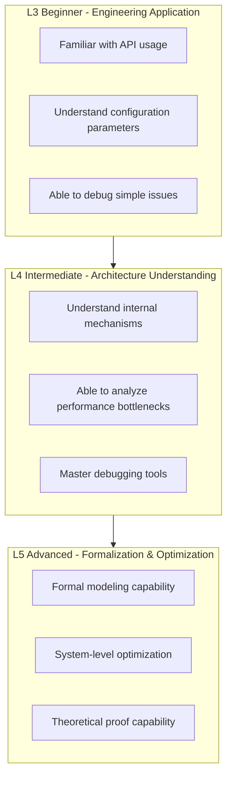

# Stream Computing Exercise Collection

> **Stage**: Knowledge | **Prerequisites**: [Struct/ Theoretical Foundations](../../Struct/00-INDEX.md), [Flink/ Practice Guide](../../Struct/00-INDEX.md) | **Formalization Level**: L3-L5

This document compiles core stream computing exercises covering three dimensions: theoretical foundations, engineering practice, and formal verification.

---

## Exercise Catalog

| ID | Exercise Name | Difficulty | Estimated Time | Core Topics |
|------|----------|------|----------|----------|
| [01](./exercise-01-process-calculus.md) | Process Calculus Basics | L4 | 4-6h | CCS, CSP, π-calculus |
| [02](./exercise-02-flink-basics.md) | Flink Basic Programming | L3 | 3-4h | DataStream API, Transformation |
| [03](./exercise-03-checkpoint-analysis.md) | Checkpoint Analysis | L4 | 4-5h | Fault tolerance, state consistency |
| [04](./exercise-04-consistency-models.md) | Consistency Model Comparison | L5 | 5-6h | Exactly-Once, concurrency semantics |
| [05](./exercise-05-pattern-implementation.md) | Design Pattern Implementation | L4 | 4-5h | Window patterns, side outputs, CEP |
| [06](./exercise-06-tla-practice.md) | TLA+ Practice | L5 | 6-8h | Formal verification, specification writing |

---

## Difficulty Level Guide



| Level | Target Audience | Capability Requirements |
|------|----------|----------|
| L3 | Junior Developer | Master basic APIs, able to complete common development tasks |
| L4 | Intermediate Engineer | Deep understanding of principles, able to design complex stream processing topologies |
| L5 | Senior Architect/Researcher | Formal verification capability, system-level optimization capability |

---

## Recommended Learning Paths

### Path 1: Engineer Track

```
exercise-02 (Flink Basics)
    → exercise-03 (Checkpoint)
    → exercise-05 (Design Patterns)
    → exercise-04 (Consistency Models)
```

### Path 2: Researcher Track

```
exercise-01 (Process Calculus)
    → exercise-04 (Consistency Models)
    → exercise-06 (TLA+ Verification)
    → exercise-03 (Checkpoint)
```

### Path 3: Complete Track

```
exercise-01 → exercise-02 → exercise-03 → exercise-05 → exercise-04 → exercise-06
```

---

## Grading Criteria Overview

| Grade | Score Range | Capability Description |
|------|----------|----------|
| S | 95-100 | Fully completed with innovative thinking |
| A | 85-94 | Basically completed with minor errors |
| B | 70-84 | Major parts completed |
| C | 60-69 | Partially completed |
| F | <60 | Needs to restudy |

---

## Environment Setup

### Required Tools

- JDK 11+ (Flink exercises)
- Maven 3.8+ or Gradle 7+
- Docker (local Flink cluster)
- Python 3.9+ (TLA+ exercises)

### Optional Tools

- TLA+ Toolbox
- Flink Web UI
- VisualVM / JProfiler

---

## Submission Guidelines

1. Submit each exercise independently
2. Code must include comments explaining design rationale
3. Submit theoretical exercises in Markdown format
4. Performance analysis must include data screenshots or logs

---

## Reference Resources

- [Struct/ Theoretical Documents](../../Struct/00-INDEX.md)
- [Flink/ Practice Guide](../../Struct/00-INDEX.md)
- [TLA+ Official Website](https://lamport.azurewebsites.net/tla/tla.html)
- [Flink Official Documentation](https://nightlies.apache.org/flink/flink-docs-stable/)

---

## Changelog

| Date | Version | Update Content |
|------|------|----------|
| 2026-04-02 | v1.0 | Initial version, containing 6 core exercises |
