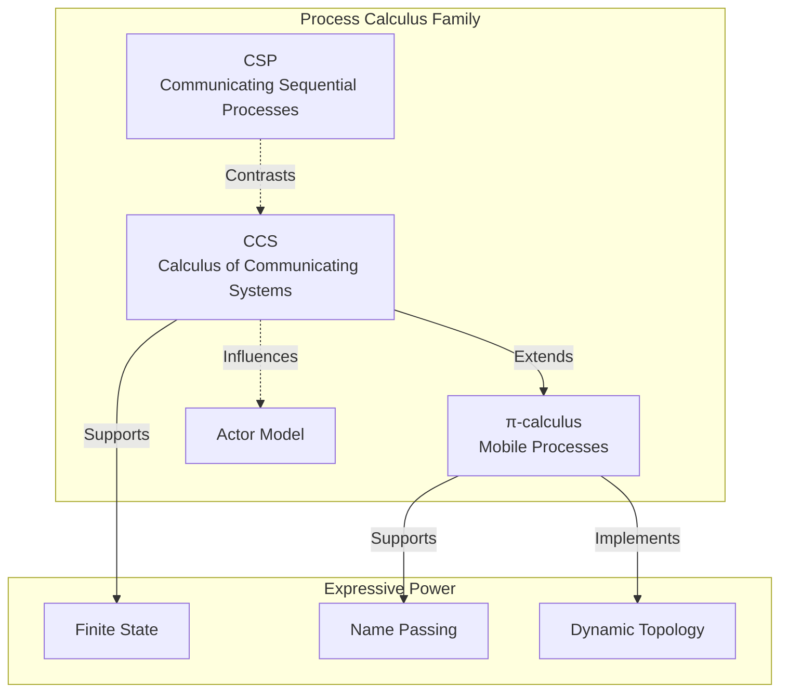

# Exercise 01: Process Calculus Fundamentals

> Stage: Knowledge | Prerequisites: [Unified Streaming Theory](../../Struct/01-foundation/01.01-unified-streaming-theory.md) | Formalization Level: L4

---

## Table of Contents

- [Exercise 01: Process Calculus Fundamentals](#exercise-01-process-calculus-fundamentals)
  - [Table of Contents](#table-of-contents)
  - [1. Learning Objectives](#1-learning-objectives)
  - [2. Prerequisites](#2-prerequisites)
    - [2.1 Required Reading](#21-required-reading)
    - [2.2 Concept Checklist](#22-concept-checklist)
  - [3. Exercises](#3-exercises)
    - [3.1 Theory Questions (60 points)](#31-theory-questions-60-points)
      - [Question 1.1: CCS Syntax Parsing (15 points)](#question-11-ccs-syntax-parsing-15-points)
      - [Question 1.2: Dining Philosophers Problem Modeling (20 points)](#question-12-dining-philosophers-problem-modeling-20-points)
      - [Question 1.3: π-calculus Name Passing (15 points)](#question-13-π-calculus-name-passing-15-points)
      - [Question 1.4: CSP Trace Semantics Analysis (10 points)](#question-14-csp-trace-semantics-analysis-10-points)
    - [3.2 Programming Questions (40 points)](#32-programming-questions-40-points)
      - [Question 1.5: Simulating Actor Behavior in Go (20 points)](#question-15-simulating-actor-behavior-in-go-20-points)
      - [Question 1.6: Bisimulation Verification Tool Usage (20 points)](#question-16-bisimulation-verification-tool-usage-20-points)
  - [4. Answer Key Links](#4-answer-key-links)
  - [5. Grading Rubric](#5-grading-rubric)
    - [Total Score Distribution](#total-score-distribution)
    - [Question Scores](#question-scores)
  - [6. Advanced Challenges (Bonus)](#6-advanced-challenges-bonus)
  - [7. Reference Resources](#7-reference-resources)
  - [8. Visualizations](#8-visualizations)
    - [Process Calculus Relationship Diagram](#process-calculus-relationship-diagram)

## 1. Learning Objectives

After completing this exercise, you will be able to:

- **Def-K-01-01**: Master the basic syntax and semantics of CCS/CSP/π-calculus
- **Def-K-01-02**: Use process calculus to model simple concurrent systems
- **Def-K-01-03**: Understand the concept of bisimulation equivalence and its proof methods
- **Def-K-01-04**: Analyze deadlock and livelock in concurrent systems

---

## 2. Prerequisites

### 2.1 Required Reading

1. **CCS (Calculus of Communicating Systems)**
   - Milner, R. (1989). *Communication and Concurrency*
   - Key chapters: 3-5

2. **CSP (Communicating Sequential Processes)**
   - Hoare, C.A.R. (1985). *Communicating Sequential Processes*
   - Key chapters: 1-4

3. **π-calculus**
   - Milner, R. (1999). *Communicating and Mobile Systems: The π-calculus*
   - Key chapters: 1-3

### 2.2 Concept Checklist

| Concept | Symbol | Intuitive Explanation |
|---------|--------|-----------------------|
| Action prefix | $a.P$ | Execute action $a$, then continue as $P$ |
| Choice sum | $P + Q$ | Nondeterministically choose $P$ or $Q$ |
| Parallel composition | $P \| Q$ | $P$ and $Q$ execute concurrently |
| Restriction | $(\nu a)P$ | Restrict $a$ to be visible only inside $P$ |
| Relabeling | $P[f]$ | Rename actions via function $f$ |

---

## 3. Exercises

### 3.1 Theory Questions (60 points)

#### Question 1.1: CCS Syntax Parsing (15 points)

**Difficulty**: L3

Given the following CCS process definitions:

```
P = a.b.0 + a.c.0
Q = a.(b.0 + c.0)
R = P | Q
```

Please answer:

1. Draw the LTS (Labeled Transition System) for $P$ and $Q$ (5 points)
2. Are $P$ and $Q$ strongly bisimilar? Prove your conclusion (5 points)
3. Are $P$ and $Q$ weakly bisimilar? Explain your reasoning (5 points)

---

#### Question 1.2: Dining Philosophers Problem Modeling (20 points)

**Difficulty**: L4

Use CCS to model the classic dining philosophers problem (5 philosophers).

Requirements:

1. Define philosopher processes $Phil_i$ and fork processes $Fork_i$ (8 points)
2. Give the complete system parallel composition expression (4 points)
3. Analyze possible deadlock situations in the system (4 points)
4. Propose a deadlock-avoidance modeling scheme (4 points)

---

#### Question 1.3: π-calculus Name Passing (15 points)

**Difficulty**: L4

Given the following π-calculus processes:

```
P = (νc)(ā⟨c⟩.P' | c(x).Q)
Q = b(y).Q'
```

Where $ā⟨c⟩$ means sending name $c$ on channel $a$.

Please answer:

1. What is the system state after one reduction step? (5 points)
2. Explain why π-calculus is called "mobile" (5 points)
3. Compare the expressive power differences between CCS and π-calculus (5 points)

---

#### Question 1.4: CSP Trace Semantics Analysis (10 points)

**Difficulty**: L4

Given CSP processes:

```
P = a → b → STOP ⊓ a → c → STOP
Q = a → (b → STOP ⊓ c → STOP)
```

Where $⊓$ denotes external choice.

Please answer:

1. Give the trace sets $traces(P)$ and $traces(Q)$ respectively (4 points)
2. Determine whether $P$ and $Q$ are equivalent under trace semantics (3 points)
3. Explain the difference between CSP external choice and CCS choice (3 points)

---

### 3.2 Programming Questions (40 points)

#### Question 1.5: Simulating Actor Behavior in Go (20 points)

**Difficulty**: L4

Use Go's goroutine and channel to implement a simple Actor system.

**Requirements**:

1. Implement Actor creation, message sending, and message handling (8 points)
2. Implement a simple request-response pattern (6 points)
3. Implement parent-child supervision relationship (simple error propagation) (6 points)

**Reference Code Framework**:

```go
package main

import "fmt"

type Message struct {
    From      string        // Sender ID, identifying the source Actor
    Payload   interface{}   // Message content, can be any type
    ReplyTo   chan Message  // Reply channel for request-response pattern (optional)
    MsgType   MessageType   // Message type, distinguishing different message categories
    Timestamp int64         // Send timestamp (ms), for timeout handling
}

// MessageType defines message type enum
type MessageType int

const (
    MsgTypeNormal     MessageType = iota // Normal message
    MsgTypeRequest                       // Request message (requires response)
    MsgTypeResponse                      // Response message
    MsgTypeSupervisor                    // Supervisor message (error report)
)

// **Reference Answer**:
// type Message struct {
//     From    string              // Sender ID
//     Payload interface{}         // Message content
//     ReplyTo chan Message        // Reply channel for request-response pattern
//     MsgType MessageType         // Message type enum (optional, for distinguishing categories)
//     Timestamp int64             // Send timestamp (optional, for timeout handling)
// }
//
// type MessageType int
// const (
//     MsgTypeNormal MessageType = iota
//     MsgTypeRequest
//     MsgTypeResponse
//     MsgTypeSupervisor
// )

type Actor struct {
    ID       string              // Unique Actor identifier
    Mailbox  chan Message        // Message mailbox (buffered channel)
    Behavior func(Message)       // Message handling behavior function
    Children []*Actor            // Child Actor list (supervision tree)
    Parent   *Actor              // Parent Actor (supervisor)
    system   *ActorSystem        // Belonging Actor system
    stopCh   chan struct{}       // Stop signal channel
}

// ActorSystem manages the lifecycle of all Actors
type ActorSystem struct {
    actors map[string]*Actor     // Actor registry
    mu     sync.RWMutex          // RWMutex protecting concurrent access
}

// NewActorSystem creates a new Actor system
func NewActorSystem() *ActorSystem {
    return &ActorSystem{
        actors: make(map[string]*Actor),
    }
}

// Register registers an Actor into the system
func (as *ActorSystem) Register(actor *Actor) {
    as.mu.Lock()
    defer as.mu.Unlock()
    as.actors[actor.ID] = actor
}

// Get retrieves an Actor by ID
func (as *ActorSystem) Get(id string) (*Actor, bool) {
    as.mu.RLock()
    defer as.mu.RUnlock()
    actor, ok := as.actors[id]
    return actor, ok
}

// Send sends a message to the specified Actor (asynchronous)
func (as *ActorSystem) Send(to string, msg Message) error {
    actor, ok := as.Get(to)
    if !ok {
        return fmt.Errorf("actor %s not found", to)
    }
    select {
    case actor.Mailbox <- msg:
        return nil
    default:
        return fmt.Errorf("actor %s mailbox is full", to)
    }
}

// Spawn creates and starts a new Actor
func (as *ActorSystem) Spawn(id string, behavior func(Message), parent *Actor) *Actor {
    actor := &Actor{
        ID:       id,
        Mailbox:  make(chan Message, 100), // Buffer size 100
        Behavior: behavior,
        Children: []*Actor{},
        Parent:   parent,
        system:   as,
        stopCh:   make(chan struct{}),
    }

    // If parent Actor exists, add to children list
    if parent != nil {
        parent.Children = append(parent.Children, actor)
    }

    // Register to system
    as.Register(actor)

    // Start Actor goroutine
    go actor.run()

    return actor
}

// run is the Actor main loop
func (a *Actor) run() {
    // Use recover to catch panic, implementing error supervision
    defer func() {
        if r := recover(); r != nil {
            fmt.Printf("[Supervision] Actor %s panic recovered: %v\n", a.ID, r)
            if a.Parent != nil {
                // Report error to parent Actor (supervision)
                a.Parent.Mailbox <- Message{
                    From:      a.ID,
                    Payload:   fmt.Sprintf("child_failed: %v", r),
                    MsgType:   MsgTypeSupervisor,
                    Timestamp: time.Now().UnixMilli(),
                }
            }
        }
    }()

    for {
        select {
        case msg := <-a.Mailbox:
            // Process message
            a.Behavior(msg)
        case <-a.stopCh:
            // Received stop signal
            fmt.Printf("[Actor] %s stopped\n", a.ID)
            return
        }
    }
}

// Stop stops the Actor
func (a *Actor) Stop() {
    close(a.stopCh)
}

// RequestResponse sends a request and waits for response (synchronous)
func (a *Actor) RequestResponse(target string, payload interface{}, timeout time.Duration) (Message, error) {
    replyCh := make(chan Message, 1)
    msg := Message{
        From:      a.ID,
        Payload:   payload,
        ReplyTo:   replyCh,
        MsgType:   MsgTypeRequest,
        Timestamp: time.Now().UnixMilli(),
    }

    // Send request
    if err := a.system.Send(target, msg); err != nil {
        return Message{}, err
    }

    // Wait for response or timeout
    select {
    case resp := <-replyCh:
        return resp, nil
    case <-time.After(timeout):
        return Message{}, fmt.Errorf("request timeout after %v", timeout)
    }
}

// **Reference Answer**: Core Actor system implementation
/*
package main

import (
    "fmt"
    "sync"
    "time"
)

// ActorSystem manages all Actors
type ActorSystem struct {
    actors map[string]*Actor
    mu     sync.RWMutex
}

func NewActorSystem() *ActorSystem {
    return &ActorSystem{
        actors: make(map[string]*Actor),
    }
}

func (as *ActorSystem) Register(actor *Actor) {
    as.mu.Lock()
    defer as.mu.Unlock()
    as.actors[actor.ID] = actor
}

func (as *ActorSystem) Get(id string) (*Actor, bool) {
    as.mu.RLock()
    defer as.mu.RUnlock()
    actor, ok := as.actors[id]
    return actor, ok
}

// Send sends a message to the specified Actor
func (as *ActorSystem) Send(to string, msg Message) error {
    actor, ok := as.Get(to)
    if !ok {
        return fmt.Errorf("actor %s not found", to)
    }
    actor.Mailbox <- msg
    return nil
}

// Spawn creates and starts a new Actor
func (as *ActorSystem) Spawn(id string, behavior func(Message), parent *Actor) *Actor {
    actor := &Actor{
        ID:       id,
        Mailbox:  make(chan Message, 100),
        Behavior: behavior,
        Children: []*Actor{},
        Parent:   parent,
        system:   as,
        stopCh:   make(chan struct{}),
    }

    if parent != nil {
        parent.Children = append(parent.Children, actor)
    }

    as.Register(actor)

    // Start Actor goroutine
    go actor.run()

    return actor
}

func (a *Actor) run() {
    defer func() {
        if r := recover(); r != nil {
            fmt.Printf("Actor %s panic: %v\n", a.ID, r)
            if a.Parent != nil {
                // Report error to parent Actor
                a.Parent.Mailbox <- Message{
                    From:    a.ID,
                    Payload: fmt.Sprintf("child_failed: %v", r),
                    MsgType: MsgTypeSupervisor,
                }
            }
        }
    }()

    for {
        select {
        case msg := <-a.Mailbox:
            a.Behavior(msg)
        case <-a.stopCh:
            return
        }
    }
}

func (a *Actor) Stop() {
    close(a.stopCh)
}

// RequestResponse sends a request and waits for response
func (a *Actor) RequestResponse(target string, payload interface{}, timeout time.Duration) (Message, error) {
    replyCh := make(chan Message, 1)
    msg := Message{
        From:    a.ID,
        Payload: payload,
        ReplyTo: replyCh,
        MsgType: MsgTypeRequest,
    }

    if err := a.system.Send(target, msg); err != nil {
        return Message{}, err
    }

    select {
    case resp := <-replyCh:
        return resp, nil
    case <-time.After(timeout):
        return Message{}, fmt.Errorf("request timeout")
    }
}
*/

func main() {
    fmt.Println("=== Actor System Demo ===")

    // Create Actor system
    system := NewActorSystem()

    // ========== 1. Create parent Actor (supervisor) ==========
    parentBehavior := func(msg Message) {
        switch msg.MsgType {
        case MsgTypeSupervisor:
            fmt.Printf("[Parent-Supervisor] Child %s reported failure: %v\n",
                msg.From, msg.Payload)
        default:
            fmt.Printf("[Parent] Received from %s: %v\n", msg.From, msg.Payload)
        }
    }
    parent := system.Spawn("parent", parentBehavior, nil)
    fmt.Println("Created parent actor")

    // ========== 2. Create child Actor (with supervision) ==========
    childBehavior := func(msg Message) {
        switch msg.Payload.(type) {
        case string:
            content := msg.Payload.(string)
            if content == "panic" {
                panic("simulated error in child actor")
            }
            fmt.Printf("[Child] Received: %s\n", content)

            // Request-response pattern: if ReplyTo channel exists, send response
            if msg.ReplyTo != nil {
                response := Message{
                    From:      "child",
                    Payload:   fmt.Sprintf("Response to: %s", content),
                    MsgType:   MsgTypeResponse,
                    Timestamp: time.Now().UnixMilli(),
                }
                msg.ReplyTo <- response
            }
        default:
            fmt.Printf("[Child] Received: %v\n", msg.Payload)
        }
    }
    child := system.Spawn("child", childBehavior, parent)
    fmt.Println("Created child actor with parent supervision")

    // ========== 3. Demo normal message sending ==========
    fmt.Println("\n--- Test 1: Normal Message ---")
    system.Send("child", Message{
        From:      "main",
        Payload:   "Hello, Actor!",
        MsgType:   MsgTypeNormal,
        Timestamp: time.Now().UnixMilli(),
    })
    time.Sleep(100 * time.Millisecond)

    // ========== 4. Demo request-response pattern ==========
    fmt.Println("\n--- Test 2: Request-Response Pattern ---")
    go func() {
        resp, err := parent.RequestResponse("child", "What time is it?", 2*time.Second)
        if err != nil {
            fmt.Printf("[Request] Failed: %v\n", err)
        } else {
            fmt.Printf("[Request] Got response: %v\n", resp.Payload)
        }
    }()
    time.Sleep(200 * time.Millisecond)

    // ========== 5. Demo error supervision (trigger panic) ==========
    fmt.Println("\n--- Test 3: Supervision (Error Propagation) ---")
    time.Sleep(100 * time.Millisecond)
    system.Send("child", Message{
        From:      "main",
        Payload:   "panic",  // Special message to trigger panic
        MsgType:   MsgTypeNormal,
        Timestamp: time.Now().UnixMilli(),
    })
    time.Sleep(300 * time.Millisecond)

    // ========== 6. Cleanup ==========
    fmt.Println("\n--- Cleanup ---")
    child.Stop()
    parent.Stop()
    time.Sleep(100 * time.Millisecond)

    fmt.Println("\n=== Demo Complete ===")
}

// Expected output example:
// === Actor System Demo ===
// Created parent actor
// Created child actor with parent supervision
//
// --- Test 1: Normal Message ---
// [Child] Received: Hello, Actor!
//
// --- Test 2: Request-Response Pattern ---
// [Child] Received: What time is it?
// [Request] Got response: Response to: What time is it?
//
// --- Test 3: Supervision (Error Propagation) ---
// [Supervision] Actor child panic recovered: simulated error in child actor
// [Parent-Supervisor] Child child reported failure: child_failed: simulated error in child actor
//
// --- Cleanup ---
// [Actor] child stopped
// [Actor] parent stopped
//
// === Demo Complete ===

// **Reference Answer**: Demo of request-response and supervision relationship
/*
func main() {
    system := NewActorSystem()

    // 1. Create parent Actor (supervisor)
    parentBehavior := func(msg Message) {
        switch msg.MsgType {
        case MsgTypeSupervisor:
            fmt.Printf("[Supervisor] Child %s reported failure: %v\n", msg.From, msg.Payload)
        default:
            fmt.Printf("[Parent] Received from %s: %v\n", msg.From, msg.Payload)
        }
    }
    parent := system.Spawn("parent", parentBehavior, nil)

    // 2. Create child Actor (with supervision)
    childBehavior := func(msg Message) {
        if msg.Payload == "panic" {
            panic("simulated error")
        }
        fmt.Printf("[Child] Received: %v\n", msg.Payload)

        // Request-response pattern: reply to message
        if msg.ReplyTo != nil {
            msg.ReplyTo <- Message{
                From:    "child",
                Payload: fmt.Sprintf("response to: %v", msg.Payload),
            }
        }
    }
    child := system.Spawn("child", childBehavior, parent)

    // 3. Demo message sending
    system.Send("child", Message{From: "main", Payload: "hello"})

    // 4. Demo request-response
    go func() {
        resp, err := parent.RequestResponse("child", "request data", 5*time.Second)
        if err != nil {
            fmt.Printf("Request failed: %v\n", err)
        } else {
            fmt.Printf("Response received: %v\n", resp.Payload)
        }
    }()

    // 5. Demo error propagation (trigger panic)
    time.Sleep(100 * time.Millisecond)
    system.Send("child", Message{From: "main", Payload: "panic"})

    // Wait to observe output
    time.Sleep(500 * time.Millisecond)

    child.Stop()
    parent.Stop()
}
*/
```

---

#### Question 1.6: Bisimulation Verification Tool Usage (20 points)

**Difficulty**: L5

Use CADP (Construction and Analysis of Distributed Processes) or mCRL2 tools to verify the following properties:

**Tasks**:

1. Write the mCRL2 specification for the dining philosophers problem above (8 points)
2. Verify whether the system contains deadlocks (6 points)
3. Compare the effects of different deadlock avoidance strategies (6 points)

**Submission Requirements**:

- `.mcrl2` source file
- Verification scripts and result screenshots
- Analysis report (minimum 500 words)

---

## 4. Answer Key Links

| Question | Answer Location | Supplementary Notes |
|----------|-----------------|---------------------|
| 1.1 | **answers/01-process-calculus.md** (answer pending) | Contains complete LTS diagrams |
| 1.2 | **answers/01-process-calculus.md** (answer pending) | Includes multiple modeling scheme comparisons |
| 1.3 | **answers/01-process-calculus.md** (answer pending) | Detailed π-calculus reduction explanation |
| 1.4 | **answers/01-process-calculus.md** (answer pending) | CSP semantics comparison table |
| 1.5 | **answers/01-code/actor-simulation.go** (code example pending) | Complete Go implementation |
| 1.6 | **answers/01-code/dining-philosophers.mcrl2** (code example pending) | mCRL2 specification |

---

## 5. Grading Rubric

### Total Score Distribution

| Grade | Score Range | Requirements |
|-------|-------------|--------------|
| S (Excellent) | 95-100 | All completed, programming questions have innovative design |
| A (Good) | 85-94 | Theory questions mostly correct, programming questions fully runnable |
| B (Average) | 70-84 | Major questions completed, minor errors |
| C (Pass) | 60-69 | More than half completed |
| F (Fail) | <60 | Need to re-study fundamentals |

### Question Scores

| Question | Points | Key Grading Criteria |
|----------|--------|----------------------|
| 1.1 | 15 | LTS diagram accuracy, completeness of bisimulation proof |
| 1.2 | 20 | Modeling accuracy, depth of deadlock analysis |
| 1.3 | 15 | Correctness of reduction steps, expressive power comparison |
| 1.4 | 10 | Correct trace semantics computation |
| 1.5 | 20 | Code completeness, concurrency safety |
| 1.6 | 20 | Specification correctness, verification completeness |

---

## 6. Advanced Challenges (Bonus)

Complete any one of the following tasks for an extra 10 points:

1. **Session Types Implementation**: Implement a Session Types-based type checker in a programming language of your choice
2. **Actor Performance Testing**: Compare the performance of different Actor libraries (Akka, Orleans, Go-actor)
3. **Hybrid System Modeling**: Use Hybrid CSP to model a system containing continuous physical quantities

---

## 7. Reference Resources


---

## 8. Visualizations

### Process Calculus Relationship Diagram



---

*Last Updated: 2026-04-02*
