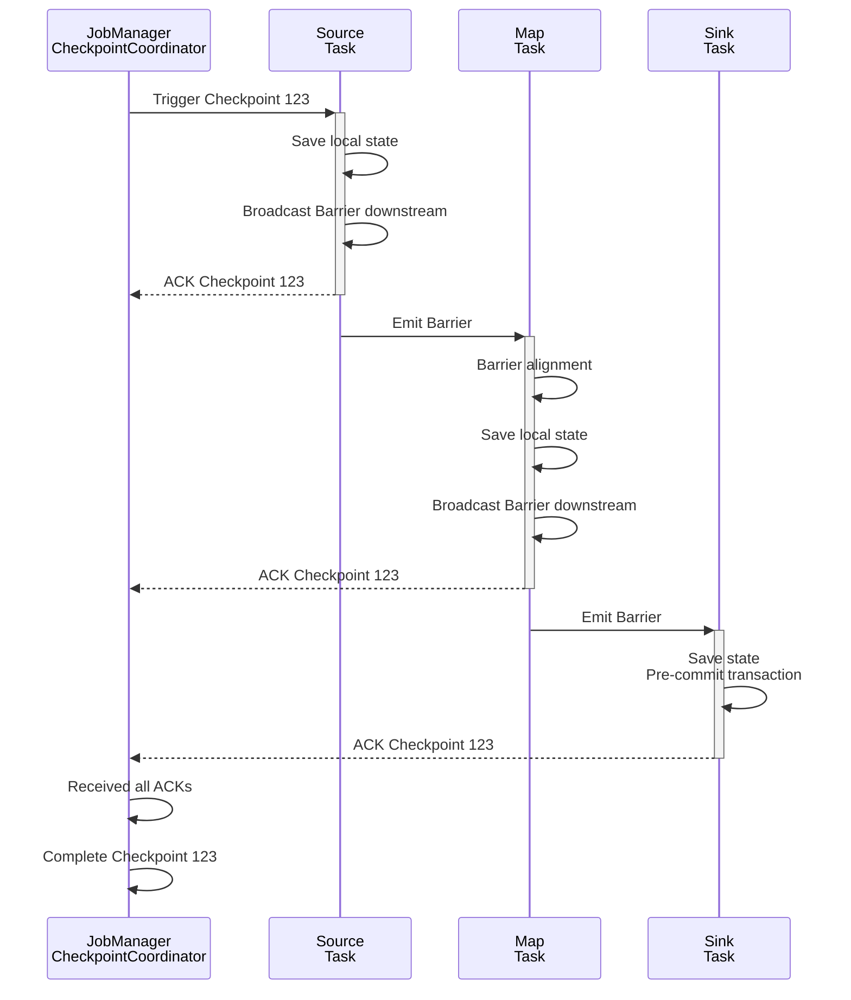

# Exercise 03: Checkpoint Analysis

> Stage: Knowledge | Prerequisites: [Checkpoint Mechanism](../../Flink/02-core/checkpoint-mechanism-deep-dive.md), [exercise-02](./exercise-02-flink-basics.md) | Formalization Level: L4

---

## Table of Contents

- [Exercise 03: Checkpoint Analysis](#exercise-03-checkpoint-analysis)
  - [Table of Contents](#table-of-contents)
  - [1. Learning Objectives](#1-learning-objectives)
  - [2. Prerequisites](#2-prerequisites)
    - [2.1 Core Checkpoint Concepts](#21-core-checkpoint-concepts)
    - [2.2 Key Configuration Parameters](#22-key-configuration-parameters)
  - [3. Exercises](#3-exercises)
    - [3.1 Theory Questions (40 points)](#31-theory-questions-40-points)
      - [Question 3.1: Checkpoint Execution Flow (10 points)](#question-31-checkpoint-execution-flow-10-points)
      - [Question 3.2: Exactly-Once Semantics Analysis (10 points)](#question-32-exactly-once-semantics-analysis-10-points)
      - [Question 3.3: Checkpoint Failure Diagnosis (10 points)](#question-33-checkpoint-failure-diagnosis-10-points)
      - [Question 3.4: State Backend Comparison (10 points)](#question-34-state-backend-comparison-10-points)
    - [3.2 Programming and Analysis Questions (60 points)](#32-programming-and-analysis-questions-60-points)
      - [Question 3.5: Checkpoint Configuration Optimization (15 points)](#question-35-checkpoint-configuration-optimization-15-points)
      - [Question 3.6: Checkpoint Performance Analysis (20 points)](#question-36-checkpoint-performance-analysis-20-points)
      - [Question 3.7: Fault Recovery Test (15 points)](#question-37-fault-recovery-test-15-points)
      - [Question 3.8: Unaligned Checkpoint Analysis (10 points)](#question-38-unaligned-checkpoint-analysis-10-points)
  - [4. Answer Key Links](#4-answer-key-links)
  - [5. Grading Criteria](#5-grading-criteria)
    - [Score Distribution](#score-distribution)
    - [Key Grading Items](#key-grading-items)
  - [6. Advanced Challenge (Bonus)](#6-advanced-challenge-bonus)
  - [7. Reference Resources](#7-reference-resources)
  - [8. Visualizations](#8-visualizations)
    - [Checkpoint Execution Flow](#checkpoint-execution-flow)

## 1. Learning Objectives

After completing this exercise, you will be able to:

- **Def-K-03-01**: Deeply understand Checkpoint trigger mechanisms and execution flow
- **Def-K-03-02**: Master diagnosis methods for Checkpoint timeout and failure
- **Def-K-03-03**: Be able to configure and optimize Checkpoint parameters
- **Def-K-03-04**: Understand Exactly-Once semantics implementation in Checkpoint

---

## 2. Prerequisites

### 2.1 Core Checkpoint Concepts

| Concept | Description |
|---------|-------------|
| Checkpoint Barrier | Special record used to separate data before and after a Checkpoint |
| Snapshot | Consistent snapshot of each operator's state |
| Checkpoint Coordinator | JobManager component responsible for coordinating Checkpoints |
| State Backend | State storage backend (Memory/FS/RocksDB) |
| Incremental Checkpoint | Only saves incremental state changes |

### 2.2 Key Configuration Parameters

```java

import org.apache.flink.streaming.api.CheckpointingMode;

// Checkpoint configuration example
env.enableCheckpointing(60000);  // 1 minute
env.getCheckpointConfig().setCheckpointingMode(
    CheckpointingMode.EXACTLY_ONCE);
env.getCheckpointConfig().setMinPauseBetweenCheckpoints(30000);
env.getCheckpointConfig().setCheckpointTimeout(600000);
env.getCheckpointConfig().setMaxConcurrentCheckpoints(1);
env.getCheckpointConfig().enableExternalizedCheckpoints(
    ExternalizedCheckpointCleanup.RETAIN_ON_CANCELLATION);
```

---

## 3. Exercises

### 3.1 Theory Questions (40 points)

#### Question 3.1: Checkpoint Execution Flow (10 points)

**Difficulty**: L4

Describe the complete execution flow of a Flink Checkpoint:

1. Complete steps from Checkpoint Coordinator initiation to completion (6 points)
2. Draw the propagation process of Barriers in the stream (4 points)

**Key points**:

- Distinction between synchronous and asynchronous phases
- Difference between aligned and unaligned Barriers
- Timing of state snapshot triggering

---

#### Question 3.2: Exactly-Once Semantics Analysis (10 points)

**Difficulty**: L4

Analyze the Exactly-Once guarantee mechanism in the following scenarios:

**Scenario A**: Kafka Source + in-memory state + Print Sink
**Scenario B**: Kafka Source + RocksDB + Kafka Sink (two-phase commit)

Please answer:

1. Can Scenario A guarantee Exactly-Once? Why? (4 points)
2. What is the two-phase commit flow in Scenario B? (4 points)
3. If the Sink does not support two-phase commit, how to achieve end-to-end Exactly-Once? (2 points)

---

#### Question 3.3: Checkpoint Failure Diagnosis (10 points)

**Difficulty**: L4

Given the following log snippet:

```
2024-01-15 10:23:45,123 WARN  Checkpoint 123 - expired before completing
2024-01-15 10:23:45,234 INFO  Failed to trigger checkpoint 123
    due to CheckpointExpiredException
2024-01-15 10:24:00,456 WARN  Source: CustomSource -> Map
    back-pressured, buffer usage: 95%
```

Please answer:

1. Analyze the root cause of Checkpoint failure (4 points)
2. Propose at least 3 solutions (4 points)
3. How to adjust parameters to avoid similar issues? (2 points)

---

#### Question 3.4: State Backend Comparison (10 points)

**Difficulty**: L4

Compare the three state backends:

| Feature | MemoryStateBackend | FsStateBackend | RocksDBStateBackend |
|---------|-------------------|----------------|---------------------|
| Storage location | | | |
| State size limit | | | |
| Incremental Checkpoint | | | |
| Applicable scenario | | | |
| Performance characteristics | | | |

Please complete the table above, and recommend the appropriate State Backend for the following scenarios:

- Small state (< 100MB), fast recovery
- Large state (> 10GB), incremental backup
- MapState requiring random read/write

---

### 3.2 Programming and Analysis Questions (60 points)

#### Question 3.5: Checkpoint Configuration Optimization (15 points)

**Difficulty**: L4

Given a Flink job processing large-scale IoT data with the following characteristics:

- 100K+ devices, each with 100 sensors
- 1 million records per second
- Needs to save 24 hours of historical state for anomaly detection
- Uses Kafka Source and HBase Sink

**Tasks**:

1. Choose the appropriate State Backend and explain why (3 points)
2. Configure Checkpoint parameters (interval, timeout, concurrency, etc.) (6 points)
3. Configure incremental Checkpoint and local recovery (3 points)
4. Configure Exactly-Once writing for HBase Sink (3 points)

---

#### Question 3.6: Checkpoint Performance Analysis (20 points)

**Difficulty**: L4

Use the following program to generate Checkpoint metric data:

```java
import org.apache.flink.streaming.api.environment.StreamExecutionEnvironment;

import org.apache.flink.streaming.api.CheckpointingMode;


public class CheckpointMetricsJob {
    public static void main(String[] args) throws Exception {
        StreamExecutionEnvironment env =
            StreamExecutionEnvironment.getExecutionEnvironment();

        // Enable Checkpoint
        env.enableCheckpointing(10000);
        env.getCheckpointConfig().setCheckpointTimeout(60000);

        // ========== Configure RocksDB state backend and incremental Checkpoint ==========

        // Import statements (place at top of file):
        // import org.apache.flink.contrib.streaming.state.EmbeddedRocksDBStateBackend;
        // import org.apache.flink.runtime.state.StateBackend;
        // import org.apache.flink.streaming.api.environment.CheckpointConfig;
        // import java.time.Duration;

        // Config 1: Use RocksDB state backend
        // RocksDB is an embedded key-value store, suitable for large-state scenarios
        // Advantages:
        //   - Supports large state (state size only limited by disk)
        //   - Supports incremental Checkpoint (only saves changed state)
        //   - Supports asynchronous Checkpoint (does not block data processing)
        // Disadvantages:
        //   - Read/write performance slower than in-memory state (involves serialization and disk IO)
        //   - Requires additional JNI dependencies

        String checkpointPath = "file:///tmp/flink-checkpoints";  // Local test path
        // Production use HDFS: "hdfs://namenode:8020/flink/checkpoints"

        // Flink 1.15+ recommends EmbeddedRocksDBStateBackend
        EmbeddedRocksDBStateBackend rocksDbBackend = new EmbeddedRocksDBStateBackend(true);
        // Parameter true: enable incremental Checkpoint (only saves changes since last Checkpoint)

        env.setStateBackend(rocksDbBackend);
        env.getCheckpointConfig().setCheckpointStorage(checkpointPath);

        // Config 2: Basic Checkpoint parameters
        env.enableCheckpointing(60000);  // Checkpoint interval: 60 seconds
        env.getCheckpointConfig().setCheckpointingMode(CheckpointingMode.EXACTLY_ONCE);
        env.getCheckpointConfig().setCheckpointTimeout(600000);  // Timeout: 10 minutes
        env.getCheckpointConfig().setMinPauseBetweenCheckpoints(30000);  // Min pause: 30 seconds
        env.getCheckpointConfig().setMaxConcurrentCheckpoints(1);  // Max concurrent: 1

        // Config 3: Enable unaligned Checkpoint (Flink 1.11+, high backpressure scenarios)
        // Note: Unaligned Checkpoint can perform snapshots without Barrier alignment,
        // reducing Checkpoint time but increasing storage overhead
        env.getCheckpointConfig().enableUnalignedCheckpoints();
        env.getCheckpointConfig().setAlignmentTimeout(Duration.ofSeconds(30));

        // Config 4: Externalized Checkpoint (retain on cancellation)
        env.getCheckpointConfig().enableExternalizedCheckpoints(
            CheckpointConfig.ExternalizedCheckpointCleanup.RETAIN_ON_CANCELLATION
        );

        // Config 5: Local recovery (optional)
        // After enabling local recovery, TaskManager keeps the state of the most recently completed Checkpoint,
        // and prefers local loading during fault recovery, reducing network transfer
        env.getCheckpointConfig().setPreferCheckpointForRecovery(true);

        // ==================== Recommended flink-conf.yaml configuration ====================
        /*
        # RocksDB memory tuning
        state.backend.rocksdb.memory.managed: true
        state.backend.rocksdb.memory.fixed-per-slot: 256mb
        state.backend.rocksdb.memory.high-prio-pool-ratio: 0.1

        # Checkpoint configuration
        execution.checkpointing.interval: 60s
        execution.checkpointing.timeout: 10m
        execution.checkpointing.max-concurrent-checkpoints: 1
        execution.checkpointing.min-pause-between-checkpoints: 30s

        # Incremental Checkpoint
        execution.checkpointing.incremental: true

        # Unaligned Checkpoint
        execution.checkpointing.unaligned.enabled: true
        execution.checkpointing.alignment-timeout: 30s
        */

// **Answer key**: RocksDB configuration and incremental Checkpoint
/*
import org.apache.flink.contrib.streaming.state.RocksDBStateBackend;
import org.apache.flink.runtime.state.StateBackend;
import org.apache.flink.streaming.api.environment.CheckpointConfig;

// Configure RocksDB as state backend
StateBackend rocksDbBackend = new RocksDBStateBackend(
    "hdfs://namenode:8020/flink/checkpoints",  // Checkpoint storage path
    true                                        // Enable incremental Checkpoint
);
env.setStateBackend(rocksDbBackend);

// Or use FsStateBackend (suitable for small-to-medium state)
// StateBackend fsBackend = new FsStateBackend("hdfs://namenode:8020/flink/checkpoints");
// env.setStateBackend(fsBackend);

// Detailed configuration options (recommended for production)
// Configure via flink-conf.yaml or code:

// 1. RocksDB memory tuning
// state.backend.rocksdb.memory.managed: true
// state.backend.rocksdb.memory.fixed-per-slot: 256mb
// state.backend.rocksdb.memory.high-prio-pool-ratio: 0.1

// 2. Checkpoint configuration optimization
env.getCheckpointConfig().setCheckpointingMode(CheckpointingMode.EXACTLY_ONCE);
env.getCheckpointConfig().setCheckpointInterval(60000);        // 1 minute interval
env.getCheckpointConfig().setCheckpointTimeout(600000);        // 10 minute timeout
env.getCheckpointConfig().setMinPauseBetweenCheckpoints(30000); // Min pause 30 seconds
env.getCheckpointConfig().setMaxConcurrentCheckpoints(1);       // Max concurrent 1

// 3. Enable incremental Checkpoint (RocksDB only)
env.getCheckpointConfig().enableIncrementalCheckpointing(true);

// 4. Enable local recovery (reduces recovery time from remote storage)
env.getCheckpointConfig().setPreferCheckpointForRecovery(true);

// 5. Externalized Checkpoint (retain on job cancellation)
env.getCheckpointConfig().enableExternalizedCheckpoints(
    CheckpointConfig.ExternalizedCheckpointCleanup.RETAIN_ON_CANCELLATION
);

// 6. Unaligned Checkpoint configuration (Flink 1.11+, suitable for high backpressure)
env.getCheckpointConfig().enableUnalignedCheckpoints();
env.getCheckpointConfig().setAlignmentTimeout(Duration.ofSeconds(30));
*/

        // Simulate stateful computation
        env.fromSource(new RateLimitedSource(10000),
                       WatermarkStrategy.noWatermarks(), "source")
           .keyBy(event -> event.sensorId)
           .process(new StatefulProcessFunction())
           .addSink(new DiscardingSink<>());

        env.execute();
    }
}
```

**Tasks**:

1. Run the program and collect Checkpoint metrics (duration, size, alignment time) (6 points)
2. Analyze metric data to identify potential bottlenecks (7 points)
3. Propose and implement optimization solutions (7 points)

**Submission requirements**:

- Flink Web UI screenshot (Checkpoint page)
- Analysis report (including before/after optimization comparison)

---

#### Question 3.7: Fault Recovery Test (15 points)

**Difficulty**: L4

**Tasks**:

1. Write a stateful Flink program (e.g., accumulator) (4 points)
2. Manually trigger a Checkpoint and save to a specified path (3 points)
3. Simulate TaskManager failure (kill process) (3 points)
4. Recover the job from Checkpoint and verify state consistency (5 points)

**Reference commands**:

```bash
# Save Checkpoint
flink savepoint <jobId> <targetPath>

# Recover from Checkpoint
flink run -s <checkpointPath> <jarFile>
```

---

#### Question 3.8: Unaligned Checkpoint Analysis (10 points)

**Difficulty**: L5

**Background**: Flink 1.11+ introduced the Unaligned Checkpoint mechanism.

**Tasks**:

1. Explain the working principle of Unaligned Checkpoint (4 points)
2. Compare the advantages and disadvantages of aligned vs unaligned Checkpoint (3 points)
3. Write configuration to enable Unaligned Checkpoint (3 points)

```java
// ========== Configure Unaligned Checkpoint ==========

// Import statements (place at top of file):
// import org.apache.flink.streaming.api.environment.CheckpointConfig;
// import java.time.Duration;

/**
 * Unaligned Checkpoint configuration notes:
 *
 * Working principle:
 * Traditional aligned Checkpoint requires waiting for Barriers from all input channels
 * before taking a snapshot, which may cause Checkpoint timeout in high backpressure scenarios.
 *
 * Unaligned Checkpoint allows Barriers to "skip over" buffered data,
 * saving that buffered data as part of the Checkpoint state,
 * thereby avoiding Barrier alignment waiting.
 *
 * Applicable scenarios:
 * 1. High backpressure scenarios (Barrier alignment time exceeds Checkpoint interval)
 * 2. Short Checkpoint interval required (< 10 seconds)
 * 3. End-to-end latency-sensitive applications
 *
 * Notes:
 * 1. Increases Checkpoint size (includes buffered data)
 * 2. Increases network transmission overhead
 * 3. Requires sufficient storage space
 */

// 1. Enable unaligned Checkpoint
env.getCheckpointConfig().enableUnalignedCheckpoints();

// 2. Configure alignment timeout (Flink 1.11+)
// When Barrier alignment time exceeds this value, automatically switches to unaligned mode
env.getCheckpointConfig().setAlignmentTimeout(Duration.ofSeconds(30));

// 3. Basic Checkpoint configuration
env.enableCheckpointing(60000);  // 60 second interval
env.getCheckpointConfig().setCheckpointTimeout(600000);  // 10 minute timeout
env.getCheckpointConfig().setMinPauseBetweenCheckpoints(30000);

// 4. Set RocksDB state backend (recommended to use together with unaligned Checkpoint)
try {
    env.setStateBackend(new EmbeddedRocksDBStateBackend(true));
    env.getCheckpointConfig().setCheckpointStorage("hdfs://namenode:8020/flink/checkpoints");
} catch (Exception e) {
    throw new RuntimeException("Failed to set state backend", e);
}

// ==================== Complete flink-conf.yaml configuration ====================
/*
# Enable unaligned Checkpoint
execution.checkpointing.unaligned.enabled: true

# Alignment timeout (default 30 seconds)
execution.checkpointing.alignment-timeout: 30s

# Max buffered data per channel (prevents OOM)
execution.checkpointing.max-aligned-checkpoint-size: 1mb

# Compress aligned data (reduces network transfer)
execution.checkpointing.unaligned.compression.enabled: true

# Basic Checkpoint configuration
execution.checkpointing.interval: 60s
execution.checkpointing.timeout: 10m
execution.checkpointing.max-concurrent-checkpoints: 1
*/

// ==================== Complete configuration class example ====================

import org.apache.flink.streaming.api.environment.StreamExecutionEnvironment;
import org.apache.flink.streaming.api.environment.CheckpointConfig;
import org.apache.flink.contrib.streaming.state.EmbeddedRocksDBStateBackend;
import java.time.Duration;

public class UnalignedCheckpointConfig {

    /**
     * Configure unaligned Checkpoint (suitable for high backpressure scenarios)
     */
    public static void configureForHighBackpressure(StreamExecutionEnvironment env) {
        // Basic configuration
        env.enableCheckpointing(10000);  // Short interval: 10 seconds
        env.getCheckpointConfig().setCheckpointTimeout(120000);  // 2 minute timeout
        env.getCheckpointConfig().setMinPauseBetweenCheckpoints(5000);

        // Enable unaligned Checkpoint
        env.getCheckpointConfig().enableUnalignedCheckpoints();
        env.getCheckpointConfig().setAlignmentTimeout(Duration.ofSeconds(10));

        // Set state backend
        try {
            env.setStateBackend(new EmbeddedRocksDBStateBackend(true));
        } catch (Exception e) {
            throw new RuntimeException("Failed to configure state backend", e);
        }

        // Enable incremental Checkpoint
        env.getCheckpointConfig().enableIncrementalCheckpointing();
    }

    /**
     * Configure hybrid mode (try aligned first, switch to unaligned after timeout)
     */
    public static void configureHybridMode(StreamExecutionEnvironment env) {
        env.enableCheckpointing(60000);
        env.getCheckpointConfig().setCheckpointTimeout(600000);

        // Enable unaligned Checkpoint
        env.getCheckpointConfig().enableUnalignedCheckpoints();

        // Set 30 second alignment timeout:
        // - Normal cases use aligned Checkpoint
        // - Under high backpressure automatically switches to unaligned mode
        env.getCheckpointConfig().setAlignmentTimeout(Duration.ofSeconds(30));
    }
}

// ==================== Usage scenario recommendations ====================
/*
| Scenario | Recommended configuration |
|----------|---------------------------|
| Normal traffic | Aligned Checkpoint (default) |
| High backpressure | Unaligned Checkpoint + short timeout |
| Low latency requirement | Unaligned Checkpoint + short interval |
| Large state | Unaligned + RocksDB + incremental Checkpoint |

Monitoring metrics:
- checkpointDuration: Checkpoint duration
- checkpointAlignmentTime: Barrier alignment time (consider unaligned if continuously > 30s)
- checkpointedBytes: Checkpoint size (unaligned is usually larger)
*/

// **Answer key**: Unaligned Checkpoint configuration
/*
import org.apache.flink.streaming.api.environment.CheckpointConfig;
import java.time.Duration;

// Enable unaligned Checkpoint
env.getCheckpointConfig().enableUnalignedCheckpoints();

// Configure alignment timeout
// When Barrier alignment time exceeds this value, automatically switches to unaligned mode
env.getCheckpointConfig().setAlignmentTimeout(Duration.ofSeconds(30));

// Advanced unaligned Checkpoint configuration
// Configure via flink-conf.yaml:
/*
# Enable unaligned Checkpoint
execution.checkpointing.unaligned.enabled: true

# Alignment timeout (default 30 seconds)
execution.checkpointing.alignment-timeout: 30s

# Max buffered data per channel (prevents OOM)
execution.checkpointing.max-aligned-checkpoint-size: 1mb

# Compress aligned data (reduces network transfer)
execution.checkpointing.unaligned.compression.enabled: true
*/

// Complete configuration example
public class UnalignedCheckpointConfig {
    public static void configure(StreamExecutionEnvironment env) {
        // Basic Checkpoint configuration
        env.enableCheckpointing(60000);
        env.getCheckpointConfig().setCheckpointTimeout(600000);
        env.getCheckpointConfig().setMinPauseBetweenCheckpoints(30000);

        // Enable unaligned Checkpoint
        env.getCheckpointConfig().enableUnalignedCheckpoints();
        env.getCheckpointConfig().setAlignmentTimeout(Duration.ofSeconds(10));

        // Set RocksDB state backend
        try {
            env.setStateBackend(new RocksDBStateBackend(
                "hdfs://namenode:8020/flink/checkpoints",
                true  // Enable incremental
            ));
        } catch (Exception e) {
            throw new RuntimeException("Failed to set state backend", e);
        }
    }
}

// Usage scenario recommendations:
// 1. High backpressure: unaligned Checkpoint can avoid timeout caused by Barrier alignment
// 2. Short Checkpoint interval: alignment time may exceed interval, unaligned is more stable
// 3. Note: unaligned Checkpoint increases storage and network overhead
*/
```

---

## 4. Answer Key Links

| Question | Answer Location | Supplementary Notes |
|----------|-----------------|---------------------|
| 3.1 | **answers/03-checkpoint.md** (answer pending) | Includes flowchart |
| 3.2 | **answers/03-checkpoint.md** (answer pending) | End-to-end consistency details |
| 3.3 | **answers/03-checkpoint.md** (answer pending) | Diagnosis decision tree |
| 3.4 | **answers/03-checkpoint.md** (answer pending) | Backend comparison table |
| 3.5 | **answers/03-code/CheckpointConfig.java** (code example pending) | Configuration example |
| 3.6 | **answers/03-code/CheckpointMetricsAnalysis.md** (answer pending) | Analysis template |
| 3.7 | **answers/03-code/FaultRecoveryTest.md** (answer pending) | Test steps |
| 3.8 | **answers/03-code/UnalignedCheckpoint.java** (code example pending) | Configuration code |

---

## 5. Grading Criteria

### Score Distribution

| Grade | Score Range | Requirements |
|-------|-------------|--------------|
| S | 95-100 | All analyses in-depth, optimization solutions effective |
| A | 85-94 | Theoretically correct, experimental data complete |
| B | 70-84 | Main concepts understood, experiments basically completed |
| C | 60-69 | Basic concepts mastered |
| F | <60 | Conceptual misunderstandings |

### Key Grading Items

| Question | Points | Key Grading Points |
|----------|--------|--------------------|
| 3.1 | 10 | Accurate description of Barrier propagation |
| 3.2 | 10 | Deep understanding of end-to-end consistency |
| 3.6 | 20 | Real experimental data, in-depth analysis |
| 3.7 | 15 | Recovery test successful, state consistent |

---

## 6. Advanced Challenge (Bonus)

Completing any of the following tasks earns an extra 10 points:

1. **Large-scale state test**: Test Checkpoint performance with 10GB+ state
2. **Custom State Backend**: Implement a simple custom State Backend
3. **Checkpoint monitoring dashboard**: Build a Checkpoint monitoring dashboard using Prometheus + Grafana

---

## 7. Reference Resources


---

## 8. Visualizations

### Checkpoint Execution Flow



---

*Last updated: 2026-04-02*
