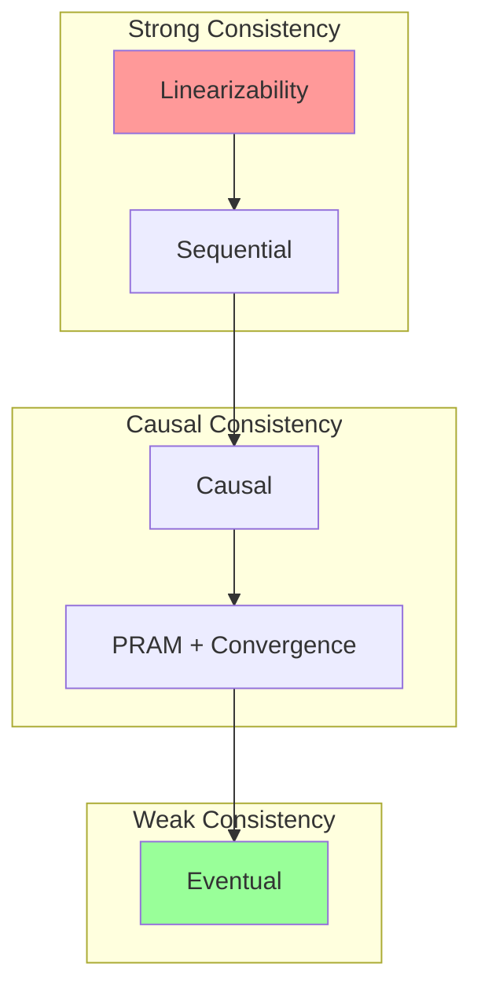
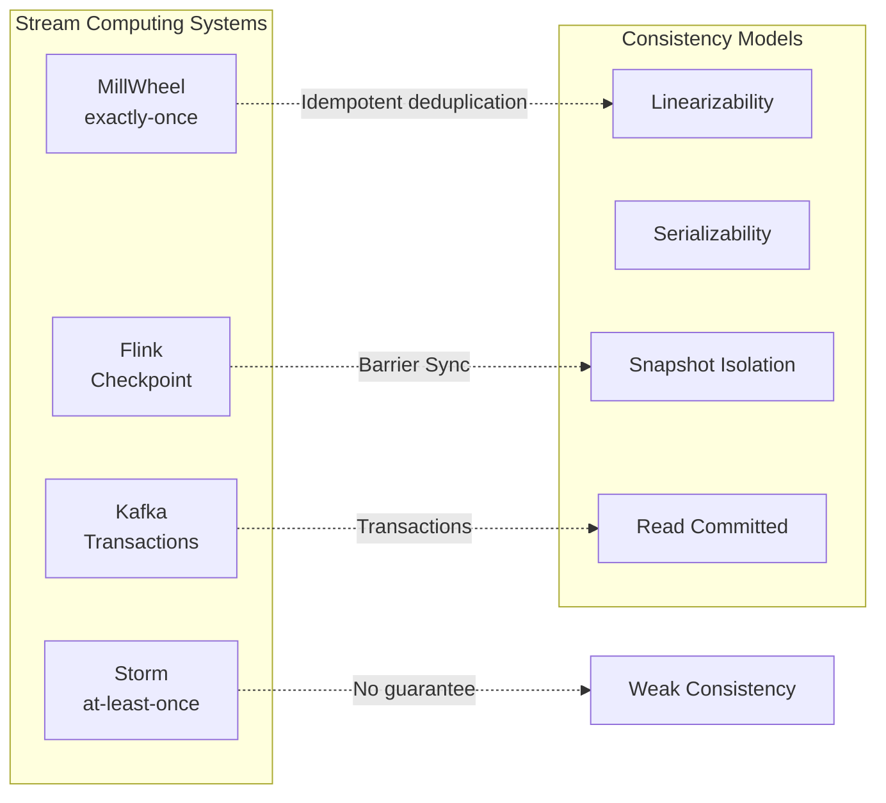

# Exercise 04: Consistency Model Comparison

> Stage: Knowledge | **Prerequisites**: [Consistency Hierarchy](../../Struct/02-properties/02.02-consistency-hierarchy.md), [exercise-01](./exercise-01-process-calculus.md) | **Formalization Level**: L5

---

## Table of Contents

- [Exercise 04: Consistency Model Comparison](#exercise-04-consistency-model-comparison)
  - [Table of Contents](#table-of-contents)
  - [1. Learning Objectives](#1-learning-objectives)
  - [2. Prerequisites](#2-prerequisites)
    - [2.1 Consistency Hierarchy](#21-consistency-hierarchy)
    - [2.2 Formalization Tools](#22-formalization-tools)
  - [3. Exercises](#3-exercises)
    - [3.1 Formal Definitions and Proofs (50 points)](#31-formal-definitions-and-proofs-50-points)
      - [Problem 4.1: Linearizability Definition (10 points)](#problem-41-linearizability-definition-10-points)
      - [Problem 4.2: Stream Computing Consistency Classification (15 points)](#problem-42-stream-computing-consistency-classification-15-points)
      - [Problem 4.3: Happens-Before Relationship Analysis (10 points)](#problem-43-happens-before-relationship-analysis-10-points)
      - [Problem 4.4: Consistency Protocol Comparison (15 points)](#problem-44-consistency-protocol-comparison-15-points)
    - [3.2 Case Analysis and Design (50 points)](#32-case-analysis-and-design-50-points)
      - [Problem 4.5: E-commerce Order System Consistency Design (20 points)](#problem-45-e-commerce-order-system-consistency-design-20-points)
      - [Problem 4.6: Cross-Data-Center Replication Consistency (15 points)](#problem-46-cross-data-center-replication-consistency-15-points)
      - [Problem 4.7: Consistency Model Selection Decision Tree (15 points)](#problem-47-consistency-model-selection-decision-tree-15-points)
  - [4. Answer Key Links](#4-answer-key-links)
  - [5. Grading Criteria](#5-grading-criteria)
    - [Total Score Distribution](#total-score-distribution)
    - [Key Grading Items](#key-grading-items)
  - [6. Advanced Challenge (Bonus)](#6-advanced-challenge-bonus)
  - [7. Reference Resources](#7-reference-resources)
  - [8. Visualizations](#8-visualizations)
    - [Consistency Hierarchy](#consistency-hierarchy)
    - [Stream Computing System Consistency Positioning](#stream-computing-system-consistency-positioning)

---

## 1. Learning Objectives

After completing this exercise, you will be able to:

- **Def-K-04-01**: Formally define multiple consistency models (Linearizability, Sequential Consistency, Causal Consistency, Eventual Consistency)
- **Def-K-04-02**: Analyze consistency guarantee mechanisms in stream computing systems
- **Def-K-04-03**: Use formal methods to prove consistency properties
- **Def-K-04-04**: Trade off consistency and performance in actual system design

---

## 2. Prerequisites

### 2.1 Consistency Hierarchy

```
Linearizability
    ↓ Strictly weaker than
Sequential Consistency
    ↓ Strictly weaker than
Causal Consistency
    ↓ Equivalent
PRAM + Convergence
    ↓ Strictly weaker than
Eventual Consistency
```

### 2.2 Formalization Tools

| Symbol | Meaning |
|--------|---------|
| $op \xrightarrow{hb} op'$ | happens-before relation |
| $op \xrightarrow{vis} op'$ | visibility relation |
| $op \xrightarrow{so} op'$ | session order |
| $ret(op)$ | Return value of operation op |

---

## 3. Exercises

### 3.1 Formal Definitions and Proofs (50 points)

#### Problem 4.1: Linearizability Definition (10 points)

**Difficulty**: L5

**Tasks**:

1. Give the complete formal definition of linearizability (4 points)
2. Represent the following operation history using an Execution Graph, and determine whether it is linearizable (6 points):

```
Process P1: write(x, 1) ────────────────────> read(x) → 2
           │
           ↓ happens-before
Process P2: write(x, 2) ────────────────────> read(x) → 1
           ↑
Time ──────────────────────────────────────────────────>
```

**Hint**: The definition must include real-time order and sequential specification.

---

#### Problem 4.2: Stream Computing Consistency Classification (15 points)

**Difficulty**: L5

Analyze the consistency levels in the following stream computing scenarios:

**Scenario A**: Flink Checkpoint Exactly-Once
**Scenario B**: Kafka Streams at-least-once
**Scenario C**: Storm primitives (at-least-once)
**Scenario D**: Google MillWheel exactly-once

**Tasks**:

1. Map each scenario to a distributed consistency model classification (e.g., Strict Serializability, Serializability, Snapshot Isolation, etc.) (8 points)
2. Explain why Flink's Exactly-Once is not equivalent to Strict Serializability in distributed transactions (4 points)
3. Discuss the similarities and differences between "Exactly-Once" in stream computing and "ACID" in traditional databases (3 points)

---

#### Problem 4.3: Happens-Before Relationship Analysis (10 points)

**Difficulty**: L5

Given a Flink stream processing topology:

```
Source → Map1 → KeyBy → Window → Sink
            ↘ Map2 ↗
```

**Tasks**:

1. Define all implicit happens-before relationships in this topology (5 points)
2. If the Window operator uses Processing Time instead of Event Time, how do the happens-before relationships change? (3 points)
3. How do these relationships affect state consistency? (2 points)

---

#### Problem 4.4: Consistency Protocol Comparison (15 points)

**Difficulty**: L5

Compare the following protocols in stream computing applications:

| Protocol/Algorithm | Core Idea | Stream Computing Application | Pros and Cons |
|--------------------|-----------|------------------------------|---------------|
| Two-Phase Commit | | | |
| Paxos | | | |
| Raft | | | |
| Vector Clocks | | | |
| Version Vectors | | | |

<!-- **Answer Key**: Complete consistency protocol comparison table -->
<!--
| Protocol/Algorithm | Core Idea | Stream Computing Application | Pros and Cons |
|--------------------|-----------|------------------------------|---------------|
| Two-Phase Commit | Prepare phase + Commit phase, coordinator asks all participants, commits only if all agree | Flink Kafka Sink two-phase commit implements Exactly-Once | Pros: simple implementation, guarantees atomicity<br>Cons: blocking protocol, coordinator single point of failure |
| Paxos | Majority resolution, Prepare+Accept two phases, guarantees multi-node agreement on proposal | Used for stream computing metadata management (e.g., JobManager high availability) | Pros: strong fault tolerance, tolerates minority node failures<br>Cons: difficult to understand, complex engineering implementation |
| Raft | Leader election + log replication, decomposes consistency into sub-problems | Kafka replica synchronization, Flink HA configuration storage | Pros: easy to understand and implement<br>Cons: leader bottleneck, write performance limited by leader |
| Vector Clocks | Each node maintains a vector clock, compares vectors to determine event causality | Out-of-order event ordering in stream computing, event time alignment | Pros: accurately captures causality<br>Cons: vector size grows with node count, high overhead |
| Version Vectors | Based on Vector Clocks, used to detect concurrent update conflicts | Stream computing state version management, incremental Checkpoint merging | Pros: can detect concurrent conflicts<br>Cons: conflicts need application-level resolution |
-->

**Tasks**:

1. Complete the table above (10 points)
2. Analyze why Flink Checkpoint uses Barriers rather than Vector Clocks (5 points)

---

### 3.2 Case Analysis and Design (50 points)

#### Problem 4.5: E-commerce Order System Consistency Design (20 points)

**Difficulty**: L5

Design an e-commerce order system that needs to handle:

- Order creation (write to order table)
- Inventory deduction (write to inventory table)
- Payment callback (update order status)
- Logistics notification (write to logistics table)

**Tasks**:

1. Identify causal dependency relationships in the system (at least 3) (6 points)
2. Choose appropriate eventual consistency or strong consistency for different data (6 points)
3. Describe the state transition of order creation using a TLA+-style formal method (8 points)

**Reference Format**:

```
Init ==
    ∧ orderStatus = [i ∈ OrderIDs ↦ "PENDING"]
    ∧ inventory = [i ∈ ProductIDs ↦ 100]
    ∧ ...

CreateOrder(o, p) ==
    ∧ orderStatus[o] = "PENDING"
    ∧ inventory[p] > 0
    ∧ orderStatus' = [orderStatus EXCEPT ![o] = "CREATED"]
    ∧ inventory' = [inventory EXCEPT ![p] = @ - 1]
    ∧ ...
```

---

#### Problem 4.6: Cross-Data-Center Replication Consistency (15 points)

**Difficulty**: L5

**Scenario**: A stream computing system needs to replicate state data across three data centers (Beijing, Shanghai, Guangzhou).

**Tasks**:

1. Design consistency solutions satisfying the following different levels:
   - Plan A: strongest consistency (6 out of 15 points)
   - Plan B: causal consistency (5 out of 15 points)
   - Plan C: eventual consistency (4 out of 15 points)
2. Analyze the network latency overhead of each plan
3. Recommend a plan suitable for stream computing Checkpoint replication

---

#### Problem 4.7: Consistency Model Selection Decision Tree (15 points)

**Difficulty**: L4

**Tasks**:

1. Create a decision tree for consistency model selection, considering factors including:
   - Data freshness requirements (3 points)
   - System availability requirements (3 points)
   - Network partition tolerance (3 points)
   - Conflict resolution complexity (3 points)
   - Performance requirements (3 points)

2. Draw the decision tree using Mermaid
3. Recommend a specific technical implementation for each leaf node in the decision tree

---

## 4. Answer Key Links

| Problem | Answer Location | Supplementary Notes |
|---------|-----------------|---------------------|
| 4.1 | **answers/04-consistency.md** (Answer pending) | Formal definition + diagram |
| 4.2 | **answers/04-consistency.md** (Answer pending) | Consistency mapping table |
| 4.3 | **answers/04-consistency.md** (Answer pending) | happens-before analysis |
| 4.4 | **answers/04-consistency.md** (Answer pending) | Complete protocol comparison table |
| 4.5 | **answers/04-code/OrderSystem.tla** (Code example pending) | TLA+ specification |
| 4.6 | **answers/04-code/GeoReplication.md** (Answer pending) | Design solution |
| 4.7 | **answers/04-code/DecisionTree.md** (Answer pending) | Decision tree |

---

## 5. Grading Criteria

### Total Score Distribution

| Grade | Score Range | Requirements |
|-------|-------------|--------------|
| S | 95-100 | Accurate formal definitions, complete proofs, in-depth design |
| A | 85-94 | Correct conceptual understanding, thorough analysis |
| B | 70-84 | Mastery of main concepts, analysis basically complete |
| C | 60-69 | Basic conceptual understanding |
| F | <60 | Confused concepts, incorrect understanding |

### Key Grading Items

| Problem | Points | Key Grading Points |
|---------|--------|--------------------|
| 4.1 | 10 | Complete formal definition, correct judgment |
| 4.2 | 15 | Accurate consistency mapping |
| 4.5 | 20 | Correct TLA+ specification syntax, reasonable design |
| 4.7 | 15 | Decision tree covers comprehensively |

---

## 6. Advanced Challenge (Bonus)

Complete any one of the following tasks to earn an extra 10 points:

1. **Formal Proof**: Use Coq/Isabelle to prove the linearizability of a simple algorithm
2. **Consistency Testing Tool**: Use Jepsen to test the consistency of a stream computing system
3. **New Consistency Model Proposal**: Design a new consistency model for a specific stream computing scenario and formally define it

---

## 7. Reference Resources


---

## 8. Visualizations

### Consistency Hierarchy



### Stream Computing System Consistency Positioning



---

*Last Updated: 2026-04-02*
