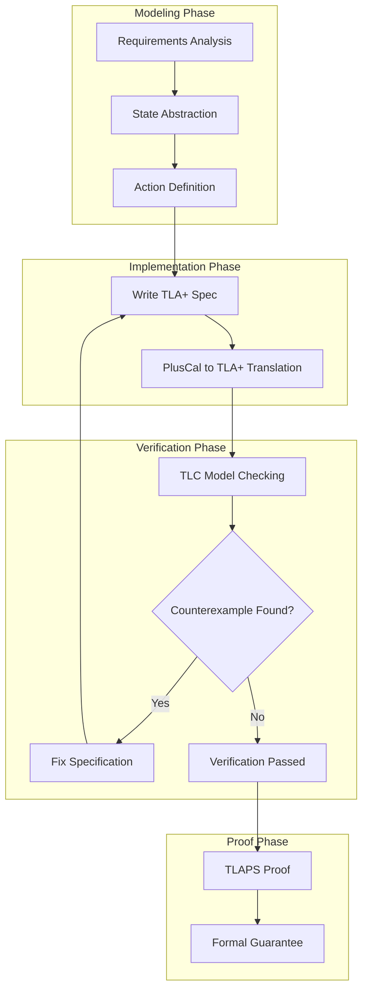

# Exercise 06: TLA+ Practice

> **Stage**: Knowledge | **Prerequisites**: [Consistency Hierarchy](../../Struct/02-properties/02.02-consistency-hierarchy.md), [exercise-04](./exercise-04-consistency-models.md) | **Formality Level**: L5

---

## Table of Contents

- [Exercise 06: TLA+ Practice](#exercise-06-tla-practice)
  - [Table of Contents](#table-of-contents)
  - [1. Learning Objectives](#1-learning-objectives)
  - [2. Prerequisites](#2-prerequisites)
    - [2.1 TLA+ Tool Installation](#21-tla-tool-installation)
    - [2.2 TLA+ Core Syntax](#22-tla-core-syntax)
    - [2.3 PlusCal Syntax (Recommended for Beginners)](#23-pluscal-syntax-recommended-for-beginners)
  - [3. Exercises](#3-exercises)
    - [3.1 Basic Specification Exercises (40 pts)](#31-basic-specification-exercises-40-pts)
      - [Problem 6.1: Simple State Machine (10 pts)](#problem-61-simple-state-machine-10-pts)
      - [Problem 6.2: Distributed Mutual Exclusion (15 pts)](#problem-62-distributed-mutual-exclusion-15-pts)
      - [Problem 6.3: Two-Phase Commit (15 pts)](#problem-63-two-phase-commit-15-pts)
    - [3.2 Stream Processing Modeling (40 pts)](#32-stream-processing-modeling-40-pts)
      - [Problem 6.4: Flink Checkpoint Modeling (20 pts)](#problem-64-flink-checkpoint-modeling-20-pts)
      - [Problem 6.5: Watermark Modeling (10 pts)](#problem-65-watermark-modeling-10-pts)
      - [Problem 6.6: Exactly-Once Semantics Verification (10 pts)](#problem-66-exactly-once-semantics-verification-10-pts)
    - [3.3 Verification and Analysis (20 pts)](#33-verification-and-analysis-20-pts)
      - [Problem 6.7: Deadlock Detection (10 pts)](#problem-67-deadlock-detection-10-pts)
      - [Problem 6.8: Model Checking Report (10 pts)](#problem-68-model-checking-report-10-pts)
  - [4. Answer Reference Links](#4-answer-reference-links)
  - [5. Grading Criteria](#5-grading-criteria)
    - [Total Score Distribution](#total-score-distribution)
    - [Detailed Scoring Rubric](#detailed-scoring-rubric)
  - [6. Advanced Challenges (Bonus)](#6-advanced-challenges-bonus)
  - [7. Reference Resources](#7-reference-resources)
  - [8. Visualizations](#8-visualizations)
    - [TLA+ Development Workflow](#tla-development-workflow)
    - [TLA+ Semantic Layers](#tla-semantic-layers)

## 1. Learning Objectives

After completing this exercise, you will be able to:

- **Def-K-06-01**: Master the basic syntax of the TLA+ specification language
- **Def-K-06-02**: Use TLA+ to model concurrent systems
- **Def-K-06-03**: Use the TLC model checker to verify system properties
- **Def-K-06-04**: Use TLAPS for formal proofs

---

## 2. Prerequisites

### 2.1 TLA+ Tool Installation

```bash
# Method 1: Official Toolbox
download: https://lamport.azurewebsites.net/tla/toolbox.html

# Method 2: VS Code + TLA+ Extension
# Install extension: TLA+ Nightly

# Method 3: Command Line (Community Modules)
# Java 11+ environment required
```

### 2.2 TLA+ Core Syntax

| Symbol | Meaning | Example |
|--------|---------|---------|
| `==` | Definition | `Foo == x + 1` |
| `/\` | Logical AND | `P /\ Q` |
| `\/` | Logical OR | `P \/ Q` |
| `~` | Logical NOT | `~P` |
| `=>` | Implication | `P => Q` |
| `<=>` | Equivalence | `P <=> Q` |
| `\A` | Universal quantifier | `\A x \in S : P(x)` |
| `\E` | Existential quantifier | `\E x \in S : P(x)` |
| `CHOOSE` | Choice | `CHOOSE x \in S : P(x)` |
| `'` | Next-state | `x' = x + 1` |
| `[]` | Always (Box) | `[]P` |
| `<>` | Eventually (Diamond) | `<>P` |
| `~>` | Leads-to | `P ~> Q` |

### 2.3 PlusCal Syntax (Recommended for Beginners)

```pluscal
--algorithm MyAlgorithm
variables x = 0, y = 0;

begin
    A:
        x := x + 1;
    B:
        y := y + 1;
end algorithm
```

---

## 3. Exercises

### 3.1 Basic Specification Exercises (40 pts)

#### Problem 6.1: Simple State Machine (10 pts)

**Difficulty**: L4

Model a simple traffic light controller in TLA+.

**Requirements**:

- Three states: Red, Yellow, Green
- Transitions: Red → Green → Yellow → Red
- Each state lasts at least one cycle
- Verify: The system is never in multiple states simultaneously

**Tasks**:

1. Write the TLA+ specification (6 pts)
2. Use TLC to verify the Safety property (4 pts)

**Reference Template**:

```tla
---- MODULE TrafficLight ----
EXTENDS Naturals

VARIABLES state

States == {"Red", "Yellow", "Green"}

Init == state = "Red"

Next ==
    \/ state = "Red" /\ state' = "Green"
    \/ state = "Green" /\ state' = "Yellow"
    \/ state = "Yellow" /\ state' = "Red"

Spec == Init /\ [][Next]_state
====
```

---

#### Problem 6.2: Distributed Mutual Exclusion (15 pts)

**Difficulty**: L5

Use TLA+ to model two processes mutually exclusively accessing a critical section.

**Requirements**:

- Two processes P1, P2
- Each process has states: NonCritical, Trying, Critical
- Use shared variables to implement mutual exclusion
- Verify: Safety (never enter critical section simultaneously) and Liveness (requests are eventually satisfied)

**Tasks**:

1. Write the TLA+ specification (PlusCal is acceptable) (8 pts)
2. Define and verify the Safety property (4 pts)
3. Define and verify the Liveness property (3 pts)

**Reference Template**:

```pluscal
--algorithm MutualExclusion
variables flag = [i \in {1, 2} |-> FALSE];

process Proc \in {1, 2}
variable other;
begin
    Start:
        other := 3 - self;
    Try:
        flag[self] := TRUE;
    Check:
        await ~flag[other];
    Critical:
        skip;
    Exit:
        flag[self] := FALSE;
    goto Start;
end process;
end algorithm
```

---

#### Problem 6.3: Two-Phase Commit (15 pts)

**Difficulty**: L5

Model the Two-Phase Commit protocol in TLA+.

**System Components**:

- One Coordinator
- Multiple Participants

**Protocol Flow**:

1. Coordinator sends Prepare to all Participants
2. Each Participant decides Vote Yes/No
3. Coordinator collects all Votes
4. If all Yes, send Commit; otherwise send Abort
5. Participants execute commit or rollback

**Tasks**:

1. Write the complete TLA+ specification (8 pts)
2. Verify: If Coordinator decides Commit, all Participants eventually commit (4 pts)
3. Analyze Coordinator crash scenarios (3 pts)

---

### 3.2 Stream Processing Modeling (40 pts)

#### Problem 6.4: Flink Checkpoint Modeling (20 pts)

**Difficulty**: L5

Use TLA+ to model the core mechanism of Flink Checkpoint.

**Modeling Points**:

- One Source, one Sink, one Operator
- Checkpoint Coordinator triggers Barrier
- Barrier propagates through the stream
- Each operator snapshots its state
- Completion or timeout handling

**Tasks**:

1. Define system state variables (5 pts)
2. Define Checkpoint start action (5 pts)
3. Define Barrier propagation and snapshot actions (5 pts)
4. Verify: If Checkpoint completes, all operator states are consistent (5 pts)

**Reference Structure**:

```tla
---- MODULE FlinkCheckpoint ----
EXTENDS Naturals, Sequences, FiniteSets

CONSTANTS Operators, MaxAttempts

VARIABLES
    checkpointId,
    operatorStates,
    barriersInFlight,
    coordinatorState

Init ==
    /\ checkpointId = 0
    /\ operatorStates = [op \in Operators |-> "IDLE"]
    /\ barriersInFlight = << >>
    /\ coordinatorState = "IDLE"

TriggerCheckpoint ==
    /\ coordinatorState = "IDLE"
    /\ checkpointId' = checkpointId + 1
    /\ coordinatorState' = "IN_PROGRESS"
    /\ barriersInFlight' = Append(barriersInFlight, checkpointId')
    /\ UNCHANGED operatorStates

ReceiveBarrier(op) ==
    /\ operatorStates[op] = "IDLE"
    /\ Len(barriersInFlight) > 0
    /\ barriersInFlight[1] > 0
    /\ operatorStates' = [operatorStates EXCEPT ![op] = "SNAPSHOTTING"]
    /\ UNCHANGED <<checkpointId, barriersInFlight, coordinatorState>>

(* Other action definitions... *)

CompleteCheckpoint ==
    /\ \A op \in Operators : operatorStates[op] = "SNAPSHOTTED"
    /\ coordinatorState' = "IDLE"
    /\ operatorStates' = [op \in Operators |-> "IDLE"]
    /\ UNCHANGED <<checkpointId, barriersInFlight>>

Next ==
    \/ TriggerCheckpoint
    \/ \E op \in Operators : ReceiveBarrier(op)
    \/ \E op \in Operators : CompleteSnapshot(op)
    \/ CompleteCheckpoint

Spec == Init /\ [][Next]_vars
====
```

---

#### Problem 6.5: Watermark Modeling (10 pts)

**Difficulty**: L5

Use TLA+ to model the Flink Watermark mechanism.

**Requirements**:

- Model event time and Watermark progression
- Handle out-of-order events
- Verify: Watermark is monotonically non-decreasing

**Tasks**:

1. Define event stream and Watermark variables (3 pts)
2. Define event processing and Watermark generation actions (4 pts)
3. Verify Watermark properties (3 pts)

---

#### Problem 6.6: Exactly-Once Semantics Verification (10 pts)

**Difficulty**: L5

Use TLA+ to model and verify Exactly-Once semantics in stream processing.

**Requirements**:

- Model Source, Operator, Sink
- Include failures and recovery
- Define Exactly-Once property

**Tasks**:

1. Define system state (including input, output, and internal state) (3 pts)
2. Define failure and recovery actions (3 pts)
3. Formally define the Exactly-Once property and verify it (4 pts)

---

### 3.3 Verification and Analysis (20 pts)

#### Problem 6.7: Deadlock Detection (10 pts)

**Difficulty**: L4

Use TLA+ to detect deadlocks in the Dining Philosophers problem.

**Tasks**:

1. Model the 5-philosopher problem in PlusCal (4 pts)
2. Define deadlock detection conditions (3 pts)
3. Run TLC verification and show the deadlock state (3 pts)

---

#### Problem 6.8: Model Checking Report (10 pts)

**Difficulty**: L4

Choose any of the above models and complete the following analysis:

1. State space size estimation (2 pts)
2. TLC runtime and memory usage (2 pts)
3. Discovered counterexamples (if any) (3 pts)
4. Application of symmetry reduction (if applicable) (3 pts)

---

## 4. Answer Reference Links

| Problem | Answer Location | Supplementary Notes |
|---------|-----------------|---------------------|
| 6.1 | **answers/06-tla/TrafficLight.tla** (code example to be added) | Complete specification |
| 6.2 | **answers/06-tla/MutualExclusion.tla** (code example to be added) | Includes Liveness |
| 6.3 | **answers/06-tla/TwoPhaseCommit.tla** (code example to be added) | Full 2PC implementation |
| 6.4 | **answers/06-tla/FlinkCheckpoint.tla** (code example to be added) | Checkpoint modeling |
| 6.5 | **answers/06-tla/Watermark.tla** (code example to be added) | Watermark mechanism |
| 6.6 | **answers/06-tla/ExactlyOnce.tla** (code example to be added) | EOS verification |
| 6.7 | **answers/06-tla/DiningPhilosophers.tla** (code example to be added) | Deadlock detection |
| 6.8 | **answers/06-tla/ModelCheckingReport.md** (answer to be added) | Report template |

---

## 5. Grading Criteria

### Total Score Distribution

| Grade | Score Range | Requirement |
|-------|-------------|-------------|
| S | 95-100 | All specifications syntactically correct, verification passed, with innovation |
| A | 85-94 | Main specifications correct, verification basically passed |
| B | 70-84 | Minor errors in specifications, main verifications passed |
| C | 60-69 | Specifications basically runnable |
| F | <60 | Many syntactic errors in specifications |

### Detailed Scoring Rubric

| Problem | Points | Key Grading Points |
|---------|--------|--------------------|
| 6.1 | 10 | State machine correct, TLC verification passed |
| 6.2 | 15 | Mutual exclusion correct, Liveness definition complete |
| 6.3 | 15 | 2PC protocol complete, crash scenario analysis |
| 6.4 | 20 | Checkpoint mechanism modeled accurately |
| 6.5 | 10 | Watermark properties correct |
| 6.6 | 10 | Exactly-Once formalization accurate |
| 6.7 | 10 | Deadlock detection correct |
| 6.8 | 10 | Report complete, data analysis solid |

---

## 6. Advanced Challenges (Bonus)

Complete any one of the following tasks for an extra 10 points:

1. **TLAPS Proof**: Use TLAPS to complete a formal proof of MutualExclusion
2. **Refinements**: Define an abstract specification and a concrete specification, and prove the refinement relation
3. **Distributed Consensus**: Model the core of Raft or Paxos protocol in TLA+

---

## 7. Reference Resources


---

## 8. Visualizations

### TLA+ Development Workflow



### TLA+ Semantic Layers

```mermaid
graph TB
    subgraph "Temporal Logic"
        T1[Behavioral Properties]
        T2[Safety: []P]
        T3[Liveness: <>P]
        T4[Fairness]
    end

    subgraph "Action Logic"
        A1[State Transitions]
        A2[Next Relation]
        A3[UNCHANGED]
    end

    subgraph "Data Logic"
        D1[Set Theory]
        D2[Functions / Sequences]
        D3[Module System]
    end

    D1 --> A1 --> T1
    D2 --> A2 --> T2
    D3 --> A3 --> T3
    T2 --> T4
```

---

*Last Updated: 2026-04-02*
