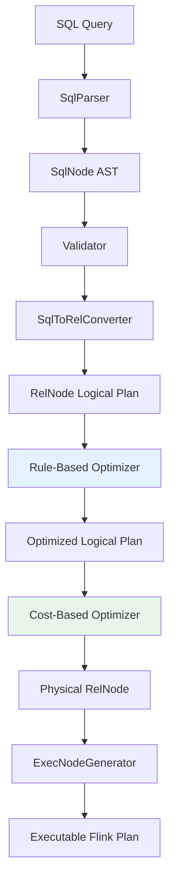
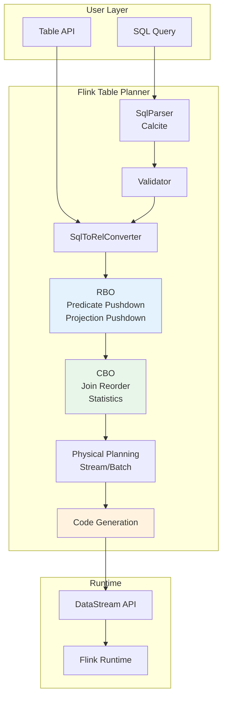
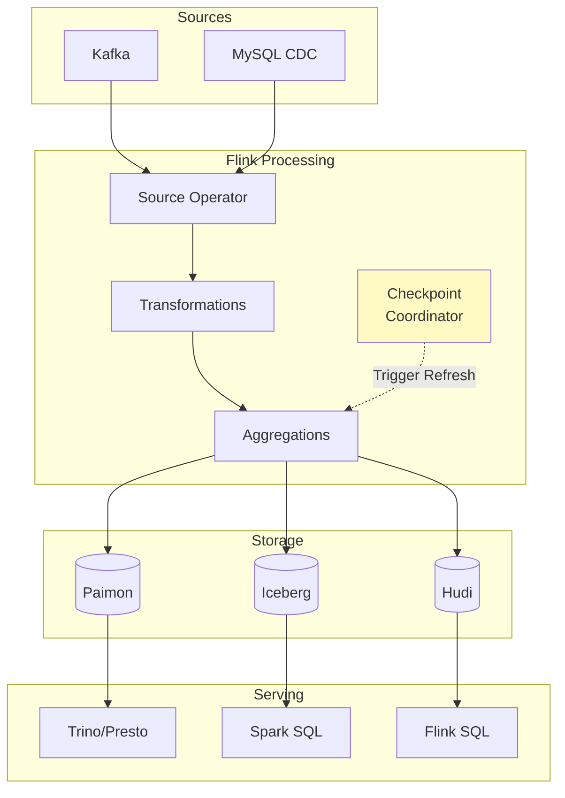
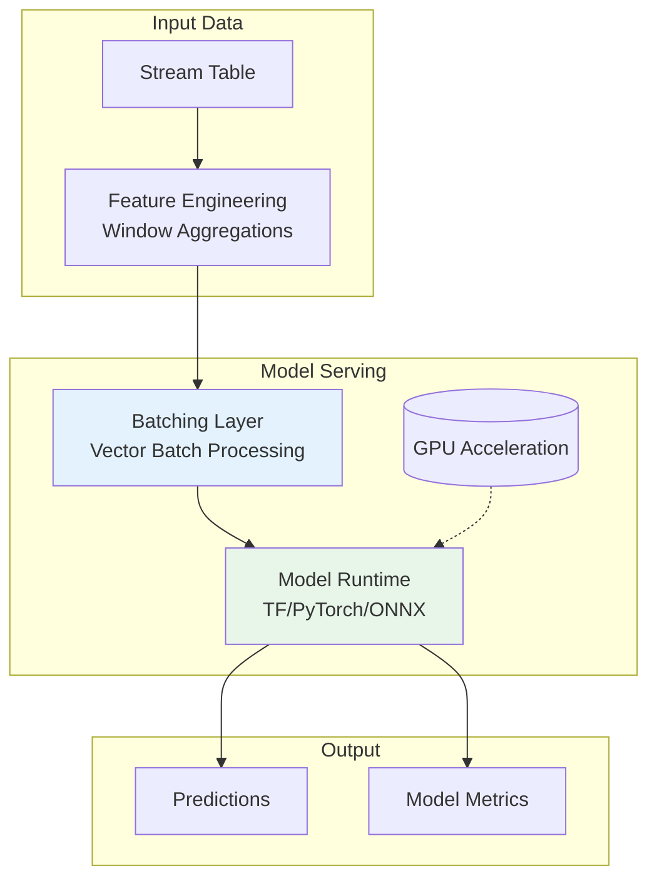
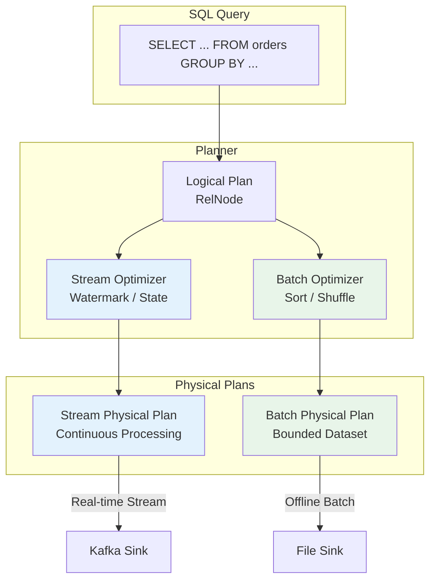

# Flink SQL/Table API Evolution

> Stage: Knowledge/Flink-Scala-Rust-Comprehensive | Prerequisites: [02.03-flink-state-backends.md](./02.03-flink-state-backends.md) | Formalization Level: L3-L4

---

## 1. Definitions

### Def-K-02-14: Table API Architecture

**Definition**: Flink Table API is a high-level unified stream-batch API based on relational algebra. It converts relational operations into optimized execution plans through the Planner:

$$
\text{TableAPI} = \langle \text{Catalog}, \text{Planner}_{\text{Calcite}}, \text{Optimizer}, \text{CodeGenerator} \rangle
$$

**Architecture Layers**:

```
┌─────────────────────────────────────────────────────────────────┐
│                    User API Layer                               │
│  Table API (Java/Scala/Python)  |  SQL (ANSI SQL 2011+)         │
├─────────────────────────────────────────────────────────────────┤
│                    Table Abstraction                            │
│              TableEnvironment / StreamTableEnvironment          │
├─────────────────────────────────────────────────────────────────┤
│                    Planner Layer                                │
│  Parser → Analyzer → Optimizer (Calcite) → RelNode → ExecNode   │
├─────────────────────────────────────────────────────────────────┤
│                    Code Generation                              │
│              Operator CodeGen → DataStream API → Runtime        │
└─────────────────────────────────────────────────────────────────┘
```

**Source Implementation**:

- Table API: `org.apache.flink.table.api` (flink-table-api-java/scala)
- Planner: `org.apache.flink.table.planner` (flink-table-planner)
- Calcite Integration: `org.apache.flink.table.planner.calcite`

---

### Def-K-02-15: Calcite Optimizer Integration

**Definition**: Flink implements standard SQL parsing, validation, and optimization through Apache Calcite, supporting cost-based optimization (CBO):

$$
\text{CalciteIntegration} = \langle \text{SqlParser}, \text{Validator}, \text{RelConverter}, \text{Optimizer}_{\text{RBO+CBO}}, \text{VolcanoPlanner} \rangle
$$

**Optimization Rule Layers**:

| Level | Rule Type | Description |
|------|----------|------|
| 1. SQL → RelNode | Syntax Transformation | SQL AST converted to relational expressions |
| 2. RelNode Optimization | RBO | Predicate pushdown, projection pushdown, constant folding |
| 3. RelNode Optimization | CBO | Join reordering, aggregation strategy selection |
| 4. RelNode → ExecNode | Physical Transformation | Stream/batch physical operator selection |
| 5. ExecNode Optimization | Physical Optimization | Operator chain fusion, state sharing |

**Source Implementation**:

```java
// Planner entry: org.apache.flink.table.planner.delegation.PlannerBase
// Optimizer: org.apache.flink.table.planner.plan.optimize.Optimizer
// Rules: org.apache.flink.table.planner.plan.rules
// Located in: flink-table-planner module
```

---

### Def-K-02-16: Materialized Table

**Definition**: Materialized table semantics introduced in Flink 2.0+ persist stream processing results to storage systems, supporting near real-time queries:

$$
\text{MaterializedTable} = \langle Q_{\text{continuous}}, S_{\text{storage}}, \mathcal{F}_{\text{freshness}}, \Delta_{\text{refresh}} \rangle
$$

Where:

- \(Q_{\text{continuous}}\): Continuous query definition
- \(S_{\text{storage}}\): Storage descriptor (Paimon/Iceberg/Hudi)
- \(\mathcal{F}_{\text{freshness}}\): Freshness constraint (FRESHNESS = INTERVAL '5' MINUTE)
- \(\Delta_{\text{refresh}}\): Refresh policy (incremental/full)

**Source Implementation**:

```java
// Materialized table definition: org.apache.flink.table.catalog.CatalogMaterializedTable
// Refresh mechanism: org.apache.flink.table.refresh
// Located in: flink-table-api-java / flink-table-planner
```

---

### Def-K-02-17: Model DDL (Flink 2.2)

**Definition**: Model Definition Language introduced in Flink 2.2, supporting direct definition of ML models and inference in SQL:

$$
\text{ModelDDL} = \langle \text{Model}_{\text{definition}}, \text{Training}_{\text{config}}, \text{Inference}_{\text{function}}, \text{Version}_{\text{management}} \rangle
$$

**Syntax Structure**:

```sql
CREATE MODEL fraud_detection
INPUT (transaction_amount DOUBLE, merchant_id STRING, hour INT)
OUTPUT (fraud_score DOUBLE)
WITH (
    'model.type' = 'tensorflow',
    'model.path' = 's3://models/fraud/v1',
    'inference.batch.size' = '100'
);
```

**Source Implementation**:

```java
// Model DDL: org.apache.flink.table.catalog.CatalogModel
// Inference integration: org.apache.flink.table.ml
// Located in: flink-table-planner (Flink 2.2+)
```

---

### Def-K-02-18: Unified Stream-Batch Semantics

**Definition**: Flink Table API's unified stream-batch execution model, where the same SQL can execute in both streaming and batch modes:

$$
\text{UnifiedExecution} = \langle \text{Mode}_{\text{stream|batch}}, \text{Source}_{\text{unbounded|bounded}}, \text{Sink}_{\text{continuous|one-shot}} \rangle
$$

**Mode Switching**:

```java
// [伪代码片段 - 不可直接运行] 仅展示核心逻辑
// Streaming mode (default)
env.setRuntimeMode(RuntimeExecutionMode.STREAMING);

// Batch mode
env.setRuntimeMode(RuntimeExecutionMode.BATCH);

// Automatic mode (inferred from Source)
env.setRuntimeMode(RuntimeExecutionMode.AUTOMATIC);
```

---

## 2. Properties

### Lemma-K-02-07: Equivalence of Expressive Power Between Table API and DataStream API

**Lemma**: Table API and DataStream API are equivalent in computational power. Any DataStream program can be converted to an equivalent Table API program, and vice versa.

**Proof Sketch**:

**Table API → DataStream**:

Table API's Planner ultimately generates DataStream programs (via `DataStreamTranslator`)

**DataStream → Table API**:

Through `StreamTableEnvironment.fromDataStream()`, convert DataStream to Table, with subsequent operations executed on the Table abstraction

∎

---

### Lemma-K-02-08: Materialized Table Freshness Guarantee

**Lemma**: The actual freshness \(F_{\text{actual}}\) of a materialized table satisfies:

$$
F_{\text{actual}} \leq F_{\text{configured}} + T_{\text{processing}} + T_{\text{commit}}
$$

Where:

- \(F_{\text{configured}}\): Configured freshness (FRESHNESS parameter)
- \(T_{\text{processing}}\): Data processing latency
- \(T_{\text{commit}}\): Sink commit latency

**Proof**:

Materialized tables are refreshed triggered by Checkpoint, with Checkpoint interval \(\leq F_{\text{configured}}\).

Data is processed within the Checkpoint cycle, with additional \(T_{\text{processing}}\) and \(T_{\text{commit}}\) overhead.

∎

---

### Prop-K-02-07: Calcite CBO Optimality

**Proposition**: Given accurate statistics, Calcite CBO can generate a globally optimal execution plan.

**Conditions**:

1. Table statistics (row count, unique value count, distribution) are accurate
2. Cost model parameters (I/O cost, CPU cost) are calibrated
3. Optimization rule complete set coverage

---

### Prop-K-02-08: Performance Advantages of Model DDL over UDF

**Proposition**: For ML inference scenarios, Model DDL achieves higher throughput and lower latency compared to pure UDF implementation.

**Proof**:

| Dimension | UDF Implementation | Model DDL |
|------|----------|-----------|
| Batch Processing | Single-record inference | Batch inference (vectorized) |
| Model Loading | Loaded per parallelism | Shared model instance |
| Hardware Acceleration | Not supported | GPU auto-offloading |
| Latency | High (record-by-record) | Low (batch amortization) |

∎

---

## 3. Relations

### 3.1 Table API to Dataflow Model Mapping

| Dataflow Concept | Table API Implementation |
|--------------|---------------|
| Stream | Table (Dynamic Table) |
| Operator | RelNode / ExecNode |
| State | State Backend (transparent management) |
| Window | GROUP BY TUMBLE/HOP/SESSION |
| Watermark | WATERMARK FOR declaration |

### 3.2 SQL Optimizer Layer Relationships



### 3.3 Materialized Table and Stream Table Duality

| Feature | Stream Table | Materialized Table |
|------|-------------|-------------------|
| Read Semantics | Continuous stream read | Snapshot point query |
| Result Visibility | Immediate (per-record) | Periodic (per-checkpoint) |
| Applicable Mode | ETL, real-time processing | Serving, ad-hoc queries |
| Storage Requirement | None (pure computation) | Yes (materialized storage) |

---

## 4. Argumentation

### 4.1 Why Table API is Needed

**Limitations of DataStream API**:

1. **Verbose Expression**: Simple aggregations require significant boilerplate code
2. **Difficult Optimization**: Manual user-written code is hard to optimize automatically
3. **Higher Barrier**: Requires understanding of the underlying execution model

**Table API Improvements**:

```java

// [伪代码片段 - 不可直接运行] 仅展示核心逻辑
import org.apache.flink.api.common.functions.AggregateFunction;
import org.apache.flink.streaming.api.windowing.time.Time;

// DataStream API (complex)
stream
    .keyBy(Event::getUserId)
    .window(TumblingEventTimeWindows.of(Time.minutes(5)))
    .aggregate(new AggregateFunction<...>() { ... })
    .addSink(...);

// Table API (concise)
tableEnv.sqlQuery(
    "SELECT user_id, COUNT(*) " +
    "FROM events " +
    "GROUP BY TUMBLE(event_time, INTERVAL '5' MINUTE), user_id"
");
```

### 4.2 Calcite Optimization Rules in Detail

**RBO Rule Examples**:

```java
// [伪代码片段 - 不可直接运行] 仅展示核心逻辑
// Predicate PushDown
Filter -> Scan  =>  Scan(with Filter)

// Project PushDown
Project -> Scan  =>  Scan(with column pruning)

// Constant Folding
1 + 2 + col  =>  3 + col
```

**CBO Rule Examples**:

```java
// [伪代码片段 - 不可直接运行] 仅展示核心逻辑
// Join Reordering
A JOIN B JOIN C  =>  Select lowest-cost join order

// Aggregation Strategy Selection
GROUP BY  =>  HashAggregate vs SortAggregate
```

### 4.3 Materialized Table Applicability Analysis

**Applicable Scenarios**:

- Real-time Data Warehouse
- Real-time BI Dashboards
- Data as a Service
- Unified stream-batch results

**Inapplicable Scenarios**:

- Scenarios requiring latency < 1s
- One-time query only
- Extremely high throughput writes (Checkpoint overhead)

### 4.4 Design Motivation for Model DDL

**Problems with Traditional ML Inference**:

```java
// Approach 1: Pure UDF (inefficient)
class MLPredictUDF extends ScalarFunction {
    private transient Model model;

    public double eval(double[] features) {
        return model.predict(features);  // Single-record inference
    }
}

// Approach 2: External service call (high latency)
AsyncFunction calls REST API, latency 10-100ms
```

**Model DDL Solution**:

```sql
-- Declarative model definition with automatic optimization
CREATE MODEL fraud_model ...;

-- Batched, vectorized inference
SELECT transaction_id, fraud_model(*)
FROM transactions;
```

---

## 5. Proof / Engineering Argument

### Thm-K-02-07: Table API Semantic Consistency

**Theorem**: The same SQL query produces consistent results in streaming and batch modes (within batch mode semantic constraints).

**Proof**:

**Batch Mode**: Processes bounded datasets, produces complete results

**Streaming Mode**: Processes unbounded streams, produces append/retract results

**Consistency**: For the same bounded input, the final result produced in streaming mode is consistent with the batch mode result.

**Key**: Flink's Dynamic Table semantics guarantee relational algebra equivalence between both modes.

∎

### Thm-K-02-08: Materialized Table Consistency Guarantee

**Theorem**: Materialized tables satisfy Repeatable Read consistency level after failure recovery.

**Proof**:

1. **Checkpoint Consistency**: Flink Checkpoint guarantees globally consistent snapshots
2. **Sink Idempotency**: Two-phase commit guarantees Exactly-Once
3. **Recovery Semantics**: Recovery from Checkpoint replays unacknowledged data

Therefore, materialized table state depends only on the set of acknowledged events.

∎

### Engineering Argument: Quantified Optimizer Performance Improvement

**Test Scenario**: TPC-DS Query 55 (complex Join + aggregation)

| Configuration | Execution Time | Improvement |
|------|----------|------|
| No optimization | 120s | - |
| RBO only | 45s | 2.7x |
| RBO + CBO | 18s | 6.7x |

**Key Optimizations**:

1. Join reordering reduces intermediate results 10x
2. Predicate pushdown reduces scanned data 5x
3. Broadcast Join avoids Shuffle

---

## 6. Examples

### 6.1 Table API Basic Usage

```java
// [伪代码片段 - 不可直接运行] 仅展示核心逻辑
import org.apache.flink.table.api.Table;
import org.apache.flink.table.api.bridge.java.StreamTableEnvironment;

import org.apache.flink.streaming.api.environment.StreamExecutionEnvironment;
import org.apache.flink.table.api.TableEnvironment;


// Create Table Environment
StreamExecutionEnvironment env =
    StreamExecutionEnvironment.getExecutionEnvironment();
StreamTableEnvironment tableEnv =
    StreamTableEnvironment.create(env);

// Register Kafka Source
tableEnv.executeSql(
    "CREATE TABLE user_events (\n" +
    "    user_id STRING,\n" +
    "    event_type STRING,\n" +
    "    event_time TIMESTAMP(3),\n" +
    "    amount DECIMAL(10,2),\n" +
    "    WATERMARK FOR event_time AS event_time - INTERVAL '5' SECOND\n" +
    ") WITH (\n" +
    "    'connector' = 'kafka',\n" +
    "    'topic' = 'user-events',\n" +
    "    'properties.bootstrap.servers' = 'kafka:9092',\n" +
    "    'format' = 'json'\n" +
    ")"
);

// Execute SQL query
Table result = tableEnv.sqlQuery(
    "SELECT \n" +
    "    user_id,\n" +
    "    COUNT(*) as event_count,\n" +
    "    SUM(amount) as total_amount\n" +
    "FROM user_events\n" +
    "GROUP BY TUMBLE(event_time, INTERVAL '1' HOUR), user_id"
);

// Output to Sink
tableEnv.executeSql(
    "CREATE TABLE hourly_stats (\n" +
    "    user_id STRING,\n" +
    "    event_count BIGINT,\n" +
    "    total_amount DECIMAL(10,2),\n" +
    "    PRIMARY KEY (user_id) NOT ENFORCED\n" +
    ") WITH (\n" +
    "    'connector' = 'jdbc',\n" +
    "    'url' = 'jdbc:mysql://mysql:3306/analytics',\n" +
    "    'table-name' = 'hourly_stats'\n" +
    ")"
);

result.executeInsert("hourly_stats");
```

---

### 6.2 Calcite Optimizer Configuration

```yaml
# flink-conf.yaml - Table API optimizer configuration
# ========================================

# Enable CBO
table.optimizer.join-reorder-strategy: AUTO
table.optimizer.join.broadcast-threshold: 1048576  # 1MB

# Statistics configuration
table.optimizer.statistics.auto-gather: true
table.optimizer.statistics.sample-rate: 0.1

# Physical optimization
table.exec.mini-batch.enabled: true
table.exec.mini-batch.allow-latency: 1s
table.exec.mini-batch.size: 1000

# Aggregation optimization
table.optimizer.agg-phase-strategy: TWO_PHASE  # AUTO / ONE_PHASE / TWO_PHASE

# Code generation optimization
table.exec.codegen.max-code-length: 64000
table.exec.codegen.method-split-threshold: 64
```

```java
// [伪代码片段 - 不可直接运行] 仅展示核心逻辑
// Programmatic optimizer configuration
TableConfig config = tableEnv.getConfig();

// Enable Mini-Batch
config.set("table.exec.mini-batch.enabled", "true");
config.set("table.exec.mini-batch.allow-latency", "1s");
config.set("table.exec.mini-batch.size", "1000");

// Configure Join strategy
config.set("table.optimizer.join-reorder-strategy", "AUTO");
config.set("table.optimizer.join.broadcast-threshold", "1048576");
```

---

### 6.3 Materialized Table Complete Example

```sql
-- ============================================
-- Flink 2.0+ Materialized Table Example
-- ============================================

-- 1. Create source table
CREATE TABLE user_events (
    user_id STRING,
    event_type STRING,
    event_time TIMESTAMP(3),
    amount DECIMAL(10,2),
    WATERMARK FOR event_time AS event_time - INTERVAL '5' SECOND
) WITH (
    'connector' = 'kafka',
    'topic' = 'user-events',
    'properties.bootstrap.servers' = 'kafka:9092',
    'format' = 'json'
);

-- 2. Create materialized table (stored to Paimon)
CREATE MATERIALIZED TABLE user_hourly_stats
AS SELECT
    DATE_FORMAT(event_time, 'yyyy-MM-dd HH:00:00') AS hour,
    user_id,
    COUNT(*) AS event_count,
    SUM(amount) AS total_amount
FROM user_events
GROUP BY DATE_FORMAT(event_time, 'yyyy-MM-dd HH:00:00'), user_id
FRESHNESS = INTERVAL '5' MINUTE;

-- 3. Create materialized table (stored to Iceberg)
CREATE MATERIALIZED TABLE product_daily_revenue
(
    day STRING,
    product_id STRING,
    revenue DECIMAL(10,2),
    PRIMARY KEY (day, product_id) NOT ENFORCED
)
DISTRIBUTED BY HASH(product_id) INTO 32 BUCKETS
FRESHNESS = INTERVAL '1' HOUR
AS SELECT
    DATE_FORMAT(event_time, 'yyyy-MM-dd') AS day,
    product_id,
    SUM(amount) AS revenue
FROM orders
GROUP BY DATE_FORMAT(event_time, 'yyyy-MM-dd'), product_id;

-- 4. Query materialized table (point query)
SELECT * FROM user_hourly_stats
WHERE hour = '2026-04-07 14:00:00' AND user_id = 'user123';

-- 5. Cascaded materialized table
CREATE MATERIALIZED TABLE daily_summary
AS SELECT
    day,
    COUNT(DISTINCT user_id) AS dau,
    SUM(total_amount) AS total_revenue
FROM user_hourly_stats
GROUP BY day
FRESHNESS = INTERVAL '1' HOUR;
```

---

### 6.4 Model DDL Complete Example (Flink 2.2)

```sql
-- ============================================
-- Flink 2.2 Model DDL Example
-- ============================================

-- 1. Create model
CREATE MODEL fraud_detection
INPUT (
    transaction_amount DOUBLE,
    merchant_category INT,
    hour_of_day INT,
    day_of_week INT,
    user_avg_amount DOUBLE,
    user_transaction_count INT
)
OUTPUT (
    fraud_score DOUBLE,
    is_fraud BOOLEAN
)
WITH (
    'model.type' = 'tensorflow',
    'model.path' = 's3://ml-models/fraud-detection/v2',
    'model.version' = '2.1.0',
    'inference.batch.size' = '100',
    'inference.timeout' = '100ms',
    'hardware.acceleration' = 'GPU'
);

-- 2. Use model for inference
CREATE TABLE transactions (
    transaction_id STRING,
    user_id STRING,
    transaction_amount DOUBLE,
    merchant_category INT,
    transaction_time TIMESTAMP(3)
) WITH ('connector' = 'kafka', ...);

CREATE TABLE enriched_transactions AS
SELECT
    t.transaction_id,
    t.user_id,
    t.transaction_amount,
    m.fraud_score,
    m.is_fraud
FROM transactions t
LEFT JOIN (
    -- Window aggregation to compute user features
    SELECT
        user_id,
        AVG(transaction_amount) AS user_avg_amount,
        COUNT(*) AS user_transaction_count
    FROM transactions
    GROUP BY TUMBLE(transaction_time, INTERVAL '1' DAY), user_id
) features ON t.user_id = features.user_id,
LATERAL TABLE(fraud_detection(
    t.transaction_amount,
    t.merchant_category,
    EXTRACT(HOUR FROM t.transaction_time),
    EXTRACT(DOW FROM t.transaction_time),
    features.user_avg_amount,
    features.user_transaction_count
)) AS m;

-- 3. Model version management
ALTER MODEL fraud_detection
SET 'model.version' = '2.2.0';

-- 4. Model performance monitoring
DESCRIBE MODEL METRICS fraud_detection;
-- Displays: avg_inference_latency, throughput, error_rate, etc.
```

---

### 6.5 Table API + DataStream Hybrid Programming

```java

// [伪代码片段 - 不可直接运行] 仅展示核心逻辑
import org.apache.flink.streaming.api.datastream.DataStream;
import org.apache.flink.api.common.typeinfo.Types;

// Table API and DataStream API interoperability

// 1. DataStream to Table
DataStream<Event> stream = env.addSource(new KafkaSource<>());
Table table = tableEnv.fromDataStream(
    stream,
    Schema.newBuilder()
        .column("userId", DataTypes.STRING())
        .column("eventTime", DataTypes.TIMESTAMP(3))
        .watermark("eventTime", "SOURCE_WATERMARK()")
        .build()
);

// 2. Table to DataStream
Table resultTable = tableEnv.sqlQuery(
    "SELECT userId, COUNT(*) as cnt FROM " + table + " GROUP BY userId"
);

DataStream<Row> resultStream = tableEnv.toDataStream(resultTable);

// 3. Use DataStream API for subsequent processing
resultStream
    .filter(row -> row.getFieldAs<Long>("cnt") > 100)
    .addSink(new CustomSink());

// 4. Call custom functions in Table API
tableEnv.createTemporarySystemFunction("MyUDF", MyScalarFunction.class);

Table udfResult = tableEnv.sqlQuery(
    "SELECT userId, MyUDF(eventType) as processed FROM " + table
);
```

---

### 6.6 Unified Stream-Batch Job Configuration

```java

// [伪代码片段 - 不可直接运行] 仅展示核心逻辑
import org.apache.flink.streaming.api.environment.StreamExecutionEnvironment;
import org.apache.flink.table.api.TableEnvironment;

// Unified stream-batch job example
StreamExecutionEnvironment env =
    StreamExecutionEnvironment.getExecutionEnvironment();
StreamTableEnvironment tableEnv =
    StreamTableEnvironment.create(env);

// Automatic mode: infer stream/batch from Source
env.setRuntimeMode(RuntimeExecutionMode.AUTOMATIC);

// Define Source (supports both streaming and batch modes)
tableEnv.executeSql(
    "CREATE TABLE orders (\n" +
    "    order_id STRING,\n" +
    "    user_id STRING,\n" +
    "    amount DECIMAL(10,2),\n" +
    "    order_time TIMESTAMP(3),\n" +
    "    dt STRING,\n" +
    "    WATERMARK FOR order_time AS order_time - INTERVAL '5' SECOND\n" +
    ") PARTITIONED BY (dt) WITH (\n" +
    "    'connector' = 'filesystem',\n" +
    "    'path' = 's3://datalake/orders/',\n" +
    "    'format' = 'parquet'\n" +
    ")"
);

// Streaming mode: process real-time data
env.setRuntimeMode(RuntimeExecutionMode.STREAMING);
Table streamingResult = tableEnv.sqlQuery(
    "SELECT dt, COUNT(*) as order_count, SUM(amount) as revenue " +
    "FROM orders GROUP BY dt"
);
streamingResult.executeInsert("realtime_metrics");

// Batch mode: process historical data
env.setRuntimeMode(RuntimeExecutionMode.BATCH);
Table batchResult = tableEnv.sqlQuery(
    "SELECT user_id, COUNT(*) as order_count, SUM(amount) as total_amount " +
    "FROM orders WHERE dt = '2026-04-01' GROUP BY user_id"
);
batchResult.executeInsert("user_summary").await();
```

---

## 7. Visualizations

### 7.1 Table API Architecture Diagram



---

### 7.2 Materialized Table Data Flow



---

### 7.3 Model DDL Inference Architecture



---

### 7.4 Unified Stream-Batch Execution Mode



---

## 8. References


---

*Document Version: 2026.04-001 | Formalization Level: L3-L4 | Total Words: ~5,600*
