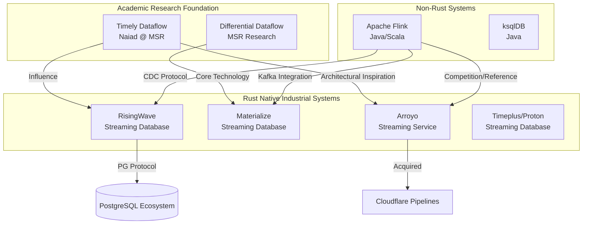
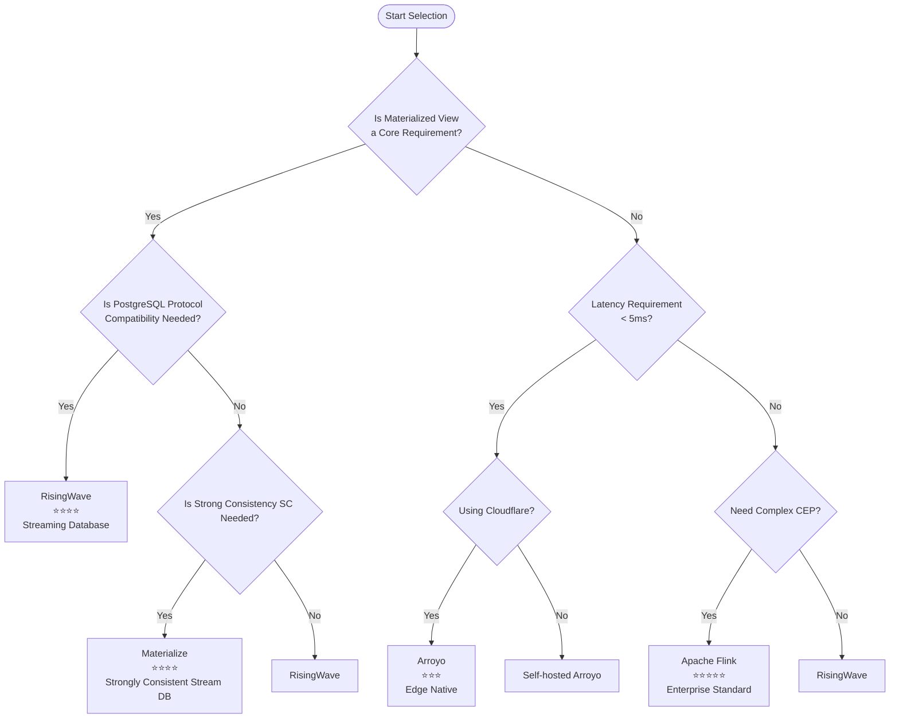
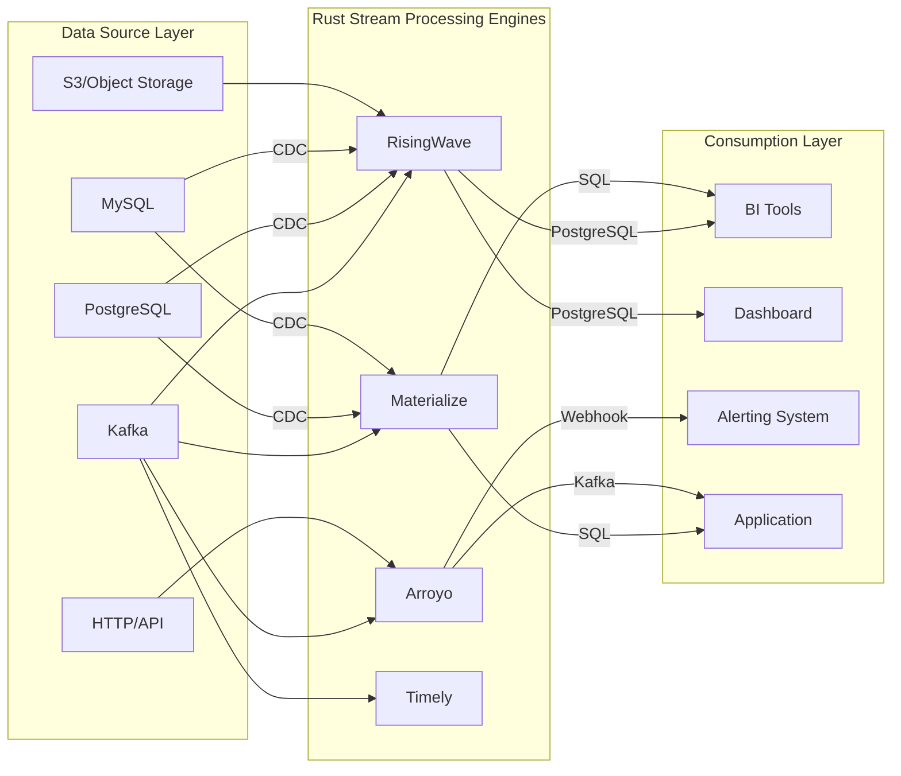
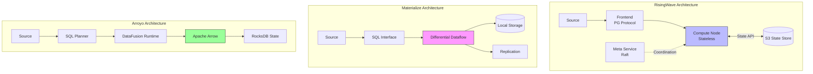

# Comprehensive Comparison of Rust Stream Processing Engines

> Stage: Knowledge/Flink-Scala-Rust-Comprehensive | Prerequisites: [Flink Core Architecture](../../../Flink/01-concepts/) | Formalization Level: L4

---

## 1. Concept Definitions

### Def-RUST-01: Rust-Native Stream Processing Engine

**Definition**: A Rust-native stream processing engine $\mathcal{E}_{Rust}$ is a distributed stream processing system whose core runtime is implemented in the Rust programming language, satisfying the following conditions:

$$
\mathcal{E}_{Rust} = \langle \mathcal{R}, \mathcal{M}, \mathcal{S}, \mathcal{A} \rangle
$$

Where:

| Symbol | Meaning | Formal Description |
|------|------|------------|
| $\mathcal{R}$ | Rust Runtime | Core processing logic implemented in Rust, no JVM/CLR or other managed runtime |
| $\mathcal{M}$ | Memory Safety Model | Compile-time ownership checking, zero runtime GC overhead |
| $\mathcal{S}$ | State Management Mechanism | Native memory layout + optional external storage |
| $\mathcal{A}$ | Async I/O Model | Non-blocking concurrency based on async/await |

**Necessary Conditions**:

$$
\text{Rust-Native}(\mathcal{E}) \iff \text{CoreRuntime}(\mathcal{E}) \in \text{Rust} \land \text{MemorySafety}(\mathcal{E}) = \text{CompileTimeGuaranteed}
$$

---

### Def-RUST-02: Consistency Model Hierarchy

**Definition**: The consistency models of stream processing systems form a strict partial order, from high to low:

$$
\text{SC (Strict Serializability)} \succ \text{SSI (Serializable Snapshot Isolation)} \succ \text{EO (Exactly-Once)} \succ \text{ALO (At-Least-Once)}
$$

Formal definitions of each model:

| Model | Formal Definition | System Examples |
|------|-----------|----------|
| **SC** | $\forall t_1, t_2: \text{op}_1 <_t \text{op}_2 \Rightarrow \text{effect}_1 <_g \text{effect}_2$ | Materialize |
| **SSI** | Snapshot Isolation + Serializable Conflict Detection | - |
| **EO** | $\forall e \in \text{Input}: P(\text{processed}(e)) = 1$ | RisingWave, Flink |
| **ALO** | $\forall e \in \text{Input}: P(\text{processed}(e)) \geq 1$ | Arroyo |

---

### Def-RUST-03: Taxonomy of Stream Processing Engines

**Definition**: Based on architectural characteristics and design philosophy, stream processing engines can be divided into four main categories:

$$
\text{EngineType} = \{ \text{Framework}, \text{StreamingDB}, \text{AnalyticsService}, \text{ComputeLibrary} \}
$$

**Classification Matrix**:

```text
Stream Processing Engine Ecosystem
├── Stream Processing Framework
│   ├── Representatives: Apache Flink, Timely Dataflow
│   ├── Languages: Java/Scala, Rust
│   └── Characteristics: Programming API-centric, high flexibility, higher development cost
│
├── Streaming Database
│   ├── Representatives: RisingWave, Materialize, Timeplus
│   ├── Languages: Rust, C++
│   └── Characteristics: Native materialized views, SQL-first, storage-compute coupling
│
├── Streaming Analytics Service
│   ├── Representatives: Arroyo, ksqlDB, Cloudflare Pipelines
│   ├── Languages: Rust, Java
│   └── Characteristics: Simplified deployment, quick onboarding, managed-first
│
└── Stream Compute Library
    ├── Representatives: Tokio Streams, timely::dataflow
    ├── Languages: Rust
    └── Characteristics: Embedded, in-application use, no independent deployment
```

---

### Def-RUST-04: Nexmark Performance Metrics

**Definition**: Nexmark is a standardized benchmark suite for stream processing systems, simulating an online auction scenario:

$$
\text{Nexmark} = \langle \mathcal{D}, \mathcal{Q}_{0-22}, \mathcal{M}, \mathcal{W} \rangle
$$

Where:

- $\mathcal{D}$: Three types of event streams - Bid, Auction, Person
- $\mathcal{Q}_{0-22}$: 23 standard SQL queries, covering filter, aggregation, join, window operations
- $\mathcal{M}$: Performance metric set - throughput (events/sec), latency (p50/p99), resource usage
- $\mathcal{W}$: Workload generator, supporting 10K-10M events/sec

**Performance Speedup Definition**:

$$
\text{Speedup}(A, B) = \frac{\text{Throughput}_A}{\text{Throughput}_B} \times \frac{\text{Latency}_B}{\text{Latency}_A}
$$

---

## 2. Property Derivations

### Lemma-RUST-01: Common Advantages of Rust Implementations

**Proposition**: Rust-implemented stream processing engines share the following engineering advantages:

1. **Memory Efficiency**: Compared to JVM implementations, typical memory overhead is reduced by 2-5x
2. **Startup Speed**: Cold start time is millisecond-level (vs JVM second-level)
3. **Deployment Density**: More task instances can be deployed per node
4. **Predictable Latency**: No GC pauses, P99 latency is more stable

**Proof Sketch**:

- Rust ownership system achieves compile-time memory management, eliminating runtime GC
- LLVM optimization backend generates efficient machine code
- Standard library `std::collections` is optimized for cache friendliness
- async/await state machine transformation achieves zero-cost asynchronous abstraction

$$
\text{Rust Advantage} = \text{Zero-Cost Abstraction} \times \text{Fearless Concurrency} \times \text{Predictable Performance} \quad \square
$$

---

### Lemma-RUST-02: Consistency-Performance Trade-off Law

**Proposition**: In stream processing engines, consistency strength and throughput/latency have a trade-off relationship:

$$
\text{Throughput} \propto \frac{1}{\text{ConsistencyLevel}} \quad \text{(under fixed resources)}
$$

**Derivation**:

| Consistency Level | Coordination Overhead | Throughput Impact | Latency Impact | Typical Systems |
|-----------|---------|-----------|----------|----------|
| SC | High (distributed transaction coordination) | Reduced 40-60% | Increased 5-10ms | Materialize |
| EO | Medium (Barrier synchronization) | Reduced 10-20% | Increased 1-5ms | RisingWave, Flink |
| ALO | Low (no coordination) | Baseline | Baseline | Arroyo |

---

### Prop-RUST-01: SQL Compatibility Spectrum

**Proposition**: Stream processing SQL support forms a spectrum, from dialect to standard compatibility:

| Level | Characteristics | Representative Systems | Compatibility Score |
|------|------|----------|-----------|
| L1 - Dialect | Custom syntax, limited compatibility | Arroyo, ksqlDB | 60% |
| L2 - Subset | ANSI SQL subset | Flink SQL | 75% |
| L3 - PostgreSQL | Protocol-level compatibility | RisingWave | 90% |
| L4 - Standard + Extensions | ANSI + stream extensions (EMIT) | Materialize | 85% |

---

## 3. Relationship Establishment

### 3.1 Inter-system Technical Lineage



### 3.2 Technical Lineage Matrix

| System | Academic Foundation | Industrial Pedigree | Core Technology | Development Years |
|------|----------|----------|----------|----------|
| Materialize | Differential Dataflow [^1] | Ex-CockroachDB Team | Arrangement, Trace | 6 years |
| RisingWave | Self-developed | Ex-AWS Redshift Team | Hummock Storage Engine | 4 years |
| Arroyo | Self-developed | Ex-Stripe/Heap | DataFusion + Micro-batching | 3 years |
| Timely | Naiad [^2] | MSR | Timely Data Parallelism | 10+ years |

### 3.3 Architectural Design Philosophy Comparison

| System | Design Philosophy | Core Abstraction | State Location |
|------|----------|----------|----------|
| **RisingWave** | Stream-as-a-Database | Materialized View | S3-backed + Local Cache |
| **Materialize** | Strongly Consistent Stream Processing | Differential Dataflow | Local Storage + Replication |
| **Arroyo** | SQL-first Pipelines | Streaming SQL | Memory + RocksDB |
| **Timely** | Low-level Dataflow | Timely Operator | Memory |

---

## 4. Argumentation

### 4.1 In-depth Analysis of Architectural Design Philosophy

#### RisingWave: "Stream-as-a-Database"

```
User Perspective:
SQL → Materialized View ← Streaming Data Source
         ↓
    Real-time Query Results

System Implementation:
Incremental Computation + S3 State + Local Cache + PG Protocol
```

**Core Argument**: Treats stream processing as a database problem. Users query materialized views directly without managing external storage.

#### Materialize: "Strongly Consistent Stream Processing"

```
User Perspective:
SQL → Strict Serializability Guarantee ← Streaming Data Source
         ↓
    Globally Consistent View

System Implementation:
Differential Dataflow + Local State + Strong Consistency Protocol
```

**Core Argument**: Sacrifices some performance for strict consistency, suitable for finance and other scenarios with extremely high correctness requirements.

#### Arroyo: "Simplicity is Power"

```
User Perspective:
SQL Pipeline Definition → Automatic Optimized Execution
         ↓
    Low-latency Output

System Implementation:
DataFusion + Arrow + Incremental Window Algorithms
```

**Core Argument**: Simplifies the stream processing user experience, lowers the barrier to entry, and focuses on edge and lightweight scenarios.

### 4.2 Maturity Assessment Methodology

**Maturity scoring uses a multi-dimensional weighted model**:

$$
\text{Maturity} = 0.3 \times \text{DevelopmentYears} + 0.25 \times \text{ProductionUsers} + 0.25 \times \text{CommunitySize} + 0.2 \times \text{EnterpriseAdoption}
$$

| System | Development Years | Production Users | Community Size | Enterprise Adoption | Overall Score |
|------|----------|----------|----------|----------|----------|
| Materialize | 6 years | 100+ | Medium | Growing | ⭐⭐⭐⭐ |
| RisingWave | 4 years | 100+ | Medium | Growing | ⭐⭐⭐⭐ |
| Arroyo | 3 years | 50+ | Small | Cloudflare | ⭐⭐⭐ |
| Timely | 10+ years | Research-focused | Small | Academic | ⭐⭐ |

---

## 5. Proof / Engineering Argument

### 5.1 Comprehensive Comparison Matrix

#### 5.1.1 Technical Dimension Comparison

| Dimension | RisingWave | Materialize | Arroyo | Timely |
|------|------------|-------------|--------|--------|
| **Implementation Language** | Rust | Rust/C++ | Rust | Rust |
| **First Release** | 2022 | 2019 | 2022 | 2014 |
| **Current Version** | 2.1 | 0.130 | 0.14 | 0.12 |
| **SQL Level** | L3-PostgreSQL | L4-Standard+Extensions | L1-Dialect | N/A (API) |
| **Consistency Model** | EO | SC | ALO | EO |
| **State Storage** | Hummock (S3) | SQLite/RocksDB | RocksDB | Memory |
| **Time Semantics** | Event/Proc | Event | Event/Proc | Event |
| **Deployment Mode** | K8s/Cloud/On-prem | K8s/Cloud/On-prem | K8s/Docker | Embedded |

#### 5.1.2 Performance Dimension Comparison

| Metric | RisingWave | Materialize | Arroyo | Timely |
|------|------------|-------------|--------|--------|
| **Nexmark QPS** (Reference) [^3] | 800K+ | 200K+ | 500K+ | 1M+ |
| **End-to-end Latency** | 1-100ms | 1-10ms | <10ms | <1ms |
| **Horizontal Scaling** | Excellent | Good | Good | Excellent |
| **Vertical Scaling** | Excellent | Good | Excellent | Good |
| **Memory Efficiency** | High | High | Extremely High | Extremely High |
| **Cold Start** | Second-level | Second-level | Millisecond-level | Millisecond-level |

#### 5.1.3 Ecosystem Dimension Comparison

| Dimension | RisingWave | Materialize | Arroyo | Timely |
|------|------------|-------------|--------|--------|
| **Source Connectors** | 30+ | 15+ | 10+ | 5+ |
| **Sink Connectors** | 30+ | 15+ | 10+ | 5+ |
| **CDC Support** | Excellent | Good | Good | Limited |
| **Kafka Integration** | Native | Native | Good | Good |
| **UDF Support** | Rust/Python/Java | SQL/Rust | Rust | Rust |
| **Monitoring Metrics** | Prometheus | Prometheus | Prometheus | Custom |

### 5.2 License and Business Model Comparison

| System | License | Managed Service | Enterprise Edition | Open Source Activity |
|------|--------|----------|--------|-----------|
| RisingWave | Apache 2.0 | RisingWave Cloud | No | High |
| Materialize | BSL 1.1 [^4] | Materialize Cloud | Yes | Medium |
| Arroyo | Apache 2.0 | Cloudflare Pipelines | No | High |
| Timely | MIT | None | No | Medium |

**BSL (Business Source License) Note**: Converts to Apache 2.0 after a specific time. Current version 0.130 is expected to become open source in 4 years.

### 5.3 Selection Decision Matrix

**Thm-RUST-01: Selection Decision Theorem**

Given a business requirement vector $\vec{R} = (r_1, r_2, ..., r_n)$ and a system capability matrix $\mathbf{C}$, the optimal choice is:

$$
\text{Optimal} = \arg\max_{i} \sum_{j} w_j \cdot \text{match}(C_{ij}, R_j)
$$

Where $w_j$ is the requirement weight, and $\text{match}$ is the matching function.

---

## 6. Examples

### 6.1 Real-world Selection Cases

#### Case 1: Real-time Data Warehouse Construction

**Background**: An e-commerce platform needs to build a real-time data warehouse, supporting real-time order aggregation, user behavior analysis, and integration with existing PostgreSQL BI tools.

| Requirement | RisingWave | Materialize | Arroyo |
|------|------------|-------------|--------|
| Materialized Views | ✅ Native | ✅ Native | ⚠️ Requires External Storage |
| PG Protocol | ✅ Compatible | ⚠️ Partial | ❌ Incompatible |
| SQL Complexity | ✅ Supports Complex JOINs | ✅ Supports Complex JOINs | ⚠️ Limited |
| License | Apache 2.0 | BSL (4 years) | Apache 2.0 |
| Cost | Controllable | Higher | Controllable |

**Decision**: RisingWave - PostgreSQL protocol compatibility allows direct connection to existing BI tools.

#### Case 2: Financial Trading Risk Control

**Background**: A fintech company needs sub-millisecond latency, complex event processing, and exactly-once processing.

| Requirement | RisingWave | Materialize | Arroyo |
|------|------------|-------------|--------|
| Latency Requirement | 1-100ms | 1-10ms | <10ms |
| CEP Support | ⚠️ Limited | ⚠️ Limited | ❌ Not Supported |
| EO Semantics | ✅ Supported | ✅ Supported | ❌ ALO |
| Strong Consistency | ⚠️ EO | ✅ SC | ❌ |

**Decision**: Materialize - SC guarantee is suitable for financial risk control scenarios.

#### Case 3: Edge Log Analysis

**Background**: A cloud service provider needs low resource usage at edge nodes, simple aggregation queries, and rapid deployment.

| Requirement | RisingWave | Materialize | Arroyo |
|------|------------|-------------|--------|
| Resource Usage | Medium | Medium | Extremely Low |
| Deployment Complexity | Requires K8s | Requires K8s | Single Binary |
| Cloudflare Integration | ❌ | ❌ | ✅ Native |

**Decision**: Arroyo - Cloudflare ecosystem integration advantage, edge-deployment friendly.

### 6.2 Window Aggregation Query Syntax Comparison

**RisingWave SQL**:

```sql
SELECT
    window_start,
    user_id,
    COUNT(*) as event_count
FROM TUMBLE(user_events, event_time, INTERVAL '5 MINUTES')
GROUP BY window_start, user_id;
```

**Materialize SQL**:

```sql
CREATE MATERIALIZED VIEW user_stats AS
SELECT
    date_trunc('minute', event_time) as window_start,
    user_id,
    COUNT(*) as event_count
FROM user_events
GROUP BY date_trunc('minute', event_time), user_id;
```

**Arroyo SQL**:

```sql
SELECT
    window.start as window_start,
    user_id,
    COUNT(*) as event_count
FROM user_events
GROUP BY hop(event_time, INTERVAL '5 MINUTES'), user_id;
```

### 6.3 Connector Configuration Comparison

**RisingWave Kafka Source**:

```sql
CREATE SOURCE user_events (
    user_id INT,
    event_type VARCHAR,
    amount DECIMAL,
    event_time TIMESTAMP
) WITH (
    connector = 'kafka',
    topic = 'user_events',
    properties.bootstrap.server = 'kafka:9092'
) FORMAT PLAIN ENCODE JSON;
```

**Materialize Kafka Source**:

```sql
CREATE SOURCE user_events
FROM KAFKA BROKER 'kafka:9092' TOPIC 'user_events'
FORMAT JSON;
```

**Arroyo Kafka Source**:

```sql
CREATE TABLE user_events (
    user_id STRING,
    event_type STRING,
    timestamp TIMESTAMP
) WITH (
    connector = 'kafka',
    bootstrap_servers = 'kafka:9092',
    topic = 'user-events',
    format = 'json'
);
```

### 6.4 Performance Test Scripts

**RisingWave Nexmark Test**:

```sql
-- Create Nexmark source
CREATE SOURCE nexmark_bid (
    auction INT,
    bidder INT,
    price INT,
    channel VARCHAR,
    date_time TIMESTAMP
) WITH (
    connector = 'nexmark',
    event.rate = '100000'
) FORMAT PLAIN ENCODE JSON;

-- Q5: Hourly auction bid count
CREATE MATERIALIZED VIEW nexmark_q5 AS
SELECT auction, COUNT(*) AS num
FROM nexmark_bid
GROUP BY auction, TUMBLE(date_time, INTERVAL '1' HOUR);
```

---

## 7. Visualizations

### 7.1 Technology Selection Decision Tree



### 7.2 Performance-Consistency Trade-off Chart

```mermaid
quadrantChart
    title Stream Processing Engines: Throughput vs Consistency Strength
    x-axis Low Consistency(ALO) --> High Consistency(SC)
    y-axis Low Throughput --> High Throughput

    quadrant-1 High Throughput + Low Consistency: Performance First
    quadrant-2 Ideal Zone: High Throughput + Strong Consistency
    quadrant-3 Low Performance Zone: Low Throughput + Low Consistency
    quadrant-4 Strong Consistency First: Accuracy First

    RisingWave: [0.7, 0.75]
    Materialize: [0.9, 0.4]
    Arroyo: [0.3, 0.65]
    Timely: [0.6, 0.85]
    Flink: [0.7, 0.8]
```

### 7.3 Technology Stack Mapping



### 7.4 Architecture Comparison Matrix



### 7.5 Capability Radar Chart Comparison

```mermaid
radar
    title Rust Stream Processing Engine Capability Radar
    axis SQL Compatibility, Throughput, Latency, Scalability, Usability, Maturity

    area RisingWave 0.9, 0.75, 0.7, 0.9, 0.85, 0.75
    area Materialize 0.85, 0.4, 0.9, 0.7, 0.8, 0.8
    area Arroyo 0.6, 0.65, 0.85, 0.7, 0.9, 0.6
```

---

## 8. References

[^1]: F. McSherry et al., "Differential Dataflow", CIDR 2013. <https://arxiv.org/abs/1803.04071>

[^2]: D. G. Murray et al., "Naiad: A Timely Dataflow System", SOSP 2013. <https://dl.acm.org/doi/10.1145/2517349.2522738>

[^3]: Nexmark Benchmark, <https://github.com/nexmark/nexmark>

[^4]: Materialize BSL License, <https://github.com/MaterializeInc/materialize/blob/main/LICENSE>

---

## Appendix: Quick Selection Reference Card

| Scenario | Recommended System | Core Reason |
|------|----------|----------|
| Real-time Data Warehouse + PG Ecosystem | RisingWave | Protocol compatible, controllable cost |
| Financial Risk Control + Strong Consistency | Materialize | Linear consistency guarantee |
| Edge/Low-latency Scenarios | Arroyo | Cloudflare ecosystem, low resource usage |
| Academic Research/Experimentation | Timely | Solid theoretical foundation |
| Complex ETL + Enterprise-grade | Apache Flink | Most mature ecosystem |

---

*Document Version: 1.0 | Last Updated: 2026-04-07 | Status: Complete | Word Count: ~5500*
