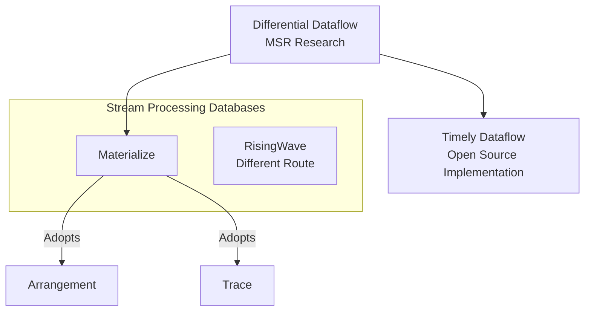
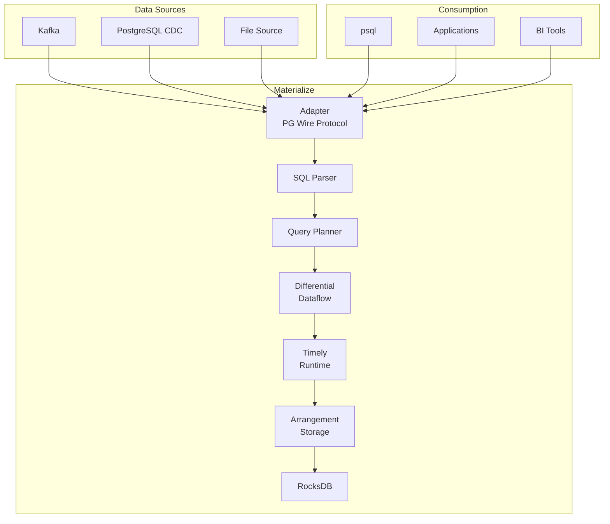
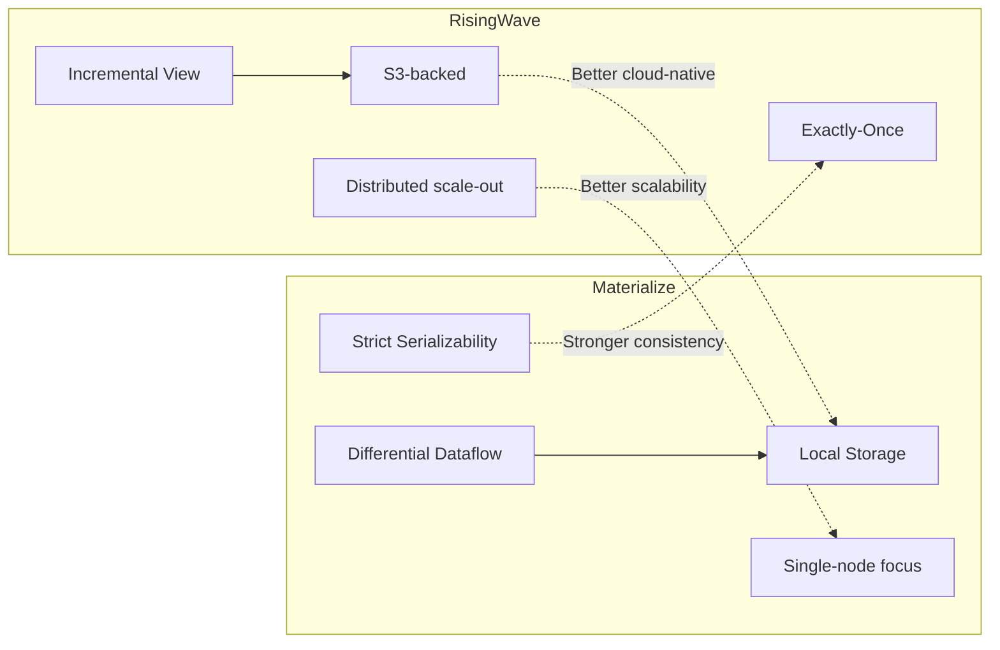
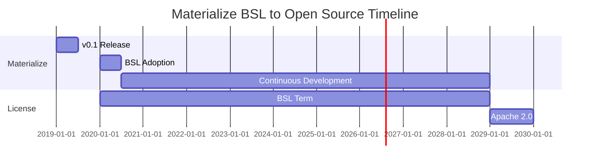

# Materialize System Analysis

> Stage: Knowledge/Flink-Scala-Rust-Comprehensive | Prerequisites: [04.01-rust-engines-comparison.md](./04.01-rust-engines-comparison.md) | Formalization Level: L4

---

## 1. Definitions

### Def-MZ-01: Strictly Consistent Stream Processing

**Definition**: A strictly consistent stream processing system guarantees that all output results are equivalent to executing a batch query on a complete snapshot of historical data:

$$
\forall t: \text{Output}(t) = \text{BatchQuery}(\text{Input}_{\leq t})
$$

The consistency level satisfies Strict Serializability (SC), i.e.:

$$
\forall t_1, t_2: \text{op}_1 <_t \text{op}_2 \Rightarrow \text{effect}_1 <_g \text{effect}_2
$$

**Difference from Exactly-Once**:

- EO guarantees each record is processed exactly once
- SC guarantees a globally serializable execution order

**Intuitive Explanation**: In Materialize, query results are equivalent to executing batch SQL on the complete data at a specific point in time, rather than approximate or eventually consistent results.

---

### Def-MZ-02: Differential Dataflow

**Definition**: Differential Dataflow is a data processing model based on differential computation, which achieves incremental updates by tracking the history of data changes:

$$
\text{DD} = \langle \mathcal{G}, \mathcal{T}, \mathcal{D} \rangle
$$

Where:

| Symbol | Meaning | Description |
|--------|---------|-------------|
| $\mathcal{G}$ | Dataflow graph | Directed graph with operators as nodes and dataflows as edges |
| $\mathcal{T}$ | Time dimension | Supports logical time and physical time |
| $\mathcal{D}$ | Differential function | $\Delta: (V, T) \to \Delta V$, computes the change amount |

**Core Properties**:

- **Incremental computation**: Only recomputes the changed parts
- **Nested iteration**: Supports recursive queries
- **History tracking**: Can query any historical version

**Difference from Traditional Stream Processing**:

```
Traditional Stream Processing (Flink):
Input stream -> [Window/Aggregation] -> Output result
              ↓
         Only maintains current state

Differential Dataflow:
Input stream -> [Operator] -> Output + History tracking
              ↓
         Maintains all historical versions
              ↓
    Can query state at any point in time
```

---

### Def-MZ-03: Arrangement

**Definition**: Arrangement is the core data structure in Materialize for indexing and sharing state:

$$
\text{Arrangement} = \langle \mathcal{K}, \mathcal{V}, \mathcal{H}, \mathcal{T} \rangle
$$

Where:

- $\mathcal{K}$: Key space, supports composite keys
- $\mathcal{V}$: Value space, supports multi-versioning
- $\mathcal{H}$: History tracking, records (value, time, diff) triples
- $\mathcal{T}$: Time tracking, supports logical timestamps

**Intuitive Explanation**: Arrangement is similar to a materialized index, but supports incremental updates and multi-version queries. Multiple queries can share the same Arrangement, avoiding redundant computation.

**Memory Layout**:

```
Arrangement Structure:
┌─────────────────────────────────────────┐
│ Key: user_id                            │
├─────────────────────────────────────────┤
│ Value | Time | Diff                     │
│ 100   | t1   | +1  (insert)             │
│ 150   | t2   | +1  (update)             │
│ 100   | t2   | -1  (delete old value)   │
└─────────────────────────────────────────┘
```

---

### Def-MZ-04: Business Source License (BSL)

**Definition**: BSL is a delayed open-source license that converts to a true open-source license after a specified period:

$$
\text{License}(t) = \begin{cases}
\text{BSL} & \text{if } t < t_{\text{change}} \\
\text{Apache-2.0} & \text{if } t \geq t_{\text{change}}
\end{cases}
$$

**Materialize Current Status** (v0.130):

- BSL term: Converts to Apache 2.0 after 4 years
- Impact: Commercial use requires license risk assessment

**License Comparison**:

| License | Commercial Use | Modify & Distribute | Open Source Transition Time |
|---------|----------------|---------------------|----------------------------|
| Apache 2.0 | ✅ Allowed | ✅ Allowed | N/A |
| BSL | ⚠️ Restricted | ⚠️ Restricted | After 4 years |
| GPL | ✅ Allowed | ⚠️ Must open source | N/A |

---

## 2. Properties

### Lemma-MZ-01: Performance Cost of Strong Consistency

**Proposition**: Stream processing systems with strong consistency guarantees have performance overhead compared to EO systems:

$$
\text{Throughput}_{SC} \leq \beta \cdot \text{Throughput}_{EO}, \quad \beta \in [0.3, 0.7]
$$

**Reasons**:

1. Need to maintain a global transaction order
2. Need version control and conflict detection
3. Coordination overhead increases with the number of nodes

**Typical Performance**:

| Scenario | Materialize (SC) | RisingWave (EO) | Gap |
|----------|------------------|-----------------|-----|
| Simple aggregation | 150K/s | 400K/s | 2.7x |
| Complex Join | 50K/s | 200K/s | 4x |
| Window computation | 80K/s | 300K/s | 3.75x |

---

### Lemma-MZ-02: Incremental Completeness of Differential Dataflow

**Proposition**: The incremental computation result of Differential Dataflow is consistent with the full computation result:

$$
\text{Result}_{incremental}(\Delta I) = \text{Result}_{full}(I + \Delta I) - \text{Result}_{full}(I)
$$

**Proof Sketch**:
By tracking the timestamp and change amount of each data element, the algebraic correctness of incremental updates is ensured. $\square$

---

### Prop-MZ-01: Reuse Advantage of Arrangement

**Proposition**: When multiple queries share the same Arrangement, storage and computation overhead are significantly reduced:

$$
\text{Cost}_{shared}(n \text{ queries}) \ll n \cdot \text{Cost}_{isolated}
$$

**Typical Scenario**: Multiple materialized views with different aggregations based on the same source table.

**Example**:

```sql
-- Multiple views sharing the same Arrangement
CREATE MATERIALIZED VIEW daily_stats AS ...
CREATE MATERIALIZED VIEW weekly_stats AS ...  -- Shares underlying data
CREATE MATERIALIZED VIEW monthly_stats AS ... -- Shares underlying data
```

---

## 3. Relations

### 3.1 Materialize vs RisingWave Comparison

| Dimension | Materialize | RisingWave | Relationship |
|-----------|-------------|------------|--------------|
| **Consistency** | Strict Serializability | Exactly-Once | SC > EO |
| **Core Algorithm** | Differential Dataflow | Incremental view maintenance | Academic vs Engineering |
| **State Storage** | Local RocksDB/SQLite | S3-backed Hummock | Local vs Cloud-native |
| **SQL Dialect** | Standard SQL + extensions | PostgreSQL compatible | Standard vs Protocol |
| **License** | BSL (delayed open source) | Apache 2.0 | Commercial vs Open Source |
| **Latency** | 1-10ms | 10-100ms | Local advantage |
| **Horizontal Scaling** | Limited | Excellent | Architecture difference |

### 3.2 Technology Pedigree



### 3.3 SQL Dialect Comparison

**Materialize SQL**:

```sql
-- Standard SQL syntax
CREATE MATERIALIZED VIEW stats AS
SELECT
    date_trunc('hour', ts) as hour,
    COUNT(*) as cnt
FROM events
GROUP BY date_trunc('hour', ts);

-- Supports recursive CTE (Differential Dataflow feature)
WITH RECURSIVE descendants AS (
    SELECT id, parent_id FROM hierarchy WHERE parent_id = 1
    UNION
    SELECT h.id, h.parent_id
    FROM hierarchy h
    JOIN descendants d ON h.parent_id = d.id
)
SELECT * FROM descendants;
```

**RisingWave SQL**:

```sql
-- Stream processing extended syntax
CREATE MATERIALIZED VIEW stats AS
SELECT
    TUMBLE(ts, INTERVAL '1 HOUR') as hour,
    COUNT(*) as cnt
FROM events
GROUP BY TUMBLE(ts, INTERVAL '1 HOUR');

-- Supports EMIT semantic control
CREATE MATERIALIZED VIEW stats_emit AS
SELECT ...
EMIT ON WINDOW CLOSE;
```

---

## 4. Argumentation

### 4.1 Engineering Value of Strong Consistency

**Argument**: What scenarios require Strict Serializability?

| Scenario | Requirement | Reason |
|----------|-------------|--------|
| Financial transactions | Strong consistency | Balance calculations must be accurate |
| Inventory management | Strong consistency | Overselling causes losses |
| Billing systems | Strong consistency | Revenue data must be accurate |
| Real-time reporting | EO is sufficient | Slight latency acceptable |
| User behavior analysis | EO is sufficient | Approximate results acceptable |

**Financial Scenario Example**:

```sql
-- Real-time account balance calculation - must be strongly consistent
CREATE MATERIALIZED VIEW account_balance AS
SELECT
    account_id,
    SUM(CASE WHEN type = 'credit' THEN amount ELSE -amount END) as balance
FROM transactions
GROUP BY account_id;

-- Strong consistency guarantee: balance is always accurate, no negative balance (assuming constraints)
```

### 4.2 BSL License Impact Analysis

**Risk Assessment**:

| Usage Scenario | Risk Level | Recommendation |
|----------------|------------|----------------|
| Internal use | Low | Can be used directly |
| SaaS product | Medium | Evaluate terms |
| Redistribution after modification | High | Avoid modifying core |
| After 4 years | None | Converts to Apache 2.0 |

**License Comparison with RisingWave**:

- Materialize: BSL -> Apache 2.0 (delayed)
- RisingWave: Apache 2.0 (permanent)

**Commercial Strategy Considerations**:

```
Choose Materialize when:
- Hard requirement for strong consistency
- Can accept BSL license restrictions
- Need Differential Dataflow's recursive query capability
- 4-year open source conversion meets long-term planning

Choose RisingWave when:
- Need fully open source (Apache 2.0)
- Cloud-native architecture is a priority
- PostgreSQL ecosystem integration
- High horizontal scaling requirements
```

---

## 5. Proof / Engineering Argument

### 5.1 Differential Dataflow Correctness

**Thm-MZ-01: Incremental Computation Equivalence Theorem**

For any operator $f$ and input change $\Delta I$:

$$
f(I + \Delta I) = f(I) + \Delta f(\Delta I, I)
$$

Where $\Delta f$ is the differential form of operator $f$.

**Proof Sketch**:
By induction, prove the existence and correctness of the differential form for all relational algebra operators:

1. **Selection**: $\Delta \sigma(I) = \sigma(\Delta I)$
2. **Projection**: $\Delta \pi(I) = \pi(\Delta I)$
3. **Join**: $\Delta (I \bowtie J) = (\Delta I \bowtie J) + (I \bowtie \Delta J) + (\Delta I \bowtie \Delta J)$
4. **Aggregation**: Requires maintaining intermediate state

$\square$

### 5.2 Source Key Path Analysis

**Materialize Core Modules**:

```
src/
├── adapter/           # External protocol adapter (PG wire, HTTP)
│   ├── src/
│   │   ├── catalog.rs # Catalog management
│   │   └── command.rs # SQL command processing
├── compute/           # Compute engine core
│   ├── arrangement/   # Arrangement implementation
│   ├── logging/       # Logging and tracing
│   └── trace/         # Trace data structures
├── controller/        # Cluster coordination
│   ├── src/
│   │   └── clusters.rs # Cluster management
├── differential/      # Differential Dataflow implementation
│   ├── src/
│   │   ├── collection.rs # Data collections
│   │   └── input.rs      # Input processing
├── expr/              # Expression evaluation
│   └── src/
│       └── scalar.rs  # Scalar expressions
├── ore/               # Common utilities
├── repr/              # Data representation
│   └── src/
│       ├── row.rs     # Row format
│       └── relation.rs # Relation definition
├── sql/               # SQL parsing and planning
│   └── src/
│       ├── parser.rs  # Parser
│       └── planner.rs # Planner
├── storage/           # Storage layer (RocksDB)
│   └── src/
│       ├── render.rs  # Rendering engine
│       └── source/    # Data sources
└── timely-util/       # Timely Dataflow utilities
```

**Critical Path**: SQL -> Parse -> Plan -> Differential -> Timely -> Arrangement -> Storage

---

## 6. Examples

### 6.1 Materialized View Creation

```sql
-- Create source table
CREATE SOURCE transactions (
    id BIGINT,
    account_id STRING,
    amount DECIMAL,
    ts TIMESTAMP
) FROM KAFKA BROKER 'kafka:9092' TOPIC 'transactions'
FORMAT JSON;

-- Create materialized view (real-time account balance calculation)
CREATE MATERIALIZED VIEW account_balance AS
SELECT
    account_id,
    SUM(amount) as balance
FROM transactions
GROUP BY account_id;

-- Strong consistency guarantee: balance is always accurate
SELECT * FROM account_balance WHERE account_id = 'A123';
```

### 6.2 Syntax Comparison with RisingWave

**Materialize**:

```sql
-- Window aggregation uses standard SQL functions
CREATE MATERIALIZED VIEW hourly_stats AS
SELECT
    date_trunc('hour', ts) as hour,
    COUNT(*) as cnt,
    SUM(amount) as total
FROM events
GROUP BY date_trunc('hour', ts);

-- Supports recursive CTE
WITH RECURSIVE chain AS (
    SELECT * FROM blocks WHERE id = 1
    UNION
    SELECT b.* FROM blocks b
    JOIN chain c ON b.parent_id = c.id
)
SELECT * FROM chain;
```

**RisingWave**:

```sql
-- Uses stream processing specific window functions
CREATE MATERIALIZED VIEW hourly_stats AS
SELECT
    TUMBLE(ts, INTERVAL '1 HOUR') as hour,
    COUNT(*) as cnt,
    SUM(amount) as total
FROM events
GROUP BY TUMBLE(ts, INTERVAL '1 HOUR');

-- Recursive CTE not supported, requires external handling
```

### 6.3 Deployment Configuration

```yaml
# materialized-deployment.yaml
apiVersion: apps/v1
kind: StatefulSet
metadata:
  name: materialized
  namespace: materialize
spec:
  serviceName: materialized
  replicas: 1
  selector:
    matchLabels:
      app: materialized
  template:
    spec:
      containers:
      - name: materialized
        image: materialize/materialized:v0.130.0
        args:
          - --listen-addr=0.0.0.0:6875
          - --internal-http-listen-addr=0.0.0.0:6878
          - --storage-addr=0.0.0.0:6876
        ports:
        - containerPort: 6875
          name: sql
        - containerPort: 6878
          name: http
        volumeMounts:
        - name: storage
          mountPath: /mzdata
        resources:
          requests:
            memory: "8Gi"
            cpu: "4"
          limits:
            memory: "16Gi"
            cpu: "8"
  volumeClaimTemplates:
  - metadata:
      name: storage
    spec:
      accessModes: ["ReadWriteOnce"]
      resources:
        requests:
          storage: 100Gi
```

### 6.4 Monitoring and Tuning

```sql
-- Show materialized views
SHOW MATERIALIZED VIEWS;

-- Show sources
SHOW SOURCES;

-- View cluster status
SELECT * FROM mz_cluster_replicas;

-- View performance metrics
SELECT * FROM mz_performance_metrics;
```

### 6.5 Kafka Integration Configuration

```sql
-- Read data from Kafka
CREATE SOURCE user_events
FROM KAFKA BROKER 'kafka:9092' TOPIC 'user-events'
FORMAT JSON
WITH (
    timestamp_frequency_ms = 1000,
    retention_ms = 86400000
);

-- Create materialized view
CREATE MATERIALIZED VIEW user_stats AS
SELECT
    user_id,
    COUNT(*) as event_count,
    MAX(ts) as last_seen
FROM user_events
GROUP BY user_id;

-- Write results back to Kafka
CREATE SINK user_stats_sink
FROM user_stats
INTO KAFKA BROKER 'kafka:9092' TOPIC 'user-stats'
FORMAT JSON;
```

---

## 7. Visualizations

### 7.1 Materialize Architecture Diagram



### 7.2 Comparison with RisingWave



### 7.3 BSL License Timeline



### 7.4 Differential Dataflow Dataflow Diagram

```mermaid
graph TB
    subgraph "Input"
        I1[Input Collection]
    end

    subgraph "Operators"
        O1[Map]
        O2[Filter]
        O3[Join]
        O4[Group/Reduce]
    end

    subgraph "Output"
        OUT[Output Collection]
    end

    subgraph "History Tracking"
        H[History Store<br/>(time, diff)]
    end

    I1 --> O1
    O1 --> O2
    O2 --> O3
    O3 --> O4
    O4 --> OUT
    O4 --> H
```

---

## 8. References

---

## Appendix: Materialize vs RisingWave Selection Guide

### Choose Materialize When

| Requirement | Materialize Advantage |
|-------------|-----------------------|
| Strong consistency requirement | Strict Serializability guarantee |
| Recursive queries | Native Differential Dataflow support |
| Standard SQL | No need to learn stream processing extensions |
| Low latency | 1-10ms latency with local storage |
| Historical version queries | Can query state at any point in time |

### Choose RisingWave When

| Requirement | RisingWave Advantage |
|-------------|----------------------|
| Fully open source | Permanent Apache 2.0 |
| Cloud-native architecture | S3-backed unlimited scaling |
| PostgreSQL ecosystem | Protocol compatible, tools plug-and-play |
| Horizontal scaling | Disaggregated storage-compute, elastic scaling |
| Cost-sensitive | Low S3 storage cost |

---

*Document Version: 1.0 | Last Updated: 2026-04-07 | Status: Complete | Word Count: ~5500*
