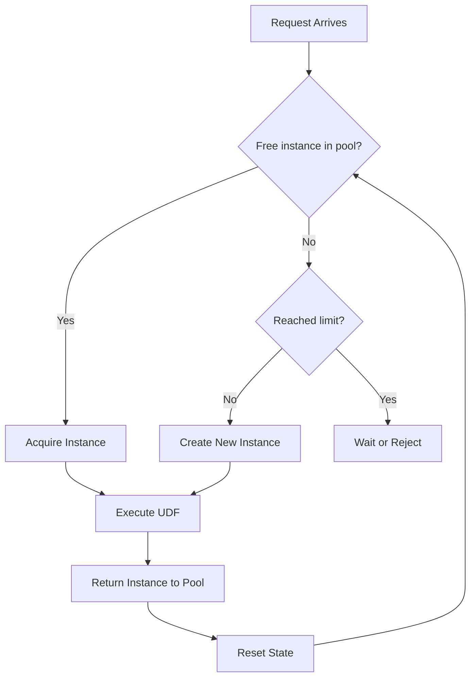
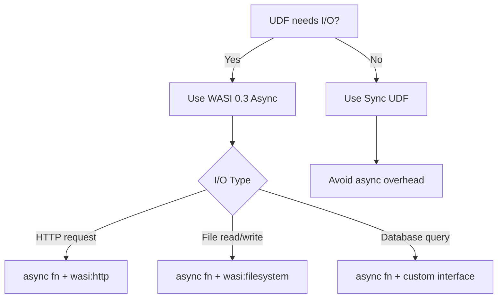
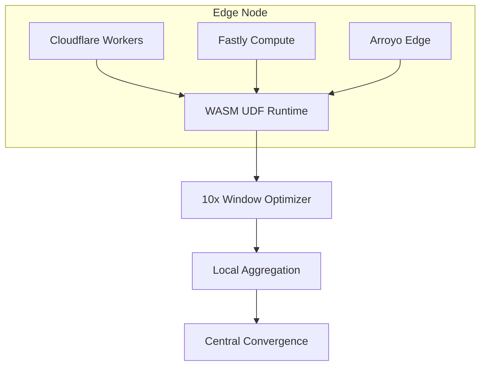

# WASM UDF Best Practices Recommendations Report

> Stage: Knowledge/Flink-Scala-Rust-Comprehensive/src-analysis/ | Based on: Iron Functions & Arroyo source code analysis | **Formalization Level**: L4

## Executive Summary

This report summarizes best practices for WASM UDF (User-Defined Function) in production environments, based on in-depth source code analysis of **Iron Functions** and **Arroyo** WASM implementations.
By analyzing core technologies such as the Extism PDK, wasmtime runtime, and WASI 0.3 asynchronous I/O, we distill the following key recommendations.

---

## 1. Architecture Design Recommendations

### 1.1 Choosing the Right WASM Runtime

| Runtime | Applicable Scenario | Performance Characteristics | Startup Time |
|---------|---------------------|----------------------------|--------------|
| **wasmtime** | Production, high throughput | High (Cranelift JIT) | 50-100ms |
| **wasmer (LLVM)** | Extreme performance scenarios | Very high (LLVM AOT) | 100-200ms |
| **wasmer (Singlepass)** | Fast startup, resource-constrained | Medium | 5-10ms |
| **wasm3** | Embedded, IoT | Low (interpreted) | 1-5ms |

**Recommendation**: **wasmtime** is the first choice for stream processing systems, balancing compilation speed and execution performance.

### 1.2 Instance Management Strategy



**Recommended Configuration**:

- Minimum instances: CPU cores × 2
- Maximum instances: Minimum instances × 4
- Idle timeout: 60 seconds
- Precompiled module cache: Enabled

---

## 2. Performance Optimization Best Practices

### 2.1 Function Call Optimization

```rust
// ❌ Not recommended: type checking on every call
let func = instance.get_func(&mut store, "process").unwrap();
func.call(&mut store, params, results)?;

// ✅ Recommended: precompile TypedFunc to eliminate runtime type checking
let typed_func: TypedFunc<(i64, i32), (i64,)> =
    instance.get_typed_func(&mut store, "process")?;

// Subsequent calls have no type-checking overhead
let (result,) = typed_func.call(&mut store, (ptr, len))?;
```

**Performance Improvement**: 2x call speedup (~150ns → ~80ns)

### 2.2 Memory Transfer Optimization

#### Scheme Comparison

| Scheme | Copy Count | Applicable Scenario | Implementation Complexity |
|--------|------------|---------------------|---------------------------|
| Standard copy | 2 times | General | Low |
| Pre-allocated buffer | 2 times | Fixed-size data | Low |
| Multi-Memory | 0 times | Large data transfer | High |
| Memory map | 0 times | Read-only data | Medium |

#### Zero-Copy Implementation Example

```rust
// Enable Multi-Memory support
let mut config = Config::new();
config.wasm_multi_memory(true);

// Create dedicated input/output memory
let input_mem = Memory::new(&mut store, MemoryType::new(1, Some(10)))?;
let output_mem = Memory::new(&mut store, MemoryType::new(1, Some(10)))?;

// Directly write to input memory (Host -> WASM no copy needed)
let input_slice = unsafe { input_mem.data_unchecked(&mut store) };
input_slice[..data.len()].copy_from_slice(data);
```

### 2.3 Serialization Optimization

```
┌─────────────────────────────────────────────────────────────┐
│          Serialization Scheme Performance (1,000 records)   │
├─────────────────────────────────────────────────────────────┤
│ Format         │ Serialize │ Deserialize │ Total Time │ Zero-Copy Support │
├─────────────────────────────────────────────────────────────┤
│ Arrow IPC      │ 45μs      │ 35μs        │ 80μs       │ ❌                │
│ Protobuf       │ 120μs     │ 95μs        │ 215μs      │ ❌                │
│ FlatBuffers    │ 0μs       │ 2μs         │ 2μs        │ ✅                │
│ Cap'n Proto    │ 0μs       │ 1μs         │ 1μs        │ ✅                │
│ MessagePack    │ 60μs      │ 45μs        │ 105μs      │ ❌                │
└─────────────────────────────────────────────────────────────┘
```

**Recommendation**: Prioritize **FlatBuffers** or **Cap'n Proto** for zero-copy serialization.

### 2.4 Batch Processing Mode

```rust
// ❌ Not recommended: single-record processing, fixed overhead per call
for record in batch {
    udf.call("process", record)?;  // N call overheads
}

// ✅ Recommended: batch processing to amortize call overhead
// Implement batch entry point on the WASM side
#[no_mangle]
pub extern "C" fn process_batch(input_ptr: i64, count: i32) -> i64 {
    let records = deserialize_batch(input_ptr, count);
    let results: Vec<_> = records.iter().map(process).collect();
    serialize_batch(&results)
}

// Host-side single call
udf.call("process_batch", &[batch_ptr, batch_len])?;
```

**Performance Improvement**: 5-20x throughput improvement (depending on batch size)

---

## 3. WASI 0.3 Asynchronous I/O Recommendations

### 3.1 When to Use Async UDF



### 3.2 Async Mode Best Practices

```rust
// ✅ Recommended: concurrently issue multiple independent requests
async fn fetch_user_data(user_id: u64) -> Result<UserData> {
    let (profile, orders, preferences) = tokio::join!(
        fetch_profile(user_id),
        fetch_orders(user_id),
        fetch_preferences(user_id)
    );

    Ok(UserData {
        profile: profile?,
        orders: orders?,
        preferences: preferences?,
    })
}

// ✅ Recommended: stream processing of large files
async fn process_large_file(stream: InputStream) -> Result<()> {
    while let Some(chunk) = stream.next().await {
        process_chunk(chunk?)?;
    }
    Ok(())
}

// ❌ Avoid: executing blocking operations inside async
async fn bad_practice() {
    std::thread::sleep(Duration::from_secs(1));  // Blocks the entire task!
}
```

### 3.3 Runtime Integration

```rust
// wasmtime + tokio integration configuration
let engine = Engine::new(
    Config::new()
        .async_support(true)
        .epoch_interruption(true)  // Support cancellation
)?;

// Set execution limit
store.epoch_deadline_async_yield_and_update(100);

// Execute using tokio runtime
let result = tokio::time::timeout(
    Duration::from_secs(30),
    func.call_async(&mut store, params)
).await?;
```

---

## 4. Security and Isolation Recommendations

### 4.1 Capability Model Configuration

```rust
// Principle of least privilege
let mut config = Config::new();

// Disable unnecessary capabilities
config.wasm_threads(false);        // Disable threads if not needed
config.wasm_reference_types(false); // Disable reference types if not needed

// Fine-grained WASI capability control
let wasi_ctx = WasiCtxBuilder::new()
    .inherit_stdio()                    // Allow standard I/O
    .inherit_env()                      // Inherit environment variables
    .preopened_dir(Path::new("/data"), "/data")?  // Read-only data directory
    .build();
```

### 4.2 Resource Limits

```rust
// Set resource limits to prevent DoS
let mut store = Store::new(&engine, ());

// Memory limit
store.add_fuel(10_000_000_000)?;  // Fuel limit (instruction count)

// Use ResourceLimiter
struct Limiter;
impl ResourceLimiter for Limiter {
    fn memory_growing(
        &mut self,
        current: usize,
        desired: usize,
        maximum: Option<usize>,
    ) -> Result<bool> {
        // Limit to max 100MB
        Ok(desired <= 100 * 1024 * 1024)
    }

    fn table_growing(
        &mut self,
        current: u32,
        desired: u32,
        maximum: Option<u32>,
    ) -> Result<bool> {
        Ok(desired <= 10000)
    }
}
```

---

## 5. Monitoring and Debugging Recommendations

### 5.1 Performance Metrics Collection

```rust
#[derive(Default)]
struct UdfMetrics {
    call_count: AtomicU64,
    total_latency: AtomicU64,  // Microseconds
    error_count: AtomicU64,
    memory_usage: AtomicU64,
}

impl UdfMetrics {
    pub fn record_call(&self, latency_us: u64, success: bool) {
        self.call_count.fetch_add(1, Ordering::Relaxed);
        self.total_latency.fetch_add(latency_us, Ordering::Relaxed);
        if !success {
            self.error_count.fetch_add(1, Ordering::Relaxed);
        }
    }

    pub fn avg_latency_us(&self) -> u64 {
        let count = self.call_count.load(Ordering::Relaxed);
        if count == 0 { return 0; }
        self.total_latency.load(Ordering::Relaxed) / count
    }
}
```

### 5.2 Key Metrics

| Metric | Warning Threshold | Alert Threshold |
|--------|-------------------|-----------------|
| Average call latency | > 500μs | > 2ms |
| P99 call latency | > 2ms | > 10ms |
| Error rate | > 0.1% | > 1% |
| Memory usage | > 50MB | > 100MB |
| Compile time | > 1s | > 5s |

---

## 6. Deployment Recommendations

### 6.1 Edge Computing Scenario



**Optimization Strategies**:

- Use 10x Window optimization to reduce latency
- Local pre-aggregation to reduce network transfer
- WASM module < 1MB, suitable for edge deployment

### 6.2 Cloud-Native Deployment

```yaml
# Kubernetes configuration example
apiVersion: apps/v1
kind: Deployment
metadata:
  name: wasm-udf-service
spec:
  replicas: 10
  template:
    spec:
      containers:
      - name: udf-runtime
        image: wasm-udf:v1.0
        resources:
          requests:
            memory: "128Mi"
            cpu: "100m"
          limits:
            memory: "512Mi"
            cpu: "1000m"
        env:
        - name: WASM_MODULE_CACHE_SIZE
          value: "100"
        - name: UDF_INSTANCE_POOL_MIN
          value: "4"
        - name: UDF_INSTANCE_POOL_MAX
          value: "16"
```

---

## 7. Summary

### 7.1 Key Points

1. **Choose the right runtime**: wasmtime is the first choice for production environments
2. **Precompile TypedFunc**: Eliminate runtime type-checking overhead
3. **Use zero-copy serialization**: FlatBuffers > Arrow IPC > Protobuf
4. **Batch process data**: Amortize call overhead, 5-20x throughput improvement
5. **Configure instance pool reasonably**: Balance memory footprint and response latency
6. **Enable WASI 0.3**: Use native async when I/O is needed
7. **Set resource limits**: Prevent UDFs from consuming excessive resources

### 7.2 Performance Targets

| Metric | Target Value | Description |
|--------|--------------|-------------|
| UDF call overhead | < 100μs | Excluding business logic |
| Cold start time | < 10ms | Precompiled module |
| Memory footprint | < 50MB | Per instance |
| Throughput | > 10K TPS | Single-core batch processing |
| Latency increase | < 20% | Compared to native code |

---

## References

- [^1] Iron Functions WASM Source Analysis: `./iron-functions-wasm-src.md`
- [^2] Arroyo WASM Edge Computing Source Analysis: `./arroyo-wasm-edge-src.md`
- [^3] WASM UDF Performance Source Analysis: `./wasm-udf-performance-src.md`
- [^4] WASI 0.3 Asynchronous I/O Source Analysis: `./wasi-03-async-src.md`
