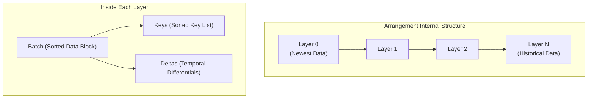
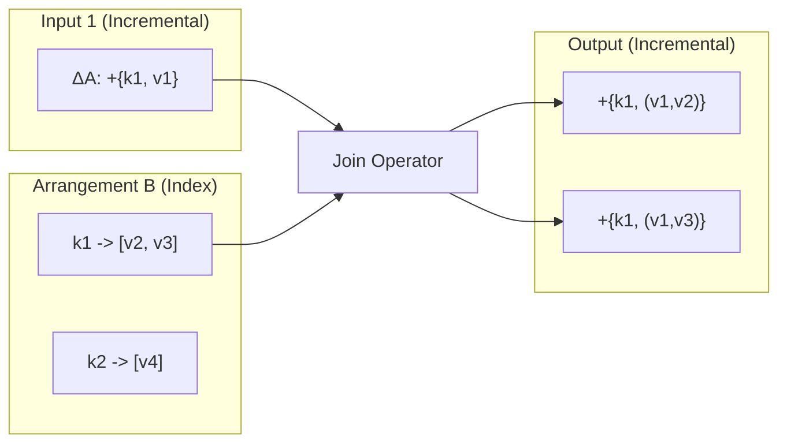
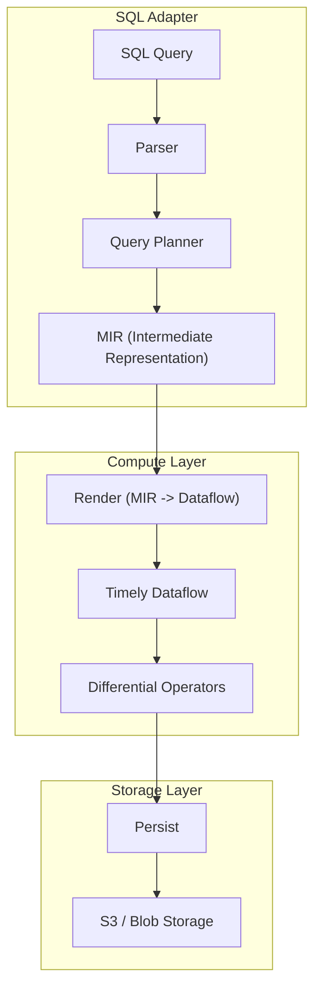
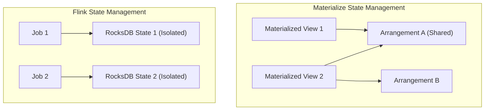

# Materialize Differential Dataflow Source Code Deep Dive

> **Stage**: Knowledge/Flink-Scala-Rust-Comprehensive | **Prerequisites**: [Timely Dataflow Paper] | **Formality Level**: L4

## 1. Project Structure

### 1.1 Directory Organization

Materialize is built on Differential Dataflow, with core dependencies on two open-source projects: Timely Dataflow and Differential Dataflow.

```
materialize/
├── src/
│   ├── adapter/           # SQL adapter layer (PostgreSQL protocol)
│   ├── compute/           # Compute layer (Timely/Differential)
│   │   ├── src/
│   │   │   ├── compute_state.rs
│   │   │   ├── render/
│   │   │   └── logging/
│   │   └── client/
│   ├── storage/           # Storage layer (Persist)
│   └── persist/           # Persistence implementation
└── misc/
    └── differential/      # Differential Dataflow integration
```

### 1.2 Differential Dataflow Project Structure

```
differential-dataflow/
├── src/
│   ├── lib.rs
│   ├── input.rs
│   ├── collection.rs
│   ├── operators/
│   │   ├── arrange.rs
│   │   ├── join.rs
│   │   ├── reduce.rs
│   │   └── iterate.rs
│   ├── trace/
│   │   ├── cursor.rs
│   │   └── implementations/
│   │       ├── ord.rs
│   │       └── spine.rs
│   └── dataflow.rs
└── timely/
    └── src/
        ├── worker.rs
        ├── dataflow.rs
        └── scheduling.rs
```

---

## 2. Core Module Analysis

### 2.1 Differential Dataflow Core

**Path**: `differential-dataflow/src/`

**Responsibilities**: Differential Dataflow provides a differential computation-based incremental computation framework; core abstractions are Collection and Arrangement.

**Key trait/struct**:

```rust
// differential-dataflow/src/collection.rs
pub struct Collection<G: Scope, D, R: Semigroup> {
    pub inner: Stream<G, (D, G::Timestamp, R)>,
    pub phantom: PhantomData<(D, R)>,
}

// differential-dataflow/src/operators/arrange.rs
pub struct Arranged<G, T>
where
    G: Scope,
    T: TraceReader,
{
    pub stream: Stream<G, T::Batch>,
    pub trace: T::Trace,
}

// differential-dataflow/src/trace/implementations/spine.rs
pub struct Spine<K, V, T, R>
where
    T: Lattice + Ord,
    R: Semigroup,
{
    pub layers: Vec<Layer<K, V, T, R>>,
    pub merging: Vec<Option<MergeState<K, V, T, R>>>,
    pub since: Antichain<T>,
}
```

**Source Analysis - Collection Differential Semantics**:

```rust
// differential-dataflow/src/collection.rs
impl<G: Scope, D: Data, R: Semigroup> Collection<G, D, R> {
    /// Merge two Collections
    pub fn concat(&self, other: &Self) -> Self {
        Collection {
            inner: self.inner.concat(&other.inner),
            phantom: PhantomData,
        }
    }

    /// Map operation (preserves differential semantics)
    pub fn map<D2, F>(&self, logic: F) -> Collection<G, D2, R>
    where
        D2: Data,
        F: Fn(D) -> D2 + 'static,
    {
        self.inner.map(move |(d, t, r)| (logic(d), t, r))
                  .as_collection()
    }

    /// Filter operation
    pub fn filter<F>(&self, logic: F) -> Self
    where
        F: Fn(&D) -> bool + 'static,
    {
        self.inner.filter(move |(d, _t, _r)| logic(d))
                  .as_collection()
    }

    /// Reduce operation (core: produces Arrangement)
    pub fn reduce<L, K, V2>(&self, logic: L) -> Collection<G, (K, V2), R>
    where
        K: Data,
        V2: Data,
        L: Fn(&K, &[(V, R)], &mut Vec<(V2, R)>) + 'static,
    {
        self.arrange_by_key()
            .reduce_named("Reduce", logic)
            .as_collection()
    }
}
```

### 2.2 Arrangement Implementation

**Path**: `differential-dataflow/src/operators/arrange.rs`

**Responsibilities**: Arrangement is the core optimization structure of Differential Dataflow, similar to an index, supporting efficient incremental queries.

**Source Analysis - ArrangeByKey**:

```rust
// differential-dataflow/src/operators/arrange.rs
impl<G: Scope, K: Data+Hashable, V: Data, R: Semigroup>
    ArrangeByKey<G, K, V, R> for Collection<G, (K, V), R>
{
    fn arrange_by_key(
        &self,
    ) -> Arranged<G, TraceAgent<OrdValSpine<K, V, G::Timestamp, R>>>
    {
        // Configure Trace capacity
        let mut trace = OrdValSpine::new();
        let mut buffer = Vec::new();

        self.inner.unary_frontier(Pipeline, "ArrangeByKey", move |cap, info| {
            move |input, output| {
                // Process input updates
                input.for_each(|time, data| {
                    data.swap(&mut buffer);

                    // Sort and group by key
                    buffer.sort_by(|((k1, _), _, _), ((k2, _), _, _)| k1.cmp(k2));

                    // Build Batch
                    let batch = OrdValBatch::from_data(
                        buffer.drain(..).map(|((k, v), t, r)| (k, v, t, r))
                    );

                    // Insert into Trace
                    trace.insert(batch);

                    // Output Batch downstream
                    output.session(&time).give(batch);
                });

                // Advance Frontier
                trace.advance_by(input.frontier().frontier());
            }
        })
        .arrange(trace)
    }
}
```

**Arrangement Structure Diagram**:



### 2.3 Time Processing and Progress Tracking

**Path**: `timely-dataflow/src/progress/`

**Responsibilities**: Timely Dataflow's core innovation is explicit timestamps and progress tracking, supporting iterative and cyclic dataflows.

**Key trait/struct**:

```rust
// timely-dataflow/src/progress/timestamp.rs
pub trait Timestamp: Clone+Ord+Debug+Send+Any {
    type Summary: PathSummary<Self>;
    fn minimum() -> Self;
}

// timely-dataflow/src/progress/frontier.rs
pub struct Antichain<T> {
    elements: Vec<T>,
}

impl<T: PartialOrder> Antichain<T> {
    /// Insert element while maintaining antichain property
    pub fn insert(&mut self, element: T) -> bool {
        if self.elements.iter().any(|e| e.less_equal(&element)) {
            return false;
        }
        self.elements.retain(|e| !element.less_equal(e));
        self.elements.push(element);
        true
    }

    /// Check if timestamp is in the successor set
    pub fn less_equal(&self, time: &T) -> bool {
        self.elements.iter().any(|e| e.less_equal(time))
    }
}
```

**Source Analysis - Frontier Update**:

```rust
// timely-dataflow/src/progress/frontier.rs
impl<T: Timestamp> MutableAntichain<T> {
    /// Update Frontier
    pub fn update_iter<I>(&mut self, updates: I) -> ChangeBatch<T>
    where
        I: IntoIterator<Item = (T, i64)>,
    {
        let mut changes = ChangeBatch::new();

        for (time, delta) in updates {
            let old_frontier = self.frontier().to_vec();

            // Update counts
            if delta > 0 {
                self.occurances.insert(time.clone(), delta as usize);
            } else {
                self.occurances.remove(&time);
            }

            // Compute new Frontier
            let new_frontier = self.rebuild_frontier();

            // Record changes
            for t in old_frontier.iter() {
                if !new_frontier.less_equal(t) {
                    changes.update(t.clone(), -1);
                }
            }
            for t in new_frontier.iter() {
                if !old_frontier.less_equal(t) {
                    changes.update(t.clone(), 1);
                }
            }
        }

        changes
    }
}
```

### 2.4 Incremental Computation Optimization

**Path**: `differential-dataflow/src/operators/join.rs`

**Responsibilities**: Join is the core operator of stream processing; Differential Dataflow achieves efficient incremental Join through shared Arrangements.

**Source Analysis - Delta Join**:

```rust
// differential-dataflow/src/operators/join.rs
impl<G, K, V1, V2, R1, R2> JoinCore<G, K, V2, R2> for Arranged<G, K, V1, R1>
where
    G: Scope,
    K: Data,
    V1: Data,
    V2: Data,
    R1: Semigroup,
    R2: Semigroup,
{
    fn join_core<V3, R3, F>(&self, other: &Arranged<G, K, V2, R2>, logic: F)
        -> Collection<G, (K, V3), R3>
    where
        V3: Data,
        R3: Semigroup,
        F: Fn(&K, &V1, &V2, &mut Vec<(V3, R3)>) + 'static,
    {
        // Get Traces from both Arrangements
        let trace1 = self.trace.clone();
        let trace2 = other.trace.clone();

        self.stream.binary_frontier(
            &other.stream,
            Pipeline,
            Pipeline,
            "Join",
            move |capability, info| {
                let mut trace1_cursor = trace1.cursor();
                let mut trace2_cursor = trace2.cursor();

                move |input1, input2, output| {
                    // Process incremental updates from left input
                    input1.for_each(|time, data| {
                        let mut session = output.session(&time);
                        for (key, val1, diff1) in data.iter() {
                            // Look up matches in right Arrangement
                            trace2_cursor.seek_key(key);
                            while trace2_cursor.key_valid() &&
                                  trace2_cursor.key() == key {
                                let val2 = trace2_cursor.val();
                                let diff2 = trace2_cursor.diff();

                                // Apply Join logic
                                let mut results = Vec::new();
                                logic(key, val1, val2, &mut results);

                                for (result, diff3) in results {
                                    let combined_diff =
                                        diff1.multiply(diff2).multiply(&diff3);
                                    session.give((
                                        (key.clone(), result),
                                        time.clone(),
                                        combined_diff,
                                    ));
                                }

                                trace2_cursor.step_val();
                            }
                        }
                    });

                    // Symmetrically process right input...
                }
            }
        )
    }
}
```

**Incremental Join Diagram**:



### 2.5 Strong Consistency Guarantee Mechanism

**Path**: `materialize/src/persist/src/`

**Responsibilities**: Materialize's Persist layer provides strict serializability guarantees.

**Key trait/struct**:

```rust
// src/persist/src/indexed/mod.rs
pub struct Indexed<K, V, T, D> {
    /// Write buffer
    log: Vec<(K, V, T, D)>,
    /// Indexed data
    traces: HashMap<Id, TraceArrangement<K, V, T, D>>,
    /// Persisted Frontier
    since: Antichain<T>,
    /// Upper bound timestamp
    upper: Antichain<T>,
}

// src/persist/src/s3.rs
pub struct S3Blob {
    client: S3Client,
    bucket: String,
    key_prefix: String,
}
```

**Source Analysis - Transactional Write**:

```rust
// src/persist/src/indexed/mod.rs
impl<K, V, T, D> Indexed<K, V, T, D> {
    /// Atomic batch write
    pub async fn write_batch(
        &mut self,
        batch: Vec<(K, V, T, D)>,
    ) -> Result<Upper<T>, Error> {
        // 1. Allocate new Upper
        let new_upper = self.advance_upper();

        // 2. Verify all timestamps are less than new_upper
        for (_, _, ts, _) in &batch {
            if !self.upper.less_equal(ts) {
                return Err(Error::InvalidTimestamp);
            }
        }

        // 3. Write WAL (Write-Ahead Log)
        let wal_entry = WalEntry::Batch {
            data: batch.clone(),
            upper: new_upper.clone(),
        };
        self.blob.write_wal(wal_entry).await?;

        // 4. Update in-memory index
        self.log.extend(batch);

        // 5. Trigger async Compaction
        if self.log.len() > self.compaction_threshold {
            self.trigger_compaction().await?;
        }

        Ok(Upper(new_upper))
    }

    /// Get consistent snapshot
    pub async fn snapshot(
        &self,
        as_of: Antichain<T>,
    ) -> Result<Snapshot<K, V, T, D>, Error> {
        // Verify as_of is valid
        if !self.since.less_equal(&as_of) {
            return Err(Error::SnapshotBeforeSince);
        }

        // Merge all relevant Traces
        let mut cursor = Cursor::new();
        for trace in self.traces.values() {
            trace.cursor().seek(&as_of);
            while cursor.valid() {
                // Collect data
            }
        }

        Ok(Snapshot { cursor, as_of })
    }
}
```

---

## 3. Data Flow Analysis

### 3.1 Query Rendering Pipeline



### 3.2 Materialized View Maintenance Flow

```rust
// src/compute/src/render/mod.rs
pub fn render_mir_plan(
    scope: &mut G,
    plan: Plan,
    sources: &SourceConnector,
) -> Collection<G, Row, Diff> {
    match plan {
        Plan::Constant { rows } => {
            // Constant data
            scope.new_collection_from(rows).1
        }
        Plan::Get { id } => {
            // Get source or index
            sources.get(&id).expect("source not found")
        }
        Plan::Project { input, outputs } => {
            // Projection
            let input_collection = render_mir_plan(scope, *input, sources);
            input_collection.map(move |row| {
                Row::pack(outputs.iter().map(|i| row[*i]))
            })
        }
        Plan::Join { inputs, plan } => {
            // Join
            let input1 = render_mir_plan(scope, inputs.into_iter().next().unwrap(), sources);
            let input2 = render_mir_plan(scope, inputs.into_iter().next().unwrap(), sources);

            // Create Arrangements
            let arranged1 = input1.arrange_by_key();
            let arranged2 = input2.arrange_by_key();

            // Incremental Join
            arranged1.join_core(&arranged2, |k, v1, v2, output| {
                output.push((Row::pack(k.iter().chain(v1.iter()).chain(v2.iter())), 1));
            })
        }
        Plan::Reduce { input, key, aggregates } => {
            // Aggregation
            let input_collection = render_mir_plan(scope, *input, sources);

            input_collection
                .map(move |row| (Row::pack(key.iter().map(|i| row[*i])), row))
                .arrange_by_key()
                .reduce(move |_key, source, target| {
                    // Compute aggregate values
                    let mut accumulators: Vec<_> = aggregates.iter()
                        .map(|agg| agg.create_accumulator())
                        .collect();

                    for (row, diff) in source {
                        for (i, agg) in aggregates.iter().enumerate() {
                            accumulators[i].update(row, *diff);
                        }
                    }

                    // Output aggregate result
                    let result = Row::pack(accumulators.iter().map(|a| a.finish()));
                    target.push((result, 1));
                })
                .as_collection()
        }
        _ => unimplemented!(),
    }
}
```

---

## 4. Key Algorithms

### 4.1 Differential Dataflow Core Algorithm

**Pseudocode**:

```
Algorithm: Differential Dataflow Update

Input: Update (data, time, diff)
Output: Propagated changes through dataflow graph

1. For each operator in topological order:
   a. Collect input updates at current time

   b. If operator is stateless (map, filter):
      - Apply function to each element
      - Emit output updates with same time and diff

   c. If operator is stateful (reduce, join):
      - Update internal trace with new updates
      - Compute output differences
      - For Join: look up matching keys in other input's trace
      - For Reduce: recompute aggregates for affected keys
      - Emit delta updates

   d. Advance frontier if all inputs have progressed

2. Repeat until no more updates at current time

3. Propagate to next timestamp in partial order
```

**Rust Implementation** (differential-dataflow/src/operators/reduce.rs):

```rust
/// Reduce operation core implementation
pub fn reduce_implementation<K, V1, V2, T, R1, R2>(
    source: &Collection<(K, V1), T, R1>,
    logic: impl Fn(&K, &[(V1, R1)], &mut Vec<(V2, R2)>),
) -> Collection<(K, V2), T, R2>
where
    K: Data+Hash,
    V1: Data,
    V2: Data,
    T: Lattice+Ord,
    R1: Semigroup,
    R2: Semigroup,
{
    source.arrange_by_key().reduce_named("Reduce", logic)
}

/// Incremental Reduce on Trace
impl<K, V, T, R> TraceReader for Spine<K, V, T, R> {
    fn reduce<L, V2, R2>(&self, logic: L) -> Collection<(K, V2), T, R2>
    where
        L: Fn(&K, &[(V, R)], &mut Vec<(V2, R2)>),
    {
        // Iterate all keys
        let mut cursor = self.cursor();
        while cursor.key_valid() {
            let key = cursor.key();

            // Collect all (value, diff) pairs for this key
            let mut values = Vec::new();
            while cursor.val_valid() {
                let val = cursor.val();
                let diffs = cursor.diffs();
                for (time, diff) in diffs {
                    values.push((val.clone(), diff.clone()));
                }
                cursor.step_val();
            }

            // Apply Reduce logic
            let mut output = Vec::new();
            logic(key, &values, &mut output);

            // Output results
            for (v2, r2) in output {
                emit((key.clone(), v2), r2);
            }

            cursor.step_key();
        }
    }
}
```

### 4.2 Spine Merge Strategy

```rust
// differential-dataflow/src/trace/implementations/spine.rs
impl<K, V, T, R> Spine<K, V, T, R> {
    /// Insert new Batch, trigger level merging
    pub fn insert(&mut self, batch: Batch<K, V, T, R>) {
        // Find appropriate level
        let mut level = 0;
        let mut batch = Some(batch);

        while let Some(b) = batch.take() {
            if level >= self.layers.len() {
                self.layers.push(Layer::new());
                self.merging.push(None);
            }

            if self.merging[level].is_none() {
                // Level is free, insert directly
                self.merging[level] = Some(MergeState::Single(b));
            } else {
                // Need merge
                let existing = self.merging[level].take().unwrap();
                batch = Some(self.merge_batches(existing, b, level));
            }

            level += 1;
        }
    }

    /// Merge two Batches
    fn merge_batches(
        &mut self,
        left: MergeState<K, V, T, R>,
        right: Batch<K, V, T, R>,
        level: usize,
    ) -> Batch<K, V, T, R> {
        // Merge two sorted Batches using merge sort
        let mut result = Batch::new();

        let (iter1, iter2) = (left.iter(), right.iter());

        // Merge two iterators
        let merged = MergeIterator::new(iter1, iter2);

        for ((k, v, t), r) in merged {
            // Merge diffs for same key
            if result.last().map(|(k2, _, _)| k2 == k).unwrap_or(false) {
                result.merge_last((k, v, t), r);
            } else {
                result.push((k, v, t), r);
            }
        }

        result
    }
}
```

---

## 5. Comparison with Flink

| Dimension | Materialize (Differential) | Apache Flink |
|-----------|---------------------------|--------------|
| **Computation Model** | Differential Dataflow | Dataflow (Chandy-Lamport) |
| **Time Semantics** | Explicit partial-order timestamps (Lattice) | Event Time + Watermark |
| **State Management** | Arrangement (indexed) | Keyed State (RocksDB) |
| **Incremental Computation** | Native support (Diff propagation) | Requires manual implementation |
| **Consistency** | Strict Serializable | Exactly-Once |
| **Iterative Computation** | Native support (cyclic dataflow) | Requires external iteration |
| **Shared State** | Arrangement shared across queries | State isolation |
| **SQL Support** | Native (PostgreSQL) | Flink SQL |

### 5.1 State Management Comparison



### 5.2 Architecture Design Decision Comparison

| Decision Point | Materialize | Flink |
|----------------|-------------|-------|
| Why Differential | Academic prototype, strict consistency | Industrial maturity, throughput priority |
| State Sharing | Arrangement auto-shared | Manual optimization |
| Time Model | Partial-order timestamps | Total-order event time |
| Deployment Mode | Cloud-native SaaS | Self-hosted / Cloud service |
| Applicable Scenario | Strong-consistency OLAP | High-throughput ETL |

---

## 6. References
