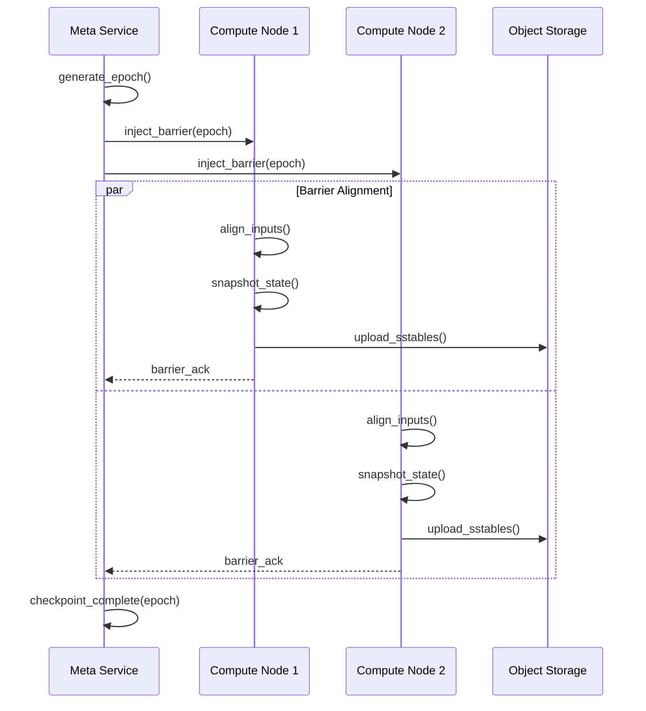
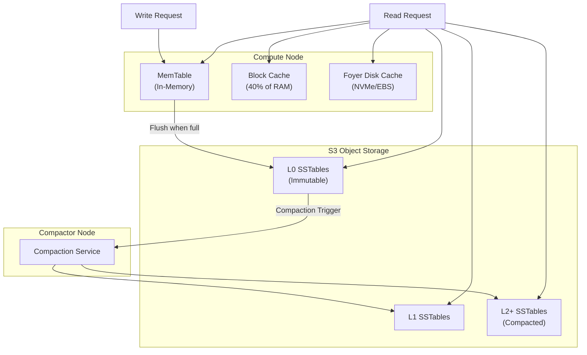
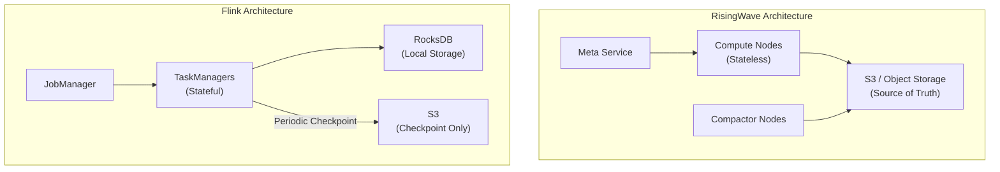

# RisingWave Architecture In-Depth Source Code Analysis

> Stage: Knowledge/Flink-Scala-Rust-Comprehensive | Prerequisites: [Rust LSM-tree Storage Principles] | Formalization Level: L4

## 1. Project Structure

### 1.1 Directory Organization

RisingWave is a distributed stream processing database written in Rust. Its source code follows a modular crate design:

```
risingwave/
├── src/
│   ├── meta/              # Meta Service
│   ├── frontend/          # SQL frontend and query optimization
│   ├── compute/           # Compute Node
│   ├── stream/            # Stream processing execution engine
│   ├── batch/             # Batch processing execution engine
│   ├── storage/           # Storage layer (Hummock)
│   │   ├── hummock/       # Hummock LSM-tree engine
│   │   └── compactor/     # Compaction service
│   ├── expr/              # Expressions and UDFs
│   ├── connector/         # Source connectors
│   └── common/            # Common components
├── proto/                 # Protocol Buffer definitions
└── tests/                 # Integration tests
```

### 1.2 Crate Division

| Crate | Path | Responsibility |
|-------|------|----------------|
| `risingwave_meta` | `src/meta/` | Cluster metadata management, Barrier coordination |
| `risingwave_compute` | `src/compute/` | Compute node entrypoint |
| `risingwave_stream` | `src/stream/` | Stream processing operator implementations |
| `risingwave_storage` | `src/storage/` | Storage engine abstraction |
| `risingwave_hummock_sdk` | `src/storage/hummock_sdk/` | Hummock client SDK |
| `risingwave_compactor` | `src/storage/compactor/` | Compaction service |
| `risingwave_frontend` | `src/frontend/` | SQL parsing and optimization |

---

## 2. Core Module Analysis

### 2.1 Meta Service Implementation (src/meta/)

**Path**: `src/meta/src/`

**Responsibility**: Meta Service is the brain of RisingWave, responsible for cluster metadata management, Barrier injection, Checkpoint coordination, and scheduling decisions.

**Key trait/struct**:

```rust
// src/meta/src/rpc/server.rs
pub struct MetaService {
    pub catalog_manager: Arc<CatalogManager>,
    pub fragment_manager: Arc<FragmentManager>,
    pub barrier_manager: Arc<BarrierManager>,
    pub hummock_manager: Arc<HummockManager>,
}

// src/meta/src/barrier/mod.rs
pub struct BarrierManager {
    pub epoch_generator: EpochGenerator,
    pub barrier_scheduler: BarrierScheduler,
    pub checkpoint_frequency: AtomicU32,
}
```

**Source Code Analysis - Barrier Injection Mechanism**:

```rust
// src/meta/src/barrier/mod.rs
impl BarrierManager {
    /// Inject global Barrier, trigger Checkpoint
    async fn inject_barrier(&self, command: Command) -> Result<()> {
        let epoch = self.epoch_generator.generate();

        // 1. Build Barrier message
        let barrier = Barrier {
            epoch,
            kind: BarrierKind::Checkpoint,
            prev_epoch: self.get_prev_epoch(),
        };

        // 2. Send Barrier to all Compute Nodes
        let futures = self.compute_clients.iter().map(|client| {
            client.send_barrier(barrier.clone(), command.clone())
        });

        // 3. Wait for all node acknowledgments (Chandy-Lamport algorithm)
        try_join_all(futures).await?;

        // 4. Update global Epoch
        self.update_epoch(epoch).await?;

        Ok(())
    }
}
```

**Barrier Coordination Flow**:



### 2.2 Compute Node (src/compute/)

**Path**: `src/compute/src/`

**Responsibility**: Compute Node is the stream processing execution engine, managing Actor lifecycles, processing Barriers, and executing stream operators.

**Key trait/struct**:

```rust
// src/compute/src/server.rs
pub struct ComputeNode {
    pub config: ComputeNodeConfig,
    pub streaming_manager: Arc<StreamingManager>,
    pub batch_executor: Arc<BatchExecutor>,
    pub state_store: StateStoreImpl,
}

// src/stream/src/task/stream_manager.rs
pub struct StreamingManager {
    pub actors: HashMap<ActorId, ActorHandle>,
    pub barrier_manager: Arc<LocalBarrierManager>,
    pub state_store: StateStoreImpl,
}
```

**Source Code Analysis - Actor Lifecycle Management**:

```rust
// src/stream/src/task/stream_manager.rs
impl StreamingManager {
    /// Create and start an Actor
    pub async fn create_actor(
        &self,
        actor_id: ActorId,
        fragment_id: FragmentId,
        nodes: StreamNode,
    ) -> Result<()> {
        // 1. Build Actor context
        let context = ActorContext {
            actor_id,
            fragment_id,
            state_store: self.state_store.clone(),
            barrier_manager: self.barrier_manager.clone(),
        };

        // 2. Recursively build operator chain
        let executor = self.build_executor(nodes, &context).await?;

        // 3. Create Actor task
        let actor = Actor::new(
            actor_id,
            executor,
            self.barrier_manager.clone(),
        );

        // 4. Spawn Actor to runtime
        let handle = tokio::spawn(actor.run());
        self.actors.insert(actor_id, handle);

        Ok(())
    }

    /// Recursively build execution operator
    async fn build_executor(
        &self,
        node: StreamNode,
        context: &ActorContext,
    ) -> Result<BoxedExecutor> {
        match node.node_body {
            // Source operator
            NodeBody::Source(source) => {
                SourceExecutor::new(source, context).await
            }
            // Project operator
            NodeBody::Project(project) => {
                let child = self.build_executor(*project.input, context).await?;
                ProjectExecutor::new(project, child)
            }
            // Hash Join operator
            NodeBody::HashJoin(join) => {
                let left = self.build_executor(*join.left, context).await?;
                let right = self.build_executor(*join.right, context).await?;
                HashJoinExecutor::new(join, left, right, context).await
            }
            // Aggregate operator
            NodeBody::HashAgg(agg) => {
                let child = self.build_executor(*agg.input, context).await?;
                HashAggExecutor::new(agg, child, context).await
            }
            _ => unimplemented!(),
        }
    }
}
```

### 2.3 Hummock Storage Engine (src/storage/hummock/)

**Path**: `src/storage/src/hummock/`

**Responsibility**: Hummock is RisingWave's self-developed LSM-tree storage engine, designed for stream processing scenarios with S3 as the primary storage.

**Key trait/struct**:

```rust
// src/storage/src/hummock/store.rs
pub struct HummockStorage {
    /// Local MemTable (write buffer)
    pub mem_table: Arc<RwLock<MemTable>>,
    /// Local cache
    pub block_cache: BlockCache,
    /// S3 object store client
    pub object_store: Arc<dyn ObjectStore>,
    /// Hummock version management
    pub version_manager: Arc<VersionManager>,
    /// Event handler
    pub event_handler: Arc<HummockEventHandler>,
}

// src/storage/src/hummock/sstable/mod.rs
pub struct Sstable {
    pub id: SstableId,
    pub meta: SstableMeta,
    pub data: Bytes,
}

pub struct SstableMeta {
    pub block_metas: Vec<BlockMeta>,
    pub bloom_filter: Vec<u8>,
    pub estimated_size: u32,
}
```

**Source Code Analysis - LSM-tree Write Path**:

```rust
// src/storage/src/hummock/store.rs
impl HummockStorage {
    /// Write key-value pair
    pub async fn put(&self, key: Bytes, value: Bytes) -> Result<()> {
        // 1. Write to MemTable (in-memory)
        let mut mem_table = self.mem_table.write().await;
        mem_table.insert(key, value);

        // 2. Check if flush is needed
        if mem_table.size() >= self.config.mem_table_size_limit {
            self.flush_memtable().await?;
        }

        Ok(())
    }

    /// Flush MemTable to S3
    async fn flush_memtable(&self) -> Result<()> {
        let mem_table = self.mem_table.read().await;

        // 1. Build SSTable
        let sstable = self.build_sstable(&mem_table).await?;

        // 2. Upload to S3
        let path = format!("hummock/{}/{}.sst", self.table_id, sstable.id);
        self.object_store.put(&path, sstable.data).await?;

        // 3. Update metadata
        self.version_manager.register_sstable(sstable.meta).await?;

        // 4. Clear MemTable
        mem_table.clear();

        Ok(())
    }

    /// Read key (tiered lookup)
    pub async fn get(&self, key: &[u8]) -> Result<Option<Bytes>> {
        // 1. Check MemTable first
        if let Some(value) = self.mem_table.read().await.get(key) {
            return Ok(Some(value.clone()));
        }

        // 2. Check local Block Cache
        if let Some(block) = self.block_cache.get(key).await {
            return Ok(self.find_in_block(&block, key));
        }

        // 3. Read SSTable from S3 by version
        let version = self.version_manager.current_version().await;
        for level in &version.levels {
            for sstable in &level.sstables {
                // 3.1 Bloom Filter pre-filtering
                if !self.bloom_filter_might_contain(sstable, key) {
                    continue;
                }

                // 3.2 Read block from S3
                let block = self.read_sstable_block(sstable, key).await?;
                self.block_cache.insert(key, block.clone()).await;

                if let Some(value) = self.find_in_block(&block, key) {
                    return Ok(Some(value));
                }
            }
        }

        Ok(None)
    }
}
```

**Hummock Data Flow Diagram**:



### 2.4 Compactor Implementation (src/storage/compactor/)

**Path**: `src/storage/compactor/src/`

**Responsibility**: Compactor performs LSM-tree Compaction in the background, merging SSTables and cleaning up expired data.

**Key trait/struct**:

```rust
// src/storage/compactor/src/compactor.rs
pub struct Compactor {
    pub context: CompactorContext,
    pub compaction_scheduler: Arc<dyn CompactionScheduler>,
    pub object_store: Arc<dyn ObjectStore>,
}

// src/storage/src/hummock/compaction/mod.rs
pub struct CompactionTask {
    pub input_sstables: Vec<SstableInfo>,
    pub output_level: u32,
    pub target_file_size: u64,
    pub compression_algorithm: CompressionAlgorithm,
}
```

**Source Code Analysis - Block-Level Compaction Optimization**:

```rust
// src/storage/src/hummock/compaction/compactor.rs
impl Compactor {
    /// Execute compaction task
    pub async fn compact(&self, task: CompactionTask) -> Result<Vec<SstableInfo>> {
        let mut output_sstables = Vec::new();
        let mut current_sstable_builder = SstableBuilder::new(
            task.target_file_size,
            task.compression_algorithm,
        );

        // 1. Merge-sort input SSTables
        let merge_iterator = self.create_merge_iterator(&task.input_sstables).await?;

        // 2. Iterate merged key-value pairs
        while let Some((key, value)) = merge_iterator.next().await? {
            // Block-level optimization: if current block has no overlap with upper level, copy directly
            if self.can_fast_copy(&key, &task.input_sstables) {
                // Direct copy non-overlapping block, avoiding decompression/recompression
                current_sstable_builder.fast_copy_block(&key, &value)?;
            } else {
                // Block needs merging, decompress and process
                current_sstable_builder.add(key, value)?;
            }

            // 3. SSTable size reaches limit, flush
            if current_sstable_builder.size() >= task.target_file_size {
                let sstable = current_sstable_builder.finish().await?;
                let sstable_info = self.upload_sstable(&sstable).await?;
                output_sstables.push(sstable_info);
                current_sstable_builder = SstableBuilder::new(
                    task.target_file_size,
                    task.compression_algorithm,
                );
            }
        }

        // 4. Flush remaining SSTable
        if !current_sstable_builder.is_empty() {
            let sstable = current_sstable_builder.finish().await?;
            let sstable_info = self.upload_sstable(&sstable).await?;
            output_sstables.push(sstable_info);
        }

        Ok(output_sstables)
    }
}
```

---

## 3. Data Flow Analysis

### 3.1 Stream Processing Pipeline Source Tracing

```rust
// src/stream/src/executor/mod.rs
pub trait Executor: Send + 'static {
    fn execute(self: Box<Self>) -> BoxedMessageStream;
}

pub struct ExecutorInfo {
    pub schema: Schema,
    pub pk_indices: Vec<usize>,
    pub identity: String,
}

// Message type definitions
pub enum Message {
    /// Data chunk
    Chunk(StreamChunk),
    /// Barrier (Checkpoint signal)
    Barrier(Barrier),
    /// Watermark (for advancing windows)
    Watermark(Watermark),
}

pub struct StreamChunk {
    pub data: DataChunk,
    pub ops: Vec<Op>,  // Op types: Insert/Delete/Update
}
```

**Data Flow Execution Process**:


### 3.2 Checkpoint Data Flow

```rust
// src/stream/src/executor/hash_agg.rs
impl HashAggExecutor {
    async fn execute_inner(self) {
        let mut state_tables: HashMap<Key, StateTable> = HashMap::new();

        #[for_await]
        for msg in self.input.execute() {
            match msg? {
                Message::Chunk(chunk) => {
                    // Process data chunk, update state tables
                    self.apply_chunk(&chunk, &mut state_tables).await?;
                }
                Message::Barrier(barrier) => {
                    // Barrier arrived, trigger Checkpoint
                    if barrier.kind == BarrierKind::Checkpoint {
                        // 1. Flush state to Hummock
                        for (key, table) in &state_tables {
                            table.commit(barrier.epoch).await?;
                        }

                        // 2. Acknowledge Barrier
                        self.barrier_manager.ack_barrier(barrier.epoch)?;
                    }
                }
                _ => {}
            }
        }
    }
}
```

---

## 4. Key Algorithms

### 4.1 Chandy-Lamport Checkpoint Algorithm

**Pseudocode**:

```
Algorithm: Distributed Snapshot (Chandy-Lamport)

Initiator (Meta Service):
  1. Record local state
  2. Send MARKER to all outgoing channels
  3. Wait for all MARKER ACKs

Participant (Compute Node):
  On receiving MARKER from channel C:
    If not recorded:
      1. Record local state
      2. Send MARKER to all outgoing channels (except C)
      3. Record messages from C after this MARKER
    Else:
      1. Record messages from C before this MARKER

  On receiving regular message:
    1. Process message normally
    2. If MARKER received, store in channel state
```

**Rust Implementation** (src/meta/src/barrier/mod.rs):

```rust
/// Coordinate distributed Checkpoint
async fn coordinate_checkpoint(&self) -> Result<()> {
    let checkpoint_epoch = self.generate_epoch();

    // 1. Inject Barrier (equivalent to Chandy-Lamport MARKER)
    let injection_result = self.inject_barrier_to_all_nodes(
        Barrier::new_checkpoint(checkpoint_epoch)
    ).await?;

    // 2. Wait for all Compute Nodes to complete alignment and snapshot
    let timeout = Duration::from_secs(30);
    match timeout(timeout, self.collect_barrier_acks(checkpoint_epoch)).await {
        Ok(_) => {
            // 3. Checkpoint complete, update metadata
            self.hummock_manager.commit_epoch(checkpoint_epoch).await?;
            info!("Checkpoint {} completed", checkpoint_epoch);
        }
        Err(_) => {
            // Timeout, trigger recovery flow
            self.trigger_recovery(checkpoint_epoch).await?;
        }
    }

    Ok(())
}
```

### 4.2 LSM-tree Compaction Strategy

**RisingWave Compaction Levels**:

```rust
// src/storage/src/hummock/compaction/level.rs
pub struct LevelConfig {
    /// L0 size threshold (triggers L0->L1 Compaction)
    pub l0_threshold_size: u64,
    /// Level size amplification factor
    pub level_size_multiplier: u32,
    /// Maximum number of levels
    pub max_levels: u32,
}

/// Tiered Compaction policy
pub struct TieredCompactionPolicy {
    pub config: LevelConfig,
}

impl CompactionPolicy for TieredCompactionPolicy {
    fn select_compaction_tasks(
        &self,
        version: &HummockVersion,
    ) -> Vec<CompactionTask> {
        let mut tasks = Vec::new();

        // 1. Check L0->L1 Compaction
        let l0_size: u64 = version.levels[0].sstables.iter()
            .map(|s| s.file_size).sum();

        if l0_size >= self.config.l0_threshold_size {
            tasks.push(CompactionTask {
                input_sstables: version.levels[0].sstables.clone(),
                output_level: 1,
                target_file_size: 256 * 1024 * 1024, // 256MB
                compression_algorithm: CompressionAlgorithm::Lz4,
            });
        }

        // 2. Check deep Compaction
        for level in 1..version.levels.len() {
            let level_size: u64 = version.levels[level].sstables.iter()
                .map(|s| s.file_size).sum();
            let target_size = self.config.base_level_size
                * self.config.level_size_multiplier.pow(level as u32);

            if level_size > target_size {
                tasks.push(self.create_level_compaction_task(
                    level, &version.levels[level]
                ));
            }
        }

        tasks
    }
}
```

---

## 5. Comparison with Flink

| Dimension | RisingWave | Apache Flink |
|-----------|------------|--------------|
| **Architecture Pattern** | Storage-compute separation (S3 primary storage) | Storage-compute coupled (RocksDB local storage) |
| **State Backend** | Hummock (self-developed LSM-tree) | RocksDB / Heap |
| **Checkpoint** | Epoch-based, 1-second interval | Barrier-based, 30 seconds - 5 minutes |
| **Storage Cost** | ~$23/TB/month (S3) | ~$80-200/TB/month (SSD) |
| **Recovery Time** | Second-level (independent of state size) | 5-30 minutes (requires RocksDB rebuild) |
| **Scaling** | Stateless migration, instant effect | Requires Savepoint restart |
| **SQL Support** | Native PostgreSQL protocol | Flink SQL (requires connectors) |
| **Materialized Views** | First-class citizen | Requires external system support |

### 5.1 In-Depth Architecture Difference Analysis

**Storage Layer Difference**:



**Key Design Decision Comparison**:

| Decision Point | RisingWave | Flink |
|----------------|------------|-------|
| Why S3 | Cloud-native design, infinite scalability | Historical baggage, mature RocksDB |
| Compaction Location | Dedicated Compactor nodes | Same node as computation |
| Barrier Semantics | Epoch-based MVCC | Chandy-Lamport |
| Cache Strategy | Multi-tier cache (Mem + NVMe) | RocksDB Block Cache |

---

## 6. References
