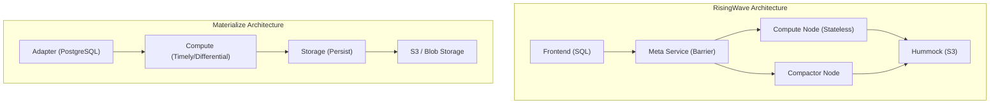
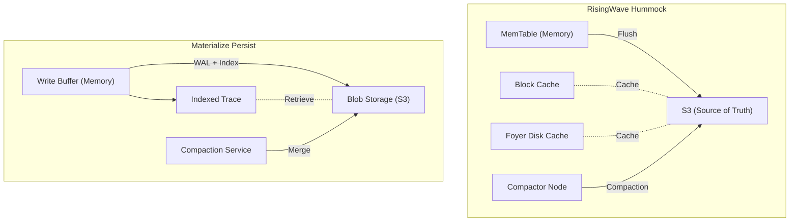

# RisingWave vs Materialize Architecture Comparative Source Analysis

> Stage: Knowledge/Flink-Scala-Rust-Comprehensive | Prerequisites: [RisingWave Architecture Analysis, Materialize Analysis] | Formalization Level: L4

## 1. Project Structure Comparison

### 1.1 Overall Architecture Differences



### 1.2 Crate Structure Comparison

| RisingWave | Materialize | Responsibility Comparison |
|------------|-------------|---------------------------|
| `risingwave_meta` | `mz-adapter` + `mz-compute-client` | RisingWave Meta centralized; Materialize decentralized |
| `risingwave_compute` | `mz-compute` | Both are compute nodes, but architectures differ |
| `risingwave_storage` | `mz-storage` | Storage layer abstraction |
| `risingwave_hummock_sdk` | `mz-persist` | Hummock vs Persist |
| `risingwave_compactor` | `mz-persist::compaction` | Standalone Compactor vs Integrated |
| `risingwave_frontend` | `mz-adapter::sql` | SQL parsing layer |
| `risingwave_expr` | `mz-expr` | Expression evaluation |
| `risingwave_stream` | `mz-compute::render` | Stream processing execution |

---

## 2. Storage Layer Comparison

### 2.1 Hummock vs RocksDB (Materialize Persist)

**Path Locations**:

- RisingWave: `src/storage/src/hummock/`
- Materialize: `src/persist/src/`

**Architecture Comparison**:

| Feature | RisingWave Hummock | Materialize Persist | Description |
|---------|-------------------|---------------------|-------------|
| **Storage Medium** | S3 as primary storage, local as cache | S3 + local cache | |
| **Data Structure** | LSM-tree | LSM-tree variant | |
| **Compaction** | Standalone Compactor node | Integrated in Storage service | |
| **Version Management** | Epoch-based MVCC | Timestamp-based | |
| **Data Format** | SSTable (custom) | Blob + index | |

**Source Comparison — Write Path**:

```rust
// === RisingWave: src/storage/src/hummock/store.rs ===
impl HummockStorage {
    pub async fn put(&self, key: Bytes, value: Bytes) -> Result<()> {
        // 1. Write to MemTable (memory)
        let mut mem_table = self.mem_table.write().await;
        mem_table.insert(key, value);

        // 2. Check if flush to S3 is needed
        if mem_table.size() >= self.config.mem_table_size_limit {
            self.flush_memtable_to_s3().await?;
        }

        Ok(())
    }

    async fn flush_memtable_to_s3(&self) -> Result<()> {
        let mem_table = self.mem_table.read().await;

        // Build SSTable
        let sstable = self.build_sstable(&mem_table).await?;

        // Upload directly to S3
        let path = format!("hummock/{}/{}.sst", self.table_id, sstable.id);
        self.object_store.put(&path, sstable.data).await?;

        // Update metadata
        self.version_manager.register_sstable(sstable.meta).await?;

        Ok(())
    }
}

// === Materialize: src/persist/src/indexed/mod.rs ===
impl Indexed<K, V, T, D> {
    pub async fn write_batch(
        &mut self,
        batch: Vec<(K, V, T, D)>,
    ) -> Result<Upper<T>, Error> {
        // 1. Allocate new Upper timestamp
        let new_upper = self.advance_upper();

        // 2. Write WAL
        let wal_entry = WalEntry::Batch {
            data: batch.clone(),
            upper: new_upper.clone(),
        };
        self.blob.write_wal(wal_entry).await?;

        // 3. Update in-memory index
        self.log.extend(batch);

        // 4. Async Compaction (non-blocking)
        if self.log.len() > self.compaction_threshold {
            self.trigger_compaction().await?;
        }

        Ok(Upper(new_upper))
    }
}
```

**Storage Layer Architecture Comparison Diagram**:



### 2.2 Compaction Strategy Comparison

```rust
// === RisingWave: Block-level Compaction ===
// src/storage/src/hummock/compaction/compactor.rs
impl Compactor {
    pub async fn compact(&self, task: CompactionTask) -> Result<Vec<SstableInfo>> {
        let merge_iterator = self.create_merge_iterator(&task.input_sstables).await?;

        while let Some((key, value)) = merge_iterator.next().await? {
            // Block-level optimization: copy non-overlapping blocks directly
            if self.can_fast_copy(&key, &task.input_sstables) {
                // Avoid decompression/recompression
                current_sstable_builder.fast_copy_block(&key, &value)?;
            } else {
                // Blocks that need merging
                current_sstable_builder.add(key, value)?;
            }
        }

        // Upload merged SSTable
        self.upload_sstables(output_sstables).await
    }
}

// === Materialize: Trace Merge ===
// differential-dataflow/src/trace/implementations/spine.rs
impl<K, V, T, R> Spine<K, V, T, R> {
    pub fn insert(&mut self, batch: Batch<K, V, T, R>) {
        let mut level = 0;
        let mut batch = Some(batch);

        // Level merging strategy (similar to LSM-tree)
        while let Some(b) = batch.take() {
            if level >= self.layers.len() {
                self.layers.push(Layer::new());
            }

            if self.merging[level].is_none() {
                self.merging[level] = Some(MergeState::Single(b));
            } else {
                // Merge data at current level
                let existing = self.merging[level].take().unwrap();
                batch = Some(self.merge_batches(existing, b));
            }

            level += 1;
        }
    }
}
```

---

## 3. Compute Layer Comparison

### 3.1 Pull vs Push Execution Model

**RisingWave (Push-based Actor Model)**:

```rust
// src/stream/src/executor/mod.rs
pub trait Executor: Send + 'static {
    fn execute(self: Box<Self>) -> BoxedMessageStream;
}

pub enum Message {
    Chunk(StreamChunk),      // Data push
    Barrier(Barrier),        // Checkpoint signal
    Watermark(Watermark),    // Time progress
}

// src/stream/src/executor/hash_join.rs
impl HashJoinExecutor {
    async fn execute_inner(self) {
        #[for_await]
        for msg in self.input.execute() {
            match msg? {
                Message::Chunk(chunk) => {
                    // Proactively process arrived data
                    self.process_chunk(chunk).await?;
                }
                Message::Barrier(barrier) => {
                    // Respond to Checkpoint signal
                    self.checkpoint(barrier).await?;
                }
                _ => {}
            }
        }
    }
}
```

**Materialize (Pull-based Differential)**:

```rust
// differential-dataflow/src/operators/join.rs
impl<G, K, V1, V2, R1, R2> JoinCore for Arranged<G, K, V1, R1> {
    fn join_core(&self, other: &Arranged<G, K, V2, R2>, logic: F)
        -> Collection<G, (K, V3), R3>
    {
        self.stream.binary_frontier(
            &other.stream,
            "Join",
            move |capability, info| {
                let mut trace1_cursor = trace1.cursor();
                let mut trace2_cursor = trace2.cursor();

                move |input1, input2, output| {
                    // Process data only when pulled
                    input1.for_each(|time, data| {
                        // Search for matches in the right Trace
                        trace2_cursor.seek_key(key);
                        while trace2_cursor.key_valid() {
                            // Produce Join result
                            session.give(result);
                        }
                    });
                }
            }
        )
    }
}
```

**Execution Model Comparison**:

| Feature | RisingWave (Push) | Materialize (Pull) |
|---------|-------------------|--------------------|
| **Drive Mode** | Data arrival driven | Query demand driven |
| **Latency** | Low end-to-end latency | On-demand latency |
| **Resource Utilization** | Continuous computation | Lazy evaluation |
| **Backpressure** | Requires explicit handling | Natural backpressure |
| **Applicable Scenario** | Continuous stream processing | Interactive queries |

### 3.2 State Management Comparison

**RisingWave State Management**:

```rust
// src/stream/src/executor/hash_agg.rs
pub struct HashAggExecutor {
    /// In-memory state table
    state_tables: HashMap<Key, StateTable>,
    /// State storage backend
    state_store: StateStoreImpl,
}

impl HashAggExecutor {
    async fn process_chunk(&mut self, chunk: StreamChunk) -> Result<()> {
        for (key, value) in chunk.rows() {
            // Update in-memory state
            let table = self.state_tables.entry(key).or_insert(
                StateTable::new(self.state_store.clone())
            );
            table.update(value).await?;
        }
        Ok(())
    }

    async fn checkpoint(&mut self, barrier: Barrier) -> Result<()> {
        // Flush state to Hummock
        for (key, table) in &self.state_tables {
            table.commit(barrier.epoch).await?;
        }
        Ok(())
    }
}
```

**Materialize State Management**:

```rust
// differential-dataflow/src/operators/arrange.rs
pub struct Arranged<G, T> {
    /// Shared Trace
    pub trace: T::Trace,
    /// Data stream
    pub stream: Stream<G, T::Batch>,
}

impl<G, K, V, R> Arranged<G, K, V, R> {
    /// Share state via Arrangement
    pub fn reduce<L, V2, R2>(&self, logic: L) -> Collection<G, (K, V2), R2> {
        let trace = self.trace.clone();

        self.stream.unary_frontier("Reduce", move |cap, info| {
            move |input, output| {
                input.for_each(|time, data| {
                    let mut cursor = trace.cursor();
                    // Compute using shared Trace
                    while cursor.key_valid() {
                        // Compute aggregate value
                    }
                });
            }
        })
    }
}
```

---

## 4. SQL Parsing and Optimizer Comparison

### 4.1 Query Optimizer Architecture

**RisingWave Optimizer**:

```rust
// src/frontend/src/optimizer/
pub struct Optimizer {
    logical_plan: LogicalPlan,
    physical_plan: PhysicalPlan,
}

impl Optimizer {
    pub fn optimize(&mut self, stmt: Statement) -> Result<PlanRef> {
        // 1. Binding (Binder)
        let bound = Binder::new().bind(stmt)?;

        // 2. Logical plan
        let logical = LogicalPlanner::new().plan(bound)?;

        // 3. Logical optimization
        let optimized = self.apply_logical_rules(logical)?;

        // 4. Physical plan
        let physical = PhysicalPlanner::new().plan(optimized)?;

        // 5. Physical optimization
        self.apply_physical_rules(physical)
    }

    fn apply_logical_rules(&self, plan: PlanRef) -> Result<PlanRef> {
        // Predicate pushdown, projection pushdown, join reordering, etc.
        let rules: Vec<Box<dyn Rule>> = vec![
            Box::new(FilterPushDown),
            Box::new(ProjectPushDown),
            Box::new(JoinReorder),
            Box::new(SubqueryUnnesting),
        ];

        self.apply_rules_iteratively(plan, &rules)
    }
}
```

**Materialize Optimizer**:

```rust
// src/sql/src/plan/
pub fn optimize(
    &mut self,
    stmt: Statement,
) -> Result<DataflowDescription, PlanError> {
    // 1. SQL parsing and name resolution
    let raw_plan = sql_parser::parse(stmt)?;
    let resolved_plan = NameResolver::resolve(raw_plan)?;

    // 2. Convert to internal representation (HIR)
    let hir = HirRelationExpr::from(resolved_plan);

    // 3. Apply transformations
    let transformed = hir
        .transform(InlineLets)      // Inline let bindings
        .transform(Fusion)          // Operator fusion
        .transform(Demand)          // Demand analysis
        .transform(MapFilterProject)?; // Projection pushdown

    // 4. Convert to dataflow description
    let dataflow = DataflowDescription::from(transformed);

    // 5. Index and Arrangement optimization
    self.optimize_arrangements(dataflow)
}
```

### 4.2 Query Plan Comparison

| Optimizer Feature | RisingWave | Materialize |
|-------------------|------------|-------------|
| **Optimization Phase** | Logical -> Physical | Multi-pass transformations |
| **Join Optimization** | Cost-based join reordering | Demand-based index selection |
| **Materialized View** | Incremental computation (Delta Join) | Arrangement sharing |
| **Subquery** | Unnesting | Inlining |
| **Streaming Optimization** | Watermark derivation | Frontier tracking |

---

## 5. Consistency Implementation Comparison

### 5.1 Checkpoint Mechanism Comparison

**RisingWave (Chandy-Lamport)**:

```rust
// src/meta/src/barrier/mod.rs
impl BarrierManager {
    async fn coordinate_checkpoint(&self) -> Result<()> {
        let epoch = self.generate_epoch();

        // 1. Inject Barrier
        let injection_result = self.inject_barrier_to_all_nodes(
            Barrier::new_checkpoint(epoch)
        ).await?;

        // 2. Wait for all nodes to align
        self.collect_barrier_acks(epoch).await?;

        // 3. Commit Epoch
        self.hummock_manager.commit_epoch(epoch).await?;

        Ok(())
    }
}

// Default 1 second interval
const DEFAULT_CHECKPOINT_INTERVAL: Duration = Duration::from_secs(1);
```

**Materialize (Timely Frontier)**:

```rust
// timely-dataflow/src/progress/frontier.rs
impl<T: Timestamp> MutableAntichain<T> {
    /// Frontier advances naturally
    pub fn update_iter<I>(&mut self, updates: I) -> ChangeBatch<T>
    where
        I: IntoIterator<Item = (T, i64)>,
    {
        for (time, delta) in updates {
            // Update count
            if delta > 0 {
                self.occurances.insert(time.clone(), delta as usize);
            }

            // Rebuild Frontier
            let new_frontier = self.rebuild_frontier();

            // Propagate Frontier changes
            self.propagate_frontier_changes(new_frontier);
        }
    }
}

// Strict serializability guarantee
// All updates processed in monotonically increasing timestamp order
```

### 5.2 Consistency Model Comparison

| Feature | RisingWave | Materialize |
|---------|------------|-------------|
| **Consistency Level** | Snapshot | Strict Serializable |
| **Latency** | ~1 second (Checkpoint interval) | Millisecond-level |
| **Concurrency Control** | MVCC (Epoch-based) | MVCC (Timestamp-based) |
| **Recovery Time** | Second-level | Zero (Active Replication) |
| **Cost** | Low (S3 storage) | High (2x+ compute) |

---

## 6. Performance Critical Path Comparison

### 6.1 Data Ingestion Path

**RisingWave Data Ingestion**:

```
Source (Kafka/CDC)
  -> Connector (src/connector/src/)
  -> Parser (Protobuf/JSON/Avro)
  -> Stream Source Executor
  -> MemTable (Memory)
  -> Hummock Flush (S3)
  -> Compaction (Async)
```

**Materialize Data Ingestion**:

```
Source (Kafka/CDC)
  -> Storage Controller (src/storage/src/)
  -> Persist Write
  -> WAL + Blob (S3)
  -> Indexed Trace
  -> Compute Dataflow
```

### 6.2 Query Execution Path

**RisingWave Query Execution**:

```
SQL Query
  -> Parser (src/frontend/src/sqlparser/)
  -> Binder
  -> Optimizer
  -> Physical Plan
  -> Distributed Execution (Exchange)
  -> State Store Lookup (Hummock Cache)
  -> Result
```

**Materialize Query Execution**:

```
SQL Query
  -> Parser (src/sql/src/parser/)
  -> Name Resolution
  -> HIR -> MIR
  -> Dataflow Rendering
  -> Arrangement Lookup (Memory)
  -> Result
```

### 6.3 Performance Hotspot Analysis

| Hotspot | RisingWave | Materialize | Optimization Strategy |
|---------|------------|-------------|-----------------------|
| **State Lookup** | Hummock Cache hit | Arrangement Memory access | Multi-level cache vs All-in-memory |
| **Join** | Hash Join + State Store | Delta Join + Arrangement | Incremental computation |
| **Compaction** | Standalone Compactor | Background merge | Resource isolation |
| **Serialization** | Protobuf | Custom | Zero-copy optimization |
| **Network** | gRPC + Arrow | Timely custom | Bulk transfer |

---

## 7. Key Architecture Decision Comparison

### 7.1 Design Philosophy Comparison

| Decision | RisingWave | Materialize |
|----------|------------|-------------|
| **Primary Goal** | Cloud-native scalability | Strict consistency |
| **State Location** | Remote (S3) | Local (Memory) |
| **Compute Mode** | Push (continuous computation) | Pull (on-demand computation) |
| **Deployment** | Self-hosted + Cloud | Cloud-only (SaaS) |
| **Open Source License** | Apache 2.0 | BSL (Apache after 4 years) |

### 7.2 Applicable Scenario Comparison

| Scenario | Recommended System | Reason |
|----------|--------------------|--------|
| High-throughput ETL | RisingWave | Disaggregated storage-compute, independent scaling |
| Strong-consistency finance | Materialize | Strict Serializable |
| Large-scale state | RisingWave | S3 unlimited storage |
| Interactive analytics | Materialize | Low-latency in-memory queries |
| Cloud cost-sensitive | RisingWave | Low S3 storage cost |
| Recursive queries | Materialize | Native iteration support |

---

## 8. References
