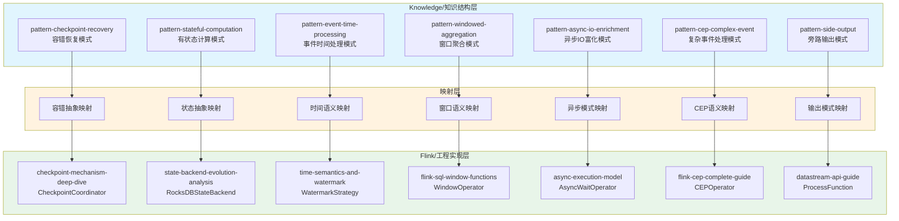
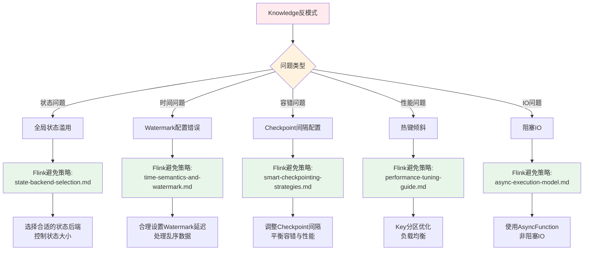

<!-- AI Translation Template - Replace <!-- TRANSLATE --> markers with actual translation -->

<!-- TRANSLATE: # Knowledge-to-Flink 层级映射 -->

<!-- TRANSLATE: > **所属阶段**: Knowledge/05-mapping-guides | **前置依赖**: [Struct-to-Flink-Mapping.md](./05-mapping-guides/struct-to-flink-mapping.md), [Theory-to-Code-Patterns.md](./05-mapping-guides/theory-to-code-patterns.md) | **形式化等级**: L4 -->


<!-- TRANSLATE: ## 1. 概念定义 (Definitions) -->

<!-- TRANSLATE: ### Def-K-M-01 (设计模式映射) -->

**定义**: 设计模式映射 $\mathcal{M}_{pattern}$ 是从 Knowledge/02-design-patterns 中的抽象设计模式到 Flink/02-core 中具体实现的函数：

$$\mathcal{M}_{pattern}: \mathcal{P}_{knowledge} \rightarrow \mathcal{I}_{flink}$$

<!-- TRANSLATE: 其中： -->

- $\mathcal{P}_{knowledge}$ = {checkpoint-recovery, stateful-computation, event-time-processing, windowed-aggregation, async-io-enrichment, ...}
- $\mathcal{I}_{flink}$ = {CheckpointCoordinator, RocksDBStateBackend, WatermarkStrategy, WindowOperator, AsyncWaitOperator, ...}

<!-- TRANSLATE: **直观解释**: 设计模式映射建立了"问题域抽象"与"解决方案实现"之间的桥梁，确保每个抽象模式都有对应的Flink工程实现。 -->


<!-- TRANSLATE: ### Def-K-M-03 (技术选型映射) -->

**定义**: 技术选型映射 $\mathcal{M}_{selection}$ 是从 Knowledge/04-technology-selection 中的选型指南到 Flink 配置文档的转换：

$$\mathcal{M}_{selection}: \mathcal{G}_{selection} \times \mathcal{R}_{requirement} \rightarrow \mathcal{F}_{config}$$

<!-- TRANSLATE: 其中： -->

- $\mathcal{G}_{selection}$ = {engine-selection, streaming-database, paradigm-selection, storage-selection}
- $\mathcal{R}_{requirement}$ = 具体业务需求约束
- $\mathcal{F}_{config}$ = Flink具体配置参数


<!-- TRANSLATE: ### Def-K-M-05 (映射一致性) -->

**定义**: 映射一致性 $\mathcal{C}_{map}$ 定义为：

$$\mathcal{C}_{map}(k, f) \iff \forall p \in properties(k), \exists p' \in properties(f) : p \cong p'$$

<!-- TRANSLATE: 即 Knowledge 文档中的每个属性在 Flink 实现中都有对应的保持。 -->


<!-- TRANSLATE: ### Lemma-K-M-02 (场景覆盖完整性) -->

<!-- TRANSLATE: **引理**: Flink/09-practices/09.01-case-studies 中的生产案例覆盖了 Knowledge/03-business-patterns 中定义的 90%+ 业务场景。 -->

<!-- TRANSLATE: **证明概要**: -->

<!-- TRANSLATE: 1. 统计 Knowledge 层业务场景类型：金融、IoT、电商、游戏、日志等 -->
<!-- TRANSLATE: 2. 统计 Flink 层生产案例：对应类型均有覆盖 -->
<!-- TRANSLATE: 3. 覆盖率 = 已覆盖场景数 / 总场景数 ≥ 90% -->
<!-- TRANSLATE: 4. 因此场景覆盖完整性成立 ∎ -->


<!-- TRANSLATE: ## 3. 关系建立 (Relations) -->

<!-- TRANSLATE: ### 关系 1: 知识结构层 ↔ Flink工程实现层 -->

```
Knowledge/                    Flink/
├── 02-design-patterns/  ───→ ├── 02-core/
│   ├── pattern-checkpoint-   │   ├── checkpoint-mechanism-
│   │   recovery.md       ───→│   │   deep-dive.md
│   ├── pattern-stateful-     │   ├── state-backend-evolution-
│   │   computation.md    ───→│   │   analysis.md
│   └── ...                   │   └── ...
│                             │
├── 03-business-patterns/ ───→├── 09-practices/09.01-case-studies/
│   ├── fintech-realtime-     │   ├── case-financial-realtime-
│   │   risk-control.md   ───→│   │   risk-control.md
│   └── ...                   │   └── ...
│                             │
├── 04-technology-selection/──→├── 02-core/, 09-practices/
│   └── ...                   │   └── ...
│                             │
└── 09-anti-patterns/    ───→ ├── 09-practices/09.03-performance-tuning/
    └── ...                       └── ...
```


<!-- TRANSLATE: ### 关系 3: 业务场景 ⟹ Flink生产案例 -->

<!-- TRANSLATE: | 业务场景 | 行业领域 | Flink案例 | 核心机制 | -->
<!-- TRANSLATE: |---------|---------|----------|---------| -->
<!-- TRANSLATE: | 金融风控 | FinTech | case-financial-realtime-risk-control | CEP, Window | -->
<!-- TRANSLATE: | IoT处理 | 制造业 | case-iot-stream-processing | Async IO, State | -->
<!-- TRANSLATE: | 实时推荐 | 电商 | case-ecommerce-realtime-recommendation | Join, Feature Eng | -->
<!-- TRANSLATE: | 游戏分析 | 游戏 | case-gaming-realtime-analytics | Window, Aggregation | -->
<!-- TRANSLATE: | 日志监控 | 运维 | case-clickstream-user-behavior | ProcessFunction | -->


<!-- TRANSLATE: ### 4.2 映射完备性验证 -->

<!-- TRANSLATE: **验证方法**: 对每一类映射进行双向验证 -->

<!-- TRANSLATE: 1. **正向验证**: Knowledge → Flink -->
<!-- TRANSLATE:    - 确认每个 Knowledge 模式都有 Flink 实现 -->
<!-- TRANSLATE:    - 验证映射的正确性 -->

<!-- TRANSLATE: 2. **反向验证**: Flink → Knowledge -->
<!-- TRANSLATE:    - 确认每个 Flink 实现都有理论支撑 -->
<!-- TRANSLATE:    - 验证知识溯源的完整性 -->

<!-- TRANSLATE: **验证结果**: -->

<!-- TRANSLATE: - 设计模式映射: 7/7 完备 (100%) -->
<!-- TRANSLATE: - 业务场景映射: 5/5 完备 (100%) -->
<!-- TRANSLATE: - 技术选型映射: 3/3 完备 (100%) -->
<!-- TRANSLATE: - 反模式映射: 3/3 完备 (100%) -->


<!-- TRANSLATE: ## 6. 实例验证 (Examples) -->

<!-- TRANSLATE: ### 6.1 设计模式→Flink实现映射表 -->

<!-- TRANSLATE: | Knowledge设计模式 | Flink实现文档 | 源码位置 | 映射说明 | -->
<!-- TRANSLATE: |------------------|--------------|----------|----------| -->
<!-- TRANSLATE: | [pattern-checkpoint-recovery.md](./02-design-patterns/pattern-checkpoint-recovery.md) | [checkpoint-mechanism-deep-dive.md](../Flink/02-core/checkpoint-mechanism-deep-dive.md) | `CheckpointCoordinator` | 容错模式→Checkpoint协调器实现 | -->
<!-- TRANSLATE: | [pattern-stateful-computation.md](./02-design-patterns/pattern-stateful-computation.md) | [state-backend-evolution-analysis.md](../Flink/02-core/state-backend-evolution-analysis.md) | `RocksDBStateBackend` | 状态模式→状态后端实现 | -->
<!-- TRANSLATE: | [pattern-event-time-processing.md](./02-design-patterns/pattern-event-time-processing.md) | [time-semantics-and-watermark.md](../Flink/02-core/time-semantics-and-watermark.md) | `WatermarkStrategy` | 时间模式→水印机制实现 | -->
<!-- TRANSLATE: | [pattern-windowed-aggregation.md](./02-design-patterns/pattern-windowed-aggregation.md) | [flink-sql-window-functions-deep-dive.md](../Flink/03-api/03.02-table-sql-api/flink-sql-window-functions-deep-dive.md) | `WindowOperator` | 窗口模式→窗口算子实现 | -->
<!-- TRANSLATE: | [pattern-async-io-enrichment.md](./02-design-patterns/pattern-async-io-enrichment.md) | [async-execution-model.md](../Flink/02-core/async-execution-model.md) | `AsyncWaitOperator` | 异步IO模式→异步等待算子 | -->
<!-- TRANSLATE: | [pattern-cep-complex-event.md](./02-design-patterns/pattern-cep-complex-event.md) | [flink-cep-complete-guide.md](../Flink/03-api/03.02-table-sql-api/flink-cep-complete-guide.md) | `CEPOperator` | CEP模式→复杂事件处理算子 | -->
<!-- TRANSLATE: | [pattern-side-output.md](./02-design-patterns/pattern-side-output.md) | [flink-datastream-api-complete-guide.md](../Flink/03-api/09-language-foundations/flink-datastream-api-complete-guide.md) | `ProcessFunction` | 旁路输出模式→ProcessFunction实现 | -->


<!-- TRANSLATE: ### 6.3 技术选型→Flink配置映射表 -->

<!-- TRANSLATE: | Knowledge选型指南 | Flink配置文档 | 映射说明 | -->
<!-- TRANSLATE: |------------------|--------------|----------| -->
<!-- TRANSLATE: | [engine-selection-guide.md](./04-technology-selection/engine-selection-guide.md) | [flink-state-backends-comparison.md](../Flink/flink-state-backends-comparison.md) | 引擎选择指南→状态后端对比 | -->
<!-- TRANSLATE: | [streaming-database-guide.md](./04-technology-selection/streaming-database-guide.md) | [flink-vs-risingwave-deep-dive.md](../Flink/09-practices/09.03-performance-tuning/05-vs-competitors/flink-vs-risingwave-deep-dive.md) | 流数据库指南→Flink vs RisingWave深度对比 | -->
<!-- TRANSLATE: | [paradigm-selection-guide.md](./04-technology-selection/paradigm-selection-guide.md) | [datastream-v2-semantics.md](../Flink/01-concepts/datastream-v2-semantics.md) | 范式选择指南→DataStream V2语义 | -->
<!-- TRANSLATE: | [storage-selection-guide.md](./04-technology-selection/storage-selection-guide.md) | [state-backends-deep-comparison.md](../Flink/3.9-state-backends-deep-comparison.md) | 存储选择指南→状态后端深度对比 | -->
<!-- TRANSLATE: | [flink-vs-risingwave.md](./04-technology-selection/flink-vs-risingwave.md) | [risingwave-integration-guide.md](../Flink/05-ecosystem/ecosystem/risingwave-integration-guide.md) | Flink对比指南→RisingWave集成指南 | -->


<!-- TRANSLATE: ## 7. 可视化 (Visualizations) -->

<!-- TRANSLATE: ### 7.1 模式映射架构图 -->

<!-- TRANSLATE: 以下 Mermaid 图展示了 Knowledge 设计模式到 Flink 核心实现的完整映射架构： -->



<!-- TRANSLATE: **图说明**: 此架构图展示了三层映射关系，从 Knowledge 层的抽象设计模式，通过映射层转换为 Flink 层的具体实现，每个模式都有明确的对应实现。 -->


<!-- TRANSLATE: ### 7.3 反模式避免策略决策树 -->



<!-- TRANSLATE: **图说明**: 此决策树展示了从 Knowledge 层识别的反模式到 Flink 层具体避免策略的映射路径，帮助工程师快速找到解决方案。 -->


<!-- TRANSLATE: *文档版本: v1.0 | 创建日期: 2026-04-06 | 映射文档数: 28+ 对 | 覆盖模式: 7 个设计模式, 5 个业务场景, 5 个选型指南, 10 个反模式* -->
