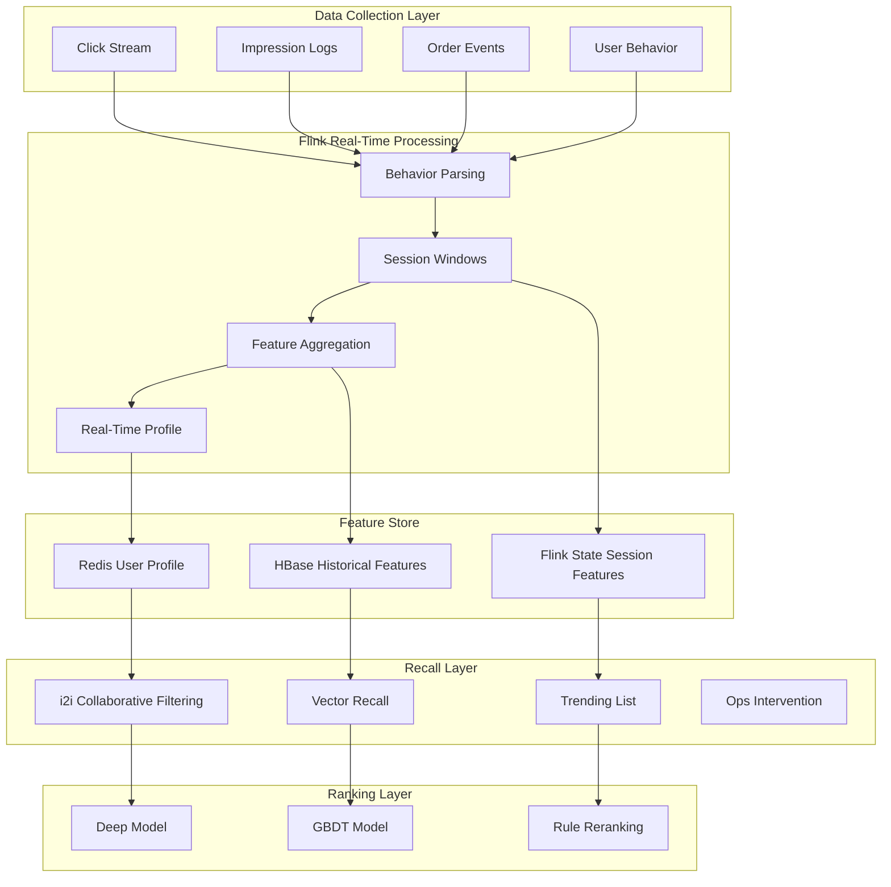
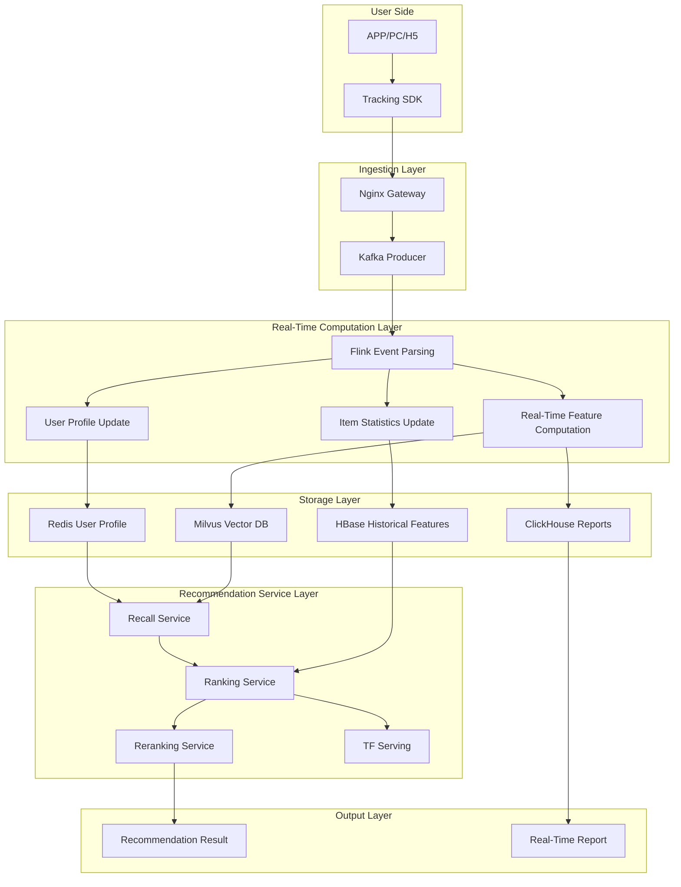
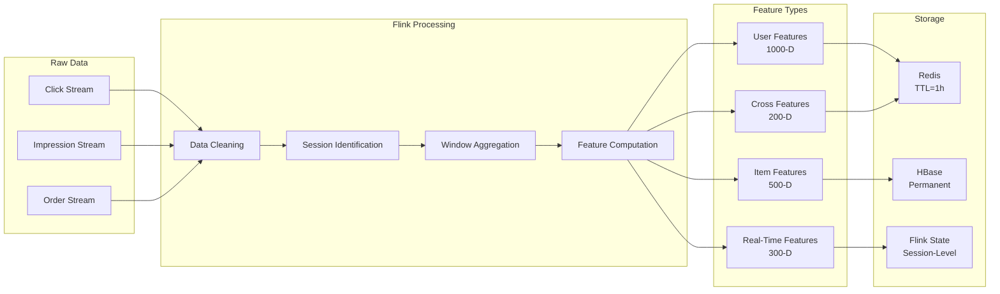
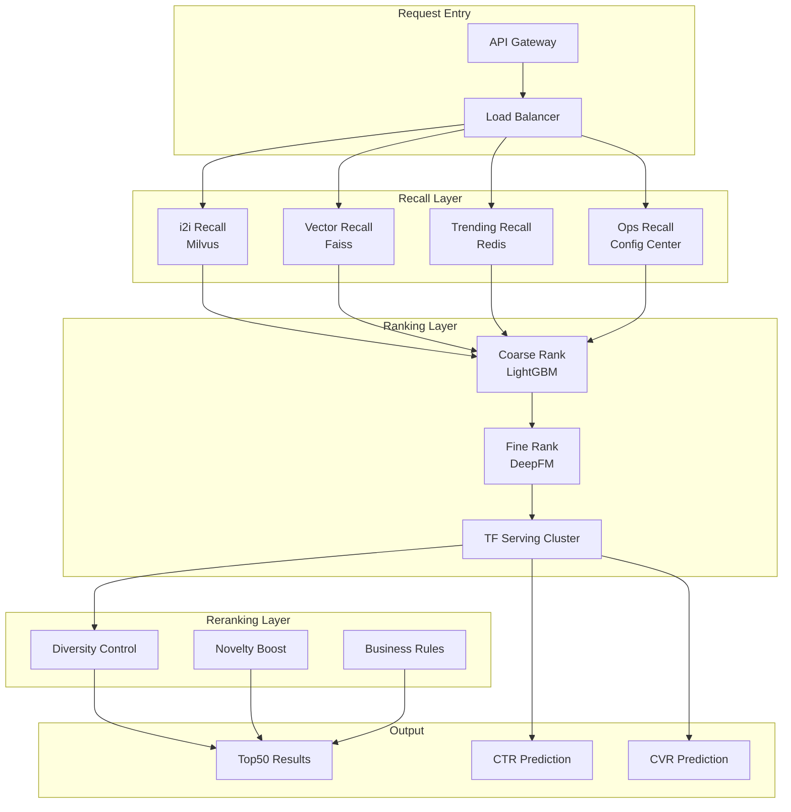
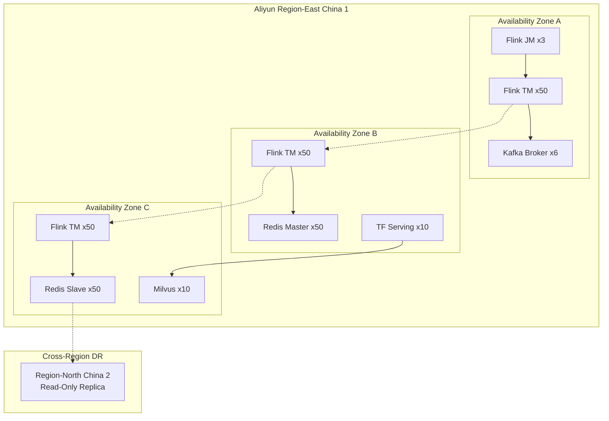

# Real-Time Recommendation System Case Study in E-Commerce

> **Stage**: Knowledge/case-studies/ecommerce | **Prerequisites**: [Knowledge/00-INDEX.md](../../Knowledge/00-INDEX.md) | **Formalization Level**: L5
> **Case ID**: CS-E-02 | **Completion Date**: 2026-04-11 | **Version**: v2.0

---

> **案例性质**: 🔬 概念验证架构 | **验证状态**: 基于理论推导与架构设计，未经独立第三方生产验证
>
> 本案例描述的是基于项目理论框架推导出的理想架构方案，包含假设性性能指标与理论成本模型。
> 实际生产部署可能因环境差异、数据规模、团队能力等因素产生显著不同结果。
> 建议将其作为架构设计参考而非直接复制粘贴的生产蓝图。
>
## Table of Contents

- [Real-Time Recommendation System Case Study in E-Commerce](#real-time-recommendation-system-case-study-in-e-commerce)
  - [Table of Contents](#table-of-contents)
  - [1. Definitions](#1-definitions)
    - [1.1 Real-Time Recommendation System Definition](#11-real-time-recommendation-system-definition)
    - [1.2 User Behavior Features](#12-user-behavior-features)
    - [1.3 Recommendation Quality Metrics](#13-recommendation-quality-metrics)
  - [2. Properties](#2-properties)
    - [2.1 Real-Time Constraints](#21-real-time-constraints)
    - [2.2 Scalability Guarantee](#22-scalability-guarantee)
  - [3. Relations](#3-relations)
    - [3.1 Data Flow Architecture Relations](#31-data-flow-architecture-relations)
    - [3.2 Model Serving Relations](#32-model-serving-relations)
  - [4. Argumentation](#4-argumentation)
    - [4.1 Real-Time vs Offline Recommendation](#41-real-time-vs-offline-recommendation)
    - [4.2 Cold Start Problem Analysis](#42-cold-start-problem-analysis)
  - [5. Proof / Engineering Argument](#5-proof--engineering-argument)
    - [5.1 Feature Engineering Pipeline](#51-feature-engineering-pipeline)
    - [5.2 Model Inference Optimization](#52-model-inference-optimization)
  - [6. Examples](#6-examples)
    - [6.1 Case Background](#61-case-background)
    - [6.2 Implementation Results](#62-implementation-results)
    - [6.3 Technical Architecture](#63-technical-architecture)
    - [6.4 Production Environment Checklist](#64-production-environment-checklist)
  - [7. Visualizations](#7-visualizations)
    - [7.1 Real-Time Recommendation Data Flow Architecture](#71-real-time-recommendation-data-flow-architecture)
    - [7.2 Feature Engineering Pipeline](#72-feature-engineering-pipeline)
    - [7.3 Model Inference Service Architecture](#73-model-inference-service-architecture)
    - [7.4 System Deployment Topology](#74-system-deployment-topology)
  - [8. References](#8-references)

---

## 1. Definitions

### 1.1 Real-Time Recommendation System Definition

**Def-K-10-201** (Real-Time Recommendation System): A real-time recommendation system is a nonuple $\mathcal{R} = (U, I, C, B, F, M, S, P, W)$:

- $U$: Set of users, $|U| = N_u$, typically at the $10^8$ scale
- $I$: Set of items, $|I| = N_i$, typically at the $10^7$ scale
- $C$: Set of contexts (time, location, device)
- $B$: Set of user behavior sequences
- $F$: Set of feature engineering functions
- $M$: Set of recommendation models (recall + ranking + reranking)
- $S$: Candidate generation strategy
- $P$: Personalization function
- $W$: Feedback learning mechanism

**Recommendation Response Definition**:

$$
Recommendation(u, c, t) = TopK\left(\{score(u, i, c) : i \in CandidateSet(u, t)\}\right)
$$

Where $score(u, i, c)$ is the predicted score of user $u$ for item $i$ under context $c$.

### 1.2 User Behavior Features

**Def-K-10-202** (User Real-Time Profile): The real-time profile of user $u$ at time $t$ is defined as:

$$
Profile(u, t) = (D_u, H_u^{(t)}, R_u^{(t)}, S_u^{(t)})
$$

Where:

- $D_u$: User demographic features (age, gender, region)
- $H_u^{(t)} = \{(i, \tau, action) : \tau \in [t-T, t]\}$: Recent behavior history
- $R_u^{(t)}$: Real-time intent vector (inferred from session behavior)
- $S_u^{(t)}$: Current session state

**Def-K-10-203** (Real-Time Feature Vector): Feature engineering output:

$$
F(u, i, c) = concat(F_{user}(u), F_{item}(i), F_{context}(c), F_{interaction}(u,i))
$$

### 1.3 Recommendation Quality Metrics

**Def-K-10-204** (Recommendation Effectiveness Metrics):

| Metric | Definition | Target |
|--------|------------|--------|
| CTR | Click-Through Rate = Clicks / Impressions | > 5% |
| CVR | Conversion Rate = Orders / Clicks | > 3% |
| GMV | Gross Merchandise Value | Daily > 100M |
| Diversity | Category Coverage | > 80% |
| Novelty | Long-Tail Item Ratio | > 30% |

**Def-K-10-205** (Latency Constraint):

$$
L_{total} = L_{feature} + L_{recall} + L_{rank} + L_{rerank} + L_{network} \leq 100ms
$$

---

## 2. Properties

### 2.1 Real-Time Constraints

**Lemma-K-10-201**: Let $L_f$ be the feature query latency, $L_r$ the recall stage latency, and $L_s$ the ranking stage latency. Then the total latency satisfies:

$$
L_{total} = L_f + \max(L_r^{(1)}, L_r^{(2)}, ..., L_r^{(k)}) + L_s + L_{rerank} \leq L_{SLA}
$$

For e-commerce recommendation scenarios, $L_{SLA} = 100$ms (P99).

**Thm-K-10-201** (Throughput Scalability): Let $TPS_{single}$ be the single-node throughput, $N$ the number of nodes, and $\alpha$ the linear scaling factor (typically $\alpha \in [0.8, 0.95]$). Then the total system throughput is:

$$
TPS_{total} = \alpha \cdot N \cdot TPS_{single}
$$

To reach 1 million TPS, assuming 50K TPS per node and $\alpha = 0.9$:

$$
N \geq \frac{10^6}{0.9 \times 5 \times 10^4} \approx 23 \text{ nodes}
$$

### 2.2 Scalability Guarantee

**Lemma-K-10-202** (Feature Store Capacity): Let $N_u$ be the number of users, $d$ the feature dimension per user, $s$ the size of a single feature in bytes, and $S$ the number of Redis cluster shards. Then the storage per shard is:

$$
Storage_{per\_shard} = \frac{N_u \cdot d \cdot s}{S}
$$

For 1 billion users, 1,000 dimensions, 4 bytes/dimension, and 100 shards:

$$
Storage = \frac{10^9 \times 1000 \times 4}{100} = 40GB/shard
$$

---

## 3. Relations

### 3.1 Data Flow Architecture Relations



### 3.2 Model Serving Relations

| Stage | Model Type | Latency Requirement | Candidate Count | Key Metric |
|-------|------------|---------------------|-----------------|------------|
| Recall | Vector Retrieval | < 10ms | 10K level | Recall Rate |
| Coarse Ranking | Lightweight Model | < 20ms | 1K level | Relevance |
| Fine Ranking | Deep Model | < 50ms | 100 level | CTR/CVR |
| Reranking | Rules/Policy | < 10ms | 10 level | Diversity |

---

## 4. Argumentation

### 4.1 Real-Time vs Offline Recommendation

| Dimension | Real-Time Recommendation | Offline Recommendation | Hybrid Strategy |
|-----------|--------------------------|------------------------|-----------------|
| Latency | < 100ms | Hours level | Real-time recall + offline features |
| Personalization | Based on current session | Based on historical behavior | Fusion of both |
| Cold Start | Quick response | Cannot handle | Real-time learning |
| Compute Cost | High | Low | Layered optimization |
| Applicable Scenario | Home page Feed | Email push | Full scenario coverage |

**Hybrid Architecture Advantage**: Real-time capture of user immediate intent, while leveraging rich offline features to ensure recommendation quality.

### 4.2 Cold Start Problem Analysis

**Def-K-10-206** (Cold Start Classification):

| Type | Description | Solution Strategy |
|------|-------------|-------------------|
| User Cold Start | New user without history | Trending recommendations, based on device/location |
| Item Cold Start | New item without interaction | Content similarity, exploration-exploitation |
| System Cold Start | Brand new system | Expert rules, rapid iteration |

**Exploration-Exploitation Balance**:

$$
Score_{explore}(i) = \hat{r}_{ui} + \beta \cdot \sqrt{\frac{\ln N}{n_i}}
$$

Where $N$ is the total impression count, $n_i$ is the impression count of item $i$, and $\beta$ is the exploration coefficient.

---

## 5. Proof / Engineering Argument

### 5.1 Feature Engineering Pipeline

**Thm-K-10-202** (Feature Consistency): The Flink feature engineering pipeline guarantees Exactly-Once semantics, ensuring training/inference feature consistency.

**Flink Feature Engineering Implementation**:

```java

// [伪代码片段 - 不可直接运行] 仅展示核心逻辑
import org.apache.flink.streaming.api.datastream.DataStream;
import org.apache.flink.api.common.state.ValueState;
import org.apache.flink.api.common.state.ValueStateDescriptor;
import org.apache.flink.streaming.api.windowing.time.Time;

// User behavior feature computation
DataStream<UserFeature> userFeatures = clickStream
    .keyBy(ClickEvent::getUserId)
    .window(SlidingEventTimeWindows.of(Time.minutes(30), Time.seconds(10)))
    .aggregate(new UserFeatureAggregator())
    .name("user-feature-calculation");

// Item statistical features
DataStream<ItemFeature> itemFeatures = eventStream
    .keyBy(Event::getItemId)
    .window(SlidingEventTimeWindows.of(Time.hours(1), Time.minutes(5)))
    .aggregate(new ItemFeatureAggregator());

// Session-level real-time intent recognition
DataStream<SessionIntent> sessionIntents = behaviorStream
    .keyBy(BehaviorEvent::getSessionId)
    .process(new KeyedProcessFunction<String, BehaviorEvent, SessionIntent>() {
        private ValueState<SessionState> sessionState;
        private static final long SESSION_TIMEOUT = 30 * 60 * 1000; // 30min

        @Override
        public void open(Configuration parameters) {
            sessionState = getRuntimeContext().getState(
                new ValueStateDescriptor<>("session", SessionState.class));
        }

        @Override
        public void processElement(BehaviorEvent event, Context ctx,
                                   Collector<SessionIntent> out) throws Exception {
            SessionState state = sessionState.value();
            if (state == null || ctx.timestamp() - state.getLastTime() > SESSION_TIMEOUT) {
                state = new SessionState(event.getUserId(), ctx.timestamp());
            }
            state.addEvent(event);
            sessionState.update(state);

            // Output intent every 5 events or at session end
            if (state.getEventCount() % 5 == 0 || event.getType() == EventType.PURCHASE) {
                out.collect(state.extractIntent());
            }
        }
    });

// Write real-time features to Redis
userFeatures.addSink(new RedisSink<>(
    new FlinkJedisPoolConfig.Builder()
        .setHost("redis-cluster")
        .setPort(6379)
        .build(),
    new UserFeatureRedisMapper()
));
```

### 5.2 Model Inference Optimization

**TensorFlow Serving Integration**:

```java
// Asynchronous model inference

import org.apache.flink.streaming.api.datastream.DataStream;
import org.apache.flink.streaming.api.windowing.time.Time;

public class AsyncModelInference extends
    RichAsyncFunction<FeatureVector, Prediction> {

    private transient TensorFlowServingClient tfClient;
    private static final String MODEL_NAME = "recommendation_ranking";
    private static final int MODEL_VERSION = 1;

    @Override
    public void open(Configuration parameters) {
        tfClient = TensorFlowServingClient.create("tf-serving:8501");
    }

    @Override
    public void asyncInvoke(FeatureVector features,
                            ResultFuture<Prediction> resultFuture) {
        ListenableFuture<PredictResponse> responseFuture = tfClient.predict(
            MODEL_NAME, MODEL_VERSION,
            features.toTensorProto()
        );

        Futures.addCallback(responseFuture, new FutureCallback<>() {
            @Override
            public void onSuccess(PredictResponse response) {
                float score = response.getOutputsOrThrow("score")
                    .getFloatVal(0);
                resultFuture.complete(Collections.singletonList(
                    new Prediction(features.getItemId(), score)
                ));
            }

            @Override
            public void onFailure(Throwable t) {
                resultFuture.complete(Collections.singletonList(
                    new Prediction(features.getItemId(), 0.0f, t)
                ));
            }
        }, Executors.newCachedThreadPool());
    }
}

// Apply to DataStream
DataStream<Prediction> predictions = featureStream
    .map(FeatureVector::fromUserItemContext)
    .flatMap(new CandidateGenerator()) // Generate candidate set
    .asyncWaitFor(
        new AsyncModelInference(),
        Time.milliseconds(50), // 50ms timeout
        100 // Concurrency
    );
```

**Cache Optimization Strategy**:

```java
// Multi-level cache: local Caffeine + Redis Cluster
public class MultiLevelFeatureCache {
    private final Cache<String, UserFeature> localCache;
    private final RedisClusterAsyncCommands<String, String> redisClient;

    public UserFeature getUserFeature(String userId) {
        // L1: local cache
        UserFeature feature = localCache.getIfPresent(userId);
        if (feature != null) return feature;

        // L2: Redis
        feature = fetchFromRedis(userId);
        if (feature != null) {
            localCache.put(userId, feature);
            return feature;
        }

        // L3: real-time computation (fallback)
        feature = computeInRealTime(userId);
        return feature;
    }
}
```

---

## 6. Examples

### 6.1 Case Background

**Real-Time Recommendation System Upgrade Project at a Leading E-Commerce Platform**

- **Business Scale**: 200M DAU, 10B daily PVs, 50M+ SKUs
- **Recommendation Scenarios**: Home page Feed, "Guess You Like" on product detail page, cart recommendations
- **Historical Issues**: Offline recommendation had high latency and could not capture real-time interest changes

**Technical Challenges**:

| Challenge | Description | Quantitative Metric |
|-----------|-------------|---------------------|
| Ultra-Low Latency | Recommendation API P99 < 100ms | Previous system 500ms+ |
| Ultra-High Throughput | Peak 1M TPS | Daily 100B+ events |
| Real-Time Personalization | Real-time user intent learning | Minute-level profile update |
| Multi-Objective Optimization | CTR/CVR/GMV balance | Multi-objective modeling |

### 6.2 Implementation Results

**Performance Data** (12 months post-launch):

| Metric | Before | After | Improvement |
|--------|--------|-------|-------------|
| Recommendation API P99 Latency | 450ms | 85ms | -81% |
| System Throughput | 200K TPS | 1.2M TPS | +500% |
| Home Page CTR | 3.2% | 5.8% | +81% |
| Conversion Rate (CVR) | 2.1% | 3.6% | +71% |
| Per-Capita GMV | ¥125 | ¥198 | +58% |
| Long-Tail Item Exposure | 15% | 35% | +133% |
| Real-Time Profile Update | Hours | Seconds | 3600x |

**Business Value**:

- Annual GMV increment: 5B+
- User experience improvement: Bounce rate reduced by 12%
- Long-tail item sales: Niche category GMV growth 200%

### 6.3 Technical Architecture

**Core Technology Stack**:

- **Stream Processing**: Apache Flink 1.18 (100-node cluster)
- **Message Queue**: Apache Kafka (200 partitions, 3 replicas)
- **Feature Store**: Redis Cluster (200 nodes, 40TB) + HBase
- **Model Serving**: TensorFlow Serving + NVIDIA Triton
- **Vector Retrieval**: Milvus (1B vectors, recall rate > 95%)
- **Monitoring**: Prometheus + Grafana + Self-developed A/B platform

**Flink Cluster Configuration**:

```yaml
# flink-conf.yaml
jobmanager.memory.process.size: 8192m
taskmanager.memory.process.size: 32768m
taskmanager.numberOfTaskSlots: 8
parallelism.default: 400

# Checkpoint configuration
state.backend: rocksdb
state.checkpoints.dir: hdfs:///checkpoints/recommendation
execution.checkpointing.interval: 30s
execution.checkpointing.max-concurrent-checkpoints: 1
```

### 6.4 Production Environment Checklist

**Pre-Deployment Checks**:

| Check Item | Requirement | Validation Method |
|------------|-------------|-------------------|
| Redis Cluster | 200 nodes, 40TB capacity | `redis-cli cluster info` |
| Kafka Throughput | 2M messages/sec | Producer stress test |
| TF Serving GPU | A100 x 20 | `nvidia-smi` |
| Network Bandwidth | 10GbE, < 1ms latency | `iperf3` |

**Runtime Monitoring**:

| Metric | Alert Threshold | Remediation |
|--------|-----------------|-------------|
| Recommendation Latency P99 | > 150ms | Scale out / Degrade |
| Redis Hit Rate | < 95% | Adjust cache strategy |
| TF Serving QPS | > 80% capacity | Horizontal scaling |
| Flink Checkpoint | Failed > 3 times | Tune RocksDB |
| Model AUC | Drop > 5% | Rollback model |

**Fault Degradation Strategy**:

```java
// Multi-level degradation strategy
public class DegradationStrategy {
    // Level 1: Disable complex feature computation
    public void level1Degrade() {
        featureConfig.setComputeComplexFeatures(false);
    }

    // Level 2: Use simplified model
    public void level2Degrade() {
        modelRouter.routeTo("light_model");
    }

    // Level 3: Return trending items
    public void level3Degrade() {
        recommendationCache.getHotItems();
    }
}
```

---

## 7. Visualizations

### 7.1 Real-Time Recommendation Data Flow Architecture



### 7.2 Feature Engineering Pipeline



### 7.3 Model Inference Service Architecture



### 7.4 System Deployment Topology



---

## 8. References


---

*This document follows the AnalysisDataFlow project six-section template specification | Last Updated: 2026-04-11*
