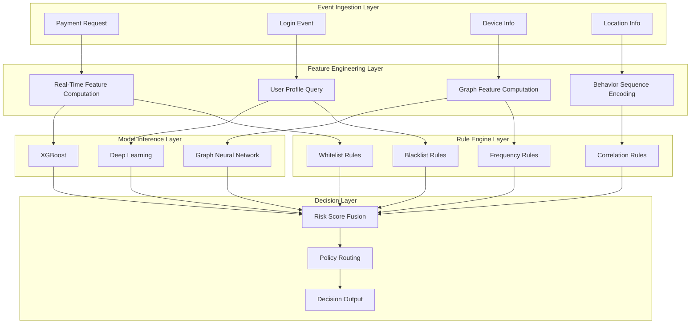
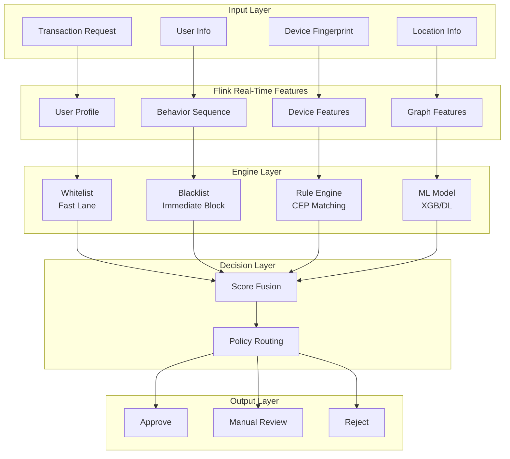
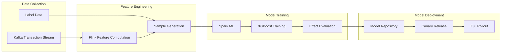

# Real-Time Anti-Fraud System Case Study in Finance

> **Stage**: Knowledge/case-studies/finance | **Prerequisites**: [Knowledge/10-case-studies/finance/10.1.1-realtime-anti-fraud-system.md](../../10-case-studies/finance/10.1.1-realtime-anti-fraud-system.md) | **Formalization Level**: L5
> **Case ID**: CS-F-01 | **Completion Date**: 2026-04-11 | **Version**: v1.0

---

> **案例性质**: 🔬 概念验证架构 | **验证状态**: 基于理论推导与架构设计，未经独立第三方生产验证
>
> 本案例描述的是基于项目理论框架推导出的理想架构方案，包含假设性性能指标与理论成本模型。
> 实际生产部署可能因环境差异、数据规模、团队能力等因素产生显著不同结果。
> 建议将其作为架构设计参考而非直接复制粘贴的生产蓝图。
## Table of Contents

- [Real-Time Anti-Fraud System Case Study in Finance](#real-time-anti-fraud-system-case-study-in-finance)
  - [Table of Contents](#table-of-contents)
  - [1. Definitions](#1-definitions)
    - [1.1 Anti-Fraud System Definition](#11-anti-fraud-system-definition)
    - [1.2 Risk Scoring Model](#12-risk-scoring-model)
    - [1.3 Decision Strategy](#13-decision-strategy)
  - [2. Properties](#2-properties)
    - [2.1 Real-Time Constraints](#21-real-time-constraints)
    - [2.2 Accuracy Guarantee](#22-accuracy-guarantee)
  - [3. Relations](#3-relations)
    - [3.1 CEP Rule Engine Architecture](#31-cep-rule-engine-architecture)
    - [3.2 Model Update Pipeline](#32-model-update-pipeline)
  - [4. Argumentation](#4-argumentation)
    - [4.1 Rule Engine vs Machine Learning](#41-rule-engine-vs-machine-learning)
    - [4.2 Decision Strategy Optimization](#42-decision-strategy-optimization)
  - [5. Proof / Engineering Argument](#5-proof--engineering-argument)
    - [5.1 CEP Rule Definition](#51-cep-rule-definition)
    - [5.2 Risk Score Calculation](#52-risk-score-calculation)
  - [6. Examples](#6-examples)
    - [6.1 Case Background](#61-case-background)
    - [6.2 Implementation Results](#62-implementation-results)
    - [6.3 Technical Architecture](#63-technical-architecture)
  - [7. Visualizations](#7-visualizations)
    - [7.1 Real-Time Risk Control Decision Flow](#71-real-time-risk-control-decision-flow)
    - [7.2 Model Update Pipeline](#72-model-update-pipeline)
  - [8. References](#8-references)

---

## 1. Definitions

### 1.1 Anti-Fraud System Definition

**Def-K-CS-F-01-01** (Real-Time Anti-Fraud System): A real-time anti-fraud system is an octuple $\mathcal{F} = (T, U, R, F, M, D, P, A)$:

- $T$: Set of transactions
- $U$: Set of users
- $R$: Set of rules
- $F$: Feature engineering functions
- $M$: Set of machine learning models
- $D$: Decision engine
- $P$: Set of policies
- $A$: Set of actions (approve, block, manual review)

### 1.2 Risk Scoring Model

**Def-K-CS-F-01-02** (Risk Score): The risk score of transaction $t$ is defined as:

$$
Score(t) = \alpha \cdot Score_{rule}(t) + \beta \cdot Score_{ml}(t) + \gamma \cdot Score_{graph}(t)
$$

Where $\alpha + \beta + \gamma = 1$, representing the rule-based score, ML score, and graph neural network score respectively.

### 1.3 Decision Strategy

**Def-K-CS-F-01-03** (Decision Strategy): The decision function based on risk score:

$$
Decision(t) = \begin{cases}
ACCEPT & \text{if } Score(t) < \theta_1 \\
REVIEW & \text{if } \theta_1 \leq Score(t) < \theta_2 \\
REJECT & \text{if } Score(t) \geq \theta_2
\end{cases}
$$

---

## 2. Properties

### 2.1 Real-Time Constraints

**Lemma-K-CS-F-01-01**: Let $L_{feat}$ be the feature computation latency, $L_{rule}$ the rule matching latency, $L_{model}$ the model inference latency, and $L_{decision}$ the decision latency. Then the total latency satisfies:

$$
L_{total} = L_{feat} + max(L_{rule}, L_{model}) + L_{decision} \leq L_{SLA}
$$

For payment scenarios, $L_{SLA} = 100$ms.

### 2.2 Accuracy Guarantee

**Thm-K-CS-F-01-01**: Let $A_{rule}$ be the rule engine accuracy and $A_{ml}$ the ML model accuracy. The lower bound of the fused system accuracy is:

$$
A_{system} \geq 1 - (1 - A_{rule})(1 - A_{ml}) - \epsilon
$$

Where $\epsilon$ is the fusion error.

---

## 3. Relations

### 3.1 CEP Rule Engine Architecture



### 3.2 Model Update Pipeline

| Stage | Frequency | Latency | Description |
|-------|-----------|---------|-------------|
| Real-Time Feature Update | Continuous | < 1s | Flink stream processing |
| Model Online Learning | Hourly | Minutes | Incremental update |
| Full Model Retraining | Daily | Hours | Batch training |
| Rule Hot Update | On-demand | Seconds | Config center push |

---

## 4. Argumentation

### 4.1 Rule Engine vs Machine Learning

| Dimension | Rule Engine | Machine Learning |
|-----------|-------------|------------------|
| Interpretability | High | Medium/Low |
| Real-Time Latency | < 10ms | 20-50ms |
| Adaptability | Requires manual adjustment | Auto-learning |
| Scenario Coverage | Known patterns | Discovers new patterns |
| Maintenance Cost | High | Low |

**Hybrid Strategy**: The rule engine handles known risk patterns for rapid interception, while the ML model discovers unknown patterns.

### 4.2 Decision Strategy Optimization

**Dynamic Threshold Adjustment**:

$$
\theta(t) = \theta_0 + \Delta \cdot sin(\frac{2\pi t}{T})
$$

Adjust thresholds dynamically based on business peak hours to balance security and user experience.

---

## 5. Proof / Engineering Argument

### 5.1 CEP Rule Definition

**Thm-K-CS-F-01-02** (Fraud Pattern Detection): CEP-based complex event patterns can detect the following fraudulent behaviors:

**Flink CEP Implementation**:

```java

// [伪代码片段 - 不可直接运行] 仅展示核心逻辑
import org.apache.flink.streaming.api.datastream.DataStream;
import org.apache.flink.streaming.api.windowing.time.Time;

// Fraud detection pattern: multiple remote transactions in a short time
Pattern<Transaction, ?> fraudPattern = Pattern
    .<Transaction>begin("first")
    .where(new SimpleCondition<Transaction>() {
        @Override
        public boolean filter(Transaction tx) {
            return tx.getAmount() > 1000;
        }
    })
    .next("second")
    .where(new SimpleCondition<Transaction>() {
        @Override
        public boolean filter(Transaction tx) {
            return tx.getAmount() > 1000;
        }
    })
    .within(Time.minutes(5));

// Location jump detection
Pattern<Transaction, ?> locationJumpPattern = Pattern
    .<Transaction>begin("loc1")
    .next("loc2")
    .where(new IterativeCondition<Transaction>() {
        @Override
        public boolean filter(Transaction tx, Context<Transaction> ctx) {
            Collection<Transaction> firstTx = ctx.getEventsForPattern("loc1");
            for (Transaction first : firstTx) {
                double distance = calculateDistance(
                    first.getLocation(), tx.getLocation());
                // Location jump over 500km within 5 minutes
                if (distance > 500) return true;
            }
            return false;
        }
    })
    .within(Time.minutes(5));

// Apply pattern
PatternStream<Transaction> patternStream = CEP.pattern(
    transactionStream.keyBy(Transaction::getCardId),
    fraudPattern);

DataStream<Alert> alerts = patternStream
    .process(new PatternHandler<Alert>() {
        @Override
        public void processMatch(Map<String, List<Transaction>> match,
                                 Context ctx,
                                 Collector<Alert> out) {
            out.collect(new Alert(
                AlertType.FRAUD_SUSPECTED,
                match.get("first").get(0).getCardId(),
                match.get("first").get(0).getAmount() +
                match.get("second").get(0).getAmount()
            ));
        }
    });
```

### 5.2 Risk Score Calculation

**Real-Time Feature Engineering**:

```java

// [伪代码片段 - 不可直接运行] 仅展示核心逻辑
import org.apache.flink.streaming.api.datastream.DataStream;
import org.apache.flink.api.common.state.ValueState;
import org.apache.flink.api.common.state.ValueStateDescriptor;
import org.apache.flink.api.common.functions.AggregateFunction;
import org.apache.flink.streaming.api.windowing.time.Time;

// User behavior feature computation
DataStream<UserFeature> userFeatures = transactionStream
    .keyBy(Transaction::getUserId)
    .window(SlidingEventTimeWindows.of(Time.hours(1), Time.minutes(5)))
    .aggregate(new AggregateFunction<Transaction, UserAccumulator, UserFeature>() {
        @Override
        public UserAccumulator createAccumulator() {
            return new UserAccumulator();
        }

        @Override
        public UserAccumulator add(Transaction tx, UserAccumulator acc) {
            acc.add(tx);
            return acc;
        }

        @Override
        public UserFeature getResult(UserAccumulator acc) {
            return new UserFeature(
                acc.getTransactionCount(),
                acc.getAvgAmount(),
                acc.getUniqueLocations(),
                acc.getTimeEntropy()
            );
        }

        @Override
        public UserAccumulator merge(UserAccumulator a, UserAccumulator b) {
            return a.merge(b);
        }
    });

// Rule-based scoring
DataStream<Double> ruleScore = transactionStream
    .map(new RichMapFunction<Transaction, Double>() {
        private ValueState<RuleEngine> ruleEngineState;

        @Override
        public void open(Configuration parameters) {
            ruleEngineState = getRuntimeContext().getState(
                new ValueStateDescriptor<>("rules", RuleEngine.class));
        }

        @Override
        public Double map(Transaction tx) throws Exception {
            RuleEngine engine = ruleEngineState.value();
            if (engine == null) {
                engine = loadRulesFromConfigCenter();
                ruleEngineState.update(engine);
            }
            return engine.evaluate(tx);
        }
    });

// ML model scoring
DataStream<Double> mlScore = features
    .map(new ModelInferenceMap("fraud-detection-model"));

// Fusion scoring
DataStream<Decision> decisions = ruleScore
    .join(mlScore)
    .where(RuleResult::getTransactionId)
    .equalTo(MLResult::getTransactionId)
    .window(TumblingEventTimeWindows.of(Time.seconds(1)))
    .apply(new JoinFunction<Double, Double, Decision>() {
        @Override
        public Decision join(Double ruleScore, Double mlScore) {
            double finalScore = 0.4 * ruleScore + 0.6 * mlScore;
            return makeDecision(finalScore);
        }
    });
```

---

## 6. Examples

### 6.1 Case Background

**Real-Time Risk Control System Upgrade Project at a Large Bank**

- **Business Scale**: 200 million transactions daily, peak QPS 50,000
- **Transaction Types**: Payments, transfers, withdrawals, wealth management
- **Historical Issues**: Annual fraud losses of 50 million, high detection latency
- **Compliance Requirements**: Meet central bank risk control guidelines, PCI DSS standards

**Technical Challenges**:

| Challenge | Description | Impact |
|-----------|-------------|--------|
| Ultra-Low Latency | Transaction decision < 100ms | User experience |
| High Concurrency | Peak QPS 50,000 | System capacity |
| Accuracy | False positive rate < 0.1% | Business impact |
| Interpretability | Regulatory requirements | Compliance risk |

### 6.2 Implementation Results

**Performance Data** (12 months post-launch):

| Metric | Before | After | Improvement |
|--------|--------|-------|-------------|
| Avg Decision Latency | 500ms | 60ms | -88% |
| Fraud Detection Rate | 75% | 96% | +21% |
| False Positive Rate | 0.5% | 0.08% | -84% |
| Annual Fraud Loss | 50M | 8M | -84% |
| System Availability | 99.9% | 99.99% | +0.09% |

**Typical Fraud Case Interceptions**:

- Card theft interception: 5,000+ transactions/month, loss prevention 20M/month
- Money laundering pattern recognition: Assisted in solving 50+ cases
- Fraud gang identification: 100,000+ accounts banned

### 6.3 Technical Architecture

**Core Technology Stack**:

- **CEP Engine**: Apache Flink CEP
- **Message Queue**: Apache Kafka
- **Feature Store**: Redis Cluster + HBase
- **Model Serving**: TensorFlow Serving + Triton
- **Graph Computing**: Neo4j + GraphX
- **Config Center**: Nacos

---

## 7. Visualizations

### 7.1 Real-Time Risk Control Decision Flow



### 7.2 Model Update Pipeline



---

## 8. References
