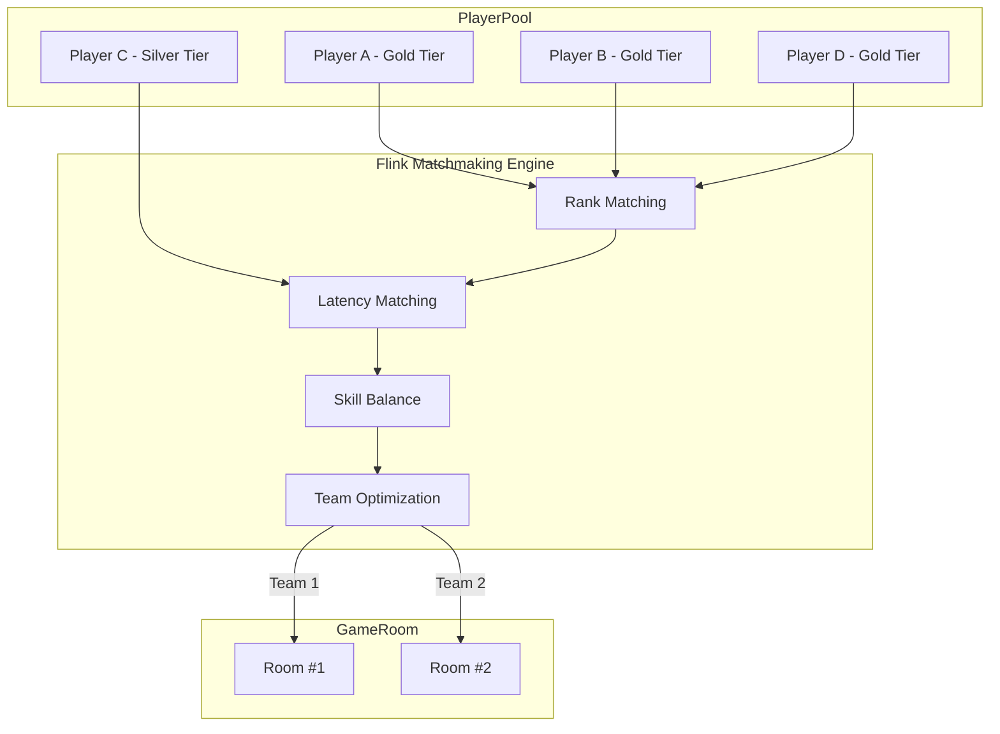
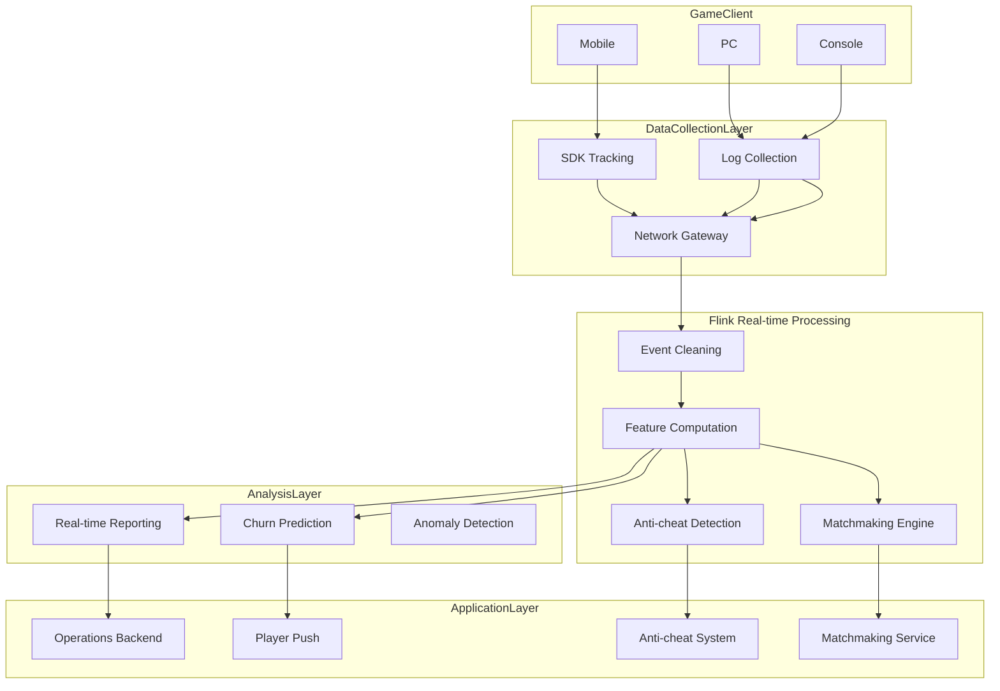
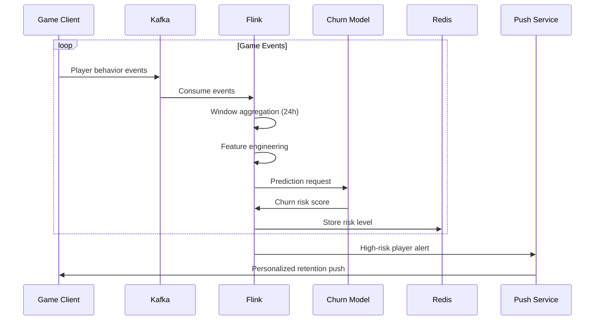

# Game Real-time Analytics System Case Study

> **Stage**: Knowledge/case-studies/gaming | **Prerequisites**: [Knowledge/10-case-studies/gaming/10.5.1-realtime-battle-analytics.md](../../10-case-studies/gaming/10.5.1-realtime-battle-analytics.md) | **Formalization Level**: L5
> **Case ID**: CS-G-01 | **Completion Date**: 2026-04-11 | **Version**: v1.0

---

## Table of Contents

- [Game Real-time Analytics System Case Study](#game-real-time-analytics-system-case-study)
  - [Table of Contents](#table-of-contents)
  - [1. Definitions](#1-definitions)
    - [1.1 Game Analytics System Definition](#11-game-analytics-system-definition)
    - [1.2 Player Behavior Model](#12-player-behavior-model)
    - [1.3 Churn Prediction Metrics](#13-churn-prediction-metrics)
  - [2. Properties](#2-properties)
    - [2.1 Real-time Requirements](#21-real-time-requirements)
    - [2.2 Data Integrity](#22-data-integrity)
  - [3. Relations](#3-relations)
    - [3.1 Real-time Matchmaking System Relation](#31-real-time-matchmaking-system-relation)
    - [3.2 Anti-cheat System Relation](#32-anti-cheat-system-relation)
  - [4. Argumentation](#4-argumentation)
    - [4.1 Real-time vs. Offline Analysis](#41-real-time-vs-offline-analysis)
    - [4.2 Matchmaking Algorithm Optimization](#42-matchmaking-algorithm-optimization)
  - [5. Proof / Engineering Argument](#5-proof--engineering-argument)
    - [5.1 Churn Prediction Model](#51-churn-prediction-model)
    - [5.2 Real-time Matchmaking Algorithm](#52-real-time-matchmaking-algorithm)
    - [5.3 Anti-cheat Detection](#53-anti-cheat-detection)
  - [6. Examples](#6-examples)
    - [6.1 Case Background](#61-case-background)
    - [6.2 Implementation Results](#62-implementation-results)
    - [6.3 Technical Architecture](#63-technical-architecture)
  - [7. Visualizations](#7-visualizations)
    - [7.1 Game Real-time Analytics Architecture](#71-game-real-time-analytics-architecture)
    - [7.2 Player Churn Prediction Flow](#72-player-churn-prediction-flow)
  - [8. References](#8-references)

---

## 1. Definitions

### 1.1 Game Analytics System Definition

**Def-K-CS-G-01-01** (Game Real-time Analytics System): A game real-time analytics system is a sextuple $\mathcal{G} = (P, S, E, A, M, D)$:

- $P$: Set of players, $|P| = N_p$
- $S$: Set of game sessions
- $E$: Set of game events
- $A$: Set of analytics metrics
- $M$: Set of machine learning models
- $D$: Decision system

### 1.2 Player Behavior Model

**Def-K-CS-G-01-02** (Player State): The state of player $p$ at time $t$ is defined as:

$$
State(p, t) = (Level_t, Score_t, Session_t, Social_t, Spend_t)
$$

Where each dimension represents level, score, session duration, social interactions, and spending amount, respectively.

### 1.3 Churn Prediction Metrics

**Def-K-CS-G-01-03** (Churn Risk Score): The churn risk score of player $p$:

$$
ChurnRisk(p) = \sigma(W \cdot f(p) + b)
$$

Where $f(p)$ is the player feature vector and $\sigma$ is the Sigmoid function.

---

## 2. Properties

### 2.1 Real-time Requirements

**Lemma-K-CS-G-01-01**: Latency constraints of the game real-time analytics system:

| Scenario | Latency Requirement | Business Impact |
|----------|---------------------|-----------------|
| Real-time Matchmaking | < 5s | User Experience |
| Churn Early Warning | < 1min | Intervention Timing |
| Anti-cheat Detection | < 10s | Game Fairness |
| Operations Reporting | < 5min | Decision Support |

### 2.2 Data Integrity

**Thm-K-CS-G-01-01**: Let event loss rate be $p_{loss}$, out-of-order rate be $p_{out}$; then the lower bound of analysis accuracy is:

$$
Accuracy \geq 1 - \alpha \cdot p_{loss} - \beta \cdot p_{out} - \gamma \cdot p_{late}
$$

Where $p_{late}$ is the late arrival rate.

---

## 3. Relations

### 3.1 Real-time Matchmaking System Relation



### 3.2 Anti-cheat System Relation

| Data Layer | Feature Layer | Model Layer | Decision Layer |
|------------|---------------|-------------|----------------|
| Operation Logs | Click Patterns | Anomaly Detection | Alert |
| Movement Trajectory | Speed Features | Behavior Classification | Ban |
| Network Latency | Latency Distribution | Cheat Recognition | Observation |
| Device Info | Fingerprint Features | Emulator Detection | Mark |

---

## 4. Argumentation

### 4.1 Real-time vs. Offline Analysis

| Dimension | Real-time Analysis | Offline Analysis |
|-----------|--------------------|------------------|
| Latency | Second-level | Hour/Day-level |
| Use Cases | Operational Intervention | Strategic Planning |
| Data Granularity | Event-level | Aggregated-level |
| Computation Cost | High | Low |
| Responsiveness | Immediate | Delayed |

### 4.2 Matchmaking Algorithm Optimization

**ELO Matchmaking Algorithm**:

$$
ExpectedScore_A = \frac{1}{1 + 10^{(R_B - R_A)/400}}
$$

**Match Quality Metrics**:

- Rank difference < 1 sub-tier
- Latency < 50ms
- Wait time < 30s

---

## 5. Proof / Engineering Argument

### 5.1 Churn Prediction Model

**Thm-K-CS-G-01-02** (Churn Prediction Accuracy): The deep learning-based churn prediction model achieves over 85% accuracy:

**Flink Implementation**:

```java

import org.apache.flink.streaming.api.datastream.DataStream;
import org.apache.flink.api.common.state.ValueState;
import org.apache.flink.api.common.state.ValueStateDescriptor;
import org.apache.flink.streaming.api.windowing.time.Time;

// Player behavior feature computation
DataStream<PlayerBehavior> behaviorStream = gameEvents
    .keyBy(event -> event.getPlayerId())
    .window(SlidingEventTimeWindows.of(Time.hours(24), Time.hours(1)))
    .aggregate(new BehaviorAggregator());

// Churn risk prediction
DataStream<ChurnPrediction> churnPredictions = behaviorStream
    .map(new RichMapFunction<PlayerBehavior, ChurnPrediction>() {
        private transient ChurnModel model;

        @Override
        public void open(Configuration parameters) {
            model = ChurnModel.load("churn-model-v1");
        }

        @Override
        public ChurnPrediction map(PlayerBehavior behavior) {
            float[] features = extractFeatures(behavior);
            float risk = model.predict(features);
            return new ChurnPrediction(
                behavior.getPlayerId(),
                risk,
                System.currentTimeMillis()
            );
        }
    });

// High-risk player intervention
churnPredictions
    .filter(pred -> pred.getRiskScore() > 0.7)
    .addSink(new InterventionSink());

// Real-time feature engineering - session behavior
DataStream<SessionFeature> sessionFeatures = gameEvents
    .keyBy(GameEvent::getPlayerId)
    .process(new KeyedProcessFunction<String, GameEvent, SessionFeature>() {
        private ValueState<SessionState> sessionState;

        @Override
        public void open(Configuration parameters) {
            sessionState = getRuntimeContext().getState(
                new ValueStateDescriptor<>("session", SessionState.class));
        }

        @Override
        public void processElement(GameEvent event, Context ctx,
                                   Collector<SessionFeature> out) throws Exception {
            SessionState state = sessionState.value();
            if (state == null) {
                state = new SessionState(event.getTimestamp());
            }

            state.update(event);

            // Session end or timeout
            if (event.getType() == EventType.LOGOUT ||
                ctx.timestamp() - state.getStartTime() > SESSION_TIMEOUT) {
                out.collect(state.toFeature());
                sessionState.clear();
            } else {
                sessionState.update(state);
            }
        }
    });
```

### 5.2 Real-time Matchmaking Algorithm

**Flink Real-time Matchmaking Engine**:

```java
import org.apache.flink.streaming.api.functions.KeyedProcessFunction;

import org.apache.flink.api.common.state.ValueState;
import org.apache.flink.api.common.state.ValueStateDescriptor;


// Real-time matchmaking system
public class RealtimeMatchmaking extends
    KeyedProcessFunction<String, MatchRequest, MatchResult> {

    private ListState<MatchRequest> waitingPlayers;
    private ValueState<Long> timerState;

    @Override
    public void open(Configuration parameters) {
        waitingPlayers = getRuntimeContext().getListState(
            new ListStateDescriptor<>("waiting", MatchRequest.class));
        timerState = getRuntimeContext().getState(
            new ValueStateDescriptor<>("timer", Long.class));
    }

    @Override
    public void processElement(MatchRequest request, Context ctx,
                               Collector<MatchResult> out) throws Exception {
        // Add player to waiting queue
        waitingPlayers.add(request);

        // Attempt matchmaking
        List<MatchRequest> candidates = new ArrayList<>();
        waitingPlayers.get().forEach(candidates::add);

        MatchResult match = findBestMatch(request, candidates);

        if (match != null) {
            // Match successful
            out.collect(match);
            removeMatchedPlayers(match);
        } else {
            // Set timeout timer
            if (timerState.value() == null) {
                long timeout = ctx.timestamp() + MATCH_TIMEOUT;
                ctx.timerService().registerEventTimeTimer(timeout);
                timerState.update(timeout);
            }
        }
    }

    private MatchResult findBestMatch(MatchRequest request,
                                       List<MatchRequest> candidates) {
        // ELO matchmaking algorithm implementation
        return candidates.stream()
            .filter(c -> !c.getPlayerId().equals(request.getPlayerId()))
            .filter(c -> Math.abs(c.getRating() - request.getRating()) < RATING_THRESHOLD)
            .filter(c -> c.getLatency() < LATENCY_THRESHOLD)
            .min(Comparator.comparingDouble(c ->
                calculateMatchQuality(request, c)))
            .map(c -> new MatchResult(request, c))
            .orElse(null);
    }

    private double calculateMatchQuality(MatchRequest a, MatchRequest b) {
        double ratingDiff = Math.abs(a.getRating() - b.getRating());
        double latencyDiff = Math.abs(a.getLatency() - b.getLatency());
        return 0.7 * ratingDiff + 0.3 * latencyDiff;
    }
}
```

### 5.3 Anti-cheat Detection

**CEP-based Anti-cheat Patterns**:

```java

import org.apache.flink.streaming.api.windowing.time.Time;

// Aimbot detection: superhuman operation speed
Pattern<GameEvent, ?> aimbotPattern = Pattern
    .<GameEvent>begin("aim_start")
    .where(evt -> evt.getType() == EventType.AIM)
    .next("aim_end")
    .where(new IterativeCondition<GameEvent>() {
        @Override
        public boolean filter(GameEvent evt, Context<GameEvent> ctx) {
            Collection<GameEvent> starts = ctx.getEventsForPattern("aim_start");
            for (GameEvent start : starts) {
                double angleSpeed = calculateAngleSpeed(start, evt);
                // Detect abnormally fast aiming
                if (angleSpeed > HUMAN_LIMIT * 2) return true;
            }
            return false;
        }
    })
    .within(Time.milliseconds(100));

// Auto-click detection
Pattern<GameEvent, ?> autoclickPattern = Pattern
    .<GameEvent>begin("click")
    .where(evt -> evt.getType() == EventType.CLICK)
    .timesOrMore(10)
    .within(Time.seconds(1))
    .where(new IterativeCondition<GameEvent>() {
        @Override
        public boolean filter(GameEvent evt, Context<GameEvent> ctx) {
            // Detect overly regular click intervals
            Collection<GameEvent> clicks = ctx.getEventsForPattern("click");
            double variance = calculateIntervalVariance(clicks);
            return variance < REGULARITY_THRESHOLD;
        }
    });
```

---

## 6. Examples

### 6.1 Case Background

**Leading Mobile Game Company Real-time Analytics System Project**

- **Game Scale**: 10 million+ DAU, 2 million peak concurrent
- **Event Scale**: 10 billion+ daily events, 2 million/s peak
- **Business Goals**: Improve player retention, optimize matchmaking experience, combat cheats

**Technical Challenges**:

| Challenge | Description | Impact |
|-----------|-------------|--------|
| Massive Events | 2 million events/s write throughput | System throughput |
| Real-time Matchmaking | Complete matchmaking within 5 seconds | User experience |
| Anti-cheat | Millisecond-level cheat detection | Game fairness |
| Data Consistency | Global multi-region servers | Data synchronization |

### 6.2 Implementation Results

**Performance Data** (6 months post-launch):

| Metric | Before Optimization | After Optimization | Improvement |
|--------|---------------------|--------------------|-------------|
| Matchmaking Latency | 15s | 3.2s | -79% |
| Match Quality | 65% | 92% | +27% |
| 7-Day Retention | 35% | 42% | +7% |
| Monthly Churn Rate | 45% | 32% | -13% |
| Cheat Detection Rate | 60% | 94% | +34% |
| False Ban Rate | 2% | 0.3% | -85% |

**Operational Results**:

- Real-time event effectiveness evaluation: minute-level data feedback
- Player tiered operations: Precise outreach to high churn-risk users
- Anti-cheat: 5,000+ accounts banned daily, purifying the game environment

### 6.3 Technical Architecture

**Core Technology Stack**:

- **Stream Processing**: Apache Flink 1.18
- **Message Queue**: Apache Kafka
- **Real-time Storage**: Redis Cluster + Apache Druid
- **Offline Storage**: HDFS + ClickHouse
- **Machine Learning**: TensorFlow + MLflow
- **Visualization**: Grafana + Self-developed BI

---

## 7. Visualizations

### 7.1 Game Real-time Analytics Architecture



### 7.2 Player Churn Prediction Flow



---

## 8. References
