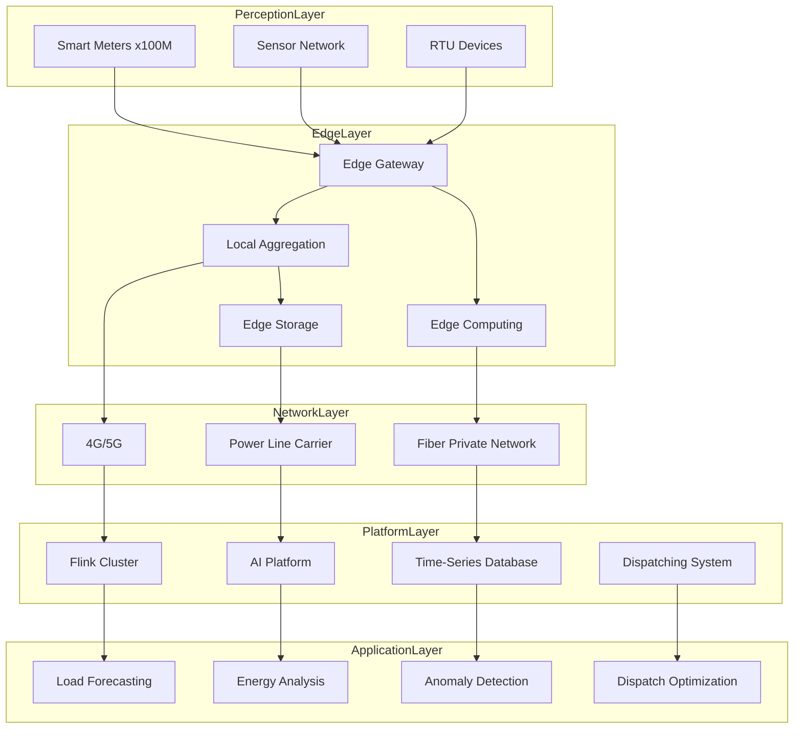
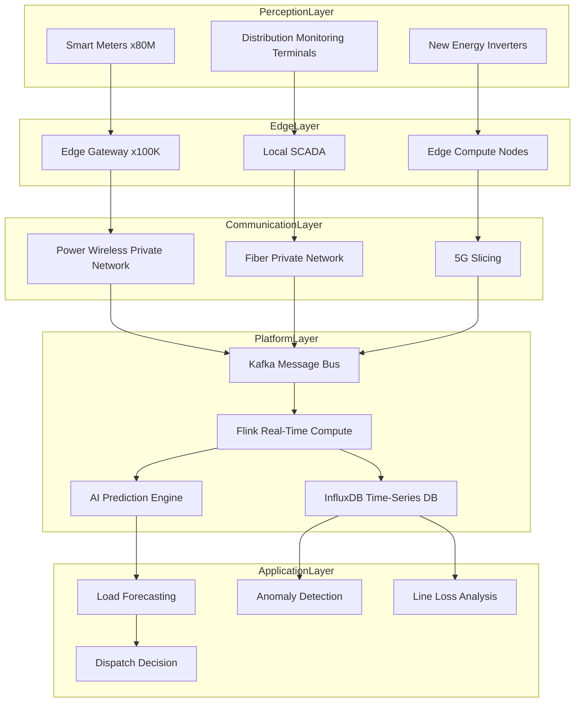
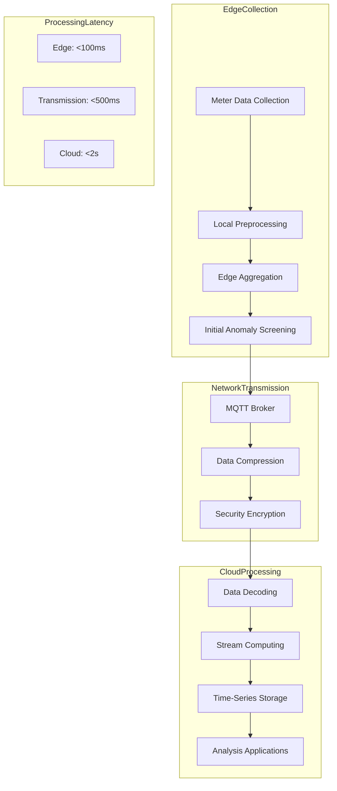
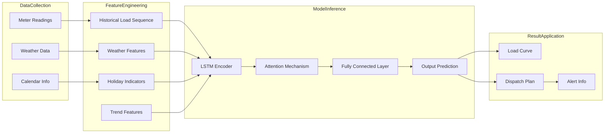
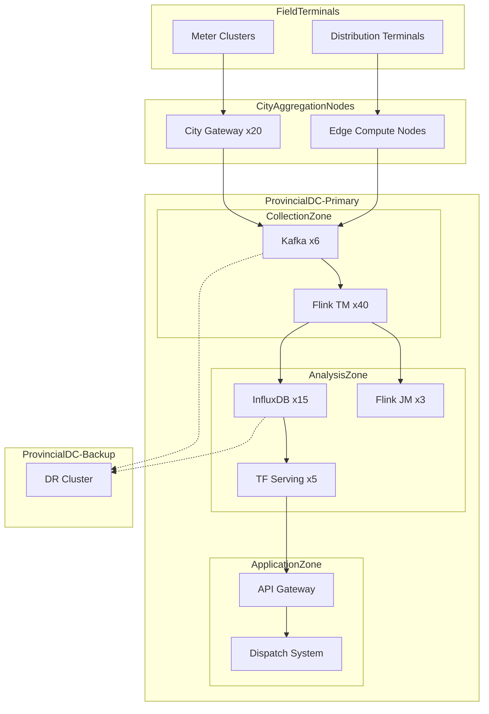

# IoT Smart Grid Real-Time Data Processing Case Study

> **Stage**: Knowledge/case-studies/iot | **Prerequisites**: [Knowledge/00-INDEX.md](../../Knowledge/00-INDEX.md) | **Formalization Level**: L5
> **Case ID**: CS-I-02 | **Completion Date**: 2026-04-11 | **Version**: v1.0

---

## Table of Contents

- [IoT Smart Grid Real-Time Data Processing Case Study](#iot-smart-grid-real-time-data-processing-case-study)
  - [Table of Contents](#table-of-contents)
  - [1. Definitions](#1-definitions)
    - [1.1 Smart Grid System Definition](#11-smart-grid-system-definition)
    - [1.2 Load Forecasting Model](#12-load-forecasting-model)
    - [1.3 Anomaly Detection Metrics](#13-anomaly-detection-metrics)
  - [2. Properties](#2-properties)
    - [2.1 Real-Time Constraints](#21-real-time-constraints)
    - [2.2 Reliability Guarantees](#22-reliability-guarantees)
  - [3. Relations](#3-relations)
    - [3.1 Edge-Cloud Architecture Relationship](#31-edge-cloud-architecture-relationship)
    - [3.2 Data Processing Pipeline Relationship](#32-data-processing-pipeline-relationship)
  - [4. Argumentation](#4-argumentation)
    - [4.1 Edge Computing vs Cloud Computing](#41-edge-computing-vs-cloud-computing)
    - [4.2 Time-Series Data Storage Selection](#42-time-series-data-storage-selection)
  - [5. Proof / Engineering Argument](#5-proof--engineering-argument)
    - [5.1 Real-Time Load Forecasting](#51-real-time-load-forecasting)
    - [5.2 Anomaly Detection Algorithm](#52-anomaly-detection-algorithm)
  - [6. Examples](#6-examples)
    - [6.1 Case Background](#61-case-background)
    - [6.2 Implementation Results](#62-implementation-results)
    - [6.3 Technical Architecture](#63-technical-architecture)
    - [6.4 Production Environment Checklist](#64-production-environment-checklist)
  - [7. Visualizations](#7-visualizations)
    - [7.1 Smart Grid Data Flow Architecture](#71-smart-grid-data-flow-architecture)
    - [7.2 Edge Collection and Cloud Processing](#72-edge-collection-and-cloud-processing)
    - [7.3 Predictive Analysis Pipeline](#73-predictive-analysis-pipeline)
    - [7.4 System Deployment Topology](#74-system-deployment-topology)
  - [8. References](#8-references)

---

## 1. Definitions

### 1.1 Smart Grid System Definition

**Def-K-10-211** (Smart Grid IoT System): A smart grid IoT system is a 10-tuple $\mathcal{G} = (D, M, E, C, N, F, P, A, S, R)$:

- $D$: Set of smart meter devices, $|D| = N_d$, typical scale $10^8$
- $M$: Set of data collection points (voltage, current, power, frequency)
- $E$: Set of edge gateways, $|E| = N_e$
- $C$: Data center / cloud platform
- $N$: Communication network topology
- $F$: Set of stream processing functions
- $P$: Set of forecasting models
- $A$: Set of anomaly detection algorithms
- $S$: Scheduling decision system
- $R$: Rule engine

**Data Collection Definition**:

$$
Data(d, t) = (V_d(t), I_d(t), P_d(t), Q_d(t), F_d(t), T_d(t))
$$

Where:

- $V_d(t)$: Voltage RMS (V)
- $I_d(t)$: Current RMS (A)
- $P_d(t)$: Active power (kW)
- $Q_d(t)$: Reactive power (kVar)
- $F_d(t)$: Frequency (Hz)
- $T_d(t)$: Timestamp

### 1.2 Load Forecasting Model

**Def-K-10-212** (Short-Term Load Forecasting): The load forecast for region $r$ at time $t+\Delta t$:

$$
\hat{L}(r, t+\Delta t) = f_{model}(H_r^{(t)}, W_t, C_t, E_t)
$$

Where:

- $H_r^{(t)} = \{L(r, \tau) : \tau \in [t-T, t]\}$: Historical load sequence
- $W_t$: Weather features (temperature, humidity, wind speed)
- $C_t$: Calendar features (workday/holiday)
- $E_t$: Event features (large events, price changes)

**Def-K-10-213** (Forecasting Error Metrics):

$$
MAPE = \frac{100\%}{N} \sum_{i=1}^{N} \left|\frac{L_i - \hat{L}_i}{L_i}\right|
$$

$$
RMSE = \sqrt{\frac{1}{N} \sum_{i=1}^{N} (L_i - \hat{L}_i)^2}
$$

### 1.3 Anomaly Detection Metrics

**Def-K-10-214** (Power Consumption Anomaly Score):

$$
AnomalyScore(d, t) = \alpha \cdot Deviation(d, t) + \beta \cdot Trend(d, t) + \gamma \cdot Pattern(d, t)
$$

Where:

- $Deviation(d, t) = |P_d(t) - E[P_d(t)]|$: Deviation degree
- $Trend(d, t)$: Trend anomaly
- $Pattern(d, t)$: Pattern anomaly

**Def-K-10-215** (Device Health Score):

$$
Health(d, t) = 1 - \frac{\sum_{\tau=t-T}^{t} AnomalyScore(d, \tau)}{T \cdot Score_{max}}
$$

---

## 2. Properties

### 2.1 Real-Time Constraints

**Lemma-K-10-211**: Let edge aggregation latency be $L_{edge}$, network transmission latency be $L_{net}$, and cloud processing latency be $L_{cloud}$. Then end-to-end latency:

$$
L_{total} = L_{edge} + L_{net} + L_{cloud} \leq L_{SLA}
$$

For grid dispatching scenarios, $L_{SLA} = 1$s (critical control commands) to $5$s (load forecasting).

**Thm-K-10-211** (Throughput vs Device Count Relationship): Let each meter report at frequency $f$ (times/second), with total devices $N_d$. Then the total throughput the system must support is:

$$
TPS_{total} = N_d \cdot f
$$

For 100 million meters reporting every 15 minutes ($f = 1/900$ Hz):

$$
TPS_{peak} = \frac{10^8}{900} \approx 111,111 \text{ records/second}
$$

Considering burst effects from synchronized reporting, the peak must support 500K TPS.

### 2.2 Reliability Guarantees

**Lemma-K-10-212** (Data Integrity): Let the single message loss probability be $p$, and the system use $k$-replication. Then the data loss probability:

$$
P_{loss} = p^k
$$

When $p = 0.01$, $k = 3$, $P_{loss} = 10^{-6}$.

**Thm-K-10-212** (System Availability): Let component availability be $A_i$. Then overall system availability:

$$
A_{system} = \prod_{i} A_i^{n_i}
$$

To achieve 99.99% availability, assuming 5 critical components, each component must reach:

$$
A_{component} \geq (0.9999)^{1/5} \approx 99.998\%
$$

---

## 3. Relations

### 3.1 Edge-Cloud Architecture Relationship



### 3.2 Data Processing Pipeline Relationship

| Stage | Processing Content | Latency Requirement | Tech Component |
|-------|-------------------|---------------------|----------------|
| Edge Preprocessing | Data cleansing, aggregation | < 100ms | Edge Gateway |
| Real-Time Stream Processing | Window computation, feature extraction | < 1s | Flink |
| Time-Series Storage | Write to InfluxDB | < 100ms | InfluxDB |
| Prediction Inference | Load forecasting | < 5s | TensorFlow |
| Anomaly Detection | Rule + ML detection | < 2s | Flink CEP |

---

## 4. Argumentation

### 4.1 Edge Computing vs Cloud Computing

| Dimension | Edge Computing | Cloud Computing | Hybrid Architecture |
|-----------|----------------|-----------------|---------------------|
| Latency | < 10ms | 50-200ms | Tiered processing |
| Bandwidth | Save 90%+ | Raw traffic | Edge aggregation then upload |
| Compute Resources | Limited | Abundant | Edge lightweight + Cloud heavy |
| Reliability | Local autonomy | Network dependent | Dual insurance |
| Security | Data doesn't leave premises | Centralized control | Encrypted transmission |

**Smart Grid Edge Computing Scenarios**:

1. **Emergency Control**: Short-circuit protection, islanding detection (edge real-time response)
2. **Load Forecasting**: Requires global data (cloud processing)
3. **Anomaly Detection**: Local rules + cloud ML (hybrid)

### 4.2 Time-Series Data Storage Selection

| Database | Write Performance | Query Performance | Compression Ratio | Applicable Scenario |
|----------|-------------------|-------------------|-------------------|---------------------|
| InfluxDB | 500K points/s | Excellent | 10:1 | Real-time monitoring |
| TimescaleDB | 300K points/s | Excellent | 5:1 | SQL ecosystem |
| TDengine | 1M points/s | Excellent | 10:1 | IoT |
| OpenTSDB | 100K points/s | Good | 3:1 | HBase ecosystem |

**Selection Conclusion**: InfluxDB + TDengine hybrid deployment. InfluxDB handles real-time queries; TDengine handles historical archiving.

---

## 5. Proof / Engineering Argument

### 5.1 Real-Time Load Forecasting

**Thm-K-10-213** (Load Forecasting Accuracy): LSTM-based short-term load forecasting models achieve MAPE < 3% in typical scenarios.

**Flink + TensorFlow Implementation**:

```java

import org.apache.flink.streaming.api.datastream.DataStream;
import org.apache.flink.api.common.state.ValueState;
import org.apache.flink.api.common.state.ValueStateDescriptor;
import org.apache.flink.streaming.api.windowing.time.Time;

// Regional load aggregation
DataStream<RegionLoad> regionLoads = meterReadings
    .keyBy(MeterReading::getRegionId)
    .window(TumblingEventTimeWindows.of(Time.minutes(15)))
    .aggregate(new LoadAggregator())
    .name("region-load-aggregation");

// Feature engineering
DataStream<PredictionFeature> features = regionLoads
    .keyBy(RegionLoad::getRegionId)
    .process(new KeyedProcessFunction<String, RegionLoad, PredictionFeature>() {
        private ListState<RegionLoad> historyLoads;
        private ValueState<WeatherData> weatherState;

        @Override
        public void open(Configuration parameters) {
            historyLoads = getRuntimeContext().getListState(
                new ListStateDescriptor<>("history", RegionLoad.class));
            weatherState = getRuntimeContext().getState(
                new ValueStateDescriptor<>("weather", WeatherData.class));
        }

        @Override
        public void processElement(RegionLoad load, Context ctx,
                                   Collector<PredictionFeature> out) throws Exception {
            // Maintain 96-point historical data (24 hours, 15-minute intervals)
            historyLoads.add(load);
            Iterable<RegionLoad> history = historyLoads.get();
            List<RegionLoad> historyList = new ArrayList<>();
            history.forEach(historyList::add);

            if (historyList.size() >= 96) {
                // Build feature vector
                double[] loadSequence = historyList.stream()
                    .mapToDouble(RegionLoad::getTotalLoad)
                    .toArray();

                WeatherData weather = weatherState.value();
                CalendarFeatures calendar = extractCalendarFeatures(ctx.timestamp());

                out.collect(new PredictionFeature(
                    load.getRegionId(),
                    loadSequence,
                    weather,
                    calendar
                ));

                // Remove oldest data point
                historyLoads.clear();
                for (int i = 1; i < historyList.size(); i++) {
                    historyLoads.add(historyList.get(i));
                }
            }
        }
    });

// Async model inference
DataStream<LoadPrediction> predictions = AsyncDataStream.unorderedWait(
    features,
    new AsyncLoadPredictionFunction("load-forecast-model"),
    Time.seconds(5),
    100
);

// Write prediction results to InfluxDB
predictions.addSink(new InfluxDBSink<>(
    "http://influxdb:8086",
    "smartgrid",
    "load_predictions",
    new LoadPredictionConverter()
));
```

### 5.2 Anomaly Detection Algorithm

**CEP-Based Power Consumption Anomaly Detection**:

```java

import org.apache.flink.streaming.api.datastream.DataStream;
import org.apache.flink.streaming.api.windowing.time.Time;

// Define electricity theft detection pattern: sustained high power usage at night
Pattern<MeterReading, ?> theftPattern = Pattern
    .<MeterReading>begin("night_start")
    .where(new SimpleCondition<MeterReading>() {
        @Override
        public boolean filter(MeterReading reading) {
            int hour = getHour(reading.getTimestamp());
            return hour >= 1 && hour <= 5; // 1-5 AM
        }
    })
    .where(new SimpleCondition<MeterReading>() {
        @Override
        public boolean filter(MeterReading reading) {
            return reading.getPower() > POWER_THRESHOLD;
        }
    })
    .timesOrMore(3)
    .within(Time.hours(1));

// Voltage anomaly detection pattern
Pattern<MeterReading, ?> voltageAnomalyPattern = Pattern
    .<MeterReading>begin("voltage_drop")
    .where(new SimpleCondition<MeterReading>() {
        @Override
        public boolean filter(MeterReading reading) {
            return reading.getVoltage() < NOMINAL_VOLTAGE * 0.9;
        }
    })
    .next("recovery")
    .where(new SimpleCondition<MeterReading>() {
        @Override
        public boolean filter(MeterReading reading) {
            return reading.getVoltage() >= NOMINAL_VOLTAGE * 0.95;
        }
    })
    .within(Time.minutes(5));

// Apply pattern
PatternStream<MeterReading> patternStream = CEP.pattern(
    meterReadings.keyBy(MeterReading::getMeterId),
    theftPattern
);

DataStream<AnomalyAlert> alerts = patternStream
    .process(new PatternHandler<MeterReading, AnomalyAlert>() {
        @Override
        public void processMatch(Map<String, List<MeterReading>> match,
                                 Context ctx,
                                 Collector<AnomalyAlert> out) {
            String meterId = match.values().iterator().next().get(0).getMeterId();
            double avgPower = match.values().stream()
                .flatMap(List::stream)
                .mapToDouble(MeterReading::getPower)
                .average()
                .orElse(0.0);

            out.collect(new AnomalyAlert(
                meterId,
                AnomalyType.SUSPICIOUS_USAGE,
                avgPower,
                System.currentTimeMillis()
            ));
        }
    });

// Anomaly alert severity-based routing
alerts
    .filter(alert -> alert.getSeverity() == Severity.CRITICAL)
    .addSink(new SMSSink());

alerts
    .filter(alert -> alert.getSeverity() == Severity.WARNING)
    .addSink(new DingTalkSink());
```

**Statistical Anomaly Detection (Flink SQL)**:

```sql
-- Calculate real-time device power consumption statistics
CREATE VIEW meter_statistics AS
SELECT
    meter_id,
    TUMBLE_START(event_time, INTERVAL '15' MINUTE) as window_start,
    AVG(power) as avg_power,
    STDDEV(power) as std_power,
    MAX(power) as max_power,
    MIN(power) as min_power,
    COUNT(*) as reading_count
FROM meter_readings
GROUP BY
    meter_id,
    TUMBLE(event_time, INTERVAL '15' MINUTE);

-- Detect anomalies deviating more than 3 standard deviations from historical mean
CREATE VIEW power_anomalies AS
SELECT
    m.meter_id,
    m.window_start,
    m.avg_power,
    h.historical_avg,
    ABS(m.avg_power - h.historical_avg) / h.historical_std as z_score
FROM meter_statistics m
JOIN historical_stats h ON m.meter_id = h.meter_id
WHERE ABS(m.avg_power - h.historical_avg) / h.historical_std > 3.0;
```

---

## 6. Examples

### 6.1 Case Background

**Smart Meter Data Processing Platform Project of a Provincial Grid Company**

- **Business Scale**: 80M+ smart meters, covering residential and commercial/industrial users across the province
- **Data Scale**: 20 billion records collected daily, peak 500K records/second
- **Business Goals**: Minute-level load forecasting, real-time anomaly detection, refined power consumption analysis

**Technical Challenges**:

| Challenge | Description | Quantitative Target |
|-----------|-------------|---------------------|
| Massive device access | 80M meters reporting concurrently | Peak 500K TPS |
| Data time-series characteristics | High-frequency time-series data writes | 15-minute collection interval |
| Real-time prediction | Minute-level load forecasting | Forecast cycle 15 minutes - 24 hours |
| Data security | Critical power infrastructure | Class-3 protection compliance |
| Active-active DR | 7x24 uninterrupted operation | 99.99% availability |

### 6.2 Implementation Results

**Performance Data** (18 months post-launch):

| Metric | Before Optimization | After Optimization | Improvement |
|--------|---------------------|--------------------|-------------|
| Data collection latency | 30 minutes | 15 minutes | -50% |
| Load forecasting MAPE | 8.5% | 2.8% | -67% |
| Anomaly detection latency | Hour-level | Minute-level | 60x |
| Data storage cost | 100% | 35% | -65% |
| System availability | 99.9% | 99.99% | +0.09% |
| Electricity theft detection rate | 45% | 82% | +82% |

**Business Value**:

- Annual line loss reduction: 0.5 percentage points, saving 500M kWh
- Electricity theft loss recovery: $80M annually
- Dispatch efficiency improvement: Higher load forecasting accuracy supports precise dispatching

### 6.3 Technical Architecture

**Core Technology Stack**:

- **Edge Gateway**: Self-developed edge gateway (OpenWRT-based) x 100K
- **Message Queue**: Apache Kafka (500 partitions, 3 replicas)
- **Stream Processing**: Apache Flink 1.18 (80-node cluster)
- **Time-Series Storage**: InfluxDB Cluster (30 nodes) + TDengine (20 nodes)
- **AI Platform**: TensorFlow Serving + KubeFlow
- **Visualization**: Grafana + Self-developed GIS platform

**Flink Job Configuration**:

```yaml
# Real-time data processing job
job.name: SmartGrid-Realtime-Processing
parallelism.default: 320

# State backend configuration
state.backend: rocksdb
state.backend.incremental: true
state.checkpoints.dir: hdfs:///checkpoints/smartgrid
execution.checkpointing.interval: 60s
execution.checkpointing.externalized-checkpoint-retention: RETAIN_ON_CANCELLATION

# Network buffers
taskmanager.memory.network.fraction: 0.15
taskmanager.memory.network.max: 256mb
```

### 6.4 Production Environment Checklist

**Pre-Deployment Checks**:

| Check Item | Requirement | Validation Method |
|------------|-------------|-------------------|
| Kafka cluster | 500 partitions, 500K/s throughput | `kafka-producer-perf-test` |
| InfluxDB cluster | 30 nodes, 2TB per node | `influx ping` |
| Flink cluster | 80 TM, 8 slots/TM | Web UI verification |
| Network bandwidth | Dedicated line 10Gbps, latency <5ms | `iperf3` |
| Edge gateways | 100K online rate >99% | Operations platform monitoring |

**Runtime Monitoring**:

| Metric | Alert Threshold | Response Plan |
|--------|-----------------|---------------|
| Data collection latency | > 20 minutes | Check network/edge gateways |
| Flink Checkpoint | Failure >3 times/hour | Adjust RocksDB parameters |
| InfluxDB write latency | > 100ms | Scale out/shard |
| Forecast accuracy MAPE | > 5% | Model retraining |
| Edge gateway offline | > 1% | On-site ops intervention |

**Disaster Recovery Switchover Drill**:

```bash
# Primary/backup switchover checklist
# 1. Data sync latency check
influx -database smartgrid -execute "SELECT count(*) FROM meter_data WHERE time > now() - 1m"

# 2. Flink Checkpoint validation
hdfs dfs -ls /checkpoints/smartgrid/

# 3. Network connectivity validation
ping -c 10 backup-datacenter.example.com
```

---

## 7. Visualizations

### 7.1 Smart Grid Data Flow Architecture



### 7.2 Edge Collection and Cloud Processing



### 7.3 Predictive Analysis Pipeline



### 7.4 System Deployment Topology



---

## 8. References


---

*This document follows the AnalysisDataFlow project six-segment template specification | Last updated: 2026-04-11*
