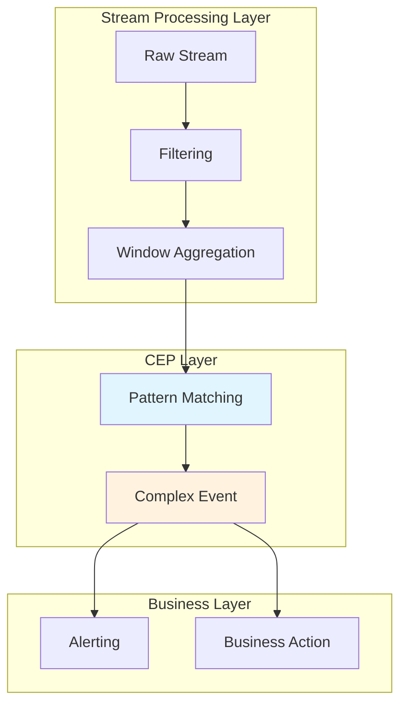
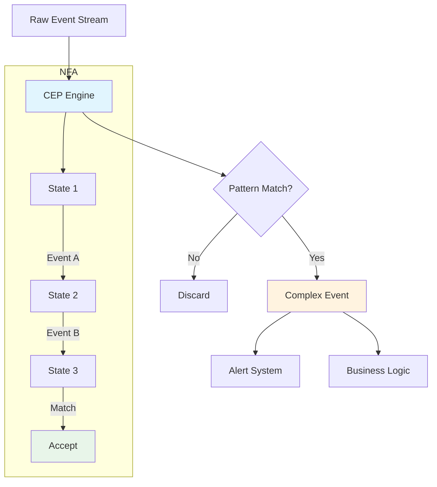
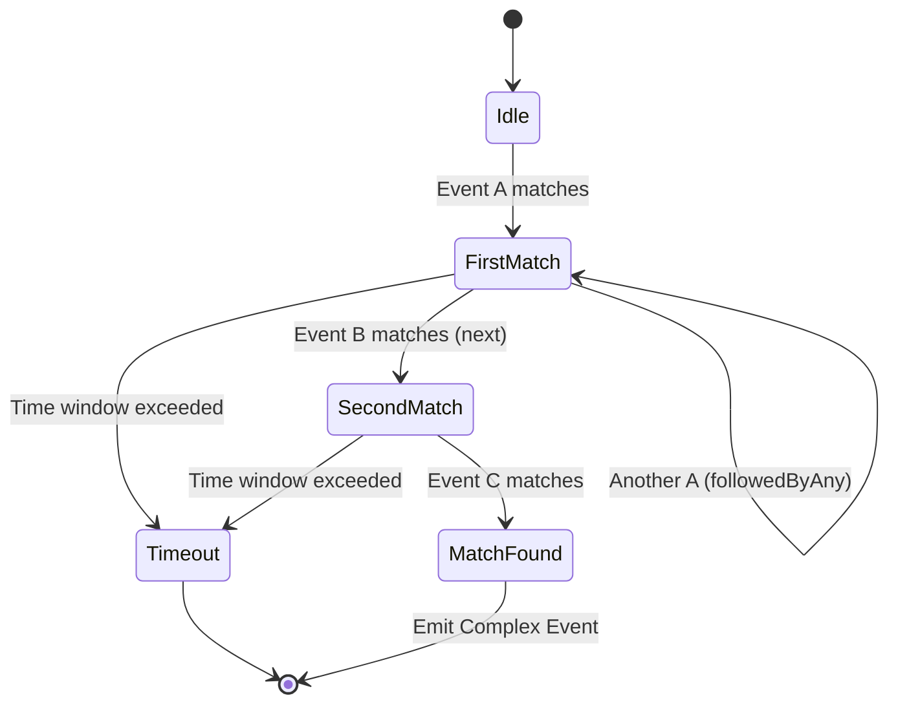
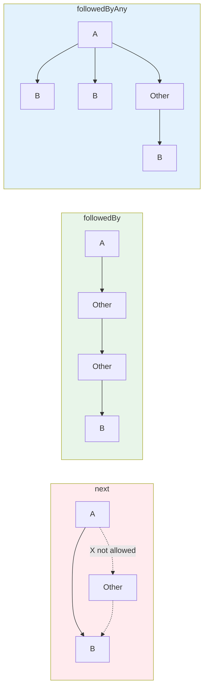

# CEP (Complex Event Processing) Complete Tutorial

> Stage: Knowledge | Prerequisites: [Flink/time-semantics-and-watermark.md](../Flink/02-core/time-semantics-and-watermark.md) | Formalization Level: L4

---

## 1. Definitions

### Def-K-CEP-01: Complex Event Processing (CEP)

**Definition**: CEP is a technology that detects complex patterns from event streams by recognizing correlations among low-level events to derive higher-level business events.

$$
\text{CEP} = (E, P, M, A)
$$

Where:

- $E$: Event stream $E = \{e_1, e_2, ..., e_n\}$
- $P$: Pattern definition $P = (S, C, T)$
  - $S$: Structural constraints (event sequence order)
  - $C$: Attribute conditions (event content matching)
  - $T$: Time constraints (window limits)
- $M$: Match function $M: E \times P \rightarrow \{0, 1\}$
- $A$: Action (processing logic after match)

**Core Capabilities**:

```
Low-level Events → [CEP Engine] → Complex Pattern Recognition → High-level Business Events
├── Login Events         ├── Abnormal Login Sequence      └── Account Theft Alert
├── Transaction Events     ├── Fraud Pattern                └── Fraud Alert
└── Device Events          └── Device Failure Sequence      └── Device Failure Prediction
```

### Def-K-CEP-02: Pattern

**Definition**: A pattern is an abstract description of the target event sequence:

$$
\text{Pattern} = (N, R, C, T)
$$

Where:

- $N$: Set of pattern stage names
- $R$: Contiguity strategy
- $C$: Individual event conditions
- $T$: Global time window

**Pattern Type Hierarchy**:

| Type | Symbol | Example |
|------|--------|---------|
| Single Event | $A$ | `temperature > 100` |
| Sequence | $A \rightarrow B$ | `Login → Payment` |
| Loop | $A\{n,m\}$ | `Failed login attempts{3,5}` |
| Negation | $A \rightarrow !B \rightarrow C$ | `Start → No Cancel → Complete` |
| Combination | $(A \rightarrow B) \text{ OR } (C \rightarrow D)$ | Multi-path pattern |

### Def-K-CEP-03: Contiguity Strategy

**Definition**: Defines the allowed gap between adjacent events in a sequence:

| Strategy | Symbol | Semantic Description |
|----------|--------|----------------------|
| **Strict Contiguity** | $\xrightarrow{\text{next}}$ | Events must be adjacent, no intermediate events allowed |
| **Relaxed Contiguity** | $\xrightarrow{\text{followedBy}}$ | Events in order, intermediate events allowed |
| **Non-deterministic Relaxed** | $\xrightarrow{\text{followedByAny}}$ | Each event can match multiple successors |
| **Next Negation** | $\xrightarrow{\text{notNext}}$ | Adjacent event must not be X |
| **Relaxed Negation** | $\xrightarrow{\text{notFollowedBy}}$ | Subsequent event must not be X |

---

## 2. Properties

### Lemma-K-CEP-01: Pattern Matching Completeness

**Lemma**: Given pattern $P$ and event stream $E$, the CEP engine can find all event subsequences satisfying $P$.

**Proof Sketch**:

1. Model the pattern using NFA (non-deterministic finite automaton)
2. Each event drives state transitions
3. Output match when reaching an accepting state
4. Backtracking mechanism guarantees no possible match is missed

### Lemma-K-CEP-02: Time Window Constraint

**Lemma**: Time window $T$ limits the time span of pattern matching:

$$
\text{Match}(S, P) \Rightarrow t_{last} - t_{first} \leq T_{window}
$$

**Timeout Handling**:

- Partial matches are discarded when the window times out
- Timeout events can trigger timeout alerts (via `within` and `timeout` tags)

### Prop-K-CEP-01: State Space Complexity

**Proposition**: The state space of pattern matching is linear in pattern length and number of event types.

$$
\text{Space} = O(|P| \times |E_{types}|)
$$

Where:

- $|P|$: Number of pattern stages
- $|E_{types}|$: Number of event types

---

## 3. Relations

### 3.1 CEP and Regular Expression Relationship

| Regular Expression | CEP Pattern | Semantics |
|--------------------|-------------|-----------|
| `a*` | `A.oneOrMore()` | A occurs one or more times |
| `a?` | `A.optional()` | A occurs zero or one time |
| `a{n,m}` | `A.times(n, m)` | A occurs n to m times |
| `a\|b` | `A.or(B)` | A or B |
| `ab` | `A.next(B)` | A immediately followed by B |
| `a.*b` | `A.followedBy(B)` | A followed by B after arbitrary events |

### 3.2 CEP vs SQL Pattern Recognition Comparison

| Characteristic | Flink CEP | SQL MATCH_RECOGNIZE |
|----------------|-----------|---------------------|
| Expressiveness | Strong (Turing-complete) | Medium (regular-class) |
| Usage | Java API | SQL declarative |
| Window handling | Explicit | Implicit PARTITION BY |
| Action definition | Flexible | SELECT projection |
| Applicable scenario | Complex business logic | Simple pattern recognition |

### 3.3 CEP and Stream Processing Relationship



---

## 4. Argumentation

### 4.1 Contiguity Strategy Selection

**Decision Matrix**:

| Strategy | Pros | Cons | Applicable Scenario |
|----------|------|------|---------------------|
| next | Precise match, high performance | Easy to miss matches | Strict order requirements |
| followedBy | Flexible, fault-tolerant | May produce too many matches | General business processes |
| followedByAny | Captures all possibilities | State explosion risk | Need all matches |

### 4.2 Time Window Design

**Window Size Trade-offs**:

| Window Size | Pros | Cons |
|-------------|------|------|
| Small (seconds) | Low latency, few false positives | May miss slow attacks |
| Medium (minutes) | Balanced | Medium state overhead |
| Large (hours) | Captures long-term patterns | High state overhead, high latency |

---

## 5. Proof / Engineering Argument

### Thm-K-CEP-01: NFA Pattern Matching Correctness

**Theorem**: The NFA-based CEP implementation can correctly recognize all event sequences satisfying the pattern.

**Proof Sketch**:

1. **Pattern to NFA**: Each pattern stage corresponds to an NFA state
2. **Event-driven**: Each event triggers state transitions
3. **Accepting state**: Output match when reaching accepting state
4. **Completeness**: NFA's $\epsilon$-transitions and backtracking guarantee no match is missed

### Thm-K-CEP-02: Checkpoint Recovery Consistency

**Theorem**: Under Exactly-Once semantics, CEP pattern matching results after state recovery are consistent with those before the failure.

**Proof**:

1. CEP state includes: pending partial sequences, NFA states
2. Complete state is persisted at Checkpoint time
3. Resume from Checkpoint state after recovery
4. Already processed events are not replayed (Flink guarantee)
5. Therefore matching results are consistent

---

## 6. Examples

### 6.1 Maven Dependency

```xml
<dependency>
    <groupId>org.apache.flink</groupId>
    <artifactId>flink-cep</artifactId>
    <version>1.17.0</version>
</dependency>
```

### 6.2 Fraud Detection Pattern Example

```java
// [伪代码片段 - 不可直接运行] 仅展示核心逻辑
import org.apache.flink.cep.Pattern;
import org.apache.flink.cep.CEP;
import org.apache.flink.cep.pattern.conditions.SimpleCondition;

import org.apache.flink.streaming.api.datastream.DataStream;
import org.apache.flink.streaming.api.windowing.time.Time;


// Define fraud detection pattern: small test followed by large transaction
Pattern<Transaction, ?> fraudPattern = Pattern
    .<Transaction>begin("small-amount")
    .where(new SimpleCondition<Transaction>() {
        @Override
        public boolean filter(Transaction tx) {
            return tx.getAmount() < 10.0;  // small test
        }
    })
    .followedBy("large-amount")
    .where(new SimpleCondition<Transaction>() {
        @Override
        public boolean filter(Transaction tx) {
            return tx.getAmount() > 1000.0;  // large transaction
        }
    })
    // Same user, within 10 minutes
    .where(new SimpleCondition<Transaction>() {
        @Override
        public boolean filter(Transaction tx) {
            return tx.getUserId().equals(
                ctx.getEventsForPattern("small-amount")
                   .get(0).getUserId()
            );
        }
    })
    .within(Time.minutes(10));

// Apply to stream
DataStream<Transaction> txStream = ...;
PatternStream<Transaction> patternStream = CEP.pattern(txStream, fraudPattern);

// Process matches
DataStream<Alert> alerts = patternStream
    .select(new PatternSelectFunction<Transaction, Alert>() {
        @Override
        public Alert select(Map<String, List<Transaction>> pattern) {
            Transaction small = pattern.get("small-amount").get(0);
            Transaction large = pattern.get("large-amount").get(0);
            return new Alert(small.getUserId(), "FRAUD_PATTERN",
                "Small: " + small.getAmount() + ", Large: " + large.getAmount());
        }
    });
```

### 6.3 Abnormal Login Detection Pattern

```java

// [伪代码片段 - 不可直接运行] 仅展示核心逻辑
import org.apache.flink.streaming.api.windowing.time.Time;

// 5 failed logins within 3 minutes followed by 1 successful login
Pattern<LoginEvent, ?> suspiciousLogin = Pattern
    .<LoginEvent>begin("failed-logins")
    .where(new SimpleCondition<LoginEvent>() {
        @Override
        public boolean filter(LoginEvent event) {
            return !event.isSuccess();
        }
    })
    .timesOrMore(5)
    .greedy()
    .followedBy("success-login")
    .where(new SimpleCondition<LoginEvent>() {
        @Override
        public boolean filter(LoginEvent event) {
            return event.isSuccess();
        }
    })
    .within(Time.minutes(3));

// Handle timeout (no successful login occurred)
patternStream
    .process(new PatternProcessFunction<LoginEvent, Alert>() {
        @Override
        public void processMatch(Map<String, List<LoginEvent>> match,
                                 Context ctx, Collector<Alert> out) {
            // Process match
        }

        @Override
        public void processTimedOutMatch(Map<String, List<LoginEvent>> match,
                                         Context ctx, Collector<Alert> out) {
            // Timeout handling: multiple failed logins without success
            out.collect(new Alert(match.get("failed-logins").get(0).getUserId(),
                "BRUTE_FORCE_ATTEMPT", "Multiple failed logins without success"));
        }
    });
```

### 6.4 Device Failure Prediction Pattern

```java

// [伪代码片段 - 不可直接运行] 仅展示核心逻辑
import org.apache.flink.streaming.api.windowing.time.Time;

// Continuous temperature rise then exceeds threshold
Pattern<SensorReading, ?> overheatingPattern = Pattern
    .<SensorReading>begin("first")
    .where(new SimpleCondition<SensorReading>() {
        @Override
        public boolean filter(SensorReading reading) {
            return reading.getTemperature() > 80;
        }
    })
    .next("second")
    .where(new IterativeCondition<SensorReading>() {
        @Override
        public boolean filter(SensorReading reading, Context<SensorReading> ctx) {
            double firstTemp = ctx.getEventsForPattern("first")
                .get(0).getTemperature();
            return reading.getTemperature() > firstTemp + 5;
        }
    })
    .next("third")
    .where(new IterativeCondition<SensorReading>() {
        @Override
        public boolean filter(SensorReading reading, Context<SensorReading> ctx) {
            double secondTemp = ctx.getEventsForPattern("second")
                .get(0).getTemperature();
            return reading.getTemperature() > secondTemp + 5;
        }
    })
    .within(Time.seconds(30));
```

### 6.5 SQL MATCH_RECOGNIZE Equivalent

```sql
-- Using SQL pattern recognition (Flink SQL)
SELECT *
FROM transactions
MATCH_RECOGNIZE (
    PARTITION BY user_id
    ORDER BY event_time
    MEASURES
        A.amount AS small_amount,
        B.amount AS large_amount,
        A.event_time AS start_time
    ONE ROW PER MATCH
    PATTERN (A B)
    DEFINE
        A AS amount < 10,
        B AS amount > 1000
) MR;
```

---

## 7. Visualizations

### 7.1 CEP Architecture Flow



### 7.2 Pattern Matching State Machine



### 7.3 Contiguity Strategy Comparison



---

## 8. References
