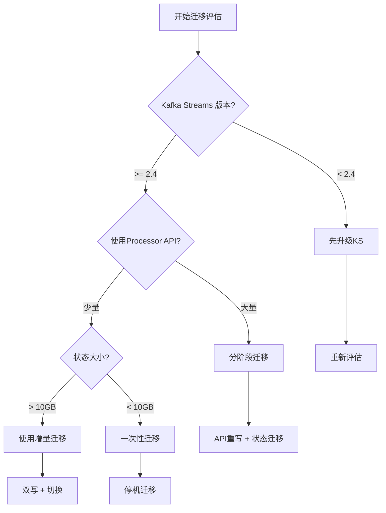

<!-- AI Translation Template - Replace <!-- TRANSLATE --> markers with actual translation -->

<!-- TRANSLATE: # Kafka Streams 迁移到 Flink 完整指南 -->

<!-- TRANSLATE: > **所属阶段**: Knowledge/ | **前置依赖**: [Flink vs Kafka Streams 对比](../Flink/09-practices/09.03-performance-tuning/05-vs-competitors/flink-vs-kafka-streams.md) | **形式化等级**: L4 -->


<!-- TRANSLATE: ## 2. 属性推导 (Properties) -->

<!-- TRANSLATE: ### 迁移复杂度分析 -->

<!-- TRANSLATE: **影响迁移复杂度的因素**: -->

```
复杂度 = f(自定义处理器数量, 状态存储复杂度, 窗口类型多样性, 外部集成数量)
```

<!-- TRANSLATE: | 因素 | 低复杂度 | 高复杂度 | -->
<!-- TRANSLATE: |------|----------|----------| -->
<!-- TRANSLATE: | 处理器类型 | 仅DSL | 大量自定义Processor | -->
<!-- TRANSLATE: | 状态存储 | 简单K/V | 复杂聚合状态 | -->
<!-- TRANSLATE: | 窗口 | 仅Tumbling | Session/Custom | -->
<!-- TRANSLATE: | 外部系统 | 仅Kafka | 多系统集成 | -->


<!-- TRANSLATE: ## 4. 论证过程 (Argumentation) -->

<!-- TRANSLATE: ### 迁移决策框架 -->




<!-- TRANSLATE: ## 6. 实例验证 (Examples) -->

<!-- TRANSLATE: ### 示例 1: 简单转换迁移 -->

<!-- TRANSLATE: **Kafka Streams 代码**: -->

```java
KStream<String, Order> orders = builder.stream("orders");

orders.filter((key, order) -> order.getAmount() > 100)
    .mapValues(order -> {
        order.setStatus("HIGH_VALUE");
        return order;
    })
    .to("high-value-orders");
```

<!-- TRANSLATE: **Flink 等效代码**: -->

```java

import org.apache.flink.streaming.api.datastream.DataStream;

// DataStream API
DataStream<Order> orders = env.fromKafka("orders", ...);

orders.filter(order -> order.getAmount() > 100)
    .map(order -> {
        order.setStatus("HIGH_VALUE");
        return order;
    })
    .toKafka("high-value-orders", ...);

// 或 Table API
Table orders = tableEnv.from("orders");

tableEnv.executeSql(
    "INSERT INTO high_value_orders " +
    "SELECT * FROM orders WHERE amount > 100"
);
```

<!-- TRANSLATE: ### 示例 2: 窗口聚合迁移 -->

<!-- TRANSLATE: **Kafka Streams 代码**: -->

```java
KTable<Windowed<String>, Long> counts = orders
    .groupByKey()
    .windowedBy(TimeWindows.of(Duration.ofMinutes(5)))
    .count(Materialized.as("order-counts"));
```

<!-- TRANSLATE: **Flink 等效代码**: -->

```sql
-- Flink SQL
CREATE TABLE order_counts (
    user_id STRING,
    window_start TIMESTAMP(3),
    window_end TIMESTAMP(3),
    order_count BIGINT,
    PRIMARY KEY (user_id, window_start) NOT ENFORCED
) WITH (...);

INSERT INTO order_counts
SELECT
    user_id,
    window_start,
    window_end,
    COUNT(*) as order_count
FROM TABLE(
    TUMBLE(TABLE orders, DESCRIPTOR(event_time), INTERVAL '5' MINUTES)
)
GROUP BY user_id, window_start, window_end;
```

<!-- TRANSLATE: ### 示例 3: 状态存储迁移 -->

<!-- TRANSLATE: **状态导出脚本**: -->

```python
# 导出 Kafka Streams 状态
# 使用 Kafka Streams 的 Interactive Queries

# 1. 读取 RocksDB 状态
# 2. 序列化为 Parquet/JSON
# 3. 写入 Flink 支持的格式

import rocksdb
import pyarrow.parquet as pq

def export_rocksdb_to_parquet(db_path: str, output_path: str):
    db = rocksdb.DB(db_path, rocksdb.Options())
    # 遍历并导出
    for key, value in db.iteritems():
        # 转换格式
        pass
```


<!-- TRANSLATE: ## 8. 引用参考 (References) -->
