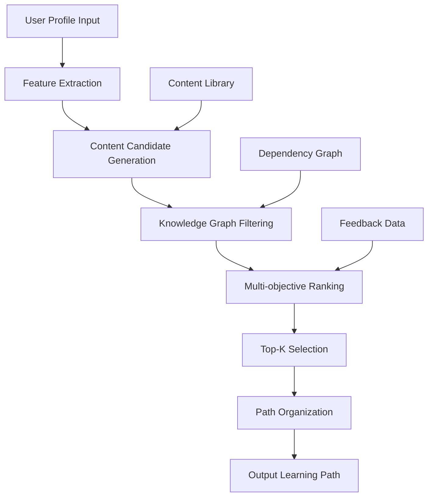
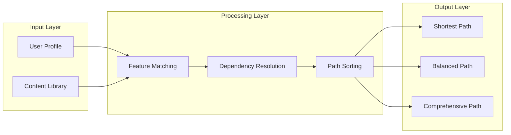
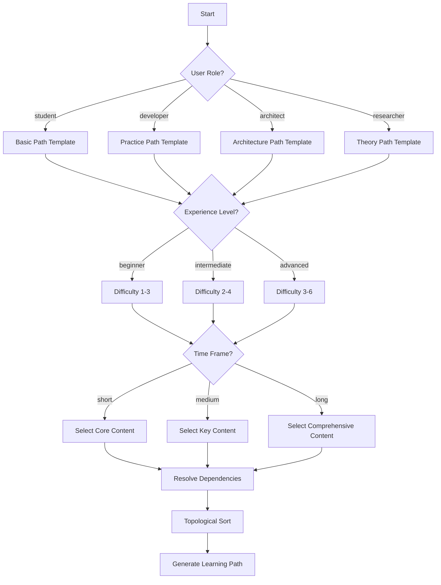

# Dynamic Learning Path Recommender System

> **Stage**: Knowledge | **Prerequisites**: [LEARNING-PATH-GUIDE.md](../../../LEARNING-PATH-GUIDE.md), [learning-path-recommender.py](../../../.scripts/learning-path-recommender.py) | **Formalization Level**: L3

## 1. Definitions

### Def-K-LPR-01: Learning Path Recommender System

A learning path recommender system is an intelligent system that automatically generates personalized learning sequences for learners based on user profiles, knowledge graphs, and content features.

**Formal Definition**:

- Let $\mathcal{U}$ be the user profile space, $\mathcal{C}$ the content space, and $\mathcal{P}$ the path space
- The recommendation function $f: \mathcal{U} \times \mathcal{C} \rightarrow \mathcal{P}$ maps user-content pairs to learning paths
- The optimization objective is to maximize the learning effectiveness function $E(p, u)$, where $p \in \mathcal{P}$, $u \in \mathcal{U}$

### Def-K-LPR-02: User Profile

A user profile is a multi-dimensional vector representation of a learner's characteristics:

$$
\vec{u} = (r, e, g, t, i, k, h)
$$

Where:

- $r \in \{\text{student}, \text{developer}, \text{architect}, \text{researcher}\}$: Role
- $e \in \{\text{beginner}, \text{intermediate}, \text{advanced}\}$: Experience level
- $g \in \{\text{theory}, \text{practice}, \text{interview}, \text{research}\}$: Learning goal
- $t \in \{\text{short}, \text{medium}, \text{long}\}$: Time frame
- $i \subseteq \mathcal{T}$: Interest tag set
- $k \subseteq \mathcal{C}$: Mastered content set
- $h \in \mathbb{N}^+$: Weekly available hours

### Def-K-LPR-03: Learning Path

A learning path is an ordered sequence of learning content satisfying dependency constraints:

$$
p = \langle c_1, c_2, \ldots, c_n \rangle
$$

Where $\forall i > 1, \text{deps}(c_i) \subseteq \{c_1, \ldots, c_{i-1}\}$

**Path Quality Metrics**:

- Completeness: $\text{Completeness}(p) = \frac{|\bigcup_{c \in p} \text{concepts}(c)|}{|\text{TargetConcepts}|}$
- Coherence: $\text{Coherence}(p) = \frac{1}{n-1}\sum_{i=1}^{n-1} \text{sim}(c_i, c_{i+1})$
- Difficulty Smoothness: $\text{Smoothness}(p) = \frac{1}{n-1}\sum_{i=1}^{n-1} |\text{level}(c_i) - \text{level}(c_{i+1})|$

## 2. Properties

### Lemma-K-LPR-01: Path Existence

**Lemma**: For any target content set $T \subseteq \mathcal{C}$, if the dependency graph $G_\text{deps}$ is acyclic, then there exists at least one valid learning path covering $T$.

**Proof Sketch**:

1. Construct dependency graph $G_\text{deps} = (V, E)$, where $V = \bigcup_{c \in T} \text{closure}(c)$
2. Topologically sort the acyclic directed graph to obtain sequence $p$
3. This sequence satisfies $\forall c_i \in p, \text{deps}(c_i) \subseteq \{c_j | j < i\}$
4. Therefore $p$ is a valid learning path ∎

### Lemma-K-LPR-02: Optimal Path Uniqueness

**Lemma**: Given an optimization objective function $E(p, u)$, the optimal learning path is not necessarily unique.

**Counterexample**: Let two paths $p_1, p_2$ cover the same concept set with complementary difficulty curves, and have the same utility value for a specific user. Then both are optimal.

### Prop-K-LPR-01: Recommendation Diversity Bound

For a recommendation list containing $n$ content items, the upper bound of Top-$k$ content coverage is:

$$
\text{Coverage}(k) \leq \min\left(k \cdot \frac{|\mathcal{T}|}{n}, |\mathcal{T}|\right)
$$

Where $\mathcal{T}$ is the set of all topic tags in the system.

## 3. Relations

### Relationship with Knowledge Graph

```
┌─────────────────────────────────────────────────────────┐
│                    Knowledge Graph                       │
│  ┌──────────┐      ┌──────────┐      ┌──────────┐      │
│  │ Concept A│──────│ Concept B│──────│ Concept C│      │
│  └──────────┘      └──────────┘      └──────────┘      │
│       │                 │                 │             │
│       └─────────────────┼─────────────────┘             │
│                         ▼                               │
│              ┌──────────────────┐                      │
│              │ Dependency Extraction                    │
│              └────────┬─────────┘                      │
└───────────────────────┼─────────────────────────────────┘
                        ▼
┌─────────────────────────────────────────────────────────┐
│              Learning Path Recommender                   │
│  ┌──────────┐      ┌──────────┐      ┌──────────┐      │
│  │ Stage 1  │  →   │ Stage 2  │  →   │ Stage 3  │      │
│  │ (Basic)  │      │(Advanced)│      │ (Expert) │      │
│  └──────────┘      └──────────┘      └──────────┘      │
└─────────────────────────────────────────────────────────┘
```

### Relationship with Learning Theory

| Learning Theory | Manifestation in This System |
|-----------------|------------------------------|
| **Constructivism** | Learning paths are built from concept dependencies; new knowledge is constructed on top of existing knowledge |
| **Spaced Repetition** | The system recommends reviewing learned content at appropriate intervals |
| **Mastery Learning** | Checkpoints are set at each stage to ensure mastery before advancing |
| **Personalized Learning** | Path difficulty and pace are adjusted based on user profiles |

## 4. Argumentation

### Recommendation Algorithm Selection

#### Candidate Algorithm Comparison

| Algorithm | Advantages | Disadvantages | Applicability |
|-----------|------------|---------------|---------------|
| **Collaborative Filtering** | Discovers hidden patterns | Cold start problem | Medium (requires large user data) |
| **Content-Based** | Strong interpretability | Over-specialization | High (rich content features) |
| **Knowledge Graph** | Considers concept dependencies | High construction cost | High (existing graph) |
| **Reinforcement Learning** | Dynamic optimization | Complex training | Medium (requires interaction data) |

**Decision**: Adopt a hybrid recommendation strategy

- Primary: Content-based recommendation (utilizing document metadata)
- Enhancement: Knowledge graph constraints (ensuring concept dependency completeness)
- Supplement: Collaborative filtering (when sufficient user data is available)

### Cold Start Handling

For new users, the system adopts the following strategies:

1. **Role-based default path**: Load preset path templates based on the user's selected role
2. **Popular content recommendation**: Recommend the most popular content in the system
3. **Exploratory questions**: Quickly build an initial profile through 3-5 questions

### Path Update Strategy

When a user completes learning content $c$, the system recalculates:

$$
\mathcal{P}' = \{p \setminus \{c\} | p \in \mathcal{P}, c \in p\}
$$

And updates the user profile:

$$
k' = k \cup \{c\}
$$

## 5. Proof / Engineering Argument

### Thm-K-LPR-01: Recommendation Convergence

**Theorem**: Under the conditions of a finite content space $\mathcal{C}$ and a monotonically increasing learned set $k$, the recommendation algorithm converges to an empty recommendation after at most $|\mathcal{C}|$ iterations.

**Proof**:

1. After each recommendation, the user learns at least one new content item: $|k_{t+1}| > |k_t|$
2. Since $|\mathcal{C}|$ is finite, after at most $|\mathcal{C}|$ iterations $k = \mathcal{C}$
3. When $k = \mathcal{C}$, the candidate set $\{c \in \mathcal{C} | c \notin k\} = \emptyset$
4. Therefore the algorithm converges ∎

### Engineering Implementation Argument

#### Recommendation Engine Architecture



#### Core Component Description

1. **ContentLibrary**: Manages all learning content, supporting retrieval by difficulty, topic, and type
2. **RecommendationEngine**: Implements recommendation algorithms to generate personalized paths
3. **DependencyResolver**: Resolves content dependency relationships to ensure path validity
4. **OutputGenerator**: Generates multiple output formats (Markdown/JSON/Checklist)

## 6. Examples

### Use Case 1: Developer Quick Start Path

**User Profile**:

- Role: developer
- Experience: intermediate
- Goal: practice
- Time: medium (1 month)

**Generated Path**:

| Stage | Content | Difficulty | Estimated Time |
|-------|---------|------------|----------------|
| Basic | Flink Architecture Overview | L2 | 2h |
| Basic | Concurrency Paradigm Comparison | L2 | 2h |
| Core | Checkpoint Mechanism | L3 | 4h |
| Core | State Backend Selection | L3 | 3h |
| Applied | Kafka Integration Patterns | L3 | 3h |
| Applied | Performance Tuning Guide | L4 | 5h |

**Expected Checkpoints**:

- [x] Able to independently develop Flink DataStream applications
- [x] Able to diagnose and resolve common runtime issues
- [ ] Master production deployment best practices

### Use Case 2: Researcher Theory Path

**User Profile**:

- Role: researcher
- Experience: advanced
- Goal: theory
- Time: long (3 months)

**Generated Path**:

| Stage | Content | Difficulty | Estimated Time |
|-------|---------|------------|----------------|
| Basic | Unified Streaming Theory | L6 | 8h |
| Basic | Process Calculus Fundamentals | L4 | 6h |
| Advanced | Consistency Hierarchy | L5 | 6h |
| Advanced | Watermark Monotonicity Theorem | L5 | 8h |
| Research | Checkpoint Correctness Proof | L6 | 12h |

## 7. Visualizations

### Recommender System Data Flow



### Path Generation Decision Tree



## 8. References

---

## Appendix A: User Guide

### Command Line Usage

```bash
# Interactive mode
python .scripts/learning-path-recommender.py

# Generate path from configuration file
python .scripts/learning-path-recommender.py --config profile.json --output my-path.md

# Generate popular recommendations
python .scripts/learning-path-recommender.py --recommend popular --output recommendations.md
```

### Configuration File Example

```json
{
  "role": "developer",
  "experience": "intermediate",
  "goal": "practice",
  "timeframe": "medium",
  "weekly_hours": 10,
  "interests": ["flink", "kafka", "performance"],
  "known_topics": ["streaming-basics"],
  "preferred_formats": ["markdown", "code"]
}
```

### Output Formats

The system supports three output formats:

- **Markdown**: Complete learning path document with stage divisions and checkpoints
- **JSON**: Structured data for programmatic processing
- **Checklist**: Concise checklist format

---

*This document was automatically generated by Task P2-12 | Version: v1.0 | Date: 2026-04-04*
