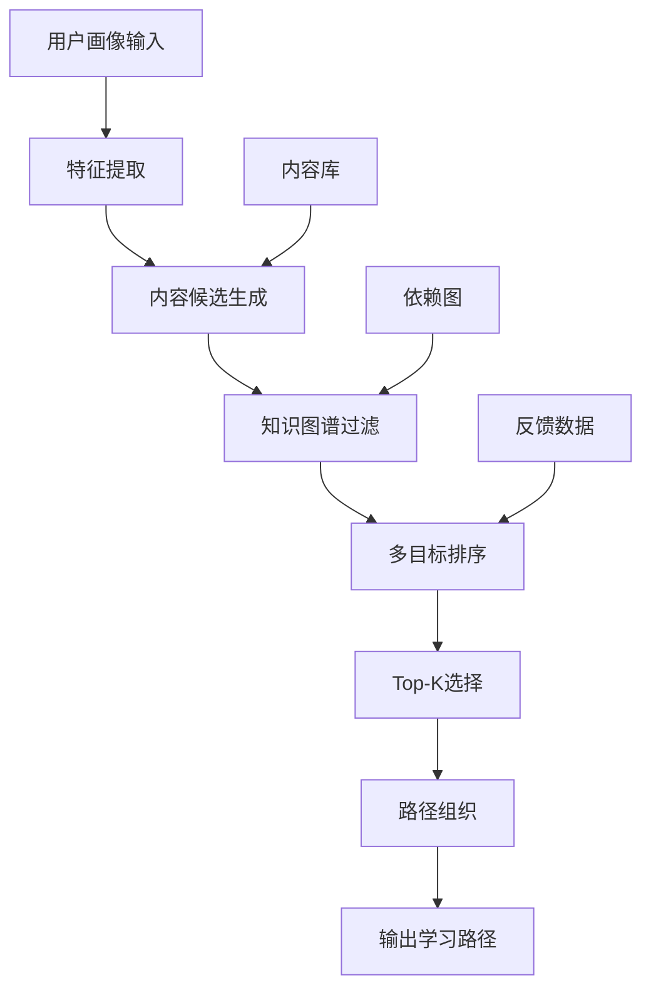
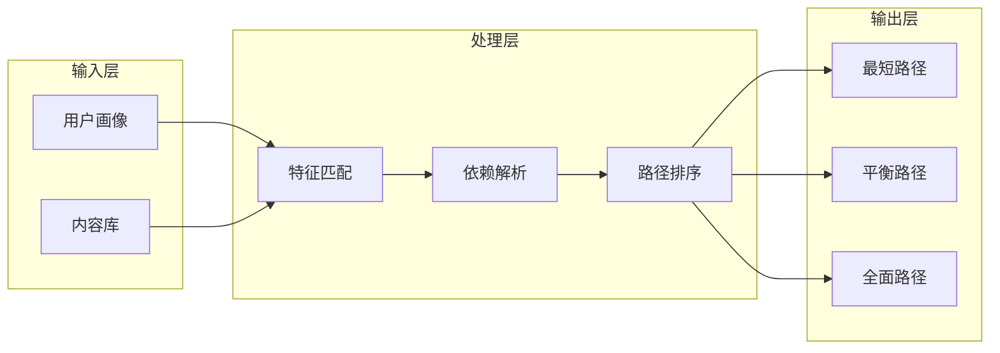
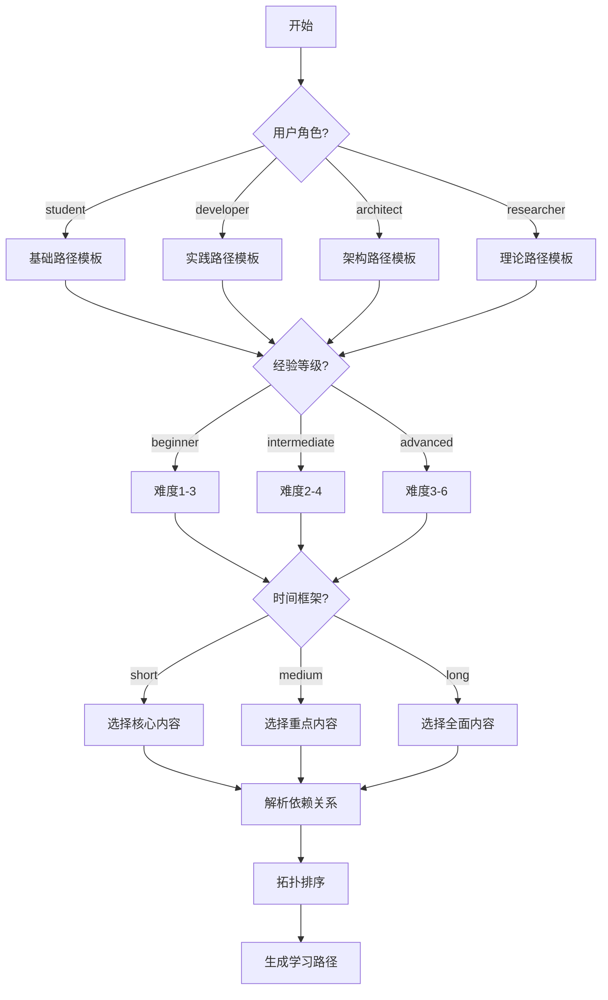

<!-- AI Translation Template - Replace <!-- TRANSLATE --> markers with actual translation -->

<!-- TRANSLATE: # 学习路径动态推荐系统 -->

<!-- TRANSLATE: > **所属阶段**: Knowledge | **前置依赖**: [LEARNING-PATH-GUIDE.md](../LEARNING-PATH-GUIDE.md), [learning-path-recommender.py](../learning-path-recommender.js) | **形式化等级**: L3 -->

<!-- TRANSLATE: ## 1. 概念定义 -->

<!-- TRANSLATE: ### Def-K-LPR-01: 学习路径推荐系统 (Learning Path Recommender System) -->

<!-- TRANSLATE: 学习路径推荐系统是一种基于用户画像、知识图谱和内容特征，自动为学习者生成个性化学习序列的智能系统。 -->

<!-- TRANSLATE: **形式化定义**: -->

- 设用户画像空间为 $\mathcal{U}$，内容空间为 $\mathcal{C}$，路径空间为 $\mathcal{P}$
- 推荐函数 $f: \mathcal{U} \times \mathcal{C} \rightarrow \mathcal{P}$ 将用户-内容映射为学习路径
- 优化目标为最大化学习效果函数 $E(p, u)$，其中 $p \in \mathcal{P}$, $u \in \mathcal{U}$

<!-- TRANSLATE: ### Def-K-LPR-02: 用户画像 (User Profile) -->

<!-- TRANSLATE: 用户画像是对学习者特征的多维向量表示： -->

$$
<!-- TRANSLATE: \vec{u} = (r, e, g, t, i, k, h) -->
$$

<!-- TRANSLATE: 其中： -->

- $r \in \{\text{student}, \text{developer}, \text{architect}, \text{researcher}\}$: 角色
- $e \in \{\text{beginner}, \text{intermediate}, \text{advanced}\}$: 经验等级
- $g \in \{\text{theory}, \text{practice}, \text{interview}, \text{research}\}$: 学习目标
- $t \in \{\text{short}, \text{medium}, \text{long}\}$: 时间框架
- $i \subseteq \mathcal{T}$: 兴趣标签集合
- $k \subseteq \mathcal{C}$: 已掌握内容集合
- $h \in \mathbb{N}^+$: 每周可用小时数

<!-- TRANSLATE: ### Def-K-LPR-03: 学习路径 (Learning Path) -->

<!-- TRANSLATE: 学习路径是有序的学习内容序列，满足依赖约束： -->

$$
<!-- TRANSLATE: p = \langle c_1, c_2, \ldots, c_n \rangle -->
$$

其中 $\forall i > 1, \text{deps}(c_i) \subseteq \{c_1, \ldots, c_{i-1}\}$

<!-- TRANSLATE: **路径质量度量**: -->

- 完整性: $\text{Completeness}(p) = \frac{|\bigcup_{c \in p} \text{concepts}(c)|}{|\text{TargetConcepts}|}$
- 连贯性: $\text{Coherence}(p) = \frac{1}{n-1}\sum_{i=1}^{n-1} \text{sim}(c_i, c_{i+1})$
- 难度平滑度: $\text{Smoothness}(p) = \frac{1}{n-1}\sum_{i=1}^{n-1} |\text{level}(c_i) - \text{level}(c_{i+1})|$

<!-- TRANSLATE: ## 2. 属性推导 -->

<!-- TRANSLATE: ### Lemma-K-LPR-01: 路径存在性 -->

**命题**: 对于任意目标内容集合 $T \subseteq \mathcal{C}$，若依赖图 $G_\text{deps}$ 无环，则存在至少一条有效学习路径覆盖 $T$。

<!-- TRANSLATE: **证明概要**: -->

1. 构建依赖图 $G_\text{deps} = (V, E)$，其中 $V = \bigcup_{c \in T} \text{closure}(c)$
2. 对无环有向图进行拓扑排序得到序列 $p$
3. 该序列满足 $\forall c_i \in p, \text{deps}(c_i) \subseteq \{c_j | j < i\}$
4. 故 $p$ 为有效学习路径 ∎

<!-- TRANSLATE: ### Lemma-K-LPR-02: 最优路径唯一性 -->

**命题**: 给定优化目标函数 $E(p, u)$，最优学习路径不一定唯一。

**反例**: 设两个路径 $p_1, p_2$ 覆盖相同概念集，难度曲线互补，对特定用户具有相同效用值，则两者均为最优。

<!-- TRANSLATE: ### Prop-K-LPR-01: 推荐多样性边界 -->

对于包含 $n$ 个内容项的推荐列表，Top-$k$ 推荐的内容覆盖率上限为：

$$
<!-- TRANSLATE: \text{Coverage}(k) \leq \min\left(k \cdot \frac{|\mathcal{T}|}{n}, |\mathcal{T}|\right) -->
$$

其中 $\mathcal{T}$ 为系统中所有主题标签集合。

<!-- TRANSLATE: ## 3. 关系建立 -->

<!-- TRANSLATE: ### 与知识图谱的关系 -->

```
┌─────────────────────────────────────────────────────────┐
│                    知识图谱 (Knowledge Graph)            │
│  ┌──────────┐      ┌──────────┐      ┌──────────┐      │
│  │  概念A   │──────│  概念B   │──────│  概念C   │      │
│  └──────────┘      └──────────┘      └──────────┘      │
│       │                 │                 │             │
│       └─────────────────┼─────────────────┘             │
│                         ▼                               │
│              ┌──────────────────┐                      │
│              │  依赖关系提取     │                      │
│              └────────┬─────────┘                      │
└───────────────────────┼─────────────────────────────────┘
                        ▼
┌─────────────────────────────────────────────────────────┐
│                 学习路径推荐系统                          │
│  ┌──────────┐      ┌──────────┐      ┌──────────┐      │
│  │ 阶段1    │  →   │  阶段2   │  →   │  阶段3   │      │
│  │ (基础)   │      │ (进阶)   │      │ (高级)   │      │
│  └──────────┘      └──────────┘      └──────────┘      │
└─────────────────────────────────────────────────────────┘
```

<!-- TRANSLATE: ### 与学习理论的关系 -->

<!-- TRANSLATE: | 学习理论 | 在本系统中的体现 | -->
<!-- TRANSLATE: |---------|----------------| -->
<!-- TRANSLATE: | **建构主义** | 学习路径按概念依赖构建，新知识建立在旧知识基础上 | -->
<!-- TRANSLATE: | **间隔重复** | 系统推荐在适当时间回顾已学内容 | -->
<!-- TRANSLATE: | **掌握学习** | 每个阶段设置检查点，确保掌握后再进阶 | -->
<!-- TRANSLATE: | **个性化学习** | 根据用户画像调整路径难度和节奏 | -->

<!-- TRANSLATE: ## 4. 论证过程 -->

<!-- TRANSLATE: ### 推荐算法选择论证 -->

<!-- TRANSLATE: #### 候选算法对比 -->

<!-- TRANSLATE: | 算法 | 优势 | 劣势 | 适用性 | -->
<!-- TRANSLATE: |------|------|------|--------| -->
<!-- TRANSLATE: | **协同过滤** | 发现隐藏模式 | 冷启动问题 | 中（需大量用户数据） | -->
<!-- TRANSLATE: | **基于内容** | 可解释性强 | 过度特化 | 高（内容特征丰富） | -->
<!-- TRANSLATE: | **知识图谱** | 考虑概念依赖 | 构建成本高 | 高（已有图谱） | -->
<!-- TRANSLATE: | **强化学习** | 动态优化 | 训练复杂 | 中（需交互数据） | -->

<!-- TRANSLATE: **决策**: 采用混合推荐策略 -->

<!-- TRANSLATE: - 主体: 基于内容的推荐（利用文档元数据） -->
<!-- TRANSLATE: - 增强: 知识图谱约束（确保概念依赖完整） -->
<!-- TRANSLATE: - 补充: 协同过滤（当有足够用户数据时） -->

<!-- TRANSLATE: ### 冷启动问题处理 -->

<!-- TRANSLATE: 对于新用户，系统采用以下策略： -->

<!-- TRANSLATE: 1. **基于角色的默认路径**: 根据用户选择的角色加载预设路径模板 -->
<!-- TRANSLATE: 2. **热门内容推荐**: 推荐系统中 popularity 最高的内容 -->
<!-- TRANSLATE: 3. **探索性问题**: 通过3-5个问题快速构建初步画像 -->

<!-- TRANSLATE: ### 路径更新策略 -->

当用户完成学习内容 $c$ 后，系统重新计算：

$$
<!-- TRANSLATE: \mathcal{P}' = \{p \setminus \{c\} | p \in \mathcal{P}, c \in p\} -->
$$

<!-- TRANSLATE: 并更新用户画像： -->

$$
<!-- TRANSLATE: k' = k \cup \{c\} -->
$$

<!-- TRANSLATE: ## 5. 形式证明 / 工程论证 -->

<!-- TRANSLATE: ### Thm-K-LPR-01: 推荐收敛性 -->

**定理**: 在有限内容空间 $\mathcal{C}$ 和单调递增的已学集合 $k$ 条件下，推荐算法最多在 $|\mathcal{C}|$ 次迭代后收敛到空推荐。

<!-- TRANSLATE: **证明**: -->

1. 每次推荐后，用户至少学习一个新内容：$|k_{t+1}| > |k_t|$
2. 由于 $|\mathcal{C}|$ 有限，最多 $|\mathcal{C}|$ 次后 $k = \mathcal{C}$
3. 当 $k = \mathcal{C}$ 时，候选集 $\{c \in \mathcal{C} | c \notin k\} = \emptyset$
<!-- TRANSLATE: 4. 故算法收敛 ∎ -->

<!-- TRANSLATE: ### 工程实现论证 -->

<!-- TRANSLATE: #### 推荐引擎架构 -->



<!-- TRANSLATE: #### 核心组件说明 -->

<!-- TRANSLATE: 1. **ContentLibrary**: 管理所有学习内容，支持按难度、主题、类型检索 -->
<!-- TRANSLATE: 2. **RecommendationEngine**: 实现推荐算法，生成个性化路径 -->
<!-- TRANSLATE: 3. **DependencyResolver**: 解析内容依赖关系，确保路径有效性 -->
<!-- TRANSLATE: 4. **OutputGenerator**: 生成多种格式输出（Markdown/JSON/检查清单） -->

<!-- TRANSLATE: ## 6. 实例验证 -->

<!-- TRANSLATE: ### 用例1: 开发者快速入门路径 -->

<!-- TRANSLATE: **用户画像**: -->

<!-- TRANSLATE: - 角色: developer -->
<!-- TRANSLATE: - 经验: intermediate -->
<!-- TRANSLATE: - 目标: practice -->
<!-- TRANSLATE: - 时间: medium (1月) -->

<!-- TRANSLATE: **生成的路径**: -->

<!-- TRANSLATE: | 阶段 | 内容 | 难度 | 预计时间 | -->
<!-- TRANSLATE: |------|------|------|----------| -->
<!-- TRANSLATE: | 基础 | Flink架构概览 | L2 | 2h | -->
<!-- TRANSLATE: | 基础 | 并发范式对比 | L2 | 2h | -->
<!-- TRANSLATE: | 核心 | Checkpoint机制 | L3 | 4h | -->
<!-- TRANSLATE: | 核心 | 状态后端选择 | L3 | 3h | -->
<!-- TRANSLATE: | 应用 | Kafka集成模式 | L3 | 3h | -->
<!-- TRANSLATE: | 应用 | 性能调优指南 | L4 | 5h | -->

<!-- TRANSLATE: **预期检查点**: -->

<!-- TRANSLATE: - [x] 能够独立开发Flink DataStream应用 -->
<!-- TRANSLATE: - [x] 能够诊断和解决常见运行问题 -->
<!-- TRANSLATE: - [ ] 掌握生产环境部署最佳实践 -->

<!-- TRANSLATE: ### 用例2: 研究者理论路径 -->

<!-- TRANSLATE: **用户画像**: -->

<!-- TRANSLATE: - 角色: researcher -->
<!-- TRANSLATE: - 经验: advanced -->
<!-- TRANSLATE: - 目标: theory -->
<!-- TRANSLATE: - 时间: long (3月) -->

<!-- TRANSLATE: **生成的路径**: -->

<!-- TRANSLATE: | 阶段 | 内容 | 难度 | 预计时间 | -->
<!-- TRANSLATE: |------|------|------|----------| -->
<!-- TRANSLATE: | 基础 | 统一流计算理论 | L6 | 8h | -->
<!-- TRANSLATE: | 基础 | 进程演算基础 | L4 | 6h | -->
<!-- TRANSLATE: | 进阶 | 一致性层次结构 | L5 | 6h | -->
<!-- TRANSLATE: | 进阶 | Watermark单调性定理 | L5 | 8h | -->
<!-- TRANSLATE: | 研究 | Checkpoint正确性证明 | L6 | 12h | -->

<!-- TRANSLATE: ## 7. 可视化 -->

<!-- TRANSLATE: ### 推荐系统数据流 -->



<!-- TRANSLATE: ### 路径生成决策树 -->



<!-- TRANSLATE: ## 8. 引用参考 -->


<!-- TRANSLATE: *本文档由 P2-12 任务自动生成 | 版本: v1.0 | 日期: 2026-04-04* -->
