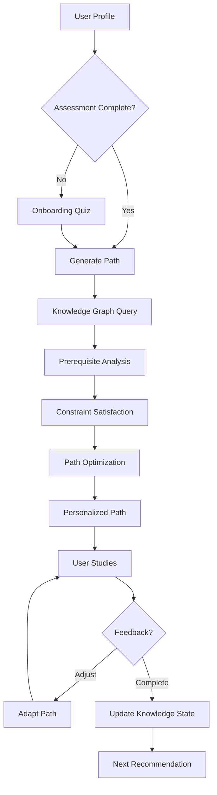

<!-- AI Translation Template - Replace <!-- TRANSLATE --> markers with actual translation -->

<!-- TRANSLATE: # Personalized Learning Path Recommendation Engine -->

<!-- TRANSLATE: > **Project**: P3-8 | **Type**: Technical Design | **Version**: v1.0 | **Date**: 2026-04-04 -->
<!-- TRANSLATE: > -->
<!-- TRANSLATE: > **Formalization Level**: L4 (Engineering Design) | **Dependencies**: [LEARNING-PATHS-DYNAMIC.md](../../../en/00-INDEX.md) -->

<!-- TRANSLATE: This document describes the design and implementation of a personalized learning path recommendation engine for the AnalysisDataFlow knowledge base. -->


<!-- TRANSLATE: ## 2. Property Derivation -->

<!-- TRANSLATE: ### Prop-K-PLE-01: Path Completeness -->

<!-- TRANSLATE: For any valid learning objective o ∈ 𝒪, there exists at least one learning path LP that achieves o. -->

<!-- TRANSLATE: **Proof Sketch**: -->

<!-- TRANSLATE: - The knowledge graph is connected (by construction) -->
<!-- TRANSLATE: - Each document covers specific concepts -->
<!-- TRANSLATE: - Breadth-first search from prerequisites to objective yields a valid path ∎ -->

<!-- TRANSLATE: ### Prop-K-PLE-02: Personalization Monotonicity -->

<!-- TRANSLATE: Given two learners u₁, u₂ with KS(u₁) ≥ KS(u₂) (component-wise), the recommended path for u₁ is no longer than for u₂. -->

```
∀u₁, u₂ ∈ 𝒰. KS(u₁) ≥ KS(u₂) ⇒ |LP(u₁, o)| ≤ |LP(u₂, o)|
```

<!-- TRANSLATE: ### Prop-K-PLE-03: Progress Convergence -->

<!-- TRANSLATE: With consistent engagement, the learning path converges to the objective. -->

```
lim_{t→∞} distance(KS_t, KS_target) = 0
```


<!-- TRANSLATE: ## 4. Argumentation Process -->

<!-- TRANSLATE: ### 4.1 Recommendation Algorithm Selection -->

<!-- TRANSLATE: **Candidate Approaches**: -->

<!-- TRANSLATE: | Approach | Pros | Cons | Use Case | -->
<!-- TRANSLATE: |----------|------|------|----------| -->
<!-- TRANSLATE: | Content-Based | Interpretable, no cold start | Limited diversity | Domain-specific paths | -->
<!-- TRANSLATE: | Collaborative Filtering | Discovers patterns | Cold start, sparsity | Popular paths | -->
<!-- TRANSLATE: | Knowledge Graph | Structured, explainable | Complex construction | Prerequisite chains | -->
<!-- TRANSLATE: | Reinforcement Learning | Adaptive, optimizes long-term | Training complexity | Dynamic adaptation | -->

<!-- TRANSLATE: **Selected Hybrid Approach**: -->

```
Recommendation = α·ContentScore + β·GraphDistance + γ·CollaborativeScore + δ·RLValue
```

<!-- TRANSLATE: ### 4.2 Constraint Satisfaction -->

<!-- TRANSLATE: Learning paths must satisfy: -->

<!-- TRANSLATE: 1. **Prerequisite Constraints**: All prerequisites must be completed before dependent content -->
<!-- TRANSLATE: 2. **Time Constraints**: Total estimated time ≤ available time budget -->
<!-- TRANSLATE: 3. **Difficulty Constraints**: Difficulty progression should be smooth (no jumps > 0.3) -->
<!-- TRANSLATE: 4. **Diversity Constraints**: Include multiple content types (theory, practice, case studies) -->


<!-- TRANSLATE: ## 6. Implementation Details -->

<!-- TRANSLATE: ### 6.1 Database Schema -->

```sql
-- User profiles
CREATE TABLE user_profiles (
    id UUID PRIMARY KEY,
    created_at TIMESTAMP DEFAULT NOW(),
    role VARCHAR(50),
    experience_level VARCHAR(50),
    preferences JSONB
);

-- Knowledge states
CREATE TABLE knowledge_states (
    user_id UUID REFERENCES user_profiles(id),
    concept_id VARCHAR(100),
    mastery_level FLOAT CHECK (mastery_level BETWEEN 0 AND 1),
    updated_at TIMESTAMP DEFAULT NOW(),
    PRIMARY KEY (user_id, concept_id)
);

-- Learning progress
CREATE TABLE learning_progress (
    id UUID PRIMARY KEY,
    user_id UUID REFERENCES user_profiles(id),
    document_path VARCHAR(500),
    status VARCHAR(50),  -- not_started, in_progress, completed
    completion_percentage INTEGER,
    quiz_score FLOAT,
    time_spent INTEGER,  -- minutes
    completed_at TIMESTAMP
);

-- Knowledge graph edges
CREATE TABLE concept_edges (
    from_concept VARCHAR(100),
    to_concept VARCHAR(100),
    relationship_type VARCHAR(50),  -- prerequisite, related, builds_upon
    strength FLOAT,
    PRIMARY KEY (from_concept, to_concept)
);

-- Document-concept mapping
CREATE TABLE document_concepts (
    document_path VARCHAR(500),
    concept_id VARCHAR(100),
    coverage_weight FLOAT,  -- How central is this concept to the document
    PRIMARY KEY (document_path, concept_id)
);
```

<!-- TRANSLATE: ### 6.2 API Endpoints -->

```yaml
openapi: 3.0.0
info:
  title: Personalized Learning API
  version: 1.0.0

paths:
  /api/profile:
    get:
      summary: Get user profile
      responses:
        200:
          description: User profile and knowledge state

    post:
      summary: Create or update profile
      requestBody:
        content:
          application/json:
            schema:
              $ref: '#/components/schemas/UserProfile'

  /api/recommend:
    post:
      summary: Get personalized learning path
      requestBody:
        content:
          application/json:
            schema:
              type: object
              properties:
                objective:
                  type: string
                time_budget:
                  type: integer
                  description: Available time in minutes
                preferences:
                  type: object
      responses:
        200:
          description: Recommended learning path
          content:
            application/json:
              schema:
                $ref: '#/components/schemas/LearningPath'

  /api/progress:
    post:
      summary: Update learning progress
      requestBody:
        content:
          application/json:
            schema:
              type: object
              properties:
                document_path:
                  type: string
                status:
                  type: string
                quiz_score:
                  type: number
      responses:
        200:
          description: Progress updated

  /api/adapt:
    post:
      summary: Adapt current path based on feedback
      requestBody:
        content:
          application/json:
            schema:
              type: object
              properties:
                feedback:
                  type: string
                  enum: [too_easy, just_right, too_hard]
                current_document:
                  type: string
      responses:
        200:
          description: Path adaptation suggestions
```

<!-- TRANSLATE: ### 6.3 Configuration -->

```yaml
# personalized-learning-config.yaml
learning_engine:
  # Scoring weights
  weights:
    concept_coverage: 0.40
    difficulty_match: 0.20
    content_preference: 0.15
    collaborative: 0.15
    diversity: 0.10

  # Difficulty progression
  difficulty:
    max_jump: 0.3  # Maximum difficulty increase between consecutive items
    min_mastery: 0.7  # Consider concept mastered above this threshold

  # Time estimation
  time_estimation:
    reading_speed_wpm: 200
    code_review_multiplier: 2.0
    exercise_time_minutes: 30

  # Adaptation triggers
  adaptation:
    quiz_threshold_low: 0.5
    quiz_threshold_high: 0.9
    time_variance_threshold: 0.3

  # Cache settings
  cache:
    path_ttl: 3600  # 1 hour
    user_state_ttl: 300  # 5 minutes
```


<!-- TRANSLATE: ## 8. Evaluation -->

<!-- TRANSLATE: ### 8.1 Success Metrics -->

<!-- TRANSLATE: | Metric | Description | Target | -->
<!-- TRANSLATE: |--------|-------------|--------| -->
<!-- TRANSLATE: | **Path Completion Rate** | % of users completing recommended paths | > 70% | -->
<!-- TRANSLATE: | **Knowledge Gain** | Pre/post assessment score improvement | > 30% | -->
<!-- TRANSLATE: | **Time Efficiency** | Actual vs. estimated time ratio | 0.8 - 1.2 | -->
<!-- TRANSLATE: | **User Satisfaction** | Post-path rating | > 4.2/5 | -->
<!-- TRANSLATE: | **Path Diversity** | Unique paths generated per objective | > 5 | -->

<!-- TRANSLATE: ### 8.2 A/B Testing Framework -->

```python
class ABTestFramework:
    """A/B testing for recommendation algorithms."""

    def __init__(self):
        self.variants = {
            'control': BaselineRecommender(),
            'treatment': NewRecommender(),
        }

    def assign_variant(self, user_id: str) -> str:
        """Assign user to test variant."""
        hash_val = hash(user_id) % 100
        return 'treatment' if hash_val < 50 else 'control'

    def track_metrics(self, user_id: str, variant: str, outcome: dict):
        """Track experiment metrics."""
        # Log to analytics
        analytics.log({
            'user_id': user_id,
            'variant': variant,
            'completion_rate': outcome['completed'],
            'time_spent': outcome['time'],
            'satisfaction': outcome['rating'],
        })
```


<!-- TRANSLATE: ## 10. Visualization -->

<!-- TRANSLATE: ### 10.1 System Flow -->



<!-- TRANSLATE: ### 10.2 Knowledge State Visualization -->

```mermaid
radarChart
    title Knowledge State Profile

    area Formal_Theory
    area Flink_Core
    area Design_Patterns
    area Production_Ops
    area AI_ML

    axis "Formal Theory"
    axis "Flink Core"
    axis "Design Patterns"
    axis "Production Ops"
    axis "AI/ML"

    point User_A, 0.3, 0.5, 0.7, 0.4, 0.2
    point Target, 0.8, 0.9, 0.8, 0.7, 0.6
```
