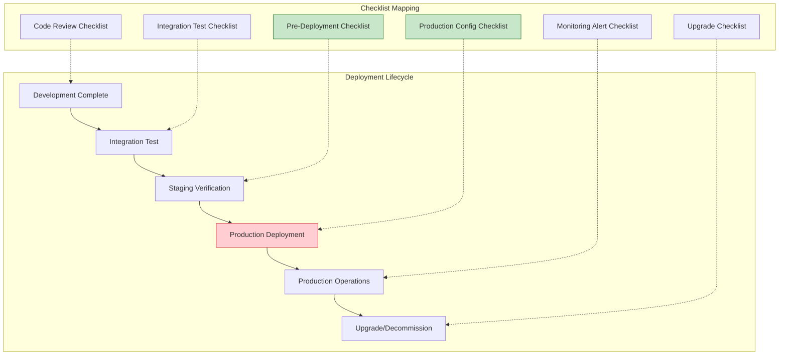
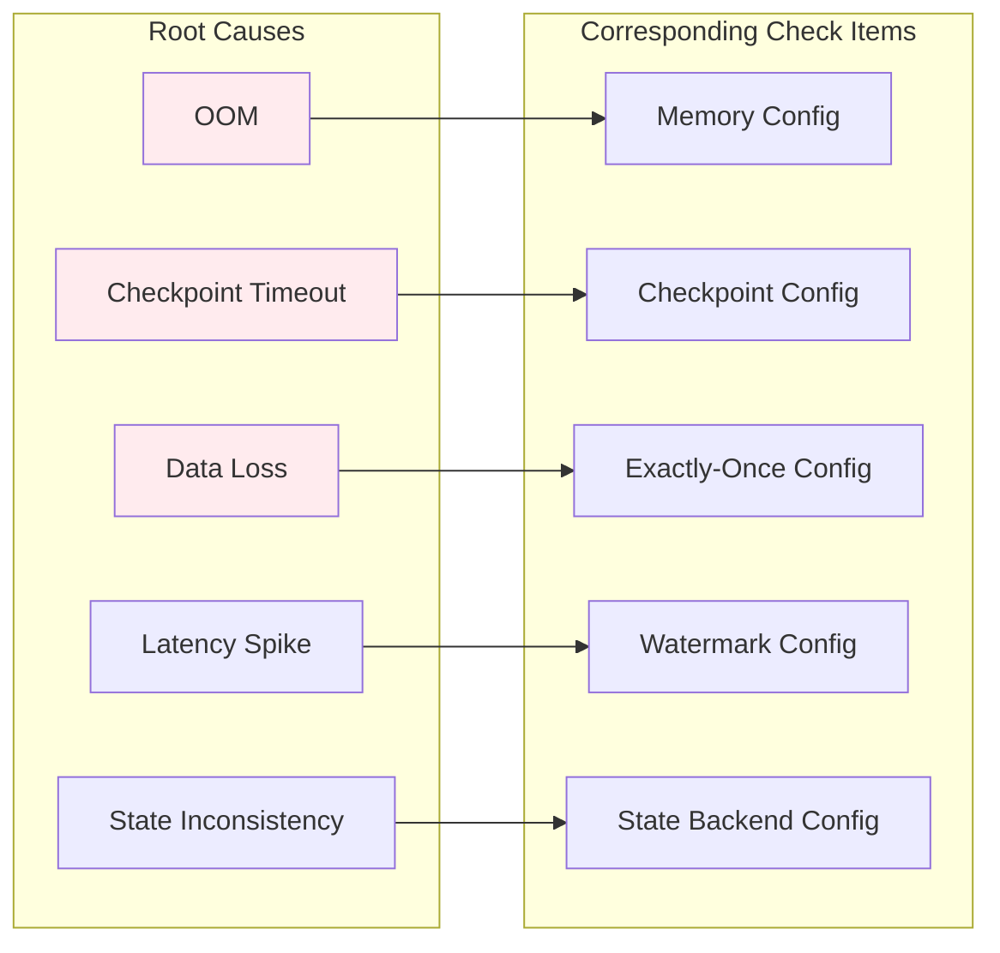
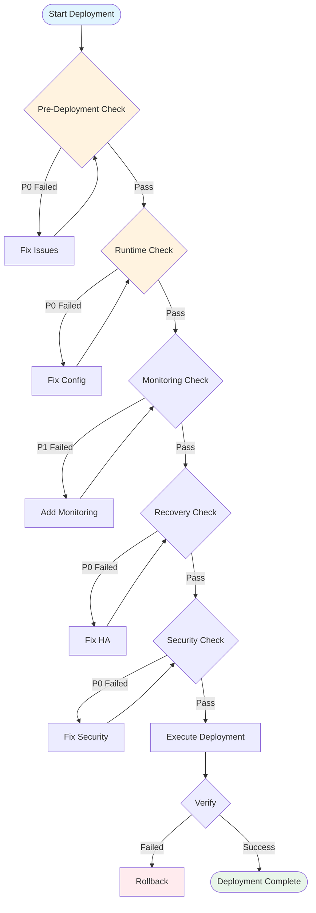
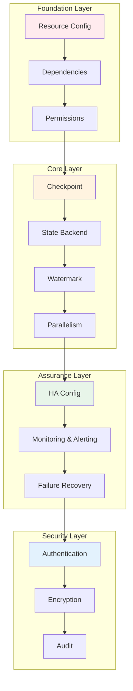

> **Status**: 🔮 Prospective Content | **Risk Level**: High | **Last Updated**: 2026-04
>
> The content described in this document is in the early planning stage and may differ from the final release. Please refer to the official Apache Flink release.
>
# Flink Production Deployment Checklist

> **Stage**: Knowledge/09-engineering | **Prerequisites**: [3.10-flink-production-checklist.md](./3.10-flink-production-checklist.md), [Flink/3.9-state-backends-deep-comparison.md](../Flink/3.9-state-backends-deep-comparison.md) | **Formalization Level**: L3-L4
> **Version**: 2026.04 | **Applicable Versions**: Flink 1.16+ - 2.5+ | **Document Type**: Printable Checklist

---

## 1. Concept Definitions (Definitions)

### Def-K-Prod-Check-01: Production Readiness

**Production Readiness** is defined as the comprehensive readiness state of a system satisfying the following four dimensions:

$$
\text{ProductionReady} = (D_{pre} \land D_{runtime} \land D_{monitor} \land D_{recovery} \land D_{security})
$$

| Dimension | Symbol | Core Requirement |
|------|------|----------|
| **Pre-Deployment Check** | $D_{pre}$ | Resource configuration, dependencies, permission verification |
| **Runtime Check** | $D_{runtime}$ | Checkpoint, Watermark, Parallelism configuration |
| **Monitoring & Alerting** | $D_{monitor}$ | Metrics coverage, logs, tracing |
| **Failure Recovery** | $D_{recovery}$ | HA configuration, state recovery, upgrade strategy |
| **Security & Compliance** | $D_{security}$ | Authentication/authorization, encryption, audit |

### Def-K-Prod-Check-02: Check Item Priority Classification

**Priority Classification System**:

```
Critical (P0) → High (P1) → Medium (P2) → Low (P3)
     ↓              ↓             ↓            ↓
  Blocks Deployment  Severe Impact   Minor Impact   Optimization
  Must Fix           Plan to Fix     Recommended    Optional
```

| Level | Description | Strategy | Example |
|------|------|----------|------|
| **P0 - Critical** | Blocks deployment | Must fix | Checkpoint not enabled, insufficient memory |
| **P1 - High** | Severe impact | Fix within 24h | Missing monitoring, incomplete security config |
| **P2 - Medium** | Minor impact | Plan to fix | Improper log level, coarse metric granularity |
| **P3 - Low** | Optimization | Optional | Config tuning, performance optimization |

### Def-K-Prod-Check-03: Checklist Classification

**Checklist Classification System**:

```
DeploymentChecklist
├── Pre-Deployment
│   ├── Resources
│   ├── Dependencies
│   └── Permissions
├── Runtime
│   ├── Checkpoint
│   ├── Watermark
│   └── Parallelism
├── Monitoring
│   ├── Metrics
│   ├── Logging
│   └── Tracing
├── Recovery
│   ├── HA
│   ├── StateRecovery
│   └── Upgrade
└── Security
    ├── Authentication
    ├── Encryption
    └── Audit
```

---

## 2. Property Derivation (Properties)

### Lemma-K-Prod-Check-01: Relationship Between Check Completeness and Failure Rate

**Lemma**: The completeness of the checklist is negatively correlated with the production failure rate:

$$
P(\text{Failure}) \propto \frac{1}{\text{ChecklistCoverage}}
$$

**Empirical Data**:

| Check Coverage | First Deployment Success Rate | Production Incident Rate | MTTR |
|-----------|---------------|-----------|------|
| 100% (Complete) | > 95% | < 2% | < 15 min |
| 80% (Partial) | 80-90% | 5-10% | 30-60 min |
| < 50% (Missing) | < 70% | > 20% | > 2 hours |

### Lemma-K-Prod-Check-02: Critical Path Dependencies

**Lemma**: Dependencies exist between check items and must be executed in order:

```
Resource Config Check → State Backend Config → Checkpoint Config → Restart Strategy Config
     ↓                                                                       ↓
Dependency Check ───────────────────────────────────────────────────────→ Deployment Execution
     ↓                                                                       ↓
Permission Check ───────────────────────────────────────────────────────→ Monitoring Config
```

### Prop-K-Prod-Check-01: Relationship Between Monitoring Coverage and MTTR

**Proposition**: Monitoring coverage and Mean Time To Recovery (MTTR) satisfy:

$$
\text{MTTR} = \frac{k}{\text{Coverage}(\text{Metrics})} + \text{BaseTime}
$$

**Monitoring Coverage Score**:

| Coverage | Monitoring Scope | MTTR |
|--------|----------|------|
| Basic (30%) | CPU/Memory/Network | 30-60 min |
| Standard (60%) | +Checkpoint/Latency | 10-20 min |
| Complete (90%+) | +JVM/RocksDB/Business | 5-10 min |

---

## 3. Relation Establishment (Relations)

### 3.1 Relationship Between Checklist and Deployment Phase



### 3.2 Mapping Check Items to Root Causes of Failures



### 3.3 Checklist and Role Mapping

| Role | Responsible Check Items | Key Deliverable |
|------|-----------|----------|
| **Platform Engineer** | Resource config, HA config, security config | Infrastructure ready |
| **Development Engineer** | Checkpoint config, business logic, unit tests | Code quality |
| **SRE** | Monitoring config, alerting rules, Runbook | Observability |
| **Security Engineer** | AuthN/AuthZ, encryption, audit | Compliance |

---

## 4. Argumentation (Argumentation)

### 4.1 Production Failure Root Cause Analysis

Based on industry Flink production failure statistics, the main root cause distribution:

```
┌─────────────────────────────────────────────────────────────┐
│              Flink Production Failure Root Cause Distribution │
├─────────────────────────────────────────────────────────────┤
│  Improper Resource Config  ████████████████████  28%  → Pre-Deployment │
│  Checkpoint Issues         ██████████████████  24%  → Runtime        │
│  State Backend Config      ████████████████    20%  → Runtime        │
│  Network/Connection Issues ██████████          14%  → Pre-Deployment │
│  Dependency Version Conflict██████              8%  → Pre-Deployment │
│  Missing Security Config   ████                 6%  → Security       │
└─────────────────────────────────────────────────────────────┘
```

### 4.2 Checklist ROI Analysis

| Check Phase | Time Investment | Typical Failures Avoided | ROI |
|---------|---------|---------------|-----|
| Pre-Deployment Check | 30 min | OOM, insufficient resources | 10-50x |
| Runtime Check | 45 min | Checkpoint failure, state inconsistency | 20-100x |
| Monitoring Check | 30 min | Delayed failure detection | 5-20x |
| Security Check | 30 min | Data leakage, unauthorized access | Extremely high |

---

## 5. Formal Proof / Engineering Argument (Proof / Engineering Argument)

### Thm-K-Prod-Check-01: Sufficient Condition for Production Readiness

**Theorem**: The sufficient condition for a Flink job to reach production readiness:

$$
\text{ProductionReady}(J) \leftrightarrow
    \bigwedge_{i=1}^{n} \text{Check}_i(J) = \text{PASS}
$$

Where the check functions are defined as:

| Check Function | Key Items | Pass Criteria |
|---------|--------|----------|
| $PreDeployCheck$ | Resources/Dependencies/Permissions | 100% of P0 items passed |
| $RuntimeCheck$ | Checkpoint/Watermark | 100% of P0 items passed |
| $MonitorCheck$ | Metrics/Logs/Tracing | 100% of P1 items passed |
| $RecoveryCheck$ | HA/State Recovery | 100% of P0 items passed |
| $SecurityCheck$ | Authentication/Encryption/Audit | 100% of P0 items passed |

---

## 6. Instance Verification (Examples)

### 6.1 Printable Checklist Tables

#### 6.1.1 Pre-Deployment Checklist

| No. | Check Item | Priority | Check Method | Expected Result | Actual Result | Pass | Owner |
|------|--------|--------|----------|----------|----------|------|--------|
| 1 | TaskManager memory ≥ 4GB | P0 | Check flink-conf.yaml | `taskmanager.memory.process.size: 4gb` | | □ | |
| 2 | JobManager memory ≥ 2GB | P0 | Check flink-conf.yaml | `jobmanager.memory.process.size: 2gb` | | □ | |
| 3 | Task Slot count reasonable | P1 | Check flink-conf.yaml | `taskmanager.numberOfTaskSlots: 2-4` | | □ | |
| 4 | Network buffers sufficient | P1 | Check config | `taskmanager.memory.network.max: 256mb` | | □ | |
| 5 | Parallelism is set | P0 | Check code/config | `parallelism.default >= 1` | | □ | |
| 6 | JVM parameter configuration | P1 | Check env.java.opts | Contains GC parameters | | □ | |
| 7 | Dependency versions compatible | P0 | Check pom.xml | No version conflicts | | □ | |
| 8 | Connector version matches | P0 | Check dependencies | Matches Flink version | | □ | |
| 9 | Third-party library license check | P1 | Scan dependencies | No compliance risks | | □ | |
| 10 | Kerberos authentication config | P0 | Check security config | Authentication enabled | | □ | |
| 11 | File system permissions | P0 | Test write access | Checkpoint directory writable | | □ | |
| 12 | Network ports open | P0 | telnet test | Required ports open | | □ | |
| 13 | Resource queue permissions | P0 | YARN/K8s test | Can submit jobs | | □ | |

#### 6.1.2 Runtime Checklist

| No. | Check Item | Priority | Check Method | Expected Result | Actual Result | Pass | Owner |
|------|--------|--------|----------|----------|----------|------|--------|
| 1 | Checkpoint enabled | P0 | Check config | `execution.checkpointing.enabled: true` | | □ | |
| 2 | Checkpoint interval reasonable | P0 | Check config | 30s-10min | | □ | |
| 3 | Checkpoint timeout setting | P1 | Check config | > Typical duration × 2 | | □ | |
| 4 | Max concurrent Checkpoints | P1 | Check config | `max-concurrent-checkpoints: 1` | | □ | |
| 5 | Externalized Checkpoint | P1 | Check config | `RETAIN_ON_CANCELLATION` | | □ | |
| 6 | State backend configuration | P0 | Check config | RocksDB/Hashmap | | □ | |
| 7 | RocksDB Incremental Checkpoint | P1 | Check config | `incremental: true` | | □ | |
| 8 | Watermark strategy configuration | P0 | Check code | Use BoundedOutOfOrderness | | □ | |
| 9 | Allowed out-of-order time | P1 | Check code | Set according to business | | □ | |
| 10 | Idle timeout configuration | P2 | Check code | `withIdleness()` configured | | □ | |
| 11 | Global parallelism | P1 | Check config | Matches cluster resources | | □ | |
| 12 | Operator parallelism | P2 | Check code | Hot operators set separately | | □ | |
| 13 | Restart strategy configuration | P0 | Check config | fixed-delay/exponential-delay | | □ | |
| 14 | Max restart attempts | P1 | Check config | `restart-strategy.fixed-delay.attempts: 10` | | □ | |

#### 6.1.3 Monitoring & Alerting Checklist

| No. | Check Item | Priority | Check Method | Expected Result | Actual Result | Pass | Owner |
|------|--------|--------|----------|----------|----------|------|--------|
| 1 | Metrics Reporter configuration | P0 | Check config | Prometheus/InfluxDB configured | | □ | |
| 2 | Checkpoint metrics | P0 | Check Dashboard | Duration/Size/Failure rate | | □ | |
| 3 | Latency metrics | P0 | Check Dashboard | records-latency visible | | □ | |
| 4 | Throughput metrics | P1 | Check Dashboard | records-in/out visible | | □ | |
| 5 | JVM metrics | P1 | Check Dashboard | GC/Memory/Threads | | □ | |
| 6 | RocksDB metrics | P2 | Check Dashboard | SST files/Memory usage | | □ | |
| 7 | Log level | P1 | Check log4j | INFO level | | □ | |
| 8 | Log format | P2 | Check log output | Includes timestamp/thread/class name | | □ | |
| 9 | Log rotation | P1 | Check config | Rotate by size/time | | □ | |
| 10 | Error log alerting | P0 | Test alert | ERROR level triggers alert | | □ | |
| 11 | Distributed tracing | P2 | Check config | Jaeger/Zipkin integrated | | □ | |
| 12 | Critical path tracing | P2 | Check code | Key operators marked | | □ | |

#### 6.1.4 Recovery Checklist

| No. | Check Item | Priority | Check Method | Expected Result | Actual Result | Pass | Owner |
|------|--------|--------|----------|----------|----------|------|--------|
| 1 | HA mode configuration | P0 | Check config | ZK/K8s HA enabled | | □ | |
| 2 | HA storage directory | P0 | Check config | HDFS/S3 path accessible | | □ | |
| 3 | JobManager replica count | P0 | Check config | >= 2 (HA mode) | | □ | |
| 4 | Local recovery enabled | P1 | Check config | `local-recovery: true` | | □ | |
| 5 | State backend persistence | P0 | Check config | Checkpoint directory configured | | □ | |
| 6 | Savepoint test | P0 | Manual trigger | Can create/recover successfully | | □ | |
| 7 | Recovery time test | P1 | Simulate failure | RTO < 5 minutes | | □ | |
| 8 | Data loss verification | P0 | Comparison test | RPO ≈ Checkpoint interval | | □ | |
| 9 | Upgrade strategy document | P1 | Check document | Upgrade Runbook exists | | □ | |
| 10 | Blue-green deployment config | P2 | Check config | Savepoint switch process | | □ | |
| 11 | Version compatibility check | P1 | Check document | Upgrade path verified | | □ | |
| 12 | Rollback strategy | P1 | Check document | Rollback steps defined | | □ | |

#### 6.1.5 Security & Compliance Checklist

| No. | Check Item | Priority | Check Method | Expected Result | Actual Result | Pass | Owner |
|------|--------|--------|----------|----------|----------|------|--------|
| 1 | Kerberos authentication | P0 | Check config | Enabled and correctly configured | | □ | |
| 2 | SSL/TLS internal communication | P0 | Check config | `ssl.internal.enabled: true` | | □ | |
| 3 | REST API SSL | P1 | Check config | REST endpoint uses HTTPS | | □ | |
| 4 | Key management | P0 | Check config | Uses KeyVault/KMS | | □ | |
| 5 | Sensitive data masking | P0 | Check code | No sensitive info in logs | | □ | |
| 6 | Data encryption in transit | P0 | Packet capture test | Transport layer encrypted | | □ | |
| 7 | Data encryption at rest | P1 | Check config | Checkpoint encrypted storage | | □ | |
| 8 | RBAC configuration | P0 | Check config | Role permissions defined | | □ | |
| 9 | Audit logs | P1 | Check config | Critical operations logged | | □ | |
| 10 | Access logs | P2 | Check config | Web UI access records | | □ | |
| 11 | Compliance certifications | P1 | Check certificates | SOC2/ISO27001 etc. | | □ | |
| 12 | Data retention policy | P1 | Check document | Compliant with GDPR/regulations | | □ | |

### 6.2 Automated Check Script

```python
#!/usr/bin/env python3
"""
Flink Production Environment Check Script
Usage: python flink_production_check.py --config /path/to/flink-conf.yaml
"""

import yaml
import sys
import argparse
from typing import Dict, List, Tuple, Optional
from dataclasses import dataclass
from enum import Enum

class Priority(Enum):
    P0 = "Critical"
    P1 = "High"
    P2 = "Medium"
    P3 = "Low"

class Status(Enum):
    PASS = "✅ PASS"
    FAIL = "❌ FAIL"
    WARN = "⚠️ WARN"
    SKIP = "⏭️ SKIP"

@dataclass
class CheckResult:
    category: str
    item: str
    priority: Priority
    status: Status
    expected: str
    actual: Optional[str]
    message: str

class FlinkProductionChecker:
    def __init__(self, config_path: str):
        self.config = self._load_config(config_path)
        self.results: List[CheckResult] = []

    def _load_config(self, path: str) -> Dict:
        """Load Flink configuration file"""
        try:
            with open(path, 'r') as f:
                return yaml.safe_load(f) or {}
        except Exception as e:
            print(f"Error loading config: {e}")
            return {}

    def check_all(self) -> List[CheckResult]:
        """Run all checks"""
        self.check_pre_deployment()
        self.check_runtime()
        self.check_monitoring()
        self.check_recovery()
        self.check_security()
        return self.results

    def check_pre_deployment(self):
        """Pre-deployment checks"""
        # Memory configuration
        tm_memory = self.config.get('taskmanager.memory.process.size', '0')
        tm_memory_gb = self._parse_memory(tm_memory)
        self.results.append(CheckResult(
            category="Pre-Deployment",
            item="TaskManager Memory",
            priority=Priority.P0,
            status=Status.PASS if tm_memory_gb >= 4 else Status.FAIL,
            expected=">= 4GB",
            actual=f"{tm_memory_gb}GB",
            message="TaskManager memory should be at least 4GB"
        ))

        # JobManager memory
        jm_memory = self.config.get('jobmanager.memory.process.size', '0')
        jm_memory_gb = self._parse_memory(jm_memory)
        self.results.append(CheckResult(
            category="Pre-Deployment",
            item="JobManager Memory",
            priority=Priority.P0,
            status=Status.PASS if jm_memory_gb >= 2 else Status.FAIL,
            expected=">= 2GB",
            actual=f"{jm_memory_gb}GB",
            message="JobManager memory should be at least 2GB"
        ))

        # Parallelism configuration
        parallelism = self.config.get('parallelism.default', 1)
        self.results.append(CheckResult(
            category="Pre-Deployment",
            item="Default Parallelism",
            priority=Priority.P0,
            status=Status.PASS if parallelism >= 1 else Status.FAIL,
            expected=">= 1",
            actual=str(parallelism),
            message="Default parallelism should be set"
        ))

    def check_runtime(self):
        """Runtime checks"""
        # Checkpoint configuration
        checkpoint_enabled = self.config.get('execution.checkpointing.enabled', True)
        self.results.append(CheckResult(
            category="Runtime",
            item="Checkpoint Enabled",
            priority=Priority.P0,
            status=Status.PASS if checkpoint_enabled else Status.FAIL,
            expected="true",
            actual=str(checkpoint_enabled),
            message="Checkpoint must be enabled for production"
        ))

        # Checkpoint interval
        interval = self.config.get('execution.checkpointing.interval', 0)
        interval_sec = interval // 1000 if interval else 0
        self.results.append(CheckResult(
            category="Runtime",
            item="Checkpoint Interval",
            priority=Priority.P0,
            status=Status.PASS if 30 <= interval_sec <= 600 else Status.WARN,
            expected="30s-10min",
            actual=f"{interval_sec}s",
            message="Checkpoint interval should be between 30s and 10min"
        ))

        # State backend
        state_backend = self.config.get('state.backend', '')
        self.results.append(CheckResult(
            category="Runtime",
            item="State Backend",
            priority=Priority.P0,
            status=Status.PASS if state_backend in ['rocksdb', 'hashmap'] else Status.FAIL,
            expected="rocksdb or hashmap",
            actual=state_backend,
            message="State backend must be configured"
        ))

        # RocksDB incremental checkpoint
        if state_backend == 'rocksdb':
            incremental = self.config.get('state.backend.incremental', False)
            self.results.append(CheckResult(
                category="Runtime",
                item="RocksDB Incremental Checkpoint",
                priority=Priority.P1,
                status=Status.PASS if incremental else Status.WARN,
                expected="true",
                actual=str(incremental),
                message="Incremental checkpoint recommended for RocksDB"
            ))

        # Restart strategy
        restart_strategy = self.config.get('restart-strategy', '')
        self.results.append(CheckResult(
            category="Runtime",
            item="Restart Strategy",
            priority=Priority.P0,
            status=Status.PASS if restart_strategy in ['fixed-delay', 'exponential-delay'] else Status.FAIL,
            expected="fixed-delay or exponential-delay",
            actual=restart_strategy,
            message="Restart strategy must be configured"
        ))

    def check_monitoring(self):
        """Monitoring checks"""
        # Metrics Reporter
        reporters = self.config.get('metrics.reporters', '')
        self.results.append(CheckResult(
            category="Monitoring",
            item="Metrics Reporter",
            priority=Priority.P0,
            status=Status.PASS if reporters else Status.FAIL,
            expected="prometheus or influxdb",
            actual=reporters,
            message="Metrics reporter should be configured"
        ))

        # Log level
        log_level = self.config.get('log4j.rootLogger', 'INFO')
        self.results.append(CheckResult(
            category="Monitoring",
            item="Log Level",
            priority=Priority.P1,
            status=Status.PASS if 'INFO' in log_level else Status.WARN,
            expected="INFO",
            actual=log_level,
            message="INFO log level recommended for production"
        ))

    def check_recovery(self):
        """Recovery checks"""
        # HA configuration
        ha_mode = self.config.get('high-availability', '')
        self.results.append(CheckResult(
            category="Recovery",
            item="High Availability",
            priority=Priority.P0,
            status=Status.PASS if ha_mode in ['zookeeper', 'kubernetes'] else Status.FAIL,
            expected="zookeeper or kubernetes",
            actual=ha_mode,
            message="HA mode must be configured for production"
        ))

        # Local recovery
        local_recovery = self.config.get('state.backend.local-recovery', False)
        self.results.append(CheckResult(
            category="Recovery",
            item="Local Recovery",
            priority=Priority.P1,
            status=Status.PASS if local_recovery else Status.WARN,
            expected="true",
            actual=str(local_recovery),
            message="Local recovery recommended for faster restore"
        ))

    def check_security(self):
        """Security checks"""
        # SSL internal communication
        ssl_enabled = self.config.get('security.ssl.internal.enabled', False)
        self.results.append(CheckResult(
            category="Security",
            item="SSL Internal",
            priority=Priority.P0,
            status=Status.PASS if ssl_enabled else Status.FAIL,
            expected="true",
            actual=str(ssl_enabled),
            message="Internal SSL should be enabled for production"
        ))

    def _parse_memory(self, memory_str: str) -> float:
        """Parse memory string to GB"""
        if not memory_str:
            return 0
        memory_str = str(memory_str).lower().strip()
        try:
            if memory_str.endswith('gb'):
                return float(memory_str[:-2])
            elif memory_str.endswith('mb'):
                return float(memory_str[:-2]) / 1024
            elif memory_str.endswith('g'):
                return float(memory_str[:-1])
            elif memory_str.endswith('m'):
                return float(memory_str[:-1]) / 1024
            else:
                return float(memory_str)
        except ValueError:
            return 0

    def generate_report(self) -> str:
        """Generate check report"""
        lines = []
        lines.append("=" * 80)
        lines.append("Flink Production Environment Check Report")
        lines.append("=" * 80)
        lines.append("")

        # Group by category
        by_category = {}
        for r in self.results:
            by_category.setdefault(r.category, []).append(r)

        for category, results in by_category.items():
            lines.append(f"\n[{category}]")
            lines.append("-" * 80)

            for r in results:
                lines.append(f"  [{r.priority.value}] {r.item}")
                lines.append(f"    Status: {r.status.value}")
                lines.append(f"    Expected: {r.expected}")
                lines.append(f"    Actual: {r.actual}")
                lines.append(f"    Note: {r.message}")
                lines.append("")

        # Statistics
        total = len(self.results)
        passed = sum(1 for r in self.results if r.status == Status.PASS)
        failed = sum(1 for r in self.results if r.status == Status.FAIL)
        warnings = sum(1 for r in self.results if r.status == Status.WARN)

        lines.append("\n" + "=" * 80)
        lines.append("Check Statistics")
        lines.append("=" * 80)
        lines.append(f"Total: {total} items")
        lines.append(f"Passed: {passed} items")
        lines.append(f"Failed: {failed} items")
        lines.append(f"Warnings: {warnings} items")
        lines.append(f"Pass rate: {passed/total*100:.1f}%" if total > 0 else "N/A")

        # Production readiness judgment
        p0_items = [r for r in self.results if r.priority == Priority.P0]
        p0_passed = all(r.status == Status.PASS for r in p0_items)

        lines.append("\n" + "=" * 80)
        if p0_passed:
            lines.append("✅ Production Ready: All P0 checks passed")
        else:
            lines.append("❌ Not Ready: Some P0 checks failed")
        lines.append("=" * 80)

        return "\n".join(lines)


def main():
    parser = argparse.ArgumentParser(description='Flink Production Readiness Checker')
    parser.add_argument('--config', required=True, help='Path to flink-conf.yaml')
    parser.add_argument('--output', help='Output file path (default: stdout)')
    args = parser.parse_args()

    checker = FlinkProductionChecker(args.config)
    checker.check_all()
    report = checker.generate_report()

    if args.output:
        with open(args.output, 'w') as f:
            f.write(report)
        print(f"Report written to: {args.output}")
    else:
        print(report)

    # Return non-zero exit code if any P0 failed
    p0_failed = any(r.priority == Priority.P0 and r.status == Status.FAIL
                    for r in checker.results)
    sys.exit(1 if p0_failed else 0)


if __name__ == '__main__':
    main()
```

### 6.3 Configuration Template

```yaml
# ============================================
# Flink Production Environment Recommended Config Template
# Scope: Flink 1.16+ - 2.5+
# ============================================

# ========== Memory Configuration ==========
taskmanager.memory.process.size: 8gb
taskmanager.memory.flink.size: 6gb
taskmanager.memory.managed.size: 2gb
taskmanager.memory.network.max: 256mb
taskmanager.numberOfTaskSlots: 4

jobmanager.memory.process.size: 2gb

# JVM Parameters
env.java.opts.taskmanager: "-XX:+UseG1GC -XX:MaxGCPauseMillis=100 -XX:+UnlockExperimentalVMOptions"
env.java.opts.jobmanager: "-XX:+UseG1GC -XX:MaxGCPauseMillis=100"

# ========== Checkpoint Configuration ==========
execution.checkpointing.mode: EXACTLY_ONCE
execution.checkpointing.interval: 300s
execution.checkpointing.timeout: 600s
execution.checkpointing.min-pause: 300s
execution.checkpointing.max-concurrent-checkpoints: 1
execution.checkpointing.externalized-checkpoint-retention: RETAIN_ON_CANCELLATION
execution.checkpointing.unaligned.enabled: false

# ========== State Backend Configuration ==========
state.backend: rocksdb
state.backend.incremental: true
state.backend.local-recovery: true
state.backend.rocksdb.memory.fixed-per-slot: 256mb
state.backend.rocksdb.predefined-options: FLASH_SSD_OPTIMIZED
state.backend.rocksdb.threads.threads-number: 4

state.checkpoint-storage: filesystem
state.checkpoints.dir: hdfs:///flink/checkpoints

# ========== Restart Strategy ==========
restart-strategy: exponential-delay
restart-strategy.exponential-delay.initial-backoff: 1s
restart-strategy.exponential-delay.max-backoff: 60s
restart-strategy.exponential-delay.backoff-multiplier: 2.0
restart-strategy.exponential-delay.reset-backoff-threshold: 300s
restart-strategy.exponential-delay.jitter-factor: 0.1

# ========== Network Configuration ==========
taskmanager.network.memory.fraction: 0.15
taskmanager.network.memory.min: 128mb
taskmanager.network.memory.max: 512mb

# ========== High Availability Configuration ==========
high-availability: zookeeper
high-availability.storageDir: hdfs:///flink/ha
high-availability.zookeeper.quorum: zk1:2181,zk2:2181,zk3:2181
high-availability.zookeeper.path.root: /flink

# ========== Monitoring Configuration ==========
metrics.reporters: prometheus
metrics.reporter.prometheus.port: 9249
metrics.reporter.prometheus.filter.includes: "*checkpoint*,*records*,*latency*,*jvm*"
metrics.latency.interval: 10000

# ========== Security Configuration ==========
security.ssl.internal.enabled: true
security.ssl.rest.enabled: true
security.ssl.truststore: /path/to/truststore.jks
security.ssl.truststore-password: ${TRUSTSTORE_PASSWORD}
security.ssl.keystore: /path/to/keystore.jks
security.ssl.keystore-password: ${KEYSTORE_PASSWORD}

# Kerberos Configuration (if needed)
# security.kerberos.login.keytab: /path/to/keytab
# security.kerberos.login.principal: flink@EXAMPLE.COM

# ========== Web UI Configuration ==========
webui.upload.dir: /tmp/flink-upload
webui.max-file-size: 104857600

# ========== Parallelism Configuration ==========
parallelism.default: 4
```

---

## 7. Visualizations (Visualizations)

### 7.1 Check Flowchart



### 7.2 Check Priority Matrix

```mermaid
quadrantChart
    title Check Item Priority Matrix
    x-axis Low Impact Scope --> High Impact Scope
    y-axis Low Probability --> High Probability

    quadrant-1 Immediate Action (P0)
    quadrant-2 Priority Action (P1)
    quadrant-3 Planned Action (P2)
    quadrant-4 Monitor & Observe (P3)

    "Checkpoint Not Enabled": [0.9, 0.8]
    "Insufficient Memory": [0.9, 0.7]
    "HA Not Configured": [0.8, 0.6]
    "SSL Not Enabled": [0.7, 0.5]
    "Missing Monitoring": [0.5, 0.6]
    "Log Level": [0.3, 0.3]
    "Metric Granularity": [0.2, 0.2]
    "Audit Logs": [0.6, 0.3]
```

### 7.3 Production Readiness Dependency Graph



---

## 8. References (References)
