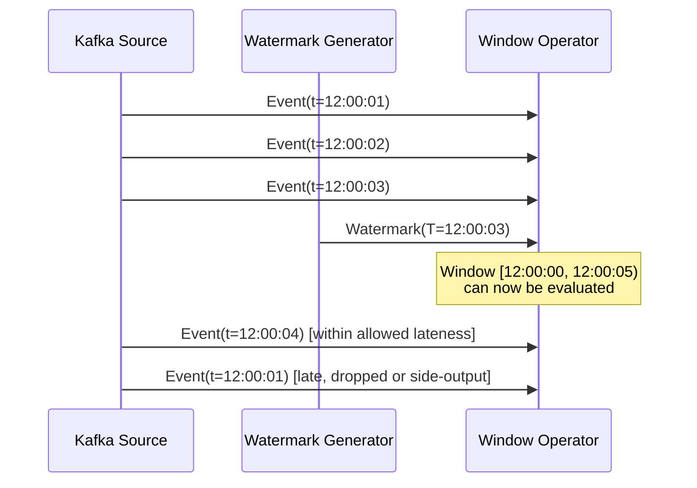
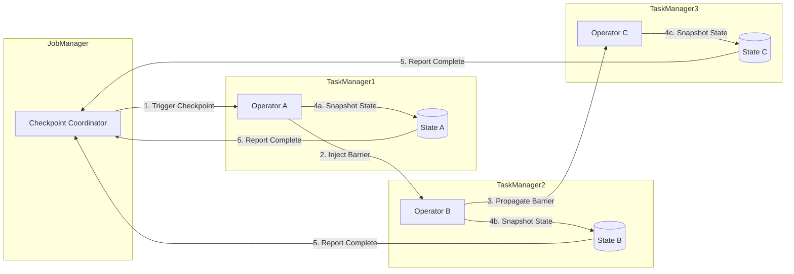
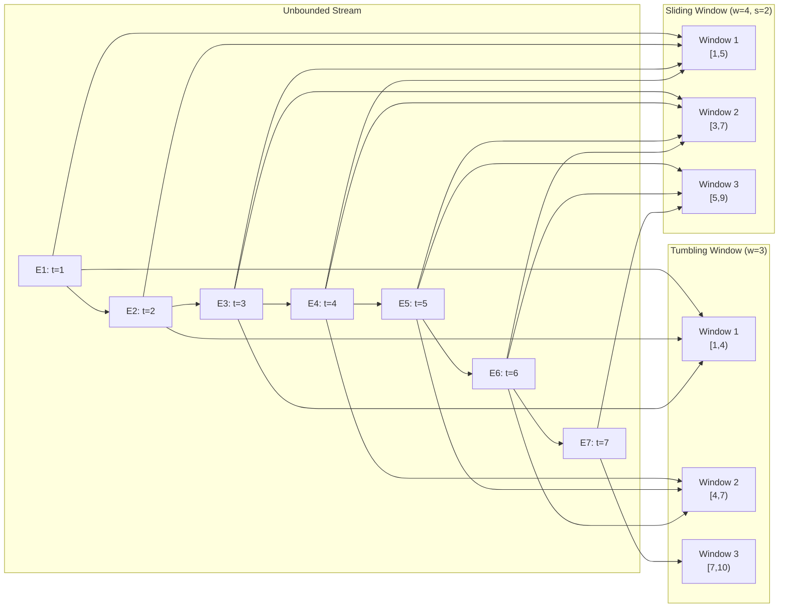
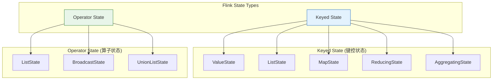
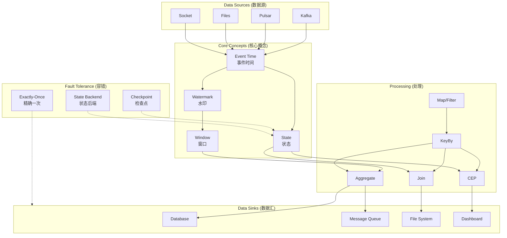
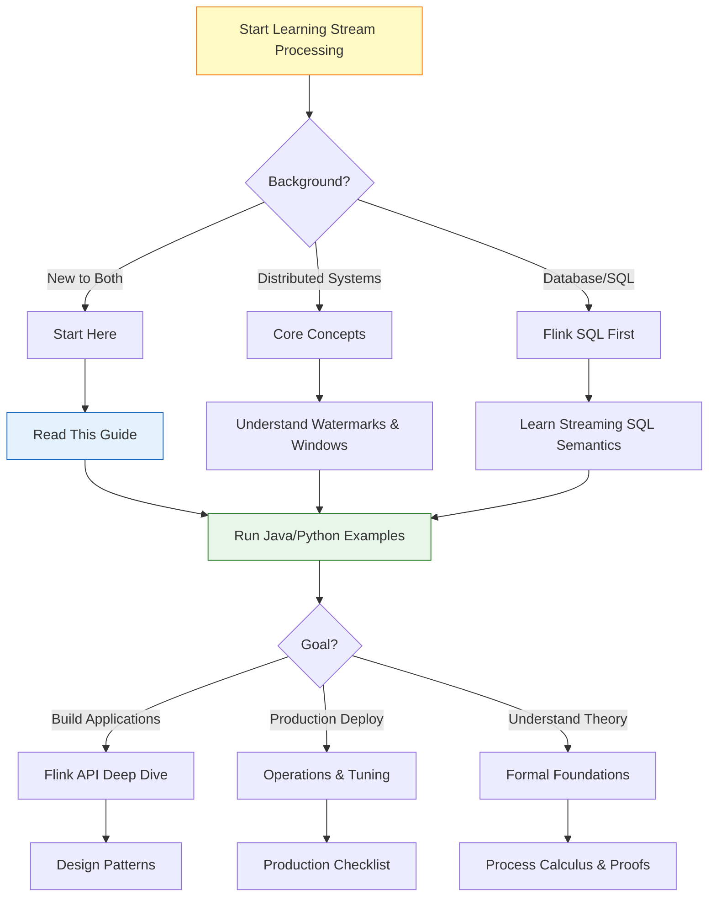

# Stream Computing Quick Start Guide (English)

> **Version**: v1.0 | **Date**: 2026-04-20 | **Status**: Production
> **Target Reader**: English-speaking engineers new to stream computing | **Estimated Reading Time**: 30 minutes
> **Prerequisites**: Basic programming (Java/Python/SQL), distributed systems concepts

---

## 1. Concept Definitions (Definitions)

### Def-QS-EN-01. Stream Processing (流处理)

Stream processing is a computational paradigm for processing **unbounded, continuously arriving data** in near real-time, producing results incrementally as data flows through the system.

```
Stream Processing: UnboundedStream × OperatorGraph → ContinuousResults
```

**Key distinction from batch processing**:

| Dimension | Batch Processing (批处理) | Stream Processing (流处理) |
|-----------|--------------------------|---------------------------|
| Data scope | Bounded (finite) | Unbounded (infinite) |
| Latency | Minutes to hours | Milliseconds to seconds |
| Output | Final result only | Continuously updated results |
| Use case | Historical analytics | Real-time monitoring, alerts |

### Def-QS-EN-02. Event Time vs Processing Time (事件时间 vs 处理时间)

In stream processing, time has three interpretations:

| Time Type | Chinese | Definition | Use Case |
|-----------|---------|-----------|----------|
| **Event Time** | 事件时间 | When the event occurred at the source | Correctness-critical analytics |
| **Ingestion Time** | 摄入时间 | When the event enters the processing system | Approximate ordering |
| **Processing Time** | 处理时间 | When the event is processed by the operator | Low-latency, approximate |

**Rule of thumb**: Use Event Time (事件时间) for correctness; use Processing Time (处理时间) for lowest latency.

---

## 2. Property Derivation (Properties)

### Lemma-QS-EN-01. Watermark Progress Guarantee

In event-time processing, Watermarks (水印) guarantee monotonic progress:

```
∀t₁, t₂: t₁ < t₂ ⇒ W(t₁) ≤ W(t₂)
```

This monotonicity ensures windows can be safely triggered without missing late data within the allowed lateness threshold.

### Lemma-QS-EN-02. Checkpoint Consistency

A consistent Checkpoint (检查点) satisfies:

```
ConsistentCheckpoint ⟺ ∀operators: snapshot reflects exactly the state after processing all records before barrier
```

This property enables exactly-once fault tolerance through state replay.

---

## 3. Relations Establishment (Relations)

### Relation 1: Core Concepts → Flink Implementation

| Core Concept | Flink Concept | API / Mechanism |
|-------------|---------------|----------------|
| Event Time | Watermark (水印) | `WatermarkStrategy`, `assignTimestampsAndWatermarks()` |
| Window (窗口) | Window Assigner | `TumblingEventTimeWindows`, `SlidingEventTimeWindows` |
| State (状态) | State Backend | `ValueState`, `ListState`, `MapState`, `RocksDBStateBackend` |
| Fault Tolerance | Checkpoint (检查点) | `CheckpointConfig`, `enableCheckpointing(interval)` |
| Exactly-Once | Two-Phase Commit | `TwoPhaseCommitSinkFunction` |

### Relation 2: This Guide → Full Knowledge Base

This quick start maps to deeper documents:

- **Theory depth** → [Struct/01-foundation/](Struct/01-foundation/00-INDEX-en.md) (formal definitions and proofs)
- **Flink specifics** → [Flink/02-core/](Flink/02-core/) (architecture and mechanisms)
- **Design patterns** → [Knowledge/02-design-patterns/](Knowledge/02-design-patterns/00-INDEX-en.md) (engineering best practices)
- **Production readiness** → [Knowledge/07-best-practices/](Knowledge/07-best-practices/)

---

## 4. Argumentation (Argumentation)

### Argument: Why Stream Processing Matters

Modern businesses operate in real-time. The value of data decays with time:

| Delay | Use Case | Value |
|-------|----------|-------|
| < 100ms | Fraud detection, algorithmic trading | Critical — immediate action required |
| < 1s | IoT alerts, system monitoring | High — rapid response prevents escalation |
| < 1min | Dashboards, recommendations | Medium — timely insights drive decisions |
| > 1hour | Historical reports, data science | Lower — batch processing is sufficient |

Stream processing bridges the gap between data generation and actionable insight, enabling applications that were impossible with batch-only architectures.

---

## 5. Core Concepts Illustrated

### 5.1 Watermark (水印) — Handling Event-Time Progress

A Watermark is a special event carrying a timestamp `T` that declares: "I believe all events with timestamp ≤ T have arrived."



**Key parameters**:

- `maxOutOfOrderness`: Maximum expected delay between event time and processing time
- `allowedLateness`: How long to wait for late events after watermark passes
- `withIdleness`: Timeout for idle partitions to prevent watermark stalling

### 5.2 Checkpoint (检查点) — Fault Tolerance Mechanism

Checkpoint uses Chandy-Lamport algorithm to capture globally consistent snapshots:



**Checkpoint types**:

- **Aligned Checkpoint (对齐检查点)**: Wait for all barriers; simple but may cause backpressure
- **Unaligned Checkpoint (非对齐检查点)**: Snapshot in-flight data; lower latency overhead

### 5.3 Window (窗口) — Grouping Events in Time

Windows partition the unbounded stream into finite chunks for aggregation:



| Window Type | Chinese | Characteristics | Use Case |
|-------------|---------|-----------------|----------|
| Tumbling | 滚动窗口 | Fixed size, no overlap | Periodic reporting |
| Sliding | 滑动窗口 | Fixed size with overlap | Moving averages |
| Session | 会话窗口 | Dynamic, by activity gap | User behavior analysis |
| Global | 全局窗口 | Single window for all | Custom trigger logic |

### 5.4 State (状态) — Remembering Information

State allows operators to maintain information across events:



---

## 6. Examples — Minimal Runnable Examples

### 6.1 Java DataStream API — Word Count

```java
import org.apache.flink.api.common.eventtime.WatermarkStrategy;
import org.apache.flink.api.common.functions.FlatMapFunction;
import org.apache.flink.api.java.tuple.Tuple2;
import org.apache.flink.streaming.api.datastream.DataStream;
import org.apache.flink.streaming.api.environment.StreamExecutionEnvironment;
import org.apache.flink.streaming.api.windowing.assigners.TumblingEventTimeWindows;
import org.apache.flink.util.Collector;

public class WordCount {
    public static void main(String[] args) throws Exception {
        // 1. Create execution environment
        StreamExecutionEnvironment env =
            StreamExecutionEnvironment.getExecutionEnvironment();

        // 2. Enable checkpointing (检查点) for fault tolerance
        env.enableCheckpointing(5000); // every 5 seconds

        // 3. Create data source (Kafka, socket, or collection)
        DataStream<String> source = env.socketTextStream("localhost", 9999);

        // 4. Transform: split lines into words
        DataStream<Tuple2<String, Integer>> wordCounts = source
            .flatMap(new Tokenizer())
            .assignTimestampsAndWatermarks(
                WatermarkStrategy.<Tuple2<String, Integer>>forMonotonousTimestamps()
                    .withIdleness(Duration.ofMinutes(1))
            )
            .keyBy(value -> value.f0)
            .window(TumblingEventTimeWindows.of(Time.minutes(1)))
            .sum(1);

        // 5. Sink: print results
        wordCounts.print();

        // 6. Execute
        env.execute("Streaming WordCount");
    }

    // FlatMapFunction: split sentence into (word, 1) pairs
    public static class Tokenizer implements FlatMapFunction<String, Tuple2<String, Integer>> {
        @Override
        public void flatMap(String value, Collector<Tuple2<String, Integer>> out) {
            for (String word : value.toLowerCase().split("\\W+")) {
                if (word.length() > 0) {
                    out.collect(new Tuple2<>(word, 1));
                }
            }
        }
    }
}
```

### 6.2 Python Table API — Streaming SQL

```python
from pyflink.table import StreamTableEnvironment, EnvironmentSettings
from pyflink.datastream import StreamExecutionEnvironment

# 1. Create streaming environment
env = StreamExecutionEnvironment.get_execution_environment()
env.enable_checkpointing(5000)

settings = EnvironmentSettings.new_instance().in_streaming_mode().build()
t_env = StreamTableEnvironment.create(env, settings)

# 2. Register Kafka source table
t_env.execute_sql("""
    CREATE TABLE user_events (
        user_id STRING,
        event_type STRING,
        event_time TIMESTAMP(3),
        WATERMARK FOR event_time AS event_time - INTERVAL '5' SECOND
    ) WITH (
        'connector' = 'kafka',
        'topic' = 'user-events',
        'properties.bootstrap.servers' = 'localhost:9092',
        'format' = 'json'
    )
""")

# 3. Register sink table
t_env.execute_sql("""
    CREATE TABLE event_counts (
        event_type STRING PRIMARY KEY NOT ENFORCED,
        event_count BIGINT,
        window_start TIMESTAMP(3)
    ) WITH (
        'connector' = 'jdbc',
        'url' = 'jdbc:mysql://localhost:3306/analytics',
        'table-name' = 'event_counts'
    )
""")

# 4. Execute tumbling window aggregation
# 滚动窗口聚合
 t_env.execute_sql("""
    INSERT INTO event_counts
    SELECT
        event_type,
        COUNT(*) AS event_count,
        TUMBLE_START(event_time, INTERVAL '1' MINUTE) AS window_start
    FROM user_events
    GROUP BY
        event_type,
        TUMBLE(event_time, INTERVAL '1' MINUTE)
""")
```

### 6.3 Flink SQL — Minimal Example

```sql
-- Create a streaming table with event time and watermark
-- 创建带事件时间和水印的流表
CREATE TABLE clicks (
    user_id STRING,
    page_id STRING,
    click_time TIMESTAMP(3),
    WATERMARK FOR click_time AS click_time - INTERVAL '10' SECOND
) WITH (
    'connector' = 'kafka',
    'topic' = 'clicks',
    'properties.bootstrap.servers' = 'kafka:9092',
    'format' = 'json'
);

-- Compute page views per minute using tumbling window
-- 使用滚动窗口计算每分钟页面浏览量
SELECT
    page_id,
    TUMBLE_START(click_time, INTERVAL '1' MINUTE) AS window_start,
    COUNT(*) AS view_count
FROM clicks
GROUP BY
    page_id,
    TUMBLE(click_time, INTERVAL '1' MINUTE);
```

---

## 7. Visualizations

### 7.1 Stream Processing Concept Map



### 7.2 Learning Path Decision Tree



---

## 8. Recommended Learning Paths with Time Estimates

### 8.1 Beginner Path (初学者路径) — 2 weeks

| Day | Topic | Document | Time |
|-----|-------|----------|------|
| 1-2 | Core concepts overview | This guide | 4h |
| 3-4 | Set up local Flink | [Flink Official Docs](https://nightlies.apache.org/flink/) | 4h |
| 5-7 | Run Java/Python examples | Code above + Flink examples | 8h |
| 8-10 | Understand Watermark & Window | `Flink/02-core/time-semantics-and-watermark-en.md` | 6h |
| 11-12 | Learn Checkpoint basics | `Flink/02-core/checkpoint-mechanism-deep-dive-en.md` | 4h |
| 13-14 | Build first end-to-end job | Practice project | 8h |

**Total**: ~34 hours over 2 weeks

### 8.2 Intermediate Path (进阶路径) — 1 month

| Week | Focus | Key Documents |
|------|-------|--------------|
| 1 | State management & backends | `Flink/02-core/flink-state-management-complete-guide-en.md` |
| 2 | Exactly-Once & connectors | `Flink/02-core/exactly-once-end-to-end-en.md` |
| 3 | Design patterns | `Knowledge/02-design-patterns/` (5+ patterns) |
| 4 | Production deployment | `Knowledge/07-best-practices/flink-production-checklist.md` |

### 8.3 Advanced Path (专家路径) — 3 months

| Month | Focus | Key Documents |
|-------|-------|--------------|
| 1 | Formal foundations | `Struct/01-foundation/01.02-process-calculus-primer-en.md`, `01.04-dataflow-model-formalization-en.md` |
| 2 | Proof chains & correctness | `core-docs/04.02-flink-exactly-once-correctness-en.md`, `Struct/Proof-Chains-Master-Graph.md` |
| 3 | Frontier topics | `Knowledge/06-frontier/`, `Flink/07-rust-native/` |

---

## 9. Common Pitfalls & Quick Fixes

| Symptom | Cause | Quick Fix |
|---------|-------|-----------|
| Watermark not advancing | Idle Kafka partitions | Enable `.withIdleness(timeout)` |
| Late data discarded | `allowedLateness` too small | Increase or use side output |
| Checkpoint timeout | State too large | Use incremental checkpoint, RocksDB |
| OOM in TaskManager | Unbounded state growth | Enable state TTL, check key cardinality |
| High latency | Backpressure | Check serialization, tune parallelism |
| Duplicate output | Non-idempotent sink | Use idempotent writes or two-phase commit |

---

## 10. References


---

*Document Version: v1.0 | Created: 2026-04-20 | Reading Time: 30 min | Examples: Java, Python, SQL*
