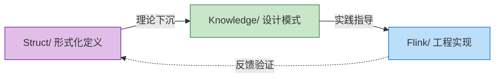

<!-- AI Translation Template - Replace <!-- TRANSLATE --> markers with actual translation -->

<!-- TRANSLATE: # AnalysisDataFlow 快速上手指南 -->

<!-- TRANSLATE: > **5分钟了解项目 | 按角色定制路径 | 快速问题索引** -->
<!-- TRANSLATE: > -->
<!-- TRANSLATE: > 📊 **254 篇文档 | 945 形式化元素 | 100% 完成度** -->


<!-- TRANSLATE: ### 1.2 三大目录结构 -->

<!-- TRANSLATE: | 目录 | 定位 | 内容特征 | 适合谁 | -->
<!-- TRANSLATE: |------|------|----------|--------| -->
<!-- TRANSLATE: | **Struct/** | 形式理论基础 | 数学定义、定理证明、严格论证 | 研究员、架构师 | -->
<!-- TRANSLATE: | **Knowledge/** | 工程实践知识 | 设计模式、业务场景、技术选型 | 架构师、工程师 | -->
<!-- TRANSLATE: | **Flink/** | Flink 专项技术 | 架构机制、SQL/API、工程实践 | 开发工程师 | -->

<!-- TRANSLATE: **知识流转关系**： -->




<!-- TRANSLATE: ## 2. 按角色阅读路径 -->

<!-- TRANSLATE: ### 2.1 架构师路径（3-5天） -->

<!-- TRANSLATE: **目标**：掌握系统设计方法论，进行技术选型和架构决策 -->

```
Day 1-2: 概念筑基
├── Struct/01-foundation/01.01-unified-streaming-theory.md
│   └── 重点：六层表达能力层次（L1-L6）
├── Knowledge/01-concept-atlas/concurrency-paradigms-matrix.md
│   └── 重点：五大并发范式对比矩阵
└── Knowledge/01-concept-atlas/streaming-models-mindmap.md
    └── 重点：流计算模型六维对比

Day 3-4: 模式与选型
├── Knowledge/02-design-patterns/ (全部浏览)
│   └── 重点：7大核心模式的关系图
├── Knowledge/04-technology-selection/engine-selection-guide.md
│   └── 重点：流处理引擎选型决策树
└── Knowledge/04-technology-selection/streaming-database-guide.md
    └── 重点：流数据库对比矩阵

Day 5: 架构决策
├── Flink/01-architecture/flink-1.x-vs-2.0-comparison.md
│   └── 重点：架构演进与迁移决策
└── Struct/03-relationships/03.03-expressiveness-hierarchy.md
    └── 重点：表达能力与工程约束
```


<!-- TRANSLATE: ### 2.3 研究员路径（2-4周） -->

<!-- TRANSLATE: **目标**：理解理论基础，掌握形式化方法，能够开展创新研究 -->

```
Week 1-2: 理论基础
├── Struct/01-foundation/01.02-process-calculus-primer.md
│   └── CCS/CSP/π-演算基础
├── Struct/01-foundation/01.04-dataflow-model-formalization.md
│   └── Dataflow严格形式化
├── Struct/01-foundation/01.03-actor-model-formalization.md
│   └── Actor模型形式语义
└── Struct/02-properties/02.03-watermark-monotonicity.md
    └── Watermark单调性定理

Week 3: 模型关系与编码
├── Struct/03-relationships/03.01-actor-to-csp-encoding.md
│   └── Actor→CSP编码保持性
├── Struct/03-relationships/03.02-flink-to-process-calculus.md
│   └── Flink→进程演算编码
└── Struct/03-relationships/03.03-expressiveness-hierarchy.md
    └── 六层表达能力层次定理

Week 4: 形式证明与前沿
├── Struct/04-proofs/04.01-flink-checkpoint-correctness.md
│   └── Checkpoint一致性证明
├── Struct/04-proofs/04.02-flink-exactly-once-correctness.md
│   └── Exactly-Once正确性证明
└── Struct/06-frontier/06.02-choreographic-streaming-programming.md
    └── Choreographic编程前沿
```


<!-- TRANSLATE: ## 3. 快速查找索引 -->

<!-- TRANSLATE: ### 3.1 按主题索引 -->

<!-- TRANSLATE: #### 流处理基础 -->

<!-- TRANSLATE: | 主题 | 必读文档 | 形式化基础 | -->
<!-- TRANSLATE: |------|----------|------------| -->
<!-- TRANSLATE: | **事件时间处理** | Knowledge/02-design-patterns/pattern-event-time-processing.md | `Def-S-04-04` Watermark语义 | -->
<!-- TRANSLATE: | **窗口计算** | Knowledge/02-design-patterns/pattern-windowed-aggregation.md | `Def-S-04-05` 窗口算子 | -->
<!-- TRANSLATE: | **状态管理** | Knowledge/02-design-patterns/pattern-stateful-computation.md | `Thm-S-17-01` Checkpoint一致性 | -->
<!-- TRANSLATE: | **Checkpoint** | Knowledge/02-design-patterns/pattern-checkpoint-recovery.md | `Thm-S-18-01` Exactly-Once正确性 | -->
<!-- TRANSLATE: | **一致性级别** | Struct/02-properties/02.02-consistency-hierarchy.md | `Def-S-08-01~04` AM/AL/EO语义 | -->

<!-- TRANSLATE: #### 设计模式 -->

<!-- TRANSLATE: | 模式 | 适用场景 | 复杂度 | 文档 | -->
<!-- TRANSLATE: |------|----------|--------|------| -->
<!-- TRANSLATE: | P01 Event Time | 乱序数据处理 | ★★★☆☆ | pattern-event-time-processing.md | -->
<!-- TRANSLATE: | P02 Windowed Aggregation | 窗口聚合计算 | ★★☆☆☆ | pattern-windowed-aggregation.md | -->
<!-- TRANSLATE: | P03 CEP | 复杂事件匹配 | ★★★★☆ | pattern-cep-complex-event.md | -->
<!-- TRANSLATE: | P04 Async I/O | 外部数据关联 | ★★★☆☆ | pattern-async-io-enrichment.md | -->
<!-- TRANSLATE: | P05 State Management | 有状态计算 | ★★★★☆ | pattern-stateful-computation.md | -->
<!-- TRANSLATE: | P06 Side Output | 数据分流 | ★★☆☆☆ | pattern-side-output.md | -->
<!-- TRANSLATE: | P07 Checkpoint | 故障容错 | ★★★★★ | pattern-checkpoint-recovery.md | -->

<!-- TRANSLATE: #### 前沿技术 -->

<!-- TRANSLATE: | 技术方向 | 核心文档 | 技术栈 | -->
<!-- TRANSLATE: |----------|----------|--------| -->
<!-- TRANSLATE: | **流数据库** | Knowledge/06-frontier/streaming-databases.md | RisingWave, Materialize | -->
<!-- TRANSLATE: | **Rust流生态** | Knowledge/06-frontier/rust-streaming-ecosystem.md | Arroyo, Timeplus | -->
<!-- TRANSLATE: | **实时RAG** | Knowledge/06-frontier/real-time-rag-architecture.md | Flink + 向量数据库 | -->
<!-- TRANSLATE: | **Streaming Lakehouse** | Knowledge/06-frontier/streaming-lakehouse-iceberg-delta.md | Flink + Iceberg/Paimon | -->
<!-- TRANSLATE: | **边缘流处理** | Knowledge/06-frontier/edge-streaming-patterns.md | 边缘计算架构 | -->
<!-- TRANSLATE: | **流式物化视图** | Knowledge/06-frontier/streaming-materialized-view-architecture.md | 实时数仓 | -->


<!-- TRANSLATE: ### 3.3 常用文档快速链接 -->

<!-- TRANSLATE: #### 核心索引页 -->

<!-- TRANSLATE: | 索引 | 用途 | 路径 | -->
<!-- TRANSLATE: |------|------|------| -->
<!-- TRANSLATE: | **项目总览** | 整体了解项目结构 | [README.md](./README.md) | -->
<!-- TRANSLATE: | **Struct索引** | 形式化理论导航 | [Struct/00-INDEX.md](./Struct/00-INDEX.md) | -->
<!-- TRANSLATE: | **Knowledge索引** | 工程实践知识导航 | [Knowledge/00-INDEX.md](./Knowledge/00-INDEX.md) | -->
<!-- TRANSLATE: | **Flink索引** | Flink专项技术导航 | [Flink/00-INDEX.md](./Flink/00-INDEX.md) | -->
<!-- TRANSLATE: | **定理注册表** | 形式化元素全局索引 | [THEOREM-REGISTRY.md](./THEOREM-REGISTRY.md) | -->
<!-- TRANSLATE: | **进度跟踪** | 项目进度与统计 | [PROJECT-TRACKING.md](./PROJECT-TRACKING.md) | -->

<!-- TRANSLATE: #### 快速决策参考 -->

<!-- TRANSLATE: | 决策类型 | 参考文档 | -->
<!-- TRANSLATE: |----------|----------| -->
<!-- TRANSLATE: | 流处理引擎选型 | Knowledge/04-technology-selection/engine-selection-guide.md | -->
<!-- TRANSLATE: | Flink vs Spark选型 | Flink/05-vs-competitors/flink-vs-spark-streaming.md | -->
<!-- TRANSLATE: | Flink vs RisingWave选型 | Knowledge/04-technology-selection/flink-vs-risingwave.md | -->
<!-- TRANSLATE: | SQL vs DataStream API | Flink/03-sql-table-api/sql-vs-datastream-comparison.md | -->
<!-- TRANSLATE: | 状态后端选型 | Flink/06-engineering/state-backend-selection.md | -->
<!-- TRANSLATE: | 流数据库选型 | Knowledge/04-technology-selection/streaming-database-guide.md | -->

<!-- TRANSLATE: #### 生产故障排查 -->

<!-- TRANSLATE: | 故障类型 | 排查文档 | -->
<!-- TRANSLATE: |----------|----------| -->
<!-- TRANSLATE: | Checkpoint问题 | Flink/02-core-mechanisms/checkpoint-mechanism-deep-dive.md | -->
<!-- TRANSLATE: | 背压问题 | Flink/02-core-mechanisms/backpressure-and-flow-control.md | -->
<!-- TRANSLATE: | 性能调优 | Flink/06-engineering/performance-tuning-guide.md | -->
<!-- TRANSLATE: | 内存溢出 | Flink/06-engineering/performance-tuning-guide.md | -->
<!-- TRANSLATE: | Exactly-Once失效 | Flink/02-core-mechanisms/exactly-once-end-to-end.md | -->

<!-- TRANSLATE: #### 反模式检查清单 -->

<!-- TRANSLATE: | 反模式 | 检测文档 | -->
<!-- TRANSLATE: |--------|----------| -->
<!-- TRANSLATE: | 全局状态滥用 | Knowledge/09-anti-patterns/anti-pattern-01-global-state-abuse.md | -->
<!-- TRANSLATE: | Watermark设置不当 | Knowledge/09-anti-patterns/anti-pattern-02-watermark-misconfiguration.md | -->
<!-- TRANSLATE: | Checkpoint间隔不合理 | Knowledge/09-anti-patterns/anti-pattern-03-checkpoint-interval-misconfig.md | -->
<!-- TRANSLATE: | 热点Key未处理 | Knowledge/09-anti-patterns/anti-pattern-04-hot-key-skew.md | -->
<!-- TRANSLATE: | ProcessFunction阻塞I/O | Knowledge/09-anti-patterns/anti-pattern-05-blocking-io-processfunction.md | -->
<!-- TRANSLATE: | 完整检查清单 | Knowledge/09-anti-patterns/anti-pattern-checklist.md | -->


<!-- TRANSLATE: ## 5. 常见问题速查 -->

<!-- TRANSLATE: ### 5.1 如何查找特定主题 -->

<!-- TRANSLATE: **方法一：索引导航** -->

<!-- TRANSLATE: 1. 先查阅 [Struct/00-INDEX.md](./Struct/00-INDEX.md) 了解理论基础 -->
<!-- TRANSLATE: 2. 再查阅 [Knowledge/00-INDEX.md](./Knowledge/00-INDEX.md) 了解设计模式 -->
<!-- TRANSLATE: 3. 最后查阅 [Flink/00-INDEX.md](./Flink/00-INDEX.md) 了解工程实现 -->

<!-- TRANSLATE: **方法二：定理编号追踪** -->

<!-- TRANSLATE: 1. 在 [THEOREM-REGISTRY.md](./THEOREM-REGISTRY.md) 查找定理编号 -->
<!-- TRANSLATE: 2. 根据编号定位文档（如 `Thm-S-17-01` → Struct/04-proofs/04.01） -->
<!-- TRANSLATE: 3. 交叉引用相关定义和引理 -->

<!-- TRANSLATE: **方法三：问题驱动** -->

<!-- TRANSLATE: 1. 查阅第3.2节「按问题索引」 -->
<!-- TRANSLATE: 2. 按症状匹配解决方案 -->
<!-- TRANSLATE: 3. 深入阅读推荐文档 -->


<!-- TRANSLATE: ### 5.3 如何贡献内容 -->

<!-- TRANSLATE: **贡献原则**： -->

<!-- TRANSLATE: 1. **遵循六段式模板**：概念定义 → 属性推导 → 关系建立 → 论证过程 → 形式证明 → 实例验证 -->
<!-- TRANSLATE: 2. **使用统一编号**：新定理/定义按规则编号，避免冲突 -->
<!-- TRANSLATE: 3. **保持跨目录引用**：Struct定义 → Knowledge模式 → Flink实现 -->
<!-- TRANSLATE: 4. **添加Mermaid图表**：每个文档至少一个可视化 -->

<!-- TRANSLATE: **贡献流程**： -->

<!-- TRANSLATE: 1. 检查 [PROJECT-TRACKING.md](./PROJECT-TRACKING.md) 了解项目状态 -->
<!-- TRANSLATE: 2. 阅读 [AGENTS.md](./AGENTS.md) 了解编码规范 -->
<!-- TRANSLATE: 3. 在对应目录创建文档，遵循命名规范：`{层号}.{序号}-{主题}.md` -->
<!-- TRANSLATE: 4. 更新相关索引文件（00-INDEX.md） -->
<!-- TRANSLATE: 5. 更新定理注册表（THEOREM-REGISTRY.md） -->

<!-- TRANSLATE: **质量门禁**： -->

<!-- TRANSLATE: - 引用需可验证（优先DOI或稳定URL） -->
<!-- TRANSLATE: - Mermaid图语法需通过校验 -->
<!-- TRANSLATE: - 代码示例需可运行 -->
<!-- TRANSLATE: - 形式化定义需数学严谨 -->


<!-- TRANSLATE: > 📌 **提示**：本文档为快速上手指南，详细内容请参考各目录索引和具体文档。 -->
<!-- TRANSLATE: > -->
<!-- TRANSLATE: > 📅 **最后更新**：2026-04-03 | 📝 **版本**：v1.0 -->
