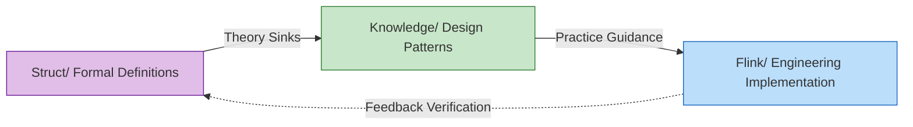
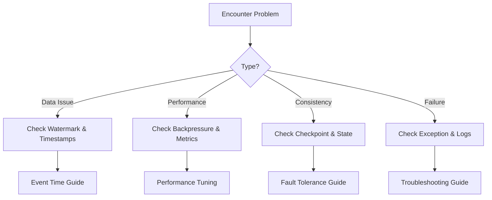

# AnalysisDataFlow Quick Start Guide

> **Understand the project in 5 minutes | Customized paths by role | Quick problem index**
>
> 📊 **254 Documents | 945 Formal Elements | 100% Completion**

---

## 1. 5-Minute Quick Overview

### 1.1 What is this Project

**AnalysisDataFlow** is a **unified knowledge base** for the stream computing field—a full-stack knowledge system from formal theory to engineering practice.

```
┌─────────────────────────────────────────────────────────────┐
│                    Knowledge Hierarchy Pyramid                │
├─────────────────────────────────────────────────────────────┤
│  L6 Production Implementation  │  Flink/ Code, Config, Cases (116 docs)     │
├─────────────────────────────────────────────────────────────┤
│  L4-L5 Patterns                │  Knowledge/ Design Patterns, Selection (102 docs) │
├─────────────────────────────────────────────────────────────┤
│  L1-L3 Theory                  │  Struct/ Theorems, Proofs, Formal Definitions (43 docs) │
└─────────────────────────────────────────────────────────────┘
```

**Core Values**:

- 🔬 **Theoretical Support**: Formal theorems guarantee correctness of engineering decisions
- 🛠️ **Practical Guidance**: Complete mapping path from theorems to code
- 🔍 **Problem Diagnosis**: Quickly locate solutions by symptoms

---

### 1.2 Three Major Directory Structure

| Directory | Positioning | Content Characteristics | Suitable For |
|-----------|-------------|-------------------------|--------------|
| **Struct/** | Formal Theory Foundation | Mathematical definitions, theorem proofs, rigorous arguments | Researchers, Architects |
| **Knowledge/** | Engineering Practice Knowledge | Design patterns, business scenarios, technical selection | Architects, Engineers |
| **Flink/** | Flink-specific Technology | Architecture mechanisms, SQL/API, engineering practices | Development Engineers |

**Knowledge Flow Relationship**:



---

### 1.3 Core Features

#### 8-Section Document Template (Mandatory Structure)

Each core document must include:

| Section | Content | Example |
|---------|---------|---------|
| 1. Concept Definitions | Strict formal definitions + intuitive explanations | `Def-S-04-04` Watermark Semantics |
| 2. Property Derivation | Lemmas and properties derived from definitions | `Lemma-S-04-02` Monotonicity Lemma |
| 3. Relationship Establishment | Associations with other concepts/models | Flink→Process Calculus Encoding |
| 4. Argumentation Process | Auxiliary theorems, counter-example analysis | Boundary condition discussions |
| 5. Formal Proof | Complete proof of main theorems | `Thm-S-17-01` Checkpoint Consistency |
| 6. Example Verification | Simplified examples, code snippets | Flink configuration examples |
| 7. Visualizations | Mermaid charts | Architecture diagrams, flowcharts |
| 8. References | Authoritative source citations | VLDB/SOSP papers |

#### Theorem Numbering System

Global unified numbering: `{type}-{stage}-{document_number}-{sequence_number}`

| Number Example | Meaning | Position |
|----------------|---------|----------|
| `Thm-S-04-01` | Theorem - Struct Stage - Document 04 - Sequence 01 | Struct/03-semantics/ |
| `Def-K-02-03` | Definition - Knowledge Stage - Document 02 - Sequence 03 | Knowledge/02-design-patterns/ |
| `Prop-F-01-02` | Proposition - Flink Stage - Document 01 - Sequence 02 | Flink/01-overview/ |

---

## 2. Quick Start by Role

### 2.1 👋 Beginner Path (First Visit)

**Goal**: Understand project structure and positioning in 30 minutes

| Step | Action | Time | Document |
|------|--------|------|----------|
| 1 | Read this quick start guide | 10 min | [QUICK-START.md](./QUICK-START.md) |
| 2 | Browse visual navigation | 10 min | [visuals/](./visuals/) |
| 3 | Select first document of interest | 10 min | Choose by scenario below |

**Recommended First Reads**:

- Want to understand theory? → [Struct/ Stream Computing Formal Model](Struct/02-models/01-stream-computing-formal-model.md)
- Want practical patterns? → [Knowledge/ Idempotency Patterns](Knowledge/02-design-patterns/01-idempotency-patterns.md)
- Want Flink specifics? → [Flink/ Checkpoint Deep Dive](Flink/02-core/checkpoint-mechanism-deep-dive.md)

---

### 2.2 🔧 Development Engineer Path

**Goal**: Quickly solve Flink development problems

| Scenario | Symptom | Solution Document |
|----------|---------|-------------------|
| Data loss | Records missing | [Exactly-Once Implementation Guide](Flink/02-core/exactly-once-implementation-guide.md) |
| Out-of-order data | Wrong aggregation results | [Event Time Processing](Flink/03-api/01-event-time/event-time-processing-guide.md) |
| State too large | OOM/Performance issues | [State Backend Selection](Flink/04-runtime/04.02-state/state-backend-selection-guide.md) |
| Backpressure | Processing lag | [Backpressure Diagnosis](Flink/04-runtime/04.04-resource/backpressure-diagnosis-guide.md) |

---

### 2.3 🏗️ Architect Path

**Goal**: Technical selection and architecture design

| Decision Point | Decision Tree | Comparison Document |
|----------------|---------------|---------------------|
| Which stream engine? | [Engine Selection Decision Tree](visuals/selection-tree-streaming.md) | [Engine Comparison Matrix](visuals/matrix-engines.md) |
| Processing semantics? | [Consistency Level Decision](Knowledge/04-selection/consistency-level-decision-guide.md) | [At-Least-Once vs Exactly-Once](Knowledge/04-selection/at-least-once-vs-exactly-once.md) |
| State storage? | [State Backend Selection](Flink/04-runtime/04.02-state/state-backend-selection-guide.md) | [State Backends Deep Comparison](Flink/3.9-state-backends-deep-comparison.md) |

---

### 2.4 🔬 Researcher Path

**Goal**: Deep understanding of theoretical foundations

| Research Direction | Starting Point | Key Documents |
|-------------------|----------------|---------------|
| Time semantics | Event Time vs Processing Time | [Struct/ Time Semantics Formalization](Struct/03-semantics/01-time-semantics-formalization.md) |
| Fault tolerance | Checkpoint Theory | [Struct/ Checkpoint Consistency Proof](Struct/04-fault-tolerance/01-checkpoint-consistency-proof.md) |
| Model comparison | Actor vs CSP vs Dataflow | [Struct/ Unified Model Relationship Graph](Struct/Unified-Model-Relationship-Graph.md) |

---

## 3. Problem Index (Find Solutions by Symptoms)

### 3.1 Common Flink Problems

| Symptom | Possible Cause | Quick Solution |
|---------|---------------|----------------|
| `Checkpoint timeout` | State too large, network issues | Reduce state, use incremental checkpoint |
| `Watermark not advancing` | Idle partitions | Enable idleness detection |
| `Late data discarded` | Allowed lateness too small | Increase `allowedLateness` |
| `OOM in TaskManager` | State growth unbounded | Enable state TTL, use RocksDB |
| `High latency` | Backpressure, GC | Tune parallelism, optimize serialization |

### 3.2 Problem Diagnosis Path



---

## 4. Advanced Resources

### 4.1 Navigation Index

- **Complete Index**: [NAVIGATION-INDEX.md](./NAVIGATION-INDEX.md)
- **Learning Paths**: [LEARNING-PATH-GUIDE.md](./LEARNING-PATH-GUIDE.md)
- **Theorem Registry**: [THEOREM-REGISTRY.md](./THEOREM-REGISTRY.md)

### 4.2 Interactive Tools

- **Knowledge Graph**: [knowledge-graph-v4.html](knowledge-graph-v4.html)
- **Learning Path Recommender**: [learning-path-recommender.js](learning-path-recommender.js)

### 4.3 External Resources

- [Apache Flink Official Docs](https://nightlies.apache.org/flink/flink-docs-stable/)
- [Google Dataflow Paper](https://www.vldb.org/pvldb/vol8/p1792-Akidau.pdf)
- [Streaming Systems Book](https://www.oreilly.com/library/view/streaming-systems/9781491983874/)

---

## 5. Contribution

Found issues? Have suggestions? Welcome to contribute!

- **Issues**: [GitHub Issues](../../issues)
- **Contribution Guide**: [CONTRIBUTING.md](./CONTRIBUTING.md)
- **Agent Guide**: [AGENTS.md](./AGENTS.md)

---

**Next Steps**: Choose your path above and start exploring! 🚀
