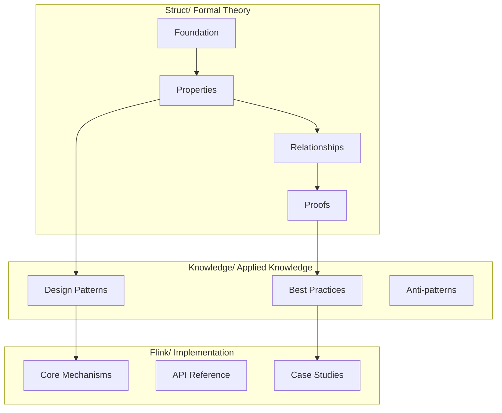

# Struct/ Formal Theory Document Index

> **Document Positioning**: Struct Directory Navigation Index | **Formalization Level**: L1-L6 Full Coverage | **Version**: 2026.04

---

## Table of Contents

- [Struct/ Formal Theory Document Index](#struct-formal-theory-document-index)
  - [Table of Contents](#table-of-contents)
  - [Introduction](#introduction)
  - [Formalization Level Explanation](#formalization-level-explanation)
  - [01-foundation/ Basic Theory (8 documents)](#01-foundation-basic-theory-8-documents)
  - [02-properties/ Property Derivation (8 documents)](#02-properties-property-derivation-8-documents)
  - [Cross-Directory Dependency Graph](#cross-directory-dependency-graph)
  - [Navigation Links](#navigation-links)

---

## Introduction

The **Struct/** directory contains the most rigorous formal theory documents in the stream computing field, following the eight-section template specification (Concept Definitions → Property Derivation → Relationship Establishment → Argumentation Process → Formal Proof → Example Verification → Visualizations → References). This document index provides structured navigation for the entire formal theoretical system.

**Statistics Overview**:

- Total: 43 formalized documents
- Theorems: 24 | Definitions: 60 | Lemmas/Propositions: 80+
- Coverage: Process Calculus, Actor Model, Dataflow, Type Theory, Verification Methods

---

## Formalization Level Explanation

| Level | Name | Description | Complexity |
|-------|------|-------------|------------|
| L1 | Conceptual Description | Informal/semi-formal description | Low |
| L2 | Structured Definition | Explicit mathematical definitions and notation | Low-Medium |
| L3 | Operational Semantics | Structural Operational Semantics (SOS) | Medium |
| L4 | Denotational Semantics | Domain theory/Algebraic semantics | Medium-High |
| L5 | Formal Proof | Theorem-proof structure | High |
| L6 | Mechanized Verification | Coq/TLA+/Iris verification | Very High |

---

## 01-foundation/ Basic Theory (8 documents)

Establishes the meta-models and core concepts foundation for stream computing formal theory.

| Document | Description | Level |
|----------|-------------|-------|
| [01.01-unified-streaming-theory.md](../../../Struct/01-foundation/01.01-unified-streaming-theory.md) | **Unified Stream Computing Meta-Model (USTM)** — Formalized meta-theory integrating Actor, CSP, Dataflow, and Petri net paradigms, establishing six-layer expressiveness hierarchy | L6 |
| [01.02-process-calculus-primer.md](../../../Struct/01-foundation/01.02-process-calculus-primer.md) | **Process Calculus Foundation** — Syntax and operational semantics of CCS, CSP, π-calculus, and Session Types, establishing expressiveness differences between dynamic/static channel models | L3-L4 |
| [01.03-actor-model-formalization.md](../../../Struct/01-foundation/01.03-actor-model-formalization.md) | **Actor Model Formalization** — Core definitions of Actor, Behavior, Mailbox, ActorRef, supervision trees, and serial processing lemma | L4-L5 |
| [01.04-dataflow-model-formalization.md](../../../Struct/01-foundation/01.04-dataflow-model-formalization.md) | **Dataflow Model Formalization** — Dataflow graphs, operator semantics, streams as partially-ordered multisets, event time/processing time/Watermark, window formalization | L5 |
| [01.05-csp-formalization.md](../../../Struct/01-foundation/01.05-csp-formalization.md) | **CSP Formalization** — Core CSP syntax, structured operational semantics, trace/failure/divergence semantics, channels and synchronization primitives | L3 |
| [01.06-petri-net-formalization.md](../../../Struct/01-foundation/01.06-petri-net-formalization.md) | **Petri Net Formalization** — P/T nets, transition firing rules, reachability analysis, Colored Petri Nets (CPN), Timed Petri Nets (TPN) hierarchy | L2-L4 |
| [01.07-session-types.md](../../../Struct/01-foundation/01.07-session-types.md) | **Session Types** — Binary/multi-party session type syntax, duality rules, encoding relationships between sessions and processes | L4-L5 |
| [stream-processing-semantics-formalization.md](../../../Struct/01-foundation/stream-processing-semantics-formalization.md) | **Stream Processing Semantics Formalization** — Formal definition of streams as infinite sequences, time models, semantic mappings | L5-L6 |

---

## 02-properties/ Property Derivation (8 documents)

System properties, invariants, and theorems derived from basic definitions.

| Document | Description | Level |
|----------|-------------|-------|
| [02.01-determinism-in-streaming.md](../../../Struct/02-properties/02.01-determinism-in-streaming.md) | **Determinism in Streaming Theorem** — Deterministic stream processing system definition, confluence reduction, observable determinism, pure function operator local determinism lemma | L5 |
| [02.02-consistency-hierarchy.md](../../../Struct/02-properties/02.02-consistency-hierarchy.md) | **Consistency Hierarchy** — At-Most-Once/At-Least-Once/Exactly-Once semantics, end-to-end/internal consistency, strong/causal/eventual consistency hierarchy | L5 |
| [02.03-watermark-monotonicity.md](../../../Struct/02-properties/02.03-watermark-monotonicity.md) | **Watermark Monotonicity Theorem** — Event time definition, Watermark lattice structure, minimum-preserving monotonicity lemma, late data handling | L5 |
| [02.04-liveness-and-safety.md](../../../Struct/02-properties/02.04-liveness-and-safety.md) | **Liveness and Safety Formalization** — Mathematical foundations of traces and properties, Alpern-Schneider decomposition theorem, fairness assumption hierarchy, LTL/CTL complexity (PSPACE-complete) | L4-L5 |
| [02.05-type-safety-derivation.md](../../../Struct/02-properties/02.05-type-safety-derivation.md) | **Type Safety Derivation** — Type systems and safety conditions for Featherweight Go (FG), Featherweight Generic Go (FGG), DOT calculus | L5 |
| [02.06-calm-theorem.md](../../../Struct/02-properties/02.06-calm-theorem.md) | **CALM Theorem** — Consistency As Logical Monotonicity, monotonicity determination for distributed problems | L5 |
| [02.07-encrypted-stream-processing.md](../../../Struct/02-properties/02.07-encrypted-stream-processing.md) | **Encrypted Stream Processing** — Homomorphic Encryption (HE) formalized definitions, partial/fully homomorphic encryption classification, secure computing applications in stream processing | L5 |

---

## Cross-Directory Dependency Graph

---

## Navigation Links

- **Parent Directory**: [Project Root](../README.md)
- **Knowledge Layer**: [Knowledge/00-INDEX.md](../Knowledge/00-INDEX.md)
- **Implementation Layer**: [Flink/00-INDEX.md](../../../en/00-INDEX.md)
- **Theorem Registry**: [THEOREM-REGISTRY.md](../../../THEOREM-REGISTRY.md)

---

*For Chinese version, see [Struct/00-INDEX.md](../../../en/00-INDEX.md)*
