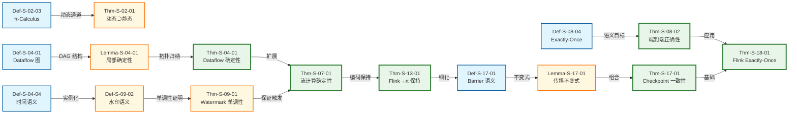

<!-- AI Translation Template - Replace <!-- TRANSLATE --> markers with actual translation -->

<!-- TRANSLATE: # Struct/ 推导链全景图 -->

<!-- TRANSLATE: > 所属阶段: Struct | 前置依赖: [00-INDEX.md](./00-INDEX.md) | 形式化等级: L3-L5 -->

<!-- TRANSLATE: ## 摘要 -->

<!-- TRANSLATE: 本文档系统梳理 Struct 目录内 43 篇文档、190 个定理与 402 个定义之间的完整推导关系网络。通过可视化推导链，揭示从基础定义到高级证明的逻辑演进路径，为理论研究者提供导航地图。 -->


<!-- TRANSLATE: ## 1. Foundation → Properties 推导 -->

<!-- TRANSLATE: ### 1.1 进程演算基础到确定性性质 -->

<!-- TRANSLATE: **推导链 1：进程确定性 → 流确定性** -->

```
Def-S-02-01 (CCS - 通信系统演算)
    ↓ 扩展
Def-S-02-02 (CSP - 通信顺序进程)
    ↓ 扩展
Def-S-02-03 (π-Calculus - 通道移动性)
    ↓ 导出
Prop-S-02-01 (对偶性蕴含通信兼容)
    ↓ 导出
Prop-S-02-02 (有限控制静态演算的可判定性)
    ↓ 导出
Def-S-07-01 (确定性流处理系统)
    ↓ 导出
Thm-S-07-01 (流计算确定性定理)
```

<!-- TRANSLATE: **Def-S-D-01**: 进程演算确定性到流处理确定性的推导关系 -->

<!-- TRANSLATE: > 进程演算的汇合性（confluence）性质为流计算确定性提供了理论基础。CCS 的标签迁移系统保证了局部确定性，CSP 的同步通信消除了竞争条件，π-演算的动态通道则为流重配置提供了形式化框架。 -->


<!-- TRANSLATE: ### 1.3 定义→性质推导表 -->

<!-- TRANSLATE: | 定义 | 导出性质 | 推导依据 | 形式化等级 | -->
<!-- TRANSLATE: |------|---------|----------|------------| -->
<!-- TRANSLATE: | Def-S-02-01 (CCS) | Prop-S-02-01 (对偶性兼容) | 标签互补性→通信兼容性 | L3 | -->
<!-- TRANSLATE: | Def-S-02-02 (CSP) | Prop-S-02-02 (静态演算可判定性) | 有限控制结构→模型可检验 | L3 | -->
<!-- TRANSLATE: | Def-S-04-01 (Dataflow 图) | Lemma-S-04-01 (局部确定性) | DAG 结构→无环依赖 | L4 | -->
<!-- TRANSLATE: | Def-S-04-02 (算子语义) | Lemma-S-04-02 (Watermark 单调性) | 纯函数→时间单调 | L4 | -->
<!-- TRANSLATE: | Def-S-04-04 (时间语义) | Def-S-09-02 (水印语义) | 事件时间→进度信标 | L4 | -->
<!-- TRANSLATE: | Def-S-07-01 (确定性系统) | Thm-S-07-01 (流计算确定性) | 六元组约束→输出唯一 | L5 | -->


<!-- TRANSLATE: ### 2.2 一致性层级到编码关系 -->

<!-- TRANSLATE: **推导链 4：一致性层级到 Flink 编码** -->

```
Def-S-08-02 (At-Most-Once 语义)
Def-S-08-03 (At-Least-Once 语义)
Def-S-08-04 (Exactly-Once 语义)
    ↓ 组合
Thm-S-08-01 (Exactly-Once 网络分区必要条件)
    ↓ 应用
Thm-S-08-02 (端到端 Exactly-Once 正确性)
    ↓ 编码
Def-S-13-01 (Flink 算子到 π-演算编码)
    ↓ 保持证明
Thm-S-13-01 (Flink→π Exactly-Once 保持定理)
```

<!-- TRANSLATE: **Def-S-D-04**: 一致性层级到 Flink 编码的推导关系 -->

<!-- TRANSLATE: > 一致性层级的蕴含链（Lemma-S-08-01/02）为 Exactly-Once 编码提供了充分条件：可重放 Source + 内部一致性 + 事务性 Sink = 端到端 Exactly-Once。 -->


<!-- TRANSLATE: ## 3. Relationships → Proofs 推导 -->

<!-- TRANSLATE: ### 3.1 Flink 编码到 Checkpoint 正确性 -->

<!-- TRANSLATE: **推导链 5：编码关系到正确性证明** -->

```
Thm-S-13-01 (Flink→π Exactly-Once 保持)
    ↓ 细化
Def-S-13-03 (Checkpoint→屏障同步编码)
    ↓ 形式化
Def-S-17-01 (Checkpoint Barrier 语义)
    ↓ 导出
Lemma-S-17-01 (Barrier 传播不变式)
Lemma-S-17-02 (状态一致性引理)
    ↓ 组合
Thm-S-17-01 (Flink Checkpoint 一致性定理)
```

<!-- TRANSLATE: **Def-S-D-05**: Flink 编码到 Checkpoint 正确性的推导关系 -->

<!-- TRANSLATE: > 将 Flink Checkpoint 编码为屏障同步协议（Def-S-13-03），使得 Chandy-Lamport 分布式快照理论可应用于 Flink 正确性证明。Barrier 传播不变式保证了快照的一致性割集。 -->


<!-- TRANSLATE: ### 3.3 定理→证明应用表 -->

<!-- TRANSLATE: | 关系定理 | 应用于证明 | 应用领域 | 依赖引理 | -->
<!-- TRANSLATE: |----------|-----------|----------|----------| -->
<!-- TRANSLATE: | Thm-S-13-01 (Flink→π 保持) | Thm-S-17-01 (Checkpoint 正确性) | 容错机制 | Lemma-S-17-01/02 | -->
<!-- TRANSLATE: | Thm-S-17-01 (Checkpoint 一致性) | Thm-S-18-01 (Exactly-Once) | 端到端一致性 | Lemma-S-18-01/02/03 | -->
<!-- TRANSLATE: | Thm-S-08-02 (端到端正确性) | Thm-S-18-01 (Flink Exactly-Once) | 系统验证 | Def-S-18-01/03 | -->
<!-- TRANSLATE: | Thm-S-07-01 (流计算确定性) | Thm-S-26-02 (Actor 编码非完备性) | 表达能力 | Def-S-12-01 | -->


<!-- TRANSLATE: ### 4.2 核心推导路径图 -->



<!-- TRANSLATE: **图说明**：本图突出显示从进程演算到 Flink Exactly-Once 证明的核心推导路径。绿色粗边框节点为核心定理，黄色节点为关键引理，蓝色节点为基础定义。 -->


<!-- TRANSLATE: ## 5. 推导关系定义索引 -->

<!-- TRANSLATE: ### Def-S-D-XX: 推导关系定义汇总 -->

<!-- TRANSLATE: | 编号 | 名称 | 描述 | 涉及的元素 | -->
<!-- TRANSLATE: |------|------|------|------------| -->
<!-- TRANSLATE: | Def-S-D-01 | 进程→流确定性推导 | 进程演算汇合性到流计算确定性的映射关系 | Def-S-02-XX → Thm-S-07-01 | -->
<!-- TRANSLATE: | Def-S-D-02 | Dataflow→Watermark 推导 | Dataflow 模型到 Watermark 单调性的细化链 | Def-S-04-XX → Thm-S-09-01 | -->
<!-- TRANSLATE: | Def-S-D-03 | 确定性→编码推导 | 确定性定理组合到模型编码关系的建立 | Thm-S-07-01 → Thm-S-12-01 | -->
<!-- TRANSLATE: | Def-S-D-04 | 一致性→Flink 推导 | 一致性层级到 Flink 编码的推导路径 | Def-S-08-XX → Thm-S-13-01 | -->
<!-- TRANSLATE: | Def-S-D-05 | 编码→Checkpoint 推导 | Flink 编码关系到 Checkpoint 正确性证明 | Thm-S-13-01 → Thm-S-17-01 | -->
<!-- TRANSLATE: | Def-S-D-06 | Checkpoint→EO 推导 | Checkpoint 一致性到端到端 Exactly-Once 的推论 | Thm-S-17-01 → Thm-S-18-01 | -->


<!-- TRANSLATE: ## 7. 引用参考 -->

