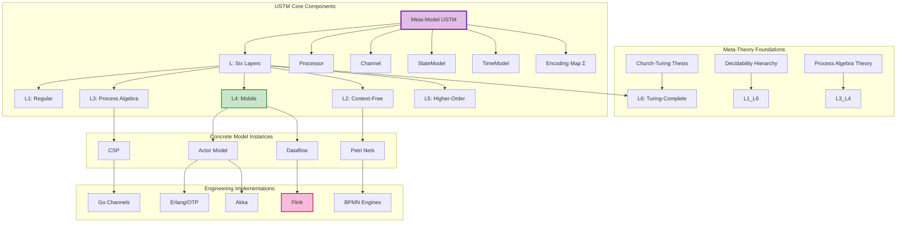
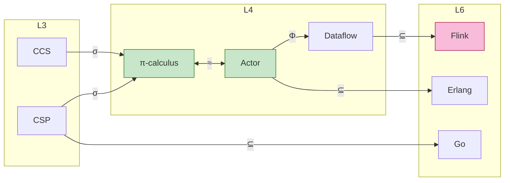

# Unified Streaming Theory

> Stage: Struct | Prerequisites: [Related Documents] | Formality Level: L3

> **Document Positioning**: The unified meta-model of stream computing formal theory, integrating the four paradigms of Actor, CSP, Dataflow, and Petri Nets
> **Formality Level**: L6 (Turing-Complete) | **Prerequisites**: None (foundational layer)
> **Version**: 2026.04

---

## Table of Contents

- [Unified Streaming Theory](#unified-streaming-theory)
  - [Table of Contents](#table-of-contents)
  - [1. Definitions](#1-definitions)
    - [1.1 Core Meta-Model Definitions](#11-core-meta-model-definitions)
    - [1.2 Six-Layer Expressiveness Hierarchy](#12-six-layer-expressiveness-hierarchy)
    - [1.3 Processor Formalization](#13-processor-formalization)
    - [1.4 Channel Formalization](#14-channel-formalization)
    - [1.5 Time Model Formalization](#15-time-model-formalization)
    - [1.6 Consistency Model Formalization](#16-consistency-model-formalization)
    - [1.7 Unified Concurrent Model Representation (UCM)](#17-unified-concurrent-model-representation-ucm)
  - [2. Properties](#2-properties)
    - [2.1 Meta-Model Consistency Guarantees](#21-meta-model-consistency-guarantees)
    - [2.2 Transitivity of Mappings](#22-transitivity-of-mappings)
    - [2.3 Complete Lattice Structure](#23-complete-lattice-structure)
    - [2.4 Partial Order of Time Models](#24-partial-order-of-time-models)
  - [3. Relations](#3-relations)
    - [3.1 Expressiveness Relations Among Models](#31-expressiveness-relations-among-models)
    - [3.2 Model-to-Implementation Mappings](#32-model-to-implementation-mappings)
    - [3.3 Cross-Layer Inference Relations](#33-cross-layer-inference-relations)
  - [4. Argumentation](#4-argumentation)
    - [4.1 Completeness Argument for the Unified Meta-Theory](#41-completeness-argument-for-the-unified-meta-theory)
    - [4.2 Strictness Argument for the Six Layers](#42-strictness-argument-for-the-six-layers)
    - [4.3 Boundary Argument for Stream Computing Determinism](#43-boundary-argument-for-stream-computing-determinism)
  - [5. Proofs](#5-proofs)
    - [Theorem 5.1 (Compositionality of Unified Streaming Systems)](#theorem-51-compositionality-of-unified-streaming-systems)
    - [Theorem 5.2 (Expressiveness Hierarchy Decision)](#theorem-52-expressiveness-hierarchy-decision)
  - [6. Examples](#6-examples)
    - [6.1 Flink as a USTM Instance](#61-flink-as-a-ustm-instance)
    - [6.2 Actor System Mapping](#62-actor-system-mapping)
  - [7. Visualizations](#7-visualizations)
    - [Figure 7.1 USTM Concept Dependency Graph](#figure-71-ustm-concept-dependency-graph)
    - [Figure 7.2 Inter-Model Encoding Relation Graph](#figure-72-inter-model-encoding-relation-graph)
  - [8. References](#8-references)
  - [Related Documents](#related-documents)

## 1. Definitions

### 1.1 Core Meta-Model Definitions

**Def-S-01-01 (Unified Streaming Meta-Model USTM)**.

$$
\text{USTM} ::= (\mathcal{L}, \mathcal{M}, \mathcal{P}, \mathcal{C}, \mathcal{S}, \mathcal{T}, \Sigma, \Phi)
$$

| Component | Type | Semantics |
|-----------|------|-----------|
| $\mathcal{L}$ | $\{L_1, L_2, L_3, L_4, L_5, L_6\}$ | Six-layer expressiveness hierarchy (see Def-S-01-02) |
| $\mathcal{M}$ | $\text{Set}(\text{MetaModel})$ | Meta-model set: Actor, CSP, Dataflow, Petri |
| $\mathcal{P}$ | $\text{Set}(\text{Processor})$ | Processor / process set |
| $\mathcal{C}$ | $\text{Set}(\text{Channel})$ | Channel / connection set |
| $\mathcal{S}$ | $\text{StateModel}$ | State model |
| $\mathcal{T}$ | $\text{TimeModel}$ | Time model |
| $\Sigma$ | $\text{EncodingMap}$ | Family of inter-model encoding mappings |
| $\Phi$ | $\text{PropertyMap}$ | Property-preserving mappings |

**System Invariants**:

$$
\begin{aligned}
&\text{(I1) Topological Closure}: &&\forall p \in \mathcal{P}. \; \text{inputs}(p) \cup \text{outputs}(p) \subseteq \mathcal{C} \\
&\text{(I2) Channel Endpoints}: &&\forall c \in \mathcal{C}. \; |\text{src}(c)| = 1 \land |\text{dst}(c)| \geq 1 \\
&\text{(I3) State Ownership}: &&\forall s \in \mathcal{S}. \; \exists! p \in \mathcal{P}. \; \text{owner}(s) = p
\end{aligned}
$$

---

### 1.2 Six-Layer Expressiveness Hierarchy

**Def-S-01-02 (Expressiveness Hierarchy $\mathcal{L}$)**.

$$
L_1 \subset L_2 \subset L_3 \subset L_4 \subset L_5 \subseteq L_6
$$

| Layer | Name | Formal Model | Expressiveness | Decidability | Typical System |
|-------|------|--------------|----------------|--------------|----------------|
| $L_1$ | Regular | FSM, Regular Expressions | Regular Languages | P-complete | Finite-State Workflows |
| $L_2$ | Context-Free | PDA, Basic Petri Nets | Context-Free | PSPACE-complete | Basic Workflow Engines |
| $L_3$ | Process Algebra | CSP, CCS, ACP | Static-Name Communication | EXPTIME | FDR, Go Channels |
| $L_4$ | Mobile | $\pi$-calculus, Actor, Dataflow | Dynamic Topology | Partially Decidable | Erlang, Akka, Flink |
| $L_5$ | Higher-Order | HO-$\pi$, Ambient | Processes as Data | Mostly Undecidable | Advanced Mobile Agents |
| $L_6$ | Turing-Complete | $\lambda$-calculus, Turing Machine | All Computable | Undecidable | Go, Scala, General-Purpose Languages |

**Hierarchy Inclusion Theorem**:

$$
\forall i < j. \; L_i \subset L_j \; \text{(strict inclusion)}
$$

---

### 1.3 Processor Formalization

**Def-S-01-03 (Processor)**.

$$
\text{Processor} ::= (\mathcal{I}, \mathcal{O}, \mathcal{F}, \mathcal{A}, \sigma)
$$

Where:

| Component | Type | Semantics |
|-----------|------|-----------|
| $\mathcal{I}$ | $\text{Set}(\text{InputPort})$ | Input port set |
| $\mathcal{O}$ | $\text{Set}(\text{OutputPort})$ | Output port set |
| $\mathcal{F}$ | $\text{Computation}$ | Computation function $\mathcal{I}^* \times \mathcal{S} \rightarrow \mathcal{O}^* \times \mathcal{S} \times \text{Effect}^*$ |
| $\mathcal{A}$ | $\text{StateAccessPattern}$ | State access pattern: ReadOnly \| ReadWrite \| Accumulate |
| $\sigma$ | $\text{State}$ | Processor-private state |

**Processor Classification**:

```
Processor
├── StatelessProcessor
│   └── F: I → O (pure function)
├── StatefulProcessor
│   ├── KeyedProcessor (key-partitioned)
│   │   └── F: (K, V) × State[K] → State[K] × O
│   └── OperatorProcessor (operator-level)
│       └── F: I × State → State × O
└── BoundaryProcessor
    ├── SourceProcessor (no input)
    └── SinkProcessor (no output)
```

---

### 1.4 Channel Formalization

**Def-S-01-04 (Channel)**.

$$
\text{Channel} ::= (\mathcal{B}, \mathcal{O}, \mathcal{D}, \tau)
$$

Where:

| Component | Type | Semantics |
|-----------|------|-----------|
| $\mathcal{B}$ | $\text{Buffer}(T, \text{Capacity})$ | Buffer queue |
| $\mathcal{O}$ | $\text{Ordering}$ | Ordering guarantee: FIFO \| Ordered(K) \| Unordered |
| $\mathcal{D}$ | $\text{DeliveryGuarantee}$ | Delivery guarantee: AtMostOnce \| AtLeastOnce \| ExactlyOnce |
| $\tau$ | $\text{Transport}$ | Transport mechanism: Memory \| Network \| File |

**Channel Type Correspondence**:

| System | Buffer | Ordering | Delivery |
|--------|--------|----------|----------|
| **Flink** | Bounded Network Buffer | FIFO (per partition) | ExactlyOnce (with Checkpoint) |
| **Akka** | Bounded/Unbounded Mailbox | FIFO | AtMostOnce |
| **Go** | Bounded Channel | FIFO | AtMostOnce (synchronous) |
| **KPN** | Unbounded FIFO | FIFO | ExactlyOnce (theoretical) |

---

### 1.5 Time Model Formalization

**Def-S-01-05 (TimeModel)**.

$$
\text{TimeModel} ::= \text{EventTime}(t_e) \mid \text{ProcessingTime}(t_p) \mid \text{IngestionTime}(t_i)
$$

| Type | Definition | Formalization |
|------|------------|---------------|
| **EventTime** | Data generation time | $t_e: \text{Record} \rightarrow \text{Timestamp}$ |
| **ProcessingTime** | Processing execution time | $t_p: () \rightarrow \text{Timestamp}_{wall}$ |
| **IngestionTime** | System entry time | $t_i: \text{Record} \rightarrow \text{Timestamp}_{system}$ |

**Watermark Formalization**:

$$
\text{Watermark}(t_w) ::= \forall e \in \text{Stream}. \; t_e(e) \leq t_w \lor \text{late}(e)
$$

**Time Window Types**:

| Window Type | Definition | Trigger Condition |
|-------------|------------|-------------------|
| Tumbling($\delta$) | $[n\delta, (n+1)\delta)$ | Watermark $\geq (n+1)\delta$ |
| Sliding($\delta$, slide) | $[n \cdot \text{slide}, n \cdot \text{slide} + \delta)$ | Watermark $\geq$ window end |
| Session(gap) | Dynamic, defined by activity gap | Inactivity exceeds gap |

---

### 1.6 Consistency Model Formalization

**Def-S-01-06 (Consistency Model)**.

$$
\text{Consistency} ::= \text{AtMostOnce} \mid \text{AtLeastOnce} \mid \text{ExactlyOnce}
$$

**End-to-End Consistency Hierarchy**:

$$
\text{ExactlyOnce} \supset \text{AtLeastOnce} \supset \text{AtMostOnce}
$$

| Level | Semantics | Implementation Mechanism |
|-------|-----------|--------------------------|
| **ExactlyOnce** | Each record affects system state exactly once | Checkpoint + 2PC / Idempotent Sink |
| **AtLeastOnce** | Record processed at least once, may duplicate | Checkpoint + Replay |
| **AtMostOnce** | Record processed at most once, may drop | No fault tolerance, discard on failure |

---

### 1.7 Unified Concurrent Model Representation (UCM)

**Def-S-01-07 (UCM — Unified Concurrent Model)**.

$$
\text{UCM} = (S, A, C, T, \delta, \iota, \omega)
$$

Where:

| Component | Type | Semantics |
|-----------|------|-----------|
| $S$ | $\text{StateSpace}$ | State space |
| $A$ | $\text{Set}(\text{Actor/Process})$ | Actor / process set |
| $C$ | $\text{Set}(\text{Channel})$ | Communication channel set |
| $T$ | $\text{Set}(\text{Transition})$ | Transition set |
| $\delta$ | $S \times T \rightarrow S$ | State transition function |
| $\iota$ | $A \times C \rightharpoonup A \times C$ | Interface / connection relation |
| $\omega$ | $T \rightarrow (\text{Guard} \times \text{Action})$ | Guard-action of transitions |

**UCM Specializations for Each Model**:

| Model | UCM Specialization |
|-------|--------------------|
| **Actor** | $C = A \times A$ (channels implicitly defined by actor address pairs), asynchronous communication, $\omega$ includes spawn operation |
| **CSP** | $C$ is a statically named set, $\iota$ statically connected at declaration, synchronous communication, $\omega$ includes external choice |
| **Dataflow** | $A$ = operator set, $C$ = directed edges, execution driven by data availability ($\omega$.Guard = tokens_ready) |
| **Petri Nets** | $A$ = transition set, $C$ = place set, $\iota$ = flow relation $F \subseteq (C \times A) \cup (A \times C)$ |

---

## 2. Properties

### 2.1 Meta-Model Consistency Guarantees

**Prop-S-01-01 (Consistency Preservation)**.

If MM satisfies consistency, then for any encoding chain $\sigma_{1n} = \sigma_{12} \circ \sigma_{23} \circ ... \circ \sigma_{(n-1)n}$, Consistency is preserved along the chain.

**Derivation**:

1. Individual encoding $\sigma_{ij}$ preserves consistency: $\text{Consistent}(M_i) \Rightarrow \text{Consistent}(\sigma_{ij}(M_i))$
2. Inductive application: $\text{Consistent}(M_1) \Rightarrow \text{Consistent}(M_n)$
3. Consistency is an invariant under encoding mappings

---

### 2.2 Transitivity of Mappings

**Prop-S-01-02 (Transitivity of Encodings)**.

For $L_i \leq L_j \leq L_k$, encoding mappings satisfy transitivity: $\sigma_{jk} \circ \sigma_{ij} = \sigma_{ik}$

**Derivation**:

Encoding mappings form a category: layers as objects, encodings as morphisms. Associativity is guaranteed by the transitivity of semantic equivalence.

---

### 2.3 Complete Lattice Structure

**Prop-S-01-03 (Complete Lattice)**.

$(\mathcal{L}, \leq)$ forms a complete lattice, where:

$$
\sqcup\{L_i\} = L_{\max(i)}, \quad \sqcap\{L_i\} = L_{\min(i)}
$$

**Derivation**:

$\mathcal{L}$ is a totally ordered set; any subset has a maximum and a minimum element.

---

### 2.4 Partial Order of Time Models

**Prop-S-01-04 (Timestamp Partial Order)**.

Event Time forms a total order on a single stream, and a partial order across multiple streams:

$$
\forall r_1, r_2 \in \text{SameStream}. \; t_e(r_1) < t_e(r_2) \lor t_e(r_2) < t_e(r_1) \lor t_e(r_1) = t_e(r_2)
$$

$$
\exists r_1 \in S_1, r_2 \in S_2. \; t_e(r_1) \nless t_e(r_2) \land t_e(r_2) \nless t_e(r_1) \land t_e(r_1) \neq t_e(r_2)
$$

---

## 3. Relations

### 3.1 Expressiveness Relations Among Models

| Relation | Source Model | Target Model | Encoding Complexity | Key Limitation |
|----------|--------------|--------------|---------------------|----------------|
| $\subset$ | CSP ($L_3$) | $\pi$-calculus ($L_4$) | $O(n)$ | CSP static channel name restriction |
| $\approx$ | Actor ($L_4$) | $\pi$-calculus ($L_4$) | $O(n)$ | Asynchronous semantic equivalence |
| $\subset$ | SDF | KPN | $O(1)$ | SDF static production-consumption rate |
| $\subset$ | KPN | Dataflow | $O(n)$ | KPN lacks explicit parallelism degree |
| $\subset$ | Dataflow | Flink | $O(n)$ | Dataflow lacks fault-tolerance semantics |
| $\approx$ | Actor | Dataflow (Keyed) | $O(n)$ | Single Actor $\equiv$ KeyedProcessor |

### 3.2 Model-to-Implementation Mappings

| Formal Model | Implementation Language | Relation | Mapping Description |
|--------------|------------------------|----------|---------------------|
| **CSP** | Go | $\subseteq$ | Go channels implement CSP synchronous subset, lacking external choice |
| **Actor** | Erlang | $\subseteq$ | Erlang implements Actor core + supervision tree extensions |
| **Actor** | Akka (Scala) | $\subseteq$ | Akka typed actors, DOT type system integration |
| **Dataflow** | Flink | $\supseteq$ | Flink extends Dataflow semantics, adds state management |

### 3.3 Cross-Layer Inference Relations

**Cross-Layer Inference Rule**:

$$
\frac{P \vdash \phi \quad \phi \text{ preserved upward} \quad L_i \leq L_j}{P \triangleright \phi@L_j}
$$

**Property Preservation Classification**:

| Property Type | Preserved Upward | Preserved Downward | Example |
|---------------|------------------|--------------------|---------|
| Safety | ✅ | ✅ | No data loss |
| Liveness | ❌ | ⚠️ | Eventually processed |
| Liveness + Fairness | ✅ | ⚠️ | Fair scheduling |
| Type Safety | ✅ | ✅ | Well-typed programs |

---

## 4. Argumentation

### 4.1 Completeness Argument for the Unified Meta-Theory

**Lemma-S-01-01 (USTM Completeness)**.

USTM covers the major formal models in the stream computing domain:

1. **Actor Model**: Through $\mathcal{P}$ (Processor) + asynchronous $\mathcal{C}$ (Channel) + dynamic creation semantics
2. **CSP**: Through synchronous $\mathcal{C}$ + static naming + external choice guards
3. **Dataflow**: Through data-driven triggering ($\omega$.Guard) + directed $\mathcal{C}$
4. **Petri Nets**: Through place/transition separation + token triggering mechanism

**Argument**: The UCM specializations of each model (Def-S-01-07) prove the expressiveness coverage of USTM.

---

### 4.2 Strictness Argument for the Six Layers

**Lemma-S-01-02 (Strict Layer Inclusion)**.

$L_i \subset L_{i+1}$ strictly holds for all $1 \leq i \leq 5$.

**Proof Sketch**:

| Layer Jump | Separation Evidence | Expressiveness Difference |
|------------|---------------------|---------------------------|
| $L_1 \rightarrow L_2$ | $\{a^n b^n\}$ language | Pushdown automaton vs. FSM |
| $L_2 \rightarrow L_3$ | Parallel composition $P \| Q$ | Interleaving semantics beyond context-free |
| $L_3 \rightarrow L_4$ | $(\nu a)$ name creation | Dynamic topology capability |
| $L_4 \rightarrow L_5$ | Process passed as data | Higher-order communication |
| $L_5 \rightarrow L_6$ | Universal computation | Turing completeness |

---

### 4.3 Boundary Argument for Stream Computing Determinism

**Lemma-S-01-03 (Determinism Condition)**.

A dataflow system $\mathcal{D}$ is deterministic if and only if:

1. All $\mathcal{F} \in \text{Processor}$ are pure functions (no external side effects)
2. All $\mathcal{C} \in \text{Channel}$ satisfy FIFO semantics
3. State access follows single-threaded / key-isolation principles

**Counterexample**: If condition 1 is violated (calling an external random number generator), the output is no longer unique.

---

## 5. Proofs

### Theorem 5.1 (Compositionality of Unified Streaming Systems)

**Theorem Statement**.

Let $\mathcal{S}_1 = (\mathcal{P}_1, \mathcal{C}_1, \mathcal{S}_1, \mathcal{T}_1)$ and $\mathcal{S}_2 = (\mathcal{P}_2, \mathcal{C}_2, \mathcal{S}_2, \mathcal{T}_2)$ be two stream computing systems satisfying USTM. If their interfaces are compatible:

$$
\forall c \in \mathcal{C}_1 \cap \mathcal{C}_2. \; \text{type}_1(c) = \text{type}_2(c)
$$

Then the composed system $\mathcal{S} = \mathcal{S}_1 \bowtie \mathcal{S}_2$ also satisfies USTM, and preserves the semantic invariance of each subsystem.

**Proof**:

**Step 1: Construct the Composed System**

$$
\mathcal{S} = (\mathcal{P}_1 \cup \mathcal{P}_2, \mathcal{C}_1 \cup \mathcal{C}_2, \mathcal{S}_1 \cup \mathcal{S}_2, \mathcal{T}_1 \cup \mathcal{T}_2)
$$

**Step 2: Verify System Invariants**

- (I1) Topological Closure: Interface compatibility guarantees channel endpoint consistency
- (I2) Channel Endpoints: Channels of each subsystem do not share source points (except interface channels, which are guaranteed by compatibility)
- (I3) State Ownership: State spaces are disjoint, ownership is unique

**Step 3: Prove Semantic Invariance**

Consider any execution trace $\pi_1$ of $\mathcal{S}_1$. In the composed system, inputs to $\mathcal{P}_1$ come only from:

- Internal connections within $\mathcal{C}_1$ (unchanged)
- Interface channels with $\mathcal{S}_2$ (semantic consistency guaranteed by compatibility)

Therefore $\pi_1$ maintains observational equivalence in the composed system.

**Step 4: Type Safety**

Interface compatibility guarantees type consistency of cross-system messages, eliminating decode errors.

**Conclusion**: $\mathcal{S}$ satisfies USTM, and the semantic invariance of $\mathcal{S}_1$ and $\mathcal{S}_2$ is preserved. ∎

---

### Theorem 5.2 (Expressiveness Hierarchy Decision)

**Theorem Statement**.

For any stream computing system $\mathcal{S}$, its expressiveness level $L(\mathcal{S})$ is decidable, and satisfies:

$$
L(\mathcal{S}) = \min \{L_i \mid \exists \sigma: \mathcal{S} \rightarrow L_i\}
$$

**Proof Sketch**:

1. Check whether $\mathcal{S}$ contains Turing-complete features (infinite storage + conditional branching + loops) → $L_6$
2. Otherwise check higher-order communication features → $L_5$
3. Otherwise check dynamic topology change capability → $L_4$
4. Otherwise check static-name communication → $L_3$
5. Otherwise check context-free features → $L_2$
6. Otherwise it is finite-state → $L_1$

Each decision step can be completed by syntactic analysis. ∎

---

## 6. Examples

### 6.1 Flink as a USTM Instance

**Flink System Mapping to USTM**:

| USTM Component | Flink Implementation |
|----------------|----------------------|
| $\mathcal{P}$ | Task (Operator instance) |
| $\mathcal{C}$ | Network Buffer (bounded FIFO) |
| $\mathcal{S}$ | KeyedState / OperatorState |
| $\mathcal{T}$ | EventTime + Watermark |
| $\mathcal{F}$ | User-defined Function |
| Consistency | ExactlyOnce (Checkpoint + 2PC) |

**Verification**: Flink satisfies all USTM invariants.

### 6.2 Actor System Mapping

**Akka Actor Mapping to USTM**:

| USTM Component | Akka Implementation |
|----------------|---------------------|
| $\mathcal{P}$ | Actor instance |
| $\mathcal{C}$ | Mailbox (bounded/unbounded queue) |
| $\mathcal{S}$ | Actor internal variables |
| $\mathcal{T}$ | No built-in time model |
| $\mathcal{F}$ | receive method (Behavior) |
| Consistency | AtMostOnce (default) |

---

## 7. Visualizations

### Figure 7.1 USTM Concept Dependency Graph

The following diagram illustrates the hierarchical structure of the Unified Streaming Theory Meta-model, from foundational computability theory through concrete engineering implementations.



### Figure 7.2 Inter-Model Encoding Relation Graph

The following diagram shows the encoding relationships among formal models at different expressiveness layers.



---

## 8. References


---

## Related Documents

- [01.02-process-calculus-primer-en.md](./01.02-process-calculus-primer-en.md) — Process Calculus Primer
- [01.03-actor-model-formalization-en.md](./01.03-actor-model-formalization-en.md) — Actor Model Formalization
- [01.04-dataflow-model-formalization-en.md](./01.04-dataflow-model-formalization-en.md) — Dataflow Model Formalization
- [01.05-csp-formalization-en.md](./01.05-csp-formalization-en.md) — CSP Formalization
- [01.06-petri-net-formalization-en.md](./01.06-petri-net-formalization-en.md) — Petri Net Formalization
- [../02-properties/02.01-determinism-in-streaming-en.md](../02-properties/02.01-determinism-in-streaming-en.md) — Determinism in Streaming

---

*Document Version: v1.0 | Created: 2026-04-20 | Formality Level: L6 | Status: Core Skeleton*
