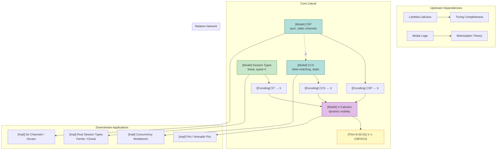

# Process Calculus Primer

> **Stage**: Struct | **Prerequisites**: [AGENTS.md](../../AGENTS.md) | **Formalization Level**: L3-L4

## Table of Contents

- [Process Calculus Primer](#process-calculus-primer)
  - [Table of Contents](#table-of-contents)
  - [1. Definitions](#1-definitions)
    - [Def-S-02-01. CCS (Calculus of Communicating Systems)](#def-s-02-01-ccs-calculus-of-communicating-systems)
    - [Def-S-02-02. CSP (Communicating Sequential Processes)](#def-s-02-02-csp-communicating-sequential-processes)
    - [Def-S-02-03. π-Calculus](#def-s-02-03-π-calculus)
    - [Def-S-02-04. Binary Session Types](#def-s-02-04-binary-session-types)
  - [2. Properties](#2-properties)
    - [Lemma-S-02-01. Topological Invariance of Static Channel Models](#lemma-s-02-01-topological-invariance-of-static-channel-models)
    - [Lemma-S-02-02. Turing Completeness of Dynamic Channel Calculi](#lemma-s-02-02-turing-completeness-of-dynamic-channel-calculi)
    - [Prop-S-02-01. Duality Implies Communication Compatibility](#prop-s-02-01-duality-implies-communication-compatibility)
    - [Prop-S-02-02. Decidability of Finite-Control Static Calculi](#prop-s-02-02-decidability-of-finite-control-static-calculi)
  - [3. Relations](#3-relations)
    - [Relation 1: CSP $\\perp$ CCS (Semantically Incomparable)](#relation-1-csp-perp-ccs-semantically-incomparable)
    - [Relation 2: CCS $\\subset$ π-Calculus (Strict Inclusion)](#relation-2-ccs-subset-π-calculus-strict-inclusion)
    - [Relation 3: CSP $\\subset$ π-Calculus (Weaker Expressiveness)](#relation-3-csp-subset-π-calculus-weaker-expressiveness)
    - [Relation 4: Session Types $\\subset$ π-Calculus (Typed Subset)](#relation-4-session-types-subset-π-calculus-typed-subset)
  - [4. Argumentation](#4-argumentation)
    - [Argument 1: Why CSP and CCS Are Semantically Incomparable](#argument-1-why-csp-and-ccs-are-semantically-incomparable)
    - [Argument 2: Why Dynamic Channels Strictly Enhance Expressiveness](#argument-2-why-dynamic-channels-strictly-enhance-expressiveness)
    - [Argument 3: Session Types as a Disciplined Subset of π-Calculus](#argument-3-session-types-as-a-disciplined-subset-of-π-calculus)
  - [5. Proofs](#5-proofs)
    - [Thm-S-02-01. Dynamic Channel Calculus Strictly Contains Static Channel Calculus](#thm-s-02-01-dynamic-channel-calculus-strictly-contains-static-channel-calculus)
    - [Cor-S-02-01. Well-Typed Session Processes Are Deadlock-Free](#cor-s-02-01-well-typed-session-processes-are-deadlock-free)
  - [6. Examples](#6-examples)
    - [Example 1: Dynamic Topology Changes in π-Calculus](#example-1-dynamic-topology-changes-in-π-calculus)
    - [Example 2: CSP Synchronous Handshake](#example-2-csp-synchronous-handshake)
    - [Example 3: Binary Session Type Protocol](#example-3-binary-session-type-protocol)
    - [Counterexample 1: Violating Session Type Protocols Leads to Deadlock](#counterexample-1-violating-session-type-protocols-leads-to-deadlock)
    - [Counterexample 2: π-Mobility Encoding Fails in CSP](#counterexample-2-π-mobility-encoding-fails-in-csp)
  - [7. Visualizations](#7-visualizations)
  - [8. References](#8-references)

## 1. Definitions

### Def-S-02-01. CCS (Calculus of Communicating Systems)

CCS, proposed by Milner in 1980, is a process algebra based on labeled synchronization, providing the syntactic and semantic foundation for the subsequent development of π-calculus [^1].

**Syntax**:

$$
\begin{aligned}
P, Q ::= &\ 0 \quad \text{(null process / termination)} \\
       |\ &\ \alpha.P \quad \text{(prefix, $\alpha \in \mathcal{A} = \mathcal{N} \cup \bar{\mathcal{N}} \cup \{\tau\}$)} \\
       |\ &\ P + Q \quad \text{(nondeterministic choice)} \\
       |\ &\ P \mid Q \quad \text{(parallel composition)} \\
       |\ &\ P \setminus L \quad \text{(restriction / hiding, $L \subseteq \mathcal{N}$)} \\
       |\ &\ P[f] \quad \text{(relabeling, $f: \mathcal{A} \to \mathcal{A}$)} \\
       |\ &\ \mu X.P \quad \text{(recursion)}
\end{aligned}
$$

Where $\mathcal{N}$ is a countably infinite set of names, $\bar{\mathcal{N}} = \{\bar{a} \mid a \in \mathcal{N}\}$ is its co-name set, and $\tau$ is the internal unobservable action.

**Structural Operational Semantics (SOS)**:

```
                α.P ──α──► P                        [Act]

        P ──α──► P'                                   [Sum-L]
        ─────────────────
        P + Q ──α──► P'

        Q ──α──► Q'                                   [Sum-R]
        ─────────────────
        P + Q ──α──► Q'

        P ──α──► P'                                   [Par-L]
        ─────────────────
        P | Q ──α──► P' | Q

        Q ──α──► Q'                                   [Par-R]
        ─────────────────
        P | Q ──α──► P | Q'

        P ──a──► P'     Q ──ā──► Q'                   [Com]
        ────────────────────────────
             P | Q ──τ──► P' | Q'

        P ──α──► P'    α,ᾱ ∉ L                        [Res]
        ─────────────────────────
         P \ L ──α──► P' \ L

        P ──α──► P'                                   [Rel]
        ─────────────────────
        P[f] ──f(α)──► P'[f]

        P[rec x.P / x] ──α──► P'                      [Rec]
        ─────────────────────────
           rec x.P ──α──► P'
```

**Intuitive Explanation**: CCS abstracts concurrent processes as entities that communicate via complementary names ($a$ and $\bar{a}$), producing an internal action $\tau$ upon successful handshake. The null process $0$ provides the termination baseline; the prefix operator guarantees prefix closure of behavior; the restriction operator $\setminus L$ localizes external actions — this is the formal foundation of modularity and information hiding.

**Motivation for the Definition**: If the result of communication is not explicitly modeled as $\tau$, then internal negotiation cannot be distinguished from externally visible behavior, preventing subsequent abstraction and refinement. The introduction of SOS gives CCS an executable mathematical model, providing a directly verifiable transition relation for bisimulation equivalence. Without SOS, bisimulation would lack a concrete basis for comparison.

---

### Def-S-02-02. CSP (Communicating Sequential Processes)

CSP, proposed by Hoare in 1985, is a process algebra based on synchronous communication and static event names, emphasizing formal verification through refinement relations [^3].

**Syntax**:

$$
\begin{aligned}
P, Q ::= &\ \text{STOP} \quad \text{(deadlock)} \\
       |\ &\ \text{SKIP} \quad \text{(successful termination)} \\
       |\ &\ a \to P \quad \text{(prefix action, $a \in \Sigma$)} \\
       |\ &\ P \mathbin{\square} Q \quad \text{(external choice — environment decides)} \\
       |\ &\ P \mathbin{\sqcap} Q \quad \text{(internal choice — nondeterministic)} \\
       |\ &\ P \mathbin{|||} Q \quad \text{(interleaving parallelism)} \\
       |\ &\ P \mathbin{\parallel_A} Q \quad \text{(synchronous parallelism, synchronize on event set $A$)} \\
       |\ &\ P \setminus A \quad \text{(hiding — internalize events in $A$ as $\tau$)} \\
       |\ &\ P; Q \quad \text{(sequential composition)} \\
       |\ &\ \mu X.F(X) \quad \text{(recursion)}
\end{aligned}
$$

**Semantic Domains**:

- $\text{traces}(P)$: Trace semantics — the set of all possible action sequences.
- $\text{failures}(P)$: Failure semantics — pairs $(s, X)$ where $s \in \text{traces}(P)$ and $X$ is the set of events the process may refuse after trace $s$.
- $\text{divergences}(P)$: Divergence semantics — the set of divergent traces.

**Core SOS Rules**:

```
         P ─a→ P'         Q ─a→ Q'
[SYNC] ──────────────────────────────────────────────
        P |[A]| Q ─a→ P' |[A]| Q'        (a ∈ A)

         P ─a→ P'        a ∉ A
[HIDE] ──────────────────────────────────────────────
          P \ A ─τ→ P' \ A

         P ─a→ P'
[EXT-L] ──────────────────────────────────────────────
         P □ Q ─a→ P'

         P ─τ→ P'
[INT-TAU] ────────────────────────────────────────────
           P ⊓ Q ─τ→ P'
```

**Intuitive Explanation**: CSP is a process algebra based on **synchronous communication** and **static event names**. Processes communicate via handshake over predefined event sets. External choice $\square$ allows the environment to decide which branch to take, while internal choice $\sqcap$ embodies nondeterminism. The distinction between successful termination $\text{SKIP}$ and deadlock $\text{STOP}$ enables CSP to model process lifecycles precisely.

**Motivation for the Definition**: If channels/events were not restricted to static naming, the communication topology between processes could not be determined at compile time, losing the feasibility of model checking. CSP's static naming design enables tools like FDR to perform exhaustive verification on finite-state subsets, which is the foundation of industrial-grade formal verification [^3].

---

### Def-S-02-03. π-Calculus

The π-calculus, formally introduced by Milner et al. in 1992, is a process algebra supporting **name passing** (mobility), hailed as "the lambda calculus of concurrent theory" [^2][^6].

**Syntax**:

$$
\begin{aligned}
P, Q ::= &\ 0 \quad \text{(null process)} \\
       |\ &\ a(x).P \quad \text{(input prefix — binds name $x$)} \\
       |\ &\ \bar{a}\langle b \rangle.P \quad \text{(output prefix — sends name $b$)} \\
       |\ &\ \tau.P \quad \text{(internal action)} \\
       |\ &\ P + Q \quad \text{(nondeterministic choice)} \\
       |\ &\ P \mid Q \quad \text{(parallel composition)} \\
       |\ &\ (\nu a)P \quad \text{(restriction / new name creation)} \\
       |\ &\ !P \quad \text{(replication — infinite copies)} \\
       |\ &\ [a = b]P \quad \text{(match guard)}
\end{aligned}
$$

**Structural Congruence** $\equiv$:

- $P \mid Q \equiv Q \mid P$ (commutativity)
- $(P \mid Q) \mid R \equiv P \mid (Q \mid R)$ (associativity)
- $P \mid 0 \equiv P$ (identity)
- $(\nu a)(\nu b)P \equiv (\nu b)(\nu a)P$ (restriction commutation)
- $(\nu a)0 \equiv 0$ (restriction of null process)
- $(\nu a)(P \mid Q) \equiv P \mid (\nu a)Q$ if $a \notin \text{fn}(P)$ (scope extrusion)

**Core SOS Rules**:

```
              P{y/x} ──→ P'{y/x}
[COMM] ───────────────────────────────────────────────
        a(x).P | ā⟨y⟩.Q ─τ──► P{y/x} | Q

               P ─α──► P'
[PAR] ────────────────────────────────────────────────
        P | Q ─α──► P' | Q

               P ─α──► P'       α ≠ a, ā
[RES] ────────────────────────────────────────────────
        (νa)P ─α──► (νa)P'

               P ≡ P' ─α──► Q' ≡ Q
[STRUCT] ─────────────────────────────────────────────
               P ─α──► Q
```

**Intuitive Explanation**: The core innovation of π-calculus is that channels themselves can be passed as messages. Through $(\nu a)$ creating new names at runtime and $\bar{a}\langle b \rangle$ sending them to other processes, the system can dynamically reconfigure its communication topology at execution time. The Scope Extrusion rule in structural congruence allows the scope of private channels to safely expand along with message passing.

**Motivation for the Definition**: Traditional process algebras (CSP/CCS) have fixed communication topologies at the syntactic level, unable to describe scenarios in distributed systems where connections are dynamically established (e.g., service discovery, P2P networks). The π-calculus was the first to formalize "mobility" within process algebra, achieving Turing completeness and the ability to express any computable function [^2].

---

### Def-S-02-04. Binary Session Types

Session types, proposed by Honda in 1993, type-check session protocols themselves, enabling compilers to verify whether communicating parties "speak the same language" before code execution [^4][^5].

**Syntax**:

$$
\begin{aligned}
S, T ::= &\ !U.S \quad \text{(output value type $U$, continue session $S$)} \\
       |\ &\ ?U.S \quad \text{(input value type $U$, continue session $S$)} \\
       |\ &\ \oplus\{l_1:S_1, \dots, l_n:S_n\} \quad \text{(internal choice — send label $l_i$, continue $S_i$)} \\
       |\ &\ \&\{l_1:S_1, \dots, l_n:S_n\} \quad \text{(external branch — receive label $l_i$, continue $S_i$)} \\
       |\ &\ \mu t.S \quad \text{(recursive type)} \\
       |\ &\ t \quad \text{(type variable)} \\
       |\ &\ \text{end} \quad \text{(session termination)}
\end{aligned}
$$

**Duality Function $\overline{S}$**:

$$
\begin{aligned}
\overline{!U.S} &=\ ?U.\overline{S} \\
\overline{?U.S} &=\ !U.\overline{S} \\
\overline{\oplus\{l_i:S_i\}} &=\ \&\{l_i:\overline{S_i}\} \\
\overline{\&\{l_i:S_i\}} &=\ \oplus\{l_i:\overline{S_i}\} \\
\overline{\mu t.S} &=\ \mu t.\overline{S} \\
\overline{t} &=\ t \\
\overline{\text{end}} &=\ \text{end}
\end{aligned}
$$

**Intuitive Explanation**: Binary session types are "typed scripts" for communication protocols between pairs of processes, precisely specifying who sends what first, then receives what, on which labels to make choices, and when to terminate. Duality is the "mirror rule" for the two communicating parties — if one party says "I will send a string," the other must exactly say "I will receive a string."

**Motivation for the Definition**: Without structuring communication protocols as types, the correctness of inter-process interaction can only rely on runtime testing or programmer memory. Session types abstract Honda's dyadic interaction into statically checkable syntactic objects, eliminating protocol mismatch deadlocks and type errors at compile time [^4].

---

## 2. Properties

### Lemma-S-02-01. Topological Invariance of Static Channel Models

**Statement**: For any process calculus instance that does not include dynamic name creation and passing (such as CSP and CCS), the runtime communication topology is fully determined at the syntactic level and does not change during execution.

**Proof**:

1. In CSP and CCS, the action set contains only predefined channel names $a$ and their co-names $\bar{a}$; there is no $(\nu a)$ creation operator, and the value domain of output actions does not include channel names.
2. Therefore, the set of channels on which a process can communicate is entirely determined by its free names in the initial syntax.
3. At runtime, no operation can change a process's channel connectivity. The communication topology is an invariant of the initial syntax. ∎

> **Inference [Theory→Model]**: The topological invariance of static channel models means that model checking tools (such as FDR) can construct the complete communication graph at compile time, enabling exhaustive verification on finite-state subsets.

---

### Lemma-S-02-02. Turing Completeness of Dynamic Channel Calculi

**Statement**: Even restricted to monadic π-calculus, as long as dynamic name creation $(\nu a)$ and name passing $\bar{a}\langle b \rangle$ are supported, the calculus is Turing complete.

**Proof**:

1. By the Church-Turing thesis, lambda calculus is Turing complete.
2. Milner (1992) proved that monadic π-calculus can encode lambda calculus: variable bindings of lambda terms are encoded as name restrictions $(\nu a)$ in π-calculus; function application is encoded as request-response interaction through newly created channels; variable references are encoded as "pointers" passed through channel names [^2].
3. Since dynamic channel creation allows generating new "pointers" at runtime, π-calculus can express arbitrarily complex binding structures and reference relationships required by lambda calculus.
4. Therefore, π-calculus is Turing complete, and its general semantic equivalence decision problem (such as bisimulation) is undecidable. ∎

---

### Prop-S-02-01. Duality Implies Communication Compatibility

**Statement**: If the session types at both ends of channel $c$ are $S$ and $\overline{S}$ respectively, then for any communication on $c$, the sender's operation and the receiver's operation match perfectly in structure and value type.

**Derivation**:

1. From the duality function in Def-S-02-04, the dual of $!U.S$ is $?U.\overline{S}$, and the dual of $\oplus\{l_i:S_i\}$ is $\&\{l_i:\overline{S_i}\}$.
2. This means if one party is ready to output type $U$, the other party must be ready to input type $U$; if one party is ready to send label $l_j$, the other must be ready to receive label $l_j$.
3. There is no case where both parties output, or one party waits for label $A$ while the other sends label $B$.
4. Therefore, the operations of both communicating parties are structurally compatible at every step. ∎

---

### Prop-S-02-02. Decidability of Finite-Control Static Calculi

**Statement**: For finite-control subsets of CSP and CCS (without replication operator $!$ or unbounded recursion), strong bisimulation (or failure equivalence) is decidable and lies in the PSPACE-complete complexity class.

**Derivation**:

1. When the channel set is static and process syntax is finite, the system's reachable state space is finite.
2. Christensen, Hüttel & Stirling (1995) proved that strong bisimulation for finite CCS is PSPACE-complete [^8].
3. CSP's failures-divergences semantics is similarly decidable on finite-state subsets, which is the theoretical foundation of the industrial verification tool FDR [^3].
4. Q.E.D. ∎

---

## 3. Relations

### Relation 1: CSP $\perp$ CCS (Semantically Incomparable)

**Argument**:

- **Semantic Domain Difference**: CSP is based on trace/failure/divergence semantics, while CCS is based on bisimulation semantics. Strong bisimulation strictly refines trace equivalence ($\sim \Rightarrow =_T$), but is incomparable with failure equivalence: there exist $P \sim Q$ but $P \neq_F Q$ (bisimulation does not guarantee identical environment refusals), and $P =_F Q$ but $P \not\sim Q$ (failure equivalence allows internal structural differences).
- **Termination Observation**: CSP has successful termination action $\text{SKIP}$ (observed as $\checkmark$), which CCS lacks. Any encoding from CSP to CCS must simulate $\checkmark$, but CCS's weak bisimulation conflates termination with deadlock.
- **Choice Operators**: CSP distinguishes external choice $\square$ and internal choice $\sqcap$; CCS's $+$ operator cannot precisely preserve this distinction under failure semantics.

Therefore, CSP and CCS are **incomparable** ($\perp$) in terms of equivalence semantics. They can simulate each other's computational behavior, but cannot preserve each other's original semantic equivalence relations.

---

### Relation 2: CCS $\subset$ π-Calculus (Strict Inclusion)

**Argument**:

- **Encoding Existence**: CCS is a special case of π-calculus when $\delta_{\text{mob}} = \text{static}$. Each static channel in CCS maps to a channel of the same name in π-calculus (without passing channel names). All SOS rules of CCS are restricted instances of π-calculus rules. Therefore, there exists an encoding preserving strong bisimulation.
- **Separation Result**: π-calculus supports dynamic channel creation $(\nu a)$ and channel name passing $\bar{b}\langle a \rangle$, which CCS does not. By Lemma-S-02-02, dynamic channels give π-calculus Turing completeness, while finite-control subsets of CCS are decidable. Therefore, no faithful encoding from π-calculus to CCS exists [^6].

Therefore, CCS $\subset$ π-Calculus.

---

### Relation 3: CSP $\subset$ π-Calculus (Weaker Expressiveness)

**Argument**:

- **Encoding Existence**: CSP's synchronous communication can be simulated by π-calculus's request-response pattern. CSP's interleaving parallelism $|||$ corresponds to π-calculus's $\mid$; synchronous parallelism $\parallel_A$ can be implemented via handshake on shared channels; hiding $\setminus A$ corresponds to $(\nu a)$ restriction.
- **Separation Result**: As in Relation 2, π-calculus's dynamic topology change capability exceeds CSP's expressive range. By Lemma-S-02-01, CSP's communication topology is a syntactic invariant, unable to express runtime creation of new channels and passing them to other processes.

Therefore, CSP $\subset$ π-Calculus (in terms of computational behavior expressiveness).

---

### Relation 4: Session Types $\subset$ π-Calculus (Typed Subset)

**Argument**:

- **Encoding Existence**: Any binary session type can be encoded as a π-calculus process with type annotations. Session type prefix operations ($!, ?, \oplus, \&$) directly correspond to output/input/label communication in π-calculus. The restriction operator $(\nu c:S)$ corresponds to $(\nu c)$ in π-calculus, with added type constraints [^4].
- **Separation Result**: π-calculus can express untyped or arbitrarily typed channel passing (including non-linearly sharing the same channel), while session types require channel usage to follow predetermined linear protocols. Therefore, there exist π-calculus processes (e.g., $(\nu c)(c\langle c \rangle.0 \mid c(x).x\langle v \rangle.0)$) that cannot be described by any session type, because they violate linear usage constraints.

Therefore, Session Types are a **typed subset** of π-calculus, strictly weaker in expressiveness than untyped π-calculus, but gaining stronger static guarantees (communication safety, deadlock freedom) [^5].

---

## 4. Argumentation

### Argument 1: Why CSP and CCS Are Semantically Incomparable

CSP and CCS are often confused by beginners because both use static channels and synchronous handshakes. However, they answer different questions: CSP asks "how might a process behave in its environment" (described through refusal sets and divergence), while CCS asks "is a process indistinguishable in any context" (described through bisimulation).

Specifically, consider two processes:

$$
P = a \to \text{STOP} \mathbin{\square} b \to \text{STOP}, \quad Q = a \to \text{STOP} \mathbin{\sqcap} b \to \text{STOP}
$$

In CSP's failure semantics, $P \neq_F Q$, because $P$ at the external choice point can refuse $b$ (when the environment chooses $a$), while $Q$ due to internal nondeterminism may transition via $\tau$ to a branch that only accepts $a$, resulting in different refusal sets. But in CCS, if $\square$ is encoded as $+$ and $\sqcap$ as $\tau.(\dots) + \tau.(\dots)$, they may be equivalent under certain bisimulation variants. This misalignment of semantic domains means no bidirectional faithful encoding exists.

### Argument 2: Why Dynamic Channels Strictly Enhance Expressiveness

Static channel calculi (CSP/CCS) are limited by "topology freezing": all possible communication links are hard-coded in the program text. This is insufficient when building microservices, P2P networks, or mobile agent systems — these systems need to dynamically establish new connections at runtime based on external requests.

π-calculus breaks this limitation through name passing. A process can execute:

$$
(\nu a)(\bar{b}\langle a \rangle \mid a(x).P)
$$

Creating a new channel $a$ and passing it to the environment through existing channel $b$. Once the receiver obtains $a$, it can communicate with the sender on a previously non-existent private link. This behavior cannot be directly expressed in static models, because static models have no runtime name generation mechanism.

From the decidability perspective, this capability directly pushes the system from PSPACE-complete L3 to Turing-complete L4, making general deadlock detection and bisimulation decision undecidable. This is the "cost" of increased expressiveness.

### Argument 3: Session Types as a Disciplined Subset of π-Calculus

Session Types do not increase the expressiveness of π-calculus; rather, they **restrict** certain dangerous patterns in π-calculus (such as non-linear channel sharing, protocol order confusion) through **linear type constraints**. This restriction trades for two key guarantees:

1. **Communication Safety**: Guaranteed by Prop-S-02-01, the type and direction of send and receive always match.
2. **Deadlock Freedom**: Guaranteed by the Cut elimination theorem in linear logic — as long as processes are well-typed and closed, no deadlock state can occur where all processes are waiting but no party can act [^4][^9].

Engineering-wise, Rust's ownership system is an effective implementation of this linear constraint: session channels as values with unique ownership, ownership transferred after send or receive, old binding invalidated, enforcing linear usage at compile time.

---

## 5. Proofs

### Thm-S-02-01. Dynamic Channel Calculus Strictly Contains Static Channel Calculus

**Statement**: π-calculus is strictly more expressive than CSP and CCS. That is, there exist faithful encodings from CSP to π-calculus and from CCS to π-calculus; but no faithful encoding from π-calculus to CSP (or CCS) exists.

**Proof**:

**Part 1: Encoding Existence (CSP → π and CCS → π)**

*CCS → π*: Define encoding $[\![ - ]\!]_{CCS} : \text{CCS} \to \pi$:

$$
\begin{aligned}
[\![0]\!] &= 0 \\
[\![\alpha.P]\!] &= \alpha.[\![P]\!] \quad (\alpha \in \{a, \bar{a}, \tau\}) \\
[\![P + Q]\!] &= [\![P]\!] + [\![Q]\!] \\
[\![P \mid Q]\!] &= [\![P]\!] \mid [\![Q]\!] \\
[\![P \setminus L]\!] &= (\nu \vec{a} \in L)[\![P]\!] \\
[\![\mu X.P]\!] &= \text{rec}\, X.[\![P]\!]
\end{aligned}
$$

CCS's SOS rules [Act], [Sum-L], [Sum-R], [Par-L], [Par-R], [Com], [Res], [Rel], [Rec] correspond rule-by-rule to π-calculus rules under the $\delta_{\text{mob}} = \text{static}$ parameter. Therefore this encoding preserves strong bisimulation $\sim$.

*CSP → π*: Define encoding $[\![ - ]\!]_{CSP} : \text{CSP} \to \pi$:

$$
\begin{aligned}
[\![\text{STOP}]\!] &= 0 \\
[\![\text{SKIP}]\!] &= 0 \quad (\text{handled via special marker in trace semantics}) \\
[\![a \to P]\!] &= a(x).[\![P]\!] \quad (x \notin \text{fv}(P)) \\
[\![P \mathbin{\square} Q]\!] &= [\![P]\!] + [\![Q]\!] \\
[\![P \mathbin{\sqcap} Q]\!] &= \tau.[\![P]\!] + \tau.[\![Q]\!] \\
[\![P \mathbin{|||} Q]\!] &= [\![P]\!] \mid [\![Q]\!] \\
[\![P \parallel_A Q]\!] &= (\nu \vec{a} \in A)([\![P]\!] \mid [\![Q]\!]) \\
[\![P \setminus A]\!] &= (\nu \vec{a} \in A)[\![P]\!]
\end{aligned}
$$

CSP's synchronous communication rule [SYNC] requires sender and receiver to be ready simultaneously, which exactly matches π-calculus's [COMM] rule handshake on channel $a$. In CSP's trace semantics, $\text{traces}(P \mathbin{\square} Q) = \text{traces}(P) \cup \text{traces}(Q)$, corresponding to the trace set of $+$ in π-calculus. Therefore this encoding preserves trace semantics.

**Part 2: Separation Result (π ↛ CSP/CCS)**

Assume there exists a faithful encoding $[\![ - ]\!] : \pi \to \text{CSP}$ (or $\text{CCS}$). Consider the π-process:

$$
P_{\text{mob}} = (\nu a)(\bar{b}\langle a \rangle \mid a(x).\bar{c}\langle x \rangle)
$$

This process executes as follows:

1. Creates new name $a$ via $(\nu a)$.
2. Left branch $\bar{b}\langle a \rangle$ sends the new name $a$ through public channel $b$.
3. Right branch $a(x)$ receives some value $v$ on $a$.
4. Then executes $\bar{c}\langle v \rangle$, forwarding $v$ to $c$.

To encode $P_{\text{mob}}$ in CSP (or CCS), the encoded process would need to "know" a new event name $a$ at runtime and communicate through it in subsequent steps. But CSP and CCS have no $(\nu a)$ operator and cannot create new event names at runtime.

A possible alternative is to pre-allocate infinitely many event names $\{a_1, a_2, \dots\}$, but then:

- The encoding is no longer compositional (requires a global name manager);
- Or the state space becomes infinite, and name invariance cannot be guaranteed;
- More importantly, Sangiorgi & Walker (2001) strictly proved that no encoding preserving congruence exists from π-calculus to CCS [^6].

Therefore, the assumption does not hold; no faithful encoding from π-calculus to CSP or CCS exists.

**Conclusion**: π-Calculus $\supset$ CSP and π-Calculus $\supset$ CCS. ∎

---

### Cor-S-02-01. Well-Typed Session Processes Are Deadlock-Free

**Statement**: Let $R = (\nu c_1:S_1)\dots(\nu c_n:S_n)(P_1 \mid \dots \mid P_m)$ be a closed, well-typed session process (i.e., no free channel variables, all channels have dual type pairings). Then either $R$ has already reduced to $0$, or there exists $R'$ such that $R \to R'$.

**Proof (based on Caires-Pfenning correspondence)**:

1. **Session types ⟷ Linear logic propositions**:
   - $!U.S$ corresponds to $U \multimap S$ (linear implication)
   - $?U.S$ corresponds to $U \otimes S$ (tensor product)
   - $\oplus\{l_i:S_i\}$ corresponds to $\oplus_i S_i$ (internal choice)
   - $\&\{l_i:S_i\}$ corresponds to $\&_i S_i$ (external choice)
   - $\text{end}$ corresponds to $\mathbf{1}$ (unit)

2. **Process composition ⟷ Proof composition (Cut rule)**:
   Type rule:
   $$
   \frac{\Gamma \vdash P :: S \quad \Delta \vdash Q :: \overline{S}}{\Gamma, \Delta \vdash (\nu c:S)(P \mid Q) :: \text{end}}
   $$
   This corresponds to the Cut rule in linear logic.

3. **Cut elimination ⟷ Process reduction**:
   The Cut elimination theorem of linear logic guarantees that any proof containing a Cut can continue to reduce. At the process level, this means communication in $(\nu c:S)(P \mid Q)$ can be progressively eliminated through reduction.

4. **Deadlock exclusion**:
   Assume $R$ deadlocks. Then there exists a state where all sub-processes are waiting for each other to perform some action, but cannot proceed. In the linear logic correspondence, this means there exists a Cut that cannot be eliminated, contradicting the Cut elimination theorem [^4][^9].

Therefore, well-typed closed session processes cannot deadlock. ∎

> **Inference [Control→Execution]**: Session Types (control-layer type constraints) require communication endpoints to be used linearly according to dual protocols.
>
> **Inference [Execution→Data]**: This guarantees that the communicating parties at the execution layer will never encounter mismatched states where "both are waiting to receive" or "both are trying to send," ensuring deadlock-free semantics at the data layer.
>
> **Basis**: The Cut elimination correspondence of Cor-S-02-01 shows that type checking at compile time excludes all protocol patterns that could lead to deadlock.

---

## 6. Examples

### Example 1: Dynamic Topology Changes in π-Calculus

Consider the following π-process:

$$
P = (\nu a)(\bar{b}\langle a \rangle \mid a(x).\bar{c}\langle x \rangle \mid b(y).y\langle \text{msg} \rangle)
$$

**Step-by-step Derivation**:

1. Process $P$ first creates a new channel $a$ via $(\nu a)$.
2. Left parallel component $\bar{b}\langle a \rangle$ sends the new channel $a$ through public channel $b$.
3. Middle component $a(x).\bar{c}\langle x \rangle$ prepares to receive a message on $a$, then forward it to $c$.
4. Right component $b(y).y\langle \text{msg} \rangle$ receives channel name $y$ (i.e., $a$) from $b$, then sends message $\text{msg}$ through $y$.
5. Finally, message $\text{msg}$ passes through the newly created channel $a$, then is forwarded to $c$.

This example demonstrates how dynamic channel creation and passing support runtime topology reconfiguration, which CSP and CCS cannot directly express.

---

### Example 2: CSP Synchronous Handshake

Consider two CSP processes synchronizing in parallel on event set $\{a\}$:

$$
P = a \to P', \quad Q = a \to Q', \quad R = P \parallel_{\{a\}} Q
$$

**Derivation**:

1. Both $P$ and $Q$ are ready to execute event $a$.
2. By the [SYNC] rule, $P \parallel_{\{a\}} Q \xrightarrow{a} P' \parallel_{\{a\}} Q'$.
3. Event $a$ is externally visible because it is a public event within the synchronization set.
4. If the synchronization set is changed to empty, $P \parallel_{\emptyset} Q$, then $P$ and $Q$ execute their $a$ actions independently without interference.

This illustrates CSP's fine-grained control over communication granularity through "explicit synchronization sets."

---

### Example 3: Binary Session Type Protocol

Define a client-server protocol where the client requests an integer and receives a boolean response:

$$
S_{\text{client}} = !\text{Int}.?\text{Bool}.\text{end}
$$

Its dual type is the server-side protocol:

$$
S_{\text{server}} = \overline{S_{\text{client}}} = ?\text{Int}.!\text{Bool}.\text{end}
$$

The corresponding process implementations:

$$
\begin{aligned}
P_{\text{client}} &= c!\langle 42 \rangle.c?(x).0 \\
P_{\text{server}} &= c?(y).c!\langle y > 0 \rangle.0
\end{aligned}
$$

The composition $(\nu c:S_{\text{client}})(P_{\text{client}} \mid P_{\text{server}})$ is well-typed, and Cor-S-02-01 guarantees it will not deadlock.

---

### Counterexample 1: Violating Session Type Protocols Leads to Deadlock

Consider the following untyped π-processes:

$$
P = c\langle v \rangle.c\langle w \rangle.0, \quad Q = c(y).0
$$

Force composition $(\nu c)(P \mid Q)$:

1. $P$ first sends $v$ on $c$, $Q$ receives $v$ on $c$.
2. $Q$ completes and becomes $0$, no longer using $c$.
3. $P$ attempts to send $w$ on $c$ a second time, but $Q$ has already terminated, with no process on the other end to receive.
4. $P$ blocks permanently on the second output — deadlock occurs.

In the session type system, $P$'s protocol should be $!\text{T}.!\text{T}.\text{end}$, while $Q$'s protocol should be $? ext{T}.? ext{T}.\text{end}$. Since $Q$'s protocol is $? ext{T}.\text{end}$, this composition would be rejected at the type-checking stage, excluding this deadlock at compile time [^5].

---

### Counterexample 2: π-Mobility Encoding Fails in CSP

Consider again the π-process:

$$
P = (\nu a)(\bar{b}\langle a \rangle \mid a(x).x\langle c \rangle)
$$

**Analysis**:

- **Violated Premise**: CSP assumes all communication event names are statically determined at the syntactic level, with no operator for creating new names at runtime.
- **Resulting Anomaly**: If $P$ is forcibly encoded in CSP, infinitely many potential event names $\{a_1, a_2, \dots\}$ must be pre-allocated to simulate $(\nu a)$. This causes the encoded CSP process's state space to explode, and loses the encapsulation semantics of "newly created channel $a$ is only visible to specific receivers."
- **Conclusion**: Any encoding from π to CSP fails on this process, again proving the strictness of CSP $\subset$ π-Calculus.

---

## 7. Visualizations

The following concept dependency diagram shows the expressiveness hierarchy and encoding relationships among CSP, CCS, π-calculus, and Session Types.



**Diagram Explanation**:

- `⊃` denotes strict containment (stronger expressiveness).
- `⊥` denotes incomparability in equivalence semantics.
- Arrow `→` denotes existence of encoding mapping.
- π-calculus sits at the center, depending upstream on lambda calculus (source of Turing completeness) and modal logic (theoretical basis of bisimulation), and radiating downstream to implementation languages like Pict. CSP and CCS, due to static channel restrictions, map to tools like Go and the Concurrency Workbench respectively.

---

## 8. References

[^1]: R. Milner, *A Calculus of Communicating Systems*, Springer, 1980.
[^2]: R. Milner, "The Polyadic π-Calculus: A Tutorial," *Logic and Algebra of Specification*, Springer, 1993.
[^3]: C. A. R. Hoare, *Communicating Sequential Processes*, Prentice Hall, 1985.
[^4]: K. Honda, "Types for Dyadic Interaction," *CONCUR 1993*, LNCS 715, Springer, 1993.
[^5]: K. Honda, N. Yoshida, and M. Carbone, "Multiparty Asynchronous Session Types," *POPL 2008*, ACM, 2008.
[^6]: D. Sangiorgi and D. Walker, *The π-calculus: A Theory of Mobile Processes*, Cambridge University Press, 2001.
[^8]: S. Christensen, H. Hüttel, and C. Stirling, "Bisimulation Equivalence is Decidable for all Context-Free Processes," *CONCUR 1993*, Springer, 1993.
[^9]: L. Caires and F. Pfenning, "Session Types as Intuitionistic Linear Propositions," *CONCUR 2010*, Springer, 2010.
