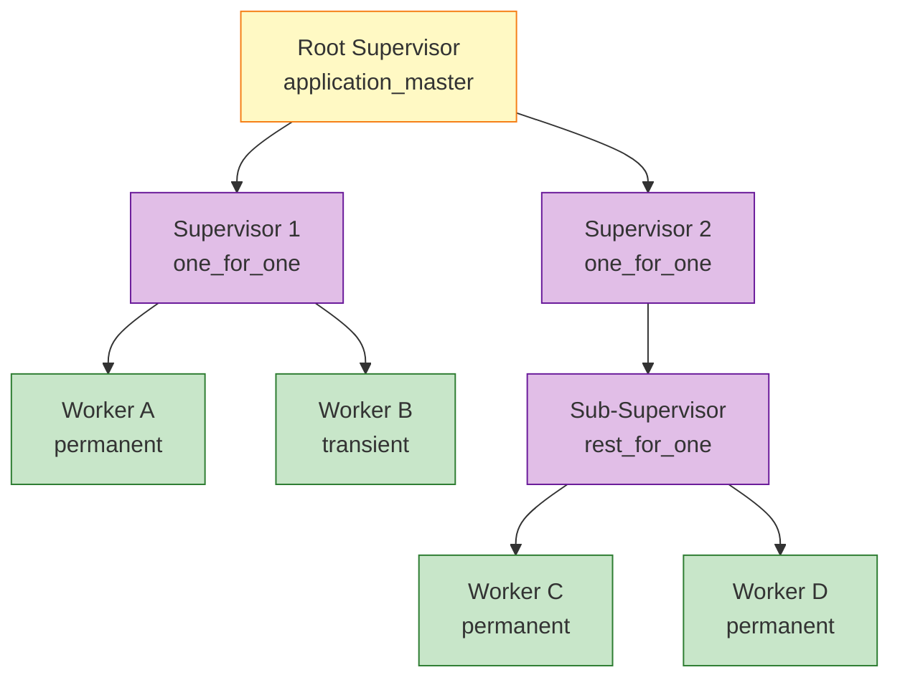
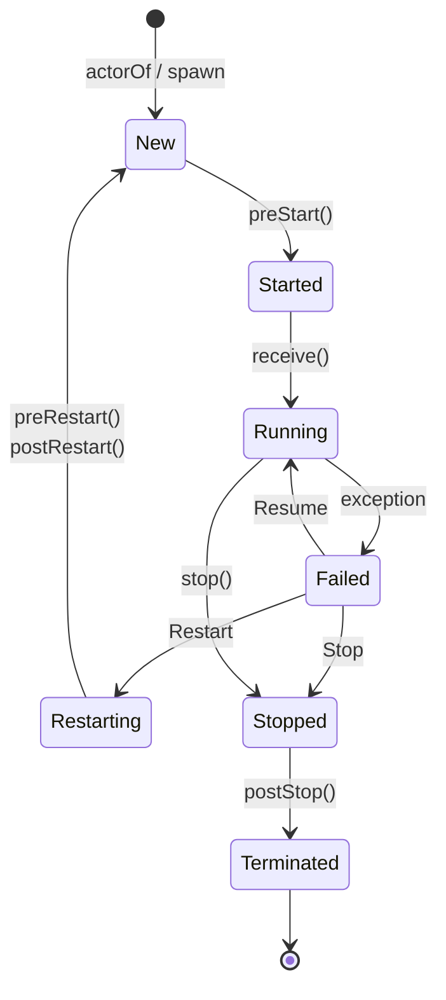

# Actor Model Formalization

> **Stage**: Struct | **Prerequisites**: [AGENTS.md](../../../../AGENTS.md), [01.02-process-calculus-primer-en.md](./01.02-process-calculus-primer-en.md) | **Formalization Level**: L4-L5

## 1. Definitions

### Def-S-03-01. Actor (Classic Actor Model)

$$
\mathcal{A}_{\text{classic}} = (\alpha, b, m, \sigma)
$$

Where:

- $\alpha \in \text{Addr}$: unique address (unforgeable identity) [^1][^2]
- $b: \text{Msg} \times \text{State} \to (\text{Behavior} \times \text{State} \times \text{Effect}^*)$: behavior function
- $m \in \text{Msg}^*$: message queue (Mailbox)
- $\sigma \in \text{State}$: private internal state, never exposed externally

**Core Operations**:

- $\text{send}(\alpha, v)$: asynchronously send message $v$ to address $\alpha$
- $\text{become}(b')$: replace current behavior with $b'$
- $\text{spawn}(b_0, \sigma_0)$: create a new Actor with initial behavior $b_0$ and state $\sigma_0$

**Intuition**: The classic Actor, proposed by Hewitt and Agha, communicates exclusively via asynchronous message passing with strict prohibition of shared memory [^1][^2]. Actor address $\alpha$ is like a telephone number—you can send messages but cannot directly touch the internal state.

---

### Def-S-03-02. Behavior

Behavior is the **reaction rule** of an Actor, defining state transitions, side effects, and behavioral evolution upon receiving a specific message:

$$
B : \mathcal{M} \times \Sigma \rightarrow (\mathcal{B}' \times \Sigma' \times \mathcal{E}^*)
$$

Where:

- $\mathcal{M}$: message domain
- $\Sigma$: state domain
- $\mathcal{B}'$: new Behavior (supports `become` semantics)
- $\mathcal{E}^*$: side-effect sequence (sending messages to other Actors, spawning children, I/O, etc.)

**Intuition**: Behavior is the Actor's "brain," triggered by asynchronous messages. After processing each message, `become` atomically switches behavior, naturally supporting finite-state machine modeling.

---

### Def-S-03-03. Mailbox

Mailbox is the **input buffer queue** of an Actor, responsible for temporarily storing messages asynchronously delivered by other Actors:

$$
\text{Mailbox}(\alpha) \triangleq \langle m_1, m_2, \ldots, m_n \rangle \in \mathbb{M}^*
$$

Where each message $m_i = \langle \text{payload}, \text{timestamp}, \text{sender} \rangle$.

**Operational Semantics**:

```
Send:   α ! v  atomically appends ⟨v, t, self⟩ to the tail of α's mailbox
Receive: receive C end  selects and removes the first matching message from the head by pattern matching
```

**Mailbox Semantic Variants**:

| Variant | Semantics | Representative System |
|---------|-----------|----------------------|
| Pure FIFO | strict first-in-first-out | Classic Actor [^1] |
| Searchable Queue | scans entire mailbox, selects first match | Erlang [^3] |
| Bounded Queue | capacity-constrained, overflow triggers backpressure or drop | Akka BoundedMailbox [^4] |

**Intuition**: The mailbox is the Actor's "inbox." Classic Actor assumes an infinite FIFO queue; Erlang introduces selective receive, making the mailbox a **searchable queue** that allows processes to selectively consume messages based on current state rather than strict FIFO [^3]. Akka further distinguishes unbounded and bounded mailboxes, with the latter enabling backpressure when capacity is exhausted [^4].

---

### Def-S-03-04. ActorRef (Actor Opaque Reference)

$$
\text{ActorRef} = \langle \text{path} : \text{ActorPath}, \text{refCell} : \text{AtomicReference}[\text{InternalActorRef}] \rangle
$$

Where `path` is a globally unique logical address (e.g., `/user/counter`), and `refCell` points to the runtime Actor instance. ActorRef exposes only the `!` (tell) operation [^4]:

```scala
trait ActorRef {
  def !(message: Any)(implicit sender: ActorRef = Actor.noSender): Unit
  def path: ActorPath
}
```

**Intuition**: ActorRef is the Actor's "telephone number"—you can send messages but cannot directly access internal state [^4]. Even if the target Actor restarts or migrates, the sender can continue sending without modification.

---

### Def-S-03-05. Supervision Tree

A supervision tree is a rooted forest $\mathcal{T} = (V, E, r)$, where [^3]:

- $V = \mathcal{S} \cup \mathcal{W}$: nodes, containing Supervisors $\mathcal{S}$ and Workers $\mathcal{W}$
- $E \subseteq \mathcal{S} \times (\mathcal{S} \cup \mathcal{W})$: edges representing supervision relationships
- $r \in \mathcal{S}$: root supervisor

**Supervisor Formalization**:
$$
\mathcal{S} = \langle \text{Id}, \chi, \sigma, \mathcal{C} \rangle
$$

Where:

- $\chi \in \{\text{one\_for\_one}, \text{one\_for\_all}, \text{rest\_for\_one}, \text{simple\_one\_for\_one}\}$: supervision strategy
- $\sigma = (I, P)$: restart specification—$I$ = max restarts, $P$ = time window (seconds)
- $\mathcal{C} = \{c_1, \ldots, c_n\}$: child process specifications

**Supervision Strategy Semantics** [^3]:

- **one_for_one**: restart only the crashed child
- **one_for_all**: terminate all children, restart all in reverse startup order
- **rest_for_one**: terminate and restart the crashed child and all children started "after" it
- **simple_one_for_one**: for dynamic children; all share the same startup spec

**Intuition**: The supervision tree is a hierarchical fault-tolerance structure. Supervisors monitor children and restart them according to strategy [^3]. It transforms error handling from a call-stack model to a tree-shaped decision model, orthogonally separating fault recovery from business logic.

---

## 2. Properties

### Lemma-S-03-01. Mailbox Serial Processing Lemma

**Statement**: For any Actor $\alpha$, at any time $t$, at most one thread $T$ is executing $\alpha$'s message processing logic (`receive` / `handle_message`).

**Proof**:

1. Mailbox maintains a `status` field (AtomicInteger in Akka, scheduling flag in Erlang VM) with values $\{\text{Idle}, \text{Scheduled}, \text{Running}\}$.
2. When the first message arrives and `status = Idle`, the scheduler performs a CAS operation to set status to `Scheduled`, then submits `processMailbox` to the execution thread.
3. During `processMailbox` execution, `status` is set to `Running`. New messages triggering scheduling will fail CAS(`Idle` → `Scheduled`) because current status is `Running`.
4. Only when `processMailbox` completes and resets `status` to `Idle` can the next scheduling succeed.
5. Therefore, at any moment, at most one thread executes Mailbox message processing. ∎

> **Inference [Execution→Data]**: Mailbox serial processing guarantees Actor internal state consistency without explicit locks.

---

### Lemma-S-03-02. Supervision Tree Fault Propagation Boundedness

**Statement**: Let supervision tree $\mathcal{T}$ have height $h$ (root depth = 0). For any leaf worker $w$ at depth $d$, if $w$ crashes, the fault signal propagates upward at most $h - d$ layers, or is intercepted at some intermediate layer.

$$
\text{depth}(w) = d \land \text{height}(\mathcal{T}) = h \Rightarrow \text{propagation\_depth} \leq h - d
$$

**Proof**: The supervision tree is an acyclic hierarchical graph; each non-root node has exactly one supervisor parent. When $w$ crashes, it generates an EXIT signal sent to its parent $s_{d-1}$. $s_{d-1}$ decides according to strategy $\chi$: `Resume`, `Restart`, or `Stop` handles the fault locally; `Escalate` forwards to $s_{d-2}$. Since the path from $w$ to root is unique with length $h - d$, propagation cannot exceed this bound. ∎

---

### Prop-S-03-01. ActorRef Opacity Implies Location Transparency

**Statement**: For any sender $s$ and receiver $r$, message send semantics $s \,!\, m$ is independent of $r$'s physical location.

**Proof**:

1. By Def-S-03-04, ActorRef exposes only `path` and `!`, hiding the underlying `refCell`.
2. `refCell` can point to a local Actor instance (`LocalActorRef`) or a remote proxy (`RemoteActorRef`).
3. The sender interacts only with ActorRef, never directly with the Actor instance.
4. Therefore, migrating an Actor from local to remote (or vice versa) requires no sender code changes. ∎

---

## 3. Relations

### Relation 1: Classic Actor `⊂` Erlang Actor

- **Encoding existence**: Classic Actor model encodes as an Erlang subset using pure FIFO receive without pattern-matching guards, selective receive, or supervision trees.
- **Separation result**: Erlang's selective receive (searchable Mailbox) and supervision tree fault-tolerance mechanisms cannot be expressed as primitives in classic Actor. Classic Actor has no built-in fault recovery abstraction.

**Conclusion**: Erlang Actor is a strict superset of classic Actor.

---

### Relation 2: Actor Model `⊂` Asynchronous π-Calculus

- **Encoding existence**: Agha & Mason proved Actor model can be encoded as a restricted subset of asynchronous π-calculus [^1]. Core mapping:
  - `send(α, v)` ↦ $\bar{\alpha}\langle v \rangle$
  - `receive` ↦ $\alpha(x).P$
  - `spawn` ↦ $(\nu c)(\bar{c}\langle P \rangle \mid !c(x).x)$
- **Separation result**: π-calculus does not natively provide Mailbox FIFO ordering or supervision tree fault-tolerance semantics.

**Conclusion**: In expressive power, $\text{Actor\ Model} \subset \text{Async-}\pi$.

---

### Relation 3: Erlang/OTP `≈` Akka Actor (Core Semantic Bisimulation Equivalence)

- **Encoding existence**: Erlang's `spawn` maps to Akka's `actorOf`, `!` to `!`, `link` to `watch`, `supervisor` to `SupervisorStrategy` [^3][^4].
- **Equivalence condition**: Under ideal configuration (each Akka Actor bound to `PinnedDispatcher`, non-blocking behavior, no shared mutable state), Akka and Erlang are bisimulation-equivalent in fault-isolation semantics.
- **Differences**: Erlang is dynamically typed; Akka provides static types (Akka Typed). Erlang process isolation is guaranteed by BEAM VM (independent heaps); Akka isolation is by convention (JVM shared memory underneath).

**Conclusion**: Core Actor semantics are bisimulation-equivalent; engineering paths differ.

---

### Relation 4: Actor Model `↔` Dataflow Model (Turing-Complete Equivalence)

- **Actor → Dataflow**: Each Actor maps to a StatefulProcessor; Mailbox maps to Channel (Buffer + FIFO ordering); ActorRef maps to Processor Identity.
- **Dataflow → Actor**: Each operator maps to an Actor; data edges map to asynchronous message passing; partition strategy maps to routing.
- **Key difference**: Actors are dynamically created, message-driven; Dataflow is static topology, data-driven. Both are Turing-complete and mutually encodable.

---

## 4. Argumentation

### Argument 1: Why Mailbox Serial Processing Is the Foundation of Actor Determinism

The Actor model shifts concurrent state-modification control from explicit locks to implicit Mailbox serialization. By Lemma-S-03-01, at most one thread processes an Actor's Mailbox at any time, so all state reads, writes, and behavior switches execute in a single logical serial stream. `become(b')` takes effect atomically during message $m_k$ processing, affecting $m_{k+1}$ but not $m_k$—there is no race window where old and new behaviors interleave. Mailbox serial processing is the necessary and sufficient condition for Actor local determinism, upon which Thm-S-03-01 is built.

---

### Argument 2: Scenarios Breaking Determinism Boundaries

Thm-S-03-01's conditional determinism relies on two key premises: **Mailbox sequence determinism** and **state privacy**.

- **Multi-sender interleaving**: When multiple senders concurrently deliver messages, the global interleaving order is determined by the scheduler. While single-sender order is preserved, selective receive (Erlang `receive`) may match different messages under different interleavings, causing overall nondeterminism.
- **Shared state bypass**: Akka closures capturing external `var` or Erlang ETS tables introduce shared mutable state not going through the Mailbox. This violates Def-S-03-01's private-state assumption, immediately invalidating Lemma-S-03-01 and Thm-S-03-01.

---

### Argument 3: Trade-off Between Supervision Tree Depth and Restart Intensity

Supervision tree depth $h$ and restart intensity $I$ involve an engineering trade-off. Shallow trees ($h \leq 3$) enable fast fault recovery but complex ChildSpecs. Deep trees ($h > 5$) have clear responsibilities but high cascading restart latency. Excessive $I$ (e.g., 100) causes infinite restart loops for permanent faults; too low $I$ (e.g., 1) is overly sensitive to normal fluctuations. OTP best practice recommends depth within 3 layers and $I = 3 \sim 5$ ($P = 60$ seconds) [^3].

---

## 5. Proofs

### Thm-S-03-01. Local Determinism Under Actor Mailbox Serial Processing

**Statement**: For any Actor $\alpha$ with initial state $\sigma_0$ and Mailbox message sequence $\langle m_1, m_2, \ldots, m_n \rangle$, if all messages are processed single-threaded (Lemma-S-03-01), the state transition sequence $\langle \sigma_0, \sigma_1, \ldots, \sigma_n \rangle$ is uniquely determined:

$$
\forall \alpha, \forall \vec{m} = \langle m_i \rangle_{i=1}^n, \forall t. \; \text{single\_threaded}(\alpha, t) \Rightarrow \exists! \langle \sigma_i \rangle_{i=0}^n. \; \sigma_i = b_i(m_i, \sigma_{i-1})
$$

**Proof** (by mathematical induction):

**Base case ($i = 1$)**: By Lemma-S-03-01, message processing is single-threaded. When $m_1$ is scheduled, current Behavior is $b_1$ and state is $\sigma_0$. By Def-S-03-02, Behavior is a mathematical function: $(b_2, \sigma_1, \vec{e}_1) = b_1(m_1, \sigma_0)$. Function definition guarantees unique output for given input. Thus $\sigma_1$ and $b_2$ are uniquely determined.

**Inductive hypothesis**: Assume for message $k-1$, state $\sigma_{k-1}$ and behavior $b_{k-1}$ are uniquely determined.

**Inductive step ($i = k$)**: When processing $m_k$, by hypothesis the current configuration is $(b_k, \sigma_{k-1})$. Applying Def-S-03-02: $(b_{k+1}, \sigma_k, \vec{e}_k) = b_k(m_k, \sigma_{k-1})$. Since $b_k$ and $\sigma_{k-1}$ are unique and $b_k$ is a function, $\sigma_k$ and $b_{k+1}$ are also unique.

**Side effects do not affect local determinism**: Side-effect sequence $\vec{e}_k$ may contain `send` operations to other Actors. These only append messages to recipients' Mailboxes and never modify $\alpha$'s state or Behavior. Feedback messages must re-enter $\alpha$'s Mailbox and be processed as $m_j$ ($j > k$), not affecting $m_k$'s result uniqueness.

By mathematical induction, all $\sigma_i$ are uniquely determined. ∎

---

### Thm-S-03-02. Supervision Tree Liveness

**Statement**: Let $\mathcal{T}$ be a well-formed supervision tree with finite height $h < \infty$. For any leaf worker $w$ at depth $d$, if $w$ crashes due to a **transient fault**, and the fault cause is fixed within finite time $t_{\text{fixed}}$, then $w$ will be successfully restarted in finite steps, provided its parent supervisor's restart intensity $I$ is not exhausted.

$$
\begin{aligned}
& w \in \text{Leaves}(\mathcal{T}) \land \text{transient}(\text{cause}(w)) \land \exists t_{\text{fixed}} < \infty. \text{fixed}(\text{cause}(w), t_{\text{fixed}}) \\
& \land \text{count}(\mathcal{H}, t, P) < I \Rightarrow \Diamond \text{restarted}(w)
\end{aligned}
$$

**Proof**: When $w$ crashes, the VM immediately sends a fault signal to parent supervisor $s_{\text{parent}}$ via `link`. $s_{\text{parent}}$ decides based on strategy $\chi$ and restart history $\mathcal{H}$: if $\text{count}(\mathcal{H}, t, P) < I$, execute `Restart`. Since the fault is transient and fixed within $t_{\text{fixed}}$, some restart after $t_{\text{fixed}}$ must succeed. Fault detection is O(1), $\mathcal{H}$ length is bounded by $I$, restart is atomic, and tree height $h < \infty$, so total steps are bounded by $\text{depth}(w) \times I$. ∎

---

## 6. Examples

### Example 1: Akka Typed Counter Actor

```scala
sealed trait Command
object Command {
  case object Increment extends Command
  case class GetCount(replyTo: ActorRef[Int]) extends Command
}

val counter: Behavior[Command] = Behaviors.setup { ctx =>
  var count = 0                    // private state σ
  Behaviors.receiveMessage {       // Behavior b
    case Command.Increment =>
      count += 1                   // state transition: σ → σ'
      Behaviors.same               // become(same behavior)
    case Command.GetCount(replyTo) =>
      replyTo ! count              // side effect: send(ActorRef, Int)
      Behaviors.same
  }
}
```

**Analysis**: `Behaviors.setup` creates closure state `count` (private $\sigma$); `Behaviors.receiveMessage` guarantees single-message processing (Lemma-S-03-01); `replyTo: ActorRef[Int]` exemplifies type-safe ActorRef (Def-S-03-04). By Thm-S-03-01, given message sequence $\langle \text{Increment}, \text{Increment}, \text{GetCount} \rangle$, final state $\sigma_3$ must be $2$.

---

### Example 2: Erlang OTP Supervision Tree

```erlang
-module(web_server_sup).
-behaviour(supervisor).

-export([start_link/0, init/1]).

start_link() ->
    supervisor:start_link({local, ?MODULE}, ?MODULE, []).

init([]) ->
    SupFlags = #{
        strategy => one_for_one,
        intensity => 5,
        period => 60
    },
    Children = [
        #{id => db_pool, start => {db_pool, start_link, []},
          restart => permanent, shutdown => 5000, type => worker},
        #{id => http_listener, start => {http_listener, start_link, []},
          restart => permanent, shutdown => 5000, type => worker},
        #{id => cache_service, start => {cache_service, start_link, []},
          restart => transient, shutdown => 2000, type => worker}
    ],
    {ok, {SupFlags, Children}}.
```

**Analysis**: `one_for_one` corresponds to strategy $\chi$ in Def-S-03-05; `intensity => 5, period => 60` corresponds to restart spec $\sigma = (5, 60)$. `permanent` vs `transient` correspond to worker restart types. By Thm-S-03-02, transient faults recover in finite steps.

---

### Counter-Example 1: Shared Mutable State Breaks Actor Isolation

```scala
var sharedCounter = 0              // external shared mutable state

class BadActor extends Actor {
  def receive = {
    case Increment => sharedCounter += 1
    case GetCount  => sender ! sharedCounter
  }
}

val a1 = system.actorOf(Props[BadActor])
val a2 = system.actorOf(Props[BadActor])
a1 ! Increment
a2 ! Increment
```

**Analysis**: `sharedCounter += 1` is not atomic. Two `BadActor` instances executing concurrently cause lost updates (expected 2, actual may be 1). This violates Def-S-03-01's private-state assumption, invalidating Thm-S-03-01.

---

## 7. Visualizations

### Figure 1: Supervision Tree Hierarchy



**Legend**: Yellow = root supervisor; Purple = intermediate supervisors; Green = leaf workers. Under `one_for_one`, a single leaf crash affects only itself; under `rest_for_one`, the crashed node and its right siblings are restarted.

---

### Figure 2: Actor Lifecycle State Machine



**Legend**: The `Restart` path triggers `preRestart` and `postRestart` hooks, allowing state reset without losing ActorRef. The `Resume` path preserves the current instance and state, ignoring only the exception-causing message.

---

## 8. References

[^1]: G. Agha, *Actors: A Model of Concurrent Computation in Distributed Systems*, MIT Press, 1986.
[^2]: C. Hewitt, P. Bishop, and R. Steiger, "A Universal Modular ACTOR Formalism for Artificial Intelligence," *IJCAI 1973*, 1973.
[^3]: J. Armstrong, *Making Reliable Distributed Systems in the Presence of Software Errors*, Ph.D. thesis, KTH Royal Institute of Technology, 2003.
[^4]: B. Virdal et al., "Akka Actor: A Toolkit for Concurrent and Distributed Programming," Lightbend Technical Reports, 2015. (See also Akka Documentation, <https://doc.akka.io/>)

---

*Document Version: v1.0-en | Updated: 2026-04-20 | Status: Core Summary*
