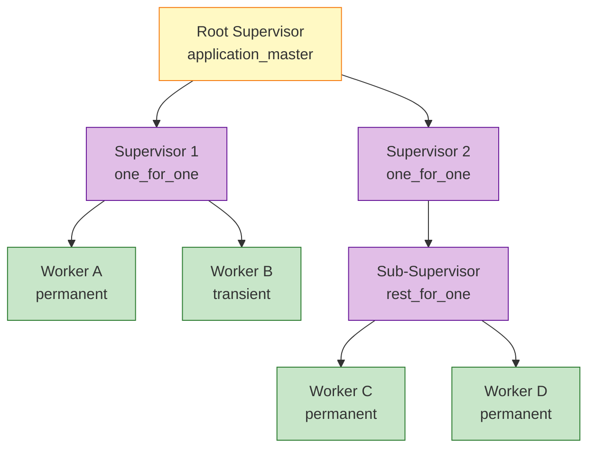
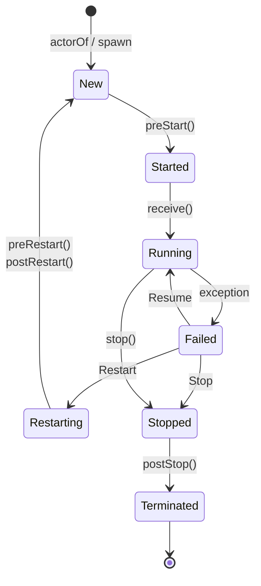

# Actor Model Formalization

> **Stage**: Struct | **Prerequisites**: [AGENTS.md](../../AGENTS.md), [01.02-process-calculus-primer-en.md](./01.02-process-calculus-primer-en.md) | **Formalization Level**: L4-L5

---

## Table of Contents

- [Actor Model Formalization](#actor-model-formalization)
  - [Table of Contents](#table-of-contents)
  - [1. Definitions](#1-definitions)
    - [Def-S-03-01. Actor (Classic Actor Model)](#def-s-03-01-actor-classic-actor-model)
    - [Def-S-03-02. Behavior](#def-s-03-02-behavior)
    - [Def-S-03-03. Mailbox](#def-s-03-03-mailbox)
    - [Def-S-03-04. ActorRef (Actor Opaque Reference)](#def-s-03-04-actorref-actor-opaque-reference)
    - [Def-S-03-05. Supervision Tree](#def-s-03-05-supervision-tree)
  - [2. Properties](#2-properties)
    - [Lemma-S-03-01. Mailbox Serial Processing Lemma](#lemma-s-03-01-mailbox-serial-processing-lemma)
    - [Lemma-S-03-02. Supervision Tree Fault Propagation Boundedness Lemma](#lemma-s-03-02-supervision-tree-fault-propagation-boundedness-lemma)
    - [Prop-S-03-01. ActorRef Opacity Implies Location Transparency](#prop-s-03-01-actorref-opacity-implies-location-transparency)
  - [3. Relations](#3-relations)
    - [Relation 1: Classic Actor `⊂` Erlang Actor](#relation-1-classic-actor--erlang-actor)
    - [Relation 2: Actor Model `⊂` Asynchronous π-Calculus](#relation-2-actor-model--asynchronous-π-calculus)
    - [Relation 3: Erlang/OTP `≈` Akka Actor (Core Semantic Bisimulation Equivalence)](#relation-3-erlangotp--akka-actor-core-semantic-bisimulation-equivalence)
    - [Relation 4: Actor Model `↔` Dataflow Model (Turing-Complete Equivalence)](#relation-4-actor-model--dataflow-model-turing-complete-equivalence)
  - [4. Argumentation](#4-argumentation)
    - [Argument 1: Why Mailbox Serial Processing Is the Foundation of Actor Determinism](#argument-1-why-mailbox-serial-processing-is-the-foundation-of-actor-determinism)
    - [Argument 2: Breaking the Determinism Boundary — Scenario Analysis](#argument-2-breaking-the-determinism-boundary--scenario-analysis)
    - [Argument 3: Supervision Tree Depth vs. Restart Intensity Trade-off](#argument-3-supervision-tree-depth-vs-restart-intensity-trade-off)
  - [5. Proofs](#5-proofs)
    - [Thm-S-03-01. Actor Local Determinism Under Mailbox Serial Processing](#thm-s-03-01-actor-local-determinism-under-mailbox-serial-processing)
    - [Thm-S-03-02. Supervision Tree Liveness Theorem](#thm-s-03-02-supervision-tree-liveness-theorem)
  - [6. Examples](#6-examples)
    - [Example 1: Akka Typed Counter Actor](#example-1-akka-typed-counter-actor)
    - [Example 2: Erlang OTP Supervision Tree Configuration](#example-2-erlang-otp-supervision-tree-configuration)
    - [Counterexample 1: Shared Mutable State Violates Actor Isolation](#counterexample-1-shared-mutable-state-violates-actor-isolation)
    - [Counterexample 2: Selective Receive Nondeterminism Under Concurrent Sends](#counterexample-2-selective-receive-nondeterminism-under-concurrent-sends)
  - [7. Visualizations](#7-visualizations)
    - [Figure 1: Supervision Tree Hierarchy](#figure-1-supervision-tree-hierarchy)
    - [Figure 2: Actor Lifecycle State Machine](#figure-2-actor-lifecycle-state-machine)
  - [8. References](#8-references)

## 1. Definitions

### Def-S-03-01. Actor (Classic Actor Model)

$$
\mathcal{A}_{\text{classic}} = (\alpha, b, m, \sigma)
$$

Where:

- $\alpha \in \text{Addr}$: Actor's unique address (unforgeable identity) [^1][^2]
- $b: \text{Msg} \times \text{State} \to (\text{Behavior} \times \text{State} \times \text{Effect}^*)$: Behavior function describing how the Actor processes incoming messages
- $m \in \text{Msg}^*$: Message queue (Mailbox), storing messages asynchronously sent by other Actors
- $\sigma \in \text{State}$: Private internal state, not exposed externally

**Core Operations**:

- $\text{send}(\alpha, v)$: Asynchronously send message $v$ to address $\alpha$
- $\text{become}(b')$: Replace current behavior with new behavior $b'$
- $\text{spawn}(b_0, \sigma_0)$: Create a new Actor with initial behavior $b_0$ and initial state $\sigma_0$

**Intuitive Explanation**: The classic Actor is the original concurrency model proposed by Hewitt and Agha, communicating through asynchronous message passing with strict prohibition of shared memory[^1][^2]. The Actor address $\alpha$ is analogous to a telephone number — you can send messages but cannot directly touch the internal state.

**Motivation for the Definition**: The quadruple abstraction is the prerequisite for proving "no shared state" and "fault isolation." The explicit modeling of Mailbox is the critical foundation for Thm-S-03-01.

---

### Def-S-03-02. Behavior

Behavior is the **reaction rule** of an Actor, defining the state transitions, side effects, and behavior evolution to be executed when a specific message is received:

$$
B : \mathcal{M} \times \Sigma \rightarrow (\mathcal{B}' \times \Sigma' \times \mathcal{E}^*)
$$

Where:

- $\mathcal{M}$: Message domain (set of all possible receivable messages)
- $\Sigma$: State domain
- $\mathcal{B}'$: New Behavior (supports `become` semantics)
- $\mathcal{E}^*$: Sequence of side effects (sending messages to other Actors, creating child Actors, performing I/O, etc.)

**Intuitive Explanation**: Behavior is the Actor's "brain," triggered by asynchronous messages. After processing each message, a new Behavior can be atomically switched via `become`, naturally supporting finite state machine modeling.

**Motivation for the Definition**: Independent formalization of Behavior is to precisely analyze the atomicity of behavior switching, ensuring the new Behavior takes effect for the next message while avoiding interleaving between old and new behaviors.

---

### Def-S-03-03. Mailbox

Mailbox is the **input buffer queue** of an Actor, responsible for temporarily storing messages asynchronously delivered by other Actors:

$$
\text{Mailbox}(\alpha) \triangleq \langle m_1, m_2, \ldots, m_n \rangle \in \mathbb{M}^*
$$

Where each message $m_i = \langle \text{payload}, \text{timestamp}, \text{sender} \rangle$.

**Operational Semantics**:

```
Send:   α ! v  atomically appends message ⟨v, t, self⟩ to the tail of process α's mailbox
Receive: receive C end  selects and removes the first matching message from the head of the mailbox by pattern matching
```

**Pattern Matching**[^3]:

```
match(v, p) = θ   if there exists substitution θ such that pθ = v
match(v, p) = ⊥   otherwise (matching fails)
```

**Mailbox Semantic Variants**:

| Variant | Semantics | Representative System |
|---------|-----------|----------------------|
| Pure FIFO | Strict first-in-first-out, consumed in arrival order | Classic Actor [^1] |
| Searchable Queue | Scans entire mailbox, selects first matching message | Erlang [^3] |
| Bounded Queue | Capacity limited, overflow triggers backpressure or drop | Akka BoundedMailbox [^4] |

**Intuitive Explanation**: The mailbox is the Actor's "inbox." Classic Actors assume mailboxes are infinite FIFO queues; in engineering implementations, Erlang introduced selective receive, making the mailbox a **searchable queue** that allows processes to selectively consume messages based on current state rather than strict FIFO order[^3]. Akka further distinguishes between unbounded mailboxes (UnboundedMailbox) and bounded mailboxes (BoundedMailbox), the latter implementing backpressure strategies when capacity is exhausted[^4].

**Motivation for the Definition**:

1. **FIFO Order Guarantee**: Without defining timestamps and queue structure, message ordering cannot be formalized.
2. **Selective Receive**: Erlang's `receive` allows scanning the entire mailbox to select matching messages, which differs from pure FIFO semantics and requires explicit modeling.
3. **Boundary Analysis**: The physical finiteness of mailboxes is a potential cause of system crashes (see counterexample analysis), and capacity parameters must be exposed in formalization.

---

### Def-S-03-04. ActorRef (Actor Opaque Reference)

$$
\text{ActorRef} = \langle \text{path} : \text{ActorPath}, \text{refCell} : \text{AtomicReference}[\text{InternalActorRef}] \rangle
$$

Where `path` is a globally unique logical address (e.g., `/user/counter`), and `refCell` points to the runtime concrete Actor instance. ActorRef exposes only the `!` (tell) operation externally[^4]:

```scala
trait ActorRef {
  def !(message: Any)(implicit sender: ActorRef = Actor.noSender): Unit
  def path: ActorPath
}
```

**Intuitive Explanation**: ActorRef is the Actor's "telephone number" — you can send messages but cannot directly touch the internal state[^4]. Even if the target Actor restarts or migrates, the sender can continue sending without modification.

**Motivation for the Definition**: Decoupling identity from physical instance is the foundation of location transparency and runtime migration[^4]. The unforgeability of ActorRef also prevents identity spoofing attacks.

---

### Def-S-03-05. Supervision Tree

A supervision tree is a rooted forest $\mathcal{T} = (V, E, r)$, where[^3]:

- $V = \mathcal{S} \cup \mathcal{W}$: Node set, containing Supervisors $\mathcal{S}$ and Workers $\mathcal{W}$
- $E \subseteq \mathcal{S} \times (\mathcal{S} \cup \mathcal{W})$: Edge set, representing supervision relationships
- $r \in \mathcal{S}$: Root supervisor

**Supervisor Formalization**:

$$
\mathcal{S} = \langle \text{Id}, \chi, \sigma, \mathcal{C} \rangle
$$

Where:

- $\chi \in \{\text{one\_for\_one}, \text{one\_for\_all}, \text{rest\_for\_one}, \text{simple\_one\_for\_one}\}$: Supervision strategy
- $\sigma = (I, P)$: Restart specification, $I$ is restart intensity (maximum restarts), $P$ is restart window (seconds)
- $\mathcal{C} = \{c_1, \ldots, c_n\}$: Child process specification set, each $c_i = \langle \text{ChildId}, \text{StartSpec}, \text{RestartType}, \text{ShutdownTimeout}, \text{ProcessType} \rangle$

**Supervision Strategy Semantics**[^3]:

- **one_for_one**: Restart only the crashed child process $c_i$
- **one_for_all**: Terminate all child processes, then restart all children in reverse startup order
- **rest_for_one**: Terminate and restart the crashed child process and all children started "after" it
- **simple_one_for_one**: For dynamic child processes, similar to one_for_one, but all children share the same startup specification

**Intuitive Explanation**: The supervision tree is a hierarchical fault-tolerance structure where supervisors monitor child processes and restart them according to strategy upon failure[^3]. It transforms error handling from the call-stack model to a tree-shaped decision model, orthogonalizing fault recovery from business logic.

**Motivation for the Definition**: The supervision tree defines fault propagation boundaries; different strategies correspond to different fault-tolerance semantics; restart intensity $(I, P)$ is the circuit breaker mechanism preventing infinite restart loops.

---

## 2. Properties

### Lemma-S-03-01. Mailbox Serial Processing Lemma

**Statement**: For any Actor $\alpha$, at any time $t$, at most one thread $T$ is executing $\alpha$'s message processing logic (`receive` / `handle_message`).

**Proof**:

1. **Premise Analysis**: By Def-S-03-03, Mailbox maintains a `status` field (AtomicInteger in Akka implementation, scheduling flag in Erlang VM), with values in $\{\text{Idle}, \text{Scheduled}, \text{Running}\}$.
2. **Construction/Derivation**:
   - When the first message arrives and `status = Idle`, the scheduler performs a CAS operation setting the state to `Scheduled`, then submits the `processMailbox` task to the execution thread.
   - During `processMailbox` execution, `status` is set to `Running`. If new messages arrive and trigger scheduling at this time, CAS(`Idle` → `Scheduled`) must fail because the current state is `Running`.
   - Only when `processMailbox` completes processing the current batch (or single) message and resets `status` to `Idle` can the next scheduling succeed.
3. **Conclusion**: At any time, at most one thread executes the Mailbox's message processing logic. ∎

> **Inference [Execution→Data]**: The Mailbox serial processing mechanism at the execution layer guarantees Actor internal state consistency at the data layer, achieving thread safety without explicit locks.
>
> **Basis**: Dispatcher's CAS scheduling + Mailbox single-thread execution contract (Def-S-03-03, Lemma-S-03-01).

---

### Lemma-S-03-02. Supervision Tree Fault Propagation Boundedness Lemma

**Statement**: Let supervision tree $\mathcal{T}$ have height $h$ (root node depth 0). For any leaf worker $w$ at depth $d$, if $w$ crashes, the fault signal propagates upward at most $h - d$ levels, or is successfully intercepted at some intermediate level.

**Formalization**:

$$
\text{depth}(w) = d \land \text{height}(\mathcal{T}) = h \Rightarrow \text{propagation\_depth} \leq h - d
$$

**Proof**:

1. **Premise Analysis**: By Def-S-03-05, the supervision tree is an acyclic hierarchical graph, and each non-root node has exactly one supervisor parent node.
2. **Construction/Derivation**:
   - When $w$ crashes, it generates an EXIT signal sent to its parent supervisor $s_{d-1}$ (depth $d-1$) through the `link` mechanism.
   - $s_{d-1}$ receives the signal and decides according to strategy $\chi$:
     - If the decision is `Resume`, `Restart`, or `Stop`, the fault is handled locally at $s_{d-1}$ and does not propagate upward.
     - If the decision is `Escalate` (or restart intensity exceeded causing supervisor failure), the signal is forwarded to $s_{d-1}$'s parent node $s_{d-2}$.
   - Since the path from $w$ to root node $r$ is unique and has length exactly $h - d$, the propagation depth cannot exceed this value.
3. **Conclusion**: The supervision tree structure provides a natural upper bound for fault propagation. ∎

---

### Prop-S-03-01. ActorRef Opacity Implies Location Transparency

**Statement**: For any sender $s$ and receiver $r$, message sending semantics $s \,!\, m$ is independent of $r$'s physical location.

**Derivation**:

1. By Def-S-03-04, ActorRef exposes only `path` and `!` operations, hiding the underlying `refCell` concrete implementation.
2. `refCell` can point to a local Actor instance (`LocalActorRef`) or a proxy for a remote Actor (`RemoteActorRef`).
3. When the sender calls `!`, it only interacts with ActorRef without directly accessing the Actor instance.
4. Therefore, migrating an Actor from local to remote (or vice versa) does not require modifying sender code.
5. Q.E.D.: ActorRef's opacity guarantees location transparency at the interface level. ∎

---

## 3. Relations

### Relation 1: Classic Actor `⊂` Erlang Actor

**Argument**:

- **Encoding Existence**: The classic Actor model can be encoded as an Erlang subset — using pure FIFO receive patterns (`receive Msg -> ... end` without pattern matching guards), ignoring selective receive and supervision trees.
- **Separation Result**: Erlang's selective receive (searchable Mailbox) and supervision tree fault-tolerance mechanisms cannot be expressed as primitives in the classic Actor model. Classic Actors have no built-in fault recovery abstractions and do not support runtime module hot-swapping.

**Conclusion**: Erlang Actor is a strict superset of the classic Actor model, $\text{ClassicActor} \subset \text{ErlangActor}$.

---

### Relation 2: Actor Model `⊂` Asynchronous π-Calculus

**Argument** (see [01.02-process-calculus-primer-en.md](./01.02-process-calculus-primer-en.md) for π-calculus definition):

- **Encoding Existence**: Agha and Mason proved that the Actor model can be encoded as a restricted subset of asynchronous π-calculus[^1]. Core mapping:
  - `send(α, v)` encoded as $\bar{\alpha}\langle v \rangle$
  - `receive` encoded as $\alpha(x).P$
  - `spawn` encoded as $(\nu c)(\bar{c}\langle P \rangle \mid !c(x).x)$
- **Separation Result**: π-calculus does not natively provide FIFO ordering guarantees for Mailboxes, nor does it provide supervision tree fault-tolerance semantics. Although these can be simulated through complex encodings, the simplicity and analyzability of the model are lost.

**Conclusion**: In expressiveness, $\text{Actor\ Model} \subset \text{Async-}\pi$, the Actor model sits at the L4-L5 expressiveness hierarchy (see Thm-S-02-01 in [01.02-process-calculus-primer-en.md](./01.02-process-calculus-primer-en.md)).

---

### Relation 3: Erlang/OTP `≈` Akka Actor (Core Semantic Bisimulation Equivalence)

**Argument**:

- **Encoding Existence**: Erlang's `spawn` corresponds to Akka's `actorOf`, `!` corresponds to `!`, `link` corresponds to `watch`, `supervisor` behavior corresponds to `SupervisorStrategy`[^3][^4].
- **Equivalence Condition**: Under ideal configuration (each Akka Actor bound to `PinnedDispatcher`, non-blocking behavior, no shared mutable state), Akka Actor and Erlang process are bisimulation-equivalent in fault isolation semantics.
- **Differences**:
  - Erlang is dynamically typed; Akka provides static types (Akka Typed).
  - Erlang process isolation is guaranteed by BEAM VM (independent Heap); Akka's isolation is by convention (JVM shared memory underneath).

**Conclusion**: Both are bisimulation equivalent (`≈`) at the core Actor semantic level; engineering implementation paths differ but theoretical models are consistent.

---

### Relation 4: Actor Model `↔` Dataflow Model (Turing-Complete Equivalence)

**Argument** (derived from unified streaming theory):

- **Actor → Dataflow**: Each Actor maps to a StatefulProcessor, Mailbox maps to Channel (Buffer + FIFO ordering), ActorRef maps to Processor Identity.
- **Dataflow → Actor**: Each operator maps to an Actor, data edges map to asynchronous message passing, partitioning strategies map to routing strategies.
- **Key Difference**: Actors are dynamically created and message-driven; Dataflow is static topology and data-driven. But in the Turing-complete sense, both can encode each other.

**Conclusion**: The Actor model and Dataflow model are equivalent in expressiveness; the main differences lie in control-driven vs. data-driven, and dynamic topology vs. static topology.

---

## 4. Argumentation

### Argument 1: Why Mailbox Serial Processing Is the Foundation of Actor Determinism

The Actor model shifts concurrent control of state modification from explicit locks to implicit serialization via Mailbox. By Lemma-S-03-01, Mailbox is processed by only a single thread at any time, so all state reads, modifications, and behavior switches run in a single logical serial stream. `become(b')` takes effect atomically while processing message $m_k$, effective for $m_{k+1}$ without affecting $m_k$; there is no race window for interleaving between old and new behaviors. Mailbox serial processing is the necessary and sufficient condition for Actor local determinism; Thm-S-03-01 is built upon this.

### Argument 2: Breaking the Determinism Boundary — Scenario Analysis

The conditional determinism of Thm-S-03-01 depends on two key premises: **determinism of Mailbox sequence** and **state privacy**.

- **Multi-sender Interleaving**: When multiple senders concurrently deliver messages, the global interleaving order is determined by the scheduler. Although single-sender order is preserved, under selective receive (Erlang `receive`) different interleavings may match different messages, leading to overall non-deterministic behavior.
- **Shared State Bypass**: Akka's closure capturing external `var` or Erlang's ETS tables introduce shared mutable state that bypasses the Mailbox. This directly violates the private state assumption of Def-S-03-01, immediately invalidating the guarantees of Lemma-S-03-01 and Thm-S-03-01.

### Argument 3: Supervision Tree Depth vs. Restart Intensity Trade-off

Supervision tree depth $h$ and restart intensity $I$ involve engineering trade-offs. Shallower trees ($h \leq 3$) have faster fault recovery but more complex ChildSpec; deeper trees ($h > 5$) have clear responsibilities but higher cascade restart latency. Excessively high $I$ (e.g., 100) leads to infinite restart loops for permanent faults; excessively low $I$ (e.g., 1) is too sensitive to normal fluctuations. OTP best practices recommend depth controlled within 3 levels, $I = 3 \sim 5$ ($P = 60$ seconds)[^3].

---

## 5. Proofs

### Thm-S-03-01. Actor Local Determinism Under Mailbox Serial Processing

**Statement**: For any Actor $\alpha$, if its initial state is $\sigma_0$, the message sequence in Mailbox is $\langle m_1, m_2, \ldots, m_n \rangle$, and all messages are processed serially by a single thread (Lemma-S-03-01), then the Actor's state transition sequence $\langle \sigma_0, \sigma_1, \ldots, \sigma_n \rangle$ is uniquely determined. Formally:

$$
\forall \alpha, \forall \vec{m} = \langle m_i \rangle_{i=1}^n, \forall t. \; \text{single\_threaded}(\alpha, t) \Rightarrow \exists! \langle \sigma_i \rangle_{i=0}^n. \; \sigma_i = b_i(m_i, \sigma_{i-1})
$$

Where $b_i$ represents the current Behavior when processing the $i$-th message.

**Proof**:

**Step 1 — Base Case ($i = 1$)**:

By Lemma-S-03-01, Mailbox message processing is single-threaded at any time. When the first message $m_1$ is scheduled for execution, Actor $\alpha$'s current Behavior is $b_1$ and current state is $\sigma_0$. According to Def-S-03-02, Behavior is a mathematical function:

$$
(b_2, \sigma_1, \vec{e}_1) = b_1(m_1, \sigma_0)
$$

The definition of a function guarantees that given the same input $(m_1, \sigma_0)$ and the same behavior $b_1$, the output $(b_2, \sigma_1)$ is unique. Therefore, the new state $\sigma_1$ and new behavior $b_2$ after processing $m_1$ are uniquely determined. Moreover, due to single-threaded execution, no other thread modifies $\sigma_0$ or $b_1$ during $m_1$ processing.

**Step 2 — Induction Hypothesis**:

Assume for the $(k-1)$-th message ($1 < k \leq n$), state $\sigma_{k-1}$ and the behavior $b_{k-1}$ processing that message have already been uniquely determined.

**Step 3 — Induction Step ($i = k$)**:

When processing the $k$-th message $m_k$, by the induction hypothesis, the Actor's current configuration is $(b_k, \sigma_{k-1})$, where $b_k$ is the behavior obtained via `become` after processing $m_{k-1}$ (if not switched, $b_k = b_{k-1}$). Applying Def-S-03-02's function semantics again:

$$
(b_{k+1}, \sigma_k, \vec{e}_k) = b_k(m_k, \sigma_{k-1})
$$

Since $b_k$ and $\sigma_{k-1}$ are both uniquely determined, and $b_k$ as a function produces unique output, $\sigma_k$ and $b_{k+1}$ are also uniquely determined.

**Step 4 — Side Effects Do Not Affect Local Determinism**:

The side effect sequence $\vec{e}_k$ may contain operations sending messages to other Actors (`send`). These operations only append messages to the receiver's Mailbox without modifying $\alpha$'s state or Behavior in reverse. Therefore, even if message feedback loops exist in the system, feedback messages must first enter $\alpha$'s Mailbox and be processed as $m_j$ ($j > k$) in subsequent scheduling. They do not affect the uniqueness of the current $m_k$ processing result.

**Step 5 — Conclusion**:

By mathematical induction, for all $i \in \{1, \ldots, n\}$, state $\sigma_i$ is uniquely determined. Therefore, the entire state transition sequence $\langle \sigma_0, \sigma_1, \ldots, \sigma_n \rangle$ is a deterministic function of the given message sequence $\vec{m}$ and initial state $\sigma_0$. ∎

---

### Thm-S-03-02. Supervision Tree Liveness Theorem

**Statement**: Let $\mathcal{T}$ be a well-formed supervision tree with height $h < \infty$. For any leaf worker $w$ at depth $d$, if $w$ crashes due to a **transient fault**, and the fault cause is fixed within finite time $t_{\text{fixed}}$, then $w$ will be successfully restarted within finite steps, provided its parent supervisor's restart intensity $I$ is not exhausted.

**Formalization**:

$$
\begin{aligned}
& w \in \text{Leaves}(\mathcal{T}) \land \text{depth}(w) = d \land \text{height}(\mathcal{T}) = h < \infty \\
& \land \text{transient}(\text{cause}(w)) \land \exists t_{\text{fixed}} < \infty. \text{fixed}(\text{cause}(w), t_{\text{fixed}}) \\
& \land \text{count}(\mathcal{H}, t, P) < I \\
& \Rightarrow \Diamond \text{restarted}(w)
\end{aligned}
$$

**Proof**:

When $w$ crashes, the VM immediately sends a fault signal to parent supervisor $s_{\text{parent}}$ via `link`. $s_{\text{parent}}$ decides based on strategy $\chi$ and restart history $\mathcal{H}$: if the current window count $\text{count}(\mathcal{H}, t, P) < I$ (theorem premise), then execute `Restart`. Since the fault is transient and has been fixed within finite time $t_{\text{fixed}}$, some restart after $t_{\text{fixed}}$ must succeed. Fault detection is O(1), $\mathcal{H}$ length is bounded by $I$, restart operation is atomic, and tree height $h < \infty$, so total steps are bounded and do not exceed $\text{depth}(w) \times I$. ∎

---

## 6. Examples

### Example 1: Akka Typed Counter Actor

The following Scala code demonstrates the engineering implementation of Def-S-03-01 and Def-S-03-04:

```scala
sealed trait Command
object Command {
  case object Increment extends Command
  case class GetCount(replyTo: ActorRef[Int]) extends Command
}

val counter: Behavior[Command] = Behaviors.setup { ctx =>
  var count = 0                    // private state σ
  Behaviors.receiveMessage {       // Behavior b
    case Command.Increment =>
      count += 1                   // state transition: σ → σ'
      Behaviors.same               // become(same behavior)
    case Command.GetCount(replyTo) =>
      replyTo ! count              // side effect: send(ActorRef, Int)
      Behaviors.same
  }
}
```

**Step-by-step Derivation**: `Behaviors.setup` creates closure state `count` (corresponding to private $\sigma$); `Behaviors.receiveMessage` guarantees single message processing (Lemma-S-03-01); `replyTo: ActorRef[Int]` demonstrates ActorRef type safety (Def-S-03-04). By Thm-S-03-01, given message sequence $\langle \text{Increment}, \text{Increment}, \text{GetCount} \rangle$, the final state $\sigma_3$ must be $2$.

---

### Example 2: Erlang OTP Supervision Tree Configuration

The following Erlang code demonstrates the engineering practice of Def-S-03-05[^3]:

```erlang
-module(web_server_sup).
-behaviour(supervisor).

-export([start_link/0, init/1]).

start_link() ->
    supervisor:start_link({local, ?MODULE}, ?MODULE, []).

init([]) ->
    SupFlags = #{
        strategy => one_for_one,      % independent components, fault isolation
        intensity => 5,               % 5 restarts
        period => 60                  % within 60 seconds
    },
    Children = [
        #{id => db_pool,
          start => {db_pool, start_link, []},
          restart => permanent,
          shutdown => 5000,
          type => worker},
        #{id => http_listener,
          start => {http_listener, start_link, []},
          restart => permanent,
          shutdown => 5000,
          type => worker},
        #{id => cache_service,
          start => {cache_service, start_link, []},
          restart => transient,
          shutdown => 2000,
          type => worker}
    ],
    {ok, {SupFlags, Children}}.
```

**Step-by-step Derivation**: `one_for_one` corresponds to strategy $\chi$ in Def-S-03-05; `intensity => 5, period => 60` corresponds to restart specification $\sigma = (5, 60)$. `permanent` and `transient` correspond to worker restart types $\rho$ respectively. By Thm-S-03-02, transient faults will be successfully recovered within finite steps.

---

### Counterexample 1: Shared Mutable State Violates Actor Isolation

The following Akka code violates the private state assumption of Def-S-03-01, thereby breaking the determinism guarantee of Thm-S-03-01[^4]:

```scala
var sharedCounter = 0              // external shared mutable state

class BadActor extends Actor {
  def receive = {
    case Increment => sharedCounter += 1
    case GetCount  => sender ! sharedCounter
  }
}

val a1 = system.actorOf(Props[BadActor])
val a2 = system.actorOf(Props[BadActor])
a1 ! Increment
a2 ! Increment
```

**Analysis**: `sharedCounter += 1` is not an atomic operation; concurrent execution by two `BadActor` instances leads to lost updates (expected $2$ but possibly $1$). This violates the private state assumption of Def-S-03-01, immediately invalidating the guarantees of Thm-S-03-01.

---

### Counterexample 2: Selective Receive Nondeterminism Under Concurrent Sends

Consider the following Erlang process using selective receive to process messages from two senders:

```erlang
loop(State) ->
    receive
        {priority, X} ->
            loop(State#state{priority = X});
        {normal, Y} ->
            loop(State#state{normal = Y})
    end.
```

**Scenario**:

- Sender $S_1$ sends `{normal, 1}` then `{priority, 2}`
- Sender $S_2$ sends `{normal, 3}`

**Analysis**: In multi-sender scenarios, Mailbox global interleaving depends on the scheduler. If the order is `{normal,1},{normal,3},...` the state is `1`; if `{normal,3},{normal,1},...` the state is `3`. The conditional determinism of Thm-S-03-01 depends on "given message sequence," but multi-senders make the sequence itself uncertain, leading to overall non-deterministic behavior.

---

## 7. Visualizations

The following visualizations demonstrate the Actor model's core structure, lifecycle, and concept dependency relationships.

### Figure 1: Supervision Tree Hierarchy



**Diagram Explanation**:

- This diagram shows a typical three-level supervision tree structure. Yellow nodes are root supervisors, purple nodes are各级 supervisors, and green nodes are leaf workers.
- Under `one_for_one` strategy, a single leaf crash only affects itself; under `rest_for_one` strategy, the crashed node and its right sibling nodes are restarted.
- Supervision tree depth and strategy selection directly determine the upper bound of fault propagation (Lemma-S-03-02, Thm-S-03-02).

---

### Figure 2: Actor Lifecycle State Machine



**Diagram Explanation**:

- This state machine describes the complete lifecycle of an Actor from creation to destruction (Def-S-03-01, Def-S-03-05).
- The `Restart` path triggers `preRestart` and `postRestart` hooks, allowing developers to reset state without losing the ActorRef.
- The `Resume` path preserves the current Actor instance and state, only ignoring the message that caused the exception, suitable for recoverable business errors.

---

## 8. References

[^1]: G. Agha, *Actors: A Model of Concurrent Computation in Distributed Systems*, MIT Press, 1986.
[^2]: C. Hewitt, P. Bishop, and R. Steiger, "A Universal Modular ACTOR Formalism for Artificial Intelligence," *IJCAI 1973*, 1973.
[^3]: J. Armstrong, *Making Reliable Distributed Systems in the Presence of Software Errors*, Ph.D. thesis, KTH Royal Institute of Technology, 2003.
[^4]: B. Virdal et al., "Akka Actor: A Toolkit for Concurrent and Distributed Programming," Lightbend Technical Reports, 2015. (See also Akka Documentation, <https://doc.akka.io/>)
