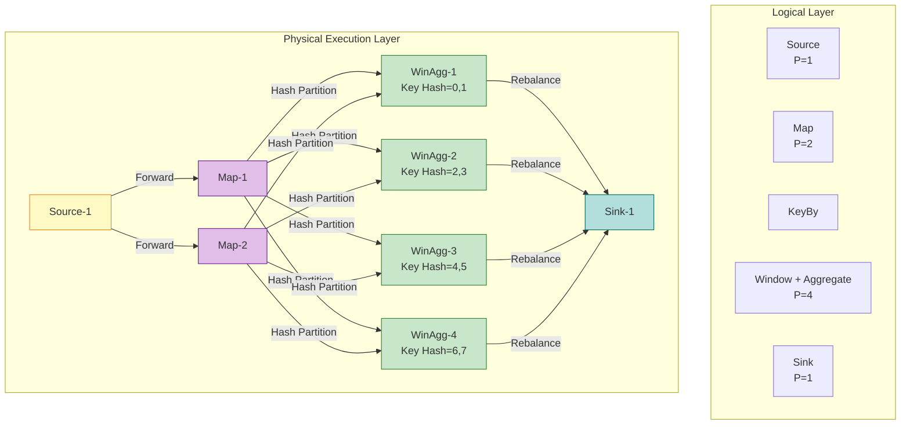
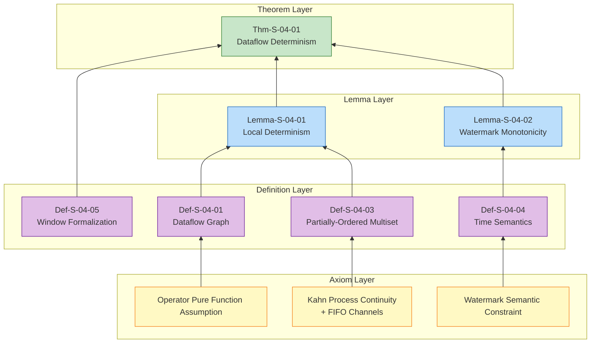

# Dataflow Model Formalization

> **Stage**: Struct/01-foundation | **Prerequisites**: [01.01-unified-streaming-theory](./01.01-unified-streaming-theory.md) | **Formalization Level**: L5

## 1. Definitions

### Def-S-04-01 (Dataflow Graph)

A **Dataflow Graph** is a directed acyclic graph (DAG) defined as a quintuple:

$$
\mathcal{G} = (V, E, P, \Sigma, \mathbb{T})
$$

| Symbol | Type | Semantics |
|--------|------|-----------|
| $V = V_{src} \cup V_{op} \cup V_{sink}$ | finite set | vertices: sources, operators, sinks |
| $E \subseteq V \times V \times \mathbb{L}$ | labeled directed edges | data dependencies; label $\ell \in \mathbb{L}$ denotes partition strategy |
| $P: V \to \mathbb{N}^+$ | parallelism function | assigns positive parallelism to each operator |
| $\Sigma: V \to \mathcal{P}(Stream)$ | stream type signature | input/output stream types per vertex |
| $\mathbb{T}$ | time domain | event time value range, typically $\mathbb{N}$ or $\mathbb{R}^+$ |

**Constraints**:

1. **Acyclicity**: $\forall k \geq 1, E^k \cap \{(v,v) \mid v \in V\} = \emptyset$
2. **Source/Sink existence**: $\exists v_{src}, v_{sink}$ with $\text{in-degree}(v_{src}) = 0$ and $\text{out-degree}(v_{sink}) = 0$
3. **Parallelism consistency**: for edge $(u, v)$, downstream input partitions must be compatible with upstream output partitions

**Intuition**: The Dataflow graph is the logical skeleton of a streaming program, describing where data comes from, which transformations it undergoes, where it goes, and how many parallel instances each transformation needs [^1][^3].

---

### Def-S-04-02 (Operator Semantics)

An **Operator** is a computational unit transforming data streams, defined as a quadruple:

$$
Op = (f_{compute}, \Sigma_{in}, \Sigma_{out}, \tau_{trigger})
$$

Where:

- $f_{compute}: \mathcal{D}^* \times \mathcal{S} \to \mathcal{D}^* \times \mathcal{S}$: compute function mapping input record sequences and current state to output sequences and new state
- $\Sigma_{in}$ / $\Sigma_{out}$: input / output port type signatures
- $\tau_{trigger}: \mathcal{S} \times \mathbb{T} \to \{\text{FIRE}, \text{CONTINUE}\}$: optional trigger predicate for window operators

**Standard Operator Types**:

| Operator | Semantics | Formal Definition |
|----------|-----------|-------------------|
| **Source** | produces stream from unbounded source | $\text{Source}(s): \emptyset \to \text{Stream}\langle\mathcal{D}\rangle$ |
| **Map**$(f)$ | one-to-one transform | $\forall e \in \text{Input}, \; \text{output}(e) = f(e)$ |
| **FlatMap**$(f)$ | one-to-many unfold | $\forall e \in \text{Input}, \; \text{output}(e) = \text{flatten}(f(e))$ |
| **KeyBy**$(\kappa)$ | key-based logical partition | $\forall e \in \text{Input}, \; \text{partition}(e) = \text{hash}(\kappa(e)) \bmod P(v)$ |
| **Window**$(w, t)$ | window assignment & trigger | $\forall e \in \text{Input}, \; W(e) = w(t_e(e))$; trigger when condition satisfied |
| **Reduce**$(\oplus)$ | associative aggregation | $\text{Reduce}(S) = \bigoplus_{e \in S} e$ |
| **Sink** | data persistence | $\text{Sink}: \text{Stream}\langle\mathcal{D}\rangle \to \emptyset$ |

**Intuition**: Stateless operators (Map/FlatMap) transform element-wise; stateful operators (KeyBy/Window/Reduce) group by key and aggregate over time windows. Distinguishing stateful from stateless is prerequisite for analyzing fault tolerance and consistency [^2][^3].

---

### Def-S-04-03 (Stream as Partially-Ordered Multiset)

In the Dataflow model, a **Stream** is not a simple sequence but a **multiset** with a time-based partial order:

$$
\mathcal{S} = (M, \mu, \preceq, t_e, t_p)
$$

Where:

- $M \subseteq \mathcal{D} \times \mathbb{T} \times \mathbb{T}$: records $r = \langle \text{payload}, t_{event}, t_{proc} \rangle$
- $\mu: M \to \mathbb{N}^+$: multiplicity function allowing duplicate payloads/timestamps
- $t_e: M \to \mathbb{T}$: **event time**—when $r$ occurred in business logic
- $t_p: M \to \mathbb{T}$: **processing time**—when $r$ was processed by the system
- $\preceq \subseteq M \times M$: event-time partial order:
  $$r_1 \preceq r_2 \iff t_e(r_1) < t_e(r_2) \lor (t_e(r_1) = t_e(r_2) \land r_1 = r_2)$$

When $t_e(r_1) = t_e(r_2)$ and $r_1 \neq r_2$, $r_1$ and $r_2$ are **concurrent**, denoted $r_1 \parallel r_2$.

**Processing order** is a total order $\prec_{proc}$, a **linear extension** of $\preceq$:
$$r_1 \preceq r_2 \implies r_1 \prec_{proc} r_2 \lor r_1 \parallel r_2$$

Due to network disorder, $\prec_{proc}$ may be inconsistent with $\preceq$—the fundamental reason streaming systems need Watermark mechanisms.

**Intuition**: Defining streams as partially-ordered multisets emphasizes the decoupling between event time (intrinsic to records) and processing time (machine clock observation). Event time is the only reliable source of business-logic time [^1][^6].

---

### Def-S-04-04 (Event Time, Processing Time, and Watermark)

**Event Time**:
$$
t_e: \mathcal{D} \to \mathbb{T}
$$
The time at which a data element occurred at its source, carried by the data itself.

**Processing Time**:
$$
t_p: () \to \mathbb{T}_{wall}
$$
The time at which an element is actually processed by an operator instance, determined by the distributed machine's local system clock.

**Watermark**:
$$
w: \text{Stream} \to \mathbb{T} \cup \{+\infty\}
$$
A special progress beacon with semantic constraint:
$$
\forall r \in \mathcal{S}, \quad \text{if } t_e(r) \leq w(\mathcal{S}) \text{ then } r \text{ has arrived or will never arrive.}
$$

**Watermark Generation Strategies**:

- **Periodic**: $w(t) = \max_{r \in \text{observed}} t_e(r) - L$, where $L$ = max out-of-order tolerance
- **Punctuated**: explicitly injected by special punctuation events
- **Monotonic**: $w(t) = \max_{r \in \text{observed}} t_e(r)$, assuming strictly ordered source

**Intuition**: Watermark is a "lower-bound estimate" of event-time progress. It tells downstream: "all events with timestamp ≤ current Watermark should have arrived." Window operators rely on Watermark to determine when a window can be safely closed [^1][^2].

---

### Def-S-04-05 (Window Formalization)

A **Window Operator** partitions infinite event time into finite buckets, defined as a quadruple:

$$
\text{WindowOp} = (W, A, T, F)
$$

Where:

- $W: \mathcal{D} \to \mathcal{P}(\text{WindowID})$: **Window Assigner**
- $A: \text{WindowID} \to \text{Accumulator}$: **Window State**
- $T: \text{WindowID} \times \mathbb{T} \to \{\text{FIRE}, \text{CONTINUE}\}$: **Trigger**
- $F \in \mathbb{T}$: **Allowed Lateness**

For event-time window $wid = [t_{start}, t_{end})$, the trigger condition is:
$$
T(wid, w) = \text{FIRE} \iff w \geq t_{end} + F
$$

Window semantic output:
$$
\text{Output}(wid) = \bigoplus_{\{r \in \mathcal{S} \mid wid \in W(r) \land t_e(r) \leq w(\tau_{fire})\}} r
$$

**Standard Window Types**:

| Window Type | Definition | Example |
|-------------|------------|---------|
| **Tumbling** | $[n\delta, (n+1)\delta)$ | fixed size, non-overlapping |
| **Sliding** | $[n \cdot \text{slide}, n \cdot \text{slide} + \delta)$ | fixed size, may overlap |
| **Session** | dynamic, defined by activity gap $gap$ | closes when inactivity > $gap$ |

**Intuition**: Windows are the bridge from "record-by-record computation" to "batch aggregation" on streams [^1][^3].

---

## 2. Properties

### Lemma-S-04-01 (Operator Local Determinism)

**Statement**: In Dataflow graph $\mathcal{G}$, if operator $op \in V_{op}$ has a pure compute function $f_{compute}$ (no external side effects, no nondeterministic inputs) and its input stream as a partially-ordered multiset is fixed, then for given input, $op$'s output stream is uniquely determined.

**Proof**:

1. By Def-S-04-02, operator output depends only on input records and current state.
2. If $f_{compute}$ is pure, identical input and state always produce identical output.
3. By Def-S-04-01, partition strategy is deterministic for given record $r$ and parallel topology.
4. Therefore each operator instance receives a deterministic input multiset.
5. By functional mapping determinism, the output multiset is also unique. ∎

> **Inference [Model→Implementation]**: Local determinism means systems like Flink can safely adopt out-of-order execution, speculative execution, or dynamic rescheduling without breaking result correctness [^4][^7].

---

### Lemma-S-04-02 (Watermark Monotonicity)

**Statement**: During Dataflow graph execution, any operator instance's current Watermark $w_v$ is monotonically non-decreasing with processing time:
$$
\forall v \in V, \; \forall \tau_1 < \tau_2, \quad w_v(\tau_1) \leq w_v(\tau_2)
$$

**Proof**:

1. By Def-S-04-04, Source Watermark is based on max observed event time minus delay estimate. As new records arrive, max observed event time is non-decreasing, so Source Watermark is non-decreasing.
2. For single-input operators (Map, Filter), output Watermark directly passes through input Watermark; monotonicity preserved.
3. For multi-input operators (Join, CoGroup), output Watermark is $\min_i w_{in_i}$. The minimum function is monotonic in its arguments: if all inputs are non-decreasing, so is their minimum.
4. Since the Dataflow graph is an acyclic DAG (Def-S-04-01), topological-sort induction guarantees monotonicity for all operators. ∎

> **Inference [Control→Execution]**: Watermark monotonicity requires the execution layer to guarantee control records (Watermarks) propagate in FIFO order without reordering or loss [^2][^3].

---

### Prop-S-04-01 (Idempotency Condition for Stateful Operators)

**Statement**: If a Keyed state operator's state transition function $\delta$ is associative, and records of the same key are always routed to the same parallel instance, then replay after fault recovery is idempotent.

**Proof**:

1. Let $R_k$ be the record set for key $k$. During failure-free continuous processing, final state is $s'(k) = \text{fold}(\delta, s(k), R_k)$.
2. Since $\delta$ is associative, $\text{fold}(\delta, s(k), R_k)$ is independent of processing order (depends only on the record set).
3. By Def-S-04-02, KeyBy Hash partitioning ensures all $R_k$ records are always processed by the same task instance.
4. After fault recovery, even if replay changes record order, as long as $R_k$'s set is unchanged, final state matches the failure-free case.
5. Therefore replay is idempotent. ∎

> **Inference [Execution→Data]**: Idempotency is the data-layer foundation for end-to-end Exactly-Once semantics. It requires state aggregation operations (sum, count, max) to be based on associative accumulator functions [^2][^6].

---

## 3. Relations

### Relation 1: Dataflow Model `⊃` Kahn Process Networks (KPN)

- **Encoding existence**: Each Kahn process can be encoded as a Dataflow operator; FIFO channels correspond to Dataflow edges. Kahn blocking read maps to Dataflow data-availability triggers [^4].
- **Separation result**: Dataflow supports explicit parallelism function $P$, partition strategies, stateful window aggregation, and unified event-time semantics—none of which exist in classical KPN. KPN assumes single-process sequential execution and unbounded FIFO; Dataflow explicitly handles parallel instances and finite buffers.

**Conclusion**: Kahn networks are a theoretical subset of the Dataflow model.

---

### Relation 2: SDF `⊂` DDF `≈` Dataflow Model

- **Encoding existence**: SDF is a special case of DDF—when all node trigger rules are static and production/consumption rates are constant, DDF degenerates to SDF [^5]. Flink's DataStream API (supporting iteration, dynamic branching) belongs to DDF.
- **Static vs Dynamic**: SDF's static schedulability (compile-time scheduling table and buffer bounds) makes it the theoretical basis for batch mode (bounded streams); DDF's Turing-completeness enables general stream computation at the cost of generally undecidable scheduling analysis [^7].

**Conclusion**: The Dataflow model is compatible with both SDF subsets (for static optimization) and DDF supersets (for general expression), serving as a unified framework connecting theory and engineering.

---

### Relation 3: Dataflow Theory Model `↦` Flink Runtime Implementation

- **Three-layer graph transformation**: Flink Runtime transforms logical Dataflow graph into three execution graphs: StreamGraph (logical) → JobGraph (merged chainable operators) → ExecutionGraph (parallel instances bound to Slots) [^3].
- **Semantic preservation**: StreamGraph to JobGraph operator chaining is equivalent to function composition, preserving record-level semantics. JobGraph to ExecutionGraph parallel expansion preserves partition strategy determinism.
- **State mapping**: Flink's `KeyedStateBackend` implements Dataflow model's state space $\mathcal{S}$ and transition function $\delta$.
- **Time mapping**: Flink's `WatermarkGenerator` and `WindowOperator` implement Def-S-04-04 and Def-S-04-05.

> **Inference [Theory→Model]**: Kahn determinism (theory) guarantees Dataflow model correctness; DDF Turing-completeness (model) implies Flink (implementation) cannot rely on static tools to completely detect all deadlocks [^4][^5][^7].

---

## 4. Argumentation

### 4.1 Computation Determinism on Partially-Ordered Multisets

In batch models, data is viewed as a set or bag where computation result is order-independent. In stream models, event-time partial order $\preceq$ introduces complexity: computation determinism depends on respecting the partial-order structure.

**Key observation**: For stateless operators Map$(f)$, since $f$ is applied element-wise, concurrent relations do not affect output—the output multiset is simply $\{f(r) \mid r \in \mathcal{S}\}$. For stateful operators Reduce$(\oplus)$, if $\oplus$ is both associative and commutative, result is order-independent; if only associative, result depends on the linear extension order seen by each instance, but since same-key records are routed to the same instance (Def-S-04-02), that instance sees a deterministic linear extension, so the final result is still deterministic.

---

### 4.2 Watermark Semantics and Window Closure Boundary

Watermark $w$'s semantics is "all events with timestamp $\leq w$ have arrived or will never arrive" (Def-S-04-04). This is a **probabilistic guarantee**, not absolute—for periodic Watermark $w(t) = \max t_e - L$, a late record $r$ with $t_e(r) \leq w$ but arriving after $w$ will be dropped or sent to side output.

This means:

- When $L$ ≥ actual disorder degree: window results are **complete and correct**.
- When $L$ < actual disorder degree: window results are **deterministic but incomplete** (late events missed).
- When $L$ >> actual disorder degree: window results are complete but **high-latency**.

This boundary is the formal manifestation of the Dataflow model's "correctness-latency-cost" triangle trade-off [^1].

---

### 4.3 Counter-Example: Non-FIFO Channel Destroys Determinism

Assume edge $(u, v)$ is implemented as an out-of-order queue. $u$ sends $\langle r_1, r_2 \rangle$ ($t_e(r_1) < t_e(r_2)$), but $v$ receives $\langle r_2, r_1 \rangle$. If $v$ is a stateful Reduce$(\oplus)$ where $\oplus$ is non-commutative string concatenation, then:

- Correct order: result = "1" + "2" = "12"
- Out-of-order: result = "2" + "1" = "21"

This violates Thm-S-04-01's FIFO assumption, destroying global determinism. Engineering implementations must guarantee network channel FIFO semantics—Flink uses Netty TCP connections and sequence numbers to maintain per-partition FIFO order [^3][^4].

---

## 5. Proof

### Thm-S-04-01 (Dataflow Determinism Theorem)

**Statement**: Given a Dataflow graph $\mathcal{G} = (V, E, P, \Sigma, \mathbb{T})$, if:

1. All operators $op \in V_{op}$ have pure compute functions $f_{compute}$ (no external side effects);
2. All dataflow edges $e \in E$ guarantee FIFO transmission order;
3. Input sources produce a fixed partially-ordered multiset (i.e., event-time partial-order structure $M_{in}$ is fixed);

Then for given input, the Dataflow graph's output stream (as a partially-ordered multiset) is **uniquely determined**, independent of scheduling strategy, execution speed, or parallel instance activation order.

**Proof**:

**Step 1: Establish local determinism**
By Lemma-S-04-01, for any operator $op \in V$, if its input multiset and current state are fixed, its output multiset and updated state are uniquely determined, because $f_{compute}$ is pure and partition strategy is deterministic (Def-S-04-01).

**Step 2: Establish topological induction base case**
Consider topological sort $v_1, v_2, \ldots, v_n$ (guaranteed by Def-S-04-01 acyclicity).

- For base case $v_1$ (Source), output is determined by fixed input multiset $M_{in}$. Event-time partial order $\preceq$ is fixed, so Source-generated stream (including Watermark generation strategy) is deterministic.
- Source output transmits via FIFO edge $e = (v_1, v_2)$. By FIFO assumption, downstream receives a unique linear extension of Source's output sequence.

**Step 3: Establish topological induction step**
Assume outputs of layers $1, 2, \ldots, k-1$ are uniquely determined. Consider layer-$k$ operator $v_k$:

- $v_k$'s inputs come from one or more layer-$(k-1)$ operators. By induction hypothesis, these upstream outputs are already unique.
- By FIFO assumption, each input edge carries a deterministic record sequence.
- Therefore $v_k$'s received input multiset is deterministic.
- By Step 1 local determinism, $v_k$'s output multiset is also unique.

**Step 4: Handle multi-input operator Watermarks**
For multi-input operators (Join, CoGroup), output Watermark is $w_{out} = \min_i w_{in_i}$ (Def-S-04-04). By Lemma-S-04-02, all input Watermarks are monotonic non-decreasing, so their minimum is also monotonic. Watermark determinism guarantees deterministic window trigger times (Def-S-04-05), and thus deterministic window operator output multisets.

**Step 5: Conclusion**
By mathematical induction, from Source layer to Sink layer, all operators' outputs are uniquely determined. Therefore the entire graph's final output is deterministic, independent of scheduling strategy, execution speed, or relative speeds of parallel instances. ∎

> **Inference [Theory→Model]**: The Dataflow Determinism Theorem guarantees that as long as operator purity and channel FIFO are maintained, the system can safely adopt dynamic scheduling, out-of-order execution, and speculative execution without breaking correctness [^1][^4][^7].
>
> **Inference [Model→Implementation]**: This theorem provides the theoretical basis for Flink's Checkpoint fault-tolerance mechanism—even if failure causes replay and rescheduling, recovered output remains consistent with failure-free continuous processing (assuming state transition functions are associative, per Prop-S-04-01) [^2][^6].

---

## 6. Examples

### Example: WordCount Dataflow Formalization

```java
// Pseudocode showing core logic only
DataStream<String> text = env.socketTextStream("localhost", 9999);

DataStream<Tuple2<String, Integer>> wordCounts = text
    .flatMap(new Tokenizer())
    .keyBy(value -> value.f0)
    .window(TumblingEventTimeWindows.of(Time.seconds(5)))
    .aggregate(new CountAggregate());
```

**Formalization**:

1. **Graph construction**:
   - $V = \{\text{Source}, \text{FlatMap}, \text{KeyBy/Window}, \text{Aggregate}, \text{Sink}\}$
   - $E = \{(\text{Source}, \text{FlatMap}), (\text{FlatMap}, \text{KeyBy/Window}), (\text{KeyBy/Window}, \text{Aggregate}), (\text{Aggregate}, \text{Sink})\}$
   - $P(\text{FlatMap}) = 2, P(\text{KeyBy/Window}) = 4, P(\text{Aggregate}) = 4$

2. **Stream formalization**: Input stream $\mathcal{S}_{in}$ contains $(\text{"hello world"}, t_e=1000, t_p=1002)$. After FlatMap, two records: $(\text{"hello"}, t_e=1000)$ and $(\text{"world"}, t_e=1000)$. Since $t_e$ is equal, these records are concurrent ($r_{hello} \parallel r_{world}$).

3. **KeyBy partitioning**: Hash("hello") % 4 = 1, Hash("world") % 4 = 3. $r_{hello}$ routes to Aggregate instance 1, $r_{world}$ to instance 3. Same-word records always hash to the same instance, making per-instance counters deterministic.

4. **Window triggering**: Window assigner $W$ maps $t_e=1000$ to $[0, 5000)$. When Watermark advances to $w \geq 5000 + F$, trigger $T$ returns FIRE.

5. **Determinism verification**: Regardless of FlatMap parallel instance speeds, regardless of which record is processed first, as long as the input multiset is fixed, the final counts in window [0,5000) are uniquely determined—directly guaranteed by Thm-S-04-01.

---

## 7. Visualizations

### Dataflow Graph Structure



**Legend**: Yellow = source producing unbounded stream and initial Watermark; Purple = stateless transform operators; Green = stateful window aggregation operators (Hash partition ensures same-key records route to same instance—key to state consistency); Cyan = sink rebalancing all upstream results.

---

### Concept Dependency and Proof Tree



**Legend**: Bottom yellow = axioms; Middle purple = core formal definitions; Blue = lemmas bridging definitions to theorems; Top green = Dataflow Determinism Theorem, proved via topological induction combined with local determinism.

---

## 8. References

[^1]: T. Akidau et al., "The Dataflow Model: A Practical Approach to Balancing Correctness, Latency, and Cost in Massive-Scale, Unbounded, Out-of-Order Data Processing," *PVLDB*, 8(12), 2015.
[^2]: T. Akidau et al., "MillWheel: Fault-Tolerant Stream Processing at Internet Scale," *VLDB*, 2013.
[^3]: Apache Flink Documentation, "Flink Architecture," 2025. <https://nightlies.apache.org/flink/flink-docs-stable/docs/concepts/flink-architecture/>
[^4]: G. Kahn, "The semantics of a simple language for parallel programming," *IFIP*, 1974.
[^5]: E.A. Lee and D.G. Messerschmitt, "Synchronous data flow," *Proc. IEEE*, 1987.
[^6]: K.M. Chandy and L. Lamport, "Distributed Snapshots: Determining Global States of Distributed Systems," *ACM Trans. Comput. Syst.*, 3(1), 1985.
[^7]: P. Carbone et al., "Apache Flink: Stream and Batch Processing in a Single Engine," *IEEE Data Eng. Bull.*, 38(4), 2015.

---

*Document Version: v1.0-en | Updated: 2026-04-20 | Status: Core Summary*
