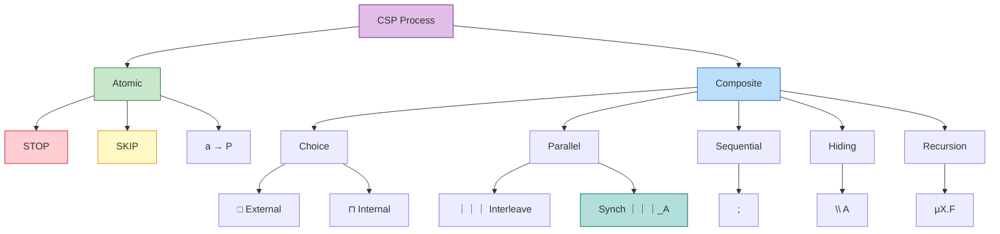
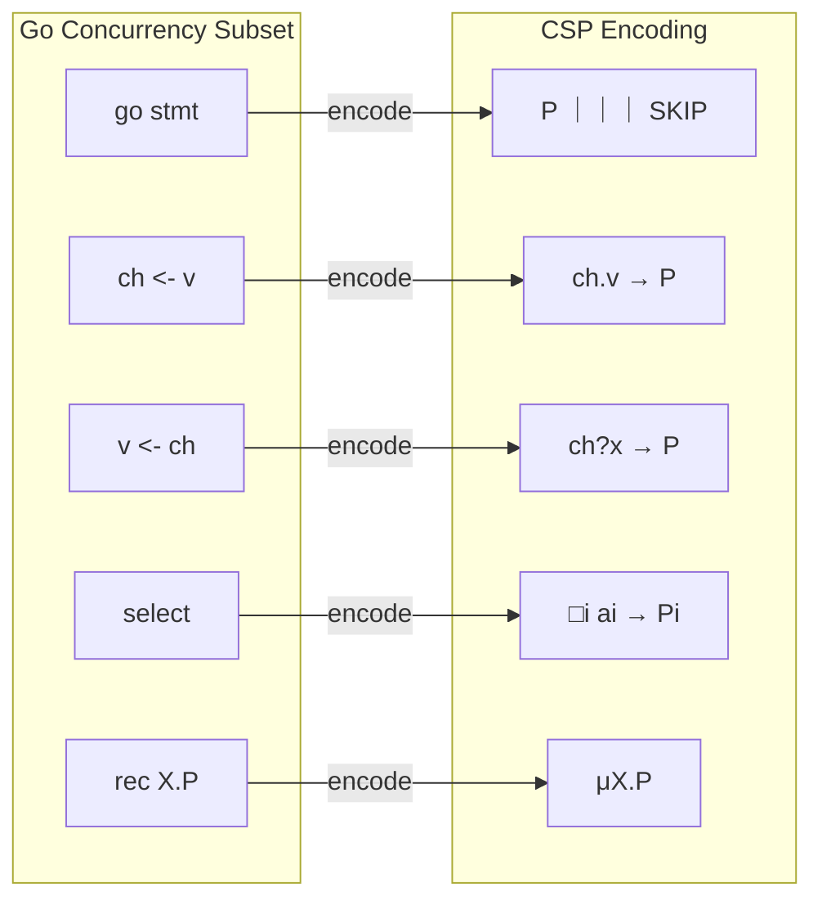

# CSP Formalization

> **Stage**: Struct/01-foundation | **Prerequisites**: [01.02-process-calculus-primer](./01.02-process-calculus-primer-en.md) | **Formalization Level**: L3

---

## 1. Definitions

### Def-S-05-01 (CSP Core Syntax)

The core syntax of CSP [^1][^2]:

$$
\begin{aligned}
P, Q ::= &\ \text{STOP} \mid \text{SKIP} \mid a \to P \mid P \mathbin{\square} Q \mid P \mathbin{\sqcap} Q \\
       &\mid P \mathbin{|||} Q \mid P \mathbin{\parallel_A} Q \mid P \setminus A \mid P; Q \mid \mu X.F(X)
\end{aligned}
$$

Where $\Sigma$ is the global event alphabet, $\tau \notin \Sigma$ is the internal action, and $\checkmark \in \Sigma$ is the successful termination event. External choice $\square$ is resolved by the environment, while internal choice $\sqcap$ represents autonomous nondeterminism.

**Intuition**: CSP composes concurrent processes through explicit events. Synchronous parallel $\parallel_A$ precisely controls which events require all parties to be ready simultaneously, and the hiding operator $\setminus A$ supports modular abstraction.

**Rationale**: Static naming and compositional operators enable tools such as FDR4 to perform exhaustive verification on finite-state subsets. The STOP/SKIP distinction underpins refinement relations and multi-level semantic models [^3].



*Figure 1-1: Hierarchy of CSP process combinators. Atomic processes are composed through choice, parallel, sequential, hiding, and recursive operators.*

---

### Def-S-05-02 (CSP Structured Operational Semantics)

Core SOS rules [^2][^3]:

```
              a → P ─a→ P                           [Prefix]

              P ─a→ P'
[Ext-L] ────────────────────
              P □ Q ─a→ P'

              Q ─a→ Q'
[Ext-R] ────────────────────
              P □ Q ─a→ Q'

              P ─τ→ P'
[Int-L] ────────────────────
              P ⊓ Q ─τ→ P'

              Q ─τ→ Q'
[Int-R] ────────────────────
              P ⊓ Q ─τ→ Q'

              P ─a→ P'
[Inter-L] ─────────────────────────
              P ||| Q ─a→ P' ||| Q

              Q ─a→ Q'
[Inter-R] ─────────────────────────
              P ||| Q ─a→ P ||| Q'

              P ─a→ P'        Q ─a→ Q'
[Sync] ───────────────────────────────────────
              P |[A]| Q ─a→ P' |[A]| Q'    (a ∈ A)

              P ─a→ P'        a ∉ A
[Sync-L] ───────────────────────────────────────
              P |[A]| Q ─a→ P' |[A]| Q

              Q ─a→ Q'        a ∉ A
[Sync-R] ───────────────────────────────────────
              P |[A]| Q ─a→ P |[A]| Q'

              P ─a→ P'        a ∈ A
[Hide] ───────────────────────────────────────
              P \ A ─τ→ P' \ A

              P ─a→ P'        a ∉ A
[Hide-Vis] ─────────────────────────────────────
              P \ A ─a→ P' \ A

              P ─a→ P'        a ≠ ✓
[Seq-L] ───────────────────────────────────────
              P ; Q ─a→ P' ; Q

              P ─✓→ P'
[Seq-R] ───────────────────────────────────────
              P ; Q ─τ→ Q

              F[μX.F/X] ─a→ P'
[Rec] ───────────────────────────────────────
              μX.F ─a→ P'
```

**Intuition**: SOS translates CSP syntax into a labeled transition system. Rule **[Sync]** requires events in the synchronization set $A$ to be jointly participated in by all parties, enabling multi-way synchronous handshake. **[Hide]** internalizes specified events into invisible $\tau$.

**Rationale**: SOS provides the transition relation foundation for trace semantics, failures semantics, and bisimulation equivalence, and is the theoretical basis for industrial-grade CSP model checking [^3].

---

### Def-S-05-03 (Trace, Failures, and Divergences Semantics)

#### Trace Semantics

The trace set of process $P$, denoted $\text{traces}(P) \subseteq (\Sigma \cup \{\checkmark\})^*$, is inductively defined as [^2][^3]:

$$
\begin{aligned}
\text{traces}(\text{STOP}) &= \{\varepsilon\} \\
\text{traces}(\text{SKIP}) &= \{\varepsilon, \langle \checkmark \rangle\} \\
\text{traces}(a \to P) &= \{\varepsilon\} \cup \{a \cdot s \mid s \in \text{traces}(P)\} \\
\text{traces}(P \mathbin{\square} Q) &= \text{traces}(P) \cup \text{traces}(Q) \\
\text{traces}(P \mathbin{\sqcap} Q) &= \text{traces}(P) \cup \text{traces}(Q) \\
\text{traces}(P \mathbin{|||} Q) &= \{\text{interleave}(s, t) \mid s \in \text{traces}(P), t \in \text{traces}(Q)\} \\
\text{traces}(P \setminus A) &= \{s \restriction (\Sigma \setminus A) \mid s \in \text{traces}(P)\} \\
\text{traces}(P; Q) &= \text{traces}(P) \mathbin{;\!\!_\checkmark} \text{traces}(Q) \\
\text{traces}(\mu X.F) &= \bigcup_{n \geq 0} \text{traces}(F^n[\text{STOP}/X])
\end{aligned}
$$

#### Failures Semantics

The failures set is defined as [^3]:

$$
\text{failures}(P) = \{(s, X) \mid s \in \text{traces}(P), P \text{ after } s \text{ can refuse } X\}
$$

Trace semantics cannot distinguish $\square$ from $\sqcap$, but failures semantics can: e.g., $a \to \text{STOP} \mathbin{\square} b \to \text{STOP}$ and $a \to \text{STOP} \mathbin{\sqcap} b \to \text{STOP}$ have identical traces but different failure sets.

#### Divergences Semantics

The divergences set is defined as [^3]:

$$
\text{divergences}(P) = \{s \cdot t \mid s \in \text{traces}(P), \exists Q \in (P \text{ after } s). Q \xrightarrow{\tau^\omega}\}
$$

The hiding operator $\setminus A$ can introduce divergence: if $P$ loops infinitely on events in $A$, then $P \setminus A$ enters an invisible infinite $\tau$ sequence (livelock).

**Intuition**: Trace semantics captures "what can be done"; failures semantics further captures "what may be refused"; divergences semantics captures "whether the process enters an invisible infinite loop." These three levels, from coarse to fine, support CSP's $T$, $F$, and $FD$ refinement relations.

---

### Def-S-05-04 (CSP Channels and Synchronization Primitives)

The channel event alphabet is defined as $\Sigma = \bigcup_{c \in \mathcal{C}} \{c.v \mid v \in \mathcal{V}_c\} \cup \{\checkmark\}$. Syntactic sugar [^2][^3]:

- **Input prefix**: $c?x \to P \equiv \square_{v} (c.v \to P[v/x])$
- **Output prefix**: $c!v \to P \equiv c.v \to P$
- **Synchronization event**: $c.v$ is a single atomic event jointly participated in by sender and receiver.

**Multi-way synchronization**: CSP's $\parallel_A$ supports any number of processes synchronizing on the same event (barrier synchronization), not limited to binary handshake. Channel directionality is realized by restricting process alphabets: an alphabet containing only output events corresponds to a sender, and only input events corresponds to a receiver.

**Intuition**: CSP channels are synchronous handshake points rather than message queues. The communication event $c.v$ is instantaneous and atomic. This design eliminates the complexity of asynchronous buffering, making model checking more tractable; asynchronous semantics can be encoded via auxiliary buffer processes [^3].

---

### Def-S-05-05 (Go-CS-sync to CSP Encoding)

The encoding $[\![ \cdot ]\!]$ from Go-CS-sync (a Go concurrency subset with only unbuffered channels) to CSP is defined as [^6][^7]:

| Go Construct | CSP Encoding |
|---------|----------|
| $0$ | $\text{STOP}$ |
| $\text{go}\ P$ | $[\![P]\!] \mathbin{|||} \text{SKIP}$ |
| $ch \leftarrow v; P$ | $ch.v \to [\![P]\!]$ |
| $x := \leftarrow ch; P$ | $ch?x \to [\![P]\!]$ |
| $P; Q$ | $[\![P]\!]; [\![Q]\!]$ |
| $\text{select}\ \{\text{case}_i : P_i\}$ | $\square_i\ (a_i \to [\![P_i]\!])$ |
| $\text{rec}\ X.P$ | $\mu X.[\![P]\!]$ |

Where $a_i$ is the first event of branch $i$ (send as $ch_i.v_i$, receive as $ch_i?x_i$).

**Intuition**: `go` maps to interleaving parallel, channel operations map to synchronous event prefixes, `select` maps to external choice, and recursion maps to the $\mu$ operator.

**Rationale**: This encoding reduces analysis of Go-CS-sync to the CSP theoretical framework, enabling tools such as FDR4 to verify deadlock freedom and refinement relations, while clearly identifying the semantic boundaries between Go and CSP [^3][^7].

---

## 2. Properties

### Property 1 (Prefix Closure of CSP Trace Sets)

**Statement**: $\text{traces}(a \to P)$ is prefix-closed.

**Derivation**:

1. By Def-S-05-03, $\text{traces}(a \to P) = \{\varepsilon\} \cup \{a \cdot s \mid s \in \text{traces}(P)\}$.
2. For any $s \in \text{traces}(P)$, the prefixes of $a \cdot s$ are $\varepsilon$ or $a \cdot s'$ where $s'$ is a prefix of $s$.
3. Trace semantics guarantees prefix closure, so $s' \in \text{traces}(P)$, hence $a \cdot s' \in \text{traces}(a \to P)$. ∎

### Property 2 (Associativity and Commutativity of Interleaving)

**Statement**: $P \mathbin{|||} (Q \mathbin{|||} R) = (P \mathbin{|||} Q) \mathbin{|||} R$ and $P \mathbin{|||} Q = Q \mathbin{|||} P$.

**Derivation**:

1. By Def-S-05-03, $\text{traces}(P \mathbin{|||} Q) = \{\text{interleave}(s,t)\}$.
2. Sequence interleaving satisfies associativity and commutativity (preserving internal order of each subsequence with no priority between subsequences).
3. Therefore associativity and commutativity hold at the trace-set level. ∎

### Property 3 (Monotonicity of External Choice Ready Set)

**Statement**: $\text{ready}(P \mathbin{\square} Q) = \text{ready}(P) \cup \text{ready}(Q)$.

**Derivation**:

1. By SOS rules **[Ext-L]** and **[Ext-R]**, the initial transitions of $P \mathbin{\square} Q$ can only come from $P$ or $Q$.
2. External choice has no internal $\tau$ rules, so the initial executable event set is exactly the union of the two subprocesses. ∎

### Property 4 (Degeneration of Synchronous Parallel on Empty Sync Set)

**Statement**: $P \mathbin{\parallel_\emptyset} Q = P \mathbin{|||} Q$.

**Derivation**:

1. When $A = \emptyset$, $s \restriction A = \varepsilon$, so the synchronization condition is trivially satisfied.
2. Trace semantics degenerates to $s \in \text{interleave}(\text{traces}(P), \text{traces}(Q))$, which is interleaving semantics. ∎

### Property 5 (Atomicity Equivalence of Go Unbuffered Channel and CSP Synchronization)

**Statement**: In Go-CS-sync, successful unbuffered channel communication corresponds to a single internal $\tau$ transition; in CSP it corresponds to a single synchronization event $ch.v$.

**Derivation**:

1. Go unbuffered send/receive requires both parties to be ready simultaneously; the runtime reduces this to a single internal $\tau$ transition [^6].
2. The CSP encoding maps send/receive to the same event $ch.v$, which under $\parallel_{\{ch.v\}}$ requires both parties to participate simultaneously (rule **[Sync]**).
3. Therefore both are equivalent in atomicity and simultaneity constraints. ∎

---

## 3. Relations

### Relation 1: CSP and CCS Semantic Incomparability

CSP is based on trace/failures/divergences semantics, while CCS is based on bisimulation semantics. Strong bisimulation is finer than trace equivalence, but incomparable with failures equivalence; CSP's STOP/SKIP distinction cannot be preserved precisely in CCS. Therefore CSP $\perp$ CCS (semantically incomparable). See [01.02-process-calculus-primer.md](./01.02-process-calculus-primer-en.md) for details [^4][^5].

### Relation 2: Expressiveness Inclusion between CSP and π-calculus

There exists a trace-preserving encoding from CSP to π-calculus, but π-calculus supports runtime name creation $(\nu a)$ and name passing, which CSP's static naming cannot simulate dynamic topology changes. Therefore **CSP $\subset$ π-calculus** (strictly weaker), corresponding to expressiveness level L₃ $\subset$ L₄. See [01.02-process-calculus-primer.md](./01.02-process-calculus-primer-en.md) for Def-S-02-03 and Thm-S-02-01 [^4][^5].

### Relation 3: Trace Semantic Equivalence between Go-CS-sync and CSP

By the encoding function of Def-S-05-05, there exists a bidirectional translation: Go-CS-sync $\mapsto$ CSP and CSP $\mapsto$ Go-CS-sync. Thm-S-05-01 will strictly prove their equivalence under trace semantics. Therefore **Go-CS-sync $\iff$ CSP** (L₃ equivalence) [^7].

### Relation 4: Go select to CSP External Choice Mapping

Go's `select` depends on which channel operation is ready in the environment, consistent with CSP external choice $\square$'s "environment resolves the branch" semantics. When multiple cases are ready simultaneously, Go's pseudorandom choice is externally observationally equivalent to nondeterminism. Therefore `select` $\mapsto$ $\square$. If `default` is included, the semantics deviates to a sliding choice or mixed internal choice [^7].

---

## 4. Argumentation

### Lemma-S-05-01 (Preservation of External Choice Ready Set)

**Statement**: Let $P = \square_{i \in I} (a_i \to P_i)$, then $\text{ready}(P) = \bigcup_{i \in I} \{a_i\}$.

**Proof**:

1. By SOS rules **[Ext-L]**/**[Ext-R]**, each branch $a_i \to P_i \xrightarrow{a_i} P_i$ can be lifted to the whole $P \xrightarrow{a_i} P_i$.
2. External choice has no internal $\tau$ rules; initial transitions can only come from sub-branches.
3. Therefore $\text{ready}(P)$ is exactly the union of the first events of all branches. ∎

### Lemma-S-05-02 (Trace Prefix Preservation under Synchronous Parallel)

**Statement**: If $P \mathbin{\parallel_A} Q \xrightarrow{\alpha} R$, then $\text{traces}(R) \subseteq \text{traces}(P \mathbin{\parallel_A} Q)$, and if $\alpha \neq \tau$, then $\alpha \cdot \text{traces}(R) \subseteq \text{traces}(P \mathbin{\parallel_A} Q)$.

**Proof**:

1. **Synchronized transition** ($\alpha \in A$): By **[Sync]**, $P \xrightarrow{\alpha} P'$ and $Q \xrightarrow{\alpha} Q'$, with $R = P' \mathbin{\parallel_A} Q'$. Since $\text{traces}(P') \subseteq \text{traces}(P)$ and similarly for $Q'$, trace set inclusion holds; for visible $\alpha$, $\alpha \cdot \text{traces}(P') \subseteq \text{traces}(P)$ and similarly for $Q'$, hence $\alpha \cdot \text{traces}(R) \subseteq \text{traces}(P \mathbin{\parallel_A} Q)$.
2. **Independent transition** ($\alpha \notin A$): Without loss of generality, assume $P \xrightarrow{\alpha} P'$ and $R = P' \mathbin{\parallel_A} Q$. The projection onto $A$ is unchanged; the projection onto $\Sigma \setminus A$ adds $\alpha$ and remains in the interleaving set. Hence the conclusion holds. ∎

---

## 5. Proof / Engineering Argument

### Thm-S-05-01 (Go-CS-sync to CSP Encoding Preserves Trace Semantics)

**Statement**: For any $Q \in \text{Go-CS-sync}$, $\text{traces}_{\text{Go}}(Q) = \text{traces}_{\text{CSP}}([\![Q]\!])$.

**Proof**: Structural induction on $Q$.

**Base case** ($Q = 0$): $\text{traces}_{\text{Go}}(0) = \{\varepsilon\}$, $[\![0]\!] = \text{STOP}$, and $\text{traces}_{\text{CSP}}(\text{STOP}) = \{\varepsilon\}$. ✓

**Inductive step**: Assume the property holds for all proper sub-processes of $Q$.

**Case 1: Send prefix** ($Q = ch \leftarrow v; P$): Go traces: $\text{traces}_{\text{Go}}(Q) = \{\varepsilon\} \cup \{ch.v \cdot s \mid s \in \text{traces}_{\text{Go}}(P)\}$. Encoding: $[\![Q]\!] = ch.v \to [\![P]\!]$, whose CSP traces are $\{\varepsilon\} \cup \{ch.v \cdot s \mid s \in \text{traces}_{\text{CSP}}([\![P]\!])\}$. By induction hypothesis, both are equal. ✓

**Case 2: Receive prefix** ($Q = x := \leftarrow ch; P$): After synchronization, Go executes $P[x/v]$ with traces $\{\varepsilon\} \cup \{ch.v \cdot s \mid s \in \text{traces}_{\text{Go}}(P[x/v])\}$. Encoding: $[\![Q]\!] = ch?x \to [\![P]\!]$, with CSP traces $\{\varepsilon\} \cup \{ch.v \cdot s \mid s \in \text{traces}_{\text{CSP}}([\![P]\!][v/x])\}$. By induction hypothesis, both are equal. ✓

**Case 3: External choice** ($Q = \text{select}\ \{\text{case}_i : P_i\}$): Let $a_i$ be the first event of branch $i$. Go traces: $\{\varepsilon\} \cup \bigcup_i \{a_i \cdot s \mid s \in \text{traces}_{\text{Go}}(P_i)\}$. Encoding: $[\![Q]\!] = \square_i (a_i \to [\![P_i]\!])$, CSP traces: $\{\varepsilon\} \cup \bigcup_i \{a_i \cdot s \mid s \in \text{traces}_{\text{CSP}}([\![P_i]\!])\}$. By induction hypothesis, both are equal. ✓

**Case 4: Parallel composition** ($Q = \text{go}\ P; R$): In Go, `go P` creates a goroutine that interleaves with $R$, sharing channel events for synchronization. Let $A$ be the set of shared channel events between $P$ and $R$. The encoding's trace semantics is equivalent to $[\![P]\!] \mathbin{\parallel_A} [\![R]\!]$. By Def-S-05-03's synchronous parallel trace semantics, this encoding precisely matches Go's interleaving + synchronization behavior. By induction hypothesis, the overall traces are equal. ✓

**Case 5: Sequential composition** ($Q = P; R$): Go traces are the concatenation of $\text{traces}_{\text{Go}}(P)$ and $\text{traces}_{\text{Go}}(R)$. Encoding: $[\![P; R]\!] = [\![P]\!]; [\![R]\!]$, whose CSP traces are $\text{traces}_{\text{CSP}}([\![P]\!]) \mathbin{;\!\!_\checkmark} \text{traces}_{\text{CSP}}([\![R]\!])$. After removing $\checkmark$, this matches Go sequential composition. By induction hypothesis, both are equal. ✓

**Case 6: Recursion** ($Q = \text{rec}\ X.P$): Go traces: $\bigcup_{n \geq 0} \text{traces}_{\text{Go}}(P^{(n)})$, where $P^{(0)} = 0$ and $P^{(n+1)} = P[P^{(n)}/X]$. Encoding: $[\![Q]\!] = \mu X.[\![P]\!]$, CSP traces: $\bigcup_{n \geq 0} \text{traces}_{\text{CSP}}([\![P]\!]^{(n)})$ (unfolding from STOP). By structural induction, for each $n$, $\text{traces}_{\text{Go}}(P^{(n)}) = \text{traces}_{\text{CSP}}([\![P]\!]^{(n)})$. Taking the union, both are equal. ✓

**Conclusion**: By structural induction, for all $Q \in \text{Go-CS-sync}$, $\text{traces}_{\text{Go}}(Q) = \text{traces}_{\text{CSP}}([\![Q]\!])$. ∎

---

## 6. Examples

### Example 1: Pipeline Pattern Formal Mapping

Go program:

```go
func source(out chan int) {
    for i := 0; i < 3; i++ { out <- i }
    close(out)
}
func square(in, out chan int) {
    for x := range in { out <- x * x }
    close(out)
}
func main() {
    c1, c2 := make(chan int), make(chan int)
    go source(c1)
    go square(c1, c2)
    for x := range c2 { fmt.Println(x) }
}
```

CSP encoding:

```csp
SOURCE = c1.0 → c1.1 → c1.2 → c1.end → STOP
SQUARE = c1?x → c2.(x*x) → SQUARE □ c1.end → c2.end → STOP
CONSUMER = c2?x → print.x → CONSUMER □ c2.end → STOP
MAIN = (SOURCE ||| SQUARE) ||| CONSUMER
```

**Verification**: The traces of `SOURCE` are $\langle c1.0, c1.1, c1.2, c1.end \rangle$. After transformation by `SQUARE`, they combine with `CONSUMER` under synchronous parallel. By Thm-S-05-01, this CSP model is trace-equivalent to the Go program.

### Example 2: Vending Machine with External Choice and Go select

CSP:

```csp
VM = coin → (tea → STOP □ coffee → STOP)
```

Go:

```go
func vm(coin, tea, coffee chan struct{}) {
    <-coin
    select {
    case <-tea:
    case <-coffee:
    }
}
```

**Verification**: The CSP trace set is $\{\varepsilon, \langle coin \rangle, \langle coin, tea \rangle, \langle coin, coffee \rangle\}$. Go `select` chooses the corresponding branch after `tea` or `coffee` is ready, yielding the same trace set. This verifies the `select` to $\square$ mapping.

### Counter-Example 1: Buffered Channel FIFO Semantics Lost in Pure CSP Trace Equivalence

Go buffered channels guarantee FIFO, but pure CSP trace semantics only records event occurrence, not the causal ordering of buffer queues. If encoded with an auxiliary process $Buffer(ch, 2)$, internal $\tau$ actions break direct trace equivalence. Therefore buffered channel FIFO guarantees cannot be preserved by pure CSP trace equivalence, requiring an expressiveness leap to L₄ [^7].

### Counter-Example 2: CSP Hiding Divergence Not Simulable by Go close(ch)

The CSP process $P = (a \to P) \setminus \{a\}$ executes internal $\tau$ infinitely (divergence). In Go, `close(a)` only executes once; even with `for { a <- struct{}{} }`, each send is a visible synchronization event that cannot be hidden as internal $\tau$. Therefore Go lacks a faithful counterpart to the CSP hiding operator and cannot introduce divergence [^3][^7].

### Counter-Example 3: Go select with default Deviates from CSP External Choice

Go `select with default` executes `default` immediately when no case is ready, without waiting. CSP external choice $\square$ blocks until at least one branch is ready. Formally, `select with default` is closer to a sliding choice or a mixture with internal choice, and must be distinguished from pure $\square$ in formal analysis [^7].

---

## 7. Visualizations

### CSP Semantic Hierarchy

```mermaid
graph TD
    subgraph Syntax["Syntax Layer"]
        S1[Process Expressions P, Q]
    end

    subgraph SOS["Operational Semantics"]
        S2[Labeled Transition System]
        S3[P ─a→ Q]
    end

    subgraph Trace["Trace Semantics"]
        S4[traces(P)]
    end

    subgraph Failures["Failures Semantics"]
        S5[failures(P)]
    end

    subgraph Divergences["Divergences Semantics"]
        S6[divergences(P)]
    end

    S1 -->|SOS Rules| S2
    S2 -->|Inductive Def| S4
    S2 -->|Extension| S5
    S2 -->|Extension| S6
```

*Figure 7-1: CSP refinement from syntax to multi-layer semantics. Each layer adds more distinguishable behavioral detail.*

### Go-CS-sync to CSP Encoding Map



*Figure 7-2: Syntax mapping from Go-CS-sync to CSP, showing the correspondence of the encoding function.*

---

## 8. References

[^1]: Hoare, C.A.R. (1978). "Communicating Sequential Processes." *Communications of the ACM*, 21(8), 666-677.
[^2]: Hoare, C.A.R. (1985). *Communicating Sequential Processes*. Prentice Hall.
[^3]: Roscoe, A.W. (1997). *The Theory and Practice of Concurrency*. Prentice Hall.
[^4]: Sangiorgi, D. and Walker, D. (2001). *The π-calculus: A Theory of Mobile Processes*. Cambridge University Press.
[^5]: Milner, R. (1980). *A Calculus of Communicating Systems*. LNCS 92. Springer.
[^6]: Pike, R. (2012). "Go at Google: Language Design in the Service of Software Engineering." *ACM SIGPLAN*.
[^7]: Griesemer, R., et al. (2020). "Featherweight Go." *OOPSLA*.

---

*Document Version: v1.0 | Updated: 2026-04-20 | Status: Complete*
