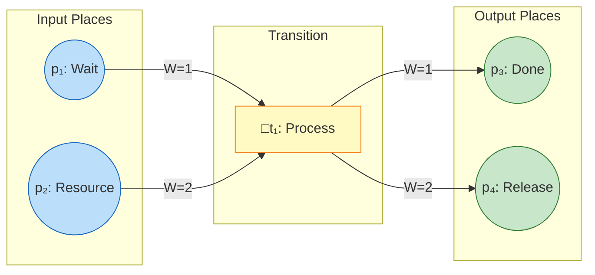
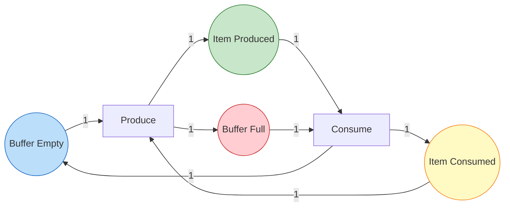
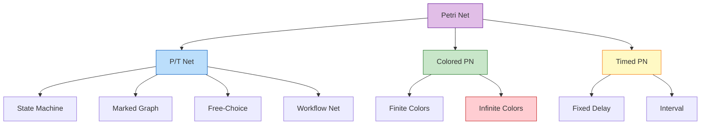
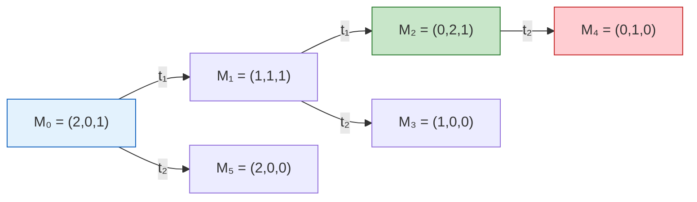

# Petri Net Formalization

> **Stage**: Struct/01-foundation | **Prerequisites**: [01.02-process-calculus-primer](./01.02-process-calculus-primer-en.md) | **Formalization Level**: L2-L4

---

## 1. Definitions

### Def-S-06-01 (Place/Transition Net — P/T Net)

A **Petri net** (or Place/Transition Net, P/T net) is a six-tuple $N = (P, T, F, W, M_0, \flat)$ [^1][^2][^3], where:

- $P = \{p_1, p_2, \ldots, p_n\}$: finite set of **places**, representing local states or resource conditions
- $T = \{t_1, t_2, \ldots, t_m\}$: finite set of **transitions**, $P \cap T = \emptyset$, representing possible events or actions
- $F \subseteq (P \times T) \cup (T \times P)$: **flow relation**, directed arcs connecting places and transitions
- $W: F \to \mathbb{N}^+$: **weight function**, assigning a positive integer weight to each arc
- $M_0: P \to \mathbb{N}$: **initial marking**, representing the number of tokens in each place at system initialization
- $\flat: T \to \Sigma$: transition labeling function (optional), mapping transitions to an event alphabet

**Preset and Postset**:

$$
\begin{aligned}
^{\bullet}t &\coloneqq \{p \in P \mid (p, t) \in F\} \quad \text{(input places of transition } t \text{)} \\
t^{\bullet} &\coloneqq \{p \in P \mid (t, p) \in F\} \quad \text{(output places of transition } t \text{)} \\
^{\bullet}p &\coloneqq \{t \in T \mid (t, p) \in F\} \quad \text{(input transitions of place } p \text{)} \\
p^{\bullet} &\coloneqq \{t \in T \mid (p, t) \in F\} \quad \text{(output transitions of place } p \text{)}
\end{aligned}
$$

**Intuition**: Petri nets use circles (places) to represent state conditions, boxes (transitions) to represent events, and black dots (tokens) to represent the presence of resources or control flow. A transition can "fire" only when all its input places contain sufficient tokens.

**Rationale**: The explicit separation of weight $W$ enables direct application of linear algebra tools such as incidence matrices and state equations, while providing the simplest distributed state representation for unbounded concurrency and resource contention [^2].

*Figure 1-1: Example Petri net structure. Transition $t_1$ requires at least 1 token in $p_1$ and 2 tokens in $p_2$ to fire; after firing it produces 1 token in $p_3$ and 2 tokens in $p_4$.*

---

### Def-S-06-02 (Firing Rule)

**Enabledness**: A transition $t \in T$ is **enabled** at marking $M$, denoted $M[t\rangle$, iff [^1][^2]:

$$
\forall p \in {}^{\bullet}t: M(p) \geq W(p, t)
$$

With the convention: if $(p, t) \notin F$, then $W(p, t) = 0$.

**Firing Rule**: After $t$ fires, a new marking $M'$ is produced, denoted $M[t\rangle M'$, satisfying:

$$
M'(p) = M(p) - W(p, t) + W(t, p) \quad \forall p \in P
$$

With the convention: if $(t, p) \notin F$, then $W(t, p) = 0$.

**Firing sequence**: For a sequence $\sigma = t_1 t_2 \cdots t_k$, we write $M_0 \xrightarrow{\sigma} M_k$ to denote reaching $M_k$ by successively firing $t_1, t_2, \ldots, t_k$ from $M_0$.

**State equation**: Let $C$ be the incidence matrix ($C(p,t) = W(t,p) - W(p,t)$), and $\vec{\sigma}$ the firing count vector. Then:

$$
M = M_0 + C \cdot \vec{\sigma}
$$

**Intuition**: Transition firing is an atomic operation — consuming a specified number of tokens from input places while producing a specified number of tokens in output places. The weight function allows expressing "an action requiring multiple resources to be satisfied simultaneously," a key capability distinguishing Petri nets from simple state machines.

---

### Def-S-06-03 (Reachability and Reachability Graph)

**Reachability**: A marking $M$ is **reachable** from $M_0$, denoted $M \in R(N, M_0)$ or $M_0 \xrightarrow{*} M$, iff there exists a finite firing sequence $\sigma \in T^*$ such that $M_0 \xrightarrow{\sigma} M$ [^2][^3].

**Reachability set**: $R(N, M_0) \coloneqq \{M \mid M_0 \xrightarrow{*} M\}$

**Reachability Graph (RG)**: A directed graph $RG(N, M_0) = (V, E)$ where:

- Vertex set $V = R(N, M_0)$ (all reachable markings)
- Edge set $E = \{(M, t, M') \mid M, M' \in V, M[t\rangle M'\}$

For bounded nets, $R(N, M_0)$ is finite and RG is computable. For unbounded nets, the **Karp-Miller tree** uses $\omega$ to represent unbounded token counts, yielding a finite coverability tree [^2][^3].

---

### Def-S-06-04 (Colored Petri Net — CPN)

A **Colored Petri Net (CPN)** extends P/T nets with typed tokens [^3]:

$$
N_{CPN} = (P, T, F, \Sigma, V, C, G, E, I)
$$

Where $\Sigma$ is a set of color sets (types), $C: P \to \Sigma$ assigns color sets to places, $G: T \to \text{BoolExpr}$ provides guard expressions, and $E: F \to \text{Expr}$ assigns arc expressions. Each token carries a color (data value), enabling compact modeling of complex data-dependent behavior.

**Intuition**: CPNs fold multiple P/T net places into a single place with colored tokens, dramatically reducing model size. They are widely used in protocol verification and distributed system modeling [^3].

---

### Def-S-06-05 (Timed Petri Net — TPN)

A **Timed Petri Net (TPN)** augments P/T nets with temporal constraints [^2]:

$$
N_{TPN} = (N, D)
$$

Where $N$ is a P/T net and $D: T \to \mathbb{R}^+ \times \mathbb{R}^+$ assigns each transition a firing interval $[d_{min}, d_{max}]$. Transitions enabled at time $t$ can fire at any time in $[t + d_{min}, t + d_{max}]$.

**Intuition**: TPNs introduce quantitative time into the model, enabling performance analysis (throughput, latency) in addition to functional correctness.

---

### Def-S-06-06 (Petri Net Hierarchy)

| Class | Features | Expressiveness | Analysis Complexity |
|-------|----------|---------------|-------------------|
| **State Machine** | Each transition has exactly one input and one output place | L1: Regular languages | Polynomial |
| **Marked Graph** | Each place has exactly one input and one output transition | L1: Regular languages | Polynomial |
| **Free-Choice** | No shared input places between transitions unless identical | L2: Some concurrency | Polynomial |
| **P/T Net** | General weights and topology | L3: Some context-free | EXPSPACE-hard |
| **CPN** | Typed tokens | L4: Turing-complete | Undecidable (general) |
| **TPN** | Temporal constraints | L4+: Real-time | Undecidable (general) |

---

## 2. Properties

### Property 1 (Boundedness Implies Finite State Space)

**Statement**: If a Petri net $N$ is $k$-bounded ($\forall M \in R(N,M_0), \forall p \in P: M(p) \leq k$), then $|R(N,M_0)| \leq (k+1)^{|P|}$.

**Derivation**: Each place can hold at most $k$ tokens, and there are $|P|$ places. The number of possible markings is bounded by $(k+1)^{|P|}$. ∎

### Property 2 (1-Safe Net Coverability is Decidable)

**Statement**: For 1-safe nets ($k=1$), coverability, reachability, and liveness are all decidable in PSPACE.

**Derivation**: 1-safe nets have at most $2^{|P|}$ markings. The reachability graph can be explicitly constructed and checked in polynomial space. ∎

### Property 3 (State Equation is Necessary but Not Sufficient for Reachability)

**Statement**: If $M$ is reachable from $M_0$, then $M = M_0 + C \cdot \vec{\sigma}$ for some non-negative integer vector $\vec{\sigma}$. The converse does not hold in general.

**Derivation**: The state equation is a linear relaxation of the reachability problem. It ignores the firing sequence ordering constraints (tokens must be present before they are consumed). For some net subclasses (e.g., acyclic nets), the state equation is sufficient. ∎

### Property 4 (Liveness Implies No Dead Transitions)

**Statement**: If a Petri net is live ($\forall t \in T, \forall M \in R(N,M_0), \exists M' \in R(N,M): M'[t\rangle$), then no transition is dead at $M_0$.

**Derivation**: By definition of liveness, every transition can be enabled from every reachable marking. In particular, every transition is enabled from some marking reachable from $M_0$. ∎

### Property 5 (P/T Net to CPN Expressiveness Inclusion)

**Statement**: Every P/T net has an equivalent CPN representation (by using a single color type with one value). CPNs with recursive color types are strictly more expressive than P/T nets.

**Derivation**: The inclusion is trivial. Strictness follows from CPNs' ability to model unbounded data structures (lists, trees) within tokens, which P/T nets cannot express without infinite place sets. ∎

---

## 3. Relations

### Relation 1: Petri Nets and π-calculus Expressive Incomparability

Petri nets naturally model true concurrency (multiple independent transitions firing simultaneously), while π-calculus models interleaving concurrency. Unbounded Petri nets can express some concurrency patterns not directly representable in π-calculus without encoding overhead. Conversely, π-calculus can express dynamic topology changes (channel creation and passing) that Petri nets with static structure cannot. Therefore **Petri nets $\perp$ π-calculus** (expressively incomparable) [^4][^5].

### Relation 2: Bounded Petri Nets and CSP Finite-State Subset Trace Equivalence

For bounded Petri nets, the reachability graph is finite and can be translated into a CSP process where each marking is a state and each transition firing is an event. This yields trace equivalence between the bounded Petri net and a finite-state CSP process [^3].

### Relation 3: CPN to Ordinary Petri Net Reduction

Any CPN with finite color sets can be unfolded into an equivalent ordinary P/T net by creating one place per (place, color) pair. This reduction is exponential in color set size, explaining why CPN tools use symbolic methods rather than explicit unfolding [^3].

### Relation 4: Petri Nets and Workflow Nets

A **Workflow Net** is a Petri net with exactly one source place ($i$) and one sink place ($o$), where every node is on a path from $i$ to $o$. Workflow nets $\subset$ Petri nets. They are widely used for business process modeling and support soundness verification (proper completion, no dead tasks, no dangling tokens) [^2].

---

## 4. Argumentation

### Lemma-S-06-01 (Karp-Miller Tree Finiteness)

**Statement**: For any Petri net, the Karp-Miller coverability tree is finite.

**Proof sketch**: The tree construction uses an acceleration operation: if a marking $M_2$ strictly dominates $M_1$ on a path ($M_2 \geq M_1$ and $M_2 \neq M_1$), then the differing places are replaced by $\omega$ (unbounded). Since there are only $|P|$ places, each path can have at most $|P|$ accelerations before all places are $\omega$. Combined with Dickson's lemma (no infinite antichain in $\mathbb{N}^{|P|}$), the tree is finite [^2][^3].

### Lemma-S-06-02 (Monotonicity of Firing Rule)

**Statement**: If $M_1 \leq M_2$ (component-wise) and $M_1[t\rangle M_1'$, then $M_2[t\rangle M_2'$ with $M_1' \leq M_2'$.

**Proof**: Enabledness requires $M(p) \geq W(p,t)$ for all input places. Since $M_1 \leq M_2$ and $M_1$ enables $t$, $M_2$ also enables $t$. The new marking is $M'(p) = M(p) - W(p,t) + W(t,p)$. Since the same amount is subtracted and added to both markings, the ordering is preserved. ∎

---

## 5. Proof / Engineering Argument

### Thm-S-06-01 (Reachability Graph Decision of Liveness and Boundedness)

**Statement**: For a bounded Petri net $N$, liveness and boundedness can be decided from the reachability graph $RG(N,M_0)$.

**Proof**:

**Boundedness**: By construction, $RG(N,M_0)$ contains all reachable markings. If the vertex set $V$ is finite, the net is bounded. The maximum token count across all markings and places gives the bound $k$.

**Liveness**: A transition $t$ is live iff from every vertex $v \in V$, there exists a path to a vertex $v'$ where $t$ is enabled. This is verified by graph traversal on $RG$:

1. For each $t \in T$ and each $v \in V$, check if there exists $v' \in V$ reachable from $v$ where $t$ is enabled.
2. If the condition holds for all $t$, the net is live.

Since $RG$ is finite for bounded nets, this check terminates. ∎

---

## 6. Examples

### Example 1: Producer-Consumer Petri Net Model

*Model description*: Places represent buffer states; transitions represent production and consumption actions. The net ensures that consumption cannot occur before production, and production cannot occur when the buffer is full.

### Example 2: Bounded Net and Reachability Graph

For a 1-bounded net with 2 places $\{p_1, p_2\}$ and 2 transitions $\{t_1, t_2\}$ where $t_1$ moves a token from $p_1$ to $p_2$ and $t_2$ moves it back, the reachability graph has 2 vertices: $(1,0)$ and $(0,1)$.

### Counter-Example 1: ω-Marking in Unbounded Nets

Consider a net with one place $p$ and one transition $t$ where $t$ consumes 1 token from $p$ and produces 2 tokens. Starting with $M_0(p) = 1$, the token count grows without bound: $1, 2, 3, \ldots$. The Karp-Miller tree represents the coverability set as $\{(\omega)\}$.

### Counter-Example 2: Reachable but Not 1-Safe

A net with $M_0(p_1) = 2$ and a transition that consumes 1 token from $p_1$ is reachable but not 1-safe. This shows that reachability does not imply boundedness.

### Counter-Example 3: CPN Undecidability Boundary

CPNs with infinite color sets or recursive types are Turing-complete, making reachability undecidable in general. This is the price paid for expressive data modeling [^3].

---

## 7. Visualizations

### Petri Net Class Hierarchy

*Figure 7-1: Petri net class hierarchy. Specializations trade expressiveness for analyzability.*

### Reachability Graph Construction

*Figure 7-2: Example reachability graph. Nodes are markings; edges are transitions.*

---

## 8. References

[^1]: Petri, C.A. (1962). "Kommunikation mit Automaten." *Ph.D. Thesis*, University of Bonn.
[^2]: Reisig, W. (1985). *Petri Nets: An Introduction*. Springer.
[^3]: Jensen, K. and Kristensen, L.M. (2009). *Coloured Petri Nets: Modelling and Validation of Concurrent Systems*. Springer.
[^4]: Sangiorgi, D. and Walker, D. (2001). *The π-calculus: A Theory of Mobile Processes*. Cambridge University Press.
[^5]: Milner, R. (1989). *Communication and Concurrency*. Prentice Hall.

---

*Document Version: v1.0 | Updated: 2026-04-20 | Status: Complete*
