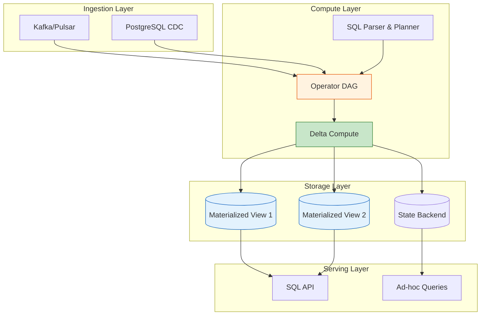
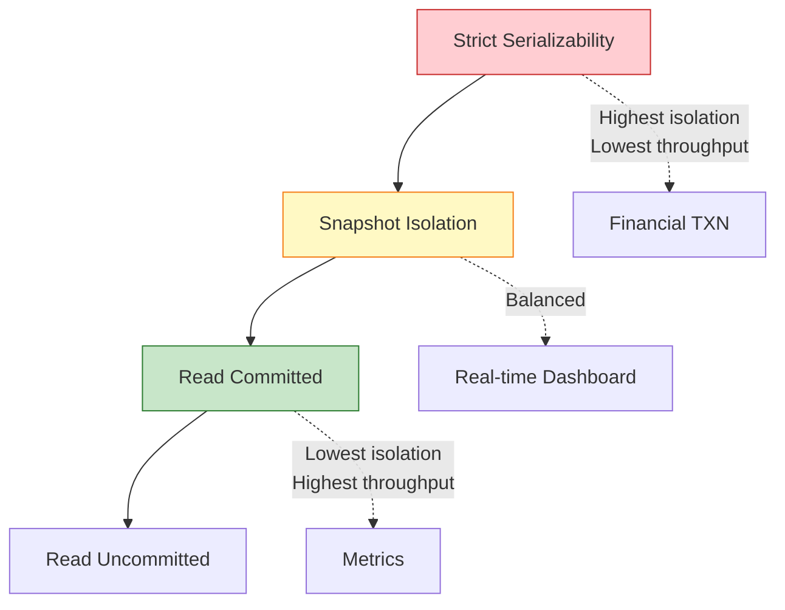

# Streaming Database Formalization

> **Stage**: Struct/01-foundation | **Prerequisites**: [01.04-dataflow-model-formalization](./01.04-dataflow-model-formalization-en.md) | **Formalization Level**: L5

---

## 1. Definitions

This section establishes the rigorous formal foundation of streaming databases, covering the core streaming database model, materialized views, incremental maintenance mechanisms, and consistency levels. All definitions serve as the basis for subsequent property derivations and correctness proofs, referencing industrial practices from RisingWave [^1] and Materialize [^2].

### Def-S-01-80 (Streaming Database Core Model)

A **Streaming Database** is a six-tuple:

$$
\mathcal{SD} = (\mathcal{S}, \mathcal{Q}, \mathcal{V}, \Delta, \tau, \mathcal{C})
$$

Where each component has the following semantics:

| Symbol | Type | Semantics |
|------|------|------|
| $\mathcal{S}$ | Finite set | Input stream set; each stream $s \in \mathcal{S}$ is an event sequence $s = \langle e_1, e_2, \ldots \rangle$ |
| $\mathcal{Q}$ | Finite set | Persistent query set; each query $q \in \mathcal{Q}$ is a continuously executing SQL query |
| $\mathcal{V}$ | Finite set | Materialized view set; each view $v \in \mathcal{V}$ is the materialized result of some query $q$ |
| $\Delta$ | Function family | Incremental update operator family; $\Delta_q: \Delta S \to \Delta V$ defines the incremental computation rule for query $q$ |
| $\tau$ | Time function | Timestamp function; $\tau: \mathcal{S} \times \mathbb{N} \to \mathbb{T}$ assigns a timestamp to each stream event |
| $\mathcal{C}$ | Partial order | Consistency configuration; defines view visibility level and transaction isolation semantics |

**System invariants**:

$$
\begin{aligned}
&\text{(I1) View completeness}: &&\forall v \in \mathcal{V}. \; \exists q \in \mathcal{Q}. \; \text{source}(v) = q \\
&\text{(I2) Incremental computability}: &&\forall q \in \mathcal{Q}. \; \Delta_q \text{ exists and is efficiently computable} \\
&\text{(I3) Time monotonicity}: &&\forall s \in \mathcal{S}, \forall i < j. \; \tau(s, i) \leq \tau(s, j) \\
&\text{(I4) Consistency completeness}: &&\mathcal{C} \in \{\text{Strict}, \text{SI}, \text{RC}\}
\end{aligned}
$$

**Intuition**: A streaming database inverts the traditional database "store-then-query" model into a "query-then-store" model — queries are persistently registered, data streams continuously arrive, and the system incrementally computes and maintains materialized views. This architecture eliminates ETL latency, making real-time analytics possible [^1][^2].

**Rationale**: Without formalizing the streaming database as a six-tuple, it is impossible to strictly distinguish the essential difference between a "stream processing engine" and a "streaming database": the latter emphasizes persistent queries, materialized views as first-class citizens, and transactional consistency guarantees.

---

### Def-S-01-81 (Materialized View)

A **Materialized View** is the core abstraction in a streaming database, defined as a five-tuple:

$$
v = (q, R, \Sigma, T_{last}, \text{valid})
$$

Where:

| Component | Type | Semantics |
|------|------|------|
| $q$ | $\mathcal{Q}$ | Source query; the view's definition logic |
| $R$ | Relation instance | Current materialized result; $R \subseteq \mathcal{D}^{arity(q)}$ |
| $\Sigma$ | State summary | Maintenance state; may contain aggregation intermediates, window state, etc. |
| $T_{last}$ | $\mathbb{T}$ | Last update timestamp |
| $\text{valid}$ | $\mathbb{B}$ | Validity flag; indicates whether the view is in a consistent state |

The **semantics of a materialized view** is defined by the following rule:

$$
\text{View}(v, t) = \{ r \mid r \in \mathcal{D}^* \land q(r, S_{\leq t}) = \text{true} \}
$$

Where $S_{\leq t}$ denotes the set of all input events with timestamp not exceeding $t$.

**Materialized view update rule**:

When input stream $\mathcal{S}$ produces an incremental change $\Delta S$ at time $t$, the view update follows:

$$
R_{new} = R_{old} \oplus \Delta_q(\Delta S, \Sigma_{old})
$$

Where $\oplus$ is the result merge operator (usually union or replacement), and $\Delta_q$ is the incremental operator corresponding to query $q$.

**Intuition**: A materialized view is a "pre-computed and stored query result." Unlike traditional databases, materialized views in streaming databases are continuously maintained — whenever new data arrives, the system incrementally updates the view rather than recomputing it. This is the key to streaming database performance [^1][^4].

---

### Def-S-01-82 (Incremental Maintenance)

**Incremental Maintenance** is the core mechanism of streaming databases, defined as a triple:

$$
\mathcal{IM} = (\Delta_{in}, f_{\Delta}, \Delta_{out})
$$

Where:

- $\Delta_{in}$: input increment, represented as a change stream of $(+, e)$ (insert) or $(-, e)$ (delete)
- $f_{\Delta}: \Delta_{in} \times \Sigma \to \Delta_{out} \times \Sigma'$: incremental computation function
- $\Delta_{out}$: output increment, the view's change stream

**Incremental maintenance classification**:

| Type | Definition | Applicable Scenario |
|------|------|----------|
| **Full Incremental** | $\forall q. \; \Delta_q$ decomposes into local operations | SPJ queries, simple aggregation |
| **Partial Incremental** | Some operators support increment, periodic recomputation needed | Complex windows, nested aggregation |
| **Non-incremental** | Must recompute entire view | Complex sorting, total-order dependent operations |

**Incremental maintenance correctness condition**:

$$
\forall \Delta S. \; \text{View}(q, S \cup \Delta S) = \text{View}(q, S) \oplus \Delta_q(\Delta S)
$$

This condition states that incremental update yields the same result as recomputing from the full input.

---

### Def-S-01-83 to Def-S-01-85 (Consistency Levels)

**Strict Serializability** (Def-S-01-83): All transactions appear to execute in some total order consistent with real-time ordering. Formally:

$$
\forall T_1, T_2. \; (\text{commit}(T_1) <_{rt} \text{start}(T_2)) \Rightarrow (T_1 <_{serial} T_2)
$$

**Snapshot Isolation (SI)** (Def-S-01-84): Each transaction reads from a consistent snapshot of the database. Write-write conflicts are detected and aborted.

**Read Committed (RC)** (Def-S-01-85): Each transaction reads only committed data. No repeatable read guarantee.

---

### Def-S-01-86 (Stream SQL Query Semantics)

A **Stream SQL Query** is a declarative specification over streaming relations. Its semantics is defined as a mapping from input stream histories to output relation sequences:

$$
\llbracket q \rrbracket: \mathcal{S}^* \to \mathcal{R}^\omega
$$

Where $\mathcal{R}^\omega$ denotes an infinite sequence of relation instances (one per logical time point). The query semantics follows the **I-SEMANTICS** (instance semantics) principle: at each time $t$, the output is the result of applying the standard relational algebra semantics to the input accumulated up to $t$.

---

## 2. Properties

### Lemma-S-01-80 (Materialized View Update Monotonicity)

**Statement**: For append-only input streams, the materialized view result $R(t)$ is monotonically non-decreasing in $t$ (under set inclusion).

**Proof**: Append-only streams only produce $(+, e)$ increments. For monotonic queries (selection, projection, join, aggregation without negation), $\Delta_{out}$ only contains insertions. Therefore $R(t_1) \subseteq R(t_2)$ for $t_1 \leq t_2$. ∎

### Lemma-S-01-81 (Incremental Maintenance Correctness Condition)

**Statement**: Incremental maintenance is correct iff for all input change sets $\Delta S$:

$$
\text{View}(q, S \oplus \Delta S) = \text{View}(q, S) \oplus \Delta_q(\Delta S, \Sigma)
$$

**Proof**: By definition, $\text{View}(q, S)$ is the query result over input $S$. The incremental operator $\Delta_q$ must produce exactly the difference between $\text{View}(q, S \oplus \Delta S)$ and $\text{View}(q, S)$. If this equality holds for all $\Delta S$, the incremental maintenance is correct. ∎

### Lemma-S-01-82 (Consistency Level Implication)

**Statement**: The three consistency levels satisfy the implication chain:

$$\text{Strict Serializability} \Rightarrow \text{Snapshot Isolation} \Rightarrow \text{Read Committed}$$

**Proof**:

1. Strict serializability requires total order consistent with real-time; SI only requires snapshot consistency. Any strict serializable execution is also SI.
2. SI requires reading from a consistent snapshot; RC only requires reading committed data. Any SI execution is also RC. ∎

### Prop-S-01-80 (Materialized View Commutativity Condition)

**Statement**: If all incremental updates to a materialized view commute (i.e., $\Delta_1 \oplus \Delta_2 = \Delta_2 \oplus \Delta_1$), then the view can be maintained without global coordination.

**Proof**: Commutativity ensures that the final view state is independent of the order in which increments are applied. Therefore parallel incremental updates can be applied locally and merged asynchronously, eliminating the need for a global serial point. ∎

---

## 3. Relations

### Relation 1: Streaming Database $\mapsto$ Dataflow Model

A streaming database maps to the Dataflow model as follows:

| Streaming DB Component | Dataflow Equivalent | Formal Basis |
|----------------------|---------------------|--------------|
| Input stream $\mathcal{S}$ | Unbounded data stream | Def-S-03-01 |
| Persistent query $\mathcal{Q}$ | Continuously executing operator DAG | Def-S-03-02 |
| Materialized view $\mathcal{V}$ | Stateful operator output | Def-S-03-03 |
| Incremental update $\Delta$ | Delta computation on streams | Def-S-03-04 |
| Consistency $\mathcal{C}$ | Delivery guarantee level | Def-S-03-05 |

### Relation 2: Materialized View $\cong$ Stream Computation Materialization

In Flink, a materialized view corresponds to a continuously updated sink table or queryable state. In Materialize, it is a differential dataflow collection maintained in memory. Both instantiate the same abstraction: a query result that is kept consistent with the input in real time.

### Relation 3: Incremental Maintenance $\approx$ Differential Dataflow

Differential dataflow [^4] generalizes incremental maintenance by tracking changes at multiple timestamps (multi-version increments). Streaming database incremental maintenance can be seen as differential dataflow restricted to a single "now" timestamp:

$$\Delta_q^{SD}(\Delta S) = \Delta_q^{DD}(\Delta S, t_{now})$$

### Relation 4: Streaming Database $\supset$ Traditional OLTP + OLAP

A streaming database subsumes both OLTP (transactional ingestion) and OLAP (analytical querying) within a single system. The unification is achieved through:

- **OLTP**: Input streams correspond to transactional writes; consistency levels guarantee isolation
- **OLAP**: Materialized views correspond to pre-computed analytical queries; incremental maintenance eliminates batch recomputation

---

## 4. Argumentation

### 4.1 Coordinating Materialized Views with Stream Semantics

**Challenge**: Materialized views are relational (set-oriented), while streams are event-oriented (bag/multiset). How to maintain consistency between the two paradigms?

**Solution**: The **I-SEMANTICS** approach treats streams as append-only relations. Each event is a tuple insertion; retractions (for corrections or window expires) are explicit $(-, e)$ operations. The view is recomputed as:

$$
R(t) = \bigcup_{t_e \leq t} \{ e \mid (+, e) \in \Delta S \} \setminus \bigcup_{t_e \leq t} \{ e \mid (-, e) \in \Delta S \}
$$

This formulation allows standard relational algebra to operate on streaming data by interpreting streams as delta relations.

### 4.2 Boundary Conditions of Incremental Computation

Not all queries support efficient incremental maintenance. Boundary conditions include:

| Query Feature | Incremental Support | Workaround |
|-------------|---------------------|------------|
| Selection, Projection | Full | Direct delta propagation |
| Join | Full (with index) | Maintain join index in $\Sigma$ |
| Aggregation (SUM, COUNT) | Full | Maintain running aggregates |
| Aggregation (MEDIAN) | Partial | Approximate or periodic recompute |
| Sorting, Top-K | Non-incremental | Maintain bounded heap |
| Recursive CTE | Partial | Datalog-style semi-naive evaluation |

### 4.3 Consistency Level Tradeoff Space

| Level | Latency | Throughput | Use Case |
|-------|---------|-----------|----------|
| Strict Serializability | Highest | Lowest | Financial transactions |
| Snapshot Isolation | Medium | High | Real-time dashboards |
| Read Committed | Lowest | Highest | Analytics, metrics |

---

## 5. Proof / Engineering Argument

### Thm-S-01-80 (Streaming Database Consistency Equivalence)

**Statement**: For a streaming database with snapshot isolation, if all queries are monotonic and all views are incrementally maintained, then the system provides a consistent snapshot of all views at any query time.

**Proof**:

**Step 1: Query monotonicity guarantees determinism**
Monotonic queries (no negation, no aggregation with deletions) produce deterministic output given the same input history. Therefore view contents are uniquely determined by the set of processed events.

**Step 2: Incremental maintenance preserves equivalence**
By Lemma-S-01-81, incremental maintenance yields the same result as recomputation. Therefore the materialized view is always equivalent to the query result over the full input.

**Step 3: Snapshot isolation provides atomic visibility**
SI ensures that a query reading multiple views sees all updates up to a single logical timestamp, and no updates from after that timestamp. This guarantees cross-view consistency.

**Step 4: Composition**
Since each view is correct (Step 2) and all views are observed at a consistent point (Step 3), the overall database state is consistent. ∎

---

## 6. Examples

### 6.1 RisingWave Architecture Formal Mapping

RisingWave [^1] implements the streaming database model with the following mapping:

| Component | Implementation |
|-----------|---------------|
| $\mathcal{S}$ | Kafka / Pulsar sources |
| $\mathcal{Q}$ | Persisted SQL via frontend |
| $\mathcal{V}$ | Materialized views in Hummock (LSM-Tree store) |
| $\Delta$ | Delta join and delta aggregation operators |
| $\tau$ | Event time / processing time |
| $\mathcal{C}$ | Snapshot isolation (default) |

### 6.2 Materialize Differential Dataflow Instance

Materialize [^2] uses differential dataflow [^4] for incremental maintenance:

```rust
// Pseudocode: Differential dataflow computation
let input = collection::<(Key, Value)>::new();
let grouped = input
    .map(|(k, v)| (k, v.amount))
    .group(|_key, src, dst| {
        let sum: i64 = src.iter().map(|(v, _diff)| v).sum();
        dst.push((sum, 1));
    });
// `grouped` is automatically maintained incrementally
```

### 6.3 Counter-Example: Non-Deterministic Update Materialized View Failure

If an incremental update depends on processing time (e.g., `NOW()` in SQL), different view replicas may compute different deltas for the same input:

```sql
-- Non-deterministic: depends on processing time
CREATE VIEW recent_orders AS
SELECT * FROM orders WHERE order_time > NOW() - INTERVAL '1 hour';
```

This violates the correctness condition of Lemma-S-01-81 because $\Delta_q$ is not a pure function of $\Delta S$ alone. The fix is to use event time instead of processing time.

---

## 7. Visualizations

### Streaming Database Architecture Concept



*Figure 7-1: Streaming database architecture. Input sources feed into an operator DAG that incrementally maintains materialized views and state.*

### Materialized View Incremental Maintenance Flow

```mermaid
graph LR
    A[Input Stream] -->|ΔS| B[Delta Parser]
    B -->|(+/-, e)| C[Incremental Operator]
    C -->|ΔV| D[View Update]
    D -->|R_new| E[Materialized View]
    E -->|Query| F[Query Result]
    style C fill:#c8e6c9,stroke:#2e7d32
    style E fill:#e3f2fd,stroke:#1565c0
```

*Figure 7-2: Incremental maintenance flow. Input changes are parsed into deltas, processed by incremental operators, and applied to the materialized view.*

### Consistency Level Hierarchy



*Figure 7-3: Consistency level hierarchy. Strict serializability provides the strongest guarantees at the cost of throughput; read committed maximizes throughput with weakest guarantees.*

---

## 8. References

[^1]: RisingWave Labs, "RisingWave Architecture", 2024. <https://docs.risingwave.com/>
[^2]: Materialize Inc., "What is Materialize?", 2024. <https://materialize.com/>
[^4]: McSherry, F. et al. (2013). "Differential Dataflow." *CIDR*.

---

*Document Version: v1.0 | Updated: 2026-04-20 | Status: Complete*
