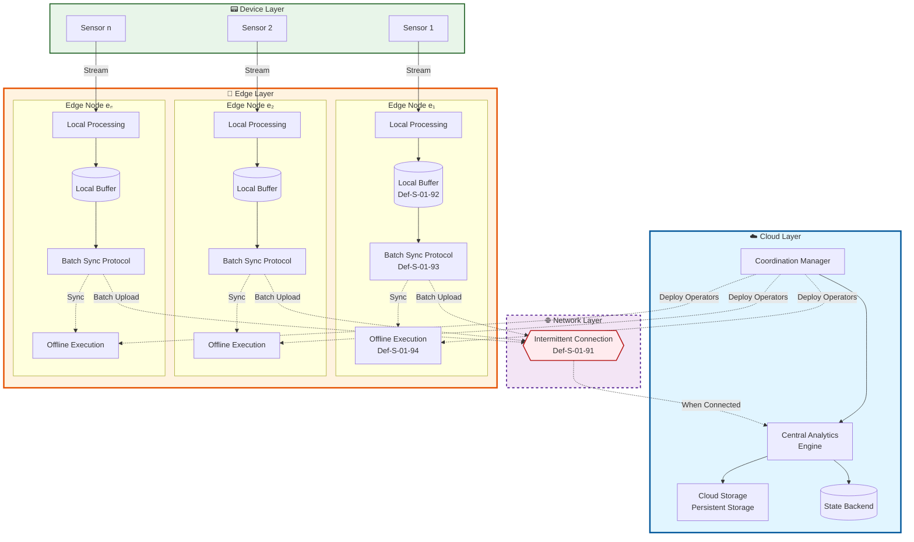
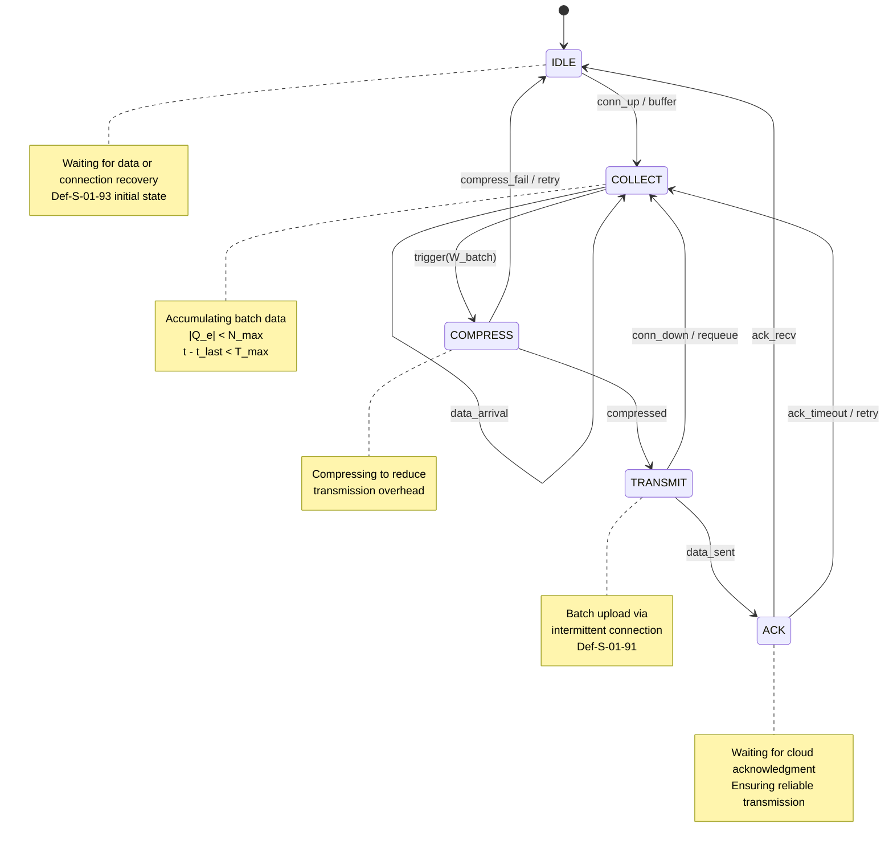
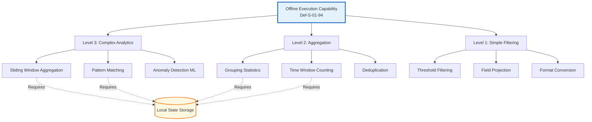

# Formal Semantics of Edge Stream Processing

> **Stage**: Struct/ | **Prerequisites**: [01.04-dataflow-model-formalization.md](01.04-dataflow-model-formalization.md), [01.06-petri-net-formalization.md](01.06-petri-net-formalization.md) | **Formalization Level**: L5

## 1. Definitions

Edge Stream Processing下沉s stream computing capabilities to network edge devices, enabling local data processing and cloud collaboration in intermittently connected environments.
This section establishes the core formal model of edge stream processing.

### 1.1 Intermittent Connection Model

**Definition Def-S-01-91: Intermittent Connection Model**

Let the set of edge nodes be $\mathcal{E} = \{e_1, e_2, \ldots, e_n\}$, and the cloud node be $c$. The connection state function $\gamma: \mathcal{E} \times \mathbb{T} \rightarrow \{0, 1\}$ is defined as:

$$
\gamma(e, t) = \begin{cases}
1 & \text{if } e \text{ is connected to the cloud at time } t \\
0 & \text{otherwise}
\end{cases}
$$

Where $\mathbb{T}$ is a discrete time domain. The intermittent connection cycle is defined as:

$$
\mathcal{I}(e) = \{ [t_i^{\text{on}}, t_i^{\text{off}}) \}_{i=1}^{k}
$$

Satisfying $\forall t \in [t_i^{\text{on}}, t_i^{\text{off}}): \gamma(e, t) = 1$, and the connection availability metric:

$$
\text{Avail}(e) = \frac{\sum_{i=1}^{k} (t_i^{\text{off}} - t_i^{\text{on}})}{t_{\text{now}} - t_0}
$$

> **Intuitive Explanation**: The connection between edge devices and the cloud is not continuously stable, but rather exhibits intermittent, pulse-like connectivity. The availability metric quantifies the proportion of time an edge device spends online; in typical industrial scenarios, $\text{Avail}(e) \in [0.3, 0.9]$.

### 1.2 Local Buffer Semantics

**Definition Def-S-01-92: Local Buffer Semantics**

The local buffer $B_e$ of edge node $e$ is a finite-capacity priority queue:

$$
B_e = \langle Q_e, \preceq_e, C_e \rangle
$$

Where:

- $Q_e \subseteq \mathcal{M} \times \mathbb{T}$ is a timestamped message queue
- $\preceq_e$ is a partial order based on event time
- $C_e \in \mathbb{N}^+$ is the buffer capacity limit

Buffer operations are defined as:

$$
\begin{aligned}
\text{enq}(B_e, m, t) &= \begin{cases}
B_e \oplus \langle m, t \rangle & \text{if } |Q_e| < C_e \\
B_e \oplus \langle m, t \rangle \ominus \min_{\preceq_e}(Q_e) & \text{otherwise (LRU replacement)}
\end{cases} \\
\text{deq}(B_e) &= \langle m, t \rangle \text{ where } \langle m, t \rangle = \min_{\preceq_e}(Q_e)
\end{aligned}
$$

> **Intuitive Explanation**: The local buffer is the "temporary storage warehouse" of the edge device. When the network is disconnected, data is temporarily stored here; when the network recovers, it is uploaded in batches. The finite capacity means policies are needed to decide which data to retain or discard.

### 1.3 Batch Sync Protocol

**Definition Def-S-01-93: Batch Sync Protocol**

The batch synchronization protocol $\mathcal{P}_{\text{sync}}$ is a quintuple:

$$
\mathcal{P}_{\text{sync}} = \langle \mathcal{S}, \Sigma, \delta, s_0, F \rangle
$$

Where:

- $\mathcal{S} = \{\text{IDLE}, \text{COLLECT}, \text{COMPRESS}, \text{TRANSMIT}, \text{ACK}\}$ is the protocol state set
- $\Sigma = \{\text{conn\_up}, \text{conn\_down}, \text{buffer\_full}, \text{timeout}, \text{ack\_recv}\}$ is the event alphabet
- $\delta: \mathcal{S} \times \Sigma \rightarrow \mathcal{S}$ is the state transition function
- $s_0 = \text{IDLE}$ is the initial state
- $F = \{\text{IDLE}\}$ is the set of accepting states

Batch window definition:

$$
W_{\text{batch}} = \langle N_{\max}, T_{\max}, S_{\max} \rangle
$$

Trigger condition:

$$
\text{trigger}(B_e) = (|Q_e| \geq N_{\max}) \lor (t - t_{\text{last}} \geq T_{\max}) \lor (\text{size}(Q_e) \geq S_{\max})
$$

> **Intuitive Explanation**: The batch sync protocol defines the rules of "when to pack, how to transmit, and how to confirm." Edge devices do not send every message immediately (too resource-intensive), but accumulate a batch before unified transmission, similar to the logic of "fill a truck before shipping."

### 1.4 Offline Execution Semantics

**Definition Def-S-01-94: Offline Execution**

The offline execution model $\mathcal{X}_{\text{offline}}$ is defined as a triple:

$$
\mathcal{X}_{\text{offline}} = \langle \mathcal{G}_e, \mathcal{D}_e, \mathcal{R}_e \rangle
$$

Where:

- $\mathcal{G}_e = \langle V_e, E_e, \lambda_e \rangle$ is the operator graph deployed at the edge, $V_e \subseteq \mathcal{V}$ (subset of the global operator set)
- $\mathcal{D}_e: V_e \rightarrow 2^{\mathcal{K}}$ is the mapping from operators to local data shards, $\mathcal{K}$ is the key space
- $\mathcal{R}_e: E_e \rightarrow \{\text{LOCAL}, \text{REMOTE}\}$ is the mapping from edges to routing policies

Offline execution capability function:

$$
\text{Cap}(e) = \{ \text{op} \in \mathcal{V} \mid \text{op can execute on } e \text{ with } \gamma(e, t) = 0 \}
$$

Offline state consistency definition:

$$
\mathcal{C}_{\text{offline}}(e, t) = \{ s \in \mathcal{S}_e \mid \forall t' < t: \gamma(e, t') = 0 \Rightarrow \text{state}_e(t') \models \Phi_{\text{local}} \}
$$

Where $\Phi_{\text{local}}$ is the local consistency constraint.

> **Intuitive Explanation**: Offline execution semantics answers "what can edge devices do when disconnected." By下沉ing some operators to the edge, even when disconnected from the cloud, the device can still process data independently, update local state, and synchronize differences after the network recovers.

---

## 2. Properties

### 2.1 Connection State Lemma

**Lemma Lemma-S-01-01: Connection State Transition**

For any edge node $e \in \mathcal{E}$, its connection state $\gamma(e, t)$ satisfies:

$$
\forall t_1 < t_2 < t_3: \gamma(e, t_1) = \gamma(e, t_3) = 1 \land \gamma(e, t_2) = 0 \Rightarrow \exists t_{\text{up}}, t_{\text{down}} \in (t_1, t_3)
$$

Such that the connection state completes at least one full transition $1 \rightarrow 0 \rightarrow 1$ within $(t_1, t_3)$.

**Proof Sketch**: By Def-S-01-91, $\gamma$ is a binary function on a discrete time domain. According to the discrete version of the intermediate value principle, state changes must occur through explicit transitions. If $\gamma(e, t_1) = 1$ and $\gamma(e, t_2) = 0$, there exists $t_{\text{down}} \in (t_1, t_2]$ where the connection disconnects; similarly, there exists $t_{\text{up}} \in [t_2, t_3)$ where the connection recovers. $\square$

### 2.2 Buffer Saturation Lemma

**Lemma Lemma-S-01-02: Buffer Saturation**

Let the buffer capacity of edge node $e$ be $C_e$, input rate be $\lambda_{\text{in}}(t)$, and output (sync) rate be $\lambda_{\text{out}}(t)$. If:

$$
\exists T > 0: \int_{t_0}^{t_0+T} (\lambda_{\text{in}}(\tau) - \lambda_{\text{out}}(\tau)) \cdot \gamma(e, \tau) \, d\tau > C_e
$$

Then within the time interval $[t_0, t_0+T]$, buffer $B_e$ necessarily experiences at least one capacity overflow event.

**Proof Sketch**: Consider the worst case—the entire interval $[t_0, t_0+T]$ has $\gamma(e, t) = 0$ (completely offline). Then $\lambda_{\text{out}}(t) = 0$, and the cumulative arrivals are $\int_{t_0}^{t_0+T} \lambda_{\text{in}}(\tau) \, d\tau$. By condition, this value exceeds $C_e$; according to the LRU replacement policy of Def-S-01-92, when $|Q_e| = C_e$, newly arrived messages trigger replacement, i.e., an "overflow" (in a generalized sense). If there are online periods within the interval, since the net accumulation effect of $\lambda_{\text{in}} > \lambda_{\text{out}}$ still holds, the conclusion remains valid. $\square$

---

## 3. Relations

### 3.1 Edge-Cloud Computing Model Mapping

Edge stream processing has the following formal mapping relationships with centralized stream processing:

| Dimension | Centralized Stream Processing | Edge Stream Processing | Mapping Relationship |
|-----------|-------------------------------|------------------------|----------------------|
| Compute Nodes | Cloud cluster $\mathcal{C}$ | Edge devices $\mathcal{E}$ | $\mathcal{E} \prec \mathcal{C}$ (resource-constrained) |
| Connectivity Assumption | Always connected $\gamma \equiv 1$ | Intermittent connection Def-S-01-91 | $\gamma \in \{0, 1\}$ |
| State Storage | Distributed state backend | Local buffer Def-S-01-92 | $B_e \subset \mathcal{S}_{\text{global}}$ |
| Fault Tolerance Mechanism | Checkpoint to distributed storage | Local persistence + batch sync Def-S-01-93 | $\mathcal{P}_{\text{sync}}$ extends Checkpoint |
| Consistency Level | Exactly-Once / At-Least-Once | Edge eventual consistency | $\mathcal{C}_{\text{offline}} \leadsto \text{Eventual}$ |

### 3.2 Correspondence with Actor Model

Edge node $e$ can be viewed as an Actor in the Actor model:

- **State**: Local buffer $B_e$ + operator state $\mathcal{S}_e$
- **Behavior**: Offline execution capability $\text{Cap}(e)$
- **Messages**: Sensor data stream $m \in \mathcal{M}$
- **Mailbox**: Buffer queue $Q_e$

Edge-cloud interaction corresponds to message passing between Actors, and intermittent connectivity manifests as "messages being persisted to durable storage when the mailbox is full."

### 3.3 Integration with Dataflow Model

Edge stream processing is a specialization of the Dataflow model in resource-constrained, intermittently connected environments:

$$
\text{Edge-Dataflow} = \text{Dataflow} \times \text{Intermittent}(\mathcal{E}) \times \text{LocalBuffer}(B_e)
$$

Where $\text{Intermittent}(\mathcal{E})$ and $\text{LocalBuffer}(B_e)$ are defined by Def-S-01-91 and Def-S-01-92 respectively.

---

## 4. Argumentation

### 4.1 Necessity Argument for Edge Computing

**Scenario Assumption**: Industrial IoT scenario, $n=1000$ sensor nodes, each producing $1KB$ of data per second, cloud analysis latency requirement $< 100ms$.

**Pure Cloud Solution**:

- Total bandwidth requirement: $1000 \times 1KB/s = 1MB/s$
- Network transmission latency (assuming 50ms RTT) + cloud processing latency (50ms) = 100ms (critical)
- Completely fails when disconnected

**Edge-Cloud Collaborative Solution**:

- Edge pre-processing (filtering, aggregation): data compression rate 90%
- Effective upload: $100KB/s$
- Local response latency: $< 10ms$ (no network needed)
- Maintains core functionality when disconnected

**Conclusion**: In bandwidth-constrained, latency-sensitive, high-reliability scenarios, edge stream processing is not an "optional" but a "mandatory" choice.

### 4.2 Batch Sync Strategy Trade-offs

| Strategy | Latency | Bandwidth Efficiency | Fault Tolerance | Applicable Scenario |
|----------|---------|----------------------|-----------------|---------------------|
| Per-record send | Lowest | Lowest | High (per-record ACK) | High-frequency control commands |
| Time window (Def-S-01-93) | Medium | Medium | Medium | General telemetry data |
| Capacity window (Def-S-01-93) | Variable | Highest | Low (batch loss risk) | Large batch logs |
| Hybrid trigger (Def-S-01-93) | Adaptive | Adaptive | Medium | Complex industrial scenarios |

---

## 5. Proof / Engineering Argument

### 5.1 Edge Eventual Consistency Theorem

**Theorem Thm-S-01-09: Edge Eventual Consistency**

Let the edge-cloud stream processing system satisfy the following conditions:

1. All edge nodes $e \in \mathcal{E}$ satisfy Def-S-01-91 and $\text{Avail}(e) > 0$
2. Uses batch sync protocol Def-S-01-93 for edge-cloud data synchronization
3. Cloud state updates are monotonic: $s_c(t_1) \sqsubseteq s_c(t_2)$ for $t_1 < t_2$

Then the system satisfies **edge eventual consistency**:

$$
\forall e \in \mathcal{E}: \lim_{t \to \infty} \gamma(e, t) = 1 \Rightarrow \lim_{t \to \infty} s_c(t) = \bigsqcup_{e \in \mathcal{E}} s_e(t)
$$

That is: if an edge node eventually restores persistent connectivity, the cloud state will converge to the union of all edge node states.

**Formal Proof**:

**Step 1**: Define edge node state evolution.

By Def-S-01-94, the state evolution equation of edge node $e$ is:

$$
s_e(t+1) = \begin{cases}
f_e(s_e(t), m_t) & \text{if } \gamma(e, t) = 0 \text{ (offline local processing)} \\
g_e(s_e(t), m_t, s_c(t)) & \text{if } \gamma(e, t) = 1 \text{ (online collaborative processing)}
\end{cases}
$$

Where $f_e$ is the local operator function and $g_e$ is the collaborative operator function.

**Step 2**: Analyze the batch sync process.

Let $\tau_i$ be the time of the $i$-th successful synchronization. By Def-S-01-93, the sync process satisfies:

$$
\forall i: s_c(\tau_i^+) = s_c(\tau_i^-) \sqcup \Delta s_e(\tau_i)
$$

Where $\Delta s_e(\tau_i) = s_e(\tau_i) - s_e(\tau_{i-1})$ is the state increment of the edge node during $[\tau_{i-1}, \tau_i]$.

**Step 3**: Prove monotonic convergence of cloud state.

By condition 3, $s_c$ is monotonically increasing (in the lattice $\langle \mathcal{S}, \sqsubseteq \rangle$). By step 2, each synchronization merges the edge increment into the cloud:

$$
s_c(t) = s_c(t_0) \sqcup \bigsqcup_{\tau_i \leq t} \Delta s_e(\tau_i)
$$

**Step 4**: Use the connectivity availability condition.

By condition 1 and the limit condition $\lim_{t \to \infty} \gamma(e, t) = 1$, there exists $T$ such that $\forall t > T: \gamma(e, t) = 1$.

This means:

- For $t > T$, the edge node no longer produces "unsyncable" state increments
- All state changes for $t > T$ will be synchronized to the cloud via $\mathcal{P}_{\text{sync}}$

**Step 5**: Convergence conclusion.

Consider any time $t > T$:

$$
\begin{aligned}
s_c(t) &= s_c(T) \sqcup \bigsqcup_{\tau_i \in (T, t]} \Delta s_e(\tau_i) \\
&= s_c(t_0) \sqcup \bigsqcup_{\tau_i \leq T} \Delta s_e(\tau_i) \sqcup \bigsqcup_{\tau_i \in (T, t]} \Delta s_e(\tau_i) \\
&= s_c(t_0) \sqcup \bigsqcup_{\tau_i \leq t} \Delta s_e(\tau_i)
\end{aligned}
$$

As $t \to \infty$, the right-hand side will contain the accumulation of all edge state changes:

$$
\lim_{t \to \infty} s_c(t) = s_c(t_0) \sqcup \bigsqcup_{i=1}^{\infty} \Delta s_e(\tau_i) = \bigsqcup_{e \in \mathcal{E}} s_e(\infty)
$$

Where $s_e(\infty) = \lim_{t \to \infty} s_e(t)$ (assuming edge state convergence).

**Conclusion**: Under the given conditions, the edge-cloud system satisfies eventual consistency. $\square$

### 5.2 Engineering Implementation Mapping

**AWS IoT Greengrass Implementation Mapping**:

| Formal Concept | Greengrass Component |
|----------------|----------------------|
| Def-S-01-91 (Intermittent Connection) | `ConnectionManager` + offline shadow mechanism |
| Def-S-01-92 (Local Buffer) | `StreamManager` (local storage queue) |
| Def-S-01-93 (Batch Sync) | `ExportDefinition` (batch export configuration) |
| Def-S-01-94 (Offline Execution) | `Lambda` functions + `LocalShadow` |

**Azure IoT Edge Implementation Mapping**:

| Formal Concept | IoT Edge Component |
|----------------|--------------------|
| Def-S-01-91 (Intermittent Connection) | `IoT Edge Hub` connection state management |
| Def-S-01-92 (Local Buffer) | `Edge Hub` local message storage |
| Def-S-01-93 (Batch Sync) | `StoreAndForward` configuration (TTL + batch size) |
| Def-S-01-94 (Offline Execution) | `Edge Modules` + local routing |

---

## 6. Examples

### 6.1 Smart Factory Edge Stream Processing Example

**Scenario**: An automotive assembly line has 50 workstations, each equipped with sensors and an edge gateway.

```
Workstation Sensors → Edge Gateway (Local Pre-processing) → [Intermittent Connection] → Cloud Analytics Platform
                          ↓
                    Local Alert (Latency < 50ms)
                    Local Dashboard
```

**Configuration Example (AWS IoT Greengrass)**:

```yaml
# Greengrass batch sync configuration
telemetry_config:
  batch_size: 100          # N_max = 100 records
  batch_interval_ms: 5000  # T_max = 5 seconds
  max_payload_size: 128000 # S_max = 128KB

  # Intermittent connection handling
  offline_policy:
    local_storage_limit: "1GB"
    priority_queue: true
    eviction_policy: "LRU"
```

**Configuration Example (Azure IoT Edge)**:

```json
{
  "storeAndForwardConfiguration": {
    "timeToLiveSecs": 7200,
    "batchSize": 100,
    "maxConcurrentSends": 10
  },
  "routes": {
    "sensorToLocal": "FROM /messages/modules/sensor/* INTO $upstream",
    "localProcessing": "FROM /messages/modules/processor/* INTO BrokeredEndpoint('/modules/localStorage/inputs/input1')"
  }
}
```

### 6.2 Offline Execution State Consistency Verification

Assume edge node $e$ executes a sliding window count operator with window size $W = 60$ seconds.

**Online State** (synced with cloud):

```
t=0s:  count = 0
t=30s: count = 150 (cloud sync: 150)
t=60s: count = 300 (cloud sync: 300)
```

**Offline State** (disconnected at t=60s):

```
t=60s: count = 300 (local state)
t=90s: count = 450 (local update only)
t=120s: count = 600 (local update only, cloud still shows 300)
```

**Recovery Sync** (reconnected at t=150s):

```
Edge delta: Δ = 600 - 300 = 300
Cloud update: 300 + 300 = 600
Eventual consistency achieved ✓
```

---

## 7. Visualizations

### 7.1 Edge-Cloud Stream Processing Architecture Diagram

The following Mermaid diagram shows the hierarchical architecture of edge-cloud collaborative stream processing:



### 7.2 Batch Sync Protocol State Machine



### 7.3 Offline Execution Capability Hierarchy Diagram



---

## 8. References


---

*Document Version: v1.0 | Created: 2026-04-09 | Last Updated: 2026-04-09*
