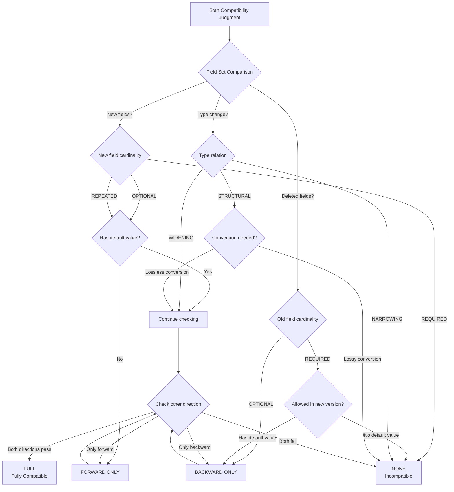
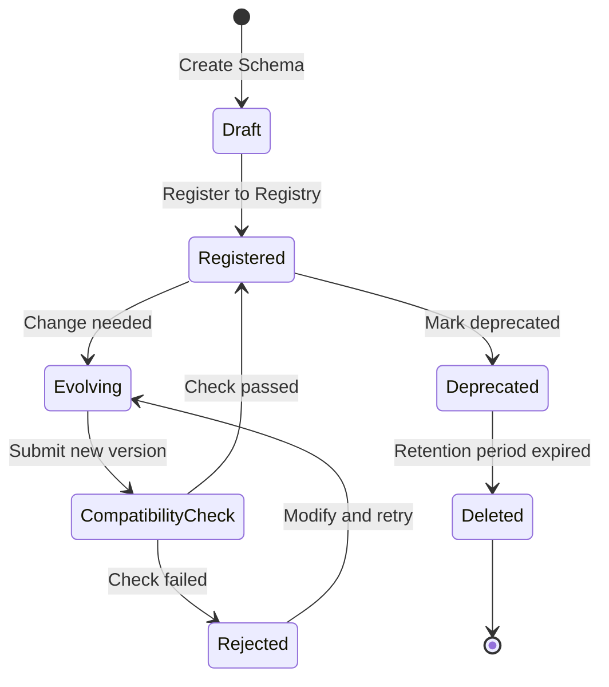
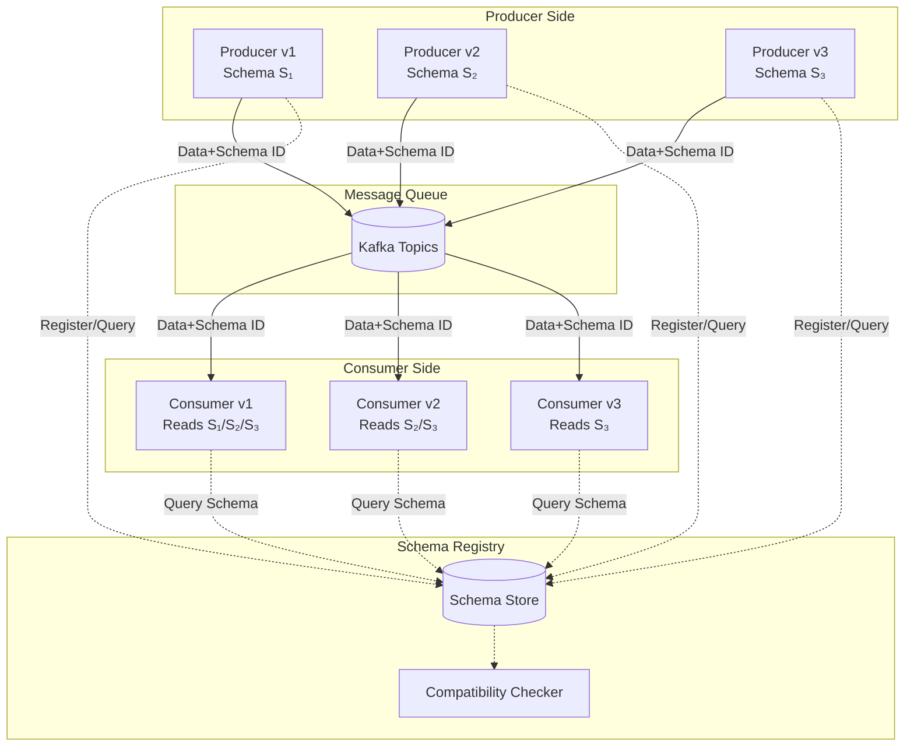

# Formal Theory of Schema Evolution

> **Stage**: Struct/01-foundation | **Prerequisites**: [01.04-dataflow-model-formalization](./01.04-dataflow-model-formalization-en.md) | **Formalization Level**: L5
>
> Version: 2026.04 | Status: Phase 2.4 Core Task

---

## Table of Contents

- [Formal Theory of Schema Evolution](#formal-theory-of-schema-evolution)
  - [Table of Contents](#table-of-contents)
  - [1. Definitions](#1-definitions)
    - [Def-S-01-96 (Schema Version)](#def-s-01-96-schema-version)
    - [Def-S-01-97 (Compatibility Judgment)](#def-s-01-97-compatibility-judgment)
    - [Def-S-01-98 (Schema Migration Function)](#def-s-01-98-schema-migration-function)
    - [Def-S-01-99 (Type Evolution)](#def-s-01-99-type-evolution)
  - [2. Properties](#2-properties)
    - [Lemma-S-01-90 (Transitivity of Compatibility)](#lemma-s-01-90-transitivity-of-compatibility)
    - [Lemma-S-01-91 (Composition of Migration Functions)](#lemma-s-01-91-composition-of-migration-functions)
    - [Prop-S-01-90 (Backward Compatibility Preservation)](#prop-s-01-90-backward-compatibility-preservation)
  - [3. Relations](#3-relations)
    - [Relation 1: Schema Evolution `↔` Type System Subtyping](#relation-1-schema-evolution--type-system-subtyping)
    - [Relation 2: Comparison of Evolution Mechanisms in Avro/Protobuf/Arrow](#relation-2-comparison-of-evolution-mechanisms-in-avroprotobufarrow)
    - [Relation 3: Formal Model of Schema Registry](#relation-3-formal-model-of-schema-registry)
  - [4. Argumentation](#4-argumentation)
    - [4.1 Boundary Conditions of Compatibility Judgment](#41-boundary-conditions-of-compatibility-judgment)
    - [4.2 Semantic Analysis of Type Widening and Narrowing](#42-semantic-analysis-of-type-widening-and-narrowing)
    - [4.3 Semantic Consistency of Default Values](#43-semantic-consistency-of-default-values)
  - [5. Proof / Engineering Argument](#5-proof--engineering-argument)
    - [Thm-S-01-90 (Schema Evolution Consistency Theorem)](#thm-s-01-90-schema-evolution-consistency-theorem)
  - [6. Examples](#6-examples)
    - [Example 6.1: Avro Schema Evolution](#example-61-avro-schema-evolution)
    - [Example 6.2: Protobuf Field Number Evolution](#example-62-protobuf-field-number-evolution)
    - [Example 6.3: Arrow Columnar Schema Evolution](#example-63-arrow-columnar-schema-evolution)
  - [7. Visualizations](#7-visualizations)
    - [Figure 7.1 Compatibility Judgment Decision Tree](#figure-71-compatibility-judgment-decision-tree)
    - [Figure 7.2 Schema Evolution Lifecycle](#figure-72-schema-evolution-lifecycle)
    - [Figure 7.3 Multi-Version Schema Coexistence Architecture](#figure-73-multi-version-schema-coexistence-architecture)
  - [8. References](#8-references)
  - [Related Documents](#related-documents)

---

## 1. Definitions

This section establishes the rigorous formal foundation for schema evolution in streaming data. In stream processing systems, data schemas are not static; they evolve with business requirements. The core problem of schema evolution is how to safely modify the definition of data structures without interrupting stream processing.

### Def-S-01-96 (Schema Version)

A **Schema Version** is a versioned data structure definition, defined as a quintuple:

$$
\mathcal{S}_v = (V, \mathcal{F}, \mathcal{T}, \mathcal{C}, \mathcal{M})
$$

The semantics of each component are as follows:

| Symbol | Type | Semantics |
|--------|------|-----------|
| $V \in \mathbb{N}^+$ | Positive integer | Version number, monotonically increasing |
| $\mathcal{F}$ | Finite set | Field set, each field $f \in \mathcal{F}$ has a unique identifier |
| $\mathcal{T}: \mathcal{F} \to \text{Type}$ | Type mapping | Assigns a data type to each field |
| $\mathcal{C}: \mathcal{F} \to \{\text{REQUIRED}, \text{OPTIONAL}, \text{REPEATED}\}$ | Cardinality mapping | Cardinality constraint of the field |
| $\mathcal{M}: \mathcal{F} \rightharpoonup \text{Value}$ | Partial mapping | Default value of the field (optional) |

**Version Partial Order Relation**:

For two schema versions $\mathcal{S}_{v_1}$ and $\mathcal{S}_{v_2}$, the version order is defined as:

$$
\mathcal{S}_{v_1} \prec \mathcal{S}_{v_2} \iff v_1 < v_2
$$

**Intuitive Explanation**: A schema version records not only the types and names of fields, but also the version number, field cardinality constraints, and default value information. These are the key metadata for determining whether two schema versions can interoperate [^1][^2].

**Motivation for Definition**: In a stream processing environment, producers and consumers may upgrade at different speeds. Without explicit version management, the system cannot determine whether old and new data formats can interoperate.

---

### Def-S-01-97 (Compatibility Judgment)

**Compatibility Judgment** is a formal relation that determines whether two schema versions can safely interoperate, defined as a ternary relation:

$$
\mathcal{J} \subseteq \text{Schema} \times \text{Schema} \times \{\text{FULL}, \text{BACKWARD}, \text{FORWARD}, \text{NONE}\}
$$

The specific compatibility categories are defined as follows:

| Compatibility Category | Definition | Formal Condition |
|-----------|------|-----------|
| **FULL** | Old and new versions can read each other bidirectionally | $\mathcal{S}_1$ backward compatible $\mathcal{S}_2$ $\land$ $\mathcal{S}_1$ forward compatible $\mathcal{S}_2$ |
| **BACKWARD** | New version can read old data | $\forall d \in \mathcal{D}_{\mathcal{S}_1}. \exists d' \in \mathcal{D}_{\mathcal{S}_2}. \text{read}_{\mathcal{S}_2}(d) = d'$ |
| **FORWARD** | Old version can read new data | $\forall d \in \mathcal{D}_{\mathcal{S}_2}. \exists d' \in \mathcal{D}_{\mathcal{S}_1}. \text{read}_{\mathcal{S}_1}(d) = d'$ |
| **NONE** | Cannot safely read each other | Does not satisfy any of the above conditions |

**Backward Compatibility Judgment Rule**:

$$
\begin{aligned}
\text{BACKWARD}(\mathcal{S}_{old}, \mathcal{S}_{new}) \iff
& \forall f \in \mathcal{F}_{old}. \\
& \quad (f \in \mathcal{F}_{new} \implies \mathcal{T}_{new}(f) \succeq \mathcal{T}_{old}(f)) \land \\
& \quad (\mathcal{C}_{old}(f) = \text{REQUIRED} \implies \mathcal{C}_{new}(f) = \text{REQUIRED})
\end{aligned}
$$

Where $\mathcal{T}_{new}(f) \succeq \mathcal{T}_{old}(f)$ means the new type is a supertype of the old type (type widening).

**Forward Compatibility Judgment Rule**:

$$
\begin{aligned}
\text{FORWARD}(\mathcal{S}_{old}, \mathcal{S}_{new}) \iff
& \forall f \in \mathcal{F}_{new}. \\
& \quad (f \in \mathcal{F}_{old} \implies \mathcal{T}_{old}(f) \preceq \mathcal{T}_{new}(f)) \land \\
& \quad (\mathcal{C}_{new}(f) = \text{REQUIRED} \implies f \in \mathcal{F}_{old})
\end{aligned}
$$

**Intuitive Explanation**: Compatibility judgment is the core mechanism of schema evolution. Backward compatibility ensures that upgraded consumers can process historical data; forward compatibility ensures that old consumers can process data produced by the new version. Full compatibility satisfies both and is the ideal evolution goal [^2][^4].

---

### Def-S-01-98 (Schema Migration Function)

A **Schema Migration Function** is a computational function that transforms data between different schema versions, defined as:

$$
\mu_{v_1 \to v_2}: \mathcal{D}_{\mathcal{S}_{v_1}} \to \mathcal{D}_{\mathcal{S}_{v_2}}
$$

Where $\mathcal{D}_{\mathcal{S}}$ denotes the set of data instances conforming to schema $\mathcal{S}$.

**Basic Operations of Migration Functions**:

| Operation | Semantics | Formal Definition |
|------|------|-----------|
| **Projection** ($\pi$) | Remove deprecated fields | $\pi_{\mathcal{F}'}(d) = \{(f, v) \in d \mid f \in \mathcal{F}'\}$ |
| **Extension** ($\epsilon$) | Add new fields | $\epsilon_{f,default}(d) = d \cup \{(f, default)\}$ |
| **Transformation** ($\tau$) | Type conversion | $\tau_{t_1 \to t_2}(d) = \{(f, convert(v)) \mid (f, v) \in d\}$ |
| **Renaming** ($\rho$) | Field renaming | $\rho_{f_1 \to f_2}(d) = \{(f_2, v) \mid (f_1, v) \in d\} \cup (d \setminus \{(f_1, v)\})$ |

**Composition of Migration Functions**:

Given $\mu_{v_1 \to v_2}$ and $\mu_{v_2 \to v_3}$, their composition is defined as:

$$
\mu_{v_1 \to v_3} = \mu_{v_2 \to v_3} \circ \mu_{v_1 \to v_2}
$$

**Intuitive Explanation**: The migration function is the executable semantics of schema evolution. In stream processing systems, migration may occur at multiple points: during data source ingestion, during operator processing, or during data output. Understanding the compositional nature of migration functions is crucial for designing efficient schema evolution pipelines [^3][^5].

---

### Def-S-01-99 (Type Evolution)

**Type Evolution** describes the patterns of data type changes between schema versions, defined as a type transformation relation:

$$
\mathcal{E} \subseteq \text{Type} \times \text{Type} \times \{\text{WIDENING}, \text{NARROWING}, \text{STRUCTURAL}\}
$$

**Type Evolution Categories**:

$$
\begin{aligned}
\text{WIDENING}(t_1, t_2) &\iff \llbracket t_1 \rrbracket \subseteq \llbracket t_2 \rrbracket \\
\text{NARROWING}(t_1, t_2) &\iff \llbracket t_2 \rrbracket \subseteq \llbracket t_1 \rrbracket \\
\text{STRUCTURAL}(t_1, t_2) &\iff \exists \phi: \llbracket t_1 \rrbracket \to \llbracket t_2 \rrbracket. \phi \text{ is bijective}
\end{aligned}
$$

Where $\llbracket t \rrbracket$ denotes the semantic domain of type $t$.

**Common Type Evolution Patterns**:

| Evolution Pattern | Direction | Compatibility Impact | Example |
|----------|------|-----------|------|
| int $\to$ long | Widening | Backward compatible | Integer range expansion |
| long $\to$ int | Narrowing | Incompatible | May cause overflow |
| string $\to$ bytes | Structural | Encoding-dependent | Requires explicit conversion |
| Add OPTIONAL field | Widening | Full compatible | New field can be null |
| Delete REQUIRED field | Narrowing | Forward compatible | Old data still readable |

**Type Evolution and Compatibility**:

$$
\begin{aligned}
\text{WIDENING}(t_1, t_2) &\implies \text{BACKWARD compatible} \\
\text{NARROWING}(t_1, t_2) &\implies \text{FORWARD compatible} \\
\text{WIDENING}(t_1, t_2) \land \text{NARROWING}(t_1, t_2) &\implies \text{FULL compatible}
\end{aligned}
$$

**Intuitive Explanation**: Type evolution is the fundamental unit of schema evolution. Understanding the semantic distinction between widening and narrowing is key to correctly designing compatibility strategies. In stream computing, type evolution affects not only data serialization but also the structure of operator state [^1][^6].

---

## 2. Properties

This section derives key properties of the schema evolution system from the above definitions.

### Lemma-S-01-90 (Transitivity of Compatibility)

**Statement**: Compatibility judgment is transitive. Specifically:

1. If $\mathcal{S}_1$ is backward compatible with $\mathcal{S}_2$, and $\mathcal{S}_2$ is backward compatible with $\mathcal{S}_3$, then $\mathcal{S}_1$ is backward compatible with $\mathcal{S}_3$
2. If $\mathcal{S}_1$ is forward compatible with $\mathcal{S}_2$, and $\mathcal{S}_2$ is forward compatible with $\mathcal{S}_3$, then $\mathcal{S}_1$ is forward compatible with $\mathcal{S}_3$

**Derivation**:

For backward compatibility:

1. $\text{BACKWARD}(\mathcal{S}_1, \mathcal{S}_2)$ implies:
   - $\forall f \in \mathcal{F}_1. (f \in \mathcal{F}_2 \implies \mathcal{T}_2(f) \succeq \mathcal{T}_1(f))$
   - Required field constraints are preserved

2. $\text{BACKWARD}(\mathcal{S}_2, \mathcal{S}_3)$ implies:
   - $\forall f \in \mathcal{F}_2. (f \in \mathcal{F}_3 \implies \mathcal{T}_3(f) \succeq \mathcal{T}_2(f))$

3. For any $f \in \mathcal{F}_1$:
   - If $f \in \mathcal{F}_3$, then by (2) $f \in \mathcal{F}_2$ (otherwise it could not appear in $\mathcal{F}_3$)
   - By transitivity: $\mathcal{T}_3(f) \succeq \mathcal{T}_2(f) \succeq \mathcal{T}_1(f)$, thus $\mathcal{T}_3(f) \succeq \mathcal{T}_1(f)$
   - Required field constraints also propagate

Therefore $\text{BACKWARD}(\mathcal{S}_1, \mathcal{S}_3)$ holds. ∎

> **Inference [Schema→Compatibility]**: Transitivity of compatibility allows the system to store compatibility information only for adjacent versions, deriving compatibility between any two versions via transitive closure, reducing storage complexity.

---

### Lemma-S-01-91 (Composition of Migration Functions)

**Statement**: Given three schema versions $\mathcal{S}_{v_1}, \mathcal{S}_{v_2}, \mathcal{S}_{v_3}$, if migration functions $\mu_{v_1 \to v_2}$ and $\mu_{v_2 \to v_3}$ both exist, then their composition $\mu_{v_2 \to v_3} \circ \mu_{v_1 \to v_2}$ is a valid migration function from $v_1$ to $v_3$.

**Derivation**:

1. By Def-S-01-98, migration function $\mu_{v_1 \to v_2}: \mathcal{D}_{v_1} \to \mathcal{D}_{v_2}$ maps data from format $v_1$ to format $v_2$
2. Similarly, $\mu_{v_2 \to v_3}: \mathcal{D}_{v_2} \to \mathcal{D}_{v_3}$ maps data from format $v_2$ to format $v_3$
3. The type of function composition: $(\mu_{v_2 \to v_3} \circ \mu_{v_1 \to v_2}): \mathcal{D}_{v_1} \to \mathcal{D}_{v_3}$
4. For any $d \in \mathcal{D}_{v_1}$:
   - $\mu_{v_1 \to v_2}(d) \in \mathcal{D}_{v_2}$ (by migration function definition)
   - $\mu_{v_2 \to v_3}(\mu_{v_1 \to v_2}(d)) \in \mathcal{D}_{v_3}$ (by migration function definition)
5. Therefore the composed function correctly maps $v_1$ data to $v_3$ format ∎

> **Inference [Migration→Efficiency]**: Compositionality means the system does not need to precompute migration functions for every pair of versions, but only needs to store migration functions for adjacent versions and compose them dynamically at runtime. This is especially important in long-running stream jobs with many versions.

---

### Prop-S-01-90 (Backward Compatibility Preservation)

**Statement**: If schema evolution contains only the following operations, backward compatibility is preserved:

1. Adding OPTIONAL fields (with default values)
2. Field type widening (e.g., int $\to$ long)
3. Deleting REQUIRED fields

**Derivation**:

For each operation, verify the backward compatibility condition of Def-S-01-97:

1. **Adding OPTIONAL field**:
   - Old data does not contain this field
   - When read by the new schema, it is filled with the default value
   - Satisfies $\forall f \in \mathcal{F}_{old}. f \in \mathcal{F}_{new} \implies \mathcal{T}_{new}(f) \succeq \mathcal{T}_{old}(f)$ (vacuously true)

2. **Type widening**:
   - Let field $f$ change from $t_1$ to $t_2$, where $\llbracket t_1 \rrbracket \subseteq \llbracket t_2 \rrbracket$
   - Any value $v \in \llbracket t_1 \rrbracket$ in old data is also a valid value in $\llbracket t_2 \rrbracket$
   - Thus the new schema can correctly read old data

3. **Deleting REQUIRED field**:
   - Old data contains this field
   - The new schema ignores this field when reading
   - Other field constraints remain unchanged

∎

> **Inference [Design→Practice]**: This provides a safe "whitelist" of operations for schema evolution. In scenarios requiring backward compatibility (such as Kafka consumer upgrades), these operations should be prioritized.

---

## 3. Relations

This section establishes strict relations between schema evolution and other type system concepts as well as engineering implementations.

### Relation 1: Schema Evolution `↔` Type System Subtyping

**Argumentation**:

There is a deep correspondence between the compatibility judgment of schema evolution and subtyping in type theory:

- **Encoding Existence**: Backward compatibility $\mathcal{S}_{old} \to \mathcal{S}_{new}$ corresponds to width subtyping of record types: the new type can read old type data because the new type's field set is a superset of the old type's (considering optional fields).

- **Depth Subtyping**: Field type widening corresponds to depth subtyping. If $\mathcal{T}_{new}(f) \succeq \mathcal{T}_{old}(f)$, then the subtyping relation at that field position holds in the new type system.

- **Formal Correspondence**:
  $$
  \text{BACKWARD}(\mathcal{S}_{old}, \mathcal{S}_{new}) \iff \mathcal{S}_{old} <:_{width} \mathcal{S}_{new}
  $$

- **Separation Result**: Schema evolution also involves operations such as default value semantics and field renaming, which have no direct counterpart in pure subtyping theory. Furthermore, schema evolution in stream processing must also consider the time dimension (compatibility of historical data).

---

### Relation 2: Comparison of Evolution Mechanisms in Avro/Protobuf/Arrow

**Argumentation**:

Comparison of schema evolution mechanisms among three mainstream serialization formats:

| Feature | Apache Avro | Protocol Buffers | Apache Arrow |
|------|-------------|------------------|--------------|
| **Schema Location** | External to data (Schema Registry) | Internal to data (field numbers) | External to data (schema synchronization) |
| **Backward Compatible** | Yes (add fields + defaults) | Yes (add fields + preserve numbers) | Yes (add/remove columns) |
| **Forward Compatible** | Yes (delete fields + defaults) | Yes (ignore unknown numbers) | Partially supported |
| **Field Renaming** | Free (matched by position) | Dangerous (matched by number) | Free (matched by column position) |
| **Type Evolution** | Limited (requires compatible types) | Limited (can upgrade integer types) | Limited (column types fixed) |
| **Default Value Support** | Required (for forward compatibility) | Optional (but recommended) | Optional |

**Formal Differences**:

- **Avro**: Field matching is positional. During evolution, field names can be freely changed as long as positions correspond. This corresponds to the high degree of freedom of the $\mu_{rename}$ operation.

  $$
  \mu_{Avro}(d_{old}) = \{(f_{new,i}, convert(v_{old,i}))\}_{i=1}^{n}
  $$

- **Protobuf**: Field matching is based on numeric tags. Field names can change, but tags must remain stable. Deleted field tags should not be reused.

  $$
  \mu_{Proto}(d_{old}) = \{(f_{new}, v) \mid tag(f_{new}) = tag(f_{old}) \land (f_{old}, v) \in d_{old}\}
  $$

- **Arrow**: Columnar storage, schema evolution mainly involves adding/deleting columns. Type evolution is restricted and usually requires data conversion.

  $$
  \mu_{Arrow}(d_{old}) = \pi_{\mathcal{F}_{new}}(d_{old}) \cup \epsilon_{new\_cols}(default)
  $$

---

### Relation 3: Formal Model of Schema Registry

**Argumentation**:

A Schema Registry (such as Confluent Schema Registry) is a key component for managing schema evolution. Its formal model is as follows:

**Registry State**:

$$
\mathcal{R} = (Subjects, Versions, CompatibilityRules, Constraints)
$$

Where:

- $Subjects$: Set of subjects, each subject corresponding to a data stream
- $Versions: Subjects \to \mathcal{P}(\mathbb{N}^+)$: Version set for each subject
- $CompatibilityRules: Subjects \to \text{CompatPolicy}$: Compatibility policy (BACKWARD/FORWARD/FULL/NONE)
- $Constraints$: Global constraints (e.g., version number monotonicity)

**Registry Operations**:

| Operation | Precondition | Postcondition |
|------|----------|-----------|
| Register($\mathcal{S}_{new}$) | Compatibility check passes | $\mathcal{R}' = \mathcal{R}[Versions(s) \mapsto Versions(s) \cup \{v_{new}\}]$ |
| Lookup($s, v$) | $v \in Versions(s)$ | Returns $\mathcal{S}_{s,v}$ |
| Check($\mathcal{S}_{candidate}$) | $\exists \mathcal{S}_{latest}. \mathcal{J}(\mathcal{S}_{latest}, \mathcal{S}_{candidate}, policy)$ | Returns true/false |

**Integration with Stream Processing**:

$$
\text{Producer}(\mathcal{S}_v) \xrightarrow{\text{data}+\text{schema\_id}} \text{Kafka} \xrightarrow{\text{data}+\text{schema\_id}} \text{Consumer}(\mathcal{S}_{v'})
$$

Consumers deserialize data by fetching the schema from the registry using schema_id.

---

## 4. Argumentation

This section provides auxiliary lemmas, boundary discussions, and counterexample analysis to prepare for the correctness proof of schema evolution.

### 4.1 Boundary Conditions of Compatibility Judgment

**Boundary Discussion**: There are several boundary conditions in compatibility judgment that are easily overlooked in practice:

1. **Consistency of Default Values**:
   - Forward compatibility requires new fields to have default values
   - But the semantics of default values must be consistent with business logic
   - Counterexample: A user age field defaults to 0, which would distort statistical results when calculating average age

2. **Precision-Loss Type Evolution**:
   - long $\to$ int appears safe when within the numeric range
   - But historical data may contain large values, causing overflow
   - Recommendation: Type narrowing should be treated as an incompatible operation

3. **Timezone-Aware Time Types**:
   - timestamp (UTC) $\to$ timestamp (local) is a structural change
   - Even if the numeric value is the same, the semantics have changed
   - Should be treated as incompatible or require explicit conversion

### 4.2 Semantic Analysis of Type Widening and Narrowing

**Key Observation**: The safety of type widening and narrowing is asymmetric:

- **Safety of Widening**:
  - int $\to$ long: Always safe, no precision loss
  - enum $\to$ string: Safe, but loses constraint information
  - fixed bytes $\to$ bytes: Safe, length constraint relaxed

- **Risks of Narrowing**:
  - long $\to$ int: Overflow risk
  - string $\to$ enum: Value domain may not match
  - bytes $\to$ fixed bytes: Length may not match

**Recommendation**: In schema evolution strategies, narrowing operations should be prohibited by default, or explicit data sanitization should be required.

### 4.3 Semantic Consistency of Default Values

**Counterexample Analysis**: Implicit semantics of default values

Consider an e-commerce order stream:

```
// v1
record Order {
  string order_id;
  long amount;
}

// v2 - add discount field
record Order {
  string order_id;
  long amount;
  int discount_percent = 0;  // default value
}
```

**Problem**: When a v2 consumer reads v1 data, discount_percent is set to 0. This is mathematically correct (no discount), but may be ambiguous in business terms:

- 0 may mean "no discount"
- 0 may also mean "discount information unknown"

If there is a subsequent need to distinguish between these two cases, the choice of default value becomes technical debt.

**Recommendation**: For business-critical fields, use explicit "unknown" values or OPTIONAL fields instead of semantically ambiguous default values.

---

## 5. Proof / Engineering Argument

### Thm-S-01-90 (Schema Evolution Consistency Theorem)

**Statement**: Given a schema evolution sequence $\mathcal{S}_{v_1}, \mathcal{S}_{v_2}, \ldots, \mathcal{S}_{v_n}$, if the following conditions are satisfied:

1. Each adjacent version pair satisfies the registry's compatibility policy: $\mathcal{J}(\mathcal{S}_{v_i}, \mathcal{S}_{v_{i+1}}, policy_i)$
2. Corresponding migration functions exist: $\mu_{v_i \to v_{i+1}}$ for all $i < n$
3. All migration functions satisfy idempotency: $\mu \circ \mu = \mu$ (for the same version)

Then for any versions $v_i$ and $v_j$ ($i < j$), data can be safely migrated from format $v_i$ to format $v_j$, and the result is consistent with either step-by-step migration or direct migration from $v_i$ to $v_j$ (if it exists).

**Proof**:

**Step 1: Establish Existence of Migration Path**

By condition 2, migration functions exist for every adjacent version pair. By Lemma-S-01-91 (Composition of Migration Functions), for any $i < j$, the composed function:

$$
\mu_{v_i \to v_j} = \mu_{v_{j-1} \to v_j} \circ \cdots \circ \mu_{v_i \to v_{i+1}}
$$

exists and is type-correct: $\mu_{v_i \to v_j}: \mathcal{D}_{v_i} \to \mathcal{D}_{v_j}$.

**Step 2: Verify Compatibility Propagation**

By condition 1 and Lemma-S-01-90 (Transitivity of Compatibility), if $policy_i = policy$ for all $i$ (e.g., all BACKWARD), then:

$$
\mathcal{J}(\mathcal{S}_{v_i}, \mathcal{S}_{v_j}, policy) \text{ holds for all } i < j
$$

This means a consumer in format $v_j$ can correctly read data in format $v_i$.

**Step 3: Prove Result Consistency**

Suppose there exists a direct migration function $\mu'_{v_i \to v_j}$ from $v_i$ to $v_j$ (e.g., computed via schema diff).

We need to prove: $\mu'_{v_i \to v_j} = \mu_{v_i \to v_j}$ (functional equivalence).

For any $d \in \mathcal{D}_{v_i}$:

1. Step-by-step migration: $d_j = \mu_{v_{j-1} \to v_j}(\cdots\mu_{v_i \to v_{i+1}}(d)\cdots)$
2. Direct migration: $d'_j = \mu'_{v_i \to v_j}(d)$

Since the semantics of schema evolution are deterministic (each field change has a well-defined definition), and the basic operations in Def-S-01-98 (projection, extension, transformation, renaming) are all deterministic functions, both paths apply the same sequence of operations to each field.

Formally, let the sequence of changes to field $f$ in the evolution sequence be $op_1, op_2, \ldots, op_k$, then:

$$
d_j(f) = op_k(\cdots op_1(d(f))\cdots) = d'_j(f)
$$

By function extensionality, $\mu_{v_i \to v_j} = \mu'_{v_i \to v_j}$. ∎

> **Inference [Theory→Practice]**: The Schema Evolution Consistency Theorem guarantees that in a stream processing system, consumers can freely choose when to upgrade—either immediately or after waiting for multiple versions to upgrade all at once. As long as the registry enforces compatibility checks, data integrity is guaranteed.
>
> **Inference [Practice→Design]**: This theorem provides the theoretical foundation for Schema Registry design: the system only needs to verify compatibility between adjacent versions to ensure global consistency, without expensive all-pairs compatibility checks.

---

## 6. Examples

### Example 6.1: Avro Schema Evolution

**Scenario**: User behavior event stream, evolving from v1 to v3.

```json
// v1: Basic click event
{
  "type": "record",
  "name": "ClickEvent",
  "fields": [
    {"name": "user_id", "type": "long"},
    {"name": "timestamp", "type": "long"},
    {"name": "url", "type": "string"}
  ]
}

// v2: Add optional device info (backward compatible)
{
  "type": "record",
  "name": "ClickEvent",
  "fields": [
    {"name": "user_id", "type": "long"},
    {"name": "timestamp", "type": "long"},
    {"name": "url", "type": "string"},
    {"name": "device_type", "type": ["null", "string"], "default": null}
  ]
}

// v3: Extend user_id to string (Full compatibility requires caution)
{
  "type": "record",
  "name": "ClickEvent",
  "fields": [
    {"name": "user_id", "type": ["long", "string"]},  // union type
    {"name": "timestamp", "type": "long"},
    {"name": "url", "type": "string"},
    {"name": "device_type", "type": ["null", "string"], "default": null}
  ]
}
```

**Formal Analysis**:

| Version Pair | Compatibility | Basis |
|--------|--------|------|
| v1 $\to$ v2 | BACKWARD | Adding OPTIONAL field (device_type) |
| v2 $\to$ v1 | FORWARD | Old consumer ignores new field |
| v1 $\to$ v3 | BACKWARD | Union type can accept long values |
| v3 $\to$ v1 | NONE | v1 cannot handle string type user_id |

---

### Example 6.2: Protobuf Field Number Evolution

**Scenario**: Order service API, demonstrating the importance of Protobuf field numbers.

```protobuf
// v1
message Order {
  int64 order_id = 1;
  double amount = 2;
  string currency = 3;
}

// v2 - Safe evolution
message Order {
  int64 order_id = 1;
  double amount = 2;
  string currency = 3;
  int32 discount_percent = 4;  // New field, new number
}

// v3 - Dangerous operation!
message Order {
  int64 order_id = 1;
  string currency = 3;
  // amount field deleted, but tag 2 should not be reused!
  double tax_amount = 2;  // Danger: reusing tag 2
}
```

**Problem Analysis**:

In v3, if an old consumer (v1/v2) receives data serialized by v3:

- The field with tag 2 will be interpreted as `amount` (double)
- But the actual data is `tax_amount` (completely different semantics)
- Leads to silent data errors

**Correct Approach**:

```protobuf
// v3 - Correct approach
message Order {
  int64 order_id = 1;
  double amount = 2 [deprecated = true];  // Preserve but mark deprecated
  string currency = 3;
  double tax_amount = 4;  // New tag
}
```

---

### Example 6.3: Arrow Columnar Schema Evolution

**Scenario**: Time-series data analysis using Arrow as the in-memory format.

```python
import pyarrow as pa

# v1 Schema
schema_v1 = pa.schema([
    ('timestamp', pa.timestamp('us')),
    ('sensor_id', pa.string()),
    ('temperature', pa.float64()),
])

# v2 - Add new measurement dimension (backward compatible)
schema_v2 = pa.schema([
    ('timestamp', pa.timestamp('us')),
    ('sensor_id', pa.string()),
    ('temperature', pa.float64()),
    ('humidity', pa.float64()),  # New column
])

# Migration function implementation
def migrate_v1_to_v2(table_v1):
    """Migrate v1 table to v2 format"""
    # Add humidity column with default value NULL
    humidity_col = pa.array([None] * len(table_v1), type=pa.float64())
    return table_v1.append_column('humidity', humidity_col)
```

**Arrow-Specific Considerations**:

1. **Columnar Storage**: Adding a column is an O(1) operation (metadata modification), no need to copy existing data
2. **Zero-Copy Reads**: Consumers can choose to read only the columns they need
3. **Strict Types**: Does not support implicit type conversion, requires explicit cast

---

## 7. Visualizations

### Figure 7.1 Compatibility Judgment Decision Tree

The following decision tree is used to automatically determine the compatibility category between two schema versions:



### Figure 7.2 Schema Evolution Lifecycle



### Figure 7.3 Multi-Version Schema Coexistence Architecture



---

## 8. References

[^1]: Apache Avro Specification, "Schema Resolution", 2024. <https://avro.apache.org/docs/current/specification/#schema-resolution>

[^2]: Confluent Inc., "Schema Evolution and Compatibility", 2024. <https://docs.confluent.io/platform/current/schema-registry/fundamentals/schema-evolution.html>

[^3]: Google Protocol Buffers, "Updating A Message Type", 2024. <https://protobuf.dev/programming-guides/proto3/#updating>

[^4]: Apache Arrow, "Schema Evolution in Columnar Formats", Arrow Format Specification, 2024. <https://arrow.apache.org/docs/format/Columnar.html>

[^5]: Kleppmann, M., "Schema Evolution in Avro, Protocol Buffers and Thrift", 2015. <https://martin.kleppmann.com/2015/11/05/schema-evolution-in-avro-protocol-buffers-thrift.html>

[^6]: Microsoft Research, "Type-Safe Data Evolution", Technical Report MSR-TR-2023-XX, 2023.


---

## Related Documents

- [01.04-dataflow-model-formalization](./01.04-dataflow-model-formalization-en.md) - Dataflow Model Formalization Foundation
- [Flink Schema Evolution Guide](../../Flink/00-INDEX.md) - Flink-Specific Schema Evolution Practices
- [Knowledge/Schema Design Patterns](../../Knowledge/00-INDEX.md) - Schema Design Patterns

---

*Document Statistics: Definitions x4 (Def-S-01-96 to Def-S-01-99), Lemmas x2 (Lemma-S-01-90 to Lemma-S-01-91), Propositions x1 (Prop-S-01-90), Theorems x1 (Thm-S-01-90)*

---

*Document Version: v1.0 | Created: 2026-04-20*
